**相关笔记：** [[4.4 递归树法]] | [[4.6 连续主定理的证明]]

> [!abstract] 概览
> 本节系统介绍了==主定理（master theorem）==——一种求解形如 $T(n) = aT(n/b) + f(n)$ 的分治递归关系式的"食谱式"方法。内容涵盖主定理的三种情形及其判定条件、==分水岭函数（watershed function）== $n^{\log_b a}$ 的核心角色、情形 3 的==正则性条件（regularity condition）==、多个典型例题的详细求解过程，以及主定理不适用的情形与常见陷阱。
>
> - ==主定理==为形如 $T(n) = aT(n/b) + f(n)$ 的递归关系式提供直接的渐近解，无需展开递归树
> - ==分水岭函数== $n^{\log_b a}$ 是比较==驱动函数== $f(n)$ 的基准，决定适用哪种情形
> - 情形 1：$f(n)$ 多项式地小于分水岭函数，解为 $T(n) = \Theta(n^{\log_b a})$，叶节点代价主导
> - 情形 2：$f(n)$ 与分水岭函数同阶（至多多对数因子），解为 $T(n) = \Theta(n^{\log_b a} \lg^{k+1} n)$，各层代价均匀
> - 情形 3：$f(n)$ 多项式地大于分水岭函数且满足正则性条件，解为 $T(n) = \Theta(f(n))$，根节点代价主导
> - 主定理不覆盖所有递归关系式，存在情形间的"间隙"以及正则性条件不满足的情况

---

知识结构总览

```mermaid
graph TB
    A["4.5 主定理"] --> B["主递归关系式"]
    A --> C["分水岭函数"]
    A --> D["情形 1"]
    A --> E["情形 2"]
    A --> F["情形 3"]
    A --> G["应用实例"]
    A --> H["局限性与陷阱"]

    B --> B1["T(n) = aT(n/b) + f(n)"]
    B --> B2["a > 0, b > 1"]
    B --> B3["驱动函数 f(n)"]
    B --> B4["隐式处理取整"]

    C --> C1["n^{log_b a}"]
    C --> C2["多项式分离要求"]

    D --> D1["f(n) = O(n^{log_b a - ε})"]
    D --> D2["T(n) = Θ(n^{log_b a})"]
    D --> D3["叶代价主导"]

    E --> E1["f(n) = Θ(n^{log_b a} lg^k n)"]
    E --> E2["k ≥ 0"]
    E --> E3["T(n) = Θ(n^{log_b a} lg^{k+1} n)"]

    F --> F1["f(n) = Ω(n^{log_b a + ε})"]
    F --> F2["正则性条件 af(n/b) ≤ cf(n)"]
    F --> F3["T(n) = Θ(f(n))"]
    F --> F4["根代价主导"]

    G --> G1["归并排序"]
    G --> G2["Strassen 矩阵乘法"]
    G --> G3["二分查找"]

    H --> H1["情形间间隙"]
    H --> H2["非多项式差异"]
    H --> H3["正则性条件失败"]
```

---

核心思想

> [!tip] 核心思想
> 本节的核心思想是==主方法（master method）==：对于形如 $T(n) = aT(n/b) + f(n)$ 的分治递归关系式（称为==主递归关系式==），只需比较驱动函数 $f(n)$ 与分水岭函数 $n^{\log_b a}$ 的渐近增长速度，即可直接写出渐近解。主定理将所有可能的情况归纳为三种情形，每种情形对应递归树中代价分布的一种典型模式。主方法的价值在于将复杂的递归求解过程简化为"判定情形 → 写出答案"的两步操作，是算法分析中最实用的工具之一。

### 1. 主递归关系式

> [!def] 主递归关系式（Master Recurrence）
> ==主递归关系式==具有如下形式：
> $$T(n) = aT(n/b) + f(n)$$
>
> 其中：
> - $a > 0$ 是子问题的数量（常数）
> - $b > 1$ 是子问题规模缩小的因子（常数）
> - $f(n)$ 是==驱动函数（driving function）==，涵盖分解和合并步骤的代价
> - $aT(n/b)$ 实际上隐含了取整操作：$a'T(\lfloor n/b \rfloor) + a''T(\lceil n/b \rceil)$，其中 $a = a' + a''$
>
> 主递归关系式描述了一类将规模为 $n$ 的问题分解为 $a$ 个规模为 $n/b$ 的子问题的分治算法的运行时间。例如，Strassen 矩阵乘法的递归关系式 $T(n) = 7T(n/2) + \Theta(n^2)$ 就是一个主递归关系式，其中 $a = 7$，$b = 2$，$f(n) = \Theta(n^2)$。

> [!example] 取整的隐式处理
> 主方法的一个便利之处是可以忽略取整操作。例如，归并排序的精确递归关系式应为 $T(n) = T(\lceil n/2 \rceil) + T(\lfloor n/2 \rfloor) + \Theta(n)$，但使用主方法时可以直接写为 $T(n) = 2T(n/2) + \Theta(n)$。无论参数如何取整为最近的整数，主方法给出的渐近界都不会改变。
>
> 直觉理解：取整只对递归参数产生最多为 1 的扰动，而分治算法的递归深度为 $\Theta(\lg n)$，这种微小扰动不会影响整体的渐近行为。

### 2. 分水岭函数

> [!def] 分水岭函数（Watershed Function）
> 函数 $n^{\log_b a}$ 称为==分水岭函数==，它是判定主定理适用哪种情形的基准。$\log_b a$ 的值决定了递归树中叶节点代价与内部节点代价的相对大小关系。
>
> 直觉理解：分水岭函数 $n^{\log_b a}$ 表示递归树中叶节点的总代价（忽略常数因子）。如果驱动函数 $f(n)$ 小于分水岭函数，说明叶节点代价占主导；如果两者相当，说明各层代价均匀；如果驱动函数大于分水岭函数，说明根节点代价占主导。

### 3. 主定理的三种情形

> [!def] 主定理（Theorem 4.1）
> 设 $a > 0$ 和 $b > 1$ 为常数，$f(n)$ 为定义在所有足够大实数上的非负驱动函数。定义递归关系式 $T(n)$（$n \in \mathbb{N}$）为：
> $$T(n) = aT(n/b) + f(n)$$
>
> 则 $T(n)$ 的渐近行为可由以下三种情形刻画：
>
> **情形 1：** 若存在常数 $\epsilon > 0$ 使得 $f(n) = O(n^{\log_b a - \epsilon})$，则 $T(n) = \Theta(n^{\log_b a})$。
>
> **情形 2：** 若存在常数 $k \geq 0$ 使得 $f(n) = \Theta(n^{\log_b a} \lg^k n)$，则 $T(n) = \Theta(n^{\log_b a} \lg^{k+1} n)$。
>
> **情形 3：** 若存在常数 $\epsilon > 0$ 使得 $f(n) = \Omega(n^{\log_b a + \epsilon})$，且 $f(n)$ 满足==正则性条件== $af(n/b) \leq cf(n)$（对某个常数 $c < 1$ 和所有足够大的 $n$），则 $T(n) = \Theta(f(n))$。

> [!example] 三种情形的直觉理解：公司层级模型
> 想象一家公司，CEO（根节点）将工作分配给 $a$ 个副总裁，每个副总裁管理 $1/b$ 规模的团队，层层递归。$f(n)$ 是每层管理者的管理开销。
>
> - **情形 1（叶主导）：** 管理开销 $f(n)$ 很小，基层员工（叶节点）的工作量占主导。公司越大，基层人数 $n^{\log_b a}$ 增长越快，总工作量由基层决定。
> - **情形 2（均匀分布）：** 管理开销 $f(n)$ 与基层工作量相当，每一层的总管理成本大致相同。共有 $\Theta(\lg n)$ 层，总成本为 $\Theta(n^{\log_b a} \lg n)$。
> - **情形 3（根主导）：** 管理开销 $f(n)$ 很大，CEO 的决策成本占主导。越往基层，管理开销按几何级数递减，总工作量由顶层决定。

### 4. 正则性条件

> [!def] 正则性条件（Regularity Condition）
> ==正则性条件==要求：$af(n/b) \leq cf(n)$，其中 $c < 1$ 为常数，对所有足够大的 $n$ 成立。
>
> 该条件的含义是：驱动函数在缩小参数后，其值以一个小于 1 的常数因子衰减。这保证了递归树中各层的代价从根到叶至少按几何级数递减，从而使根节点的代价主导总代价。
>
> 正则性条件在大多数实际遇到的==多项式有界函数==中都能满足。但如果驱动函数在某些局部区域增长缓慢、但在整体上增长较快，则可能不满足该条件。

### 5. 应用主定理

> [!example] 例 1：$T(n) = 9T(n/3) + n$
> - $a = 9$，$b = 3$，分水岭函数 $n^{\log_3 9} = n^2$
> - $f(n) = n = O(n^{2-\epsilon})$，取 $\epsilon = 1$ 即可
> - **适用情形 1**，解为 $T(n) = \Theta(n^2)$

> [!example] 例 2：$T(n) = T(2n/3) + 1$
> - $a = 1$，$b = 3/2$，分水岭函数 $n^{\log_{3/2} 1} = n^0 = 1$
> - $f(n) = 1 = \Theta(1) = \Theta(n^0 \lg^0 n)$，取 $k = 0$
> - **适用情形 2**，解为 $T(n) = \Theta(\lg n)$

> [!example] 例 3：$T(n) = 3T(n/4) + n \lg n$
> - $a = 3$，$b = 4$，分水岭函数 $n^{\log_4 3} \approx n^{0.792}$
> - $f(n) = n \lg n = \Omega(n^{0.792 + \epsilon})$，取 $\epsilon \approx 0.2$
> - 验证正则性条件：$af(n/b) = 3 \cdot (n/4) \lg(n/4) \leq (3/4) n \lg n = cf(n)$，取 $c = 3/4 < 1$ ✓
> - **适用情形 3**，解为 $T(n) = \Theta(n \lg n)$

> [!example] 例 4：$T(n) = 2T(n/2) + n \lg n$
> - $a = 2$，$b = 2$，分水岭函数 $n^{\log_2 2} = n$
> - $f(n) = n \lg n = \Theta(n \lg^1 n)$，取 $k = 1$
> - **适用情形 2**，解为 $T(n) = \Theta(n \lg^2 n)$

> [!example] 例 5：归并排序 $T(n) = 2T(n/2) + \Theta(n)$
> - $a = 2$，$b = 2$，分水岭函数 $n^{\log_2 2} = n$
> - $f(n) = \Theta(n) = \Theta(n \lg^0 n)$，取 $k = 0$
> - **适用情形 2**，解为 $T(n) = \Theta(n \lg n)$

> [!example] 例 6：Strassen 矩阵乘法 $T(n) = 7T(n/2) + \Theta(n^2)$
> - $a = 7$，$b = 2$，分水岭函数 $n^{\log_2 7} \approx n^{2.807}$
> - $f(n) = \Theta(n^2) = O(n^{\log_2 7 - \epsilon})$，取 $\epsilon = 0.8$
> - **适用情形 1**，解为 $T(n) = \Theta(n^{\lg 7})$

### 6. 主定理不适用的情形

> [!warning] 主定理的局限性
> 主定理不覆盖所有递归关系式。以下几种情况主定理无法直接处理：
>
> **情形间的间隙：**
> - 情形 1 和情形 2 之间的间隙：$f(n) = o(n^{\log_b a})$，但 $f(n)$ 不是多项式地更小（即不存在 $\epsilon > 0$ 使得 $f(n) = O(n^{\log_b a - \epsilon})$）
> - 情形 2 和情形 3 之间的间隙：$f(n) = \omega(n^{\log_b a})$，但 $f(n)$ 不是多项式地更大
>
> **正则性条件失败：** 即使 $f(n) = \Omega(n^{\log_b a + \epsilon})$，如果正则性条件不满足，情形 3 也不适用
>
> **无法渐近比较：** 分水岭函数与驱动函数无法进行有意义的渐近比较

> [!example] 典型的间隙案例：$T(n) = 2T(n/2) + n / \lg n$
> - $a = 2$，$b = 2$，分水岭函数 $n^{\log_2 2} = n$
> - $f(n) = n / \lg n = o(n)$，比分水岭函数增长慢
> - 但 $n / \lg n$ 只是对数地慢于 $n$，不是多项式地慢
> - 具体地：$\lg n = o(n^\epsilon)$（对任意 $\epsilon > 0$），因此 $1/\lg n = \omega(n^{-\epsilon})$，即 $n / \lg n = \omega(n^{1-\epsilon})$
> - 不存在 $\epsilon > 0$ 使得 $n / \lg n = O(n^{1-\epsilon})$，情形 1 不适用
> - $n / \lg n \neq \Theta(n \lg^k n)$（$k$ 为非负整数），情形 2 也不适用
> - **主定理无法处理此递归关系式**，需要使用代入法或 Akra-Bazzi 方法（解为 $\Theta(n \lg \lg n)$）

---

补充理解与拓展

> [!info] 主定理的历史与地位
> 主定理的思想最早可追溯到 20 世纪中叶对分治算法分析的研究。现代形式的主定理由 Bentley、Haken 和 Saxe 于 1980 年系统化建立。主定理之所以被称为"食谱式"方法，是因为使用者只需"记住三种情形，就能轻松求解许多递归关系式"。在 CLRS 第 4 版中，主定理被推广为包含 $\lg^k n$ 因子的情形 2（$k \geq 0$），比早期版本更加通用。主定理的严格证明需要处理取整等技术细节，[[4.6 连续主定理的证明]]给出了在实数域上的简化证明。
>
> > 来源：J. L. Bentley, D. Haken, J. B. Saxe, "A general method for solving divide-and-conquer recurrences," *SIGACT News*, 12(3):36-44, 1980; T. H. Cormen et al., *Introduction to Algorithms*, 4th ed., MIT Press, 2022, Section 4.5.

> [!info] 递归树视角下的三种情形
> 从[[4.4 递归树法]]的视角理解主定理的三种情形：
> - **情形 1：** 递归树中每层代价从根到叶至少按几何级数增长（增长因子为 $a/b^{\log_b a - \epsilon} = b^\epsilon > 1$），叶节点代价主导
> - **情形 2：** 递归树中每层代价大致相同（或按多项式增长），$\Theta(\lg n)$ 层的总代价为 $\Theta(n^{\log_b a} \lg^{k+1} n)$
> - **情形 3：** 递归树中每层代价从根到叶至少按几何级数递减（衰减因子为 $c < 1$），根节点代价主导
>
> 主定理本质上是将递归树方法的直观分析形式化为一个可直接套用的判定规则。

---

易混淆点与辨析

> [!warning] "多项式分离"与"任意更小"的混淆
> 初学者常误以为只要 $f(n)$ 渐近小于分水岭函数就适用情形 1，或只要 $f(n)$ 渐近大于分水岭函数就适用情形 3。
>
> - ❌ "$f(n) = o(n^{\log_b a})$，所以适用情形 1"
> - ✅ "情形 1 要求 $f(n)$ **多项式地**小于分水岭函数，即 $f(n) = O(n^{\log_b a - \epsilon})$。$n / \lg n = o(n)$ 但不是多项式地小于 $n$，因此情形 1 不适用"
>
> 关键区别：$n / \lg n$ 比 $n$ 小，但差距仅为对数级别，不是多项式级别。多项式分离要求差距至少为 $n^\epsilon$ 因子（$\epsilon > 0$）。

> [!warning] 情形 2 中 $k$ 值的确定
> 初学者常混淆情形 2 中 $k$ 的取值。
>
> - ❌ "$f(n) = n \lg n$，取 $k = 0$，解为 $\Theta(n \lg n)$"
> - ✅ "$f(n) = n \lg n = \Theta(n \lg^1 n)$，取 $k = 1$，解为 $\Theta(n \lg^{1+1} n) = \Theta(n \lg^2 n)$"
>
> $k$ 是 $\lg^k n$ 的指数，不是 $\lg n$ 的系数。$f(n) = n$ 对应 $k = 0$（因为 $n = \Theta(n \lg^0 n)$），$f(n) = n \lg n$ 对应 $k = 1$。

> [!warning] 忽略正则性条件的验证
> 初学者在应用情形 3 时常忘记验证正则性条件。
>
> - ❌ "$f(n) = \Omega(n^{\log_b a + \epsilon})$，所以直接得出 $T(n) = \Theta(f(n))$"
> - ✅ "情形 3 需要同时满足两个条件：(1) $f(n) = \Omega(n^{\log_b a + \epsilon})$；(2) 正则性条件 $af(n/b) \leq cf(n)$。两个条件缺一不可"
>
> 虽然正则性条件在大多数实际情况下都能满足，但存在反例（如 $f(n) = 2^{\lceil \lg n \rceil}$），此时必须使用其他方法。

---

习题精选

| 题号 | 核心考点 | 难度 |
|:----:|---------|:----:|
| 4.5-1 | 主定理的基本应用 | ⭐⭐ |
| 4.5-2 | 矩阵乘法的递归分析 | ⭐⭐⭐ |
| 4.5-3 | 二分查找的递归关系式 | ⭐⭐ |
| 4.5-4 | 正则性条件的反例 | ⭐⭐⭐⭐ |
| 4.5-5 | 正则性条件不满足的构造 | ⭐⭐⭐⭐ |

> [!faq]- 4.5-1 使用主方法给出以下递归关系式的紧渐近界。
> **a.** $T(n) = 2T(n/4) + 1$
> - $a = 2$，$b = 4$，分水岭函数 $n^{\log_4 2} = n^{1/2} = \sqrt{n}$
> - $f(n) = 1 = O(n^{1/2 - \epsilon})$，取 $\epsilon = 1/2$
> - **情形 1**，$T(n) = \Theta(\sqrt{n})$
>
> **b.** $T(n) = 2T(n/4) + \sqrt{n}$
> - 分水岭函数 $n^{1/2}$，$f(n) = \sqrt{n} = \Theta(n^{1/2} \lg^0 n)$，取 $k = 0$
> - **情形 2**，$T(n) = \Theta(\sqrt{n} \lg n)$
>
> **c.** $T(n) = 2T(n/4) + n$
> - 分水岭函数 $n^{1/2}$，$f(n) = n = \Omega(n^{1/2 + \epsilon})$，取 $\epsilon = 1/2$
> - 正则性条件：$2(n/4) = n/2 \leq (1/2)n$，取 $c = 1/2 < 1$ ✓
> - **情形 3**，$T(n) = \Theta(n)$
>
> **d.** $T(n) = 2T(n/4) + n^2$
> - 分水岭函数 $n^{1/2}$，$f(n) = n^2 = \Omega(n^{1/2 + \epsilon})$，取 $\epsilon = 3/2$
> - 正则性条件：$2(n/4)^2 = n^2/8 \leq (1/8)n^2$，取 $c = 1/8 < 1$ ✓
> - **情形 3**，$T(n) = \Theta(n^2)$
>
> **e.** $T(n) = 2T(n/4) + n^2 / \lg n$
> - 分水岭函数 $n^{1/2}$，$f(n) = n^2 / \lg n = \Omega(n^{1/2 + \epsilon})$，取 $\epsilon = 1$
> - 正则性条件：$2(n/4)^2 / \lg(n/4) \approx n^2/(8 \lg n) \leq c \cdot n^2 / \lg n$，取 $c = 1/4 < 1$（对足够大的 $n$）✓
> - **情形 3**，$T(n) = \Theta(n^2 / \lg n)$

> [!faq]- 4.5-2 Caesar 教授想开发一个渐近快于 Strassen 算法的矩阵乘法算法。他的算法使用分治法，将每个矩阵划分为 $n/4 \times n/4$ 的子矩阵，分解和合并步骤共需 $\Theta(n^2)$ 时间。假设教授的算法创建 $a$ 个规模为 $n/4$ 的递归子问题。$a$ 的最大整数值是多少才能使他的算法渐近快于 Strassen？
> - 递归关系式：$T(n) = aT(n/4) + \Theta(n^2)$
> - 分水岭函数：$n^{\log_4 a}$
> - Strassen 的复杂度：$\Theta(n^{\lg 7}) \approx \Theta(n^{2.807})$
> - 要使算法渐近快于 Strassen，需要 $T(n) = o(n^{\lg 7})$
> - **情形 1**（$f(n)$ 多项式小于分水岭函数）：$T(n) = \Theta(n^{\log_4 a})$，需要 $\log_4 a < \lg 7$，即 $a < 4^{\lg 7} = 2^{2\lg 7} = 7^2 = 49$
> - **情形 3**（$f(n)$ 多项式大于分水岭函数）：$T(n) = \Theta(n^2)$，渐近快于 Strassen ✓
> - 情形 3 要求 $n^2 = \Omega(n^{\log_4 a + \epsilon})$，即 $\log_4 a < 2$，即 $a < 16$
> - 综合两种情形，$a$ 的最大整数值为 **48**（情形 1 下 $a < 49$，情形 3 下 $a \leq 15$，取情形 1 的上界 $a = 48$）

> [!faq]- 4.5-3 使用主方法证明二分查找的递归关系式 $T(n) = T(n/2) + \Theta(1)$ 的解为 $T(n) = \Theta(\lg n)$。
> - $a = 1$，$b = 2$，分水岭函数 $n^{\log_2 1} = n^0 = 1$
> - $f(n) = \Theta(1) = \Theta(n^0 \lg^0 n)$，取 $k = 0$
> - **适用情形 2**，解为 $T(n) = \Theta(n^0 \lg^{0+1} n) = \Theta(\lg n)$ ✓

> [!faq]- 4.5-4 考虑函数 $f(n) = \lg n$。论证虽然 $f(n/2) < f(n)$，但正则性条件 $af(n/b) \leq cf(n)$（$a = 1$，$b = 2$）对任何常数 $c < 1$ 都不成立。进一步论证对任何 $\epsilon > 0$，情形 3 的条件 $f(n) = \Omega(n^{\log_b a + \epsilon})$ 也不成立。
> **【反证法（正则性条件不成立）】** 正则性条件：$af(n/b) = \lg(n/2) = \lg n - 1$。需要 $\lg n - 1 \leq c \lg n$，即 $(1-c)\lg n \leq 1$。由于 $c < 1$，$(1-c) > 0$，当 $n$ 足够大时 $(1-c)\lg n > 1$，条件不成立。
>
> **【反证法（情形3条件不成立）】** 情形 3 条件：需要 $\lg n = \Omega(n^{\log_2 1 + \epsilon}) = \Omega(n^\epsilon)$。但对任何 $\epsilon > 0$，$\lg n = o(n^\epsilon)$，因此条件不成立。

> [!faq]- 4.5-5 证明对于合适的常数 $a$、$b$ 和 $\epsilon$，函数 $f(n) = 2^{\lceil \lg n \rceil}$ 满足情形 3 的所有条件，除了正则性条件。
> 取 $a = 1$，$b = 2$。分水岭函数 $n^{\log_2 1} = 1$。
>
> **【验证情形3第一个条件（多项式分离）】** $f(n) = 2^{\lceil \lg n \rceil}$。当 $n = 2^k$ 时，$f(n) = 2^k = n$；当 $n$ 不是 2 的幂时，$f(n) = 2^{\lceil \lg n \rceil} \leq 2n$。因此 $f(n) = \Theta(n)$。
> - $f(n) = \Theta(n) = \Omega(n^{0 + \epsilon})$，取 $\epsilon = 1/2$，情形 3 的第一个条件满足。
>
> **【尝试验证正则性条件（a=1,b=2）】** 正则性条件：$af(n/b) = f(n/2) = 2^{\lceil \lg(n/2) \rceil}$。当 $n = 2^k + 1$（$k$ 为偶数）时，$f(n) = 2^{k+1}$，$f(n/2) = 2^k$，此时 $f(n/2) = f(n)/2$，正则性条件似乎成立。但当 $n = 2^k$ 时，$f(n) = 2^k$，$f(n/2) = 2^{k-1} = f(n)/2$。然而当 $n = 2^k + 1$（$k$ 为奇数）时，$f(n) = 2^{k+1}$，$f(n/2) = 2^k = f(n)/2$。
>
> **【构造反例（a=2,b=2）】** 真正的反例需要更精细的构造：考虑 $a = 2$，$b = 2$。此时正则性条件为 $2f(n/2) \leq cf(n)$，即 $f(n/2)/f(n) \leq c/2$。当 $n = 2^k + 1$ 时，$f(n) = 2^{k+1}$，$2f(n/2) = 2 \cdot 2^k = 2^{k+1} = f(n)$，即 $2f(n/2) = f(n)$，不满足 $2f(n/2) \leq cf(n)$（$c < 1$）。因此对于 $a = 2$，$b = 2$，正则性条件不满足。

---

视频学习指南

| 资源 | 链接 | 对应内容 | 备注 |
|------|------|---------|------|
| MIT 6.006 Lecture 4: Master Theorem | https://www.youtube.com/watch?v=5s2bLH3Htcs | 主定理的三种情形与应用 | Erik Demaine 教授 |
| Abdul Bari - Master Theorem | https://www.youtube.com/watch?v=Oyn1v2xqFg0 | 主定理的直观讲解与例题 | 适合入门 |
| 河南大学《算法导论》中文字幕版 | https://www.bilibili.com/video/BV1H4411B7FY | 4.5 主定理 | 中文授课 |

---

教材原文

> [!quote] 教材原文摘录
> "The master method provides a 'cookbook' method for solving algorithmic recurrences of the form $T(n) = aT(n/b) + f(n)$, where $a > 0$ and $b > 1$ are constants. We call $f(n)$ a driving function, and we call a recurrence of this general form a master recurrence. To use the master method, you need to memorize three cases, but then you'll be able to solve many master recurrences quite easily."
>
> "In case 1, not only must the watershed function grow asymptotically faster than the driving function, it must grow polynomially faster. That is, the watershed function $n^{\log_b a}$ must be asymptotically larger than the driving function $f(n)$ by at least a factor of $\Theta(n^\epsilon)$ for some constant $\epsilon > 0$."
>
> "Even when the relative growths of the driving and watershed functions can be compared, the master theorem does not cover all the possibilities. There is a gap between cases 1 and 2 when $f(n) = o(n^{\log_b a})$, yet the watershed function does not grow polynomially faster than the driving function."

---

## 参见 Wiki

- [[算法导论/concepts/主定理]]
- [[算法导论/concepts/递归树]]
- [[算法导论/concepts/分治法]]
- [[算法导论/concepts/递归关系式]]

#学习/算法导论/分治策略/主定理
