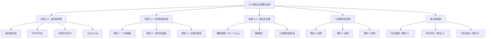

**相关笔记：** [[4.5 主定理]] | [[4.7 Akra-Bazzi递归]]

> [!abstract] 概览
> 本节给出了==连续主定理（continuous master theorem）==的完整证明，即在实数域上定义主递归关系式 $T(n) = aT(n/b) + f(n)$（无需处理取整），通过两个关键引理和递归树分析，严格推导出主定理三种情形的渐近界。证明的核心思路是：引理 4.2 将递归关系式的解转化为一个求和问题，引理 4.3 对该求和给出三种情形的渐近界，最终定理 4.4 将结果推广到任意阈值常数 $n_0 > 0$。
>
> - ==引理 4.2== 通过递归树将 $T(n) = aT(n/b) + f(n)$ 的解表示为叶代价与内部节点代价之和
> - ==引理 4.3== 对求和 $g(n) = \sum_{j=0}^{\lfloor \log_b n \rfloor} a^j f(n/b^j)$ 给出三种情形的渐近界
> - ==定理 4.4==（连续主定理）通过辅助函数 $T'(n) = T(n_0 n)$ 将结果推广到任意阈值
> - 情形 1 的证明利用几何级数上界，情形 2 利用调和级数/多项式级数，情形 3 利用正则性条件的几何衰减
> - 证明揭示了递归树中代价分布与三种情形的一一对应关系

---

知识结构总览

---

核心思想

> [!tip] 核心思想
> 本节的核心思想是通过==递归树求和==技术严格证明主定理。证明分为三个层次：首先，引理 4.2 利用递归树将递归关系式的解转化为一个显式的求和公式；然后，引理 4.3 对该求和公式在三种条件下分别给出渐近上界和下界；最后，定理 4.4 通过尺度变换将简化版本的结果推广到一般情况。整个证明的核心数学工具是==几何级数==的求和与放缩，以及正则性条件所保证的几何衰减性质。

### 1. 引理 4.2：递归树求和

> [!def] 引理 4.2（递归树求和公式）
> 设 $a > 0$，$b > 1$ 为常数，$f(n)$ 为定义在实数 $n \geq 1$ 上的函数。则递归关系式
> $$T(n) = \begin{cases} \Theta(1) & \text{若 } n < 1 \\ aT(n/b) + f(n) & \text{若 } n \geq 1 \end{cases}$$
>
> 的解为：
> $$T(n) = \Theta\left(n^{\log_b a}\right) + \sum_{j=0}^{\lfloor \log_b n \rfloor} a^j f\!\left(\frac{n}{b^j}\right)$$

> [!example] 引理 4.2 的证明：递归树分析
> 考虑递归树的结构：
>
> **【递归树分析（逐层展开）】**
>
> **内部节点分析：**
> - 根节点代价：$f(n)$，有 $a$ 个子节点
> - 深度 1 处：$a$ 个节点，每个代价 $f(n/b)$，总代价 $a \cdot f(n/b)$
> - 深度 2 处：$a^2$ 个节点，每个代价 $f(n/b^2)$，总代价 $a^2 \cdot f(n/b^2)$
> - 一般地，深度 $j$ 处：$a^j$ 个节点，每个代价 $f(n/b^j)$，总代价 $a^j f(n/b^j)$
>
> **叶节点分析：**
> - 树的高度为 $\lfloor \log_b n \rfloor + 1$（因为 $n/b^{\lfloor \log_b n \rfloor} \geq 1$ 且 $n/b^{\lfloor \log_b n \rfloor + 1} < 1$）
> - 叶节点数为 $a^{\lfloor \log_b n \rfloor + 1}$，利用恒等式 $a^{\log_b n} = n^{\log_b a}$，叶节点数渐近为 $n^{\log_b a}$
> - 每个叶节点代价为 $\Theta(1)$，总叶代价为 $\Theta(n^{\log_b a})$
>
> **求和：** 将所有深度的内部节点代价加上叶节点代价，即得公式 (4.18)。

### 2. 引理 4.3：求和的渐近界

> [!def] 引理 4.3（求和的渐近界）
> 设 $a > 0$，$b > 1$ 为常数，$f(n)$ 为定义在实数 $n \geq 1$ 上的函数。定义
> $$g(n) = \sum_{j=0}^{\lfloor \log_b n \rfloor} a^j f\!\left(\frac{n}{b^j}\right)$$
>
> 则 $g(n)$ 的渐近行为可由以下三种情形刻画：
>
> **情形 1：** 若存在 $\epsilon > 0$ 使得 $f(n) = O(n^{\log_b a - \epsilon})$，则 $g(n) = O(n^{\log_b a})$。
>
> **情形 2：** 若存在 $k \geq 0$ 使得 $f(n) = \Theta(n^{\log_b a} \lg^k n)$，则 $g(n) = \Theta(n^{\log_b a} \lg^{k+1} n)$。
>
> **情形 3：** 若存在 $0 < c < 1$ 使得 $0 < af(n/b) \leq cf(n)$ 对所有 $n \geq 1$ 成立，则 $g(n) = \Theta(f(n))$。

> [!example] 情形 1 的证明：几何级数上界
> 由条件 $f(n) = O(n^{\log_b a - \epsilon})$，存在常数 $d > 0$ 使得对所有足够大的 $n$，$f(n) \leq d \cdot n^{\log_b a - \epsilon}$。
>
> **【代入求和公式并化简】** 代入求和公式：
> $$g(n) = \sum_{j=0}^{\lfloor \log_b n \rfloor} a^j f\!\left(\frac{n}{b^j}\right) \leq \sum_{j=0}^{\lfloor \log_b n \rfloor} a^j \cdot d \cdot \left(\frac{n}{b^j}\right)^{\log_b a - \epsilon}$$
>
> 化简被加项：
> $$a^j \cdot \left(\frac{n}{b^j}\right)^{\log_b a - \epsilon} = a^j \cdot n^{\log_b a - \epsilon} \cdot b^{-j(\log_b a - \epsilon)} = n^{\log_b a - \epsilon} \cdot \frac{a^j}{b^{j \log_b a} \cdot b^{-j\epsilon}}$$
>
> **【利用 b^{log_b a}=a 消去】** 由于 $b^{\log_b a} = a$，因此 $a^j / b^{j \log_b a} = 1$，被加项简化为：
> $$n^{\log_b a - \epsilon} \cdot b^{j\epsilon}$$
>
> **【几何级数求和（公比 b^epsilon > 1）】** 因此：
> $$g(n) \leq d \cdot n^{\log_b a - \epsilon} \sum_{j=0}^{\lfloor \log_b n \rfloor} b^{j\epsilon} = d \cdot n^{\log_b a - \epsilon} \cdot \frac{b^{\epsilon(\lfloor \log_b n \rfloor + 1)} - 1}{b^\epsilon - 1}$$
>
> 这是一个公比为 $b^\epsilon > 1$ 的几何级数。分母 $b^\epsilon - 1$ 是常数，分子中 $b^{\epsilon \lfloor \log_b n \rfloor} \leq b^{\epsilon \log_b n} = n^\epsilon$。因此：
> $$g(n) = O(n^{\log_b a - \epsilon} \cdot n^\epsilon) = O(n^{\log_b a})$$

> [!example] 情形 2 的证明：多项式级数
> 由条件 $f(n) = \Theta(n^{\log_b a} \lg^k n)$，存在常数 $d_1, d_2 > 0$ 使得：
> $$d_1 \cdot n^{\log_b a} \lg^k n \leq f(n) \leq d_2 \cdot n^{\log_b a} \lg^k n$$
>
> **【代入求和并利用 a^j*(n/b^j)^{log_b a}=n^{log_b a}】** 代入求和公式并利用 $a^j \cdot (n/b^j)^{\log_b a} = n^{\log_b a}$：
> $$g(n) = \sum_{j=0}^{\lfloor \log_b n \rfloor} a^j f\!\left(\frac{n}{b^j}\right) = \Theta\!\left(\sum_{j=0}^{\lfloor \log_b n \rfloor} n^{\log_b a} \lg^k\!\left(\frac{n}{b^j}\right)\right)$$
>
> 注意 $\lg(n/b^j) = \lg n - j \lg b = \lg n - \Theta(j)$。令 $L = \lfloor \log_b n \rfloor$，则：
> $$g(n) = \Theta\!\left(n^{\log_b a} \sum_{j=0}^{L} (\lg n - j \lg b)^k\right)$$
>
> **【上下界夹逼（上界+下界）】**
>
> **上界估计：** $(\lg n - j \lg b)^k \leq (\lg n)^k$，因此求和 $\leq (L+1)(\lg n)^k = \Theta(\lg^{k+1} n)$。
>
> **下界估计：** 取前 $\lceil L/2 \rceil$ 项，此时 $j \leq L/2$，$\lg n - j \lg b \geq \lg n / 2$，因此 $(\lg n - j \lg b)^k \geq (\lg n / 2)^k = \Theta(\lg^k n)$。求和 $\geq (L/2) \cdot \Theta(\lg^k n) = \Theta(\lg^{k+1} n)$。
>
> **【上下界匹配】** 上下界匹配，因此 $g(n) = \Theta(n^{\log_b a} \lg^{k+1} n)$。

> [!example] 情形 3 的证明：正则性条件的几何衰减
> **【正则性条件迭代放缩】** 由条件 $af(n/b) \leq cf(n)$（$0 < c < 1$），迭代 $j$ 次得：
> $$a^j f(n/b^j) \leq c^j f(n)$$
>
> 代入求和公式：
> $$g(n) = \sum_{j=0}^{\lfloor \log_b n \rfloor} a^j f(n/b^j) \leq \sum_{j=0}^{\lfloor \log_b n \rfloor} c^j f(n) = f(n) \sum_{j=0}^{\lfloor \log_b n \rfloor} c^j$$
>
> **【几何级数求和（公比 c < 1）】** 这是一个公比为 $c < 1$ 的几何级数，其和为：
> $$f(n) \cdot \frac{1 - c^{\lfloor \log_b n \rfloor + 1}}{1 - c} \leq f(n) \cdot \frac{1}{1 - c} = O(f(n))$$
>
> **【上下界夹逼（O+Omega=Theta）】** 另一方面，$g(n)$ 的定义中 $j = 0$ 的项就是 $f(n)$，且所有项非负，因此 $g(n) \geq f(n) = \Omega(f(n))$。
>
> 综合得 $g(n) = \Theta(f(n))$。

### 3. 定理 4.4：连续主定理

> [!def] 定理 4.4（连续主定理）
> 设 $a > 0$，$b > 1$ 为常数，$f(n)$ 为定义在所有足够大实数上的非负驱动函数。定义算法递归关系式 $T(n)$（$n > 0$）为：
> $$T(n) = aT(n/b) + f(n)$$
>
> 则 $T(n)$ 的渐近行为可由以下三种情形刻画：
>
> **情形 1：** 若存在 $\epsilon > 0$ 使得 $f(n) = O(n^{\log_b a - \epsilon})$，则 $T(n) = \Theta(n^{\log_b a})$。
>
> **情形 2：** 若存在 $k \geq 0$ 使得 $f(n) = \Theta(n^{\log_b a} \lg^k n)$，则 $T(n) = \Theta(n^{\log_b a} \lg^{k+1} n)$。
>
> **情形 3：** 若存在 $\epsilon > 0$ 使得 $f(n) = \Omega(n^{\log_b a + \epsilon})$，且 $f(n)$ 满足正则性条件 $af(n/b) \leq cf(n)$（$c < 1$，所有足够大的 $n$），则 $T(n) = \Theta(f(n))$。

> [!example] 定理 4.4 的证明：尺度变换
> 证明的核心思路是通过辅助函数将任意阈值 $n_0 > 0$ 的递归关系式转化为引理 4.2 中阈值 $n_0 = 1$ 的形式。
>
> **【尺度变换（定义辅助函数 T'(n)=T(n_0*n)）】** 定义辅助函数：对 $n > 0$，令 $T'(n) = T(n_0 n)$，$f'(n) = f(n_0 n)$。则：
> $$T'(n) = T(n_0 n) = aT(n_0 n / b) + f(n_0 n) = aT'(n/b) + f'(n)$$
>
> **【引用引理4.2的求和公式】** 这正是引理 4.2 的形式，因此：
> $$T'(n) = \Theta(n^{\log_b a}) + \sum_{j=0}^{\lfloor \log_b n \rfloor} a^j f'(n/b^j)$$
>
> **情形 1 的验证：** 由 $f(n) = O(n^{\log_b a - \epsilon})$ 得 $f'(n) = f(n_0 n) = O((n_0 n)^{\log_b a - \epsilon}) = O(n^{\log_b a - \epsilon})$（因为 $n_0$ 是常数）。由引理 4.3 情形 1，求和为 $O(n^{\log_b a})$。因此：
> $$T(n) = T'(n/n_0) = \Theta((n/n_0)^{\log_b a}) + O((n/n_0)^{\log_b a}) = \Theta(n^{\log_b a})$$
>
> **情形 2 的验证：** 类似地，$f'(n) = \Theta(n^{\log_b a} \lg^k n)$，由引理 4.3 情形 2，求和为 $\Theta(n^{\log_b a} \lg^{k+1} n)$。因此：
> $$T(n) = T'(n/n_0) = \Theta(n^{\log_b a} \lg^{k+1} n)$$
>
> **情形 3 的验证：** $f'(n) = \Omega(n^{\log_b a + \epsilon})$ 的推导与情形 1 类似。正则性条件的验证：
> $$af'(n/b) = af(n_0 n / b) \leq cf(n_0 n) = cf'(n)$$
> （因为 $n_0 n / b \geq n_0$ 对所有 $n \geq b$ 成立，且 $n_0 > 0$。）由引理 4.3 情形 3，求和为 $\Theta(f'(n))$。因此：
> $$T(n) = T'(n/n_0) = \Theta(f'(n/n_0)) = \Theta(f(n))$$

### 4. 递归树视角下的三种情形

> [!tip] 递归树代价分布与三种情形的对应
> 从递归树的视角，三种情形对应三种典型的代价分布模式：
>
> **情形 1（代价递增）：** 每层代价从根到叶至少按几何级数增长（公比 $b^\epsilon > 1$）。叶层代价 $n^{\log_b a}$ 主导所有内部节点的总代价。
>
> **情形 2（代价均匀/多项式增长）：** 每层代价大致相同（$k = 0$ 时）或按多项式增长（$k > 0$ 时）。$\Theta(\lg n)$ 层的总代价为 $\Theta(n^{\log_b a} \lg^{k+1} n)$。
>
> **情形 3（代价递减）：** 每层代价从根到叶至少按几何级数递减（公比 $c < 1$）。根节点代价 $f(n)$ 主导所有其他节点的总代价。
>
> 这种"三模式"分类是理解主定理的直觉基础：递归树的代价要么集中在叶（情形 1），要么均匀分布（情形 2），要么集中在根（情形 3）。

---

补充理解与拓展

> [!info] 连续版本与离散版本的关系
> 连续主定理（定理 4.4）在实数域上定义递归关系式，避免了取整操作带来的技术困难。而完整的[[4.5 主定理]]（定理 4.1）在自然数域上定义，隐式处理了 $\lfloor n/b \rfloor$ 和 $\lceil n/b \rceil$ 的取整。连续版本的证明包含了主定理的核心数学思想，而取整处理只是技术性的附加工作。[[4.7 Akra-Bazzi递归]]进一步讨论了在更一般的分治递归中如何处理取整问题。
>
> > 来源：T. H. Cormen et al., *Introduction to Algorithms*, 4th ed., MIT Press, 2022, Section 4.6.

> [!info] 情形 3 的"过述"性质
> 一个有趣的事实是：情形 3 的条件实际上是"过述"的（overstated）。练习 4.6-2 指出，正则性条件 $af(n/b) \leq cf(n)$（$c < 1$）本身就蕴含了 $f(n) = \Omega(n^{\log_b a + \epsilon})$ 对某个 $\epsilon > 0$ 成立。也就是说，如果正则性条件满足，则 $f(n)$ 自动多项式地大于分水岭函数，无需额外验证。然而在主定理的表述中，两个条件都被列出，是为了让使用者更容易理解和应用。
>
> > 来源：T. H. Cormen et al., *Introduction to Algorithms*, 4th ed., MIT Press, 2022, Exercise 4.6-2.

---

易混淆点与辨析

> [!warning] "证明中 $a$ 不必为整数"与"递归树需要整数个子节点"的混淆
> 初学者可能困惑：递归树中每个节点有 $a$ 个子节点，但 $a$ 不一定是整数。
>
> - 递归树是一种可视化工具，在概念上将 $a$ 视为整数有助于理解
> - 但数学推导中，$a$ 只是一个正实数常数，$a^j$ 的计算不需要 $a$ 为整数
> - 连续主定理在实数域上定义，$T(n/b)$ 中的 $n/b$ 也不需要是整数
>
> 关键区别：连续版本的证明纯粹是实数分析，不依赖组合计数；而离散版本（带取整）的证明才需要更仔细的处理。

> [!warning] 引理 4.3 情形 3 不要求 $f(n) = \Omega(n^{\log_b a + \epsilon})$
> 注意引理 4.3 的情形 3 只要求正则性条件 $af(n/b) \leq cf(n)$，而**不要求** $f(n) = \Omega(n^{\log_b a + \epsilon})$。这是因为在引理 4.3 中，我们直接对求和 $g(n)$ 进行放缩，正则性条件本身就足以保证 $g(n) = \Theta(f(n))$。
>
> 而在定理 4.4（连续主定理）中，情形 3 列出了两个条件。如前所述，正则性条件实际上蕴含了多项式分离条件，所以第二个条件是冗余的，但列出它有助于理解定理的完整结构。

---

习题精选

| 题号 | 核心考点 | 难度 |
|:----:|---------|:----:|
| 4.6-1 | 情形 2 求和的下界 | ⭐⭐⭐ |
| 4.6-2 | 情形 3 的过述性质 | ⭐⭐⭐⭐ |
| 4.6-3 | 间隙情形的求解 | ⭐⭐⭐⭐ |

> [!faq]- 4.6-1 证明 $\sum_{j=0}^{\lfloor \log_b n \rfloor} (\lg n - j \lg b)^k = \Omega(\lg^{k+1} n)$。
> 令 $L = \lfloor \log_b n \rfloor$。取前 $\lceil L/2 \rceil$ 项（即 $j = 0, 1, \ldots, \lceil L/2 \rceil - 1$）：
>
> 对这些项，$j \leq L/2 \leq \log_b n / 2$，因此：
> $$\lg n - j \lg b \geq \lg n - \frac{\log_b n}{2} \cdot \lg b = \lg n - \frac{\lg n}{2} = \frac{\lg n}{2}$$
>
> 因此 $(\lg n - j \lg b)^k \geq (\lg n / 2)^k = 2^{-k} \lg^k n$。
>
> 求和的下界为：
> $$\sum_{j=0}^{\lceil L/2 \rceil - 1} (\lg n - j \lg b)^k \geq \frac{L}{2} \cdot 2^{-k} \lg^k n = \Omega(\log_b n \cdot \lg^k n) = \Omega(\lg n \cdot \lg^k n) = \Omega(\lg^{k+1} n)$$

> [!faq]- 4.6-2 证明情形 3 是过述的：正则性条件 $af(n/b) \leq cf(n)$（$c < 1$）蕴含存在 $\epsilon > 0$ 使得 $f(n) = \Omega(n^{\log_b a + \epsilon})$。
> **【正则性条件迭代放缩】** 由正则性条件，迭代 $j$ 次得 $a^j f(n/b^j) \leq c^j f(n)$，即：
> $$f(n) \geq \frac{a^j}{c^j} f(n/b^j) = \left(\frac{a}{c}\right)^j f(n/b^j)$$
>
> **【取 j=floor(log_b n) 并利用正下界】** 取 $j = \lfloor \log_b n \rfloor$，则 $n/b^j \geq 1$。假设 $f$ 在 $[1, \infty)$ 上有正下界 $m > 0$（因为 $f$ 是非负的且递归是算法性的），则：
> $$f(n) \geq m \cdot \left(\frac{a}{c}\right)^{\log_b n} = m \cdot n^{\log_b(a/c)}$$
>
> **【提取 epsilon = log_b(1/c) > 0】** 由于 $c < 1$，$\log_b(a/c) = \log_b a + \log_b(1/c) > \log_b a$。取 $\epsilon = \log_b(1/c) > 0$，则：
> $$f(n) \geq m \cdot n^{\log_b a + \epsilon}$$
>
> 因此 $f(n) = \Omega(n^{\log_b a + \epsilon})$。

> [!faq]- 4.6-3 对 $f(n) = n / \lg n$，证明求和 (4.19) 的解为 $\Theta(n \lg \lg n)$，并推出主递归关系式的解为 $\Theta(n \lg \lg n)$。
> **【直接计算求和（变量替换 i=lg n-j）】** 此函数落入情形 1 和情形 2 之间的间隙。直接计算求和：
> $$g(n) = \sum_{j=0}^{\lfloor \log_2 n \rfloor} 2^j \cdot \frac{n/2^j}{\lg(n/2^j)} = \sum_{j=0}^{\lfloor \log_2 n \rfloor} \frac{n}{\lg n - j}$$
>
> 令 $i = \lg n - j$，则 $i$ 从 $\lg n$ 递减到 $\lg n - \lfloor \log_2 n \rfloor \geq 0$：
> $$g(n) = n \sum_{i=\lg n - \lfloor \log_2 n \rfloor}^{\lg n} \frac{1}{i} \approx n \sum_{i=1}^{\lg n} \frac{1}{i} = n \cdot H_{\lg n}$$
>
> **【调和数近似 H_m = Theta(lg m)】** 其中 $H_m$ 是第 $m$ 个调和数。由于 $H_m = \Theta(\ln m) = \Theta(\lg m)$，因此：
> $$g(n) = \Theta(n \lg \lg n)$$
>
> 由于叶代价 $n^{\log_2 2} = n = O(n \lg \lg n)$，因此 $T(n) = \Theta(n \lg \lg n)$。

---

视频学习指南

| 资源 | 链接 | 对应内容 | 备注 |
|------|------|---------|------|
| MIT 6.046 Lecture 2: Master Theorem Proof | https://www.youtube.com/watch?v=ZfBMFhbBClk | 主定理证明的详细讲解 | Erik Demaine 教授 |
| Abdul Bari - Master Theorem Proof | https://www.youtube.com/watch?v=Oyn1v2xqFg0 | 主定理证明的直觉理解 | 适合入门 |

---

教材原文

> [!quote] 教材原文摘录
> "Proving the master theorem (Theorem 4.1) in its full generality, especially dealing with the knotty technical issue of floors and ceilings, is beyond the scope of this book. This section, however, states and proves a variant of the master theorem, called the continuous master theorem, in which the master recurrence is defined over sufficiently large positive real numbers."
>
> "The proof of the continuous master theorem involves two lemmas. Lemma 4.2 uses a slightly simplified master recurrence with a threshold constant of $n_0 = 1$. The lemma employs a recursion tree to reduce the solution of the simplified master recurrence to that of evaluating a summation. Lemma 4.3 then provides asymptotic bounds for the summation, mirroring the three cases of the master theorem."
>
> "The three cases of the master theorem depend on the distribution of the total cost across levels of the recursion tree: Case 1: The costs increase geometrically from the root to the leaves. Case 2: The costs depend on the value of $k$ in the theorem. Case 3: The costs decrease geometrically from the root to the leaves."

---

## 参见 Wiki

- [[算法导论/concepts/主定理]]
- [[算法导论/concepts/递归树]]
- [[算法导论/concepts/分治法]]
- [[算法导论/concepts/渐近记号]]

#学习/算法导论/分治策略/主定理证明
