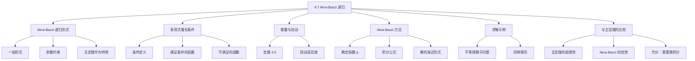

**相关笔记：** [[4.6 连续主定理的证明]]

> [!abstract] 概览
> 本节介绍了==Akra-Bazzi 方法==——一种求解分治递归关系式的强大推广工具。内容涵盖 Akra-Bazzi 递归的一般形式、==多项式增长条件（polynomial-growth condition）==及其在处理取整问题中的作用、Akra-Bazzi 定理的求解公式（涉及微积分中的积分运算）、详细的求解示例，以及与[[4.5 主定理]]的比较。Akra-Bazzi 方法能够处理主定理无法覆盖的不等规模子问题、间隙情形等复杂递归。
>
> - ==Akra-Bazzi 递归==形如 $T(n) = \sum_{i=1}^k a_i T(n/b_i) + f(n)$，允许不同子问题具有不同规模
> - 求解关键：找到唯一实数 $p$ 使得 $\sum_{i=1}^k a_i / b_i^p = 1$
> - 解的形式：$T(n) = \Theta\!\left(n^p \left(1 + \int_1^n \frac{f(u)}{u^{p+1}} du\right)\right)$
> - ==多项式增长条件==保证取整操作不影响渐近解
> - Akra-Bazzi 方法是[[4.5 主定理]]的真推广，能处理主定理的间隙情形和不等规模子问题

---

知识结构总览

---

核心思想

> [!tip] 核心思想
> 本节的核心思想是==Akra-Bazzi 方法==：对于形如 $T(n) = \sum_{i=1}^k a_i T(n/b_i) + f(n)$ 的分治递归关系式，通过找到一个"平衡指数" $p$（使得 $\sum a_i / b_i^p = 1$），再利用积分运算求出渐近解。Akra-Bazzi 方法是[[4.5 主定理]]的严格推广——当所有 $b_i$ 相等时退化为 master theorem。其优势在于能处理不等规模子问题和主定理的间隙情形，代价是需要微积分知识。

### 1. Akra-Bazzi 递归的一般形式

> [!def] Akra-Bazzi 递归
> ==Akra-Bazzi 递归==具有如下形式：
> $$T(n) = \begin{cases} \Theta(1) & \text{若 } n < n_0 \\ \displaystyle\sum_{i=1}^{k} a_i T(n/b_i) + f(n) & \text{若 } n \geq n_0 \end{cases}$$
>
> 其中：
> - $k$ 是正整数（子问题的种类数）
> - $a_1, a_2, \ldots, a_k \in \mathbb{R}$ 严格为正（各类子问题的数量）
> - $b_1, b_2, \ldots, b_k \in \mathbb{R}$ 严格大于 $1$（各类子问题的规模缩小因子）
> - $f(n)$ 是定义在足够大非负实数上的非负==驱动函数==
>
> Akra-Bazzi 递归推广了主递归关系式：主定理要求所有子问题规模相同（$b_i = b$），而 Akra-Bazzi 允许不同子问题具有不同规模。

> [!example] 主定理作为 Akra-Bazzi 的特例
> 当 $k = 1$，$a_1 = a$，$b_1 = b$ 时，Akra-Bazzi 递归退化为：
> $$T(n) = aT(n/b) + f(n)$$
> 这正是[[4.5 主定理]]中的主递归关系式。此时平衡方程为 $a/b^p = 1$，解得 $p = \log_b a$，与主定理的分水岭函数指数一致。

### 2. 多项式增长条件

> [!def] 多项式增长条件（Polynomial-Growth Condition）
> 定义在所有足够大正实数上的函数 $f(n)$ ==满足多项式增长条件==，如果存在常数 $\alpha$ 使得以下成立：对每个常数 $\phi \geq 1$，存在常数 $d > 1$（依赖于 $\phi$）使得：
> $$f(n)/d \leq f(\psi n) \leq d f(n) \quad \text{对所有 } 1 \leq \psi \leq \phi \text{ 和足够大的 } n$$
>
> 直觉理解：该条件粗略地说就是 $f(\Theta(n)) = \Theta(f(n))$——将参数缩放一个常数倍，函数值也只变化一个常数倍。但多项式增长条件实际上比 $f(\Theta(n)) = \Theta(f(n))$ 稍强。
>
> 该条件蕴含 $f(n)$ 是渐近正的（即存在 $n_0 \geq 0$ 使得 $f(n) > 0$ 对所有 $n \geq n_0$）。

> [!example] 满足与不满足多项式增长条件的函数
> **满足条件的函数：**
> - 任何形如 $f(n) = \Theta(n^\alpha \lg^\beta n \lg \lg^\gamma n)$ 的函数（$\alpha, \beta, \gamma$ 为常数）
> - 大多数本书中使用的多项式有界函数
>
> **不满足条件的函数：**
> - 指数函数 $f(n) = 2^n$（缩放参数对指数函数影响太大）
> - 超指数函数
> - 某些精心构造的多项式有界函数（见练习 4.7-4）

### 3. 取整与扰动

> [!def] 定理 4.5（取整不影响渐近解）
> 设 $T(n)$ 是定义在非负实数上满足 Akra-Bazzi 递归 (4.22) 的函数，其中 $f(n)$ 满足多项式增长条件。设 $T'(n)$ 是定义在自然数上也满足递归 (4.22) 的函数，但每个 $T(n/b_i)$ 被替换为 $T(\lceil n/b_i \rceil)$ 或 $T(\lfloor n/b_i \rfloor)$。则 $T'(n) = \Theta(T(n))$。
>
> 该定理保证了：当驱动函数满足多项式增长条件时，取整操作不会改变渐近解。

> [!tip] 扰动容忍度
> 取整只是对递归参数的微小扰动（最多为 1）。实际上，Akra-Bazzi 方法能容忍更大的扰动：只要 $f(n)$ 满足多项式增长条件，将 $T(n/b_i)$ 替换为 $T(n/b_i + h_i(n))$（其中 $|h_i(n)| = O(n / \lg^{1+\epsilon} n)$，$\epsilon > 0$）不影响渐近解。
>
> 这意味着分治算法的分解步骤可以适度粗糙，而不影响运行时间递归关系式的渐近解。

### 4. Akra-Bazzi 方法

> [!def] Akra-Bazzi 方法
> 给定 Akra-Bazzi 递归 $T(n) = \sum_{i=1}^k a_i T(n/b_i) + f(n)$，求解步骤如下：
>
> **步骤 1：** 找到唯一实数 $p$ 使得
> $$\sum_{i=1}^{k} \frac{a_i}{b_i^p} = 1$$
>
> 这样的 $p$ 总是存在且唯一，因为：当 $p \to -\infty$ 时求和趋于 $\infty$；当 $p \to +\infty$ 时求和趋于 $0$；且求和关于 $p$ 严格递减。
>
> **步骤 2：** 解为
> $$T(n) = \Theta\!\left(n^p \left(1 + \int_1^n \frac{f(u)}{u^{p+1}} \, du\right)\right)$$

> [!example] 例 1：不等规模子问题
> 考虑递归关系式：
> $$T(n) = T(n/5) + T(7n/10) + n$$
>
> （类似的递归将在第 9 章的中位数选择算法中出现。）
>
> **步骤 1：** 确定 $p$。$a_1 = a_2 = 1$，$b_1 = 5$，$b_2 = 10/7$。平衡方程为：
> $$\frac{1}{5^p} + \frac{1}{(10/7)^p} = 1 \quad \Longleftrightarrow \quad \left(\frac{1}{5}\right)^p + \left(\frac{7}{10}\right)^p = 1$$
>
> **【解平衡方程（夹逼确定 p 的范围）】** 精确解为 $p \approx 0.83978$，但无需知道精确值。观察：
> - $p = 0$ 时：$(1/5)^0 + (7/10)^0 = 1 + 1 = 2 > 1$
> - $p = 1$ 时：$(1/5)^1 + (7/10)^1 = 1/5 + 7/10 = 9/10 < 1$
> - 因此 $0 < p < 1$
>
> **【计算积分（幂函数积分）】** $f(n) = n$，$f(u)/u^{p+1} = u / u^{p+1} = u^{-p}$。由于 $p \neq -1$：
> $$\int_1^n u^{-p} \, du = \left.\frac{u^{1-p}}{1-p}\right|_1^n = \frac{n^{1-p} - 1}{1-p} = \Theta(n^{1-p})$$
>
> **【合并结果（n^p * n^{1-p} = n）】** 因此：
> $$T(n) = \Theta\!\left(n^p (1 + \Theta(n^{1-p}))\right) = \Theta(n^p \cdot n^{1-p}) = \Theta(n)$$

> [!example] 例 2：主定理间隙情形 $T(n) = 2T(n/2) + n / \lg n$
> 此递归在[[4.5 主定理]]中落入情形 1 和情形 2 之间的间隙，主定理无法处理。使用 Akra-Bazzi 方法：
>
> **步骤 1：** $a_1 = 2$，$b_1 = 2$，平衡方程 $2/2^p = 1$，解得 $p = 1$。
>
> **【计算积分（对数积分 int 1/(u*lg u) du）】** $f(n) = n / \lg n$，$f(u)/u^{p+1} = (u / \lg u) / u^2 = 1/(u \lg u)$。
> $$\int_1^n \frac{1}{u \lg u} \, du = \ln \lg n = \Theta(\lg \lg n)$$
>
> 因此：
> $$T(n) = \Theta\!\left(n^1 (1 + \Theta(\lg \lg n))\right) = \Theta(n \lg \lg n)$$
>
> 这与[[4.6 连续主定理的证明]]中练习 4.6-3 的结果一致。

### 5. 与主定理的比较

> [!tip] Akra-Bazzi 方法 vs 主定理
>
> | 特性 | [[4.5 主定理]] | Akra-Bazzi 方法 |
> |------|:---:|:---:|
> | 子问题规模 | 必须相同（$n/b$） | 可以不同（$n/b_i$） |
> | 间隙情形 | 无法处理 | 可以处理 |
> | 取整处理 | 自动忽略 | 需要多项式增长条件 |
> | 数学工具 | 仅需代数 | 需要微积分（积分） |
> | 使用难度 | 简单（判定情形即可） | 较复杂（需解方程和计算积分） |
> | 适用范围 | 较窄但覆盖大多数实际情形 | 更广，是主定理的真推广 |
>
> **实用建议：** 优先尝试主定理——当它适用时，远比 Akra-Bazzi 简单。只有当主定理不适用时（间隙情形、不等规模子问题、正则性条件失败），才使用 Akra-Bazzi 方法。

---

补充理解与拓展

> [!info] Akra-Bazzi 方法的历史
> Akra-Bazzi 方法由 Mohamad Akra 和 Louay Bazzi 于 1998 年在论文 "On the solution of linear recurrence equations" 中正式提出。该方法统一了此前多种分治递归的求解技术。实际上，Tom Leighton 在 1996 年的讲义中就已经给出了类似的结果。Akra-Bazzi 方法的核心创新在于：(1) 允许不同子问题具有不同规模；(2) 通过积分统一了三种情形的解；(3) 给出了忽略取整的充分条件（多项式增长条件）。[[4.5 主定理]]可以视为 Akra-Bazzi 方法在 $k = 1$ 时的特例。
>
> > 来源：M. Akra, L. Bazzi, "On the solution of linear recurrence equations," *Computational Optimization and Applications*, 10(2):195-210, 1998; T. Leighton, *Notes on better master theorems for divide-and-conquer recurrences*, MIT, 1996.

> [!info] Akra-Bazzi 方法与连续主定理的关系
> 练习 4.7-6 要求使用 Akra-Bazzi 方法证明[[4.6 连续主定理的证明]]中的连续主定理。这体现了 Akra-Bazzi 方法的强大之处：它不仅能处理更一般的递归，还能作为证明主定理的工具。当 $k = 1$ 时，Akra-Bazzi 的平衡方程 $a/b^p = 1$ 给出 $p = \log_b a$，积分公式退化为三种情形的解，与连续主定理完全一致。
>
> > 来源：T. H. Cormen et al., *Introduction to Algorithms*, 4th ed., MIT Press, 2022, Exercise 4.7-6.

---

易混淆点与辨析

> [!warning] "Akra-Bazzi 总能处理"与"需要多项式增长条件"的混淆
> 初学者可能认为 Akra-Bazzi 方法是万能的，能处理任何分治递归。
>
> - ❌ "Akra-Bazzi 方法适用于所有分治递归关系式"
> - ✅ "Akra-Bazzi 方法要求驱动函数满足多项式增长条件（如果要忽略取整），且需要计算积分。对于不满足多项式增长条件的驱动函数（如指数函数），需要额外小心"
>
> 多项式增长条件在实践中几乎总是满足的，但理论上存在反例。

> [!warning] "平衡方程的精确解"与"只需估计范围"的混淆
> 初学者在求解平衡方程时常试图求出 $p$ 的精确值。
>
> - ❌ "必须求出 $p$ 的精确数值才能使用 Akra-Bazzi 方法"
> - ✅ "在很多情况下，只需确定 $p$ 的范围就足以求出渐近解。例如知道 $0 < p < 1$ 就足以判定积分 $\int u^{-p} du = \Theta(n^{1-p})$ 的阶"
>
> 关键观察：Akra-Bazzi 解中的 $n^p$ 因子和积分中的 $u^{-p}$ 会相互抵消或组合，最终结果往往只依赖于 $p$ 的范围而非精确值。

> [!warning] Akra-Bazzi 积分中 $p = -1$ 的特殊情况
> 当 $p = -1$ 时，积分 $\int_1^n u^{-p} du = \int_1^n u \, du = \Theta(n^2)$ 的计算方式不同。更一般地，当 $f(u)/u^{p+1}$ 的原函数涉及 $\ln$ 时（即被积函数为 $1/u$ 的形式），需要使用 $\int 1/u \, du = \ln u$。这是微积分中的基本技巧，但在算法分析中容易被忽略。

---

习题精选

| 题号 | 核心考点 | 难度 |
|:----:|---------|:----:|
| 4.7-1 | 驱动函数的渐近可去性 | ⭐⭐⭐ |
| 4.7-2 | 多项式增长条件的验证 | ⭐⭐ |
| 4.7-3 | 多项式增长蕴含渐近正性 | ⭐⭐ |
| 4.7-4 | $f(\Theta(n)) = \Theta(f(n))$ 不蕴含多项式增长 | ⭐⭐⭐⭐ |
| 4.7-5 | Akra-Bazzi 方法的应用 | ⭐⭐⭐ |

> [!faq]- 4.7-2 证明 $f(n) = n^2$ 满足多项式增长条件，但 $f(n) = 2^n$ 不满足。
> **$f(n) = n^2$：** **【直接验证（缩放因子有界）】** 对任意 $\phi \geq 1$ 和 $1 \leq \psi \leq \phi$，$f(\psi n) / f(n) = (\psi n)^2 / n^2 = \psi^2 \leq \phi^2$。取 $d = \phi^2 > 1$，则 $f(n)/d \leq f(\psi n) \leq d f(n)$。条件满足。
>
> **$f(n) = 2^n$：** **【反证法（指数函数无界）】** 取 $\phi = 2$。$f(2n) / f(n) = 2^{2n} / 2^n = 2^n$。不存在常数 $d > 1$ 使得 $2^n \leq d$ 对所有足够大的 $n$ 成立。条件不满足。

> [!faq]- 4.7-5 使用 Akra-Bazzi 方法求解以下递归关系式。
> **a.** $T(n) = T(n/2) + T(n/3) + T(n/6) + n \lg n$
> - $a_1 = a_2 = a_3 = 1$，$b_1 = 2$，$b_2 = 3$，$b_3 = 6$
> - 平衡方程：$1/2^p + 1/3^p + 1/6^p = 1$。$p = 1$：$1/2 + 1/3 + 1/6 = 1$ ✓，所以 $p = 1$
> - $f(n) = n \lg n$，$f(u)/u^{p+1} = u \lg u / u^2 = \lg u / u$
> - $\int_1^n (\lg u)/u \, du = \frac{1}{2} \lg^2 n = \Theta(\lg^2 n)$
> - $T(n) = \Theta(n(1 + \lg^2 n)) = \Theta(n \lg^2 n)$
>
> **b.** $T(n) = 3T(n/3) + 8T(n/4) + n^2 / \lg n$
> - 平衡方程：$3/3^p + 8/4^p = 3^{1-p} + 8 \cdot 4^{-p} = 1$
> - $p = 1$：$3^0 + 8/4 = 1 + 2 = 3 > 1$；$p = 2$：$3^{-1} + 8/16 = 1/3 + 1/2 = 5/6 < 1$
> - 因此 $1 < p < 2$。$f(u)/u^{p+1} = u^2 / (\lg u \cdot u^{p+1}) = u^{1-p} / \lg u$
> - $\int_1^n u^{1-p} / \lg u \, du$：由于 $1 - p < 0$，$u^{1-p}$ 递减，积分收敛于常数。更精确地，$u^{1-p} / \lg u = o(u^{1-p})$，$\int_1^n u^{1-p} du = \Theta(n^{2-p})$
> - $T(n) = \Theta(n^p \cdot n^{2-p}) = \Theta(n^2)$（积分主导）
>
> **c.** $T(n) = (2/3)T(n/3) + (1/3)T(2n/3) + \lg n$
> - 平衡方程：$(2/3)/3^p + (1/3)/(3/2)^p = 1$
> - $p = 0$：$2/3 + 1/3 = 1$ ✓，所以 $p = 0$
> - $f(u)/u^{p+1} = \lg u / u$
> - $\int_1^n (\lg u)/u \, du = \frac{1}{2}\lg^2 n = \Theta(\lg^2 n)$
> - $T(n) = \Theta(1 \cdot (1 + \lg^2 n)) = \Theta(\lg^2 n)$
>
> **d.** $T(n) = (1/3)T(n/3) + 1/n$
> - 平衡方程：$(1/3)/3^p = 1$，即 $3^{-(p+1)} = 1$，$p = -1$
> - $f(u)/u^{p+1} = (1/u) / u^0 = 1/u$
> - $\int_1^n 1/u \, du = \ln n = \Theta(\lg n)$
> - $T(n) = \Theta(n^{-1}(1 + \lg n)) = \Theta(\lg n / n)$
>
> **e.** $T(n) = 3T(n/3) + 3T(2n/3) + n^2$
> - 平衡方程：$3/3^p + 3/(3/2)^p = 3^{1-p} + 3 \cdot (2/3)^p = 1$
> - $p = 1$：$1 + 2 = 3 > 1$；$p = 2$：$1/3 + 3 \cdot 4/9 = 1/3 + 4/3 = 5/3 > 1$；$p = 3$：$1/9 + 3 \cdot 8/27 = 1/9 + 8/9 = 1$ ✓
> - 所以 $p = 3$。$f(u)/u^{p+1} = u^2 / u^4 = u^{-2}$
> - $\int_1^n u^{-2} \, du = 1 - 1/n = \Theta(1)$
> - $T(n) = \Theta(n^3(1 + \Theta(1))) = \Theta(n^3)$

---

视频学习指南

| 资源 | 链接 | 对应内容 | 备注 |
|------|------|---------|------|
| MIT 6.046 Recitation 2: Akra-Bazzi | https://www.youtube.com/watch?v=7sGm5qIVa7k | Akra-Bazzi 方法的讲解与例题 | MIT 课程 |
| Akra-Bazzi Theorem - Full Explanation | https://www.youtube.com/watch?v=Xj1F6pC5jCw | Akra-Bazzi 定理的完整推导 | 适合进阶学习 |

---

教材原文

> [!quote] 教材原文摘录
> "We'll look at the class of algorithmic divide-and-conquer recurrences originally studied by M. Akra and L. Bazzi. These Akra-Bazzi recurrences take the form $T(n) = \sum_{i=1}^k a_i T(n/b_i) + f(n)$. Akra-Bazzi recurrences generalize the class of recurrences addressed by the master theorem."
>
> "The Akra-Bazzi method involves first determining the unique real number $p$ such that $\sum_{i=1}^k a_i / b_i^p = 1$. Such a $p$ always exists, because when $p \to -\infty$, the sum goes to $\infty$; it decreases as $p$ increases; and when $p \to \infty$, it goes to $0$."
>
> "Although the Akra-Bazzi method is more general than the master theorem, it requires calculus and sometimes a bit more reasoning. When it applies, the master method is much simpler to use, but only when subproblem sizes are more or less equal. They are both good tools for your algorithmic toolkit."

---

## 参见 Wiki

- [[算法导论/concepts/主定理]]
- [[算法导论/concepts/递归树]]
- [[算法导论/concepts/分治法]]
- [[算法导论/concepts/递归关系式]]
- [[算法导论/theorems/Akra-Bazzi定理]]

#学习/算法导论/分治策略/Akra-Bazzi方法
