**相关笔记：** [[算法导论/concepts/循环不变式]] | [[算法导论/concepts/最坏情况分析]] | [[算法导论/concepts/平均情况分析]] | [[算法导论/concepts/随机化算法]] | [[5.2 指示器随机变量]] | [[第05章_概率分析与随机化算法-章节汇总]]

> [!abstract] 概览
> 本节通过==雇佣问题==（Hiring Problem）引入了==概率分析==（Probabilistic Analysis）和==随机化算法==（Randomized Algorithms）两个核心概念。雇佣问题模拟了一个常见计算范式：算法需要通过逐一检查序列中的元素来维护当前"最优"值。HIRE-ASSISTANT 过程在每次面试候选人后，如果该候选人比当前在职者更优秀，则解雇当前者并雇佣新人。最坏情况下雇佣 $n$ 次，总费用为 $O(c_h n)$；而在候选人随机到达的假设下，通过概率分析可得平均情况下的雇佣费用仅为 $O(c_h \ln n)$，这是一个显著的改进。本节还介绍了==随机化算法==的思想：当无法对输入分布做出合理假设时，通过在算法内部引入随机性来保证性能。
>
> - ==雇佣问题==是一个经典计算范式，模拟了"在序列中维护当前最大值"的常见操作
> - ==HIRE-ASSISTANT== 过程面试 $n$ 个候选人，每次遇到更优秀的候选人就雇佣
> - 面试费用低（$c_i$），雇佣费用高（$c_h$），总费用为 $O(c_i n + c_h m)$，其中 $m$ 为雇佣次数
> - ==最坏情况==分析：候选人按严格递增顺序到达时，雇佣 $n$ 次，费用为 $O(c_h n)$
> - ==概率分析==：假设候选人以随机顺序到达（均匀随机排列），平均雇佣次数约为 $\ln n$
> - ==随机化算法==：当无法假设输入分布时，由算法自身产生随机性，期望运行时间取代平均运行时间
> - 候选人的排名列表 $\langle \text{rank}(1), \text{rank}(2), \ldots, \text{rank}(n) \rangle$ 是 $\langle 1, 2, \ldots, n \rangle$ 的一个==均匀随机排列==

---

知识结构总览

```mermaid
graph TB
    A["5.1 雇佣问题"] --> B["问题背景与建模"]
    A --> C["HIRE-ASSISTANT 算法"]
    A --> D["费用模型"]
    A --> E["最坏情况分析"]
    A --> F["概率分析"]
    A --> G["随机化算法"]

    B --> B1["办公室助理招聘场景"]
    B --> B2["常见计算范式：维护当前最大值"]
    B --> B3["候选人全序关系"]

    C --> C1["伪代码 HIRE-ASSISTANT(n)"]
    C --> C2["哑元候选人 0"]
    C --> C3["循环不变式：best 始终是已面试者中最优的"]

    D --> D1["面试费用 c_i（低）"]
    D --> D2["雇佣费用 c_h（高）"]
    D --> D3["总费用 O(c_i·n + c_h·m)"]

    E --> E1["候选人严格递增到达"]
    E --> E2["雇佣 n 次"]
    E --> E3["最坏费用 O(c_h·n)"]

    F --> F1["均匀随机排列假设"]
    F --> F2["n! 种排列等概率"]
    F --> F3["平均情况分析"]
    F --> F4["平均费用 O(c_h·ln n)"]

    G --> G1["RANDOM(a,b) 随机数生成器"]
    G --> G2["算法自身引入随机性"]
    G --> G3["期望运行时间 vs 平均运行时间"]
    G --> G4["[[5.2 指示器随机变量]] 中的具体计算"]
```



---

核心思想

> [!tip] 核心思想
> 本节的核心思想是：当算法的性能依赖于输入的排列顺序时，==最坏情况分析==可能过于悲观。通过==概率分析==，假设输入服从某种合理的概率分布（如均匀随机排列），可以计算出更有实际指导意义的==平均情况==性能。更进一步，当无法对输入分布做出合理假设时，可以将随机性直接嵌入算法内部，构造==随机化算法==，使得无论输入如何，算法的==期望运行时间==都是有保证的。雇佣问题完美地展示了从最坏情况分析到概率分析再到随机化算法的思维演进路径。

### 1. 雇佣问题与 HIRE-ASSISTANT 算法

> [!def] 雇佣问题（The Hiring Problem）
> 你需要雇佣一名新的办公室助理。就业中介每天发送一位候选人，你面试该候选人后决定是否雇佣。面试费用较低（$c_i$），但雇佣费用高昂（$c_h$），因为需要解雇当前助理并支付中介一笔可观的雇佣费。你的策略是：**始终雇佣到目前为止最优秀的候选人**。目标是估计这一策略的总费用。
>
> 候选人编号为 $1$ 到 $n$，按编号顺序依次面试。假设面试候选人 $i$ 后，可以确定候选人 $i$ 是否是迄今为止最优秀的。算法使用一个编号为 $0$ 的==哑元候选人==（dummy candidate），其资质低于所有其他候选人。

> [!def] HIRE-ASSISTANT 算法
> ==HIRE-ASSISTANT== 是雇佣问题的直接实现：
>
> ```
> HIRE-ASSISTANT(n)
> 1  best = 0        // 候选人 0 是资质最低的哑元候选人
> 2  for i = 1 to n
> 3      interview candidate i          // 面试候选人 i
> 4      if candidate i is better than candidate best
> 5          best = i                   // 更新最优候选人
> 6          hire candidate i           // 雇佣候选人 i
> ```
>
> **正确性：** 该算法维护一个==循环不变式==（loop invariant）：在每次循环迭代开始时，`best` 是已面试的候选人 $1, 2, \ldots, i-1$ 中最优秀的。初始化时 `best = 0`（哑元），不变式成立；每次迭代中，如果候选人 $i$ 更优则更新 `best`，不变式保持；终止时 `best` 是所有 $n$ 个候选人中最优秀的。

### 2. 费用模型

> [!def] 费用模型
> 设面试费用为 $c_i$，雇佣费用为 $c_h$（$c_h \gg c_i$），雇佣次数为 $m$，则总费用为：
> $$\text{总费用} = O(c_i n + c_h m)$$
>
> 无论雇佣多少人，你总是面试 $n$ 个候选人，因此面试费用 $c_i n$ 是固定的。我们集中分析==雇佣费用== $c_h m$，该费用取决于候选人到达的顺序。

### 3. 最坏情况分析

> [!def] 最坏情况
> 在==最坏情况==下，你雇佣了面试的每一个候选人。这种情况发生在候选人按资质**严格递增**的顺序到达时，此时雇佣 $n$ 次，总雇佣费用为：
> $$O(c_h n)$$
>
> 这与 [[算法导论/concepts/最坏情况分析]] 的思想一致：分析算法在最不利输入下的性能上界。

### 4. 概率分析

> [!def] 概率分析（Probabilistic Analysis）
> ==概率分析==是在问题分析中使用概率的方法。最常用于分析算法的运行时间，也可用于分析其他量（如雇佣费用）。进行概率分析的前提是：必须利用关于输入分布的知识，或对输入分布做出假设。然后计算算法在所有可能输入上的==期望值==（expected value），即==平均情况运行时间==（average-case running time）。
>
> 对于雇佣问题，假设候选人以==随机顺序==到达。具体来说：
> - 候选人之间存在==全序关系==（total order），可以唯一排名
> - 用 $\text{rank}(i)$ 表示候选人 $i$ 的排名（排名越高越优秀）
> - 排名列表 $\langle \text{rank}(1), \text{rank}(2), \ldots, \text{rank}(n) \rangle$ 是 $\langle 1, 2, \ldots, n \rangle$ 的一个排列
> - "随机顺序"意味着该排列是==均匀随机排列==（uniform random permutation），即 $n!$ 种排列中的每一种出现的概率相等，均为 $1/n!$

### 5. 随机化算法

> [!def] 随机化算法（Randomized Algorithm）
> ==随机化算法==的行为不仅由输入决定，还由随机数生成器产生的值决定。假设有一个随机数生成器 $\text{RANDOM}(a, b)$，返回 $a$ 到 $b$ 之间的整数（含两端），每个整数等概率出现。例如：
> - $\text{RANDOM}(0, 1)$：以概率 $1/2$ 返回 $0$，以概率 $1/2$ 返回 $1$
> - $\text{RANDOM}(3, 7)$：以概率 $1/5$ 返回 $3, 4, 5, 6, 7$ 中的任意一个
>
> 每次调用 $\text{RANDOM}$ 返回的值与之前的调用==相互独立==。
>
> 在雇佣问题中，随机化算法的实现方式是：中介提前提供 $n$ 个候选人的名单，你每天**随机选择**一位候选人进行面试。这样你不再依赖输入的随机性，而是由算法自身控制随机性。

> [!def] 期望运行时间 vs 平均运行时间
> - ==平均情况运行时间==（average-case running time）：概率分布定义在==输入==上，即假设输入本身是随机的
> - ==期望运行时间==（expected running time）：概率分布定义在==算法==自身产生的随机选择上
>
> 两者在概念上不同，但数学分析技术相同。随机化算法的优势在于：无论输入是什么，期望运行时间都是有保证的。

---

补充理解与拓展

> [!info] 雇佣问题的计算范式意义
> 雇佣问题不仅仅是一个"招聘"故事，它实际上模拟了算法设计中一个极其常见的计算范式：**通过逐一扫描序列来维护当前最大值（或最小值）**。许多经典算法都包含这一模式：
> - **插入排序**：在已排序部分中找到正确位置插入新元素，需要比较并维护"当前最大值"
> - **选择问题**（selection problem）：找到第 $k$ 大的元素
> - **在线最大值查找**：在数据流中实时维护当前最大值
> - **股票买卖策略**：在价格序列中找到最优买入/卖出时机
>
> 雇佣问题的分析框架——最坏情况分析、概率分析、随机化算法——可以直接迁移到这些问题的分析中。理解雇佣问题，就是理解了一大类"在线决策"问题的分析方法。
>
> > 来源：T. H. Cormen et al., *Introduction to Algorithms*, 4th ed., MIT Press, 2022, Section 5.1.

> [!info] 伪随机数生成器与真随机性
> 教材中假设存在一个理想的随机数生成器 $\text{RANDOM}(a, b)$，每次调用返回独立同分布的均匀随机整数。然而在实际编程环境中，大多数语言提供的是==伪随机数生成器==（pseudorandom-number generator）：一个确定性算法，返回在统计上"看起来"随机的数字序列。伪随机数生成器的输出由一个初始种子（seed）完全决定，因此并非真正随机。
>
> 常见的伪随机数生成器包括：
> - **线性同余生成器**（Linear Congruential Generator, LCG）：$X_{n+1} = (aX_n + c) \mod m$，实现简单但统计性质较差
> - **梅森旋转算法**（Mersenne Twister）：周期长达 $2^{19937}-1$，统计性质优良，是 Python 和许多语言的标准实现
> - **密码学安全伪随机数生成器**（CSPRNG）：如 `/dev/urandom`，用于密码学等安全敏感场景
>
> 在算法分析中，我们通常假设使用理想的真随机数生成器。但在实际实现中，伪随机数生成器的质量可能影响随机化算法的实际性能。
>
> > 来源：T. H. Cormen et al., *Introduction to Algorithms*, 4th ed., MIT Press, 2022, Section 5.1; D. E. Knuth, *The Art of Computer Programming, Vol. 2*, 3rd ed., Addison-Wesley, 1997.

---

易混淆点与辨析

> [!warning] "平均情况"与"最坏情况"的混淆
> 初学者常将平均情况运行时间误解为"大多数情况下的运行时间"或"最好情况"。
>
> - ❌ "平均情况运行时间就是大多数输入下的运行时间，所以算法在大多数时候都很快"
> - ✅ "平均情况运行时间是所有可能输入上运行时间的==数学期望==（加权平均），其中权重由输入的概率分布决定。某些输入可能很慢，但只要它们出现的概率足够低，期望值仍然可以很好。此外，平均情况分析依赖于对输入分布的假设——如果实际分布与假设不符，平均情况分析可能失去意义"
>
> 关键区别：最坏情况保证的是"无论输入如何，运行时间都不超过此上界"，而平均情况给出的是"在特定输入分布下的期望性能"，后者不构成对任何特定输入的保证。

> [!warning] "随机输入"与"随机化算法"的混淆
> 初学者常将概率分析（假设输入随机）与随机化算法（算法自身随机）混为一谈。
>
> - ❌ "概率分析和随机化算法是一回事，都是用随机性来分析算法"
> - ✅ "概率分析是一种==分析方法==，它假设输入服从某种概率分布，然后计算算法在该分布下的期望性能。随机化算法是一种==算法设计技术==，它在算法内部引入随机性，使得即使对于固定的（最坏的）输入，算法的期望性能也有保证。两者的区别在于随机性的来源：概率分析的随机性来自输入，随机化算法的随机性来自算法自身"
>
> | 特征 | 概率分析 | 随机化算法 |
> |------|---------|-----------|
> | 随机性来源 | 输入分布 | 算法内部的随机选择 |
> | 适用条件 | 需要对输入分布有合理假设 | 无需对输入做任何假设 |
> | 性能度量 | 平均情况运行时间 | 期望运行时间 |
> | 对特定输入的保证 | 无 | 期望性能有保证 |
> | 典型术语 | "假设输入均匀随机" | "算法以期望 $O(\cdot)$ 时间运行" |

---

习题精选

| 题号 | 核心考点 | 难度 |
|:----:|---------|:----:|
| 5.1-1 | 全序关系与候选人比较 | ⭐⭐ |
| 5.1-2 | RANDOM(a,b) 的实现与期望运行时间 | ⭐⭐⭐ |
| 5.1-3 | 有偏随机源生成无偏随机数 | ⭐⭐⭐ |

> [!faq]- 5.1-1 证明在 HIRE-ASSISTANT 的第 4 行中，你总是能够确定哪个候选人最好的假设，意味着你知道候选人排名之间的全序关系。
> **思路提示：** 全序关系要求任何两个元素都可比较，且满足反对称性和传递性。思考"总是能确定哪个更好"这一条件如何蕴含这些性质。
>
> **解答：**
>
> 要在第 4 行总是能够判断"候选人 $i$ 是否比候选人 $\text{best}$ 更好"，意味着对任意两个候选人 $a$ 和 $b$，你都能确定以下三种关系之一成立：
> 1. $a$ 比 $b$ 更优秀
> 2. $b$ 比 $a$ 更优秀
> 3. $a$ 和 $b$ 同样优秀
>
> 这正是==全序关系==（total order）的定义所要求的：
> - **可比性**（totality）：任意两个候选人都可以比较——由"总是能确定哪个更好"直接保证
> - **反对称性**（antisymmetry）：如果 $a$ 不比 $b$ 差且 $b$ 不比 $a$ 差，则 $a$ 和 $b$ 同样优秀——由比较的一致性保证
> - **传递性**（transitivity）：如果 $a$ 比 $b$ 优秀且 $b$ 比 $c$ 优秀，则 $a$ 比 $c$ 优秀——否则算法可能在某些排列下做出不一致的判断，导致 `best` 的维护出错
>
> 因此，"总是能确定哪个候选人最好"的假设蕴含了候选人排名之间存在全序关系。

> [!faq]- 5.1-2 描述一个只调用 RANDOM(0, 1) 来实现 RANDOM(a, b) 的方法。你的方法的期望运行时间（表示为 $a$ 和 $b$ 的函数）是多少？
> **思路提示：** RANDOM(0, 1) 产生 1 bit 的随机性。RANDOM(a, b) 需要在 $b - a + 1$ 个值中均匀选择。考虑需要多少 bit 才能编码 $b - a + 1$ 个值，以及如何处理不均匀的情况。
>
> **解答：**
>
> 设 $n = b - a + 1$ 为候选值的个数。我们需要用 RANDOM(0, 1) 产生的 bit 来在 $n$ 个值中均匀选择。
>
> **方法：**
> 1. 计算 $k = \lceil \lg n \rceil$，即表示 $n$ 个值所需的最小 bit 数
> 2. 调用 RANDOM(0, 1) 共 $k$ 次，生成一个 $k$-bit 的二进制数 $r$（$0 \leq r \leq 2^k - 1$）
> 3. 如果 $r < n$，返回 $a + r$
> 4. 否则，丢弃 $r$，重新执行步骤 2-3（拒绝采样）
>
> **期望运行时间分析：**
> - 每次尝试需要 $k = \lceil \lg n \rceil$ 次 RANDOM(0, 1) 调用
> - 每次尝试成功的概率为 $n / 2^k \geq 1/2$（因为 $2^{k-1} < n \leq 2^k$）
> - 期望尝试次数为 $2^k / n \leq 2$
> - 因此期望的 RANDOM(0, 1) 调用次数为 $k \cdot 2^k / n = O(\lg(b - a + 1))$
>
> 期望运行时间为 $O(\lg(b - a + 1))$。

> [!faq]- 5.1-3 你希望实现一个程序，以概率 $1/2$ 输出 0，以概率 $1/2$ 输出 1。你有一个子程序 BIASED-RANDOM，它输出 1 的概率为 $p$，输出 0 的概率为 $1 - p$（$0 < p < 1$），但你不知道 $p$ 的值。给出一个使用 BIASED-RANDOM 作为子程序的算法，返回无偏的结果（以概率 $1/2$ 输出 0 和 1）。你的算法的期望运行时间（表示为 $p$ 的函数）是多少？
> **思路提示：** 考虑连续调用 BIASED-RANDOM 两次，观察所有可能的输出组合及其概率。寻找两个概率恰好相等的事件。
>
> **解答：**
>
> **关键观察：** 连续调用 BIASED-RANDOM 两次，有四种等可能的结果序列：
> - (0, 0)：概率 $(1-p)^2$
> - (0, 1)：概率 $(1-p) \cdot p$
> - (1, 0)：概率 $p \cdot (1-p)$
> - (1, 1)：概率 $p^2$
>
> 注意到 $(0, 1)$ 和 $(1, 0)$ 的概率恰好相等，都是 $p(1-p)$！
>
> **算法：**
> ```
> UNBIASED-RANDOM()
> 1  while true
> 2      x = BIASED-RANDOM()
> 3      y = BIASED-RANDOM()
> 4      if x != y
> 5          return x    // x=1 时返回 1，x=0 时返回 0
> ```
>
> 当 $x \neq y$ 时（即 (0,1) 或 (1,0)），返回 0 和返回 1 的概率各为 $1/2$，因为两者的条件概率相等。
>
> **期望运行时间：**
> - 每次循环调用 BIASED-RANDOM 两次
> - 每次循环成功（$x \neq y$）的概率为 $2p(1-p)$
> - 期望循环次数为 $1 / (2p(1-p))$
> - 期望的 BIASED-RANDOM 调用次数为 $2 / (2p(1-p)) = 1 / (p(1-p))$
>
> 当 $p = 1/2$ 时，期望调用次数为 $4$；当 $p$ 接近 $0$ 或 $1$ 时，期望调用次数趋于无穷大。

---

视频学习指南

| 资源 | 链接 | 对应内容 | 备注 |
|------|------|---------|------|
| MIT 6.046J Lecture 10: Probabilistic Analysis | https://www.youtube.com/watch?v=POYVwQHqHBM | 雇佣问题、概率分析、随机化算法 | Erik Demaine 教授 |
| Abdul Bari - Randomized Algorithms | https://www.youtube.com/watch?v=RGPT1v2uBX0 | 随机化算法入门 | 直观讲解 |
| 河南大学《算法导论》中文字幕版 | https://www.bilibili.com/video/BV1H4411B7FY | 第5章 概率分析与随机化算法 | 中文授课，适合入门 |
| 3Blue1Brown - Probability | https://www.youtube.com/playlist?list=PLZHQObOWTQDNU6R1_67000Dx_ZCJB-3pi | 概率论基础可视化 | 辅助理解概率概念 |

---

教材原文

> [!quote] 教材原文摘录
> "Suppose that you need to hire a new office assistant. Your previous attempts at hiring have been unsuccessful, and you decide to use an employment agency. The employment agency sends you one candidate each day. You interview that person and then decide either to hire that person or not."
>
> "You are committed to having, at all times, the best possible person for the job. Therefore, you decide that, after interviewing each applicant, if that applicant is better qualified than the current office assistant, you will fire the current office assistant and hire the new applicant."
>
> "In the worst case, you actually hire every candidate that you interview. This situation occurs if the candidates come in strictly increasing order of quality, in which case you hire n times, for a total hiring cost of $O(c_h n)$."
>
> "Probabilistic analysis is the use of probability in the analysis of problems. Most commonly, we use probabilistic analysis to analyze the running time of an algorithm."
>
> "More generally, we call an algorithm randomized if its behavior is determined not only by its input but also by values produced by a random-number generator."
>
> "In general, we discuss the average-case running time when the probability distribution is over the inputs to the algorithm, and we discuss the expected running time when the algorithm itself makes random choices."

---

## 参见 Wiki

#学习/算法导论/概率分析与随机化算法/雇佣问题
