**相关笔记：** [[算法导论/concepts/随机化算法]] | [[算法导论/concepts/大O记号]] | [[算法导论/concepts/大Theta记号]] | [[5.1 雇佣问题]] | [[第05章_概率分析与随机化算法-章节汇总]]

> [!abstract] 概览
> 本节介绍了==指示器随机变量==（Indicator Random Variable）这一强大的概率分析工具，并将其应用于 [[5.1 雇佣问题]] 的分析中。指示器随机变量提供了一种在==概率==和==期望值==之间进行转换的便捷方法。核心引理（引理 5.1）表明，与事件 $A$ 关联的指示器随机变量的期望值恰好等于事件 $A$ 发生的概率。结合==期望的线性性==（Linearity of Expectation）——即使随机变量之间存在依赖关系，和的期望也等于期望的和——指示器随机变量可以极大地简化涉及多个事件的期望值计算。将这一技术应用于雇佣问题，得到平均情况下的雇佣次数为 $H_n = \sum_{i=1}^{n} 1/i \approx \ln n$，总雇佣费用为 $O(c_h \ln n)$，远优于最坏情况的 $O(c_h n)$。
>
> - ==指示器随机变量== $I\{A\}$ 是一个只取 $0$ 或 $1$ 的随机变量，事件 $A$ 发生时为 $1$，否则为 $0$
> - ==引理 5.1==：$E[I\{A\}] = \Pr\{A\}$，指示器随机变量的期望等于事件发生的概率
> - ==期望的线性性==：$E\left[\sum X_i\right] = \sum E[X_i]$，即使 $X_i$ 之间不独立也成立
> - 指示器随机变量 + 期望的线性性 = 计算多个事件期望值的强大技术
> - 雇佣问题中，候选人 $i$ 被雇佣的概率为 $1/i$，期望雇佣次数为 $H_n \approx \ln n$
> - ==引理 5.2==：HIRE-ASSISTANT 的平均情况总雇佣费用为 $O(c_h \ln n)$

---

知识结构总览

```mermaid
graph TB
    A["5.2 指示器随机变量"] --> B["指示器随机变量的定义"]
    A --> C["基本性质：引理 5.1"]
    A --> D["期望的线性性"]
    A --> E["抛硬币示例"]
    A --> F["雇佣问题的概率分析"]
    A --> G["引理 5.2：平均费用"]

    B --> B1["样本空间 S 与事件 A"]
    B --> B2["I{A} = 1（A 发生）或 0（A 不发生）"]
    B --> B3["概率与期望之间的桥梁"]

    C --> C1["E[I{A}] = Pr{A}"]
    C --> C2["证明：E[X] = 1·Pr{A} + 0·Pr{Ā} = Pr{A}"]

    D --> D1["E[ΣXi] = ΣE[Xi]"]
    D --> D2["即使 Xi 不独立也成立"]
    D --> D3["与独立性无关的关键性质"]

    E --> E1["n 次抛硬币的期望正面数"]
    E --> E2["Xi = I{第 i 次为正面}"]
    E --> E3["E[X] = ΣE[Xi] = n/2"]

    F --> F1["Xi = I{候选人 i 被雇佣}"]
    F --> F2["Pr{候选人 i 被雇佣} = 1/i"]
    F --> F3["E[X] = Σ(1/i) = Hn ≈ ln n"]

    G --> G1["平均费用 O(ch·ln n)"]
    G --> G2["vs 最坏费用 O(ch·n)"]
    G --> G3["显著改进"]
```

---

核心思想

> [!tip] 核心思想
> 本节的核心思想是：通过将复杂事件分解为多个简单事件的指示器随机变量之和，并利用==期望的线性性==，可以将看似困难的期望值计算简化为一系列简单的概率计算。这种方法的关键优势在于：**期望的线性性不要求随机变量之间相互独立**，这大大拓宽了其适用范围。指示器随机变量方法将"计算期望值"的问题转化为"计算每个简单事件发生的概率"的问题，后者往往容易得多。

### 1. 指示器随机变量的定义

> [!def] 指示器随机变量（Indicator Random Variable）
> 给定样本空间 $S$ 和事件 $A$，与事件 $A$ 关联的==指示器随机变量== $I\{A\}$ 定义为：
> $$I\{A\} = \begin{cases} 1 & \text{若事件 } A \text{ 发生} \\ 0 & \text{若事件 } A \text{ 不发生} \end{cases}$$
>
> 指示器随机变量是一个只取 $0$ 或 $1$ 两个值的离散随机变量，它"指示"了事件 $A$ 是否发生。

### 2. 引理 5.1：期望等于概率

> [!def] 引理 5.1（Lemma 5.1）
> 给定样本空间 $S$ 和 $S$ 中的事件 $A$，令 $X_A = I\{A\}$，则：
> $$E[X_A] = \Pr\{A\}$$
>
> **证明：** 由指示器随机变量的定义式 (5.1) 和期望值的定义：
> $$E[X_A] = E[I\{A\}] = 1 \cdot \Pr\{A\} + 0 \cdot \Pr\{\bar{A}\} = \Pr\{A\}$$
> 其中 $\bar{A}$ 表示 $A$ 的补事件（complement），即 $S - A$。$\blacksquare$
>
> **意义：** 引理 5.1 建立了概率与期望之间的直接桥梁。要计算某个事件的期望值，只需计算该事件发生的概率即可。这一看似简单的结论，在结合期望的线性性后，将发挥巨大的威力。

### 3. 期望的线性性

> [!def] 期望的线性性（Linearity of Expectation）
> 对于任意随机变量 $X_1, X_2, \ldots, X_n$（无论它们之间是否独立），都有：
> $$E\left[\sum_{i=1}^{n} X_i\right] = \sum_{i=1}^{n} E[X_i]$$
>
> **关键特性：期望的线性性不要求随机变量之间相互独立。** 即使 $X_i$ 和 $X_j$ 之间存在任意形式的依赖关系，和的期望仍然等于期望的和。这一性质是指示器随机变量方法如此强大的根本原因——在很多实际问题中，不同事件之间确实存在依赖关系（如雇佣问题中，候选人 $i$ 是否被雇佣依赖于之前候选人的排名），但期望的线性性让我们可以忽略这些依赖关系，分别计算每个事件的概率后简单求和。

### 4. 抛硬币示例

> [!example] 用指示器随机变量计算 $n$ 次抛硬币的期望正面数
> 设 $X$ 为 $n$ 次公平硬币抛掷中出现的正面总数。定义 $X_i = I\{\text{第 } i \text{ 次抛掷结果为正面}\}$，则：
> $$X = \sum_{i=1}^{n} X_i$$
>
> 由引理 5.1，$E[X_i] = \Pr\{\text{第 } i \text{ 次为正面}\} = 1/2$，因此：
> $$E[X] = E\left[\sum_{i=1}^{n} X_i\right] = \sum_{i=1}^{n} E[X_i] = \sum_{i=1}^{n} \frac{1}{2} = \frac{n}{2}$$
>
> **对比传统方法：** 不使用指示器随机变量的话，需要分别计算出现 $0$ 个正面、$1$ 个正面、$\ldots$、$n$ 个正面的概率，然后加权求和：
> $$E[X] = \sum_{k=0}^{n} k \cdot \Pr\{X = k\} = \sum_{k=0}^{n} k \cdot \binom{n}{k} \left(\frac{1}{2}\right)^n$$
>
> 这个计算明显更加复杂。指示器随机变量方法将问题简化为 $n$ 个独立的简单概率计算之和。

### 5. 用指示器随机变量分析雇佣问题

> [!def] 雇佣问题的指示器随机变量分析
> 回到 [[5.1 雇佣问题]]，假设候选人以随机顺序到达。令 $X$ 为雇佣新办公室助理的次数。
>
> **步骤一：定义指示器随机变量。** 对每个候选人 $i$（$i = 1, 2, \ldots, n$），定义：
> $$X_i = I\{\text{候选人 } i \text{ 被雇佣}\} = \begin{cases} 1 & \text{若候选人 } i \text{ 被雇佣} \\ 0 & \text{否则} \end{cases}$$
>
> 则：
> $$X = X_1 + X_2 + \cdots + X_n$$
>
> **步骤二：计算每个 $X_i$ 的期望。** 由引理 5.1：
> $$E[X_i] = \Pr\{\text{候选人 } i \text{ 被雇佣}\}$$
>
> 候选人 $i$ 被雇佣（第 6 行执行）当且仅当候选人 $i$ 比候选人 $1$ 到 $i-1$ 都更优秀。由于候选人以随机顺序到达，前 $i$ 个候选人的排名是 $\langle 1, 2, \ldots, i \rangle$ 的一个均匀随机排列，其中任何一个成为"最优秀"的概率相等。因此：
> $$\Pr\{\text{候选人 } i \text{ 被雇佣}\} = \frac{1}{i}$$
>
> **步骤三：利用期望的线性性求和。**
> $$E[X] = E\left[\sum_{i=1}^{n} X_i\right] = \sum_{i=1}^{n} E[X_i] = \sum_{i=1}^{n} \frac{1}{i}$$
>
> 这个求和称为第 $n$ 个==调和数==（harmonic number），记为 $H_n$：
> $$H_n = \sum_{i=1}^{n} \frac{1}{i} = 1 + \frac{1}{2} + \frac{1}{3} + \cdots + \frac{1}{n}$$
>
> 由 [[算法导论/concepts/大Theta记号|大 $\Theta$ 记号]] 的知识（附录 A），调和数的渐近界为：
> $$H_n = \Theta(\ln n)$$
>
> 更精确地，$\ln(n) < H_n < \ln(n) + 1$（其中 $\ln$ 为自然对数）。

> [!def] 引理 5.2（Lemma 5.2）
> 假设候选人以随机顺序到达，算法 HIRE-ASSISTANT 的平均情况总雇佣费用为 $O(c_h \ln n)$。
>
> **证明：** 由雇佣费用的定义和等式 (5.6) 可知，期望雇佣次数约为 $\ln n$，因此总雇佣费用为 $O(c_h \ln n)$。$\blacksquare$
>
> 平均情况雇佣费用 $O(c_h \ln n)$ 相比最坏情况的 $O(c_h n)$ 是一个==显著的改进==。例如，当 $n = 1000$ 时，$\ln(1000) \approx 6.9$，意味着平均只雇佣约 7 次，而非最坏情况下的 1000 次。

---

补充理解与拓展

> [!info] 调和数的深入理解
> 调和数 $H_n = \sum_{i=1}^{n} 1/i$ 是数学中一个重要的数列，在算法分析中频繁出现。它有以下重要性质：
>
> **渐近展开：** $H_n = \ln n + \gamma + \frac{1}{2n} - \frac{1}{12n^2} + O\left(\frac{1}{n^4}\right)$，其中 $\gamma \approx 0.5772156649$ 是==欧拉-马歇罗尼常数==（Euler-Mascheroni constant）。因此 $H_n \approx \ln n + 0.5772$。
>
> **增长速度：** 调和数的增长极其缓慢。下表展示了几种典型 $n$ 值下的 $H_n$：
>
> | $n$ | $H_n$ | $\ln n$ |
> |-----|-------|---------|
> | 10 | 2.93 | 2.30 |
> | 100 | 5.19 | 4.61 |
> | 1,000 | 7.49 | 6.91 |
> | 1,000,000 | 14.39 | 13.82 |
> | $10^9$ | 21.30 | 20.72 |
>
> 这意味着即使面试一百万个候选人，平均也只雇佣约 14 次！这种极其缓慢的增长使得 $O(c_h \ln n)$ 的平均费用在实际中非常有吸引力。
>
> **积分近似：** $H_n$ 可以通过积分来近似：
> $$\int_1^{n+1} \frac{1}{x} \, dx < H_n < 1 + \int_1^n \frac{1}{x} \, dx$$
> 即 $\ln(n+1) < H_n < 1 + \ln n$。
>
> > 来源：T. H. Cormen et al., *Introduction to Algorithms*, 4th ed., MIT Press, 2022, Section 5.2; R. L. Graham, D. E. Knuth, O. Patashnik, *Concrete Mathematics*, 2nd ed., Addison-Wesley, 1994.

> [!info] 期望的线性性的广泛应用
> 期望的线性性是概率论中最强大的工具之一，其应用远不止于雇佣问题。以下是几个经典应用：
>
> **1. 帽子检查问题（Hat-Check Problem，习题 5.2-5）：** $n$ 位顾客将帽子交给服务员，服务员随机归还。期望有多少人拿到自己的帽子？定义 $X_i = I\{\text{顾客 } i \text{ 拿到自己的帽子}\}$，则 $E[X_i] = 1/n$，$E[X] = n \cdot (1/n) = 1$。无论 $n$ 多大，期望值恒为 1！
>
> **2. 逆序数期望（习题 5.2-6）：** 数组 $A$ 是 $\langle 1, 2, \ldots, n \rangle$ 的均匀随机排列，逆序对 $(i,j)$（$i < j$ 且 $A[i] > A[j]$）的期望数量为 $\binom{n}{2}/2 = n(n-1)/4$。
>
> **3. 快速排序的比较次数：** 快速排序在随机排列上的期望比较次数为 $O(n \lg n)$，其证明核心就是指示器随机变量 + 期望的线性性。
>
> **4. 图论中的期望边数：** 随机图 $G(n, p)$ 中期望边数为 $\binom{n}{2} \cdot p$。
>
> 这些例子共同展示了指示器随机变量方法的通用性：将复杂问题分解为简单事件的指示器变量之和，利用期望的线性性分别计算再求和。
>
> > 来源：T. H. Cormen et al., *Introduction to Algorithms*, 4th ed., MIT Press, 2022, Section 5.2; M. Mitzenmacher, E. Upfal, *Probability and Computing*, 2nd ed., Cambridge University Press, 2017.

---

易混淆点与辨析

> [!warning] "期望的线性性需要独立性"的误解
> 初学者常误以为期望的线性性（$E[\sum X_i] = \sum E[X_i]$）只有在随机变量相互独立时才成立。
>
> - ❌ "期望的线性性要求 $X_i$ 之间相互独立，如果不独立就不能拆开算"
> - ✅ "期望的线性性==不需要==独立性条件，它对==任意==随机变量都成立，无论它们之间是否存在依赖关系。需要独立性的是另一个性质——==方差的线性性==：$\text{Var}(\sum X_i) = \sum \text{Var}(X_i)$ 仅在 $X_i$ 相互独立时成立。混淆这两个性质是常见错误"
>
> **为什么独立性不需要？** 期望的线性性本质上是求和运算与加权平均运算的可交换性，这是一个纯粹的代数性质：
> $$E\left[\sum_{i=1}^{n} X_i\right] = \sum_{x_1} \sum_{x_2} \cdots \sum_{x_n} \left(\sum_{i=1}^{n} x_i\right) \cdot \Pr\{X_1=x_1, \ldots, X_n=x_n\}$$
> $$= \sum_{i=1}^{n} \sum_{x_1} \cdots \sum_{x_n} x_i \cdot \Pr\{X_1=x_1, \ldots, X_n=x_n\} = \sum_{i=1}^{n} E[X_i]$$
>
> 而方差涉及平方项 $\text{Var}(X) = E[X^2] - (E[X])^2$，交叉项 $E[X_i X_j]$ 在不独立时无法简化，因此方差的线性性需要独立性。

> [!warning] "期望值一定等于某个实际可能值"的误解
> 初学者可能认为期望值一定是随机变量的某个可能的取值。
>
> - ❌ "期望雇佣次数是 $\ln n \approx 6.9$，所以雇佣次数一定是 7 次"
> - ✅ "期望值是所有可能取值的加权平均，它==不一定==等于任何一个实际可能的取值。例如，抛一次硬币的期望正面数是 $1/2$，但实际结果只能是 $0$ 或 $1$，永远不会出现 $0.5$ 次。期望值的意义在于：如果重复实验很多次，结果的平均值会趋近期望值（大数定律）。对于雇佣问题，$E[X] = H_n \approx \ln n$ 意味着在大量重复实验中，平均每次实验的雇佣次数约为 $\ln n$"
>
> 更准确地说，期望值可以理解为"长期平均值"（long-run average），而非对单次实验结果的预测。

---

习题精选

| 题号 | 核心考点 | 难度 |
|:----:|---------|:----:|
| 5.2-1 | 雇佣恰好 1 次和恰好 $n$ 次的概率 | ⭐⭐ |
| 5.2-2 | 雇佣恰好 2 次的概率 | ⭐⭐⭐ |
| 5.2-3 | 用指示器随机变量计算 $n$ 个骰子的期望和 | ⭐⭐ |
| 5.2-4 | 期望的线性性不要求独立性 | ⭐⭐⭐ |
| 5.2-5 | 帽子检查问题 | ⭐⭐ |
| 5.2-6 | 逆序数的期望值 | ⭐⭐⭐ |

> [!faq]- 5.2-1 在 HIRE-ASSISTANT 中，假设候选人以随机顺序到达，恰好雇佣 1 次的概率是多少？恰好雇佣 $n$ 次的概率是多少？
> **思路提示：** 恰好雇佣 1 次意味着第一个候选人就是所有候选人中最优秀的。恰好雇佣 $n$ 次意味着每个候选人比之前所有候选人都更优秀。
>
> **解答：**
>
> **恰好雇佣 1 次：** 这意味着第一个候选人（候选人 1）是所有 $n$ 个候选人中最优秀的。由于候选人以均匀随机排列到达，$n$ 个候选人中任何一个是最优秀的概率相等，因此候选人 1 是最优秀的概率为：
> $$\Pr\{\text{恰好雇佣 1 次}\} = \frac{1}{n}$$
>
> **恰好雇佣 $n$ 次：** 这意味着每个候选人都比之前所有候选人都更优秀，即候选人按严格递增的排名顺序到达。在 $n!$ 种排列中，只有 1 种排列是严格递增的，因此：
> $$\Pr\{\text{恰好雇佣 } n \text{ 次}\} = \frac{1}{n!}$$

> [!faq]- 5.2-2 在 HIRE-ASSISTANT 中，假设候选人以随机顺序到达，恰好雇佣 2 次的概率是多少？
> **思路提示：** 雇佣恰好 2 次意味着第一个被雇佣的候选人（候选人 1，因为总是雇佣第一个）是最终被雇佣的候选人之前最优秀的。考虑最终被雇佣的候选人是谁，以及在其之前的候选人中谁是最优秀的。
>
> **解答：**
>
> 雇佣恰好 2 次意味着：候选人 1 被雇佣（总是发生），然后只有一位后续候选人 $k$（$2 \leq k \leq n$）比候选人 1 更优秀并被雇佣，且 $k$ 是所有候选人中最优秀的（因为如果 $k$ 之后还有更优秀的候选人，就会发生第三次雇佣）。
>
> 换言之，候选人 1 是前 $k-1$ 个候选人中最优秀的，而候选人 $k$ 是全部 $n$ 个候选人中最优秀的。
>
> **方法一（直接计算）：** 对于固定的 $k$（$2 \leq k \leq n$），我们需要：
> - 候选人 $k$ 是 $n$ 个候选人中最优秀的（概率 $1/n$）
> - 候选人 1 是候选人 $1, 2, \ldots, k-1$ 中最优秀的（在候选人 $k$ 已确定为全局最优的条件下，前 $k-1$ 个候选人中任何一个是最优秀的概率相等，为 $1/(k-1)$）
>
> 因此对于固定的 $k$，概率为 $\frac{1}{n} \cdot \frac{1}{k-1}$。对所有可能的 $k$ 求和：
> $$\Pr\{\text{恰好雇佣 2 次}\} = \sum_{k=2}^{n} \frac{1}{n(k-1)} = \frac{1}{n} \sum_{j=1}^{n-1} \frac{1}{j} = \frac{H_{n-1}}{n}$$
>
> 其中 $H_{n-1} = \sum_{j=1}^{n-1} 1/j$ 是第 $n-1$ 个调和数。

> [!faq]- 5.2-3 使用指示器随机变量计算 $n$ 个骰子的期望和。
> **思路提示：** 将每个骰子的点数表示为指示器随机变量之和，或直接利用期望的线性性。
>
> **解答：**
>
> 设 $X_i$ 为第 $i$ 个骰子的点数（$i = 1, 2, \ldots, n$），$X = \sum_{i=1}^{n} X_i$ 为 $n$ 个骰子的总和。
>
> **方法一（直接计算期望）：** 每个骰子的期望值为：
> $$E[X_i] = \frac{1+2+3+4+5+6}{6} = \frac{21}{6} = 3.5$$
>
> 由期望的线性性：
> $$E[X] = \sum_{i=1}^{n} E[X_i] = n \cdot 3.5 = 3.5n$$
>
> **方法二（指示器随机变量）：** 定义 $X_{i,j} = I\{\text{第 } i \text{ 个骰子显示 } j\}$（$j = 1, \ldots, 6$），则 $X_i = \sum_{j=1}^{6} j \cdot X_{i,j}$。$E[X_{i,j}] = \Pr\{\text{第 } i \text{ 个骰子显示 } j\} = 1/6$，因此 $E[X_i] = \sum_{j=1}^{6} j/6 = 3.5$，结果相同。

> [!faq]- 5.2-4 本题要求你（部分）验证期望的线性性即使随机变量不独立也成立。考虑两个独立掷出的 6 面骰子，它们的和的期望值是多少？现在考虑第一个骰子正常掷出，第二个骰子设为与第一个相同的值，和的期望值是多少？再考虑第一个骰子正常掷出，第二个骰子设为 7 减去第一个骰子的值，和的期望值是多少？
> **思路提示：** 三种情况分别对应独立、完全正相关、完全负相关，但期望的线性性在所有情况下都成立。
>
> **解答：**
>
> **情况一（独立）：** 设 $X_1, X_2$ 为两个独立骰子的点数。
> $$E[X_1 + X_2] = E[X_1] + E[X_2] = 3.5 + 3.5 = 7$$
>
> **情况二（完全正相关，$X_2 = X_1$）：**
> $$E[X_1 + X_2] = E[X_1] + E[X_1] = 3.5 + 3.5 = 7$$
> 注意：此时 $X_1 + X_2 = 2X_1$，取值只能是 $\{2, 4, 6, 8, 10, 12\}$，但期望值仍为 7。
>
> **情况三（完全负相关，$X_2 = 7 - X_1$）：**
> $$E[X_1 + X_2] = E[X_1] + E[7 - X_1] = E[X_1] + 7 - E[X_1] = 7$$
> 注意：此时 $X_1 + X_2 = 7$ 恒成立（确定性），期望值当然也是 7。
>
> **结论：** 三种情况下和的期望值都是 7，验证了期望的线性性不依赖于随机变量之间的独立性。然而，方差的线性性在这三种情况下表现不同：
> - 独立时：$\text{Var}(X_1 + X_2) = 2 \times 35/12 \approx 5.83$
> - 完全正相关时：$\text{Var}(X_1 + X_2) = \text{Var}(2X_1) = 4 \times 35/12 \approx 11.67$
> - 完全负相关时：$\text{Var}(X_1 + X_2) = \text{Var}(7) = 0$

> [!faq]- 5.2-5 使用指示器随机变量解决帽子检查问题（Hat-Check Problem）。$n$ 位顾客各自将帽子交给餐厅的帽子管理员，管理员以随机顺序将帽子归还。期望有多少位顾客拿回自己的帽子？
> **思路提示：** 对每位顾客定义一个指示器随机变量，计算其期望值后求和。
>
> **解答：**
>
> 定义 $X_i = I\{\text{顾客 } i \text{ 拿回自己的帽子}\}$，则 $X = \sum_{i=1}^{n} X_i$ 为拿回自己帽子的顾客总数。
>
> 顾客 $i$ 拿回自己帽子，意味着在 $n!$ 种排列中，帽子 $i$ 恰好分配给顾客 $i$。在 $n!$ 种排列中，满足此条件的排列有 $(n-1)!$ 种（其余 $n-1$ 顶帽子任意排列），因此：
> $$E[X_i] = \Pr\{\text{顾客 } i \text{ 拿回自己的帽子}\} = \frac{(n-1)!}{n!} = \frac{1}{n}$$
>
> 由期望的线性性：
> $$E[X] = \sum_{i=1}^{n} E[X_i] = \sum_{i=1}^{n} \frac{1}{n} = n \cdot \frac{1}{n} = 1$$
>
> **结论：** 无论 $n$ 多大，期望恰好有 1 位顾客拿回自己的帽子。这是一个非常优雅的结果！

> [!faq]- 5.2-6 设 $A[1 \ldots n]$ 是包含 $n$ 个不同数的数组。如果 $i < j$ 且 $A[i] > A[j]$，则称对 $(i, j)$ 是 $A$ 的一个==逆序==（inversion）。假设 $A$ 的元素构成 $\langle 1, 2, \ldots, n \rangle$ 的均匀随机排列，使用指示器随机变量计算逆序的期望数量。
> **思路提示：** 考虑所有可能的数对 $(i, j)$（$i < j$），对每对定义指示器随机变量。
>
> **解答：**
>
> 定义 $X_{i,j} = I\{A[i] > A[j]\}$（$1 \leq i < j \leq n$），则逆序总数为：
> $$X = \sum_{1 \leq i < j \leq n} X_{i,j}$$
>
> 对于任意固定的 $i < j$，由于 $A$ 是均匀随机排列，$A[i]$ 和 $A[j]$ 的相对大小是等概率的：$A[i] > A[j]$ 和 $A[i] < A[j]$ 各以概率 $1/2$ 成立（因为 $A[i] \neq A[j]$）。因此：
> $$E[X_{i,j}] = \Pr\{A[i] > A[j]\} = \frac{1}{2}$$
>
> 数对 $(i, j)$（$i < j$）的总数为 $\binom{n}{2} = \frac{n(n-1)}{2}$，由期望的线性性：
> $$E[X] = \sum_{1 \leq i < j \leq n} E[X_{i,j}] = \binom{n}{2} \cdot \frac{1}{2} = \frac{n(n-1)}{4}$$
>
> **结论：** 均匀随机排列的期望逆序数为 $\frac{n(n-1)}{4} = \Theta(n^2)$。这一结果与插入排序的平均运行时间 $\Theta(n^2)$ 一致，因为插入排序的比较次数恰好等于逆序数加 $n - 1$。

---

视频学习指南

| 资源 | 链接 | 对应内容 | 备注 |
|------|------|---------|------|
| MIT 6.046J Lecture 10: Probabilistic Analysis | https://www.youtube.com/watch?v=POYVwQHqHBM | 指示器随机变量、期望的线性性、雇佣问题分析 | Erik Demaine 教授 |
| MIT 6.042J Unit 7: Expectation | https://www.youtube.com/watch?v=kX9mx2GkFRs | 期望值、指示器随机变量、期望的线性性 | 系统讲解 |
| Abdul Bari - Randomized Algorithms | https://www.youtube.com/watch?v=RGPT1v2uBX0 | 指示器随机变量应用 | 直观讲解 |
| 河南大学《算法导论》中文字幕版 | https://www.bilibili.com/video/BV1H4411B7FY | 第5章 概率分析与随机化算法 | 中文授课，适合入门 |

---

教材原文

> [!quote] 教材原文摘录
> "In order to analyze many algorithms, including the hiring problem, we use indicator random variables. Indicator random variables provide a convenient method for converting between probabilities and expectations."
>
> "Given a sample space $S$ and an event $A$, the indicator random variable $I\{A\}$ associated with event $A$ is defined as..."
>
> "As the following lemma shows, the expected value of an indicator random variable associated with an event $A$ is equal to the probability that $A$ occurs."
>
> "Linearity of expectation, equation (C.24) on page 1192, to the rescue: the expectation of the sum always equals the sum of the expectations. Linearity of expectation applies even when there is dependence among the random variables."
>
> "Even though you interview $n$ people, you actually hire only approximately $\ln n$ of them, on average."
>
> "The average-case hiring cost is a significant improvement over the worst-case hiring cost of $O(c_h n)$."

---

## 参见 Wiki

#学习/算法导论/概率分析与随机化算法/指示器随机变量
