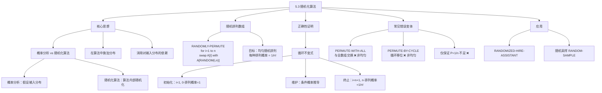
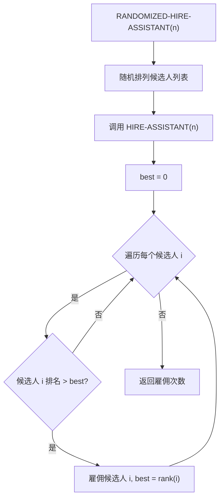

# 5.3 随机化算法

## 相关笔记

- [[算法导论/concepts/随机化算法]]
- [[算法导论/concepts/伪代码]]
- [[算法导论/concepts/分治法]]
- [[5.1 雇佣问题]]
- [[5.2 指示器随机变量]]
- [[第05章_概率分析与随机化算法-章节汇总]]

---

> [!abstract] 概览
>
> 本节系统阐述了==随机化算法==的核心思想：当无法获知输入的概率分布时，与其被动假设输入服从某种分布，不如==在算法内部主动引入随机性==，使算法的期望性能不依赖于特定输入。
>
> **要点列表：**
> - ==概率分析== vs ==随机化算法==的本质区别：前者假设输入分布，后者在算法中==施加分布==
> - 随机化雇佣算法 `RANDOMIZED-HIRE-ASSISTANT`：先随机排列候选人，再执行确定性雇佣过程
> - ==均匀随机排列==（uniform random permutation）的严格定义：$n!$ 种排列中每种出现的概率均为 $1/n!$
> - `RANDOMLY-PERMUTE` 过程：原地 $\Theta(n)$ 时间生成均匀随机排列，通过==循环不变式==严格证明正确性
> - 仅保证每个元素出现在每个位置的概率为 $1/n$ **不等于**生成均匀随机排列（练习 5.3-4）
> - 随机化算法的关键优势：==没有特定输入能触发最坏行为==，即使最强大的对手也无法构造"坏输入"
>
> **关键术语：**
> - ==随机化算法（randomized algorithm）==：在算法执行过程中做出随机选择的算法
> - ==均匀随机排列（uniform random permutation）==：$n!$ 种排列中每一种以等概率 $1/n!$ 出现
> - ==k-排列（k-permutation）==：从 $n$ 个元素中选取 $k$ 个的有序序列，共 $n!/(n-k)!$ 种
> - ==原地排列（in-place permutation）==：仅使用常数额外空间的排列算法

---

知识结构总览



---

核心思想

> [!tip] 核心洞察：从"假设分布"到"施加分布"
>
> 在 [[5.2 指示器随机变量]] 中，我们对 `HIRE-ASSISTANT` 进行了概率分析，但前提是**假设候选人以随机顺序到达**。这一假设是否合理？如果我们根本不知道输入的分布呢？
>
> 随机化算法的核心策略是：**不再假设输入服从某种分布，而是在算法内部主动引入随机性，对输入施加均匀分布**。这样，无论实际输入是什么，算法的期望性能都保持一致。

### 2.1 概率分析 vs 随机化算法

> [!def] 概率分析（Probabilistic Analysis）
>
> 对一个==确定性算法==，假设输入服从某种概率分布，分析其==平均情况==（average-case）性能。
>
> - 算法本身是确定性的：对同一输入，输出始终相同
> - 性能因输入不同而不同
> - 分析结果依赖于输入分布假设的正确性

> [!def] 随机化算法（Randomized Algorithm）
>
> 在算法执行过程中==引入随机选择==，使得即使对同一输入，不同运行的执行路径也可能不同。
>
> - 算法本身包含随机操作（如 `RANDOM`）
> - 对同一输入，不同运行可能产生不同结果
> - 期望性能==不依赖于输入分布==，而是依赖于算法内部的随机选择

**关键区别总结：**

| 维度 | 概率分析 | 随机化算法 |
|:---:|:---:|:---:|
| 随机性来源 | 输入分布 | 算法内部 |
| 算法类型 | 确定性 | 非确定性 |
| 对同一输入 | 结果恒定 | 结果可能不同 |
| 依赖假设 | 需要知道输入分布 | 不需要知道输入分布 |
| 最坏输入 | 存在 | 不存在（概率意义下） |

### 2.2 随机化雇佣算法

在 [[5.1 雇佣问题]] 的 `HIRE-ASSISTANT` 基础上，只需增加一步随机排列：

> [!tip] 算法执行流程
> 1. 对候选人列表执行**随机排列**
> 2. 调用 **HIRE-ASSISTANT**：依次面试每个候选人
> 3. 若当前候选人排名**高于**所有已面试者，则**雇佣**该候选人
> 4. 返回总**雇佣次数**



```
RANDOMIZED-HIRE-ASSISTANT(n)
1  randomly permute the list of candidates
2  HIRE-ASSISTANT(n)
```

**为什么这有效？**

考虑一个具体输入 $A_3 = \langle 5, 2, 1, 8, 4, 7, 10, 9, 3, 6 \rangle$：
- 确定性算法：总是雇佣 3 次（rank 为 5、8、10 的候选人）
- 随机化算法：第一次运行可能产生排列 $A_1$（雇佣 10 次），第二次可能产生 $A_2$（雇佣 1 次）

> [!def] 引理 5.3
>
> 过程 `RANDOMIZED-HIRE-ASSISTANT` 的期望雇佣费用为 $O(c_h \ln n)$。
>
> **证明：** 对输入数组进行随机排列后，产生的情形与 5.2 节中对 `HIRE-ASSISTANT` 的概率分析完全相同。由引理 5.2，期望雇佣次数为 $H_n = \sum_{i=1}^{n} 1/i = \ln n + O(1)$，因此期望费用为 $O(c_h \ln n)$。 $\blacksquare$

**引理 5.2 vs 引理 5.3 的对比：**

- **引理 5.2**（概率分析）：==假设==候选人以随机顺序到达 $\Rightarrow$ 平均情况雇佣费用为 $O(c_h \ln n)$
- **引理 5.3**（随机化算法）：==不假设==任何输入分布 $\Rightarrow$ 期望雇佣费用为 $O(c_h \ln n)$

### 2.3 随机排列数组

> [!def] 均匀随机排列（Uniform Random Permutation）
>
> 给定 $n$ 个元素的数组，共有 $n!$ 种可能的排列。一个排列算法生成==均匀随机排列==，当且仅当每种排列被生成的概率均为 $1/n!$。

**算法 `RANDOMLY-PERMUTE`：**

```
RANDOMLY-PERMUTE(A, n)
1  for i = 1 to n
2      swap A[i] with A[RANDOM(i, n)]
```

**算法要点：**
- 第 $i$ 次迭代：从 $A[i \ldots n]$ 中等概率随机选一个元素与 $A[i]$ 交换
- 第 $i$ 次迭代完成后，$A[i]$ 的值不再改变
- 时间复杂度：$\Theta(n)$（$n$ 次迭代，每次 $O(1)$）
- 空间复杂度：$O(1)$（原地排列，仅使用常数额外空间）

### 2.4 正确性证明：循环不变式

> [!def] 引理 5.4
>
> 过程 `RANDOMLY-PERMUTE` 生成一个均匀随机排列。

**循环不变式：**

在第 $i$ 次迭代（`for` 循环的第 1-2 行）开始之前，对于 $n$ 个元素的每一种可能的 $(i-1)$-排列，子数组 $A[1 \ldots i-1]$ 包含该 $(i-1)$-排列的概率为：

$$\Pr\{A[1 \ldots i-1] \text{ 包含某个特定的 } (i{-}1)\text{-排列}\} = \frac{(n-i+1)!}{n!}$$

**证明分三步：**

**【循环不变量（初始化+保持+终止）】**

**初始化（$i = 1$）：**

循环不变式说：对每种可能的 $0$-排列，子数组 $A[1 \ldots 0]$ 包含该 $0$-排列的概率为：

$$\frac{(n - 1 + 1)!}{n!} = \frac{n!}{n!} = 1$$

$A[1 \ldots 0]$ 是空子数组，$0$-排列没有元素。因此空子数组包含任何 $0$-排列的概率确实为 $1$。初始化成立。

**维护：**

假设在第 $i$ 次迭代前，每种 $(i-1)$-排列出现在 $A[1 \ldots i-1]$ 中的概率为 $(n-i+1)!/n!$。需要证明：第 $i$ 次迭代后，每种 $i$-排列出现在 $A[1 \ldots i]$ 中的概率为 $(n-i)!/n!$。

**【条件概率推导（E1和E2的联合概率）】**

设某个特定的 $i$-排列为 $\langle x_1, x_2, \ldots, x_i \rangle$，它由 $(i-1)$-排列 $\langle x_1, \ldots, x_{i-1} \rangle$ 和元素 $x_i$ 组成。

令：
- $E_1$：前 $i-1$ 次迭代在 $A[1 \ldots i-1]$ 中生成了 $\langle x_1, \ldots, x_{i-1} \rangle$。由循环不变式，$\Pr\{E_1\} = \frac{(n-i+1)!}{n!}$。
- $E_2$：第 $i$ 次迭代将 $x_i$ 放入 $A[i]$。

$i$-排列 $\langle x_1, \ldots, x_i \rangle$ 出现在 $A[1 \ldots i]$ 中，当且仅当 $E_1$ 和 $E_2$ 同时发生。由条件概率公式：

$$\Pr\{E_2 \cap E_1\} = \Pr\{E_2 \mid E_1\} \cdot \Pr\{E_1\}$$

**【等概率随机选取（Pr{E2|E1} = 1/(n-i+1)）】** 在 $E_1$ 发生的条件下，$x_i$ 一定在 $A[i \ldots n]$ 的 $n - i + 1$ 个位置中。第 2 行从这些位置中**等概率随机选取**一个与 $A[i]$ 交换，因此：

$$\Pr\{E_2 \mid E_1\} = \frac{1}{n - i + 1}$$

**【代入得 (n-i)!/n!】** 代入得：

$$\Pr\{E_2 \cap E_1\} = \frac{1}{n - i + 1} \cdot \frac{(n-i+1)!}{n!} = \frac{(n-i)!}{n!}$$

维护成立。将 $i$ 递增后，循环不变式保持。

**终止：**

循环终止时 $i = n + 1$。由循环不变式，$A[1 \ldots n]$ 是某个特定的 $n$-排列的概率为：

$$\frac{(n - (n+1) + 1)!}{n!} = \frac{0!}{n!} = \frac{1}{n!}$$

因此 `RANDOMLY-PERMUTE` 生成均匀随机排列。 $\blacksquare$

---

补充理解与拓展

> [!info] 拓展一：为什么"每个元素在每个位置概率为 $1/n$"还不够？
>
> 练习 5.3-4 展示了一个反例 `PERMUTE-BY-CYCLE`：该过程通过一个随机偏移量 `offset` 将数组循环移位。可以证明，每个元素 $A[i]$ 出现在输出数组 $B$ 中任何特定位置的概率确实为 $1/n$，但生成的排列**不是均匀随机的**。
>
> **原因：** 循环移位产生的排列只有 $n$ 种（对应 $n$ 个不同的偏移量），而均匀随机排列应有 $n!$ 种。虽然每种"位置分配"的边缘概率正确，但不同位置之间的==联合分布==不正确——元素之间的相对位置关系被循环移位的结构所约束。
>
> **类比：** 想象把一副扑克牌切成两叠然后交换。虽然每张牌出现在每个位置的概率是 $1/52$，但牌之间的相对顺序被保留了，所以这并非真正的均匀洗牌。

> [!info] 拓展二：随机化算法的分类
>
> 随机化算法按其保证类型可分为两大类：
>
> 1. **Las Vegas 算法**：总是返回正确答案，但运行时间是随机变量。例如 `RANDOMIZED-QUICKSORT`，排序结果总是正确的，但比较次数取决于随机选择的主元。
>
> 2. **Monte Carlo 算法**：运行时间有界，但可能以一定概率返回错误答案。例如素性测试的 Miller-Rabin 算法。
>
> 本节的 `RANDOMIZED-HIRE-ASSISTANT` 属于 Las Vegas 类型：它总是正确地找到最佳候选人，但雇佣次数是随机的。
>
> 随机化算法往往是解决某些问题**最简单且最高效**的方法。在后续章节中（如第7章快速排序），我们将看到更多随机化算法的精彩应用。

---

易混淆点与辨析

> [!warning] 混淆点一：概率分析 ≠ 随机化算法
>
> ❌ **错误理解：** "对算法做了概率分析，这个算法就是随机化算法。"
>
> ✅ **正确理解：** 概率分析和随机化算法是两个不同的概念：
> - **概率分析**是一种==分析方法==，用于分析确定性算法在随机输入下的平均性能
> - **随机化算法**是一种==算法设计范式==，在算法内部引入随机性
>
> 一个确定性算法可以做概率分析（如引理 5.2），但它不是随机化算法。只有当算法本身包含随机操作时，才称为随机化算法（如引理 5.3）。
>
> **关键检验标准：** 对同一输入多次运行，如果每次执行路径都相同，就是确定性算法（可能对其做了概率分析）；如果执行路径可能不同，就是随机化算法。

> [!warning] 混淆点二：`PERMUTE-WITH-ALL` 不是均匀随机排列
>
> ❌ **错误直觉：** "每次从整个数组中随机选一个元素交换，应该更随机才对。"
>
> ✅ **正确分析：** `PERMUTE-WITH-ALL` 从 $A[1 \ldots n]$（而非 $A[i \ldots n]$）中随机选取元素与 $A[i]$ 交换，这导致排列**不均匀**。
>
> **具体反例：** 设 $n = 3$，数组为 $\langle 1, 2, 3 \rangle$。
>
> `PERMUTE-WITH-ALL` 生成排列 $\langle 1, 2, 3 \rangle$（恒等排列）的概率计算：
> - 第 1 步：$A[1]$ 与 $A[\text{RANDOM}(1,3)]$ 交换。选中 $A[1]$ 的概率为 $1/3$（不交换）
> - 第 2 步：$A[2]$ 与 $A[\text{RANDOM}(1,3)]$ 交换。选中 $A[2]$ 的概率为 $1/3$（不交换）
> - 第 3 步：$A[3]$ 与 $A[\text{RANDOM}(1,3)]$ 交换。选中 $A[3]$ 的概率为 $1/3$（不交换）
> - 恒等排列概率 = $(1/3)^3 = 1/27$
>
> 但均匀随机排列下，每种排列的概率应为 $1/3! = 1/6 = 9/27 \neq 1/27$。
>
> **根本原因：** 当从整个数组（而非剩余未确定部分）中选取时，后面的交换可能==破坏前面已经确定的排列==，导致某些排列被"撤销"的概率更高。

---

习题精选

| 题号 | 题目描述 | 难度 | 考察重点 |
|:---:|:---|:---:|:---:|
| 5.3-1 | Marceau 教授质疑循环不变式的初始化，要求改写过程使不变式适用于非空子数组 | ★★☆ | 循环不变式设计 |
| 5.3-2 | `PERMUTE-WITHOUT-IDENTITY` 是否能生成除恒等排列外的均匀随机排列 | ★★★ | 排列均匀性分析 |
| 5.3-3 | `PERMUTE-WITH-ALL` 是否生成均匀随机排列 | ★★★ | 排列均匀性分析 |
| 5.3-4 | `PERMUTE-BY-CYCLE` 的边缘概率正确但联合分布不均匀 | ★★★★ | 边缘概率 vs 联合分布 |
| 5.3-5 | `RANDOM-SAMPLE` 用 $m$ 次 `RANDOM` 调用生成随机 $m$-子集 | ★★★ | 随机采样算法 |

> [!faq]- 5.3-1 解答
>
> **问题：** 改写 `RANDOMLY-PERMUTE`，使循环不变式在第一次迭代前适用于非空子数组。
>
> **思路：** 在循环开始前，先随机选择 $A[1]$ 的值（从整个数组中等概率选取），这样第一次迭代前 $A[1 \ldots 1]$ 已经是一个非空子数组。
>
> **改写过程：**
> ```
> RANDOMLY-PERMUTE'(A, n)
> 1  swap A[1] with A[RANDOM(1, n)]
> 2  for i = 2 to n
> 3      swap A[i] with A[RANDOM(i, n)]
> ```
>
> **修改后的循环不变式：**
>
> 在第 $i$ 次迭代（$i \geq 2$）开始之前，对于每种可能的 $(i-1)$-排列，子数组 $A[1 \ldots i-1]$ 包含该排列的概率为 $(n-i+1)!/n!$。
>
> **初始化（$i = 2$）：** 第 1 行已经从 $A[1 \ldots n]$ 中等概率选取一个元素放入 $A[1]$。$A[1 \ldots 1]$ 包含某个特定 $1$-排列的概率为 $1/n = (n-2+1)!/n! = (n-1)!/n! = 1/n$。成立。
>
> **维护与终止：** 与原证明类似，终止时 $i = n+1$，概率为 $1/n!$。

> [!faq]- 5.3-2 解答
>
> **问题：** `PERMUTE-WITHOUT-IDENTITY` 是否能生成除恒等排列外的均匀随机排列？
> ```
> PERMUTE-WITHOUT-IDENTITY(A, n)
> 1  for i = 1 to n - 1
> 2      swap A[i] with A[RANDOM(i + 1, n)]
> ```
>
> **答案：** 不能。该过程存在两个问题：
>
> 1. **不均匀：** 考虑 $n = 3$，数组 $\langle 1, 2, 3 \rangle$。第 1 步将 $A[1]$ 与 $A[2]$ 或 $A[3]$ 交换（各概率 $1/2$）。如果与 $A[2]$ 交换得到 $\langle 2, 1, 3 \rangle$，第 2 步将 $A[2]$（值为 1）与 $A[3]$（值为 3）交换，得到 $\langle 2, 3, 1 \rangle$。如果第 1 步与 $A[3]$ 交换得到 $\langle 3, 2, 1 \rangle$，第 2 步将 $A[2]$（值为 2）与 $A[3]$（值为 1）交换，得到 $\langle 3, 1, 2 \rangle$。因此只有两种输出，概率各 $1/2$，但 $(n! - 1) = 5$ 种非恒等排列并未被等概率生成。
>
> 2. **可能生成恒等排列：** 当 $n \geq 3$ 时，虽然 $A[1]$ 不会留在原位，但后续交换可能使某些元素回到原位。例如 $n = 4$，$\langle 1, 2, 3, 4 \rangle$：第 1 步交换 $A[1]$ 和 $A[3]$ 得 $\langle 3, 2, 1, 4 \rangle$；第 2 步交换 $A[2]$ 和 $A[4]$ 得 $\langle 3, 4, 1, 2 \rangle$；第 3 步交换 $A[3]$ 和 $A[4]$ 得 $\langle 3, 4, 2, 1 \rangle$。这里没有恒等排列，但该过程并不能保证所有非恒等排列等概率出现。

> [!faq]- 5.3-3 解答
>
> **问题：** `PERMUTE-WITH-ALL` 是否生成均匀随机排列？
> ```
> PERMUTE-WITH-ALL(A, n)
> 1  for i = 1 to n
> 2      swap A[i] with A[RANDOM(1, n)]
> ```
>
> **答案：** 不能。如正文"易混淆点二"中的反例所示，$n = 3$ 时恒等排列的概率为 $1/27$，而非均匀的 $1/6$。
>
> **一般性分析：** 第 $i$ 步从 $n$ 个位置中随机选取，共有 $n^n$ 种可能的随机选择序列。但 $n!$ 通常不整除 $n^n$（例如 $3! = 6$ 不整除 $3^3 = 27$），因此不可能每种排列获得相同概率。

> [!faq]- 5.3-4 解答
>
> **问题：** 证明 `PERMUTE-BY-CYCLE` 中每个元素出现在每个位置的概率为 $1/n$，但排列不均匀。
> ```
> PERMUTE-BY-CYCLE(A, n)
> 1  let B[1 : n] be a new array
> 2  offset = RANDOM(1, n)
> 3  for i = 1 to n
> 4      dest = i + offset
> 5      if dest > n
> 6          dest = dest - n
> 7      B[dest] = A[i]
> 8  return B
> ```
>
> **第一部分（边缘概率 = $1/n$）：** `offset` 在 $\{1, 2, \ldots, n\}$ 上均匀分布。元素 $A[i]$ 被放到位置 $(i + \text{offset}) \bmod n$。对固定的 $i$ 和目标位置 $j$，满足 $(i + \text{offset}) \equiv j \pmod{n}$ 的 `offset` 恰好有 1 个值。因此 $\Pr\{A[i] \text{ 在位置 } j\} = 1/n$。
>
> **第二部分（排列不均匀）：** 该过程只产生 $n$ 种不同的排列（对应 $n$ 个不同的 `offset` 值），但均匀随机排列应有 $n!$ 种。当 $n > 2$ 时，$n < n!$，因此不可能均匀。具体地，所有产生的排列都是==单循环排列==（即一个 $n$-cycle），而 $n!$ 种排列中包含许多非单循环的排列。

> [!faq]- 5.3-5 解答
>
> **问题：** 证明 `RANDOM-SAMPLE` 以仅 $m$ 次 `RANDOM` 调用生成均匀随机 $m$-子集。
>
> **思路概要：** 使用循环不变式证明。在第 $k$ 轮迭代（$k$ 从 $n-m+1$ 到 $n$）中，算法从 $\{1, \ldots, k\}$ 中随机选取一个元素加入集合 $S$（如果已在 $S$ 中则加入 $k$）。
>
> **关键不变式：** 经过若干轮迭代后，$S$ 是从已处理元素中均匀选取的子集。
>
> **直觉：** 这类似于"蓄水池采样"的思想。每一步都以适当的概率决定是否将新元素纳入样本，确保最终每个 $m$-子集被等概率选中。仅需 $m$ 次 `RANDOM` 调用，远少于先完全排列（$n$ 次调用）再取前 $m$ 个的方法。

---

视频学习指南

| 资源名称 | 讲者/来源 | 覆盖内容 | 时长 | 推荐度 |
|:---|:---:|:---|:---:|:---:|
| MIT 6.006 Lecture 12: Randomized Algorithms | Erik Demaine | 随机化算法概述、快速排序的随机化 | ~75 min | ★★★★★ |
| Stanford CS161 (2022) - Randomized Algorithms | Mary Wootters | 随机化算法设计思想、雇佣问题 | ~60 min | ★★★★☆ |
| Karpathy - Neural Networks: Zero to Hero | Andrej Karpathy | 随机性在机器学习中的角色（拓展视角） | 系列 | ★★★☆☆ |

---

教材原文

> [!quote] CLRS 第5.3节 原文摘录
>
> *In the previous section, we showed how knowing a distribution on the inputs can help us to analyze the average-case behavior of an algorithm. What if you do not know the distribution? Then you cannot perform an average-case analysis. As mentioned in Section 5.1, however, you might be able to use a randomized algorithm.*
>
> *Instead of assuming a distribution of inputs, we impose a distribution. In particular, before running the algorithm, let's randomly permute the candidates in order to enforce the property that every permutation is equally likely.*
>
> *For this algorithm and many other randomized algorithms, no particular input elicits its worst-case behavior. Even your worst enemy cannot produce a bad input array, since the random permutation makes the input order irrelevant.*

> [!quote] CLRS 引理 5.4 证明要点
>
> *We use the following loop invariant: Just prior to the ith iteration of the for loop of lines 1-2, for each possible (i-1)-permutation of the n elements, the subarray A[1:i-1] contains this (i-1)-permutation with probability (n-i+1)!/n!.*
>
> *At termination, i = n + 1, and we have that the subarray A[1:n] is a given n-permutation with probability (n-(n+1)+1)!/n! = 0!/n! = 1/n!.*

---

## 参见Wiki

（待补充）

---

#学习/算法导论/第05章
