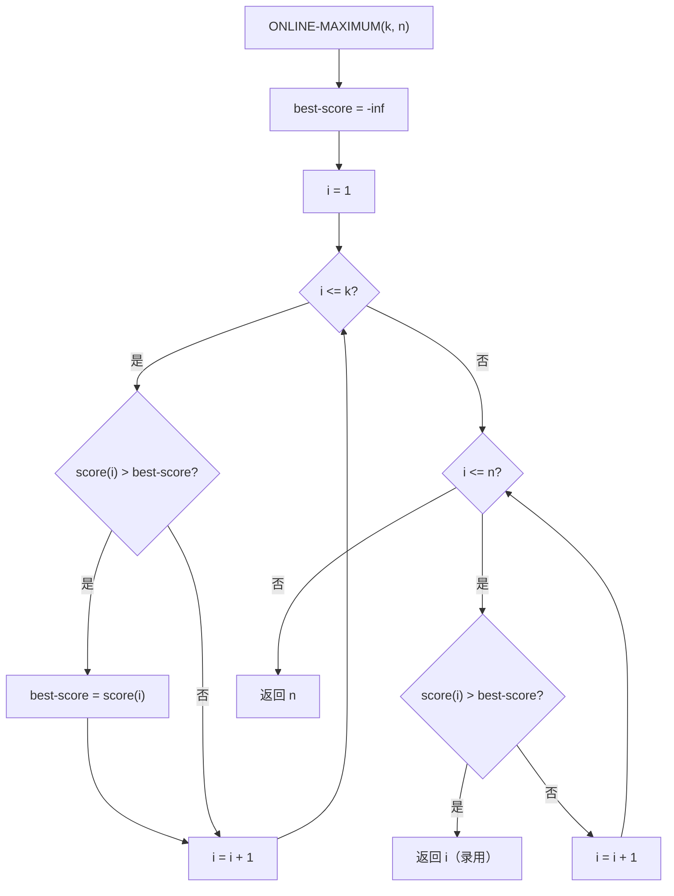

## 相关笔记

- [[算法导论/concepts/随机化算法]]
- [[算法导论/concepts/平均情况分析]]
- [[5.1 雇佣问题]]
- [[5.2 指示器随机变量]]
- [[5.3 随机化算法]]
- [[第05章_概率分析与随机化算法-章节汇总]]

## [!abstract] 概览

本节是第5章的高级进阶部分，通过四个经典问题进一步展示==概率分析==与==指示器随机变量==的强大应用能力。四个问题分别是：

1. **生日悖论**（Birthday Paradox）：仅需约 $\sqrt{n}$ 人即可使两人生日相同的概率超过 $1/2$
2. **球与箱子**（Balls and Bins）：随机投球模型，涵盖二项分布、几何分布与==优惠券收集者问题==
3. **连续正面**（Streaks）：公平硬币抛掷中最长连续正面长度的期望为 $\Theta(\lg n)$
4. **在线雇佣问题**（Online Hiring Problem）：在只雇佣一次的约束下，选择 $k = n/e$ 可使雇佣最优候选人的概率至少为 $1/e$

**关键术语**：==生日悖论==、==指示器随机变量==、==期望的线性性质==、==优惠券收集者问题==、==在线算法==、==几何分布==、==二项分布==

---

知识结构总览

```mermaid
mindmap
  root((5.4 概率分析与<br>指示器随机变量的<br>进一步应用))
    生日悖论 (5.4.1)
      精确分析：互补事件法
        Pr{B_k} = 递推公式
        上界：1 + x <= e^x
        结论：k >= 23 (n=365)
      近似分析：指示器随机变量
        X_ij = I{两人同生日}
        E[X] = C(k,2) / n
        结论：k >= 28
      两种方法渐近一致：Theta(sqrt(n))
    球与箱子 (5.4.2)
      给定箱子中的球数
        二项分布 b(k; n, 1/b)
        期望：n/b
      命中给定箱子
        几何分布
        期望：b
      每个箱子至少一个球
        分阶段分析
        优惠券收集者问题
        期望：b ln b
    连续正面 (5.4.3)
      上界证明：O(lg n)
        事件 A_ik
        Pr{A_ik} = 1/2^k
        最长正面 <= 2*ceil(lg n)
      下界证明：Omega(lg n)
        分组策略
        s = floor((lg n)/2)
      指示器随机变量分析
        E[X] = (n-k+1)/2^k
        结论：Theta(lg n)
    在线雇佣问题 (5.4.4)
      ONLINE-MAXIMUM(k, n)
        观察前k个，拒绝
        之后选第一个更优者
      成功概率分析
        Pr{S_i} = k / (n(i-1))
        积分近似上下界
      最优策略
        k = n/e
        成功概率 >= 1/e
```

---

核心思想

### [!tip] 概率分析的核心方法论

本节展示了概率分析的两种核心工具：

1. **互补事件法**：通过计算对立事件的概率来间接求解目标概率。生日悖论的精确分析即采用此法——计算"所有人生日都不同"的概率，再用 $1$ 减去该值。
2. **指示器随机变量 + 期望的线性性质**：将复杂事件分解为若干简单子事件的指示器变量之和，利用期望的线性性质（无需独立性！）直接计算期望值。

> [!def] 指示器随机变量（Indicator Random Variable）
> 对于事件 $A$，其关联的指示器随机变量定义为：
> $$I\{A\} = \begin{cases} 1 & \text{若 } A \text{ 发生} \\ 0 & \text{若 } A \text{ 不发生} \end{cases}$$
>
> 由引理 5.1，其期望为：
> $$E[I\{A\}] = \Pr\{A\}$$

> [!def] 期望的线性性质（Linearity of Expectation）
> 对于任意随机变量 $X_1, X_2, \ldots, X_n$（**无需相互独立**），有：
> $$E\left[\sum_{i=1}^{n} X_i\right] = \sum_{i=1}^{n} E[X_i]$$
>
> 这是本节所有指示器随机变量分析的数学基础。

### 5.4.1 生日悖论

> [!def] 生日悖论问题
> 一年有 $n = 365$ 天，房间中有 $k$ 个人，每个人的生日均匀分布于 $n$ 天中且相互独立。求使至少两人生日相同的概率超过 $1/2$ 的最小 $k$。

**精确分析（互补事件法）：**

**【互补事件法（计算"都不同"的概率）】**

设 $B_k$ 为 $k$ 个人生日互不相同的事件，$A_i$ 为第 $i$ 个人的生日与前 $i-1$ 个人都不同的事件。由于 $B_k = A_k \cap B_{k-1}$，由条件概率公式得递推关系：

$$\Pr\{B_k\} = \Pr\{B_{k-1}\} \cdot \Pr\{A_k \mid B_{k-1}\}$$

其中 $\Pr\{A_k \mid B_{k-1}\} = \dfrac{n - k + 1}{n}$（前 $k-1$ 人已占据 $k-1$ 天，还剩 $n - k + 1$ 天可选）。

展开递推：

$$\Pr\{B_k\} = 1 \cdot \frac{n-1}{n} \cdot \frac{n-2}{n} \cdots \frac{n-k+1}{n} = \prod_{i=0}^{k-1} \left(1 - \frac{i}{n}\right)$$

**【利用不等式 1+x <= e^x 放缩】** 利用不等式 $1 + x \leq e^x$（当 $x > -1$）：

$$\Pr\{B_k\} \leq \prod_{i=0}^{k-1} e^{-i/n} = e^{-k(k-1)/(2n)}$$

当 $k(k-1) \geq 2n \ln 2$ 时，$\Pr\{B_k\} \leq 1/2$，即至少两人生日相同的概率 $\Pr\{\overline{B_k}\} \geq 1/2$。

**【解二次方程得 k 的下界】** 解二次方程 $k^2 - k - 2n\ln 2 \geq 0$，取正根：

$$k \geq \frac{1 + \sqrt{1 + 8n \ln 2}}{2}$$

当 $n = 365$ 时，$k \geq 23$。

**近似分析（指示器随机变量）：**

**【指示器随机变量+期望的线性性质】**

对每对 $(i, j)$（$1 \leq i < j \leq k$），定义：

$$X_{ij} = I\{\text{第 } i \text{ 人和第 } j \text{ 人生日相同}\}$$

由引理 5.1：$E[X_{ij}] = \Pr\{\text{同生日}\} = 1/n$。

**【期望的线性性质（无需独立性）】** 令 $X = \displaystyle\sum_{1 \leq i < j \leq k} X_{ij}$（同生日对的总数），则：

$$E[X] = \sum_{1 \leq i < j \leq k} E[X_{ij}] = \binom{k}{2} \cdot \frac{1}{n} = \frac{k(k-1)}{2n}$$

当 $k(k-1) \geq 2n$ 时，$E[X] \geq 1$。对于 $n = 365$，$k = 28$ 时 $E[X] \approx 1.0356$。

> [!warning] 两种分析的对比
> - **精确分析**：求的是"概率 $\geq 1/2$"所需的 $k$，得 $k \geq 23$
> - **近似分析**：求的是"期望同生日对数 $\geq 1$"所需的 $k$，得 $k \geq 28$
> - 两者渐近一致：$k = \Theta(\sqrt{n})$

### 5.4.2 球与箱子

> [!def] 球与箱子模型
> 将 $n$ 个相同的球随机投入 $b$ 个编号为 $1, 2, \ldots, b$ 的箱子中，每次投球独立且等概率（每箱 $1/b$）。

**问题一：给定箱子中的球数**

服从二项分布 $b(k; n, 1/b)$，期望为 $n/b$。

**问题二：命中给定箱子所需投球数**

服从几何分布（成功概率 $1/b$），期望为 $b$。

**问题三：每个箱子至少一个球（优惠券收集者问题）**

将投球过程分为 $b$ 个阶段。第 $i$ 阶段从第 $(i-1)$ 次"命中"（球落入空箱）到第 $i$ 次"命中"。

第 $i$ 阶段中，已有 $i-1$ 个箱有球，$b - i + 1$ 个箱为空，每次投球命中的概率为 $(b - i + 1)/b$。

设 $n_i$ 为第 $i$ 阶段的投球数，$n_i$ 服从几何分布：

$$E[n_i] = \frac{1}{(b - i + 1)/b} = \frac{b}{b - i + 1}$$

由期望的线性性质：

$$E[n] = \sum_{i=1}^{b} E[n_i] = \sum_{i=1}^{b} \frac{b}{b - i + 1} = b \sum_{i=1}^{b} \frac{1}{i} = b \cdot H_b$$

其中 $H_b = \displaystyle\sum_{i=1}^{b} \frac{1}{i}$ 是第 $b$ 个**调和数**。由于 $H_b = \ln b + O(1)$，因此：

$$E[n] = b \ln b + O(b)$$

> [!note] 优惠券收集者问题
> 如果你想收集 $b$ 种不同的优惠券，每随机获得一张优惠券，期望需要获得约 $b \ln b$ 张才能集齐全部种类。这就是"优惠券收集者问题"（Coupon Collector's Problem）。

### 5.4.3 连续正面

> [!def] 连续正面问题
> 抛掷公平硬币 $n$ 次，求最长连续正面长度的期望值。

**上界证明：$E[L] = O(\lg n)$**

**【分步期望分析（分两段求和）】**

设 $A_{ik}$ 为"从第 $i$ 次抛掷开始出现至少 $k$ 个连续正面"的事件：

$$\Pr\{A_{ik}\} = \frac{1}{2^k}$$

**【取 k=2*ceil(lg n) 使概率 <= 1/n^2】** 取 $k = 2\lceil \lg n \rceil$，则 $\Pr\{A_{ik}\} = 1/2^{2\lceil\lg n\rceil} \leq 1/n^2$。

这样的连续正面最多从 $n - 2\lceil\lg n\rceil + 1$ 个位置开始，因此：

$$\Pr\{\text{出现长度} \geq 2\lceil\lg n\rceil \text{的连续正面}\} \leq \frac{n}{n^2} = \frac{1}{n}$$

设 $L$ 为最长连续正面长度，$L_j$ 为"最长连续正面恰好为 $j$"的事件。由期望定义：

$$E[L] = \sum_{j=0}^{n} j \cdot \Pr\{L_j\} = \sum_{j < 2\lceil\lg n\rceil} j \cdot \Pr\{L_j\} + \sum_{j \geq 2\lceil\lg n\rceil} j \cdot \Pr\{L_j\}$$

第一部分：$j < 2\lceil\lg n\rceil$，故 $\sum_{j < 2\lceil\lg n\rceil} j \cdot \Pr\{L_j\} < 2\lceil\lg n\rceil$。

第二部分：$\sum_{j \geq 2\lceil\lg n\rceil} \Pr\{L_j\} \leq 1/n$（由上界），故 $\sum_{j \geq 2\lceil\lg n\rceil} j \cdot \Pr\{L_j\} \leq n \cdot (1/n) = 1$。

因此 $E[L] < 2\lceil\lg n\rceil + 1 = O(\lg n)$。

**下界证明：$E[L] = \Omega(\lg n)$**

**【分组策略（将 n 次抛掷分成多组）】**

将 $n$ 次抛掷分成 $\lfloor n / \lfloor(\lg n)/2\rfloor \rfloor$ 组，每组 $\lfloor(\lg n)/2\rfloor$ 次连续抛掷。

每组全部为正面的概率为 $1/2^{\lfloor(\lg n)/2\rfloor} \leq 2/\sqrt{n}$。

**【利用 (1-1/m)^m <= 1/e 估计联合概率】** 所有组都不全为正面的概率至多为：

$$\left(1 - \frac{1}{2^{\lfloor(\lg n)/2\rfloor}}\right)^{\lfloor n / \lfloor(\lg n)/2\rfloor \rfloor} \leq \left(1 - \frac{1}{2\sqrt{n}}\right)^{\sqrt{n}/2} \leq e^{-1/4} = O(1/n)$$

因此最长连续正面 $\geq \lfloor(\lg n)/2\rfloor$ 的概率至少为 $1 - O(1/n)$。

类似上界的分析方法可得 $E[L] = \Omega(\lg n)$。

**综合结论：$E[L] = \Theta(\lg n)$**

**指示器随机变量分析：**

令 $X_{ik} = I\{A_{ik}\}$，$X = \displaystyle\sum_{i=1}^{n-k+1} X_{ik}$（长度 $\geq k$ 的连续正面数），则：

$$E[X] = \frac{n - k + 1}{2^k}$$

取 $k = c \lg n$（$c$ 为正常数）：

$$E[X] = \frac{n - c\lg n + 1}{n^c} \approx n^{1-c}$$

- $c$ 较大时（如 $c = 2$），$E[X] \approx 1/n$，不太可能出现
- $c = 1/2$ 时，$E[X] = \Theta(\sqrt{n})$，预期会出现多个

因此最长连续正面的期望长度为 $\Theta(\lg n)$。

### 5.4.4 在线雇佣问题

> [!def] 在线雇佣问题
> 面试 $n$ 个候选人，每人有唯一分数。面试后必须立即决定录用或拒绝，且只能录用一次。目标：最大化录用最优候选人的概率。

**策略 ONLINE-MAXIMUM(k, n)：**

> [!tip] 算法执行流程
> 1. 初始化 **best-score** 为负无穷
> 2. 遍历前 **k** 个候选人，记录其中的**最高分**
> 3. 从第 **k+1** 个开始，若当前分数**高于** best-score，则立即**录用并返回**
> 4. 若无人超过 best-score，则**返回最后一个**候选人



```
ONLINE-MAXIMUM(k, n)
1  best-score = -inf
2  for i = 1 to k
3     if score(i) > best-score
4        best-score = score(i)
5  for i = k + 1 to n
6     if score(i) > best-score
7        return i
8  return n
```

即：**面试并拒绝前 $k$ 个候选人**（仅记录最高分），**之后录用第一个超过此前最高分的候选人**。若最优者在 前 $k$ 个中，则只能录用最后一个。

**成功概率分析：**

**【互斥事件分解（Pr{S} = sum Pr{S_i}）】**

设 $S$ 为成功事件（录用最优候选人），$S_i$ 为"最优候选人是第 $i$ 个且被成功录用"。由于 $S_i$ 互斥：

$$\Pr\{S\} = \sum_{i=1}^{n} \Pr\{S_i\} = \sum_{i=k+1}^{n} \Pr\{S_i\}$$

（当 $i \leq k$ 时 $\Pr\{S_i\} = 0$，因为前 $k$ 个都被拒绝了。）

**【独立事件乘法（B_i 和 O_i 独立）】** 要使 $S_i$ 发生，需要两个独立事件同时成立：
- $B_i$：最优者在位置 $i$，$\Pr\{B_i\} = 1/n$
- $O_i$：位置 $k+1$ 到 $i-1$ 中无人被选中（即这些位置的分数都小于前 $k$ 个中的最高分 $M(k)$）

$\Pr\{O_i\} = k/(i-1)$（前 $i-1$ 个中的最大值等概率出现在任意位置，需出现在前 $k$ 个中）。

因此：

$$\Pr\{S_i\} = \Pr\{B_i \cap O_i\} = \Pr\{B_i\} \cdot \Pr\{O_i\} = \frac{k}{n(i-1)}$$

$$\Pr\{S\} = \sum_{i=k+1}^{n} \frac{k}{n(i-1)} = \frac{k}{n} \sum_{i=k}^{n-1} \frac{1}{i}$$

**【积分近似（调和数上下界）】** 利用 $\displaystyle\int_{k}^{n} \frac{1}{x}\,dx \leq \sum_{i=k}^{n-1} \frac{1}{i} \leq \int_{k-1}^{n-1} \frac{1}{x}\,dx$：

$$\frac{k}{n}(\ln n - \ln k) \leq \Pr\{S\} \leq \frac{k}{n}(\ln(n-1) - \ln(k-1))$$

**最优 $k$ 的选择：**

**【求导优化（k = n/e）】** 对下界 $\dfrac{k}{n}(\ln n - \ln k)$ 关于 $k$ 求导并令其为零：

$$\frac{d}{dk}\left[\frac{k}{n}(\ln n - \ln k)\right] = \frac{1}{n}(\ln n - \ln k) - \frac{k}{n} \cdot \frac{1}{k} = \frac{\ln n - \ln k - 1}{n} = 0$$

**【代入得 Pr{S} >= 1/e】** 解得 $\ln k = \ln n - 1 = \ln(n/e)$，即 $k = n/e$。

代入得 $\Pr\{S\} \geq 1/e \approx 0.368$。

> [!warning] 在线雇佣问题的核心结论
> - 最优策略：观察前 $k = n/e$ 个候选人，之后选第一个更优者
> - 成功概率下界：$\geq 1/e \approx 36.8\%$
> - 这是在"只雇佣一次"的严格约束下能达到的最佳保证

---

补充理解与拓展

### [!info] 生日悖论的直觉理解

生日悖论之所以被称为"悖论"，是因为结果违反直觉。关键在于：我们不是在找"某个人与你的生日相同"（这需要约 $n/2 = 183$ 人），而是在找"**任意两个人**之间的生日匹配"。

$k$ 个人之间共有 $\binom{k}{2} = k(k-1)/2$ 对不同的配对。当 $k = 23$ 时，配对数 $\binom{23}{2} = 253$，已经接近 $n/2 = 182.5$。每一对都有 $1/365$ 的匹配概率，253 对的累积效应使得至少一对匹配的概率超过 $50\%$。

**类比**：想象一个教室里有 23 个学生。虽然每个学生单独来看与某个特定人生日相同的概率很低，但 253 对配对中只要有一对"撞车"就够了——这就是组合爆炸的力量。

### [!info] 优惠券收集者问题与哈希表

球与箱子模型中的"每个箱子至少一个球"问题直接对应**哈希表**的分析场景：

- **箱子** = 哈希表的槽位（slot）
- **球** = 被哈希的关键字
- **投球** = 哈希操作

当使用**开放寻址法**的哈希表时，首次探测到每个槽位所需的时间就对应优惠券收集者问题。期望探测次数为 $b \ln b$（$b$ 为表大小），这意味着哈希表的**首次填充**阶段的时间复杂度为 $O(b \ln b)$。

此外，球与箱子模型还可用于分析：
- **负载均衡**：任务分配到服务器
- **密码学**：生日攻击（Birthday Attack）利用生日悖论原理寻找哈希碰撞

---

易混淆点与辨析

### [!warning] "概率 >= 1/2" 与 "期望 >= 1" 的区别

在生日悖论中，两种分析方法给出了不同的数值：

- **精确分析**（互补事件法）：$k \geq 23$ 时，$\Pr\{\text{至少一对同生日}\} \geq 1/2$
- **近似分析**（指示器随机变量）：$k \geq 28$ 时，$E[\text{同生日对数}] \geq 1$

❌ 错误理解：两种方法矛盾了，或者其中一种有误。

✅ 正确理解：两者回答的是**不同的问题**。概率 $\geq 1/2$ 不意味着期望 $\geq 1$，反之亦然。期望 $\geq 1$ 只说明"平均来看"至少有一对，但可能少数情况下有很多对拉高了平均值。概率 $\geq 1/2$ 说明"大多数情况下"至少有一对。两者渐近一致（都是 $\Theta(\sqrt{n})$），但常数因子不同。

### [!warning] 在线雇佣问题中 $B_i$ 与 $O_i$ 的独立性

在在线雇佣问题的分析中，关键一步是：

$$\Pr\{S_i\} = \Pr\{B_i \cap O_i\} = \Pr\{B_i\} \cdot \Pr\{O_i\}$$

这要求 $B_i$ 和 $O_i$ 相互独立。

❌ 错误理解：所有事件都可以直接相乘概率，不需要验证独立性。

✅ 正确理解：独立性在此处成立是有具体原因的：
- $O_i$ 仅依赖于位置 $1$ 到 $i-1$ 中分数的**相对排序**
- $B_i$ 仅依赖于位置 $i$ 的分数是否大于所有其他位置的分数
- 位置 $1$ 到 $i-1$ 的内部排序不影响位置 $i$ 是否为全局最大
- 位置 $i$ 的值不影响位置 $1$ 到 $i-1$ 的内部排序

因此两个事件确实独立。在概率分析中，**使用乘法公式前必须验证独立性**，否则可能导致错误结论。

---

习题精选

| 题号 | 题目摘要 | 涉及知识点 | 难度 |
|:----:|---------|:----------:|:----:|
| 5.4-1 | 与你同生日 / 至少两人在7月4日过生日 | 生日悖论变体 | ★★☆ |
| 5.4-2 | 概率达0.99所需人数 + 期望同生日对数 | 生日悖论计算 | ★★☆ |
| 5.4-3 | 球与箱子：某箱出现两球所需期望投球数 | 几何分布 | ★★★ |
| 5.4-4 | 生日悖论需要相互独立还是两两独立？ | 独立性辨析 | ★★★★ |
| 5.4-5 | 三人同生日的概率分析 | 生日悖论推广 | ★★★★ |
| 5.4-6 | k-串形成k-排列的概率 | 排列与生日悖论 | ★★★ |
| 5.4-7 | n球n箱的空箱数与单球箱数的期望 | 指示器随机变量 | ★★★ |
| 5.4-8 | 连续正面下界的改进证明 | Streaks下界 | ★★★★ |

### [!faq]- 5.4-1 解答

**问题**：房间中需要多少人，才能使某人与你生日相同的概率至少为 $1/2$？需要多少人才能使至少两人在7月4日过生日的概率大于 $1/2$？

**解答**：

**(a)** 某人与你生日相同：

每个人与你生日不同的概率为 $(n-1)/n = 364/365$。$k$ 个人都与你不同的概率为 $(364/365)^k$。

要求 $(364/365)^k \leq 1/2$，即 $k \ln(364/365) \leq \ln(1/2)$。

$$k \geq \frac{\ln 2}{-\ln(364/365)} \approx \frac{0.6931}{0.00274} \approx 253$$

需要约 **253 人**。

**(b)** 至少两人在7月4日过生日：

每个人不在7月4日过生日的概率为 $364/365$。$k$ 个人都不在7月4日过生日的概率为 $(364/365)^k$。

与 (a) 完全相同的计算，需要约 **253 人**。

### [!faq]- 5.4-2 解答

**问题**：需要多少人才能使两人生日相同的概率至少为 $0.99$？此时期望同生日对数是多少？

**解答**：

由精确分析：$\Pr\{B_k\} = \prod_{i=0}^{k-1}(1 - i/365) \leq e^{-k(k-1)/730}$。

要求 $1 - e^{-k(k-1)/730} \geq 0.99$，即 $e^{-k(k-1)/730} \leq 0.01$。

$$\frac{k(k-1)}{730} \geq \ln 100 \approx 4.605$$

$$k^2 - k - 3361.7 \geq 0$$

$$k \geq \frac{1 + \sqrt{1 + 4 \times 3361.7}}{2} \approx \frac{1 + 116.0}{2} \approx 58.5$$

因此需要约 **57 人**（可通过精确计算验证 $\Pr\{B_{57}\} \approx 0.99$）。

期望同生日对数：$E[X] = \binom{57}{2}/365 = 57 \times 56 / (2 \times 365) \approx 4.37$。

### [!faq]- 5.4-3 解答

**问题**：向 $b$ 个箱子投球直到某个箱子中有两个球，期望需要投多少次？

**解答**：

这等价于生日悖论：箱子的数量 $b$ 对应一年的天数 $n$。

由指示器随机变量分析，当投了 $k$ 个球时，期望碰撞对数为 $\binom{k}{2}/b$。

更精确地说，设 $T$ 为首次碰撞的投球次数。前 $k-1$ 次无碰撞的概率为：

$$\Pr\{T > k-1\} = \prod_{i=0}^{k-2}\left(1 - \frac{i}{b}\right)$$

由期望的定义：

$$E[T] = \sum_{k=0}^{\infty} \Pr\{T > k\} = \sum_{k=0}^{b} \prod_{i=0}^{k-1}\left(1 - \frac{i}{b}\right)$$

当 $b$ 较大时，$E[T] \approx \sqrt{\pi b / 2}$。

### [!faq]- 5.4-7 解答

**问题**：将 $n$ 个球投入 $n$ 个箱子，期望空箱数和恰好有一个球的箱数分别是多少？

**解答**：

**(a) 期望空箱数：**

对每个箱子 $j$（$1 \leq j \leq n$），定义指示器随机变量：

$$Y_j = I\{\text{箱子 } j \text{ 为空}\}$$

$$E[Y_j] = \Pr\{\text{箱子 } j \text{ 为空}\} = \left(1 - \frac{1}{n}\right)^n$$

令 $Y = \sum_{j=1}^{n} Y_j$，由期望的线性性质：

$$E[Y] = \sum_{j=1}^{n} E[Y_j] = n\left(1 - \frac{1}{n}\right)^n$$

当 $n \to \infty$ 时，$E[Y] \to n/e$。

**(b) 期望恰好一个球的箱数：**

对每个箱子 $j$，定义：

$$Z_j = I\{\text{箱子 } j \text{ 恰好有一个球}\}$$

$$E[Z_j] = \binom{n}{1} \cdot \frac{1}{n} \cdot \left(1 - \frac{1}{n}\right)^{n-1} = \left(1 - \frac{1}{n}\right)^{n-1}$$

$$E[Z] = \sum_{j=1}^{n} E[Z_j] = n\left(1 - \frac{1}{n}\right)^{n-1}$$

当 $n \to \infty$ 时，$E[Z] \to n/e$。

---

视频学习指南

| 资源名称 | 讲者/来源 | 覆盖内容 | 推荐度 | 语言 |
|:--------:|:---------:|:--------:|:------:|:----:|
| MIT 6.006 Lecture 10 | Erik Demaine | 生日悖论、球与箱子 | ★★★★★ | EN |
| MIT 6.046 Lecture 5 | Erik Demaine | 在线雇佣问题 | ★★★★★ | EN |
| 3Blue1Brown 生日悖论 | 3Blue1Brown | 生日悖论可视化 | ★★★★☆ | EN |
| Khan Academy 概率论 | Salman Khan | 指示器随机变量基础 | ★★★☆☆ | EN |
| 概率论与数理统计 | 浙江大学（中国大学MOOC） | 条件概率、独立性 | ★★★★☆ | ZH |

---

教材原文

> [!quote] 5.4 节引言
> This advanced section further illustrates probabilistic analysis by way of four examples. The first determines the probability that in a room of $k$ people, two of them share the same birthday. The second example examines what happens when randomly tossing balls into bins. The third investigates "streaks" of consecutive heads when flipping coins. The final example analyzes a variant of the hiring problem in which you have to make decisions without actually interviewing all the candidates.

> [!quote] 生日悖论的核心结论
> Thus, if at least 23 people are in a room, the probability is at least $1/2$ that at least two people have the same birthday. Since a year on Mars is 669 Martian days long, it takes 31 Martians to get the same effect.

> [!quote] 优惠券收集者问题
> It therefore takes approximately $b \ln b$ tosses before we can expect that every bin has a ball. This problem is also known as the coupon collector's problem, which says that if you are trying to collect each of $b$ different coupons, then you should expect to acquire approximately $b \ln b$ randomly obtained coupons in order to succeed.

> [!quote] 在线雇佣问题的最优策略
> Setting this derivative equal to 0, we see that you maximize the lower bound on the probability when $\ln k = \ln n - 1 = \ln(n/e)$ or, equivalently, when $k = n/e$. Thus, if you implement our strategy with $k = n/e$, you succeed in hiring the best-qualified applicant with probability at least $1/e$.

---

## 参见Wiki

（待补充）

#学习/算法导论/第05章 #学习/算法导论/概率分析 #学习/算法导论/指示器随机变量
