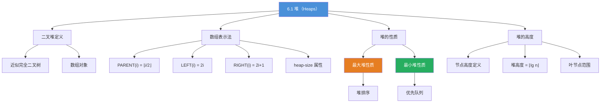

## 相关笔记

- [[算法导论/concepts/数据结构]]
- [[算法导论/concepts/分治法]]
- [[6.2 维护堆性质]]
- [[第06章_堆排序-章节汇总]]

> [!abstract] 概览
> 本节介绍==二叉堆（binary heap）==数据结构，它是一种可以被看作==近似完全二叉树==的数组对象。堆是堆排序算法和优先队列的基础数据结构。
>
> **核心要点：**
> - 二叉堆用数组存储，树中每个节点对应数组中的一个元素
> - 树的根节点为 $A[1]$，通过 `PARENT`、`LEFT`、`RIGHT` 三个过程计算父节点和子节点索引
> - ==最大堆==满足 $A[\text{PARENT}(i)] \ge A[i]$，最大元素在根节点
> - ==最小堆==满足 $A[\text{PARENT}(i)] \le A[i]$，最小元素在根节点
> - $n$ 个元素的堆的高度为 $\lfloor \lg n \rfloor$，基本操作运行时间为 $O(\lg n)$
> - 叶节点的索引范围为 $\lfloor n/2 \rfloor + 1, \lfloor n/2 \rfloor + 2, \ldots, n$

---

知识结构总览



---

核心思想

> [!tip] 核心思想
> 二叉堆巧妙地将==树形结构==与==数组存储==结合起来：利用完全二叉树的性质，通过简单的算术运算即可在 $O(1)$ 时间内定位任意节点的父节点和子节点，无需使用指针。这种表示法既节省空间（无指针开销），又支持高效的堆操作（$O(\lg n)$）。

> [!def] 二叉堆（Binary Heap）
> （二叉）堆数据结构是一个==数组对象==，可以将其视为一棵==近似完全二叉树==（nearly complete binary tree）。树中除最后一层外每一层都被完全填满，最后一层从左到右填充到某个位置。数组 $A[1..n]$ 表示堆，其中 $A.\text{heap-size}$ 属性记录堆中有效元素的数量（$0 \le A.\text{heap-size} \le n$）。

### 数组与树的对应关系

给定节点索引 $i$，其父节点和子节点的索引通过以下过程计算：

$$
\text{PARENT}(i) = \lfloor i/2 \rfloor
$$

$$
\text{LEFT}(i) = 2i
$$

$$
\text{RIGHT}(i) = 2i + 1
$$

**伪代码：**

```
PARENT(i)
1  return ⌊i/2⌋

LEFT(i)
1  return 2i

RIGHT(i)
1  return 2i + 1
```

**实现提示：** 在大多数计算机上，`LEFT` 可以通过将 $i$ 的二进制表示左移一位来计算 $2i$；`RIGHT` 可以通过左移一位再加 1 来计算 $2i+1$；`PARENT` 可以通过右移一位来计算 $\lfloor i/2 \rfloor$。高效的堆排序实现通常将这些过程实现为宏或内联过程。

> [!def] 最大堆性质（Max-Heap Property）
> 对于最大堆中除根节点以外的每个节点 $i$：
> $$A[\text{PARENT}(i)] \ge A[i]$$
> 即节点的值不超过其父节点的值。因此，==最大堆中的最大元素存储在根节点== $A[1]$ 中，以某节点为根的子树中所有值都不大于该节点的值。

> [!def] 最小堆性质（Min-Heap Property）
> 对于最小堆中除根节点以外的每个节点 $i$：
> $$A[\text{PARENT}(i)] \le A[i]$$
> 即节点的值不小于其父节点的值。因此，==最小堆中的最小元素存储在根节点== $A[1]$ 中。

### 堆的高度

> [!def] 堆的高度
> 堆中一个节点的高度定义为从该节点到==叶节点的最长简单向下路径上的边数==。堆的高度定义为其根节点的高度。
>
> 由于 $n$ 个元素的堆基于完全二叉树，其高度为 $\lfloor \lg n \rfloor$。

**推导过程：**

一棵高度为 $h$ 的完全二叉树，其节点数满足：
- 最少节点数：$2^h$（仅最底层有一个节点）
- 最多节点数：$2^{h+1} - 1$（满二叉树）

因此对于 $n$ 个节点的堆：
$$2^h \le n \le 2^{h+1} - 1 < 2^{h+1}$$

对不等式取对数：
$$h \le \lg n < h + 1$$

因此：
$$h = \lfloor \lg n \rfloor$$

### 叶节点的索引范围

> [!def] 叶节点范围
> 在 $n$ 个元素的堆的数组表示中，叶节点的索引为：
> $$\lfloor n/2 \rfloor + 1,\ \lfloor n/2 \rfloor + 2,\ \ldots,\ n$$

**推导过程：**

对于 $n$ 个节点的完全二叉树，最后一个非叶节点（即最后一个有子节点的节点）的索引为 $\lfloor n/2 \rfloor$。这是因为：
- 索引为 $i$ 的节点的左子节点为 $2i$，要求 $2i \le n$，即 $i \le \lfloor n/2 \rfloor$
- 因此索引大于 $\lfloor n/2 \rfloor$ 的节点没有子节点，即都是叶节点

---

补充理解与拓展

> [!info] 堆在现代编程语言标准库中的实现
> 各主流语言标准库中均提供了堆（优先队列）的实现，但默认堆类型和接口设计各有不同：
>
> - **C++ STL**：`<algorithm>` 头文件提供 `std::make_heap`、`std::push_heap`、`std::pop_heap`、`std::sort_heap`，默认构建**大顶堆**，传入 `std::greater<>()` 可切换为小顶堆。适用于支持随机访问的容器（vector、deque）。底层使用数组存储，与CLRS描述完全一致。
> - **Java**：`java.util.PriorityQueue` 默认是**最小堆**（与C++相反！）。内部使用数组存储，初始容量11，自动扩容。不支持索引访问，`iterator()` 不保证顺序。
> - **Python**：`heapq` 模块提供最小堆操作（`heappush`、`heappop`、`heapify`、`nlargest`、`nsmallest`），直接在普通list上操作，0-indexed（与CLRS的1-indexed不同）。`heap[0]` 始终是最小元素。
> - **Go**：`container/heap` 包提供堆接口，需要用户实现 `heap.Interface`（sort.Interface + Push/Pop方法），灵活但需要更多样板代码。
> - **Rust**：标准库无内置堆，但 `BinaryHeap` 在 `alloc::collections` 中，默认最大堆。
>
> **关键陷阱**：C++ 默认大顶堆 vs Java/Python 默认最小堆，切换语言时极易出错。
>
> 来源：Python docs (docs.python.org/3/library/heapq.html)、Boost.Heap docs (boost.org/doc/libs/latest/doc/html/heap.html)、procoding.org/built-in-heaps

> [!info] 堆与二叉搜索树（BST）的工程选择
> 在实际工程中，堆和BST各有适用场景：
>
> - **堆的优势**：$O(1)$ 取极值、$O(\lg n)$ 插入/删除极值、内存连续（缓存友好）、实现简单
> - **BST的优势**：$O(\lg n)$ 查找任意元素、$O(\lg n)$ 有序遍历、支持范围查询
> - **选择原则**：如果只需要极值操作（如优先队列、Top-K），用堆；如果需要查找/遍历/范围查询，用BST
> - **实际数据**：在Linux内核中，堆用于进程调度（CFS调度器的红黑树+优先队列）；在V8 JavaScript引擎中，堆用于内存管理（但这是GC堆，非数据结构堆）
>
> 来源：Python docs (docs.python.org/3/library/heapq.html)、Boost.Heap docs (boost.org/doc/libs/latest/doc/html/heap.html)、procoding.org/built-in-heaps

---

易混淆点与辨析

> [!warning] 最大堆 vs 最小堆
> | 比较项 | 最大堆 | 最小堆 |
> |--------|--------|--------|
> | 堆性质 | $A[\text{PARENT}(i)] \ge A[i]$ | $A[\text{PARENT}(i)] \le A[i]$ |
> | 根节点 | 存储最大元素 | 存储最小元素 |
> | 主要用途 | 堆排序 | 优先队列 |
> | 子树性质 | 子树中值不超过根 | 子树中值不小于根 |
>
> ❌ 常见错误：认为堆中任意父节点大于（或小于）其所有后代节点。实际上堆性质只保证父子之间的局部关系，但可以通过递推证明根节点确实是全局最大（或最小）值。
>
> ✅ 正确理解：堆性质是==局部性质==（parent-child），但通过传递性可以推导出==全局性质==（根节点是极值）。

> [!warning] 堆 vs 二叉搜索树
> | 比较项 | 堆 | 二叉搜索树（BST） |
> |--------|------|---------------------|
> | 结构 | 近似完全二叉树 | 任意形状（平衡时高效） |
> | 存储方式 | 数组（无指针） | 指针链接 |
> | 父子关系 | 父 $\ge$ 子（或父 $\le$ 子） | 左子 < 父 < 右子 |
> | 查找最大/最小 | $O(1)$（根节点） | $O(\log n)$（最左/最右） |
> | 有序遍历 | 无序 | 中序遍历得到有序序列 |
> | 用途 | 排序、优先队列 | 动态集合操作 |
>
> ❌ 常见错误：认为堆是一种二叉搜索树。堆只保证根节点是极值，不保证左右子树的有序性。
>
> ✅ 正确理解：堆和 BST 是不同的数据结构，堆关注的是==极值快速访问==，BST 关注的是==有序集合的高效操作==。

---

习题精选

| 题号 | 题目 | 难度 |
|:----:|------|:----:|
| 6.1-1 | 高度为 $h$ 的堆中最少和最多有多少个元素？ | ★☆☆ |
| 6.1-2 | 证明 $n$ 个元素的堆的高度为 $\lfloor \lg n \rfloor$ | ★★☆ |
| 6.1-4 | 在最大堆中（所有元素互不相同），最小元素可能在哪些位置？ | ★★☆ |
| 6.1-7 | 数组 $\langle 33, 19, 20, 15, 13, 10, 2, 13, 16, 12 \rangle$ 是否是最大堆？ | ★☆☆ |
| 6.1-8 | 证明 $n$ 元素堆的叶节点索引为 $\lfloor n/2 \rfloor + 1, \ldots, n$ | ★★☆ |

> [!faq]- 6.1-1 解答：高度为 $h$ 的堆中最少和最多有多少个元素？
> **解答：**
>
> - **最少元素数**：$2^h$。高度为 $h$ 的完全二叉树最少有 $2^h$ 个节点（最底层仅有 1 个节点，上面 $h$ 层每层满）。
> - **最多元素数**：$2^{h+1} - 1$。即满二叉树的情况，每层都完全填满。
>
> 推导：高度为 $h$ 意味着从根到叶的最长路径有 $h$ 条边，即 $h+1$ 层。最少时第 $h$ 层只有 1 个节点，共 $\sum_{k=0}^{h-1} 2^k + 1 = 2^h - 1 + 1 = 2^h$。最多时所有层都满，共 $\sum_{k=0}^{h} 2^k = 2^{h+1} - 1$。

> [!faq]- 6.1-2 解答：证明 $n$ 个元素的堆的高度为 $\lfloor \lg n \rfloor$
> **解答：**
>
> 设 $n$ 元素堆的高度为 $h$。由 6.1-1 的结论：
> $$2^h \le n \le 2^{h+1} - 1$$
>
> 由左边不等式：$h \le \lg n$
>
> 由右边不等式：$n < 2^{h+1}$，因此 $\lg n < h + 1$，即 $h > \lg n - 1$
>
> 综合得：$\lg n - 1 < h \le \lg n$
>
> 由于 $h$ 是整数，所以 $h = \lfloor \lg n \rfloor$。 $\blacksquare$

> [!faq]- 6.1-4 解答：最大堆中（所有元素互不相同）最小元素可能在哪些位置？
> **解答：**
>
> 最小元素一定是某个==叶节点==。
>
> **证明：** 假设最小元素在某个非叶节点 $i$ 处。由于 $i$ 不是叶节点，它至少有一个子节点 $j$。由最大堆性质，$A[i] \ge A[j]$。但 $A[i]$ 是最小元素，所以 $A[i] \le A[j]$。因此 $A[i] = A[j]$，与所有元素互不相同的假设矛盾。所以最小元素只能在叶节点处。
>
> 叶节点的索引范围为 $\lfloor n/2 \rfloor + 1, \lfloor n/2 \rfloor + 2, \ldots, n$。

> [!faq]- 6.1-7 解答：数组 $\langle 33, 19, 20, 15, 13, 10, 2, 13, 16, 12 \rangle$ 是否是最大堆？
> **解答：**
>
> **不是最大堆。**
>
> 检查每个非叶节点（索引 $1$ 到 $\lfloor 10/2 \rfloor = 5$）：
> - $i=1$：$A[1]=33$，左子 $A[2]=19 \le 33$ ✅，右子 $A[3]=20 \le 33$ ✅
> - $i=2$：$A[2]=19$，左子 $A[4]=15 \le 19$ ✅，右子 $A[5]=13 \le 19$ ✅
> - $i=3$：$A[3]=20$，左子 $A[6]=10 \le 20$ ✅，右子 $A[7]=2 \le 20$ ✅
> - $i=4$：$A[4]=15$，左子 $A[8]=13 \le 15$ ✅，右子 $A[9]=16 > 15$ ❌
>
> 节点 $i=4$ 违反了最大堆性质（$A[9] = 16 > A[4] = 15$），因此该数组不是最大堆。

> [!faq]- 6.1-8 解答：证明 $n$ 元素堆的叶节点索引为 $\lfloor n/2 \rfloor + 1, \ldots, n$
> **解答：**
>
> 一个节点 $i$ 是非叶节点当且仅当它至少有一个子节点。由于完全二叉树从左到右填充，节点 $i$ 有子节点当且仅当 $2i \le n$（即左子节点存在）。
>
> 因此 $i \le \lfloor n/2 \rfloor$ 时节点 $i$ 是非叶节点，$i > \lfloor n/2 \rfloor$ 时节点 $i$ 是叶节点。
>
> 叶节点的索引为 $\lfloor n/2 \rfloor + 1, \lfloor n/2 \rfloor + 2, \ldots, n$。 $\blacksquare$

---

视频学习指南

| 资源 | 主题 | 链接 | 说明 |
|------|------|------|------|
| MIT 6.006 Lecture 4 | Heaps and Heap Sort | https://www.youtube.com/watch?v=B7hVxCmfPtM | Erik Demaine 教授，完整讲解堆数据结构、建堆、堆排序 |
| MIT 6.006 Lecture 5 | Heaps and Priority Queues | https://www.youtube.com/watch?v=3dA7fOJQjJY | 优先队列应用、Dijkstra算法中的堆 |
| Abdul Bari | Heap Sort Algorithm | https://www.youtube.com/watch?v=MtQL_ll5KhQ | 直观的逐步动画演示，适合入门 |
| WilliamFiset | Heaps/Priority Queues | https://www.youtube.com/watch?v=t0Cq6tV1uYA | 数据结构系列，包含d-ary堆等高级变体 |
| 极客时间《数据结构与算法之美》| 堆与堆排序 | https://time.geekbang.org/column/article/69913 | 王争专栏，中文深度讲解，含工程实践讨论 |
| NeetCode | Heap Explained | https://www.youtube.com/watch?v=Xm2YgoeNbp4 | LeetCode刷题视角，含经典题目分类 |

---

教材原文

> [!quote] 原文摘录
> The (binary) heap data structure is an array object that we can view as a nearly complete binary tree. Each node of the tree corresponds to an element of the array. The tree is completely filled on all levels except possibly the lowest, which is filled from the left up to a point.
>
> （二叉）堆数据结构是一个数组对象，可以将其视为一棵近似完全二叉树。树中每个节点对应数组中的一个元素。树在除最后一层外的所有层都被完全填满，最后一层从左到右填充到某个位置。

> [!quote] 原文摘录
> In a max-heap, the max-heap property is that for every node $i$ other than the root, $A[\text{PARENT}(i)] \ge A[i]$, that is, the value of a node is at most the value of its parent. Thus, the largest element in a max-heap is stored at the root.
>
> 在最大堆中，最大堆性质是：对于除根节点以外的每个节点 $i$，$A[\text{PARENT}(i)] \ge A[i]$，即节点的值不超过其父节点的值。因此，最大堆中的最大元素存储在根节点中。

---

## 参见Wiki

- （概念页尚未创建）

---
#学习/算法导论/第06章-堆排序
