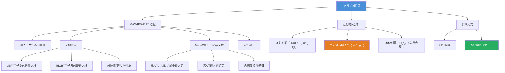
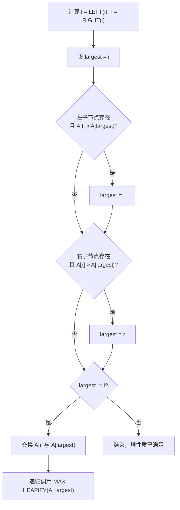
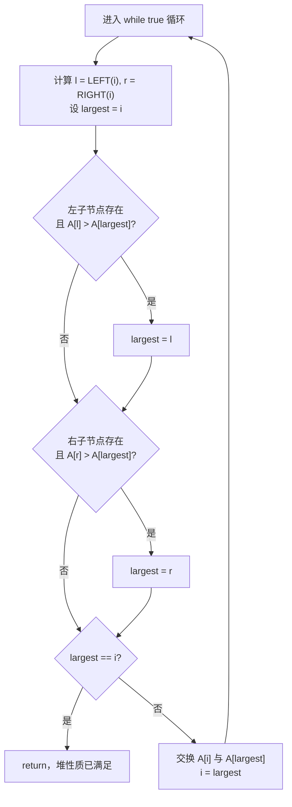

## 相关笔记

- [[算法导论/concepts/递归关系式]]
- [[算法导论/concepts/主定理]]
- [[6.1 堆]]
- [[第06章_堆排序-章节汇总]]

> [!abstract] 概览
> 本节介绍 ==MAX-HEAPIFY== 过程，它是维护==最大堆性质==的核心子程序。当某个节点违反最大堆性质时，MAX-HEAPIFY 通过让该节点的值"==下沉=="来恢复堆性质。
>
> **核心要点：**
> - MAX-HEAPIFY 的前提：以 $\text{LEFT}(i)$ 和 $\text{RIGHT}(i)$ 为根的子树已经是最大堆
> - 每一步将 $A[i]$ 与其较大的子节点比较，若子节点更大则交换并递归处理
> - 运行时间为 $O(\lg n)$，由递归关系式 $T(n) \le T(2n/3) + \Theta(1)$ 和==主定理==得出
> - 可以用==迭代==替代递归实现，消除递归调用的开销
> - 最坏情况下，元素从根节点一路下沉到叶节点

---

知识结构总览



---

核心思想

> [!tip] 核心思想
> MAX-HEAPIFY 采用"==自顶向下修正=="的策略：当某个节点 $i$ 的值可能小于其子节点时，将它与较大的子节点交换，使较大值"上浮"。交换后，被交换到下方的较小值可能再次违反堆性质，因此需要递归地向下修正，直到到达叶节点或堆性质被满足为止。这一过程本质上是让一个"违规"元素沿着树的一条路径==下沉==到正确位置。

> [!def] MAX-HEAPIFY 过程
> **输入**：数组 $A$（带有 $\text{heap-size}$ 属性）和索引 $i$。
>
> **前提假设**：以 $\text{LEFT}(i)$ 和 $\text{RIGHT}(i)$ 为根的两棵子树已经是最大堆，但 $A[i]$ 可能小于其子节点，从而违反最大堆性质。
>
> **功能**：让 $A[i]$ 的值在最大堆中"下沉"，使得以索引 $i$ 为根的子树满足最大堆性质。

### 伪代码

> [!tip] 算法执行流程
> 1. 计算 **largest = i**，同时获取左子节点索引 **l** 和右子节点索引 **r**
> 2. 若左子节点存在且 **A[l] > A[largest]**，更新 **largest = l**
> 3. 若右子节点存在且 **A[r] > A[largest]**，更新 **largest = r**
> 4. 若 **largest != i**，交换 **A[i]** 与 **A[largest]**，然后递归调整 **largest** 所在子树
> 5. 若 **largest == i**，说明堆性质已满足，过程结束



```
MAX-HEAPIFY(A, i)
1  l = LEFT(i)
2  r = RIGHT(i)
3  if l ≤ A.heap-size and A[l] > A[i]
4      largest = l
5  else largest = i
6  if r ≤ A.heap-size and A[r] > A[largest]
7      largest = r
8  if largest ≠ i
9      exchange A[i] with A[largest]
10     MAX-HEAPIFY(A, largest)
```

### 逐步执行逻辑

1. **第 1-2 行**：计算节点 $i$ 的左子节点索引 $l$ 和右子节点索引 $r$
2. **第 3-5 行**：如果左子节点存在（$l \le A.\text{heap-size}$）且 $A[l] > A[i]$，则将 `largest` 设为 $l$；否则 `largest` 保持为 $i$
3. **第 6-7 行**：如果右子节点存在且 $A[r] > A[\text{largest}]$，则将 `largest` 更新为 $r$
4. **第 8-10 行**：如果 `largest` 不等于 $i$（说明某个子节点比 $A[i]$ 大），则交换 $A[i]$ 与 $A[\text{largest}]$，然后对交换后 `largest` 所在的子树递归调用 MAX-HEAPIFY

### 迭代实现

> [!def] MAX-HEAPIFY 的迭代版本
> 递归调用在第 10 行可能产生低效代码（某些编译器处理递归调用的效率不高）。可以用循环替代递归：

> [!tip] 算法执行流程
> 1. 进入 **while true** 循环，计算当前节点 **i** 的左子节点 **l** 和右子节点 **r**，设 **largest = i**
> 2. 若左子节点存在且 **A[l] > A[largest]**，更新 **largest = l**
> 3. 若右子节点存在且 **A[r] > A[largest]**，更新 **largest = r**
> 4. 若 **largest == i**，说明堆性质已满足，**return** 退出循环
> 5. 否则交换 **A[i]** 与 **A[largest]**，然后 **i = largest**，回到步骤 1 继续下沉



```
MAX-HEAPIFY-ITERATIVE(A, i)
1  while true
2      l = LEFT(i)
3      r = RIGHT(i)
4      largest = i
5      if l ≤ A.heap-size and A[l] > A[largest]
6          largest = l
7      if r ≤ A.heap-size and A[r] > A[largest]
8          largest = r
9      if largest == i
10         return
11     exchange A[i] with A[largest]
12     i = largest
```

迭代版本将递归改为 `while true` 循环，当 `largest == i` 时通过 `return` 退出，否则交换后更新 $i = \text{largest}$ 继续循环。

### 运行时间分析

> [!def] 运行时间：$O(\lg n)$
> 设 $T(n)$ 为 MAX-HEAPIFY 在一个大小最多为 $n$ 的子树上的最坏情况运行时间。
>
> 对于以给定节点 $i$ 为根的树，运行时间包括：
> - 修正 $A[i]$、$A[\text{LEFT}(i)]$、$A[\text{RIGHT}(i)]$ 之间关系的 $\Theta(1)$ 时间
> - 加上在节点 $i$ 的某个子节点为根的子树上运行 MAX-HEAPIFY 的时间（假设发生了递归调用）
>
> 每个子节点的子树大小最多为 $2n/3$（参见习题 6.2-2），因此运行时间满足递归关系式：
> $$T(n) \le T(2n/3) + \Theta(1)$$

> **【主定理求解（递归关系式 T(n) ≤ T(2n/3) + Θ(1)）】**
>
> **使用主定理求解：**

对照主定理的形式 $T(n) = aT(n/b) + f(n)$：
- $a = 1$（只有一个子树需要递归处理）
- $b = 3/2$（子树大小最多为 $2n/3$，即 $n/b = 2n/3$）
- $f(n) = \Theta(1)$

计算 $n^{\log_b a} = n^{\log_{3/2} 1} = n^0 = 1$。

由于 $f(n) = \Theta(1) = \Theta(n^{\log_b a})$，适用==主定理情形 2==，因此：
$$T(n) = \Theta(\lg n)$$

即 $T(n) = O(\lg n)$。

**等价刻画：** MAX-HEAPIFY 在高度为 $h$ 的节点上的运行时间为 $O(h)$。由于堆的高度为 $\lfloor \lg n \rfloor$，所以 $O(h) = O(\lg n)$。

---

补充理解与拓展

> [!info] 堆的高级变体——从二叉堆到斐波那契堆
> 二叉堆是堆家族中最基础的成员，但针对不同应用场景，研究者发明了多种高级变体：
>
> | 堆类型 | MAKE-HEAP | INSERT | MIN/EXTRACT-MIN | DECREASE-KEY | UNION | 特点 |
> |--------|-----------|--------|-----------------|--------------|-------|------|
> | 二叉堆 | O(1) | O(lg n) | O(1)/O(lg n) | O(lg n) | O(n) | 最简单，缓存友好 |
> | d-ary堆 | O(1) | O(log_d n) | O(1)/O(d·log_d n) | O(d·log_d n) | O(n) | d=4时Dijkstra更快 |
> | 二项堆 | O(1) | O(lg n) | O(lg n)/O(lg n) | O(lg n) | O(lg n) | 支持高效合并 |
> | 斐波那契堆 | O(1) | O(1)* | O(lg n)*/O(lg n)* | O(1)* | O(1)* | DECREASE-KEY摊还O(1) |
> | 配对堆 | O(1) | O(1) | O(lg n)/O(lg n) | O(lg n)* | O(1)* | 实践中极快，理论不完善 |
>
> （*表示摊还复杂度）
>
> - **d-ary堆**：每个节点有d个子节点而非2个。当d=4时，Dijkstra算法中DECREASE-KEY操作更快，因为堆更浅。Boost.Heap库提供了 `d_ary_heap` 实现。
> - **斐波那契堆**：1987年由Fredman和Tarjan发明，通过"惰性合并"（lazy merging）实现DECREASE-KEY的摊还O(1)。理论上使Dijkstra算法降至O(V lg V + E)，但实现复杂，常数因子大，实践中往往不如二项堆。
> - **配对堆**：1986年由Fredman、Sedgewick、Sleator和Tarjan提出，结构极简（仅两个操作：meld和delete-min），实践中性能优异，但DELETE-MIN的O(lg n)摊还界直到2009年才被Iacono和Ozkan严格证明。
>
> 来源：Boost.Heap docs、Princeton COS 423 Lecture Notes (rp-heaps)、Wikipedia "Fibonacci heap"

> [!info] MAX-HEAPIFY的工程优化——迭代版本与缓存友好性
> CLRS给出的MAX-HEAPIFY是递归版本，但在实际工程中，迭代版本更常用：
>
> 1. **消除递归开销**：递归调用涉及函数调用栈的压入/弹出，迭代版本用while循环替代，减少指令数和分支预测失败
> 2. **尾递归优化**：MAX-HEAPIFY是尾递归（递归调用是最后一步操作），编译器可以将其优化为循环，但并非所有编译器都支持
> 3. **缓存行对齐**：堆操作访问模式是"跳跃式"的（从父节点跳到子节点），缓存局部性不如数组的顺序扫描。研究表明（LaMarca & Ladner, 1996），堆排序的缓存未命中率显著高于快速排序，这是堆排序在实际中慢于快速排序的主要原因之一
>
> 实际基准测试（来源：码小课/极客时代转载）：
> - 在随机数据上，快速排序通常比堆排序快2-3倍
> - 堆排序的优势在于最坏情况O(n lg n)保证，适合对延迟有严格要求的实时系统
> - 内存优化后的堆排序（如cache-oblivious heapsort）可以显著缩小与快速排序的差距
>
> 来源：LaMarca & Ladner, "The Influence of Caches on the Performance of Sorting", SODA 1996

---

易混淆点与辨析

> [!warning] MAX-HEAPIFY 的前提条件
> ❌ 常见错误：认为 MAX-HEAPIFY 可以将任意数组修正为最大堆。
>
> ✅ 正确理解：MAX-HEAPIFY 的正确运行依赖于一个==关键前提==——以 $\text{LEFT}(i)$ 和 $\text{RIGHT}(i)$ 为根的两棵子树必须已经是最大堆。如果这个前提不满足，MAX-HEAPIFY 的结果不一定是最大堆。
>
> 这个前提正是 [[6.1 堆]] 中提到的"自底向上"策略的理论基础：BUILD-MAX-HEAP 从最后一个非叶节点开始，逆序调用 MAX-HEAPIFY，确保每次调用时子树已经是最大堆。

> [!warning] MAX-HEAPIFY 的最坏情况
> ❌ 常见错误：认为 MAX-HEAPIFY 每次只交换一次就结束。
>
> ✅ 正确理解：在最坏情况下，$A[i]$ 的值比其所有后代都小，需要沿着从节点 $i$ 到叶节点的路径一路交换，共进行 $O(h) = O(\lg n)$ 次交换和递归调用。
>
> 构造最坏情况的例子：让根节点的值为 0，其余所有节点的值为 1。调用 MAX-HEAPIFY(A, 1) 时，0 会沿着某条路径一直下沉到叶节点。

---

习题精选

| 题号 | 题目 | 难度 |
|:----:|------|:----:|
| 6.2-1 | 用图 6.2 作为模型，说明 MAX-HEAPIFY(A, 3) 在数组 $A = \langle 27, 17, 3, 16, 13, 10, 1, 5, 7, 12, 4, 8, 9, 0 \rangle$ 上的操作过程 | ★★☆ |
| 6.2-2 | 证明 $n$ 个节点的堆的根的每个子节点是至多 $2n/3$ 个节点的子树的根 | ★★★ |
| 6.2-4 | 当 $A[i]$ 大于其子节点时，调用 MAX-HEAPIFY(A, i) 的效果是什么？ | ★☆☆ |
| 6.2-5 | 当 $i > A.\text{heap-size}/2$ 时，调用 MAX-HEAPIFY(A, i) 的效果是什么？ | ★☆☆ |
| 6.2-6 | 编写使用迭代控制结构（循环）替代递归的高效 MAX-HEAPIFY | ★★☆ |
| 6.2-7 | 证明 MAX-HEAPIFY 在大小为 $n$ 的堆上的最坏运行时间为 $\Omega(\lg n)$ | ★★★ |

> [!faq]- 6.2-1 解答：说明 MAX-HEAPIFY(A, 3) 在数组 $A = \langle 27, 17, 3, 16, 13, 10, 1, 5, 7, 12, 4, 8, 9, 0 \rangle$ 上的操作过程
> **解答：**
>
> 初始数组（$A.\text{heap-size} = 14$）：
> $$A = \langle 27, 17, 3, 16, 13, 10, 1, 5, 7, 12, 4, 8, 9, 0 \rangle$$
>
> 调用 MAX-HEAPIFY(A, 3)：
> - $i = 3$，$A[3] = 3$
> - $l = \text{LEFT}(3) = 6$，$A[6] = 10$
> - $r = \text{RIGHT}(3) = 7$，$A[7] = 1$
> - $A[6] = 10 > A[3] = 3$，所以 $\text{largest} = 6$
> - $A[7] = 1 < A[6] = 10$，$\text{largest}$ 保持为 $6$
> - $\text{largest} \ne 3$，交换 $A[3]$ 和 $A[6]$
>
> 交换后数组：
> $$A = \langle 27, 17, 10, 16, 13, 3, 1, 5, 7, 12, 4, 8, 9, 0 \rangle$$
>
> 递归调用 MAX-HEAPIFY(A, 6)：
> - $i = 6$，$A[6] = 3$
> - $l = \text{LEFT}(6) = 12$，$A[12] = 8$
> - $r = \text{RIGHT}(6) = 13$，$A[13] = 9$
> - $A[12] = 8 > A[6] = 3$，所以 $\text{largest} = 12$
> - $A[13] = 9 > A[12] = 8$，所以 $\text{largest} = 13$
> - $\text{largest} \ne 6$，交换 $A[6]$ 和 $A[13]$
>
> 交换后数组：
> $$A = \langle 27, 17, 10, 16, 13, 9, 1, 5, 7, 12, 4, 8, 3, 0 \rangle$$
>
> 递归调用 MAX-HEAPIFY(A, 13)：
> - $i = 13$，$A[13] = 3$
> - $l = \text{LEFT}(13) = 26 > 14 = A.\text{heap-size}$，左子节点不存在
> - $\text{largest} = 13$，$\text{largest} == i$，过程结束
>
> **最终数组**：$\langle 27, 17, 10, 16, 13, 9, 1, 5, 7, 12, 4, 8, 3, 0 \rangle$

> [!faq]- 6.2-2 解答：证明根的每个子节点是至多 $2n/3$ 个节点的子树的根
> **解答：**
>
> **【放缩法（子树大小上界估计）】**
>
> 设堆有 $n$ 个节点，高度为 $h = \lfloor \lg n \rfloor$。根节点的左子树和右子树的高度最多为 $h - 1$。
>
> 最坏情况下，左子树尽可能大。这发生在最后一层的所有节点都在左子树中时。
>
> 高度为 $h$ 的堆中，第 $0$ 层到第 $h-1$ 层共有 $2^h - 1$ 个节点。最后一层（第 $h$ 层）最多有 $2^h$ 个节点。
>
> 左子树（高度为 $h-1$）最多包含：
> - 第 $1$ 层到第 $h-1$ 层的所有节点：$2^{h-1} - 1$ 个
> - 第 $h$ 层的节点（全在左子树）：$2^{h-1}$ 个
> - 总计：$2^{h-1} - 1 + 2^{h-1} = 2^h - 1$ 个
>
> 右子树（高度为 $h-1$）最少包含：
> - 第 $1$ 层到第 $h-1$ 层的所有节点：$2^{h-1} - 1$ 个
> - 第 $h$ 层的节点：$0$ 个
> - 总计：$2^{h-1} - 1$ 个
>
> 总节点数 $n$ 最少为 $(2^h - 1) + (2^{h-1} - 1) + 1 = 2^h + 2^{h-1} - 1$（根节点 + 左子树 + 右子树最少）。
>
> 但更精确的分析：最坏情况下左子树大小为 $2^h - 1$，总节点数 $n = 1 + (2^h - 1) + (2^{h-1} - 1) = 2^h + 2^{h-1} - 1$。
>
> 左子树占比：$\frac{2^h - 1}{2^h + 2^{h-1} - 1} = \frac{2^h - 1}{\frac{3}{2} \cdot 2^h - 1}$
>
> 当 $h$ 很大时，这个比值趋近于 $\frac{2^h}{\frac{3}{2} \cdot 2^h} = \frac{2}{3}$。
>
> 因此每个子树最多包含 $\frac{2n}{3}$ 个节点。$\blacksquare$

> [!faq]- 6.2-4 解答：当 $A[i]$ 大于其子节点时，调用 MAX-HEAPIFY(A, i) 的效果是什么？
> **解答：**
>
> 如果 $A[i]$ 已经大于或等于其两个子节点，则：
> - 第 3 行条件 $A[l] > A[i]$ 不成立，`largest` 保持为 $i$
> - 第 6 行条件 $A[r] > A[\text{largest}] = A[i]$ 也不成立
> - 第 8 行 $\text{largest} == i$，不执行交换，过程直接结束
>
> **效果：** MAX-HEAPIFY 什么都不做，直接返回。因为以 $i$ 为根的子树已经是最大堆。

> [!faq]- 6.2-5 解答：当 $i > A.\text{heap-size}/2$ 时，调用 MAX-HEAPIFY(A, i) 的效果是什么？
> **解答：**
>
> 当 $i > \lfloor A.\text{heap-size}/2 \rfloor$ 时，节点 $i$ 是==叶节点==（由 [[6.1 堆]] 中叶节点范围的结论）。
>
> - $l = \text{LEFT}(i) = 2i > A.\text{heap-size}$，左子节点不存在
> - 第 3 行条件 $l \le A.\text{heap-size}$ 不成立
> - `largest` 保持为 $i$
> - 第 6 行条件 $r \le A.\text{heap-size}$ 也不成立（$r = 2i + 1 > A.\text{heap-size}$）
> - $\text{largest} == i$，过程直接结束
>
> **效果：** MAX-HEAPIFY 什么都不做。叶节点没有子节点，天然满足堆性质。

> [!faq]- 6.2-6 解答：编写迭代版本的 MAX-HEAPIFY
> **解答：**
>
> 见上文"迭代实现"部分的伪代码。核心思路是将递归调用改为 `while` 循环，在每次迭代中执行相同的比较-交换逻辑，当不需要交换时通过 `return` 退出循环。
>
> 迭代版本的优势：
> 1. 避免了递归调用的函数开销（压栈、出栈）
> 2. 某些编译器对循环的优化能力优于尾递归
> 3. 不会出现栈溢出的风险

> [!faq]- 6.2-7 解答：证明 MAX-HEAPIFY 的最坏运行时间为 $\Omega(\lg n)$
> **解答：**
>
> **【最坏情况构造（路径长度下界分析）】**
>
> **构造最坏情况：** 在一个有 $n$ 个节点的堆中，设根节点 $A[1]$ 的值为 $-\infty$（或某个极小的值），其余所有节点的值为正数。调用 MAX-HEAPIFY(A, 1)。
>
> 由于 $A[1]$ 比其两个子节点都小，每次比较都会触发交换，$A[1]$ 的值沿着从根到叶的路径一路下沉。这条路径的长度等于堆的高度 $h = \lfloor \lg n \rfloor$。
>
> 每次递归调用需要 $\Theta(1)$ 时间（比较和交换），共发生 $h$ 次递归调用，因此总时间为 $\Theta(h) = \Theta(\lg n)$。
>
> 因此最坏运行时间为 $\Omega(\lg n)$。结合上界 $O(\lg n)$，最坏运行时间为 $\Theta(\lg n)$。$\blacksquare$

---

视频学习指南

| 资源 | 主题 | 链接 | 说明 |
|------|------|------|------|
| MIT 6.006 Lecture 4 | Heaps and Heap Sort | https://www.youtube.com/watch?v=B7hVxCmfPtM | MAX-HEAPIFY的详细讲解与图示 |
| Abdul Bari | Heap Sort Algorithm | https://www.youtube.com/watch?v=MtQL_ll5KhQ | Heapify过程的逐步动画 |
| WilliamFiset | D-ary Heaps | https://www.youtube.com/watch?v=WCm3Taq7Gqc | d-ary堆变体，Dijkstra优化 |
| NeetCode | Min/Max Heap | https://www.youtube.com/watch?v=t0Cq6tV1uYA | 堆的实现与LeetCode题目 |
| 3Blue1Brown | FFT相关数学 | https://www.youtube.com/watch?v=spUNpyF58BY | 补充：等比数列求和的直觉理解 |

---

教材原文

> [!quote] 原文摘录
> The procedure MAX-HEAPIFY maintains the max-heap property. Its inputs are an array A with the heap-size attribute and an index i into the array. When it is called, MAX-HEAPIFY assumes that the binary trees rooted at LEFT(i) and RIGHT(i) are max-heaps, but that A[i] might be smaller than its children, thus violating the max-heap property. MAX-HEAPIFY lets the value at A[i] "float down" in the max-heap so that the subtree rooted at index i obeys the max-heap property.
>
> MAX-HEAPIFY 过程维护最大堆性质。其输入是带有 heap-size 属性的数组 A 和数组中的索引 i。当被调用时，MAX-HEAPIFY 假设以 LEFT(i) 和 RIGHT(i) 为根的二叉树已经是最大堆，但 A[i] 可能小于其子节点，从而违反最大堆性质。MAX-HEAPIFY 让 A[i] 的值在最大堆中"下沉"，使得以索引 i 为根的子树满足最大堆性质。

> [!quote] 原文摘录
> Each step determines the largest of the elements A[i], A[LEFT(i)], and A[RIGHT(i)] and stores the index of the largest element in largest. If A[i] is largest, then the subtree rooted at node i is already a max-heap and nothing else needs to be done. Otherwise, one of the two children contains the largest element. Positions i and largest swap their contents, which causes node i and its children to satisfy the max-heap property. The node indexed by largest, however, just had its value decreased, and thus the subtree rooted at largest might violate the max-heap property. Consequently, MAX-HEAPIFY calls itself recursively on that subtree.
>
> 每一步确定 A[i]、A[LEFT(i)] 和 A[RIGHT(i)] 中的最大元素，并将最大元素的索引存储在 largest 中。如果 A[i] 是最大的，则以节点 i 为根的子树已经是最大堆，无需做其他事情。否则，两个子节点之一包含最大元素。交换位置 i 和 largest 的内容，使得节点 i 及其子节点满足最大堆性质。然而，索引为 largest 的节点的值刚刚被减小，因此以 largest 为根的子树可能违反最大堆性质。因此，MAX-HEAPIFY 在该子树上递归调用自身。

---

## 参见Wiki

- （概念页尚未创建）

---
#学习/算法导论/第06章-堆排序
