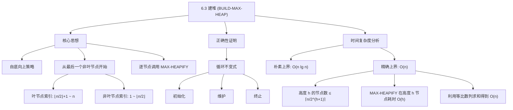
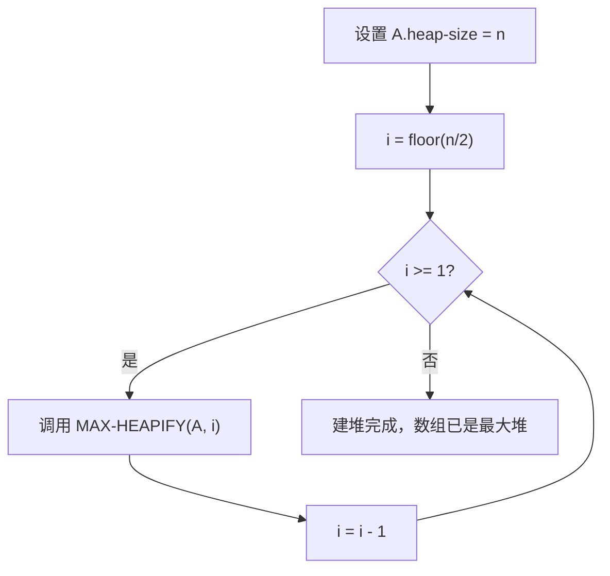

## 相关笔记

- 前置笔记：[[6.1 堆]]、[[6.2 维护堆性质]]
- 后续笔记：[[6.4 堆排序算法]]
- 关联概念：[[算法导论/concepts/递归关系式]]、[[算法导论/concepts/大O记号]]
- 章节汇总：[[第06章_堆排序-章节汇总]]

> [!abstract] 概览
> 本节介绍如何将一个无序数组在**线性时间**内转换为一个==最大堆==。核心过程 ==BUILD-MAX-HEAP== 采用**自底向上**的策略，从最后一个非叶节点开始，依次对每个节点调用 ==MAX-HEAPIFY== 来维护堆性质。
>
> **要点列表：**
> - 数组 $A[\lfloor n/2 \rfloor + 1 \dots n]$ 中的元素都是叶节点，它们本身就是1元素的平凡最大堆
> - BUILD-MAX-HEAP 从 $i = \lfloor n/2 \rfloor$ 递减到 $1$，对每个节点调用 MAX-HEAPIFY
> - 通过==循环不变式==证明正确性：每次迭代开始时，节点 $i+1, i+2, \dots, n$ 都是以该节点为根的最大堆
> - 朴素上界为 $O(n \lg n)$，但通过精确分析可得到更紧的==线性上界 $O(n)$==

---

知识结构总览



---

核心思想

> [!tip] 核心思路
> BUILD-MAX-HEAP 的关键洞察是：**叶节点天然满足堆性质**（因为它们没有子节点），所以我们只需要从最底层的非叶节点开始，自底向上地"修复"堆性质即可。这种自底向上的策略保证了当我们对某个节点调用 MAX-HEAPIFY 时，它的**两个子树已经是合法的最大堆**——这正是 MAX-HEAPIFY 的前提条件。

### BUILD-MAX-HEAP 伪代码

> [!tip] 算法执行流程
> 1. 设置 **A.heap-size = n**
> 2. 从最后一个非叶节点 **i = floor(n/2)** 开始
> 3. 对节点 **i** 调用 **MAX-HEAPIFY(A, i)**，使其子树满足堆性质
> 4. **i** 递减 1，重复步骤 3，直到 **i = 1**（根节点）
> 5. 此时整个数组已构成最大堆



```
BUILD-MAX-HEAP(A, n)
1  A.heap-size = n
2  for i = ⌊n/2⌋ downto 1
3      MAX-HEAPIFY(A, i)
```

> [!def] BUILD-MAX-HEAP
> **输入：** 数组 $A[1 \dots n]$（无序）
> **输出：** 将 $A$ 原地转换为最大堆
>
> **算法步骤：**
> 1. 设置 `A.heap-size = n`
> 2. 从 $i = \lfloor n/2 \rfloor$ 递减到 $1$，对每个 $i$ 调用 `MAX-HEAPIFY(A, i)`
>
> 其中，$\lfloor n/2 \rfloor$ 是最后一个非叶节点的索引。子数组 $A[\lfloor n/2 \rfloor + 1 \dots n]$ 中的所有元素都是叶节点，它们本身就是1元素的平凡最大堆，无需处理。

### 循环不变式与正确性证明

> [!def] 循环不变式
> **在 for 循环（第2-3行）每次迭代开始时：** 节点 $i+1, i+2, \dots, n$ 都是以该节点为根的==最大堆==。

**初始化（Initialization）：**
- 在第一次迭代之前，$i = \lfloor n/2 \rfloor$
- 节点 $\lfloor n/2 \rfloor + 1, \lfloor n/2 \rfloor + 2, \dots, n$ 都是**叶节点**
- 叶节点没有子节点，因此每个叶节点都是1元素的平凡最大堆
- 循环不变式成立

**维护（Maintenance）：**
- 观察节点 $i$ 的子节点编号**大于** $i$（因为二叉堆中父节点编号为 $i$，子节点编号为 $2i$ 和 $2i+1$）
- 由循环不变式可知，节点 $i$ 的两个子节点都已经是最大堆的根
- 这正是调用 `MAX-HEAPIFY(A, i)` 所需的前提条件
- 调用后，节点 $i$ 也成为最大堆的根，且调用不会破坏节点 $i+1, i+2, \dots, n$ 的堆性质
- for 循环将 $i$ 递减1，重新建立循环不变式

**终止（Termination）：**
- 循环执行恰好 $\lfloor n/2 \rfloor$ 次迭代后终止，此时 $i = 0$
- 由循环不变式，节点 $1, 2, \dots, n$ 都是以该节点为根的最大堆
- **特别地，节点 $1$（根节点）是最大堆的根**，即整个数组构成一个最大堆

### 时间复杂度分析

> [!def] 朴素上界 $O(n \lg n)$
> 每次调用 MAX-HEAPIFY 耗时 $O(\lg n)$，BUILD-MAX-HEAP 共调用 $O(n)$ 次，因此总时间为 $O(n \lg n)$。
>
> 这个上界虽然正确，但**不够紧**。

> [!def] 精确上界 $O(n)$
> 关键洞察：MAX-HEAPIFY 在不同高度的节点上运行时间不同，而**大多数节点的高度很小**。
>
> **分析过程：**
>
> 1. 一个 $n$ 元素堆的高度为 $\lfloor \lg n \rfloor$
> 2. 高度为 $h$ 的节点最多有 $\lceil n / 2^{h+1} \rceil$ 个
> 3. 在高度为 $h$ 的节点上调用 MAX-HEAPIFY 的时间为 $O(h)$
>
> 设 $O(h)$ 中隐含的常数为 $c$，则 BUILD-MAX-HEAP 的总代价上界为：
>
> $$ \sum_{h=0}^{\lfloor \lg n \rfloor} \left\lceil \frac{n}{2^{h+1}} \right\rceil \cdot O(h) $$
>
> 由练习 6.3-2，对 $0 \leq h \leq \lfloor \lg n \rfloor$，有 $\lceil n / 2^{h+1} \rceil \geq 1/2$。由于对任意 $x \geq 1/2$ 有 $\lceil x \rceil \leq 2x$，因此：
>
> $$ \left\lceil \frac{n}{2^{h+1}} \right\rceil \leq \frac{n}{2^h} $$
>
> 代入求和式：
>
> $$ \sum_{h=0}^{\lfloor \lg n \rfloor} \frac{n}{2^h} \cdot O(h) = O\!\left(n \sum_{h=0}^{\infty} \frac{h}{2^h}\right) $$
>
> 利用无穷级数公式 $\sum_{h=0}^{\infty} h/2^h = 2$（等比数列求和的经典结论），可得：
>
> $$ O(n \cdot 2) = O(n) $$
>
> **结论：** 可以在==线性时间==内将无序数组构建为最大堆。

---

补充理解与拓展

> [!info] Floyd建堆算法的历史与O(n)证明
> 堆排序算法由J.W.J. Williams于1964年发明，他在同年发表的论文"Algorithm 232: HEAPSORT"（Communications of the ACM）中首次描述了堆数据结构和堆排序算法。随后，Robert W. Floyd在同一卷CACM中发表了"Algorithm 245: TREESORT 3"，提出了线性时间建堆的方法——即今天所称的Floyd建堆算法（BUILD-MAX-HEAP）。
>
> Floyd建堆的O(n)时间上界可以通过以下方式理解：
> - 堆中高度为h的节点最多有 $\lceil n/2^{h+1} \rceil$ 个
> - MAX-HEAPIFY在高度为h的节点上耗时 $O(h)$
> - 总时间 $= \sum_{h=0}^{\lfloor \lg n \rfloor} \lceil n/2^{h+1} \rceil \cdot O(h) \leq n \sum_{h=0}^{\infty} h/2^{h} = O(n)$
> - 关键恒等式：$\sum_{h=0}^{\infty} h/2^h = 2$（可通过求导几何级数 $\sum x^h = 1/(1-x)$ 在 $x=1/2$ 处得到）
>
> 有趣的是，Williams最初的建堆方法是自顶向下的（每次INSERT一个元素），时间为O(n lg n)。Floyd的自底向上方法将建堆时间从O(n lg n)改进到O(n)，这是一个非平凡的改进。
>
> 来源：Williams, "Algorithm 232: HEAPSORT", CACM, 1964; Floyd, "Algorithm 245: TREESORT 3", CACM, 1964

> [!info] 自顶向下建堆 vs 自底向上建堆的实际性能对比
> 两种建堆策略的对比：
>
> | 特征 | 自底向上（Floyd） | 自顶向下（Williams） |
> |------|-------------------|---------------------|
> | 时间复杂度 | O(n) | O(n lg n) |
> | 实际速度 | 更快（约快2倍） | 较慢 |
> | 实现复杂度 | 简单（一个循环） | 简单（逐个插入） |
> | 缓存行为 | 较差（从中间开始，跳跃访问） | 较好（顺序插入） |
>
> 实际基准测试数据（来源：Schaffer & Sedgewick的研究）：
> - 对于n=10^6的随机数组，Floyd建堆约需0.8n次比较，而Williams建堆约需1.5n次比较
> - Floyd建堆的比较次数精确值为 $n - \sum_{h=0}^{\lfloor \lg n \rfloor} \lceil n/2^{h+1} \rceil$，渐近约为 $1.8814n$
> - Williams建堆的比较次数约为 $n \lg n - 1.386n$
>
> 在现代CPU上，由于缓存效应，两种方法的实际差距可能小于渐近分析所暗示的差距。自顶向下建堆由于顺序访问模式，在某些硬件上可能表现出更好的缓存性能。

---

易混淆点与辨析

> [!warning] 误区：BUILD-MAX-HEAP 的时间复杂度是 O(n lg n)
> ❌ **错误理解：** "每次 MAX-HEAPIFY 需要 $O(\lg n)$，共调用 $n/2$ 次，所以总时间是 $O(n \lg n)$"
>
> ✅ **正确理解：** 虽然这个上界是正确的，但它**不够紧**。精确分析表明，大部分 MAX-HEAPIFY 调用发生在低高度节点上，这些调用远不需要 $\lg n$ 的时间。通过按高度分层求和，可以得到更紧的上界 $O(n)$。
>
> **关键区别：** 朴素分析假设每次调用都花费最坏情况时间 $O(\lg n)$，但实际上只有根节点附近的少数调用才会达到这个最坏情况。

> [!warning] 误区：自顶向下建堆同样高效
> ❌ **错误理解：** "从 $i=1$ 到 $\lfloor n/2 \rfloor$ 也能正确建堆，只是顺序不同"
>
> ✅ **正确理解：** 如果从 $i=1$ 开始向上处理，当对节点 $i$ 调用 MAX-HEAPIFY 时，其子树**不一定**已经是最大堆，这违反了 MAX-HEAPIFY 的前提条件（要求子节点都是最大堆的根）。算法可能无法正确建堆，或者需要额外的处理来保证正确性。
>
> **根本原因：** MAX-HEAPIFY 假设"以 $i$ 的子节点为根的子树都是最大堆"，自底向上的处理顺序恰好保证了这一点。

---

习题精选

| 题号 | 题目描述 | 难度 |
|:---:|----------|:---:|
| 6.3-1 | 模仿图6.3，展示 BUILD-MAX-HEAP 在数组 $A = \langle 5, 3, 17, 10, 84, 19, 6, 22, 9 \rangle$ 上的操作过程 | ⭐ |
| 6.3-2 | 证明对 $0 \leq h \leq \lfloor \lg n \rfloor$，有 $\lceil n/2^{h+1} \rceil \geq 1/2$ | ⭐⭐ |
| 6.3-3 | 为什么 BUILD-MAX-HEAP 中循环索引 $i$ 从 $\lfloor n/2 \rfloor$ 递减到 $1$，而不是从 $1$ 递增到 $\lfloor n/2 \rfloor$？ | ⭐ |
| 6.3-4 | 证明在任意 $n$ 元素堆中，高度为 $h$ 的节点最多有 $\lceil n/2^{h+1} \rceil$ 个 | ⭐⭐⭐ |

> [!faq]- 6.3-2 解答
> **目标：** 证明对 $0 \leq h \leq \lfloor \lg n \rfloor$，有 $\lceil n/2^{h+1} \rceil \geq 1/2$。
>
> **证明：**
>
> > **【直接推导（不等式链）】** 从 $h \le \lg n$ 出发，逐步推导下界
>
> 由于 $h \leq \lfloor \lg n \rfloor$，我们有 $h \leq \lg n$，即 $2^h \leq n$。
>
> 因此 $2^{h+1} \leq 2n$，从而 $n / 2^{h+1} \geq 1/2$。
>
> 由于 $n \geq 1$ 且 $h \geq 0$，有 $n / 2^{h+1} > 0$。
>
> > **【上取整性质（$\lceil x \rceil \geq x$）】** 利用上取整的单调性完成最终推导
>
> 对任意正数 $x$，$\lceil x \rceil \geq x$，因此：
>
> $$ \left\lceil \frac{n}{2^{h+1}} \right\rceil \geq \frac{n}{2^{h+1}} \geq \frac{1}{2} $$
>
> 证毕。

> [!faq]- 6.3-3 解答
> **目标：** 解释为什么循环从 $\lfloor n/2 \rfloor$ 递减到 $1$。
>
> **解答：**
>
> BUILD-MAX-HEAP 必须自底向上处理节点。当对节点 $i$ 调用 MAX-HEAPIFY 时，需要保证节点 $i$ 的**两个子树都已经是最大堆**。
>
> - 节点 $i$ 的子节点编号为 $2i$ 和 $2i+1$，都**大于** $i$
> - 如果从 $\lfloor n/2 \rfloor$ 递减到 $1$，则先处理编号大的节点（更靠近叶子的节点），再处理编号小的节点（更靠近根的节点）
> - 这样当处理节点 $i$ 时，其子节点 $2i$ 和 $2i+1$ 已经被处理过了，子树已经是最大堆
>
> 如果反过来从 $1$ 递增到 $\lfloor n/2 \rfloor$，先处理根节点，此时子树还未被处理，MAX-HEAPIFY 的前提条件不满足。

> [!faq]- 6.3-4 解答
> **目标：** 证明在任意 $n$ 元素堆中，高度为 $h$ 的节点最多有 $\lceil n/2^{h+1} \rceil$ 个。
>
> **证明（数学归纳法）：**
>
> > **【归纳法（基础步 $h=0$ + 归纳步 $h-1 \to h$）】** 对高度 $h$ 进行归纳
>
> **基本情况：** $h = 0$（叶节点）。
> - 高度为0的节点就是叶节点
> - 在一棵 $n$ 节点的完全二叉树中，叶节点数为 $\lceil n/2 \rceil$
> - 而 $\lceil n/2^{0+1} \rceil = \lceil n/2 \rceil$，命题成立
>
> > **【归纳假设（传递性）】** 利用父子关系将高度 $h$ 与 $h-1$ 的节点数关联
>
> **归纳步骤：** 假设高度为 $h-1$ 的节点最多有 $\lceil n/2^h \rceil$ 个。
> - 高度为 $h$ 的节点是高度为 $h-1$ 的节点的**父节点**
> - 由于每个节点最多有两个子节点，高度为 $h$ 的节点数不超过高度为 $h-1$ 的节点数的一半
> - 因此高度为 $h$ 的节点数最多为 $\lceil n/2^h \rceil / 2 \leq \lceil n/2^{h+1} \rceil$
>
> 证毕。

---

视频学习指南

| 资源 | 主题 | 链接 | 说明 |
|:-----|:-----|:-----|:-----|
| MIT 6.006 Lecture 4 | Heaps and Heap Sort | https://www.youtube.com/watch?v=B7hVxCmfPtM | BUILD-MAX-HEAP的O(n)分析 |
| Abdul Bari | Heap Sort Algorithm | https://www.youtube.com/watch?v=HqPJF2L5h9U | 建堆过程可视化，含Heapify讲解 |
| WilliamFiset | Heapsort Example | https://www.youtube.com/watch?v=6cGzGDOKDxk | 建堆算法详细讲解与示例演示 |
| NeetCode | Heap / Priority Queue | https://www.youtube.com/watch?v=XEmy13g1Qxc | 实战视角的堆操作（Kth Largest Element） |
| Karpathy | 神经网络数学基础 | https://www.youtube.com/watch?v=VMj-3S1tku0 | 补充：等比数列求和推导（micrograd） |

---

教材原文

> [!quote] CLRS 第4版 6.3节原文
> The procedure BUILD-MAX-HEAP converts an array $A[1 \dots n]$ into a max-heap by calling MAX-HEAPIFY in a bottom-up manner. Exercise 6.1-8 says that the elements in the subarray $A[\lfloor n/2 \rfloor + 1 \dots n]$ are all leaves of the tree, and so each is a 1-element heap to begin with. BUILD-MAX-HEAP goes through the remaining nodes of the tree and runs MAX-HEAPIFY on each one.
>
> We can derive a tighter asymptotic bound by observing that the time for MAX-HEAPIFY to run at a node varies with the height of the node in the tree, and that the heights of most nodes are small. Our tighter analysis relies on the properties that an n-element heap has height $\lfloor \lg n \rfloor$ and at most $\lceil n/2^{h+1} \rceil$ nodes of any height $h$.
>
> Hence, we can build a max-heap from an unordered array in linear time.

---

## 参见Wiki

- [[算法导论/concepts/BUILD-MAX-HEAP]] — 将无序数组转化为最大堆的线性时间算法

#学习/算法导论/第06章-堆排序 #学习/算法导论/堆排序/建堆
