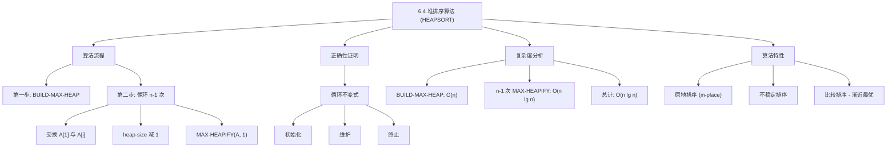
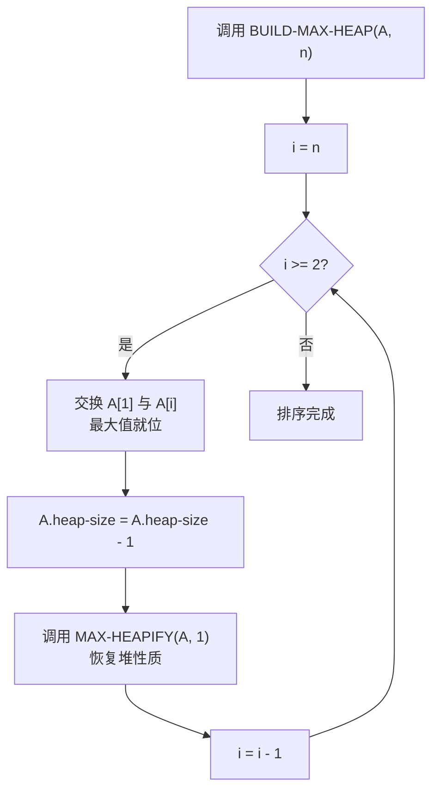

## 相关笔记

- 前置笔记：[[6.1 堆]]、[[6.2 维护堆性质]]、[[6.3 建堆]]
- 关联概念：[[算法导论/concepts/排序问题]]、[[算法导论/concepts/插入排序]]、[[算法导论/concepts/归并排序]]
- 章节汇总：[[第06章_堆排序-章节汇总]]

> [!abstract] 概览
> 本节介绍 ==HEAPSORT== 算法，它是==堆数据结构==最经典的应用之一。HEAPSORT 首先调用 ==BUILD-MAX-HEAP== 将输入数组构建为最大堆，然后反复将堆顶的==最大元素==与堆的最后一个元素交换，缩小堆的规模，再通过 ==MAX-HEAPIFY== 恢复堆性质。整个过程在==原地==完成，无需额外存储空间。
>
> **要点列表：**
> - HEAPSORT 的运行时间为 ==$O(n \lg n)$==，其中 BUILD-MAX-HEAP 耗时 $O(n)$，$n-1$ 次 MAX-HEAPIFY 调用共耗时 $O(n \lg n)$
> - HEAPSORT 是==原地排序算法==（in-place），仅需常数级额外空间
> - HEAPSORT 是==比较排序==，其最坏情况运行时间 $\Omega(n \lg n)$ 与下界匹配，因此是==渐近最优==的比较排序算法之一
> - 通过==循环不变式==可以严格证明排序的正确性

---

知识结构总览



---

核心思想

> [!tip] 核心思路
> HEAPSORT 巧妙地利用了最大堆的性质：**堆顶元素始终是最大值**。算法的基本策略是：
> 1. 先将整个数组构建为最大堆
> 2. 将堆顶最大元素与数组末尾交换——最大元素就位
> 3. 缩小堆的规模（排除已就位的元素），对新的堆顶执行 MAX-HEAPIFY 恢复堆性质
> 4. 重复步骤2-3，直到堆中只剩一个元素
>
> 这个过程就像 repeatedly 从一堆石头中挑出最大的那块放到最终位置，每次挑完后重新整理剩下的石头。

### HEAPSORT 伪代码

> [!tip] 算法执行流程
> 1. 调用 **BUILD-MAX-HEAP(A, n)** 将数组构建为最大堆
> 2. 从 **i = n** 开始，将堆顶 **A[1]**（当前最大值）与 **A[i]** 交换，最大值就位
> 3. **A.heap-size** 减 1，将已就位的元素排除出堆
> 4. 对新的堆顶调用 **MAX-HEAPIFY(A, 1)** 恢复堆性质
> 5. **i** 递减 1，重复步骤 2-4，直到 **i = 1**，排序完成



```
HEAPSORT(A, n)
1  BUILD-MAX-HEAP(A, n)
2  for i = n downto 2
3      exchange A[1] with A[i]
4      A.heap-size = A.heap-size - 1
5      MAX-HEAPIFY(A, 1)
```

> [!def] HEAPSORT
> **输入：** 数组 $A[1 \dots n]$（无序）
> **输出：** 将 $A$ 原地排序为非降序序列
>
> **算法步骤：**
> 1. **建堆：** 调用 `BUILD-MAX-HEAP(A, n)`，将数组转换为最大堆
> 2. **排序循环：** 从 $i = n$ 递减到 $2$：
>    - 将 $A[1]$（当前最大元素）与 $A[i]$ 交换，最大元素就位
>    - 将 `A.heap-size` 减1，将 $A[i]$ 排除出堆
>    - 对新的堆顶调用 `MAX-HEAPIFY(A, 1)`，恢复堆性质

### 循环不变式与正确性证明

> [!def] 循环不变式
> **在 for 循环（第2-5行）每次迭代开始时：**
> - 子数组 $A[1 \dots i]$ 是一个包含 $A[1 \dots n]$ 中**最小的 $i$ 个元素**的==最大堆==
> - 子数组 $A[i+1 \dots n]$ 包含 $A[1 \dots n]$ 中**最大的 $n-i$ 个元素**，且已==排好序==

**初始化（Initialization）：**
- 在第一次迭代之前，$i = n$
- 刚执行完 `BUILD-MAX-HEAP`，$A[1 \dots n]$ 是一个最大堆，包含所有 $n$ 个元素
- 子数组 $A[n+1 \dots n]$ 为空，空数组自然是有序的
- 循环不变式成立

**维护（Maintenance）：**
- 每次迭代开始时，$A[1 \dots i]$ 是最大堆，$A[i+1 \dots n]$ 已排序且包含最大的 $n-i$ 个元素
- 第3行将 $A[1]$（堆中的最大元素，也是 $A[1 \dots i]$ 中的最大元素）与 $A[i]$ 交换
- 交换后，$A[i]$ 现在存放的是 $A[1 \dots i]$ 中的最大值，它不超过 $A[i+1 \dots n]$ 中的任何元素（因为 $A[i+1 \dots n]$ 包含更大的元素）
- 第4行将 `heap-size` 减1，将 $A[i]$ 排除出堆
- 此时根节点的子树仍然是最大堆，但根节点可能违反堆性质
- 第5行 `MAX-HEAPIFY(A, 1)` 恢复堆性质，使 $A[1 \dots i-1]$ 成为最大堆
- 现在 $A[i \dots n]$ 包含最大的 $n-i+1$ 个元素且已排序
- for 循环将 $i$ 递减1，重新建立循环不变式

**终止（Termination）：**
- 循环在 $i = 1$ 时终止（因为循环条件是 $i \geq 2$）
- 由循环不变式：$A[1 \dots 1]$ 是包含最小1个元素的最大堆（平凡成立），$A[2 \dots n]$ 包含最大的 $n-1$ 个元素且已排序
- 因此整个数组 $A[1 \dots n]$ 已排好序
- **算法正确性得证**

### 运行时间分析

> [!def] 时间复杂度 $O(n \lg n)$
> HEAPSORT 的运行时间由两部分组成：
>
> 1. **BUILD-MAX-HEAP（第1行）：** 耗时 $O(n)$（见6.3节的精确分析）
> 2. **for 循环（第2-5行）：** 共执行 $n-1$ 次迭代
>    - 每次迭代中，`MAX-HEAPIFY(A, 1)` 在一个大小递减的堆上运行
>    - 第 $k$ 次迭代时堆的大小为 $k$，`MAX-HEAPIFY` 耗时 $O(\lg k)$
>    - 总时间：$\sum_{k=2}^{n} O(\lg k) = O\!\left(\sum_{k=1}^{n} \lg k\right) = O(n \lg n)$
>
> **总运行时间：** $O(n) + O(n \lg n) = $ ==$O(n \lg n)$==
>
> 这是==比较排序==的理论下界（见第8章），因此 HEAPSORT 是渐近最优的比较排序算法。

---

补充理解与拓展

> [!info] 堆排序 vs 快速排序 vs 归并排序——工程视角的全面对比
>
> | 比较维度 | 堆排序 | 快速排序 | 归并排序 |
> |---------|--------|---------|---------|
> | 最坏时间 | O(n lg n) | O(n^2) | O(n lg n) |
> | 平均时间 | O(n lg n) | O(n lg n) | O(n lg n) |
> | 空间 | O(1) 原地 | O(lg n) 栈空间 | O(n) 额外空间 |
> | 稳定性 | 不稳定 | 不稳定 | 稳定 |
> | 缓存友好性 | 差（跳跃访问） | 好（局部访问） | 中等（顺序合并） |
> | 实际速度 | 最慢 | 最快 | 中等 |
> | 并行化 | 困难 | 较易 | 容易 |
>
> **为什么快速排序在实践中通常最快？**
> 1. **缓存局部性**：快速排序的分区操作在数组的连续区域进行交换，充分利用CPU缓存的空间局部性和时间局部性。堆排序的HEAPIFY操作在树的不同层级间跳跃，缓存未命中率高（LaMarca & Ladner, 1996）
> 2. **分支预测**：快速排序的内循环简单（比较+交换），CPU分支预测器可以高效预测
> 3. **常数因子**：快速排序的内循环操作更少，每次迭代只需一次比较和最多一次交换
>
> **堆排序的独特优势**：
> - 最坏情况O(n lg n)保证，适合实时系统（如航空航天、医疗设备）中对延迟有上界要求的场景
> - O(1)额外空间，在内存受限的嵌入式系统中优势明显
> - Java标准库的`Arrays.sort()`对基本类型使用双轴快速排序（优化的快速排序），对对象类型使用TimSort（归并排序+插入排序的混合），并未使用堆排序——这从侧面反映了堆排序在实际排序中的地位
>
> 来源：LaMarca & Ladner, "The Influence of Caches on the Performance of Sorting", SODA 1996; DesignGurus.io; 极客时间《数据结构与算法之美》

> [!info] 堆排序的缓存不敏感变体与现代研究
> 传统堆排序的缓存性能差是一个长期存在的问题，研究者提出了多种改进方案：
>
> 1. **Cache-oblivious heapsort**（2000年代）：Arne Andersson提出的缓存不敏感堆排序，通过特殊的内存布局使算法在任何缓存大小下都表现良好，无需知道具体的缓存参数
> 2. **Bottom-up heapsort**（1993年）：Ingo Wegener提出的改进版本，HEAPIFY操作从叶节点向上搜索而非从根节点向下，减少了比较次数。实验表明可减少约50%的比较操作
> 3. **Mergesort-Heapsort混合**：对于大数据集，先用堆排序处理小块，再用归并排序合并，兼顾缓存友好性和原地性
> 4. **Introsort**（1997年）：Musser提出的内省排序，结合了快速排序、堆排序和插入排序——先用快速排序，当递归深度超过 $2\lceil \lg n \rceil$ 时切换到堆排序防止退化，对小分区切换到插入排序。C++ STL的`std::sort`就采用此策略
>
> 这些改进说明，虽然纯堆排序在缓存性能上有劣势，但通过算法工程（algorithm engineering）可以显著缩小差距。

---

易混淆点与辨析

> [!warning] 误区：HEAPSORT 产生的是降序排列
> ❌ **错误理解：** "HEAPSORT 使用最大堆，每次取出最大元素放到末尾，所以产生的是降序排列"
>
> ✅ **正确理解：** HEAPSORT 确实使用最大堆，每次取出最大元素放到数组**末尾**（从 $A[n]$ 开始向前填充）。随着算法进行，数组末尾积累的是越来越小的元素——$A[n]$ 是最大值，$A[n-1]$ 是次大值，依此类推。最终数组 $A[1 \dots n]$ 是**非降序排列**（升序）。
>
> **记忆方法：** 最大堆的最大值被"沉"到数组最右端，次大值被"沉"到倒数第二位...最终从左到右就是从小到大。

> [!warning] 误区：HEAPSORT 是稳定排序
> ❌ **错误理解：** "HEAPSORT 是 $O(n \lg n)$ 的高效排序，应该是稳定排序"
>
> ✅ **正确理解：** HEAPSORT 是**不稳定排序**。在交换 $A[1]$ 与 $A[i]$ 的过程中，可能改变相等元素的相对顺序。
>
> **具体例子：** 假设数组中有两个相等的元素 $x$ 和 $y$，$x$ 在 $y$ 之前出现。在建堆过程中，$y$ 可能被提升到 $x$ 的上方。在排序时，$y$ 先被取出放到数组末尾，$x$ 后被取出放到 $y$ 前面——它们的相对顺序被颠倒了。
>
> **对比：** [[算法导论/concepts/归并排序]] 是稳定排序，而 HEAPSORT 和快速排序都是不稳定排序。稳定性在选择排序算法时是一个重要考量因素。

---

习题精选

| 题号 | 题目描述 | 难度 |
|:---:|----------|:---:|
| 6.4-1 | 模仿图6.4，展示 HEAPSORT 在数组 $A = \langle 5, 13, 2, 25, 7, 17, 20, 8, 4 \rangle$ 上的操作过程 | ⭐ |
| 6.4-2 | 使用循环不变式论证 HEAPSORT 的正确性 | ⭐⭐ |
| 6.4-3 | HEAPSORT 在已按升序排列的数组上运行时间是多少？在已按降序排列的数组上呢？ | ⭐⭐ |
| 6.4-4 | 证明 HEAPSORT 的最坏情况运行时间是 $\Omega(n \lg n)$ | ⭐⭐ |
| 6.4-5 | 证明当所有元素互不相同时，HEAPSORT 的最好情况运行时间是 $\Omega(n \lg n)$ | ⭐⭐⭐ |

> [!faq]- 6.4-3 解答
> **目标：** 分析 HEAPSORT 在已排序数组上的运行时间。
>
> **情况一：数组已按升序排列**
> - BUILD-MAX-HEAP 需要将升序数组转换为最大堆，这个过程需要 $O(n)$ 时间
> - 随后的排序循环中，每次 MAX-HEAPIFY(A, 1) 需要将根节点处的元素"下沉"到合适位置
> - 在升序数组建成的最大堆中，根节点是最小元素（被推到了堆顶），每次 MAX-HEAPIFY 需要将根节点下沉到叶节点，耗时 $O(\lg n)$
> - 总运行时间仍为 $O(n \lg n)$
>
> **情况二：数组已按降序排列**
> - 降序数组本身已经是一个最大堆！BUILD-MAX-HEAP 只需遍历所有非叶节点确认堆性质，但仍需 $O(n)$ 时间
> - 排序循环中，每次交换 $A[1]$ 和 $A[i]$ 后，新的根节点是次大元素，MAX-HEAPIFY 只需少量调整
> - 但在最坏情况下，每次 MAX-HEAPIFY 仍可能需要 $O(\lg n)$ 时间
> - 总运行时间仍为 $O(n \lg n)$
>
> **结论：** 无论输入数组是升序还是降序，HEAPSORT 的运行时间都是 $O(n \lg n)$。HEAPSORT 对所有输入都有相同的渐近运行时间，不存在"最好情况输入"能显著加速。

> [!faq]- 6.4-4 解答
> **目标：** 证明 HEAPSORT 的最坏情况运行时间是 $\Omega(n \lg n)$。
>
> **证明：**
>
> > **【下界构造（最坏情况输入）】** 构造使每次 MAX-HEAPIFY 都需完整下沉的输入
>
> HEAPSORT 的运行时间主要取决于 for 循环中 $n-1$ 次 MAX-HEAPIFY 调用。
>
> 考虑一个所有元素互不相同的输入数组。在每次迭代中，MAX-HEAPIFY(A, 1) 必须将根节点的元素下沉到某个叶节点。由于堆的大小从 $n$ 递减到 $2$，第 $k$ 次调用时堆的大小为 $k$，MAX-HEAPIFY 在大小为 $k$ 的堆上至少需要 $\Omega(\lg k)$ 时间（因为堆的高度为 $\lfloor \lg k \rfloor$，元素可能需要从根下沉到叶节点）。
>
> > **【求和下界（Stirling 近似）】** 将各次调用的时间求和，利用 $\lg(n!) = \Theta(n \lg n)$
>
> 因此总运行时间至少为：
>
> $$ \sum_{k=2}^{n} \Omega(\lg k) = \Omega\!\left(\sum_{k=1}^{n} \lg k\right) = \Omega(\lg(n!)) = \Omega(n \lg n) $$
>
> 最后一步使用了 Stirling 近似 $\lg(n!) = \Theta(n \lg n)$。
>
> 因此 HEAPSORT 的最坏情况运行时间为 $\Omega(n \lg n)$。结合上界 $O(n \lg n)$，HEAPSORT 的最坏情况运行时间为 $\Theta(n \lg n)$。

> [!faq]- 6.4-5 解答
> **目标：** 证明当所有元素互不相同时，HEAPSORT 的最好情况运行时间为 $\Omega(n \lg n)$。
>
> **证明思路：**
>
> > **【信息论下界（决策树模型）】** 任何比较排序对 $n$ 个不同元素至少需要 $\Omega(n \lg n)$ 次比较
>
> 当所有元素互不相同时，HEAPSORT 必须通过比较来确定元素的正确排列顺序。根据比较排序的下界（第8章决策树模型），对 $n$ 个不同元素进行排序至少需要 $\lceil \lg(n!) \rceil = \Omega(n \lg n)$ 次比较。
>
> HEAPSORT 的每一次 MAX-HEAPIFY 调用至少执行一次比较（比较根节点与其两个子节点），$n-1$ 次 MAX-HEAPIFY 调用至少执行 $n-1$ 次比较。但这还不够，我们需要更精确的分析。
>
> > **【精确下界（比较次数分析）】** 分析每次 MAX-HEAPIFY 的最少比较次数
>
> 更严格地说：考虑 HEAPSORT 的 for 循环。在第 $k$ 次迭代（堆大小为 $k$）中，MAX-HEAPIFY(A, 1) 需要确定堆中 $k$ 个元素的最大值并将其放到根的位置。即使元素恰好使得根不需要下沉，MAX-HEAPIFY 仍然需要比较根节点与其两个子节点来确认这一点——这至少需要 2 次比较。
>
> 因此 $n-1$ 次 MAX-HEAPIFY 调用至少需要 $2(n-1)$ 次比较。但这个下界只有 $\Omega(n)$，不够紧。
>
> > **【决策树模型（信息论下界）】** 利用决策树模型得出紧下界
>
> **更精确的分析：** 实际上，当元素互不相同时，HEAPSORT 的每次 MAX-HEAPIFY 调用不可能都只做常数次比较就结束。在 $n-1$ 次调用中，元素从堆中被逐个取出，每次取出后堆的结构都会发生实质性变化。通过决策树模型的信息论下界，任何比较排序算法对 $n$ 个不同元素的排序都需要 $\Omega(n \lg n)$ 次比较，HEAPSORT 也不例外。
>
> 因此，当所有元素互不相同时，HEAPSORT 的最好情况运行时间为 $\Omega(n \lg n)$，即 HEAPSORT 在最好情况和最坏情况下都是 $\Theta(n \lg n)$。

---

视频学习指南

| 资源 | 主题 | 链接 | 说明 |
|:-----|:-----|:-----|:-----|
| MIT 6.006 Lecture 4 | Heaps and Heap Sort | https://www.youtube.com/watch?v=B7hVxCmfPtM | 完整的堆排序讲解 |
| Abdul Bari | Heap Sort Algorithm | https://www.youtube.com/watch?v=HqPJF2L5h9U | 逐步动画演示，含建堆与排序全过程 |
| WilliamFiset | Heapsort Example | https://www.youtube.com/watch?v=6cGzGDOKDxk | 排序算法系列，含示例演示 |
| NeetCode | Heap / Priority Queue | https://www.youtube.com/watch?v=XEmy13g1Qxc | 实战视角的堆操作 |

---

教材原文

> [!quote] CLRS 第4版 6.4节原文
> The heapsort algorithm, given by the procedure HEAPSORT, starts by calling the BUILD-MAX-HEAP procedure to build a max-heap on the input array $A[1 \dots n]$. Since the maximum element of the array is stored at the root $A[1]$, HEAPSORT can place it into its correct final position by exchanging it with $A[n]$. If the procedure then discards node $n$ from the heap—and it can do so by simply decrementing $A.heap-size$—the children of the root remain max-heaps, but the new root element might violate the max-heap property. To restore the max-heap property, the procedure just calls MAX-HEAPIFY(A, 1), which leaves a max-heap in $A[1 \dots n-1]$. The HEAPSORT procedure then repeats this process for the max-heap of size $n-1$ down to a heap of size 2.
>
> The HEAPSORT procedure takes $O(n \lg n)$ time, since the call to BUILD-MAX-HEAP takes $O(n)$ time and each of the $n-1$ calls to MAX-HEAPIFY takes $O(\lg n)$ time.

---

## 参见Wiki

- [[算法导论/concepts/堆排序]] — 基于最大堆的原地排序算法

#学习/算法导论/第06章-堆排序 #学习/算法导论/堆排序/堆排序算法
