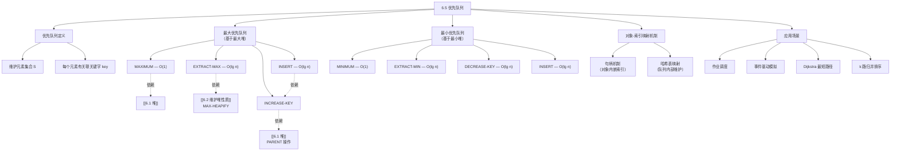

# 6.5 优先队列

## 相关笔记

- [[6.1 堆]]
- [[6.2 维护堆性质]]
- [[6.3 建堆]]
- [[6.4 堆排序算法]]
- [[第06章_堆排序-章节汇总]]
- [[算法导论/concepts/数据结构]]

---

> [!abstract] 概览
>
> 本节介绍==优先队列==（priority queue）——一种维护元素集合 $S$ 的数据结构，每个元素都有一个称为**关键字**（key）的关联值。优先队列分为==最大优先队列==和==最小优先队列==两种形式，本节重点讲解基于==最大堆==实现最大优先队列的四种核心操作。
>
> **要点列表：**
> - 优先队列是堆数据结构最流行的应用之一
> - 最大优先队列支持四种操作：==INSERT==、==MAXIMUM==、==EXTRACT-MAX==、==INCREASE-KEY==
> - 最小优先队列支持四种对应操作：INSERT、MINIMUM、EXTRACT-MIN、DECREASE-KEY
> - 基于**最大堆**实现时，除 MAXIMUM 为 $O(1)$ 外，其余操作均为 $O(\lg n)$
> - 应用场景：**作业调度**（最大优先队列）、**事件驱动模拟**（最小优先队列）、==Dijkstra 最短路径算法==（最小优先队列）
> - 需要通过**句柄**（handle）机制或**哈希映射**来维护应用对象与堆数组索引之间的映射关系

---

知识结构总览



---

核心思想

> [!tip] 核心思想
>
> 优先队列是一种**动态集合**数据结构，元素可以随时插入和删除，但删除操作总是按照**关键字优先级**进行。堆结构天然满足"最大（小）元素在根节点"的性质，因此是实现优先队列的理想底层结构——最大堆实现最大优先队列，最小堆实现最小优先队列。所有操作中，除查看最大（小）元素为 $O(1)$ 外，插入、删除、修改关键字均只需 $O(\lg n)$ 时间，因为堆的高度为 $O(\lg n)$。

> [!def] 优先队列（Priority Queue）
>
> 优先队列是一种用于维护元素集合 $S$ 的数据结构，其中每个元素都有一个称为**关键字**（key）的关联值。
>
> **最大优先队列**支持以下操作：
> - $\text{INSERT}(S, x, k)$：将元素 $x$（关键字为 $k$）插入集合 $S$
> - $\text{MAXIMUM}(S)$：返回 $S$ 中具有最大关键字的元素
> - $\text{EXTRACT-MAX}(S)$：移除并返回 $S$ 中具有最大关键字的元素
> - $\text{INCREASE-KEY}(S, x, k)$：将元素 $x$ 的关键字增加到新值 $k$（要求 $k \geq x.\text{key}$）
>
> **最小优先队列**支持对应的操作：INSERT、MINIMUM、EXTRACT-MIN、DECREASE-KEY。

### 2.1 MAXIMUM 操作

> [!def] MAX-HEAP-MAXIMUM
>
> 返回最大堆中关键字最大的元素，即堆的根节点 $A[1]$。
>
> **运行时间：** $\Theta(1)$

**伪代码：**

```
MAX-HEAP-MAXIMUM(A)
1  if A.heap-size < 1
2      error "heap underflow"
3  return A[1]
```

**分析：** 最大堆的根节点始终是最大元素，因此直接返回 $A[1]$ 即可。唯一需要检查的是堆是否为空（`heap underflow`）。

### 2.2 EXTRACT-MAX 操作

> [!def] MAX-HEAP-EXTRACT-MAX
>
> 移除并返回最大堆中具有最大关键字的元素。
>
> **运行时间：** $O(\lg n)$

**伪代码：**

```
MAX-HEAP-EXTRACT-MAX(A)
1  max = MAX-HEAP-MAXIMUM(A)
2  A[1] = A[A.heap-size]
3  A.heap-size = A.heap-size - 1
4  MAX-HEAPIFY(A, 1)
5  return max
```

**逐步分析：**

1. **第 1 行：** 调用 `MAX-HEAP-MAXIMUM` 获取并保存根节点（最大元素）的值
2. **第 2 行：** 将堆的最后一个元素移动到根节点位置——这一步用最后一个元素**覆盖**根节点
3. **第 3 行：** 将 `heap-size` 减 1，逻辑上移除了原来的根节点
4. **第 4 行：** 对新的根节点调用 `MAX-HEAPIFY`，自顶向下恢复最大堆性质
5. **第 5 行：** 返回之前保存的最大元素

**运行时间分析：** 第 1 行为 $O(1)$，第 2-3 行为 $O(1)$，第 4 行的 `MAX-HEAPIFY` 为 $O(\lg n)$，因此总时间为 $O(\lg n)$。

**关键理解：** 这个过程类似于 [[6.4 堆排序算法]] 中 `HEAPSORT` 的 `for` 循环体（第 3-5 行），都是将堆尾元素移到堆顶然后调用 `MAX-HEAPIFY`。

### 2.3 INCREASE-KEY 操作

> [!def] MAX-HEAP-INCREASE-KEY
>
> 将最大堆中元素 $x$ 的关键字增加到新值 $k$（要求 $k \geq x.\text{key}$）。
>
> **运行时间：** $O(\lg n)$

**伪代码：**

```
MAX-HEAP-INCREASE-KEY(A, x, k)
1  if k < x.key
2      error "new key is smaller than current key"
3  x.key = k
4  find the index i in array A where object x occurs
5  while i > 1 and A[PARENT(i)].key < A[i].key
6      exchange A[i] with A[PARENT(i)], updating the information
7          that maps priority queue objects to array indices
8      i = PARENT(i)
```

**逐步分析：**

1. **第 1-2 行：** 验证新关键字 $k$ 不小于当前关键字，否则报错
2. **第 3 行：** 将元素 $x$ 的关键字更新为新值 $k$
3. **第 4 行：** 在数组 $A$ 中找到对象 $x$ 所在的索引 $i$
4. **第 5-8 行（while 循环）：** 自底向上遍历从节点 $i$ 到根节点的简单路径：
   - 如果当前节点的关键字大于其父节点的关键字，则交换两者
   - 将索引 $i$ 更新为父节点索引，继续向上比较
   - 当到达根节点（$i = 1$）或父节点关键字不小于当前节点关键字时终止

**运行时间分析：** while 循环最多执行 $O(\lg n)$ 次（堆的高度），每次迭代为 $O(1)$，因此总时间为 $O(\lg n)$。

**关键理解：** 这个过程类似于 [[算法导论/concepts/数据结构|插入排序]] 的内层循环（第 5-7 行），都是将一个元素沿着一条路径"上浮"到正确位置。与 `MAX-HEAPIFY` 的"下沉"方向正好相反。

**循环不变量（习题 6.5-7）：**

在 while 循环每次迭代开始时：
- **a.** 若 $\text{PARENT}(i)$ 和 $\text{LEFT}(i)$ 都存在，则 $A[\text{PARENT}(i)].\text{key} \geq A[\text{LEFT}(i)].\text{key}$
- **b.** 若 $\text{PARENT}(i)$ 和 $\text{RIGHT}(i)$ 都存在，则 $A[\text{PARENT}(i)].\text{key} \geq A[\text{RIGHT}(i)].\text{key}$
- **c.** 子数组 $A[1 \mathinner{.\,.} A.\text{heap-size}]$ 满足最大堆性质，除一个可能的违反：$A[i].\text{key}$ 可能大于 $A[\text{PARENT}(i)].\text{key}$

### 2.4 INSERT 操作

> [!def] MAX-HEAP-INSERT
>
> 将一个新对象 $x$（关键字为 $k$）插入到最大堆中。
>
> **运行时间：** $O(\lg n)$

**伪代码：**

```
MAX-HEAP-INSERT(A, x, n)
1  if A.heap-size == n
2      error "heap overflow"
3  A.heap-size = A.heap-size + 1
4  k = x.key
5  x.key = -∞
6  A[A.heap-size] = x
7  map x to index heap-size in the array
8  MAX-HEAP-INCREASE-KEY(A, x, k)
```

**逐步分析：**

1. **第 1-2 行：** 检查数组是否有空间容纳新元素（`heap overflow`）
2. **第 3 行：** 将 `heap-size` 加 1，为新元素腾出位置
3. **第 4 行：** 保存 $x$ 的原始关键字 $k$
4. **第 5 行：** 将 $x$ 的关键字设为 $-\infty$——这是**哨兵值**，确保新节点不会违反堆性质
5. **第 6 行：** 将 $x$ 放在堆的末尾（新叶节点位置）
6. **第 7 行：** 建立对象 $x$ 到数组索引 `heap-size` 的映射
7. **第 8 行：** 调用 `MAX-HEAP-INCREASE-KEY` 将关键字从 $-\infty$ 提升到 $k$，同时维护堆性质

**运行时间分析：** 第 1-7 行为 $O(1)$，第 8 行的 `MAX-HEAP-INCREASE-KEY` 为 $O(\lg n)$，因此总时间为 $O(\lg n)$。

**关键理解：** 为什么第 5 行要先将关键字设为 $-\infty$？因为 `MAX-HEAP-INCREASE-KEY` 的前提条件是**新关键字不小于当前关键字**。设为 $-\infty$ 后，任何合法的关键字 $k$ 都满足 $k \geq -\infty$，从而可以统一复用 `INCREASE-KEY` 的逻辑来完成插入。

### 2.5 运行时间总结

| 操作 | 伪代码过程 | 运行时间 |
|:-----|:-----------|:---------|
| MAXIMUM | `MAX-HEAP-MAXIMUM` | $\Theta(1)$ |
| EXTRACT-MAX | `MAX-HEAP-EXTRACT-MAX` | $O(\lg n)$ |
| INCREASE-KEY | `MAX-HEAP-INCREASE-KEY` | $O(\lg n)$ |
| INSERT | `MAX-HEAP-INSERT` | $O(\lg n)$ |

$$
\text{总结：堆可以在 } O(\lg n) \text{ 时间内支持任何优先队列操作（除 MAXIMUM 为 } \Theta(1) \text{）}
$$

---

补充理解与拓展

> [!info] 1：优先队列的六大经典应用场景
>
> 优先队列在计算机科学的各个领域都有广泛应用：
>
> 1. **操作系统进程调度**
>    - Linux CFS（Completely Fair Scheduler）使用红黑树+优先队列管理进程，按虚拟运行时间（vruntime）排序。CFS 不使用传统的运行队列数组，而是使用按时间排序的红黑树构建"任务执行时间线"，每次选择 vruntime 最小的任务（即红黑树最左节点）执行，时间复杂度 $O(\log N)$
>    - Windows 的线程调度器使用多级反馈队列（Multiple-Level Feedback Queue, MLFQ），本质上是多个优先队列的组合。Windows NT 内核采用 32 个优先级级别（0-31），分为实时（16-31）和动态（0-15）两类，通过反馈机制调整进程优先级
>    - 实时操作系统（RTOS）使用优先队列实现速率单调调度（Rate-Monotonic Scheduling, RMS），这是一种固定优先级抢占式调度算法，任务优先级与周期成反比——周期越短的任务优先级越高
>
> 2. **图算法**
>    - **Dijkstra 最短路径**：使用最小优先队列，每次 EXTRACT-MIN 取出当前最近节点，DECREASE-KEY 更新距离。使用斐波那契堆时复杂度为 $O(V \lg V + E)$，使用二叉堆时为 $O((V+E) \lg V)$。实际测试中，二叉堆因缓存友好性和低常数因子，在密集图上往往表现最优
>    - **Prim 最小生成树**：同样使用最小优先队列，维护"已连接集合"到"未连接集合"的最小边
>    - **A* 搜索算法**：使用最小优先队列按 $f(n) = g(n) + h(n)$ 排序，$g$ 是实际代价，$h$ 是启发式估计，广泛应用于 GPS 导航和游戏 AI 寻路
>
> 3. **数据压缩——Huffman 编码**
>    - Huffman 编码算法使用最小优先队列构建最优前缀码：先将每个字符作为单节点插入优先队列，然后反复取出两个最小频率的节点合并，直到只剩一棵树
>    - 建树时间为 $O(n \lg n)$，其中 $n$ 是不同字符的数量。堆实现确保每次合并成本控制在 $O(\log \sigma)$，整个流程 $O(\sigma \log \sigma)$
>
> 4. **事件驱动模拟（Event-Driven Simulation）**
>    - 在离散事件模拟中，事件按时间戳排序存入优先队列，模拟器每次取出最早的事件并处理。处理一个事件可能产生未来的新事件，因此事件必须按发生时间顺序处理
>    - 应用场景：NS-3 网络模拟器（使用优先队列管理数据包生成、MAC 层发送、信道传播延迟等事件）、排队论模拟、金融风险模拟
>
> 5. **流数据处理**
>    - Top-K 问题：维护大小为 K 的最大堆，遍历数据流时与堆顶比较，时间 $O(n \lg K)$
>    - 中位数维护：使用两个堆（最大堆存较小半、最小堆存较大半），插入 $O(\lg n)$，查询中位数 $O(1)$
>    - 合并 K 个有序链表：使用最小堆，时间 $O(N \lg K)$
>
> 6. **人工智能与机器学习**
>    - 蒙特卡洛树搜索（MCTS）：AlphaGo 中使用优先队列（基于 UCB1 公式）选择最有价值的节点进行扩展，平衡探索与利用
>    - 束搜索（Beam Search）：机器翻译中用优先队列保留概率最高的 $k$ 个候选序列，相比贪心搜索 BLEU 分数提升 3-5 个点
>
> 来源：Linux Kernel Documentation (kernel.org/doc/html/next/scheduler/sched-design-CFS.html); Windows Internals; NS-3 Manual (nsnam.org/docs); GeeksforGeeks; Fiveable Study Guide; FCUP Lecture Slides

> [!info] 2：优先队列的不同实现及其性能特征
>
> 选择优先队列的底层实现取决于操作模式：
>
> | 实现方式 | INSERT | EXTRACT-MIN | MIN/DECREASE-KEY | FIND-MIN | 适用场景 |
> |---------|--------|-------------|-------------------|----------|---------|
> | 无序数组 | $O(1)$ | $O(n)$ | $O(n)$/$O(1)$ | $O(n)$ | 插入多、删除少 |
> | 有序数组 | $O(n)$ | $O(1)$ | $O(n)$/$O(n)$ | $O(1)$ | 删除多、插入少 |
> | 二叉堆 | $O(\lg n)$ | $O(\lg n)$ | $O(\lg n)$/$O(\lg n)$ | $O(1)$ | 通用场景 |
> | d-ary 堆 | $O(\log_d n)$ | $O(d \cdot \log_d n)$ | $O(d \cdot \log_d n)$/$O(d \cdot \log_d n)$ | $O(1)$ | DECREASE-KEY 多（$d=4$ 最优） |
> | 二项堆 | $O(\lg n)$ | $O(\lg n)$ | $O(\lg n)$/$O(\lg n)$ | $O(\lg n)$ | 需要频繁合并 |
> | 斐波那契堆 | $O(1)$* | $O(\lg n)$* | $O(\lg n)$*/$O(1)$* | $O(1)$ | DECREASE-KEY 极多（Dijkstra） |
> | 配对堆 | $O(1)$ | $O(\lg n)$* | $O(\lg n)$* | $O(1)$ | 实践中性能优秀 |
>
> （*表示摊还复杂度）
>
> **工程选择指南**：
> - **大多数情况**：二叉堆足够，实现简单、缓存友好、常数因子小。实际测试中，二叉堆在 Dijkstra 算法中因缓存友好性往往优于斐波那契堆
> - **Dijkstra/Prim**：如果 DECREASE-KEY 操作远多于 EXTRACT-MIN，考虑 d-ary 堆（$d = E/V$ 时最优，实践中 $d=4$ 表现良好）或斐波那契堆
> - **需要合并**：二项堆或配对堆。配对堆的 INSERT 和 MELD 为 $O(1)$ 摊还，DELETE-MIN 为 $O(\lg n)$ 摊还，且实现简单、实际性能优秀
> - **实时系统**：二叉堆的最坏情况 $O(\lg n)$ 保证优于斐波那契堆的摊还保证，更适合对延迟有严格上限要求的场景
>
> 来源：Princeton COS 423; MIT 6.006 Lecture Notes; UC Irvine ICS 261; Fredman & Tarjan (1987); Pettie (2005) "Towards a Final Analysis of Pairing Heaps"; IJRSI Vol.12 Iss.8 (2025)

---

易混淆点与辨析

> [!warning] INCREASE-KEY 不能用 MAX-HEAPIFY 替代
>
> **错误想法（习题 6.5-6）：** Professor Uriah 建议将 `MAX-HEAP-INCREASE-KEY` 中第 5-7 行的 while 循环替换为对 `MAX-HEAPIFY` 的调用。
>
> **为什么不行？**
>
> `MAX-HEAPIFY` 的逻辑是**自顶向下**的：它假设节点的左右子树都是最大堆，然后通过"下沉"操作恢复堆性质。但 `INCREASE-KEY` 增大某个节点的关键字后，违反堆性质的方向是**向上**的——该节点可能比其父节点更大，但它的子树仍然是合法的最大堆。
>
> ❌ 调用 `MAX-HEAPIFY` 会让节点向下移动，无法修复与父节点的违反
> ✅ 正确做法是使用 while 循环**自底向上**，将节点沿着到根的路径上浮
>
> **类比：** 如果你在公司层级中突然获得了更高的权限（关键字增大），你应该向上汇报（自底向上），而不是向下检查下属（自顶向下）。

> [!warning] 优先队列 vs 有序数组 vs 无序数组
>
> | 操作 | 优先队列（堆） | 有序数组 | 无序数组 |
> |:-----|:---------------|:---------|:---------|
> | MAXIMUM | $\Theta(1)$ | $\Theta(1)$ | $\Theta(n)$ |
> | EXTRACT-MAX | $O(\lg n)$ | $\Theta(1)$（删除末尾）但插入为 $\Theta(n)$ | $\Theta(n)$ |
> | INSERT | $O(\lg n)$ | $\Theta(n)$ | $\Theta(1)$ |
> | INCREASE-KEY | $O(\lg n)$ | $\Theta(1)$（若已知位置） | $\Theta(1)$（若已知位置） |
>
> ❌ 误认为优先队列在所有操作上都最优——实际上有序数组在 EXTRACT-MAX 和 INCREASE-KEY（已知位置时）上更快
> ✅ 堆的优势在于**所有操作的综合性能均衡**，没有明显短板，适合需要频繁混合使用多种操作的场景
>
> **关键区别：** 优先队列是一种**抽象数据类型**（ADT），堆是一种**具体实现**。优先队列也可以用平衡二叉搜索树等其他数据结构实现。

---

习题精选

| 题号 | 题目描述 | 难度 |
|:-----|:---------|:-----|
| 6.5-1 | 在最大优先队列上演示 EXTRACT-MAX 操作 | ⭐ |
| 6.5-2 | 在最大优先队列上演示 INSERT 操作 | ⭐ |
| 6.5-3 | 编写最小优先队列的四种操作伪代码 | ⭐⭐ |
| 6.5-4 | 编写 MAX-HEAP-DECREASE-KEY 伪代码 | ⭐⭐ |
| 6.5-5 | 为什么 INSERT 要先将关键字设为 $-\infty$？ | ⭐ |
| 6.5-6 | 为什么不能用 MAX-HEAPIFY 替代 INCREASE-KEY 中的循环？ | ⭐⭐ |
| 6.5-7 | 证明 MAX-HEAP-INCREASE-KEY 的循环不变量 | ⭐⭐⭐ |
| 6.5-8 | 将 INCREASE-KEY 中交换的三次赋值优化为一次 | ⭐⭐ |
| 6.5-9 | 用优先队列实现 FIFO 队列和栈 | ⭐⭐⭐ |
| 6.5-10 | 实现 MAX-HEAP-DELETE 操作 | ⭐⭐ |
| 6.5-11 | 用最小堆实现 $O(n \lg k)$ 的 k 路归并 | ⭐⭐⭐ |

> [!faq]- 6.5-1 解答：演示 EXTRACT-MAX 操作
>
> 初始堆 $A = \langle 15, 13, 9, 5, 12, 8, 7, 4, 0, 6, 2, 1 \rangle$（`heap-size = 12`）
>
> 1. `max = A[1] = 15`
> 2. 将 $A[12] = 1$ 移到 $A[1]$ 位置，`heap-size = 11`
> 3. 数组变为 $\langle 1, 13, 9, 5, 12, 8, 7, 4, 0, 6, 2 \rangle$
> 4. 对 $A[1] = 1$ 调用 `MAX-HEAPIFY`：
>    - $A[1] = 1$，左子 $A[2] = 13$，右子 $A[3] = 9$，最大为 $A[2] = 13$
>    - 交换 $A[1]$ 和 $A[2]$：$\langle 13, 1, 9, 5, 12, 8, 7, 4, 0, 6, 2 \rangle$
>    - 对 $A[2] = 1$ 继续：左子 $A[4] = 5$，右子 $A[5] = 12$，最大为 $A[5] = 12$
>    - 交换 $A[2]$ 和 $A[5]$：$\langle 13, 12, 9, 5, 1, 8, 7, 4, 0, 6, 2 \rangle$
>    - 对 $A[5] = 1$ 继续：左子 $A[10] = 6$，右子 $A[11] = 2$，最大为 $A[10] = 6$
>    - 交换 $A[5]$ 和 $A[10]$：$\langle 13, 12, 9, 5, 6, 8, 7, 4, 0, 1, 2 \rangle$
>    - $A[10] = 1$ 为叶节点，终止
> 5. 返回 `max = 15`
>
> 最终堆：$\langle 13, 12, 9, 5, 6, 8, 7, 4, 0, 1, 2 \rangle$

> [!faq]- 6.5-2 解答：演示 INSERT 操作
>
> 初始堆 $A = \langle 15, 13, 9, 5, 12, 8, 7, 4, 0, 6, 2, 1 \rangle$（`heap-size = 12`）
>
> 插入 $x = 10$：
> 1. `heap-size` 增加到 13
> 2. 将 $A[13] = 10$（关键字先设为 $-\infty$，再通过 INCREASE-KEY 设为 10）
> 3. 调用 `MAX-HEAP-INCREASE-KEY(A, 10, 10)`：
>    - $i = 13$，$\text{PARENT}(13) = 6$，$A[6] = 8 < 10$，交换
>    - 数组变为 $\langle 15, 13, 9, 5, 12, 10, 7, 4, 0, 6, 2, 1, 8 \rangle$，$i = 6$
>    - $\text{PARENT}(6) = 3$，$A[3] = 9 < 10$，交换
>    - 数组变为 $\langle 15, 13, 10, 5, 12, 9, 7, 4, 0, 6, 2, 1, 8 \rangle$，$i = 3$
>    - $\text{PARENT}(3) = 1$，$A[1] = 15 \geq 10$，终止
>
> 最终堆：$\langle 15, 13, 10, 5, 12, 9, 7, 4, 0, 6, 2, 1, 8 \rangle$

> [!faq]- 6.5-3 解答：最小优先队列伪代码
>
> ```
> MIN-HEAP-MINIMUM(A)
> 1  if A.heap-size < 1
> 2      error "heap underflow"
> 3  return A[1]
>
> MIN-HEAP-EXTRACT-MIN(A)
> 1  min = MIN-HEAP-MINIMUM(A)
> 2  A[1] = A[A.heap-size]
> 3  A.heap-size = A.heap-size - 1
> 4  MIN-HEAPIFY(A, 1)
> 5  return min
>
> MIN-HEAP-DECREASE-KEY(A, x, k)
> 1  if k > x.key
> 2      error "new key is larger than current key"
> 3  x.key = k
> 4  find the index i in array A where object x occurs
> 5  while i > 1 and A[PARENT(i)].key > A[i].key
> 6      exchange A[i] with A[PARENT(i)], updating the information
> 7          that maps priority queue objects to array indices
> 8      i = PARENT(i)
>
> MIN-HEAP-INSERT(A, x, n)
> 1  if A.heap-size == n
> 2      error "heap overflow"
> 3  A.heap-size = A.heap-size + 1
> 4  k = x.key
> 5  x.key = +∞
> 6  A[A.heap-size] = x
> 7  map x to index heap-size in the array
> 8  MIN-HEAP-DECREASE-KEY(A, x, k)
> ```

> [!faq]- 6.5-4 解答：MAX-HEAP-DECREASE-KEY
>
> ```
> MAX-HEAP-DECREASE-KEY(A, x, k)
> 1  if k > x.key
> 2      error "new key is larger than current key"
> 3  x.key = k
> 4  find the index i in array A where object x occurs
> 5  MAX-HEAPIFY(A, i)
> ```
>
> **运行时间：** $O(\lg n)$
>
> **分析：** 减小关键字后，违反堆性质的方向是**向下**的（该节点可能比其子节点更小），因此直接调用 `MAX-HEAPIFY` 自顶向下恢复堆性质即可。这与 `INCREASE-KEY` 需要自底向上正好相反。

> [!faq]- 6.5-5 解答：为什么 INSERT 要先设关键字为 $-\infty$？
>
> 因为 `MAX-HEAP-INCREASE-KEY` 的前置条件要求新关键字 $k$ **不小于**当前关键字。将关键字设为 $-\infty$ 确保了任何合法的关键字值 $k$ 都满足 $k \geq -\infty$，从而使 `INCREASE-KEY` 的逻辑可以正确执行。
>
> 如果不设为 $-\infty$ 而直接设为 $k$，则无法复用 `INCREASE-KEY` 的上浮逻辑来维护堆性质——新插入的节点可能比其父节点更大，但没有任何机制将其上浮到正确位置。

> [!faq]- 6.5-10 解答：MAX-HEAP-DELETE
>
> ```
> MAX-HEAP-DELETE(A, x)
> 1  if A.heap-size < 1
> 2      error "heap underflow"
> 3  find the index i in array A where object x occurs
> 4  if i == A.heap-size
> 5      A.heap-size = A.heap-size - 1
> 6  else
> 7      A[i] = A[A.heap-size]
> 8      update the mapping for the element moved to index i
> 9      A.heap-size = A.heap-size - 1
> 10     MAX-HEAPIFY(A, i)
> 11     if the element at index i was exchanged downward
> 12         MAX-HEAP-INCREASE-KEY(A, A[i], A[i].key)
> ```
>
> **更简洁的实现：** 先调用 `INCREASE-KEY` 将 $x$ 的关键字增加到 $+\infty$（使其浮到根），再调用 `EXTRACT-MAX` 删除根节点。
>
> ```
> MAX-HEAP-DELETE(A, x)
> 1  MAX-HEAP-INCREASE-KEY(A, x, +∞)
> 2  MAX-HEAP-EXTRACT-MAX(A)
> ```
>
> **运行时间：** $O(\lg n) + O(\lg n) = O(\lg n)$

> [!faq]- 6.5-11 解答：k 路归并排序
>
> **算法思路：**
> 1. 取每个已排序列表的第一个元素，建立一个大小为 $k$ 的最小堆
> 2. 每次调用 `EXTRACT-MIN` 取出最小元素，追加到结果列表
> 3. 将该元素所在列表的下一个元素（如果有的话）插入最小堆
> 4. 重复直到所有列表为空
>
> **运行时间分析：**
> - 建堆：$O(k)$
> - 每个元素执行一次 `EXTRACT-MIN`（$O(\lg k)$）和最多一次 `INSERT`（$O(\lg k)$）
> - 共 $n$ 个元素，总时间：$O(k) + n \cdot O(\lg k) = O(n \lg k)$

---

视频学习指南

| 资源 | 主题 | 链接 | 说明 |
|------|------|------|------|
| MIT 6.006 (2020) Lecture 8 | Binary Heaps & Priority Queues | https://www.youtube.com/watch?v=3dA7fOJQjJY | Erik Demaine 讲解优先队列接口与二叉堆实现，含 Dijkstra 应用 |
| MIT 6.006 (2011) Lecture 4 | Heaps and Heap Sort | https://www.youtube.com/watch?v=B7hVxCmfPtM | Srini Devadas 以优先队列为动机引入堆，涵盖堆操作与堆排序 |
| WilliamFiset | Priority Queues | https://www.youtube.com/watch?v=1f7K3rUaHNE | 优先队列实现与变体（含索引优先队列），配套开源代码 |
| NeetCode | Heap / Priority Queue | https://www.youtube.com/watch?v=wptevk0b36Y | LeetCode 刷题视角，Top-K、中位数等经典题型讲解 |
| Abdul Bari | Heap as Priority Queue | https://www.youtube.com/watch?v=MtQL_ll5KhQ | 堆作为优先队列的直观讲解，适合入门 |
| freeCodeCamp | Graph Algorithms (Dijkstra) | https://www.youtube.com/watch?v=pVfj6yoeh0s | 优先队列在 Dijkstra 最短路径算法中的实际应用 |

---

教材原文

> [!quote] 优先队列的定义与应用
>
> A priority queue is a data structure for maintaining a set $S$ of elements, each with an associated value called a key. A max-priority queue supports the following operations:
> - $\text{INSERT}(S, x, k)$ inserts the element $x$ with key $k$ into the set $S$.
> - $\text{MAXIMUM}(S)$ returns the element of $S$ with the largest key.
> - $\text{EXTRACT-MAX}(S)$ removes and returns the element of $S$ with the largest key.
> - $\text{INCREASE-KEY}(S, x, k)$ increases the value of element $x$'s key to the new value $k$.
>
> Among their other applications, you can use max-priority queues to schedule jobs on a computer shared among multiple users. The max-priority queue keeps track of the jobs to be performed and their relative priorities. When a job is finished or interrupted, the scheduler selects the highest-priority job from among those pending by calling EXTRACT-MAX. The scheduler can add a new job to the queue at any time by calling INSERT.

> [!quote] 最小优先队列与事件驱动模拟
>
> Alternatively, a min-priority queue supports the operations INSERT, MINIMUM, EXTRACT-MIN, and DECREASE-KEY. A min-priority queue can be used in an event-driven simulator. The items in the queue are events to be simulated, each with an associated time of occurrence that serves as its key. The events must be simulated in order of their time of occurrence, because the simulation of an event can cause other events to be simulated in the future. The simulation program calls EXTRACT-MIN at each step to choose the next event to simulate. As new events are produced, the simulator inserts them into the min-priority queue by calling INSERT.

> [!quote] 堆实现优先队列的运行时间总结
>
> In summary, a heap can support any priority-queue operation on a set of size $n$ in $O(\lg n)$ time, plus the overhead for mapping priority queue objects to array indices.

---

## 参见Wiki

- [[算法导论/concepts/优先队列]] — 支持插入和抽取最大值的动态集合
- [[算法导论/concepts/MAX-HEAPIFY]] — 维护最大堆性质的核心操作

#学习/算法导论/第06章-堆排序 #学习/数据结构/优先队列
