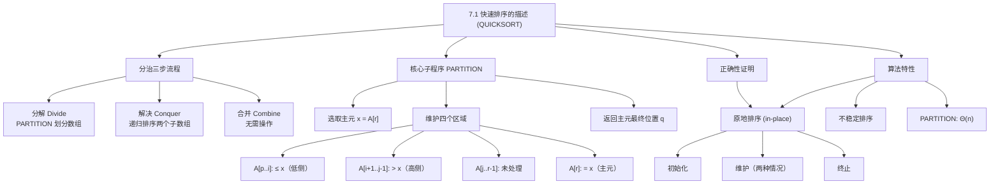
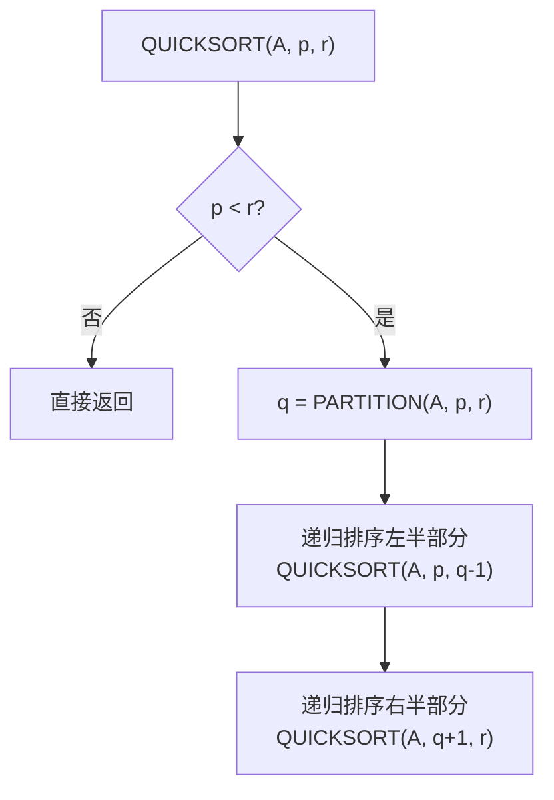
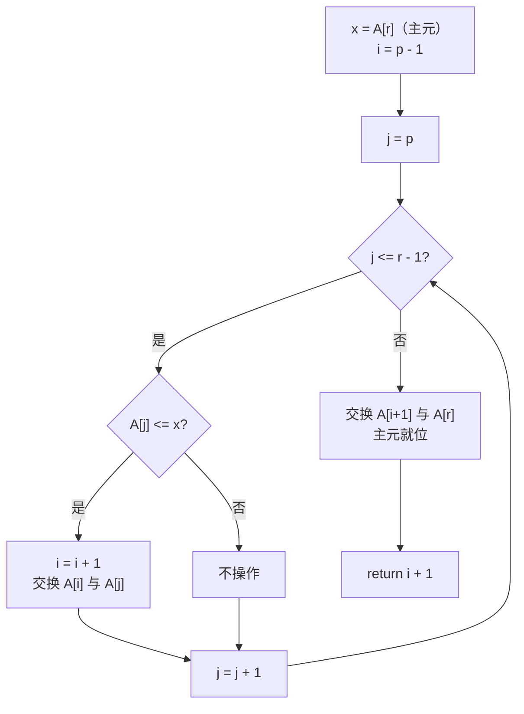

## 相关笔记

- 前置笔记：[[算法导论/concepts/分治法]]、[[算法导论/concepts/插入排序]]、[[算法导论/concepts/归并排序]]
- 后续笔记：[[7.2 快速排序的性能]]、[[7.3 快速排序的随机化版本]]、[[7.4 快速排序的分析]]
- 章节汇总：[[第07章_快速排序-章节汇总]]

> [!abstract] 概览
> 本节介绍 ==QUICKSORT== 算法的基本描述及其核心子程序 ==PARTITION==。快速排序与[[算法导论/concepts/归并排序|归并排序]]一样采用==分治法==，但关键区别在于：**合并步骤无需任何工作**。PARTITION 过程选取最后一个元素作为==主元（pivot）==，将数组原地划分为两个子数组——低侧（$\leq$ 主元）和高侧（$>$ 主元），然后递归排序两侧。
>
> **要点列表：**
> - QUICKSORT 的分治三步：分解（PARTITION）、解决（递归排序）、合并（==无需操作==）
> - PARTITION 使用 ==Lomuto 划分方案==，选取 $x = A[r]$ 作为主元，运行时间为 $\Theta(n)$
> - PARTITION 的正确性通过==循环不变式==严格证明（初始化/维护/终止三步）
> - 快速排序是==原地排序算法==（in-place），不需要额外的数组存储空间
> - 快速排序是==不稳定排序==，可能改变相等元素的相对顺序

---

知识结构总览



---

核心思想

> [!tip] 核心思路
> 快速排序与归并排序同属分治家族，但工作重心完全不同：
>
> | 步骤 | 归并排序 | 快速排序 |
> |------|---------|---------|
> | **分解** | 按位置从中间一分为二（$O(1)$） | ==PARTITION 按主元值划分==（$\Theta(n)$） |
> | **解决** | 递归排序两个子数组 | 递归排序两个子数组 |
> | **合并** | ==MERGE 合并两个有序子数组==（$\Theta(n)$） | **无需操作** |
>
> 快速排序之所以在合并步骤无需工作，是因为 PARTITION 保证了一个关键性质：
> - 左侧所有元素 $\leq$ 主元
> - 右侧所有元素 $\geq$ 主元
> - 两侧子数组排序后，整个数组**自然有序**
>
> 这就像把一堆学生按身高分成"矮组"和"高组"，分别排好队后直接站在一起——不需要像归并排序那样再逐一比较合并。

### QUICKSORT 伪代码

> [!tip] 算法执行流程
> 1. 若 **p >= r**，子数组最多一个元素，直接返回
> 2. 调用 **PARTITION(A, p, r)** 将数组划分为低侧和高侧，返回分界点 **q**
> 3. 递归调用 **QUICKSORT(A, p, q-1)** 排序左半部分（低侧）
> 4. 递归调用 **QUICKSORT(A, q+1, r)** 排序右半部分（高侧）



```
QUICKSORT(A, p, r)
1  if p < r
2     q = PARTITION(A, p, r)        // 划分，主元放到 A[q]
3     QUICKSORT(A, p, q - 1)         // 递归排序低侧
4     QUICKSORT(A, q + 1, r)         // 递归排序高侧
```

> [!def] QUICKSORT
> **输入：** 数组 $A[p \dots r]$（无序子数组）
> **输出：** 将 $A[p \dots r]$ 原地排序为非降序序列
>
> **算法步骤：**
> 1. **基准情况：** 若 $p \geq r$，子数组最多含一个元素，已有序，直接返回
> 2. **分解：** 调用 `PARTITION(A, p, r)`，将数组划分为 $A[p \dots q-1]$（低侧）和 $A[q+1 \dots r]$（高侧），主元 $A[q]$ 位于正确位置
> 3. **解决：** 递归调用 `QUICKSORT(A, p, q-1)` 和 `QUICKSORT(A, q+1, r)`
> 4. **合并：** 无需操作——两侧排序后，整个子数组自然有序
>
> 初始调用：`QUICKSORT(A, 1, n)`，对整个 $n$ 元素数组排序。

### PARTITION 伪代码（Lomuto 划分方案）

> [!tip] 算法执行流程
> 1. 选最后一个元素 **A[r]** 作为主元 **pivot**
> 2. 设 **i = p - 1**（低侧边界）
> 3. 遍历 **j** 从 **p** 到 **r-1**：若 **A[j] <= pivot**，则 **i++** 并交换 **A[i]** 与 **A[j]**
> 4. 遍历结束后，交换 **A[i+1]** 与 **A[r]**，将主元放到低侧与高侧之间
> 5. 返回 **i+1** 作为主元的最终位置 **q**



```
PARTITION(A, p, r)
1  x = A[r]                          // 主元
2  i = p - 1                          // 低侧的最高索引
3  for j = p to r - 1                 // 处理除主元外的每个元素
4     if A[j] ≤ x                     // 该元素是否属于低侧？
5        i = i + 1                    // 低侧的新槽位
6        exchange A[i] with A[j]      // 将元素放入低侧
7  exchange A[i + 1] with A[r]        // 主元放到低侧右侧
8  return i + 1                       // 返回主元的新索引
```

### PARTITION 的循环不变式与正确性证明

> [!def] 循环不变式
> **在 for 循环（第 3-6 行）每次迭代开始时，** 对任意数组索引 $k$，以下条件成立：
>
> 1. 若 $p \leq k \leq i$，则 $A[k] \leq x$（低侧区域，图 7.2 中的棕色区域）
> 2. 若 $i + 1 \leq k \leq j - 1$，则 $A[k] > x$（高侧区域，图 7.2 中的蓝色区域）
> 3. 若 $k = r$，则 $A[k] = x$（主元，图 7.2 中的黄色区域）

**初始化（Initialization）：**
- > **【循环不变量（初始化）】** 验证首次迭代前不变式成立：两个区间为空，主元条件由赋值保证
- 在第一次迭代之前，$i = p - 1$，$j = p$
- 区间 $[p, i] = [p, p-1]$ 为空，区间 $[i+1, j-1] = [p, p-1]$ 也为空
- 因此条件 1 和条件 2 **平凡满足**（对空区间，所有条件都成立）
- 第 1 行的赋值 `x = A[r]` 保证条件 3 成立：$A[r] = x$
- **循环不变式在首次迭代前成立**

**维护（Maintenance）：** 分两种情况讨论（对应图 7.3）：
- > **【循环不变量（维护—情况a）】** $A[j] > x$ 时，仅递增 $j$，不变式自动保持
- **情况 (a)：$A[j] > x$**（图 7.3(a)）
  - 第 4 行条件为假，不执行 if 内部操作
  - 仅递增 $j$（for 循环自动完成）
  - 递增后，$A[j-1] = A[\text{旧 } j]$ 满足 $A[j-1] > x$，条件 2 成立
  - 条件 1 和条件 3 不受影响
  - **循环不变式得到维护**

- > **【循环不变量（维护—情况b）】** $A[j] \leq x$ 时，交换后低侧扩展、高侧右移
- **情况 (b)：$A[j] \leq x$**（图 7.3(b)）
  - 第 5 行将 $i$ 递增：$i \leftarrow i + 1$
  - 第 6 行交换 $A[i]$ 和 $A[j]$：交换后 $A[i] = A[\text{旧 } j] \leq x$，条件 1 成立
  - 被交换到 $A[j]$ 位置的原 $A[i]$ 元素，在交换前位于高侧区域（因为 $i + 1 \leq \text{旧 } i + 1 \leq j - 1$），由循环不变式知其 $> x$
  - 递增 $j$ 后，$A[j-1] > x$，条件 2 成立
  - 条件 3 不受影响
  - **循环不变式得到维护**

**终止（Termination）：**
- > **【循环不变量（终止）】** 循环结束时 $j=r$，交换主元到分界点，两侧性质成立
- for 循环执行恰好 $r - p$ 次迭代后终止，此时 $j = r$
- 未检查的子数组 $A[j \dots r-1] = A[r \dots r-1]$ 为空
- 数组中所有元素都属于不变式描述的三个集合之一：
  - $A[p \dots i]$：$\leq x$（低侧）
  - $A[i+1 \dots r-1]$：$> x$（高侧）
  - $A[r]$：$= x$（主元）
- 第 7 行将主元 $A[r]$ 与 $A[i+1]$（高侧的第一个元素）交换，主元就位于低侧和高侧之间
- 第 8 行返回 $q = i + 1$，即主元的最终位置
- 此时满足：$A[p \dots q-1] \leq A[q] \leq A[q+1 \dots r]$，且 $A[q+1 \dots r]$ 中的元素**严格大于** $A[q]$
- **PARTITION 的正确性得证**

### PARTITION 的运行时间分析

> [!def] 时间复杂度 $\Theta(n)$
> PARTITION 在大小为 $n = r - p + 1$ 的子数组上的运行时间：
>
> - 第 1-2 行：常数时间 $\Theta(1)$
> - 第 3-6 行的 for 循环：恰好执行 $r - p = n - 1$ 次迭代，每次迭代执行常数时间操作（一次比较、可能的递增和交换），总计 $\Theta(n)$
> - 第 7-8 行：常数时间 $\Theta(1)$
>
> **总运行时间：** $\Theta(1) + \Theta(n) + \Theta(1) = $ ==$\Theta(n)$==

---

补充理解与拓展

> [!info] 快速排序的发明——Tony Hoare 与 1960 年的莫斯科
>
> 快速排序由英国计算机科学家 **Tony Hoare**（托尼·霍尔）于 **1960 年**发明，时年仅 **25 岁**。当时 Hoare 受英国国家物理实验室（NPL）派遣，赴莫斯科国立大学参与机器翻译项目的研究。为了解决俄语词典中词序排列的效率问题，他发明了这一算法。
>
> **关键时间线：**
> - **1960 年**：Hoare 在莫斯科国立大学发明快速排序的最初版本（使用的是 Hoare 划分方案，而非教材中的 Lomuto 方案）
> - **1961 年**：在 *Communications of the ACM* 上发表简短论文 "Algorithm 64: Quicksort"
> - **1962 年**：发表完整版本论文 "Quicksort"（*The Computer Journal*）
> - **1980 年**：Hoare 因在程序设计语言理论和快速排序等方面的杰出贡献获得**图灵奖**
>
> 有趣的是，Hoare 最初在实现交换操作时遇到了困难，后来通过图灵奖得主 **Niklaus Wirth**（Pascal 语言发明者）的建议才完善了算法的正确实现。Hoare 曾在图灵奖演讲中幽默地提到："我最初认为快速排序太简单了，不值得发表——幸好我最终改变了主意。"
>
> 来源：Hoare, C.A.R., "Quicksort", *The Computer Journal*, 5(1):10-16, 1962; Hoare, C.A.R., "The Emperor's Old Clothes", ACM Turing Award Lecture, 1980.

> [!info] Lomuto 划分 vs Hoare 划分——两种经典分区方案的深度对比
>
> CLRS 教材使用的是 **Lomuto 划分方案**（Nicolo Lomuto 在 1990 年代提出），但 Hoare 在 1960 年的原始论文中使用的是另一种方案。两种方案在实际工程中有显著差异：
>
> | 比较维度 | Lomuto 划分（CLRS 版本） | Hoare 划分（原始版本） |
> |---------|----------------------|---------------------|
> | **指针数量** | 单指针 $i$ 从左向右扫描 | 双指针从两端向中间扫描 |
> | **主元选择** | 固定选取 $A[r]$ | 选取 $A[p]$（或中间元素） |
> | **交换次数** | 较多（每个 $\leq$ pivot 的元素都交换） | 较少（平均约少 3 倍交换） |
> | **实现复杂度** | 简单直观 | 稍复杂，需处理指针交叉 |
> | **重复元素** | 效率低（全部进入低侧） | 效率较高（从两端均匀分布） |
> | **主元最终位置** | 精确在分界点 $q$ | 不一定在分界点（需额外处理） |
>
> **工程实践中的选择：**
> - 性能关键系统（数据库引擎、路由表）通常偏好 Hoare 划分方案，因为交换次数更少、缓存友好性更好
> - 教学场景通常使用 Lomuto 方案，因为更易理解和证明
> - 现代 Java 的 `Arrays.sort()` 使用的是 **Dual-Pivot Quicksort**（Yaroslavskiy, 2009），本质上是 Hoare 划分的高级变体，使用两个主元将数组分为三部分
> - C++ 的 `std::sort` 使用 **Introsort**（Musser, 1997），内部采用 Hoare 划分方案的变体
>
> 来源：Yaroslavskiy, V., "Dual-Pivot Quicksort", 2009; Musser, D.R., "Introspective Sorting and Selection Algorithms", *Software: Practice and Experience*, 27(8):983-993, 1997.

---

易混淆点与辨析

> [!warning] 误区：快速排序和归并排序的分治策略相同
> ❌ **错误理解：** "快速排序和归并排序都是分治法，所以它们的工作方式基本相同"
>
> ✅ **正确理解：** 虽然两者都采用分治法，但==工作重心完全相反==：
> - **归并排序**：分解阶段简单（$O(1)$），==主要工作量在合并阶段==（$\Theta(n)$）
> - **快速排序**：==主要工作量在分解阶段==（PARTITION，$\Theta(n)$），合并阶段无需工作（$O(1)$）
>
> 用一句话概括：归并排序是"easy in divide, hard in combine"；快速排序是"hard in divide, easy in combine"。这种差异导致了两者在空间需求、缓存行为和实际性能上的根本不同。

> [!warning] 误区：PARTITION 的循环不变式要求所有区域都有特定性质
> ❌ **错误理解：** "循环不变式对数组中的所有区域都做了断言"
>
> ✅ **正确理解：** 循环不变式只对三个区域做了断言，第四个区域（$A[j \dots r-1]$，未处理区域）的元素与 $x$ 的关系是==完全未知的==。这正是循环不变式的精妙之处——它只断言已经处理过的元素的性质，对尚未处理的元素不做任何假设。
>
> 类比：就像考试阅卷——已经批改的试卷可以给出分数（已知性质），尚未批改的试卷分数未知（未知性质），但这不影响已批改部分的正确性。

---

习题精选

| 题号 | 题目描述 | 难度 |
|:---:|----------|:---:|
| 7.1-1 | 用图 7.1 的方式，演示 PARTITION 在数组 $A = \langle 13, 19, 9, 5, 12, 8, 7, 4, 21, 2, 6, 11 \rangle$ 上的操作过程 | ⭐⭐ |
| 7.1-2 | 当子数组 $A[p \dots r]$ 中所有元素值相同时，PARTITION 返回的 $q$ 值是什么？修改 PARTITION 使此时 $q = \lfloor(p+r)/2\rfloor$ | ⭐⭐⭐ |
| 7.1-3 | 简要论证 PARTITION 在大小为 $n$ 的子数组上的运行时间为 $\Theta(n)$ | ⭐⭐ |
| 7.1-4 | 修改 QUICKSORT 使其按单调递减顺序排序 | ⭐ |

> [!faq]- 7.1-1 解答
> **目标：** 演示 PARTITION 在数组 $A = \langle 13, 19, 9, 5, 12, 8, 7, 4, 21, 2, 6, 11 \rangle$ 上的操作过程。
>
> 主元 $x = A[12] = 11$，初始 $i = 0$。
>
> | 步骤 | j | A[j] | A[j] ≤ 11? | i | 操作 | 数组状态 |
> |:---:|:---:|:---:|:---:|:---:|------|----------|
> | 初始 | - | - | - | 0 | - | 13 19 9 5 12 8 7 4 21 2 6 \| **11** |
> | 1 | 1 | 13 | 否 | 0 | 无 | 13 19 9 5 12 8 7 4 21 2 6 \| **11** |
> | 2 | 2 | 19 | 否 | 0 | 无 | 13 19 9 5 12 8 7 4 21 2 6 \| **11** |
> | 3 | 3 | 9 | 是 | 1 | swap A[1],A[3] | **9** 19 **13** 5 12 8 7 4 21 2 6 \| **11** |
> | 4 | 4 | 5 | 是 | 2 | swap A[2],A[4] | 9 **5** 13 **19** 12 8 7 4 21 2 6 \| **11** |
> | 5 | 5 | 12 | 否 | 2 | 无 | 9 5 13 19 12 8 7 4 21 2 6 \| **11** |
> | 6 | 6 | 8 | 是 | 3 | swap A[3],A[6] | 9 5 **8** 19 12 **13** 7 4 21 2 6 \| **11** |
> | 7 | 7 | 7 | 是 | 4 | swap A[4],A[7] | 9 5 8 **7** 12 13 **19** 4 21 2 6 \| **11** |
> | 8 | 8 | 4 | 是 | 5 | swap A[5],A[8] | 9 5 8 7 **4** 13 19 **12** 21 2 6 \| **11** |
> | 9 | 9 | 21 | 否 | 5 | 无 | 9 5 8 7 4 13 19 12 21 2 6 \| **11** |
> | 10 | 10 | 2 | 是 | 6 | swap A[6],A[10] | 9 5 8 7 4 **2** 19 12 21 **13** 6 \| **11** |
> | 11 | 11 | 6 | 是 | 7 | swap A[7],A[11] | 9 5 8 7 4 2 **6** 12 21 13 **19** \| **11** |
>
> 循环结束后执行第 7 行：swap A[i+1] = A[8] 与 A[r] = A[12]：
>
> 最终数组：$\langle 9, 5, 8, 7, 4, 2, 6, \mathbf{11}, 21, 13, 19, 12 \rangle$
>
> 返回 $q = i + 1 = 8$。验证：$A[1 \dots 7] = \langle 9,5,8,7,4,2,6 \rangle$ 中所有元素 $\leq 11$，$A[9 \dots 12] = \langle 21,13,19,12 \rangle$ 中所有元素 $> 11$。

> [!faq]- 7.1-2 解答
> **目标：** 分析所有元素相同时 PARTITION 的行为，并修改使其返回中间位置。
>
> **分析：** 当所有元素值相同时，每次 `A[j] ≤ x` 都为真（因为 $A[j] = x$），因此每次迭代都执行交换（实际上是自身与自身交换），$i$ 每次递增 1。循环结束后 $i = r - 1$，返回 $q = i + 1 = r$。
>
> 这意味着每次划分产生大小为 $n-1$ 和 $0$ 的两个子数组——这是==最坏情况==的划分模式！
>
> **修改方案：** 当检测到所有元素相同时，直接返回中间位置：
>
> ```
> PARTITION-MODIFIED(A, p, r)
> 1  x = A[r]
> 2  i = p - 1
> 3  allEqual = true
> 4  for j = p to r - 1
> 5     if A[j] ≠ x
> 6        allEqual = false
> 7     if A[j] ≤ x
> 8        i = i + 1
> 9        exchange A[i] with A[j]
> 10 if allEqual
> 11    return ⌊(p + r) / 2⌋
> 12 exchange A[i + 1] with A[r]
> 13 return i + 1
> ```
>
> **注意：** 此修改增加了 $O(n)$ 的额外检查时间，但将所有元素相同时的递归深度从 $\Theta(n)$ 降至 $\Theta(\lg n)$，总体运行时间从 $\Theta(n^2)$ 降至 $\Theta(n \lg n)$。实际工程中更常用的解决方案是使用==三路划分==（Dutch National Flag 算法），将数组分为 $< x$、$= x$、$> x$ 三部分。

> [!faq]- 7.1-3 解答
> **目标：** 论证 PARTITION 在大小为 $n$ 的子数组上的运行时间为 $\Theta(n)$。
>
> 设子数组大小 $n = r - p + 1$。
>
> PARTITION 的各部分时间：
> - 第 1-2 行（赋值操作）：$\Theta(1)$
> - 第 3-6 行（for 循环）：循环变量 $j$ 从 $p$ 到 $r-1$，共执行 $r - p = n - 1$ 次迭代。每次迭代执行：一次比较（第 4 行）、可能的递增（第 5 行）、可能的交换（第 6 行）——均为 $O(1)$ 操作。总计 $\Theta(n - 1) = \Theta(n)$
> - 第 7-8 行（交换与返回）：$\Theta(1)$
>
> 因此总运行时间 $T(n) = \Theta(1) + \Theta(n) + \Theta(1) = \Theta(n)$。
>
> **上界：** $T(n) \leq c_1 + c_2(n-1) + c_3 = O(n)$
> **下界：** $T(n) \geq c_1 + c_4(n-1) + c_3 = \Omega(n)$（其中 $c_4$ 是单次比较的时间）
>
> 因此 $T(n) = \Theta(n)$。

> [!faq]- 7.1-4 解答
> **目标：** 修改 QUICKSORT 使其按单调递减顺序排序。
>
> 只需修改 PARTITION 中的比较方向，将 `A[j] ≤ x` 改为 `A[j] ≥ x`，使得 $\geq$ 主元的元素进入低侧，$<$ 主元的元素进入高侧：
>
> ```
> QUICKSORT-DECREASING(A, p, r)
> 1  if p < r
> 2     q = PARTITION-DECREASING(A, p, r)
> 3     QUICKSORT-DECREASING(A, p, q - 1)
> 4     QUICKSORT-DECREASING(A, q + 1, r)
>
> PARTITION-DECREASING(A, p, r)
> 1  x = A[r]
> 2  i = p - 1
> 3  for j = p to r - 1
> 4     if A[j] ≥ x              // 改为 ≥
> 5        i = i + 1
> 6        exchange A[i] with A[j]
> 7  exchange A[i + 1] with A[r]
> 8  return i + 1
> ```
>
> 修改后，$A[p \dots q-1]$ 中的所有元素 $\geq A[q]$，$A[q+1 \dots r]$ 中的所有元素 $< A[q]$，递归排序后数组按递减顺序排列。

---

视频学习指南

| 资源 | 主题 | 链接 | 说明 |
|:-----|:-----|:-----|:-----|
| MIT 6.006 Lecture 4 | Heaps and Heap Sort | https://www.youtube.com/watch?v=B7hVxCmfPtM | Erik Demaine 讲解快速排序的分治思想与 PARTITION |
| Abdul Bari | Quicksort Algorithm | https://www.youtube.com/watch?v=COk73cpQbFQ | 逐步动画演示 Lomuto 划分的完整执行过程 |
| Michael Sambol | Quicksort | https://www.youtube.com/watch?v=Hoixgm4-P4M | 2 分钟可视化快速排序的完整递归过程 |
| CS Dojo | Quicksort Algorithm | https://www.youtube.com/watch?v=uv2NQVpG0nw | 含 Hoare 划分 vs Lomuto 划分的对比讲解 |
| WilliamFiset | Quicksort | https://www.youtube.com/watch?v=SLauY6PpjW4 | 排序算法系列，含代码实现与复杂度分析 |

---

教材原文

> [!quote] CLRS 第4版 7.1节原文
> Quicksort, like merge sort, applies the divide-and-conquer method introduced in Section 2.3.1. Here is the three-step divide-and-conquer process for sorting a subarray $A[p \dots r]$:
>
> **Divide** by partitioning (rearranging) the array $A[p \dots r]$ into two (possibly empty) subarrays $A[p \dots q-1]$ (the low side) and $A[q+1 \dots r]$ (the high side) such that each element in the low side of the partition is less than or equal to the pivot $A[q]$, which is, in turn, less than or equal to each element in the high side. Compute the index $q$ of the pivot as part of this partitioning procedure.
>
> **Conquer** by calling quicksort recursively to sort each of the subarrays $A[p \dots q-1]$ and $A[q+1 \dots r]$.
>
> **Combine** by doing nothing: because the two subarrays are already sorted, no work is needed to combine them. All elements in $A[p \dots q-1]$ are sorted and less than or equal to $A[q]$, and all elements in $A[q+1 \dots r]$ are sorted and greater than or equal to the pivot $A[q]$. The entire subarray $A[p \dots r]$ cannot help but be sorted!

---

## 参见Wiki

- [[算法导论/concepts/快速排序]] — 快速排序的基本思想与分治策略

#学习/算法导论/第07章-快速排序 #学习/算法导论/快速排序/快速排序的描述
