## 相关笔记

- 前置笔记：[[7.1 快速排序的描述]]、[[算法导论/concepts/分治法]]
- 关联概念：[[算法导论/concepts/大O记号]]、[[算法导论/concepts/大Theta记号]]、[[算法导论/concepts/递归关系式]]
- 对比参考：[[算法导论/concepts/归并排序]]、[[算法导论/concepts/插入排序]]
- 章节汇总：[[第07章_快速排序-章节汇总]]

> [!abstract] 概览
> 本节从直觉层面分析快速排序在不同==划分平衡度==下的性能表现，涵盖最坏情况、最好情况、平衡划分和平均情况四种场景，揭示快速排序为何在实践中表现优异。此外还分析了快速排序的==栈空间==需求。
>
> **要点列表：**
> - 快速排序的运行时间完全取决于==划分的平衡程度==，而平衡程度取决于主元的选择
> - ==最坏情况==：每次划分极度不平衡（$0$ 和 $n-1$），递推 $T(n) = T(n-1) + \Theta(n)$，解为 $\Theta(n^2)$
> - ==最好情况==：每次划分完美平衡，递推 $T(n) = 2T(n/2) + \Theta(n)$，由主定理得 $\Theta(n \lg n)$
> - ==平衡划分==：即使每次 9:1 的"不平衡"划分，运行时间仍为 $O(n \lg n)$；任意常数比例划分都是 $O(n \lg n)$
> - ==平均情况==：好坏划分交替出现时，坏划分的代价被好划分"吸收"，运行时间仍为 $O(n \lg n)$
> - 栈空间最坏情况为 $\Theta(n)$，最好情况为 $\Theta(\lg n)$

---

知识结构总览

```mermaid
flowchart TD
    A["7.2 快速排序的性能"] --> B["最坏情况<br/>Θ(n²)"]
    A --> C["最好情况<br/>Θ(n lg n)"]
    A --> D["平衡划分<br/>O(n lg n)"]
    A --> E["平均情况直觉<br/>O(n lg n)"]
    A --> F["栈空间分析<br/>最坏 Θ(n)"]

    B --> B1["每次划分: 0 vs n-1"]
    B --> B2["递推: T(n) = T(n-1) + Θ(n)"]
    B --> B3["等差数列求和 → Θ(n²)"]
    B --> B4["触发条件: 已排序输入"]

    C --> C1["每次划分: ≤ n/2 vs ≤ n/2"]
    C --> C2["递推: T(n) = 2T(n/2) + Θ(n)"]
    C --> C3["主定理情况2 → Θ(n lg n)"]

    D --> D1["9:1 划分 → O(n lg n)"]
    D --> D2["99:1 划分 → O(n lg n)"]
    D --> D3["任意常数比例 → O(n lg n)"]
    D --> D4["比例仅影响常数因子"]

    E --> E1["好坏划分交替"]
    E --> E2["坏划分代价被好划分吸收"]
    E --> E3["80%概率 ≥ 9:1 平衡"]

    F --> F1["递归深度 = 栈空间"]
    F --> F2["最坏: Θ(n)"]
    F --> F3["最好: Θ(lg n)"]
    F --> F4["尾递归优化 → Θ(lg n)"]
```

---

核心思想

> [!tip] 核心洞察
> 快速排序的性能完全取决于一个关键因素：**每次 PARTITION 产生的划分有多平衡**。这与[[算法导论/concepts/归并排序|归并排序]]（始终均匀划分）形成鲜明对比。本节通过递推关系式和递归树两种工具，逐步揭示一个反直觉的结论：**即使划分看起来很不平衡（如 9:1），只要比例是常数，运行时间仍然是 $O(n \lg n)$**。

### 最坏情况分析

> [!def] 最坏情况 $\Theta(n^2)$
> 当每次划分都产生一个大小为 $n-1$ 和一个大小为 $0$ 的子问题时，递推关系为：
>
> $$T(n) = T(n-1) + T(0) + \Theta(n) = T(n-1) + \Theta(n)$$
>
> 其中 $T(0) = \Theta(1)$ 是对空子数组的递归调用开销。
>
> **【递推展开（等差数列求和）】**
>
> **求解过程：** 逐层展开递推关系：
>
> $$T(n) = \Theta(n) + T(n-1)$$
> $$= \Theta(n) + \Theta(n-1) + T(n-2)$$
> $$= \Theta(n) + \Theta(n-1) + \Theta(n-2) + \cdots + \Theta(1) + T(0)$$
> $$= \sum_{k=1}^{n} \Theta(k)$$
> $$= \Theta\!\left(\sum_{k=1}^{n} k\right) = \Theta(n^2)$$
>
> 最后一步使用了等差数列求和公式 $\sum_{k=1}^{n} k = n(n+1)/2 = \Theta(n^2)$。
>
> **最坏情况触发条件：** 输入数组已经完全排序（正序或逆序），此时每次选取的主元 $A[r]$ 都是当前子数组的最大或最小元素，导致极度不平衡的划分。
>
> **讽刺之处：** 当输入已排序时，[[算法导论/concepts/插入排序|插入排序]]只需 $O(n)$ 时间，而快速排序反而需要 $\Theta(n^2)$ 时间——快速排序"最怕"的就是已排序输入。

### 最好情况分析

> [!def] 最好情况 $\Theta(n \lg n)$
> 当每次划分都尽可能均匀，两个子问题大小都不超过 $n/2$ 时（一个为 $\lfloor(n-1)/2\rfloor \leq n/2$，另一个为 $\lceil(n-1)/2\rceil - 1 \leq n/2$）：
>
> $$T(n) = 2T(n/2) + \Theta(n)$$
>
> **【主定理求解（情况2：f(n)=Θ(n^log_b a)）】**
>
> 根据==主定理==（Master Theorem，定理 4.1）情况 2：$a = 2$，$b = 2$，$f(n) = \Theta(n) = \Theta(n^{\log_2 2}) = \Theta(n^1)$，即 $f(n) = \Theta(n^{\log_b a} \lg^k n)$ 且 $k = 0$。
>
> 因此解为：
>
> $$T(n) = \Theta(n \lg n)$$
>
> 这与归并排序的运行时间渐近相同。

### 平衡划分分析

> [!def] 平衡划分 $O(n \lg n)$
> 假设每次划分都产生 **9:1** 的比例划分（看似很不平衡）：
>
> $$T(n) = T(9n/10) + T(n/10) + \Theta(n)$$
>
> **【递归树分析（每层代价求和）】**
>
> **递归树分析（图 7.4）：**
> - 根节点代价为 $n$（PARTITION 的代价）
> - 下一层两个子问题代价之和为 $9n/10 + n/10 = n$
> - 每一层的总代价都是 $n$（因为子问题大小之和等于父问题大小）
> - 最短路径（沿 $n/10$ 分支）：深度为 $\log_{10/9} n = \Theta(\lg n)$
> - 最长路径（沿 $9n/10$ 分支）：深度为 $\log_{10} n = \Theta(\lg n)$
> - 递归树总代价 = 每层代价 $\times$ 层数 = $n \times \Theta(\lg n) = O(n \lg n)$
>
> **推广到任意常数比例：** 设划分比例为 $\alpha : \beta$（$\alpha + \beta = 1$，$0 < \alpha \leq \beta < 1$）：
> - 递归树深度为 $\Theta(\lg n)$（因为每层子问题大小至少缩小为 $\beta$ 倍，$\beta < 1$）
> - 每层总代价为 $O(n)$
> - 总代价为 $O(n \lg n)$
>
> **关键结论：** 划分比例只影响 $O$ 记号中隐藏的==常数因子==，不影响渐近增长率。即使是 99:1 的划分，运行时间仍然是 $O(n \lg n)$。

### 平均情况的直觉

> [!def] 平均情况 $O(n \lg n)$（直觉性分析）
> 在随机输入上，PARTITION 产生好坏划分的混合。关键概率分析结果：
>
> - 约 **80%** 的概率产生至少 9:1 平衡的划分（习题 7.2-6：对任意 $0 < \alpha \leq 1/2$，至少 $1-\alpha : \alpha$ 平衡的概率约为 $1 - 2\alpha$；取 $\alpha = 1/10$ 得 $1 - 2/10 = 80\%$）
> - 约 **20%** 的概率产生不如 9:1 平衡的划分
>
> **【代价吸收论证（好坏划分交替分析）】**
>
> **关键直觉（图 7.5）：** 一个"坏划分"（$0$ vs $n-1$）后紧跟一个"好划分"（$(n-1)/2$ vs $(n-1)/2$），其组合效果为：
> - 两层划分的总代价：$\Theta(n) + \Theta(n-1) = \Theta(n)$
> - 产生的三个子数组大小：$0$、$(n-1)/2 - 1$、$(n-1)/2$
> - 这与单独一层好划分（产生两个大小为 $(n-1)/2$ 的子数组，代价 $\Theta(n)$）相差不超过一个常数因子
>
> 直觉上，坏划分的 $\Theta(n-1)$ 代价被好划分的 $\Theta(n)$ 代价"吸收"了。因此，好坏划分交替出现时，运行时间仍为 $O(n \lg n)$，只是常数因子稍大。严格的期望运行时间分析将在 7.4.2 节给出。

### 栈空间分析

> [!def] 栈空间 $\Theta(n)$（最坏情况）
> 虽然快速排序是原地排序（不需要额外的数组存储空间），但递归调用需要运行时栈空间：
>
> - 每次递归调用需要 $\Theta(1)$ 的栈空间（保存返回地址、局部变量等）
> - ==栈空间 = 最大递归深度==
> - **最坏情况**（每次极度不平衡）：递归深度为 $n$，栈空间 $\Theta(n)$
> - **最好情况**（每次完美平衡）：递归深度为 $\Theta(\lg n)$，栈空间 $\Theta(\lg n)$
>
> **尾递归优化：** 通过先递归处理较小的子数组，将较大的子数组通过尾调用处理，可以将最坏栈深度从 $\Theta(n)$ 降至 $\Theta(\lg n)$。这是因为每次递归调用后，较大的子问题通过循环而非递归来处理。

---

补充理解与拓展

> [!info] 快速排序的工程优化——从理论到实践的五项关键技术
>
> 纯快速排序在实际工程中很少直接使用，现代标准库中的快速排序都经过多种优化：
>
> 1. **Median-of-Three 主元选择**：取首、中、末三个元素的中位数作为 pivot，有效避免已排序数组的最坏情况。研究表明这可将比较次数减少约 5%（Sedgewick, 1978）
>
> 2. **三路划分（Dutch National Flag）**：Dijkstra 于 1976 年提出，将数组分为 $< \text{pivot}$、$= \text{pivot}$、$> \text{pivot}$ 三部分。对含大量重复元素的数组，可将时间从 $O(n^2)$ 降至 $O(n)$。Java 的 `Arrays.sort()` 在检测到大量重复元素时会自动切换到三路划分
>
> 3. **小数组切换插入排序**：当子数组大小 $\leq 10$--$20$ 时切换到插入排序。原因：对很小的数组，递归调用的固定开销（函数调用、栈帧创建）超过了插入排序 $O(n^2)$ 的劣势。实验表明此优化可减少约 **15-20%** 的比较次数（Sedgewick & Wayne, *Algorithms*, 4th Edition）
>
> 4. **尾递归优化**：先递归处理较小的子数组，较大的子数组通过尾调用（或循环）处理，将最坏栈深度从 $O(n)$ 降至 $O(\lg n)$。CLRS 习题 7.4-2 要求读者实现此优化
>
> 5. **Introsort（内省排序）**：Musser 于 1997 年提出，结合了快速排序、堆排序和插入排序——先用快速排序，当递归深度超过 $2\lceil \lg n \rceil$ 时切换到堆排序防止退化，对小分区切换到插入排序。C++ STL 的 `std::sort` 采用此策略，保证了最坏情况 $O(n \lg n)$
>
> 来源：Musser, D.R., "Introspective Sorting and Selection Algorithms", *Software: Practice and Experience*, 27(8):983-993, 1997; Sedgewick, R., "Implementing Quicksort Programs", *Communications of the ACM*, 21(10):847-857, 1978.

> [!info] 快速排序在现代语言标准库中的实现——没有"纯"快速排序
>
> 现代编程语言的标准库几乎都不使用"纯"快速排序，而是采用混合策略来兼顾平均性能和最坏情况保证：
>
> | 语言/库 | 排序算法 | 关键特性 |
> |---------|---------|---------|
> | **C++** `std::sort` | Introsort | 快速排序 + 堆排序 + 插入排序，最坏 $O(n \lg n)$ |
> | **Java** `Arrays.sort()`（基本类型） | Dual-Pivot Quicksort | Yaroslavskiy 2009 年提出，两个主元，比经典快速排序快约 10-20% |
> | **Java** `Arrays.sort()`（对象类型） | TimSort | 归并排序 + 插入排序混合，稳定排序，最坏 $O(n \lg n)$ |
> | **Python** `sorted()` / `list.sort()` | TimSort | 2002 年 Tim Peters 为 Python 设计，利用输入中的"自然有序段" |
> | **Go** `sort.Slice()` | pdqsort | pattern-defeating quicksort，结合快速排序、堆排序和插入排序 |
> | **Rust** `slice::sort()` | pdqsort | 同 Go，由 Orson Peters 于 2016 年实现 |
>
> **关键洞察：** Java 在 2009 年将 `Arrays.sort()` 从经典快速排序切换到 Dual-Pivot Quicksort 后，基准测试显示对随机数据排序速度提升了约 **10-20%**，对已部分排序的数据提升更显著。这一改动被广泛认为是排序算法工程实践中的一个里程碑。
>
> 来源：Yaroslavskiy, V., "Dual-Pivot Quicksort", 2009; Peters, O., "Pattern-Defeating Quicksort", 2016.

---

易混淆点与辨析

> [!warning] 误区：只有 50:50 的完美平衡才能保证 $O(n \lg n)$
> ❌ **错误理解：** "快速排序要达到 $O(n \lg n)$ 的运行时间，每次划分必须恰好将数组一分为二"
>
> ✅ **正确理解：** 任意==常数比例==的划分都能保证 $O(n \lg n)$。9:1、99:1 甚至 999:1 的划分都是 $O(n \lg n)$。关键在于比例是**常数**（不随 $n$ 变化），这保证了递归树深度为 $\Theta(\lg n)$，每层代价为 $O(n)$。
>
> 真正导致 $\Theta(n^2)$ 的不是"不平衡"，而是==极度不平衡==（$0$ vs $n-1$），此时递归树退化为链，深度为 $\Theta(n)$。
>
> | 划分比例 | 递归树深度 | 每层代价 | 总运行时间 |
> |---------|-----------|---------|-----------|
> | $0$ : $n-1$（最坏） | $\Theta(n)$ | $O(n)$ | $\Theta(n^2)$ |
> | $1$ : $n-2$ | $\Theta(n)$ | $O(n)$ | $\Theta(n^2)$ |
> | $1/10$ : $9/10$ | $\Theta(\lg n)$ | $O(n)$ | $O(n \lg n)$ |
> | $1/2$ : $1/2$（最好） | $\Theta(\lg n)$ | $O(n)$ | $O(n \lg n)$ |

> [!warning] 误区：快速排序是原地排序，所以只使用 $O(1)$ 额外空间
> ❌ **错误理解：** "快速排序是原地排序算法，所以它的额外空间复杂度是 $O(1)$"
>
> ✅ **正确理解：** 快速排序的"原地性"指的是不需要额外的==数组存储空间==（不像归并排序需要 $\Theta(n)$ 的辅助数组）。但递归调用需要==运行时栈空间==，栈空间取决于递归深度：
> - 最坏情况（极度不平衡）：递归深度 $\Theta(n)$，栈空间 $\Theta(n)$
> - 最好情况（完美平衡）：递归深度 $\Theta(\lg n)$，栈空间 $\Theta(\lg n)$
>
> 通过==尾递归优化==（先递归处理较小的子数组），可以将最坏栈深度降至 $\Theta(\lg n)$，但标准 QUICKSORT 伪代码并未包含此优化。
>
> **对比：** 归并排序需要 $\Theta(n)$ 的堆/栈空间（辅助数组），快速排序需要 $\Theta(\lg n)$--$\Theta(n)$ 的栈空间。在空间效率上，快速排序通常优于归并排序。

---

习题精选

| 题号 | 题目描述 | 难度 |
|:---:|----------|:---:|
| 7.2-1 | 用替换法证明递推式 $T(n) = T(n-1) + \Theta(n)$ 的解为 $T(n) = \Theta(n^2)$ | ⭐⭐ |
| 7.2-2 | 当数组 $A$ 中所有元素值相同时，QUICKSORT 的运行时间是多少？ | ⭐⭐ |
| 7.2-3 | 证明当数组 $A$ 包含不同元素且按递减顺序排序时，QUICKSORT 的运行时间为 $\Theta(n^2)$ | ⭐⭐ |
| 7.2-4 | 解释为什么在对几乎已排序的输入排序时，插入排序可能优于快速排序 | ⭐⭐⭐ |
| 7.2-5 | 假设快速排序每层划分比例为常数 $\alpha : \beta$（$\alpha + \beta = 1$），证明递归树最小叶深度约为 $\log_{1/\alpha} n$，最大叶深度约为 $\log_{1/\beta} n$ | ⭐⭐⭐ |
| 7.2-6 | 对含不同元素且所有排列等可能的数组，证明对任意常数 $0 < \alpha \leq 1/2$，PARTITION 产生至少 $1-\alpha : \alpha$ 平衡划分的概率约为 $1 - 2\alpha$ | ⭐⭐⭐⭐ |

> [!faq]- 7.2-1 解答
> **目标：** 用替换法证明 $T(n) = T(n-1) + \Theta(n)$ 的解为 $T(n) = \Theta(n^2)$。
>
> **【替换法（上界证明：T(n)≤cn²+dn）】**
>
> **上界证明：** 假设 $T(k) \leq c k^2 + dk$ 对所有 $k < n$ 成立，其中 $c, d$ 为正常数。
>
> $$T(n) = T(n-1) + \Theta(n) \leq c(n-1)^2 + d(n-1) + an + b$$
>
> 其中 $\Theta(n) = an + b$（$a, b > 0$）。
>
> $$= cn^2 - 2cn + c + dn - d + an + b$$
> $$= cn^2 + (d - 2c + a)n + (c - d + b)$$
>
> 要使 $T(n) \leq cn^2 + dn$，需要：
> 1. $d - 2c + a \leq d$，即 $a \leq 2c$，取 $c \geq a/2$ 即可
> 2. $c - d + b \leq 0$，即 $d \geq c + b$，取 $d$ 足够大即可
>
> 因此 $T(n) = O(n^2)$。
>
> **【替换法（下界证明：T(n)≥c'n²)】**
>
> **下界证明：** 假设 $T(k) \geq c'k^2$ 对所有 $k < n$ 成立（$c' > 0$）：
>
> $$T(n) \geq c'(n-1)^2 + a'n = c'n^2 - 2c'n + c' + a'n = c'n^2 + (a' - 2c')n + c'$$
>
> 取 $c' \leq a'/2$，则 $a' - 2c' \geq 0$，且 $c' > 0$，故 $T(n) \geq c'n^2$。
>
> 因此 $T(n) = \Omega(n^2)$。
>
> 综合：$T(n) = \Theta(n^2)$。$\blacksquare$

> [!faq]- 7.2-2 解答
> **目标：** 分析所有元素相同时 QUICKSORT 的运行时间。
>
> 当所有元素值相同时，由 [[7.1 快速排序的描述|7.1-2]] 的分析可知，PARTITION 每次返回 $q = r$，即每次划分产生大小为 $n-1$ 和 $0$ 的两个子数组。
>
> 递推关系为：
>
> $$T(n) = T(n-1) + T(0) + \Theta(n) = T(n-1) + \Theta(n)$$
>
> 与最坏情况完全相同，解为 $T(n) = \Theta(n^2)$。
>
> **注意：** 这是 Lomuto 划分方案的特有弱点。如果使用三路划分（Dutch National Flag），所有元素相同时的运行时间可降至 $O(n)$。

> [!faq]- 7.2-3 解答
> **目标：** 证明递减有序数组上 QUICKSORT 的运行时间为 $\Theta(n^2)$。
>
> **【主元极值分析（递减有序输入的最坏划分）】**
>
> 设数组 $A$ 包含不同元素且按递减顺序排列。PARTITION 选取最后一个元素 $A[r]$ 作为主元。
>
> 由于数组递减排列，$A[r]$ 是当前子数组 $A[p \dots r]$ 中的==最小元素==。因此：
> - 所有其他元素都 $> A[r]$，全部进入高侧区域
> - 低侧区域为空
>
> 每次划分后：低侧 $A[p \dots q-1]$ 为空（$0$ 个元素），高侧 $A[q+1 \dots r]$ 包含 $n-1$ 个元素。
>
> 这恰好是最坏情况的划分模式，递推关系为：
>
> $$T(n) = T(n-1) + \Theta(n)$$
>
> 解为 $T(n) = \Theta(n^2)$。$\blacksquare$

> [!faq]- 7.2-4 解答
> **目标：** 解释为什么对几乎已排序的输入，插入排序可能优于快速排序。
>
> **场景分析：** 银行交易按时间排序，但用户希望按支票号排序。由于人们通常按支票号顺序书写，商户也较快兑现，按时间排序的数组**几乎已经按支票号排好序**。
>
> **插入排序在此场景下的表现：**
> - 对几乎已排序的输入，[[算法导论/concepts/插入排序|插入排序]]的内层 while 循环只需少量比较和移动
> - 最好情况（已排序）运行时间为 $O(n)$
> - 对"几乎已排序"的输入，运行时间接近 $O(n + d)$，其中 $d$ 是逆序对数量
>
> **快速排序在此场景下的表现：**
> - 几乎已排序的输入导致每次 PARTITION 产生极度不平衡的划分（接近最坏情况）
> - 因为 $A[r]$ 接近当前子数组的最大值，大部分元素进入低侧
> - 运行时间接近 $\Theta(n^2)$
>
> **结论：** 在此场景下，插入排序几乎必然优于快速排序。这也说明了为什么实际工程中需要使用随机化（7.3 节）或 Median-of-Three 等技术来避免快速排序在近似有序输入上的退化。

> [!faq]- 7.2-5 解答
> **目标：** 证明递归树最小叶深度约为 $\log_{1/\alpha} n$，最大叶深度约为 $\log_{1/\beta} n$。
>
> 设划分比例为 $\alpha : \beta$，其中 $\alpha + \beta = 1$，$0 < \alpha \leq \beta < 1$。
>
> **【对数深度推导（子问题大小指数衰减）】**
>
> **最大叶深度**（沿较小的子问题分支一直向下走）：
> - 每次沿较小分支，子问题大小乘以 $\alpha$
> - 经过 $d$ 层后，子问题大小约为 $\alpha^d \cdot n$
> - 当子问题大小变为常数（$\leq 1$）时停止：$\alpha^d \cdot n = O(1)$
> - $\alpha^d = 1/n$，解得 $d = \log_{1/\alpha} n$
>
> **最小叶深度**（沿较大的子问题分支一直向下走）：
> - 每次沿较大分支，子问题大小乘以 $\beta$
> - 经过 $d$ 层后，子问题大小约为 $\beta^d \cdot n$
> - $\beta^d = 1/n$，解得 $d = \log_{1/\beta} n$
>
> 因此最大叶深度约为 $\log_{1/\alpha} n$，最小叶深度约为 $\log_{1/\beta} n$。$\blacksquare$
>
> **验证：** 当 $\alpha = \beta = 1/2$ 时，两个深度都等于 $\log_2 n = \lg n$，与最好情况分析一致。当 $\alpha = 1/10, \beta = 9/10$ 时，最大深度 $\log_{10} n$，最小深度 $\log_{10/9} n$，与 9:1 划分的分析一致。

> [!faq]- 7.2-6 解答
> **目标：** 证明 PARTITION 产生至少 $1-\alpha : \alpha$ 平衡划分的概率约为 $1 - 2\alpha$。
>
> **【概率分析（主元排名的等概率模型）】**
>
> **分析：** 考虑 PARTITION 选取 $A[r]$ 作为主元。对于产生至少 $1-\alpha : \alpha$ 平衡划分，意味着主元在排序后的数组中位于第 $\alpha n$ 到第 $(1-\alpha)n$ 个位置之间（即主元不是最小的 $\alpha n$ 个元素之一，也不是最大的 $\alpha n$ 个元素之一）。
>
> 由于所有排列等可能，$A[r]$ 等概率地取到排序后数组中的任意位置（即等概率地成为第 1 小、第 2 小、...、第 $n$ 小的元素）。
>
> **不满足平衡条件的概率：**
> - 主元是最小的 $\alpha n$ 个元素之一的概率：$\alpha n / n = \alpha$
> - 主元是最大的 $\alpha n$ 个元素之一的概率：$\alpha n / n = \alpha$
> - 总计：$2\alpha$
>
> **满足平衡条件的概率：**
> $$1 - 2\alpha$$
>
> **具体例子：**
> - $\alpha = 1/10$：至少 9:1 平衡的概率为 $1 - 2/10 = 0.8 = $ **80%**
> - $\alpha = 1/4$：至少 3:1 平衡的概率为 $1 - 2/4 = 0.5 = $ **50%**
> - $\alpha = 1/2$：至少 1:1 平衡（即完美平衡或更好）的概率为 $1 - 2/2 = 0$（恰好 1:1 的概率为 0，因为 $n$ 个元素不可能恰好平分）
>
> 这解释了为什么快速排序在随机输入上的期望性能接近最好情况：绝大多数划分都是"足够平衡"的。$\blacksquare$

---

视频学习指南

| 资源 | 主题 | 链接 | 说明 |
|:-----|:-----|:-----|:-----|
| MIT 6.006 Lecture 5 | Linear-Time Selection & Quicksort Analysis | https://www.youtube.com/watch?v=0VqawH5U5xI | Erik Demaine 讲解快速排序最坏/最好情况与递归树分析 |
| Abdul Bari | Quicksort Analysis | https://www.youtube.com/watch?v=COk73cpQbFQ | 递归树可视化，平衡 vs 不平衡划分的直觉解释 |
| Michael Sambol | Quicksort | https://www.youtube.com/watch?v=Hoixgm4-P4M | 2 分钟可视化，直观展示不同输入下的性能差异 |
| HackerRank | Quicksort 1 - Partition | https://www.youtube.com/watch?v=uVxjJwcjKSU | 交互式讲解 PARTITION 与性能分析 |
| CppCon 2019 | The Sort of Things | https://www.youtube.com/watch?v=bY6eU4gI5xg | C++ std::sort 的 Introsort 实现与工程优化 |

---

教材原文

> [!quote] CLRS 第4版 7.2节原文
> The running time of quicksort depends on how balanced each partitioning is, which in turn depends on which elements are used as pivots. If the two sides of a partition are about the same size—the partitioning is balanced—then the algorithm runs asymptotically as fast as merge sort. If the partitioning is unbalanced, however, it can run asymptotically as slowly as insertion sort.

> [!quote] CLRS 第4版 7.2节原文（平衡划分）
> Even a 99-to-1 split yields an $O(n \lg n)$ running time. In fact, any split of constant proportionality yields a recursion tree of depth $\Theta(\lg n)$, where the cost at each level is $O(n)$. The running time is therefore $O(n \lg n)$ whenever the split has constant proportionality. The ratio of the split affects only the constant hidden in the $O$-notation.

> [!quote] CLRS 第4版 7.2节原文（平均情况直觉）
> Intuitively, the $\Theta(n-1)$ cost of the bad split in Figure 7.5(a) can be absorbed into the $\Theta(n)$ cost of the good split, and the resulting split is good. Thus, the running time of quicksort, when levels alternate between good and bad splits, is like the running time for good splits alone: still $O(n \lg n)$, but with a slightly larger constant hidden by the $O$-notation.

---

## 参见Wiki

- [[算法导论/concepts/快速排序]] — 快速排序的最坏/最好/平均情况分析

#学习/算法导论/第07章-快速排序 #学习/算法导论/快速排序/快速排序的性能
