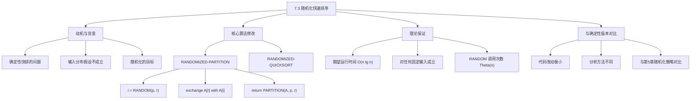
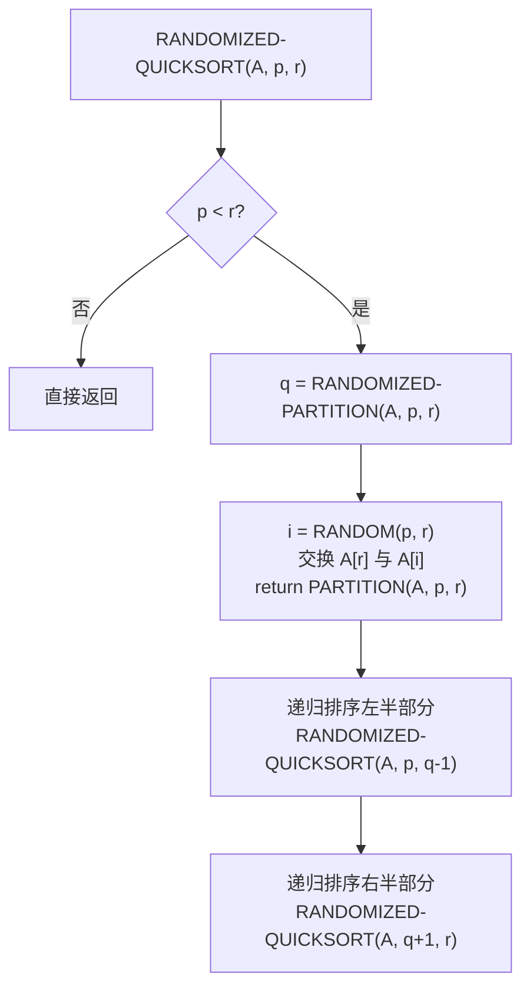

## 相关笔记

- 前置笔记：[[7.1 快速排序的描述]]、[[7.2 快速排序的性能]]
- 关联概念：[[算法导论/concepts/随机化算法]]、[[5.3 随机化算法]]
- 后续笔记：[[7.4 快速排序的分析]]
- 章节汇总：[[第07章_快速排序-章节汇总]]

> [!abstract] 概览
> 本节介绍快速排序的==随机化版本==，通过在划分前随机选择==主元（pivot）==来消除算法对特定输入分布的依赖。核心思想是：不再固定使用 $A[r]$ 作为主元，而是从子数组 $A[p..r]$ 中==均匀随机==地选取一个元素作为主元。
>
> **要点列表：**
> - 随机化快速排序的期望运行时间为 ==$O(n \lg n)$==，且该期望==对所有输入==都成立
> - RANDOMIZED-PARTITION 只需在标准 PARTITION 前加一行随机选择 + 一行交换，代码改动极小
> - 随机化的关键优势：==不依赖输入的随机性假设==，而是由算法自身引入随机性
> - 与第5章的联系：RANDOMIZED-PARTITION 使用了与 RANDOMIZE-IN-PLACE 相同的随机化思想（第5.3节），但更简洁——只需随机选择 pivot 并交换到末尾，无需对整个子数组进行随机置换

---

知识结构总览



---

核心思想

> [!tip] 核心思路
> 确定性快速排序的平均情况分析基于一个强假设：**输入的所有排列等概率出现**。但这个假设在现实中并不总是成立——例如，数据可能已经部分有序，或者攻击者可能故意构造最坏输入。
>
> 随机化快速排序的核心洞察是：**将随机性从输入转移到算法内部**。算法自身通过随机选择主元来保证良好的期望性能，无论输入是什么。
>
> 这就像打牌时，与其指望对手随机发牌（依赖输入随机性），不如自己每次随机从手牌中选一张出（算法内部随机化）——无论对手怎么发牌，你的策略都能保证期望收益。

### RANDOMIZED-PARTITION 伪代码

```
RANDOMIZED-PARTITION(A, p, r)
1  i = RANDOM(p, r)          // 从 A[p..r] 中均匀随机选取一个下标
2  exchange A[r] with A[i]    // 将随机选中的元素交换到末尾
3  return PARTITION(A, p, r)  // 执行标准划分
```

### RANDOMIZED-QUICKSORT 伪代码

> [!tip] 算法执行流程
> 1. 若 **p >= r**，子数组最多一个元素，直接返回
> 2. 调用 **RANDOMIZED-PARTITION(A, p, r)**：先从 **A[p..r]** 中随机选一个元素交换到末尾，再执行标准 **PARTITION**，返回分界点 **q**
> 3. 递归调用 **RANDOMIZED-QUICKSORT(A, p, q-1)** 排序左半部分
> 4. 递归调用 **RANDOMIZED-QUICKSORT(A, q+1, r)** 排序右半部分



```
RANDOMIZED-QUICKSORT(A, p, r)
1  if p < r
2      q = RANDOMIZED-PARTITION(A, p, r)
3      RANDOMIZED-QUICKSORT(A, p, q - 1)
4      RANDOMIZED-QUICKSORT(A, q + 1, r)
```

### 关键性质分析

> [!def] RANDOMIZED-PARTITION 的正确性
> **输入：** 数组 $A[p..r]$
> **输出：** 划分下标 $q$，使得 $A[p..q-1] \leq A[q] \leq A[q+1..r]$
>
> **正确性论证：**
> RANDOMIZED-PARTITION 的正确性直接继承自 PARTITION。关键观察是：
> 1. 第1行 `i = RANDOM(p, r)` 从 $A[p..r]$ 中均匀随机选取一个下标 $i$，每个下标被选中的概率为 $\dfrac{1}{r - p + 1}$
> 2. 第2行将 $A[i]$（随机选中的元素）与 $A[r]$ 交换，使得随机选中的元素被放到 $A[r]$ 的位置
> 3. 第3行调用标准 PARTITION，它以 $A[r]$（即随机选中的元素）为主元执行划分
>
> 由于 PARTITION 本身是正确的，且我们只是改变了主元的选择方式（从固定选 $A[r]$ 变为随机选一个元素放到 $A[r]$ 位置），因此 RANDOMIZED-PARTITION 的划分结果仍然是正确的。

### 与第5章随机化思想的联系

> [!def] 两种随机化策略对比
> **第5.3节策略（RANDOMIZE-IN-PLACE 风格）：** 先对整个输入执行随机排列，然后运行确定性算法。
> - RANDOMIZED-HIRE-ASSISTANT 先将候选人随机排列，再逐个面试
> - 理论上也可以对快速排序这样做：先随机排列整个数组，再运行确定性 QUICKSORT
>
> **本节策略（RANDOMIZED-PARTITION 风格）：** 在每次递归调用时随机选择主元。
> - 只需在 PARTITION 前加两行代码
> - 每次递归调用都独立地进行随机化
> - 分析更简洁（直接利用均匀随机选择的性质）
>
> **为什么本节选择第二种策略？** 因为它更简洁、更高效（$O(1)$ 额外开销 vs $O(n)$ 随机排列开销），且分析更方便。两种策略在理论上是等价的——它们都保证主元是从当前子数组中均匀随机选取的。

### 复杂度分析

> [!def] 时间复杂度
> - **期望运行时间：** ==$O(n \lg n)$==（对所有固定输入成立，下一节7.4将严格证明）
> - **最坏情况运行时间：** $\Theta(n^2)$（随机化并未消除最坏情况，只是使其概率极低）
> - **RANDOM 调用次数：** 每次调用 RANDOMIZED-PARTITION 调用一次 RANDOM，总共调用 $\Theta(n)$ 次（无论最好还是最坏情况，因为 $n$ 个元素需要 $n$ 次划分）
>
> **空间复杂度：** $O(\lg n)$ 期望栈空间（递归深度期望为 $O(\lg n)$），最坏情况 $O(n)$ 栈空间。

---

补充理解与拓展

> [!info] 随机化快速排序的工程实践——主流排序库的实现
>
> 随机化快速排序是工程实践中最广泛使用的排序算法之一，许多主流软件库都采用其变体作为默认排序：
>
> | 软件/语言 | 排序实现 | 说明 |
> |:---------|:---------|:-----|
> | C 标准库 `qsort` | 随机化快速排序（glibc实现） | glibc 的 `qsort` 使用随机化 pivot 选择，对小数组切换到插入排序 |
> | Python `sorted()` / `list.sort()` | Timsort | Python 使用 Timsort（归并排序+插入排序混合），但早期 CPython 曾考虑过快速排序 |
> | C++ `std::sort` | Introsort | Musser (1997) 提出的内省排序：快速排序 + 堆排序后备 + 插入排序基线 |
> | Java `Arrays.sort()` (基本类型) | Dual-Pivot Quicksort | Yaroslavskiy (2009) 提出的双轴快速排序，自 JDK 7 起替代传统快速排序 |
> | Java `Arrays.sort()` (对象类型) | Timsort | 保证稳定性 |
>
> **Java Dual-Pivot Quicksort（Yaroslavskiy 2009）：** 使用两个 pivot 将数组分为三部分，比经典快速排序减少约 10-15% 的比较次数。该算法在 2009 年被 Vladimir Yaroslavskiy 提出，经过严格基准测试后被 Oracle 采纳，自 JDK 7 起替代了传统快速排序成为基本类型排序的默认实现。论文 "Dual-Pivot Quicksort" 由 Yaroslavskiy, Bentley, Bloch (2009) 发表。
>
> 来源：Yaroslavskiy, V., Bentley, J., Bloch, J. "Dual-Pivot Quicksort" (2009); glibc source code; OpenJDK source code

> [!info] 随机化快速排序的理论保证——为什么期望 $O(n \lg n)$ 对所有输入成立？
>
> 随机化快速排序的核心理论优势在于：**期望运行时间不依赖于输入分布**。
>
> - **确定性快速排序**：期望运行时间假设输入随机排列。如果输入已经有序或接近有序，确定性快速排序退化为 $\Theta(n^2)$
> - **随机化快速排序**：对于==任何固定输入==，期望运行时间都是 $O(n \lg n)$，因为 pivot 的选择是算法内部的随机过程
>
> **形式化理解：** 设输入数组固定为某个特定排列。在每次调用 RANDOMIZED-PARTITION 时，主元是从当前子数组中均匀随机选取的。因此，划分产生的两个子问题大小的分布是确定的（不依赖于输入分布），其期望递归深度为 $O(\lg n)$。这正是下一节（7.4）将要通过指示器随机变量方法严格证明的内容。
>
> **与第5章的联系：** RANDOMIZED-PARTITION 使用了与 RANDOMIZE-IN-PLACE（第5.3节）相同的随机化思想——通过随机选择打破确定性算法对输入分布的依赖。但 RANDOMIZED-PARTITION 更简洁：只需随机选择一个 pivot 并交换到末尾，无需对整个子数组执行随机置换（RANDOMIZE-IN-PLACE 需要 $O(n)$ 时间来随机排列整个数组）。

---

易混淆点与辨析

> [!warning] 误区：随机化快速排序就是在排序前先把数组随机打乱
> ❌ **错误理解：** "随机化快速排序就是在排序前先把数组随机打乱，然后再运行确定性快速排序"
>
> ✅ **正确理解：** 虽然在理论上"先随机排列输入再运行确定性快排"与"每次划分时随机选主元"是等价的（都能保证 $O(n \lg n)$ 期望运行时间），但两者在实现和分析上有重要区别：
>
> | 对比维度 | 先排列输入（RANDOMIZE-IN-PLACE 风格） | 随机选主元（RANDOMIZED-PARTITION 风格） |
> |:---------|:---------------------------------------|:---------------------------------------|
> | 实现方式 | 需要先对整个数组执行随机排列，$O(n)$ 额外开销 | 每次划分前只做一次随机选择 + 一次交换，$O(1)$ 额外开销 |
> | 随机化粒度 | 一次性全局随机化 | 每次递归调用都独立随机化 |
> | 分析复杂度 | 需要分析排列的均匀性 | 直接利用均匀随机选择性质，分析更简洁 |
> | 实际采用 | 理论上等价，实践中较少使用 | **实际实现的标准做法** |
>
> RANDOMIZED-PARTITION 是更优的策略：每次递归调用只增加 $O(1)$ 开销（一行 RANDOM + 一行交换），而全局随机排列需要 $O(n)$ 额外时间。

> [!warning] 误区：随机化消除了快速排序的最坏情况
> ❌ **错误理解：** "随机化快速排序的最坏情况运行时间是 $O(n \lg n)$" 或 "随机化消除了最坏情况"
>
> ✅ **正确理解：** 随机化快速排序的==最坏情况运行时间仍然是 $\Theta(n^2)$==！随机化保证的是==期望==运行时间为 $O(n \lg n)$。
>
> - ❌ "随机化消除了最坏情况" —— 错误，最坏情况仍可能以极低概率发生
> - ✅ "随机化使得对任何固定输入，期望运行时间为 $O(n \lg n)$" —— 正确
> - ❌ "分析随机化算法应该看最坏情况" —— 对随机化算法，我们主要分析期望运行时间
> - ✅ "期望运行时间是对算法的随机选择取期望，而非对输入分布取期望" —— 正确
>
> **为什么分析期望而非最坏情况？** 因为随机化算法的运行时间本身就是一个随机变量。最坏情况虽然存在（例如每次都选到最小或最大元素作为主元），但发生的概率极低（对 $n$ 个元素的输入，概率为 $O(1/n!)$）。期望运行时间更能反映算法的典型行为。

---

习题精选

| 题号 | 题目描述 | 难度 |
|:---:|----------|:---:|
| 7.3-1 | 为什么我们分析随机化算法的期望运行时间，而不是最坏情况运行时间？ | ⭐ |
| 7.3-2 | RANDOMIZED-QUICKSORT 运行时，在最坏情况和最好情况下分别调用多少次 RANDOM？用 $\Theta$ 记号给出答案。 | ⭐⭐ |

> [!faq]- 7.3-1 参考答案
> **题目：** 为什么我们分析随机化算法的期望运行时间，而不是最坏情况运行时间？
>
> **解题思路：** 思考随机化算法中"随机性"的来源——它来自算法内部的随机选择，而非输入的不确定性。
>
> **参考答案：** 对于随机化算法，运行时间是一个随机变量，因为它依赖于算法内部做出的随机选择。最坏情况运行时间虽然存在（例如每次都选到最小或最大元素作为主元），但它不能反映算法的典型行为。我们分析期望运行时间，是因为：
>
> 1. 期望运行时间衡量的是算法在所有可能的随机选择下的平均表现，更能反映实际使用中的性能
> 2. 对于随机化快速排序，最坏情况 $\Theta(n^2)$ 发生的概率极低（概率为 $O(1/n!)$）
> 3. 期望运行时间 $O(n \lg n)$ 对==任何固定输入==都成立，不依赖于输入的分布假设
>
> 这与确定性算法的分析形成对比：确定性算法的运行时间完全由输入决定，因此我们关注最坏情况（对所有输入的上界）和平均情况（对输入分布取期望）。而随机化算法的运行时间由输入和算法的随机选择共同决定，因此我们关注期望运行时间（对随机选择取期望，输入固定）。

> [!faq]- 7.3-2 参考答案
> **题目：** RANDOMIZED-QUICKSORT 运行时，在最坏情况和最好情况下分别调用多少次 RANDOM？用 $\Theta$ 记号给出答案。
>
> **解题思路：** RANDOM 的调用次数等于 RANDOMIZED-PARTITION 的调用次数，而后者等于递归树中内部节点的数量。
>
> **参考答案：** 每次调用 RANDOMIZED-QUICKSORT 时，如果 $p < r$，就会调用一次 RANDOMIZED-PARTITION，从而调用一次 RANDOM。因此 RANDOM 的调用次数等于递归调用 RANDOMIZED-QUICKSORT 的次数（不包括 $p \geq r$ 的基本情况）。
>
> - **最好情况：** 每次划分都恰好平分，递归树深度为 $\Theta(\lg n)$，每层有 $\Theta(1)$ 到 $\Theta(n)$ 个节点。递归树的总节点数为 $\Theta(n)$（类似完全二叉树），因此调用 RANDOM $\Theta(n)$ 次。
>
> - **最坏情况：** 每次划分都产生 0 和 $n-1$ 的分裂，递归树退化为链状，深度为 $\Theta(n)$，总节点数也为 $\Theta(n)$，因此调用 RANDOM $\Theta(n)$ 次。
>
> **结论：** 无论最好情况还是最坏情况，RANDOM 的调用次数都是 $\Theta(n)$。这是因为每次划分恰好消耗一个元素（主元），$n$ 个元素总共需要 $n$ 次划分。

---

视频学习指南

| 资源 | 主题 | 链接 | 说明 |
|:-----|:-----|:-----|:-----|
| MIT 6.046J Lecture 6 | Randomization: Quicksort | https://www.youtube.com/watch?v=A3Ffwsnad0k | Devadas 教授讲解随机化快速排序的动机与实现 |
| MIT 6.006 Fall 2005 Lecture 4 | Quicksort, Randomized Algorithms | https://www.youtube.com/watch?v=0D2G8AaJXGY | Demaine & Leiserson 讲解随机化快速排序，含期望运行时间分析 |
| Abdul Bari | Quick Sort Algorithm | https://www.youtube.com/watch?v=COk73cpQbFQ | 逐步动画演示快速排序的划分过程，直观易懂 |
| Michael Sambol | Quicksort | https://www.youtube.com/watch?v=Hoixgm4-P4M | 2分钟简洁演示，含伪代码和可视化 |
| Ravindrababu Ravula | Quick Sort | https://www.youtube.com/watch?v=PgBzjlCcFvc | 完整的快速排序讲解，含随机化版本讨论 |

---

教材原文

> [!quote] CLRS 第4版 7.3节原文
> In exploring the average-case behavior of quicksort, we have assumed that all permutations of the input numbers are equally likely. This assumption does not always hold, however, as, for example, in the situation laid out in the premise for Exercise 7.2-4. Section 5.3 showed that judicious randomization can sometimes be added to an algorithm to obtain good expected performance over all inputs. For quicksort, randomization yields a fast and practical algorithm. Many software libraries provide a randomized version of quicksort as their algorithm of choice for sorting large data sets.
>
> In Section 5.3, the RANDOMIZED-HIRE-ASSISTANT procedure explicitly permutes its input and then runs the deterministic HIRE-ASSISTANT procedure. We could do the same for quicksort as well, but a different randomization technique yields a simpler analysis. Instead of always using $A[r]$ as the pivot, a randomized version randomly chooses the pivot from the subarray $A[p..r]$, where each element in $A[p..r]$ has an equal probability of being chosen. It then exchanges that element with $A[r]$ before partitioning. Because the pivot is chosen randomly, we expect the split of the input array to be reasonably well balanced on average.

---

## 参见Wiki

- [[算法导论/concepts/快速排序]] — 随机化快速排序的期望线性时间分析

#学习/算法导论/第07章-快速排序 #学习/算法导论/快速排序/随机化版本
