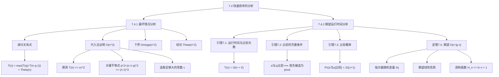

## 相关笔记

- 前置笔记：[[7.1 快速排序的描述]]、[[7.2 快速排序的性能]]、[[7.3 快速排序的随机化版本]]
- 关联概念：[[算法导论/concepts/大O记号]]、[[算法导论/concepts/大Theta记号]]、[[算法导论/concepts/递归关系式]]
- 章节汇总：[[第07章_快速排序-章节汇总]]

> [!abstract] 概览
> 本节对快速排序进行严格的数学分析，包含两个核心部分：
>
> 1. **最坏情况分析（7.4.1）**：使用==代入法==严格证明快速排序的最坏情况运行时间为 ==$\Theta(n^2)$==，适用于确定性版本和随机化版本
> 2. **期望运行时间分析（7.4.2）**：通过==指示器随机变量==（与第5.2节技术相同）和==期望的线性性质==，证明 RANDOMIZED-QUICKSORT 的期望运行时间为 ==$O(n \lg n)$==
>
> **要点列表：**
> - 最坏情况发生在每次划分都产生 $0$ 与 $n-1$ 的分裂时，使用代入法严格证明 $T(n) = \Theta(n^2)$
> - 引理7.1：快速排序的运行时间为 $O(n + X)$，其中 $X$ 为元素比较的总次数
> - 引理7.2：两个元素 $z_i$ 和 $z_j$ 被比较==当且仅当==它们中首先被选为主元
> - 引理7.3：任意两个元素被比较的概率为 $\dfrac{2}{j - i + 1}$
> - 定理7.4：期望比较次数 $E[X] \leq 2n \ln n = O(n \lg n)$，常数因子约为 $2 \ln 2 \approx 1.386$

---

知识结构总览

---

核心思想

### 7.4.1 最坏情况分析

> [!tip] 分析策略
> 最坏情况分析的目标是严格证明：快速排序的最坏情况运行时间为 $\Theta(n^2)$。这个结论适用于==确定性快速排序==和==随机化快速排序==（因为随机化版本的最坏情况运行时间与确定性版本相同，只是发生的概率极低）。
>
> 证明分为两步：
> 1. 使用代入法证明上界 $T(n) = O(n^2)$
> 2. 结合第7.2节已知的下界 $T(n) = \Omega(n^2)$，得出 $T(n) = \Theta(n^2)$

#### 递归关系式的建立

> [!def] 最坏情况递归关系式
> 设 $T(n)$ 为 QUICKSORT 在 $n$ 个元素输入上的最坏情况运行时间。由于 PARTITION 产生的两个子问题总大小为 $n - 1$（主元被排除），我们得到：
>
> $$T(n) = \max_{0 \leq q \leq n - 1} \{T(q) + T(n - q - 1)\} + \Theta(n)$$
>
> 其中 $q$ 是划分后左侧子数组的大小，$n - q - 1$ 是右侧子数组的大小。$\Theta(n)$ 是 PARTITION 本身的运行时间。

#### 代入法证明 $T(n) = O(n^2)$

> [!def] 代入法证明（上界）
> **猜测：** $T(n) \leq cn^2$，其中 $c > 0$ 为某个常数。
>
> > **【代入法（猜测 $T(n) \le cn^2$）】** 将猜测代入递归关系式，分析最大化项
>
> **将猜测代入递归关系式：**
>
> $$T(n) \leq \max_{0 \leq q \leq n - 1} \{cq^2 + c(n-1-q)^2\} + \Theta(n) = c \cdot \max_{0 \leq q \leq n - 1} \{q^2 + (n-1-q)^2\} + \Theta(n)$$
>
> **关键步骤——分析最大化项：**
>
> 展开 $q^2 + (n-1-q)^2$：
>
> $$q^2 + (n-1-q)^2 = q^2 + (n-1)^2 - 2q(n-1) + q^2 = (n-1)^2 + 2q^2 - 2q(n-1)$$
>
> 提取公因子：
>
> $$= (n-1)^2 + 2q(q - (n-1))$$
>
> 因为 $0 \leq q \leq n - 1$，所以 $q - (n-1) \leq 0$，从而 $2q(q - (n-1)) \leq 0$（因为 $q \geq 0$ 且 $q - (n-1) \leq 0$，乘积非正）。因此：
>
> $$q^2 + (n-1-q)^2 \leq (n-1)^2$$
>
> 等号在 $q = 0$ 或 $q = n - 1$ 时取得（即最不平衡的划分）。
>
> > **【选取常数 $c$（余量吸收低阶项）】** $cn^2 - c(2n-1)$ 中的 $c(2n-1)$ 主导 $\Theta(n)$
>
> **继续推导：**
>
> $$T(n) \leq c(n-1)^2 + \Theta(n)$$
>
> 展开 $(n-1)^2$：
>
> $$= c(n^2 - 2n + 1) + \Theta(n) = cn^2 - c(2n - 1) + \Theta(n)$$
>
> 选取足够大的常数 $c$，使得 $c(2n - 1)$ 项主导 $\Theta(n)$ 项，即得：
>
> $$T(n) \leq cn^2$$
>
> **因此 $T(n) = O(n^2)$。**
>
> 结合第7.2节中已知的 $\Omega(n^2)$ 下界（当划分最大不平衡时，即每次 $q = 0$ 或 $q = n - 1$），得出：
>
> $$\boxed{T(n) = \Theta(n^2)}$$

### 7.4.2 期望运行时间分析

> [!tip] 分析策略：从运行时间到比较次数
> 分析快速排序期望运行时间的关键策略是**将运行时间归结为元素比较次数**。因为：
> 1. PARTITION 过程的运行时间正比于它执行的比较次数
> 2. 比较次数更容易用概率工具分析（指示器随机变量 + 期望的线性性质）
> 3. 一旦得到期望比较次数的界，就能直接得到期望运行时间的界
>
> 这就像分析一场考试的总分——与其逐题分析每道题的得分，不如先分析每道题的得分期望，再求和。

#### 引理 7.1：运行时间与比较次数的关系

> [!def] 引理 7.1
> QUICKSORT 在 $n$ 元素数组上的运行时间为 $O(n + X)$，其中 $X$ 是执行的所有元素比较的总次数。
>
> **证明：**
>
> > **【逐步计数（调用次数分析）】** 分别统计 PARTITION 和 QUICKSORT 的调用次数
>
> QUICKSORT 的运行时间由 PARTITION 的调用时间主导。我们逐步分析：
>
> 1. **PARTITION 的调用次数：** 每次调用 PARTITION 选中一个主元，该主元此后不再出现在任何递归调用中。因此，整个执行过程中 PARTITION 最多被调用 $n$ 次。
>
> 2. **QUICKSORT 的调用次数：** 每次 QUICKSORT 调用 PARTITION 后，还会递归调用自身两次。因此 QUICKSORT 自身最多被调用 $2n$ 次。
>
> > **【时间分解（循环内外分离）】** 将运行时间拆分为循环外 $O(n)$ 和循环内 $O(X)$
>
> 3. **PARTITION 的每次调用耗时：**
>    - for 循环外（初始化 + 交换）：$O(1)$
>    - for 循环内（第3-6行）：每次迭代执行一次比较（第4行），比较主元与数组中的另一个元素
>    - 因此，for 循环的总时间正比于比较次数 $X$
>
> 4. **总时间：**
>    - for 循环外的时间：$n$ 次 PARTITION 调用，每次 $O(1)$，总计 $O(n)$
>    - for 循环内的时间：正比于 $X$
>    - 总时间 = $O(n) + O(X) = O(n + X)$
>
> **因此，分析 QUICKSORT 的期望运行时间归结为计算 $E[X]$。**

#### 引理 7.2：比较的充要条件

> [!def] 引理 7.2
> 在 RANDOMIZED-QUICKSORT 对 $n$ 个不同元素 $z_1 < z_2 < \cdots < z_n$ 的执行过程中，元素 $z_i$ 与 $z_j$（$i < j$）被比较，**当且仅当**在集合 $Z_{ij} = \{z_i, z_{i+1}, \ldots, z_j\}$ 中，$z_i$ 或 $z_j$ 是第一个被选为主元的元素。此外，任何两个元素最多被比较一次。
>
> **证明：**
>
> > **【情况分类（首个主元的三种情况）】** 根据 $Z_{ij}$ 中首个主元 $x$ 的身份分情况讨论
>
> 考虑 $Z_{ij}$ 中第一个被选为主元的元素 $x$，分三种情况：
>
> - **情况一：$z_i < x < z_j$**（$x$ 不是 $z_i$ 也不是 $z_j$）
>  - PARTITION 以 $x$ 为主元执行划分
>  - $z_i$ 被分到 $x$ 的左侧（因为 $z_i < x$），$z_j$ 被分到 $x$ 的右侧（因为 $z_j > x$）
>  - 此后 $z_i$ 和 $z_j$ 处于不同的递归子问题中，**永远不会被比较**
>
> - **情况二：$x = z_i$**
>  - PARTITION 以 $z_i$ 为主元
>  - $z_i$ 与 $Z_{ij}$ 中所有其他元素（包括 $z_j$）进行比较
>  - $z_i$ 和 $z_j$ **被比较**
>  - 此后 $z_i$ 作为主元被排除，不会再与 $z_j$ 比较第二次
>
> - **情况三：$x = z_j$**
>  - PARTITION 以 $z_j$ 为主元
>  - $z_j$ 与 $Z_{ij}$ 中所有其他元素（包括 $z_i$）进行比较
>  - $z_i$ 和 $z_j$ **被比较**
>  - 此后 $z_j$ 作为主元被排除，不会再与 $z_i$ 比较第二次
>
> > **【充要条件总结】** 仅当 $z_i$ 或 $z_j$ 在 $Z_{ij}$ 中首先被选为主元时才比较
>
> **结论：** $z_i$ 和 $z_j$ 被比较当且仅当 $Z_{ij}$ 中第一个被选为主元的是 $z_i$ 或 $z_j$。且由于主元被排除后不再参与比较，任何两个元素最多被比较一次。

#### 引理 7.3：比较概率

> [!def] 引理 7.3
> 对于任意两个元素 $z_i$ 和 $z_j$（$i < j$），它们被比较的概率为 $\dfrac{2}{j - i + 1}$。
>
> **证明：**
>
> 考虑 RANDOMIZED-QUICKSORT 的递归调用树。初始时，根节点包含所有元素，因此也包含 $Z_{ij}$ 的所有元素。
>
> $Z_{ij}$ 中的所有元素在每次递归调用中都保持在一起，直到某次 PARTITION 从中选出一个主元 $x \in Z_{ij}$。从该点起，$x$ 不再出现在后续的输入集中。
>
> 当 RANDOMIZED-PARTITION 首次从包含 $Z_{ij}$ 所有元素的集合中选择主元时，每个元素被选中的概率相等（因为主元是均匀随机选择的）。由于 $|Z_{ij}| = j - i + 1$，任意特定元素被首先选中的概率为 $\dfrac{1}{j - i + 1}$。
>
> 由引理7.2，$z_i$ 和 $z_j$ 被比较当且仅当 $z_i$ 或 $z_j$ 是 $Z_{ij}$ 中第一个被选为主元的元素。这两个事件互斥，因此：
>
> $$\Pr\{z_i \text{ 与 } z_j \text{ 被比较}\} = \Pr\{z_i \text{ 是 } Z_{ij} \text{ 中第一个主元}\} + \Pr\{z_j \text{ 是 } Z_{ij} \text{ 中第一个主元}\}$$
>
> $$= \frac{1}{j - i + 1} + \frac{1}{j - i + 1} = \frac{2}{j - i + 1}$$

#### 定理 7.4：期望运行时间 $O(n \lg n)$

> [!def] 定理 7.4
> RANDOMIZED-QUICKSORT 在 $n$ 个不同元素上的期望运行时间为 $O(n \lg n)$。
>
> **完整证明：**
>
> > **【指示器随机变量（定义 $X_{ij}$）】** 将比较事件编码为 0/1 指示器变量
>
> **第一步：定义指示器随机变量。** 对于 $1 \leq i < j \leq n$，定义：
>
> $$X_{ij} = I\{z_i \text{ 与 } z_j \text{ 被比较}\}$$
>
> 其中 $I\{A\}$ 是指示器随机变量：事件 $A$ 发生时为 1，否则为 0。
>
> **第二步：表达总比较次数。** 由引理7.2，每对元素最多比较一次，因此：
>
> $$X = \sum_{i=1}^{n-1} \sum_{j=i+1}^{n} X_{ij}$$
>
> > **【期望线性性质（交换求和与期望）】** 利用 $E[\sum X_{ij}] = \sum E[X_{ij}]$ 将期望转入求和内部
>
> **第三步：取期望并利用线性性质。** 对两边取期望，利用期望的线性性质（公式 C.24）和引理5.1：
>
> $$E[X] = E\left[\sum_{i=1}^{n-1} \sum_{j=i+1}^{n} X_{ij}\right] = \sum_{i=1}^{n-1} \sum_{j=i+1}^{n} E[X_{ij}]$$
>
> 由于 $X_{ij}$ 是指示器随机变量，$E[X_{ij}] = \Pr\{z_i \text{ 与 } z_j \text{ 被比较}\}$。由引理7.3：
>
> $$E[X] = \sum_{i=1}^{n-1} \sum_{j=i+1}^{n} \frac{2}{j - i + 1}$$
>
> > **【变量替换（$k = j - i$）】** 简化双重求和，利用对称性放缩
>
> **第四步：化简求和。** 作变量替换 $k = j - i$（注意 $k \geq 1$）：
>
> $$E[X] = \sum_{i=1}^{n-1} \sum_{k=1}^{n-i} \frac{2}{k + 1}$$
>
> 交换求和顺序并利用对称性：
>
> $$E[X] \leq 2 \sum_{i=1}^{n} \sum_{k=1}^{n} \frac{1}{k} = 2n \sum_{k=1}^{n} \frac{1}{k} = 2n H_n$$
>
> 其中 $H_n = \sum_{k=1}^{n} \frac{1}{k}$ 是第 $n$ 个调和数。
>
> > **【调和级数上界（$H_n \leq \ln n + 1$）】** 利用调和数与自然对数的关系完成渐近分析
>
> **第五步：利用调和级数上界。** 由公式 (A.9)，$H_n \leq \ln n + 1$（自然对数），因此：
>
> $$E[X] \leq 2n(\ln n + 1) = 2n \ln n + 2n = O(n \lg n)$$
>
> > **【结论（结合引理7.1）】** 由 $O(n + E[X]) = O(n \lg n)$ 得出期望运行时间
>
> **第六步：得出结论。** 由引理7.1，期望运行时间为 $O(n + E[X]) = O(n \lg n)$。结合第7.2节的 $\Theta(n \lg n)$ 最好情况界，期望运行时间为 $\Theta(n \lg n)$。
>
> **常数因子分析：** 期望比较次数约为 $2n \ln n = 2n \cdot \frac{\lg n}{\lg e} \approx 1.386 \, n \lg n$（以2为底的对数）。常数因子约为 1.39，比归并排序的 $n \lg n$ 略大，但实际中因缓存效应更快。

---

补充理解与拓展

> [!info] 快速排序的"秘密武器"——缓存局部性
>
> 快速排序在实践中通常比归并排序和堆排序更快，一个关键原因是==缓存局部性==（cache locality）。
>
> **LaMarca & Ladner (1996) 的经典实验研究** "The Influence of Caches on the Performance of Sorting"（发表于 SODA 1996，后扩展为 ACM Journal of Experimental Algorithmics 论文）通过系统实验揭示了缓存对排序算法性能的巨大影响：
>
> | 排序算法 | 缓存未命中率（相对值） | 实际运行时间（相对值） |
> |:---------|:---------------------|:---------------------|
> | 快速排序 | 低（基准） | 1.0x（基准） |
> | 归并排序 | 中等 | 1.2-1.5x |
> | 堆排序 | 高 | 1.5-3.0x |
>
> **为什么快速排序的缓存性能好？**
> - 快速排序的 PARTITION 操作在数组的==连续区域==进行扫描和交换，充分利用 CPU 缓存的空间局部性（spatial locality）和时间局部性（temporal locality）
> - 堆排序的 MAX-HEAPIFY 操作在堆的不同层级间跳跃访问（根节点 $\to$ 叶节点 $\to$ 根节点），缓存未命中率高
> - 彉并排序的合并操作虽然也是顺序访问，但需要额外的 $O(n)$ 空间，可能引发缓存抖动（cache thrashing）
>
> 这解释了为什么快速排序的常数因子虽然理论上略大于归并排序（1.39 vs 1.0），但在实际运行中往往更快。
>
> 来源：LaMarca, A. & Ladner, R.E. "The Influence of Caches on the Performance of Sorting", SODA 1996; ACM JEA, 1999

> [!info] Sedgewick 的快速排序优化建议与工程实践
>
> Robert Sedgewick（普林斯顿大学教授，Knuth 的学生）在多年的算法工程实践中总结出多项快速排序优化策略，这些策略已被主流标准库广泛采用：
>
> 1. **对小分区切换插入排序**：当子数组大小小于某个阈值 $k$（通常 10-30）时，改用插入排序。这是因为对小数组，递归调用的开销超过了 $O(n^2)$ 的劣势。理论分析（习题7.4-5）表明期望运行时间为 $O(nk + n \lg(n/k))$，当 $k = O(\lg n)$ 时仍为 $O(n \lg n)$
>
> 2. **三路分区（Dutch National Flag）**：当数组中存在大量重复元素时，经典的双路分区会将等于主元的元素反复划分。三路分区将数组分为 $< \text{pivot}$、$= \text{pivot}$、$> \text{pivot}$ 三部分，对重复元素密集的数据集性能提升显著。Java 的 `Arrays.sort()` 对对象类型排序时使用了此策略
>
> 3. **Median-of-three 选择 pivot**：从子数组的首、中、尾三个元素中选取中位数作为主元（习题7.4-6）。这可以避免已排序或接近排序输入的最坏情况，且只需 3 次比较。研究表明，median-of-three 将得到"差于 1:4 划分"的概率从 1/2 降低到约 1/10
>
> 4. **Introsort 混合策略**（Musser, 1997）：结合快速排序、堆排序和插入排序——先用快速排序，当递归深度超过 $2\lceil \lg n \rceil$ 时切换到堆排序防止退化，对小分区切换到插入排序。C++ STL 的 `std::sort` 就采用此策略
>
> 来源：Sedgewick, R. "Algorithms in C++"; Musser, D.R. "Introspective Sorting and Selection Algorithms", Software: Practice and Experience, 1997

---

易混淆点与辨析

> [!warning] 误区：期望是对输入取还是对随机选择取？
> ❌ **错误理解：** "随机化快速排序的 $O(n \lg n)$ 期望运行时间意味着对所有可能的输入取平均"
>
> ✅ **正确理解：** RANDOMIZED-QUICKSORT 的期望运行时间是==对算法内部的随机选择取期望==，而非对输入分布取期望。这是一个关键区别：
>
> - ❌ "对所有输入取平均得到 $O(n \lg n)$" —— 这是确定性快速排序在随机输入假设下的结论
> - ✅ "对任何==固定==输入，算法的随机选择产生的期望运行时间为 $O(n \lg n)$" —— 这是随机化快速排序的结论
>
> **为什么这个区别重要？** 因为这意味着即使攻击者知道你的算法并精心构造输入，只要算法使用真随机（或足够好的伪随机），期望性能仍然有保证。确定性快速排序没有这种鲁棒性——攻击者可以构造特定输入使其退化为 $\Theta(n^2)$。
>
> **类比：** 确定性快速排序的"平均情况"就像说"平均来看，这条路的路况不错"——但如果你恰好走的是那条坑洼路，你还是会很惨。随机化快速排序的"期望"就像说"无论你走哪条路，只要你随机选路，平均体验都不错"——即使有人故意在某些路上挖坑。

> [!warning] 误区：引理7.2中"首先被选为主元"是全局的
> ❌ **错误理解：** "$z_i$ 和 $z_j$ 被比较的条件是在整个排序过程中 $z_i$ 或 $z_j$ 首先被选为主元"
>
> ✅ **正确理解：** 条件是"在集合 $Z_{ij} = \{z_i, z_{i+1}, \ldots, z_j\}$ 中，$z_i$ 或 $z_j$ ==首先==被选为主元"。这里的"首先"是相对于 $Z_{ij}$ 这个子集而言的，不是全局的。
>
> **具体例子：** 考虑数组 $\{3, 1, 4, 2, 5\}$，排序后为 $z_1=1, z_2=2, z_3=3, z_4=4, z_5=5$。
>
> - 考虑 $z_1=1$ 和 $z_5=5$，$Z_{15} = \{1, 2, 3, 4, 5\}$
> - 如果第一次全局划分选了 $z_3=3$ 作为主元，则 $1$ 和 $5$ 被分到不同侧，此后永远不会被比较
> - 这是因为 $z_3 \in Z_{15}$ 且 $z_3$ 既不是 $z_1$ 也不是 $z_5$，但 $z_3$ 在 $Z_{15}$ 中先于 $z_1$ 和 $z_5$ 被选为主元
>
> - ❌ "只要 $z_i$ 或 $z_j$ 在全局上先被选为主元就会被比较" —— 错误
> - ✅ "只有当 $Z_{ij}$ 中没有任何其他元素在 $z_i$ 和 $z_j$ 之前被选为主元时，$z_i$ 和 $z_j$ 才会被比较" —— 正确
>
> **概率直觉：** $Z_{ij}$ 中有 $j - i + 1$ 个元素，$z_i$ 和 $z_j$ 只占其中 2 个，因此它们"胜出"（首先被选中）的概率为 $\frac{2}{j - i + 1}$。当 $j - i + 1$ 很大（即 $z_i$ 和 $z_j$ 在排序序列中相距很远）时，它们被比较的概率很低——这是合理的，因为中间有很多元素可能先被选为主元，将它们分到不同侧。

---

习题精选

| 题号 | 题目描述 | 难度 |
|:---:|----------|:---:|
| 7.4-1 | 证明递归关系式 $T(n) = \max\{T(q) + T(n-q-1) : 0 \leq q \leq n-1\} + \Theta(n)$ 的下界为 $T(n) = \Omega(n^2)$ | ⭐⭐ |
| 7.4-2 | 证明快速排序的最好情况运行时间为 $\Omega(n \lg n)$ | ⭐⭐ |
| 7.4-3 | 证明表达式 $q^2 + (n-q-1)^2$ 在 $q=0$ 或 $q=n-1$ 时取得最大值 | ⭐ |
| 7.4-4 | 证明 RANDOMIZED-QUICKSORT 的期望运行时间为 $\Omega(n \lg n)$ | ⭐⭐⭐ |
| 7.4-5 | 粗化递归：当子数组少于 $k$ 个元素时改用插入排序，证明期望运行时间为 $O(nk + n \lg(n/k))$ | ⭐⭐⭐ |
| 7.4-6 | 三数取中划分：随机选三个元素取中位数作为主元，近似计算得到"差于 $\alpha$-对-$(1-\alpha)$ 划分"的概率 | ⭐⭐⭐ |

> [!faq]- 7.4-1 参考答案
> **题目：** 证明递归关系式 $T(n) = \max\{T(q) + T(n-q-1) : 0 \leq q \leq n-1\} + \Theta(n)$ 的下界为 $T(n) = \Omega(n^2)$。
>
> **解题思路：** 要证明下界，只需找到一种划分策略使得递归关系式的解至少为 $\Omega(n^2)$。最不平衡的划分（$q=0$ 或 $q=n-1$）就是这样的策略。
>
> **参考答案：** 考虑 $q = 0$ 的情况（每次划分产生大小为 0 和 $n-1$ 的子问题），递归关系式变为：
>
> $$T(n) \geq T(0) + T(n-1) + \Theta(n) = T(n-1) + \Theta(n)$$
>
> 展开此递归：
>
> $$T(n) \geq T(n-1) + cn = T(n-2) + c(n-1) + cn = \cdots = T(1) + c \sum_{k=1}^{n-1} k = \Theta(1) + c \cdot \frac{n(n-1)}{2} = \Omega(n^2)$$
>
> 因此 $T(n) = \Omega(n^2)$。

> [!faq]- 7.4-3 参考答案
> **题目：** 证明表达式 $q^2 + (n-q-1)^2$ 在 $q=0$ 或 $q=n-1$ 时取得最大值。
>
> **解题思路：** 将表达式展开，分析其关于 $q$ 的极值。
>
> **参考答案：** 展开：
>
> $$f(q) = q^2 + (n-q-1)^2 = q^2 + (n-1)^2 - 2q(n-1) + q^2 = 2q^2 - 2(n-1)q + (n-1)^2$$
>
> 这是一个关于 $q$ 的二次函数，开口向上（系数 $2 > 0$），因此它在定义域的==端点==处取得最大值。
>
> 或者用导数法：$f'(q) = 4q - 2(n-1)$，令 $f'(q) = 0$ 得 $q = \frac{n-1}{2}$，这是==最小值==点。因此最大值在端点 $q = 0$ 或 $q = n-1$ 处取得。
>
> 验证：$f(0) = 0 + (n-1)^2 = (n-1)^2$，$f(n-1) = (n-1)^2 + 0 = (n-1)^2$，$f(\frac{n-1}{2}) = 2 \cdot \frac{(n-1)^2}{4} = \frac{(n-1)^2}{2}$。确实端点值最大。

> [!faq]- 7.4-5 参考答案
> **题目：** 修改快速排序的递归基：当子数组少于 $k$ 个元素时改用插入排序。证明该随机化版本的期望运行时间为 $O(nk + n \lg(n/k))$。理论上和实践上应如何选择 $k$？
>
> **解题思路：** 将排序过程分为两层：快速排序负责将数组划分为大小不超过 $k$ 的子数组，插入排序负责对这些小子数组进行排序。
>
> **参考答案：**
>
> **期望运行时间分析：**
>
> 1. **快速排序阶段：** 递归在子数组大小 $< k$ 时停止。递归树的每个叶节点对应一个大小 $< k$ 的子数组。递归深度为 $O(\lg(n/k))$（因为每次划分近似减半），每层工作量为 $O(n)$。因此快速排序阶段耗时 $O(n \lg(n/k))$。
>
> 2. **插入排序阶段：** 共有 $\lceil n/k \rceil$ 个大小不超过 $k$ 的子数组，每个子数组的插入排序耗时 $O(k^2)$。总耗时为 $O(\lceil n/k \rceil \cdot k^2) = O(nk)$。
>
> 3. **总期望运行时间：** $O(n \lg(n/k)) + O(nk) = O(nk + n \lg(n/k))$。
>
> **$k$ 的选择：**
>
> - **理论上：** 对 $nk + n \lg(n/k) = n(k + \lg n - \lg k)$ 关于 $k$ 求导，令导数为零：$1 - \frac{1}{k \ln 2} = 0$，解得 $k = \frac{1}{\ln 2} \approx 1.44$。但这是连续近似，实际中 $k$ 应取较小的常数。
>
> - **实践中：** $k$ 通常取 10 到 30 之间的值。具体最优值取决于硬件特性（缓存大小、分支预测等），通常通过实验确定。大多数标准库实现中 $k$ 在 16 到 32 之间。

> [!faq]- 7.4-6 参考答案
> **题目：** 考虑修改 PARTITION 过程，从子数组 $A[p..r]$ 中随机选取三个元素，并以它们的中位数作为主元进行划分。近似计算得到差于 $\alpha$-对-$(1-\alpha)$ 划分的概率，其中 $0 < \alpha < 1/2$。
>
> **解题思路：** 分析三数取中策略下，划分比例差于 $\alpha : (1-\alpha)$ 的条件，然后计算该条件发生的概率。
>
> **参考答案：**
>
> 设从子数组中随机选取的三个元素为 $a, b, c$，排序后为 $a_{(1)} \leq a_{(2)} \leq a_{(3)}$，取中位数 $a_{(2)}$ 作为主元。
>
> **"差于 $\alpha$-对-$(1-\alpha)$ 划分"的含义：** 主元的秩（在排序后的子数组中的位置）小于 $\alpha n$ 或大于 $(1-\alpha)n$。
>
> **分析：** 中位数 $a_{(2)}$ 的秩小于 $\alpha n$ 当且仅当三个随机选取的元素中至少有两个的秩小于 $\alpha n$。类似地，中位数的秩大于 $(1-\alpha)n$ 当且仅当至少有两个的秩大于 $(1-\alpha)n$。
>
> 每个随机选取的元素的秩小于 $\alpha n$ 的概率为 $\alpha$，大于 $(1-\alpha)n$ 的概率为 $\alpha$。
>
> 至少两个元素秩小于 $\alpha n$ 的概率（二项分布）：
> $$\binom{3}{2}\alpha^2(1-\alpha) + \binom{3}{3}\alpha^3 = 3\alpha^2(1-\alpha) + \alpha^3 = 3\alpha^2 - 2\alpha^3$$
>
> 类似地，至少两个元素秩大于 $(1-\alpha)n$ 的概率也是 $3\alpha^2 - 2\alpha^3$。
>
> 由于这两个事件互斥（不可能同时发生），得到差划分的总概率为：
> $$2(3\alpha^2 - 2\alpha^3) = 6\alpha^2 - 4\alpha^3$$
>
> **与经典快速排序的对比：** 经典快速排序（随机选一个元素）得到差划分的概率为 $2\alpha$。三数取中将其降低为 $6\alpha^2 - 4\alpha^3$，当 $\alpha$ 较小时改善显著。例如 $\alpha = 1/10$ 时，经典概率为 0.2，三数取中概率为 $0.06 - 0.004 = 0.056$，降低了约 72%。

---

视频学习指南

| 资源 | 主题 | 链接 | 说明 |
|:-----|:-----|:-----|:-----|
| MIT 6.046J Lecture 6 | Randomization: Quicksort Analysis | https://www.youtube.com/watch?v=A3Ffwsnad0k | Devadas 教授讲解快速排序的期望运行时间分析，含指示器随机变量方法 |
| MIT 6.006 Fall 2005 Lecture 4 | Quicksort, Randomized Algorithms | https://www.youtube.com/watch?v=0D2G8AaJXGY | Demaine & Leiserson 完整讲解快速排序分析，含引理7.1-7.4的证明 |
| Abdul Bari | Quick Sort Algorithm | https://www.youtube.com/watch?v=COk73cpQbFQ | 逐步动画演示快速排序的划分过程，直观展示最坏情况和平均情况 |
| Ravindrababu Ravula | Quick Sort Analysis | https://www.youtube.com/watch?v=PgBzjlCcFvc | 完整的快速排序分析讲解，含时间复杂度推导 |
| Michael Sambol | Quicksort | https://www.youtube.com/watch?v=Hoixgm4-P4M | 简洁演示，适合快速回顾算法流程 |
| gate lectures by Ravindrababu | Quick Sort Performance Analysis | https://www.youtube.com/watch?v=2DvsDdWg5dQ | 详细的性能分析，含最坏情况和期望情况对比 |

---

教材原文

> [!quote] CLRS 第4版 7.4.1节 — 最坏情况分析
> We saw in Section 7.2 that a worst-case split at every level of recursion in quicksort produces a $\Theta(n^2)$ running time, which, intuitively, is the worst-case running time of the algorithm. We now prove this assertion.
>
> We'll use the substitution method (see Section 4.3) to show that the running time of quicksort is $O(n^2)$. Let $T(n)$ be the worst-case time for the procedure QUICKSORT on an input of size $n$. Because the procedure PARTITION produces two subproblems with total size $n - 1$, we obtain the recurrence
> $$T(n) = \max_{0 \leq q \leq n - 1} \{T(q) + T(n - q - 1)\} + \Theta(n).$$

> [!quote] CLRS 第4版 7.4.2节 — 期望运行时间
> We have already seen the intuition behind why the expected running time of RANDOMIZED-QUICKSORT is $O(n \lg n)$: if, in each level of recursion, the split induced by RANDOMIZED-PARTITION puts any constant fraction of the elements on one side of the partition, then the recursion tree has depth $\Theta(\lg n)$ and $O(n)$ work is performed at each level. Even if we add a few new levels with the most unbalanced split possible between these levels, the total time remains $O(n \lg n)$.

> [!quote] CLRS 第4版 — 引理7.1
> The running time of QUICKSORT on an $n$-element array is $O(n + X)$, where $X$ is the number of element comparisons performed.

> [!quote] CLRS 第4版 — 引理7.2
> During the execution of RANDOMIZED-QUICKSORT on an array of $n$ distinct elements $z_1 < z_2 < \cdots < z_n$, an element $z_i$ is compared with an element $z_j$, where $i < j$, if and only if one of them is chosen as a pivot before any other element in the set $Z_{ij}$. Moreover, no two elements are ever compared twice.

> [!quote] CLRS 第4版 — 引理7.3
> Consider an execution of the procedure RANDOMIZED-QUICKSORT on an array of $n$ distinct elements $z_1 < z_2 < \cdots < z_n$. Given two arbitrary elements $z_i$ and $z_j$ where $i < j$, the probability that they are compared is $2/(j - i + 1)$.

> [!quote] CLRS 第4版 — 定理7.4
> The expected running time of RANDOMIZED-QUICKSORT on an input of $n$ distinct elements is $O(n \lg n)$.

---

## 参见Wiki

- [[算法导论/concepts/快速排序]] — 快速排序的详细分析
- [[算法导论/concepts/随机化算法]] — 随机化算法的设计与分析

#学习/算法导论/第07章-快速排序 #学习/算法导论/快速排序/分析
