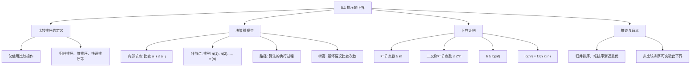

## 相关笔记

- 前置笔记：[[算法导论/concepts/大O记号]]、[[算法导论/concepts/大Omega记号]]、[[算法导论/concepts/排序问题]]
- 关联概念：[[算法导论/concepts/归并排序]]、[[算法导论/concepts/插入排序]]、[[6.4 堆排序算法]]
- 后续笔记：[[8.2 计数排序]]
- 章节汇总：[[第08章_线性时间排序-章节汇总]]

> [!abstract] 概览
> 本节通过==决策树模型==（decision-tree model）严格证明了一个 fundamental 的结论：任何==比较排序==算法在最坏情况下至少需要 ==$\Omega(n \lg n)$== 次比较。这意味着[[算法导论/concepts/归并排序]]和[[6.4 堆排序算法]]是==渐近最优==的比较排序算法，不存在渐近更快的比较排序。
>
> **要点列表：**
> - ==比较排序==仅通过元素间的比较操作来确定排序顺序
> - ==决策树==是分析比较排序的抽象模型——每个内部节点代表一次比较，每个叶节点代表一种排列
> - 正确的比较排序其决策树必须覆盖所有 $n!$ 种排列
> - 由此推导出最坏情况下界：$h \geq \lg(n!) = \Omega(n \lg n)$
> - 此下界不适用于==非比较排序==（如计数排序、基数排序、桶排序）

---

知识结构总览



---

核心思想

### 比较排序的定义

> [!def] 比较排序（Comparison Sort）
> **比较排序**是指仅通过元素之间的**比较操作**来获取输入序列 $\langle a_1, a_2, \ldots, a_n \rangle$ 的顺序信息的排序算法。具体来说，给定两个元素 $a_i$ 和 $a_j$，比较排序只能执行以下五种测试之一：
> - $a_i < a_j$
> - $a_i \leq a_j$
> - $a_i = a_j$
> - $a_i \geq a_j$
> - $a_i > a_j$
>
> 比较排序**不能**以其他方式检查元素的值或获取顺序信息。
>
> **常见比较排序：** [[算法导论/concepts/插入排序]]、[[算法导论/concepts/归并排序]]、[[6.4 堆排序算法]]、快速排序等。

**简化假设（不失一般性）：**
- 假设所有输入元素**互不相同**（对互异元素的下界自然适用于可能有重复元素的情况）
- 因此 $a_i = a_j$ 的比较无意义，可假设不发生
- $a_i \leq a_j$、$a_i \geq a_j$、$a_i > a_j$、$a_i < a_j$ 提供相同的相对顺序信息
- 统一假设所有比较的形式为 $a_i \leq a_j$

### 决策树模型

> [!tip] 核心思路
> 决策树模型将比较排序算法抽象为一棵**满二叉树**（full binary tree），使得我们可以用组合论证来分析排序算法的信息论极限：
> 1. 每个内部节点标注一次比较 $i:j$（即比较 $a_i \leq a_j$）
> 2. 每个叶节点标注一种排列 $\langle \pi(1), \pi(2), \ldots, \pi(n) \rangle$
> 3. 算法的执行对应从根到某个叶节点的一条路径
> 4. 树的高度等于最坏情况下的比较次数
>
> 关键洞察：正确的排序算法必须能处理所有可能的输入，因此决策树必须覆盖全部 $n!$ 种排列。

**决策树的详细结构：**

```
            1:2
           /    \
       a₁≤a₂    a₁>a₂
        /          \
      2:3          2:3
      / \          / \
   a₂≤a₃ a₂>a₃ a₂≤a₃ a₂>a₃
    /     \     /     \
  <1,2,3> <1,3,2> <2,1,3> ...
```

- **内部节点**：标注 $i:j$，表示比较 $a_i$ 和 $a_j$
  - 左子树：$a_i \leq a_j$ 时的后续比较
  - 右子树：$a_i > a_j$ 时的后续比较
- **叶节点**：标注排列 $\langle \pi(1), \pi(2), \ldots, \pi(n) \rangle$，表示排序结果为 $a_{\pi(1)} \leq a_{\pi(2)} \leq \cdots \leq a_{\pi(n)}$
- **路径**：从根到叶的路径代表算法的一次完整执行
- **索引含义**：内部节点和叶节点中的索引始终引用数组元素的**初始位置**

**关键性质：**
- 每种排列必须作为决策树的至少一个叶节点出现（否则算法无法处理该输入）
- 每个叶节点必须是从根可达的（对应算法的实际执行路径）
- 决策树是满二叉树：每个节点要么是叶节点，要么恰好有两个子节点

### 最坏情况下界证明

> [!def] 定理 8.1（Theorem 8.1）
> **任何比较排序算法在最坏情况下至少需要 $\Omega(n \lg n)$ 次比较。**

**证明：**

> **【决策树模型（叶节点数下界+二叉树上界+合并推导）】**

由前面的讨论，只需确定一棵"每种排列都作为可达叶节点出现"的决策树的高度。

设有一棵高度为 $h$、具有 $l$ 个可达叶节点的决策树，对应于对 $n$ 个元素的比较排序。

**第一步：叶节点数下界**

> **【排列覆盖论证（n!种排列对应n!个叶节点）】**

由于 $n$ 个输入元素的 $n!$ 种排列中的每一种都必须作为至少一个叶节点出现，因此：

$$n! \leq l$$

**第二步：二叉树叶节点数上界**

> **【二叉树性质（高度h的二叉树至多2^h个叶节点）】**

一棵高度为 $h$ 的二叉树至多有 $2^h$ 个叶节点：

$$l \leq 2^h$$

**第三步：合并两个不等式**

$$n! \leq l \leq 2^h$$

**第四步：取对数**

> **【单调函数性质（lg函数单调递增保持不等式方向）】**

由于 $\lg$ 函数是单调递增的：

$$h \geq \lg(n!)$$

**第五步：渐近分析**

> **【Stirling近似推论（lg(n!)=Omega(n lg n)）】**

由教材公式 (3.28)（Stirling 近似的推论或积分界定理）：

$$\lg(n!) = \Omega(n \lg n)$$

因此：

$$h = \Omega(n \lg n) \quad \blacksquare$$

> [!def] 推论 8.2（Corollary 8.2）
> [[算法导论/concepts/归并排序]]和[[6.4 堆排序算法]]是==渐近最优==的比较排序。
>
> > **【上下界匹配论证（O(n lg n)上界与Omega(n lg n)下界重合得Theta）】**
> >
> > **证明：** 归并排序和堆排序的**最坏情况**运行时间上界为 $O(n \lg n)$，与定理 8.1 的最坏情况下界 $\Omega(n \lg n)$ 匹配。因此它们的最坏情况运行时间为 $\Theta(n \lg n)$，是渐近最优的比较排序。$\blacksquare$

### $\lg(n!) = \Omega(n \lg n)$ 的严格推导

> [!def] 补充证明：$\lg(n!) = \Omega(n \lg n)$
> > **【积分界定理（单调递增函数的积分-求和上下界）】**
> >
> > 不使用 Stirling 近似，直接用积分界定理（教材 A.2 节）证明：
>
> $$\lg(n!) = \sum_{i=1}^{n} \lg i$$
>
> 由于 $\lg x$ 是单调递增函数，利用积分界定理：
>
> $$\int_1^n \lg x \, dx \leq \sum_{i=1}^{n} \lg i \leq \int_1^{n+1} \lg x \, dx$$
>
> 计算积分：
>
> > **【换元积分法（u=ln x, du=dx/x求int lg x dx）】**
>
> $$\int \lg x \, dx = x \lg x - x \ln 2 + C = \frac{x \ln x - x}{\ln 2} + C$$
>
> 因此：
>
> $$\int_1^n \lg x \, dx = n \lg n - n \lg e + \lg e = \Omega(n \lg n)$$
>
> 所以 $\lg(n!) = \Omega(n \lg n)$。类似地可得上界 $\lg(n!) = O(n \lg n)$，综合得 $\lg(n!) = \Theta(n \lg n)$。

---

补充理解与拓展

> [!info] 信息论视角：排序的信息论极限
>
> 决策树模型是==信息论下界==（information-theoretic lower bound）的经典应用。从 Shannon 信息论的角度来看：
>
> - 排序 $n$ 个不同元素需要区分 $n!$ 种可能的排列
> - 每种排列出现的概率为 $1/n!$（假设均匀分布）
> - 排序所需的信息量为 $\lg(n!)$ bits
> - 每次二路比较最多提供 1 bit 信息（将可能性空间减半）
> - 因此至少需要 $\lg(n!) = \Omega(n \lg n)$ 次比较
>
> 这一框架与 Shannon 1948 年开创的信息论中的**决策问题复杂度理论**完全一致。Edinburgh 大学 ADS（Algorithms and Data Structures）课程和 Vassar 学院 CS241 课程均使用此模型作为比较排序下界的标准教学方法。
>
> **关键洞察：** $\Omega(n \lg n)$ 不是某个特定算法的限制，而是**信息本身的限制**——要从 $n!$ 种等可能状态中确定唯一正确的排列，任何仅使用二路比较的算法都不可避免地需要 $\Omega(n \lg n)$ 步。
>
> 来源：Shannon, C. E. (1948). "A Mathematical Theory of Communication"; Edinburgh University INF2B course notes; Vassar College CS241 lecture materials

> [!info] 突破下界：非比较排序如何绕过 $\Omega(n \lg n)$
>
> 定理 8.1 的下界**仅适用于比较排序**。非比较排序利用输入的额外信息突破了此下界：
>
> | 算法 | 时间复杂度 | 利用信息 | 适用条件 |
> |------|-----------|---------|---------|
> | [[8.2 计数排序]] | $\Theta(n + k)$ | 元素为 $[0, k]$ 范围内的整数 | $k = O(n)$ 时为线性 |
> | 基数排序 | $\Theta(d(n + k))$ | 元素可按位分解 | $d$ 位、每位 $k$ 个值 |
> | 桶排序 | 期望 $O(n)$ | 输入均匀分布在 $[0, 1)$ | 均匀分布假设 |
>
> **为什么它们能更快？** 这些算法不再通过"比较两个元素谁大谁小"来获取信息，而是直接利用元素的**实际值**作为索引（计数排序）、按位分解（基数排序）或分桶（桶排序）。它们获取信息的方式从"每次 1 bit"变成了"每次 $\lg k$ bits"甚至更多。
>
> **但非比较排序并非万能：**
> - 计数排序需要 $O(n + k)$ 额外空间，当 $k \gg n$ 时效率反而低于比较排序
> - 基数排序的正确性依赖于计数排序的稳定性
> - 桶排序的期望线性时间依赖于均匀分布假设，最坏情况退化为 $O(n^2)$
> - 非比较排序通常不适用于浮点数、字符串等复杂数据类型的通用排序

---

易混淆点与辨析

> [!warning] 误区：$\Omega(n \lg n)$ 下界适用于所有排序算法
> ❌ **错误理解：** "所有排序算法都至少需要 $\Omega(n \lg n)$ 时间，不可能更快"
>
> ✅ **正确理解：** $\Omega(n \lg n)$ 下界**仅适用于比较排序**——即仅通过元素间比较来确定顺序的排序算法。[[8.2 计数排序]]（$\Theta(n + k)$）、基数排序（$\Theta(d(n + k))$）、桶排序（期望 $O(n)$）等非比较排序可以突破此下界，因为它们利用了元素的**实际值**来直接确定位置，而非仅依赖比较。
>
> **类比：** 比较排序就像蒙着眼睛用天平称重来给物品排序——每次只能比较两个物品的重量。非比较排序就像摘下眼罩，直接读取物品上的重量标签——信息获取效率完全不同。

> [!warning] 误区：决策树的高度等于平均比较次数
> ❌ **错误理解：** "决策树的高度就是排序算法的平均比较次数"
>
> ✅ **正确理解：** 决策树的**高度**（从根到最远叶节点的路径长度）等于排序算法的==最坏情况==比较次数。决策树的**平均叶节点深度**（从根到所有叶节点路径长度的加权平均）才对应平均比较次数。
>
> **举例：** 对 $n = 3$ 个元素，决策树至少有 $3! = 6$ 个叶节点。一棵高度为 3 的决策树的最坏情况比较次数为 3，但平均比较次数可能小于 3（取决于叶节点的分布）。
>
> 定理 8.1 证明的是**最坏情况下界**——即使是最优的比较排序，也存在某些输入需要 $\Omega(n \lg n)$ 次比较。这并不排除算法在大多数输入上运行更快。

---

习题精选

| 题号 | 题目描述 | 难度 |
|:---:|----------|:---:|
| 8.1-1 | 比较排序的决策树中，叶节点的最小可能深度是多少？ | ⭐ |
| 8.1-2 | 不使用 Stirling 近似，用 A.2 节的方法求 $\lg(n!)$ 的渐近紧界 | ⭐⭐ |
| 8.1-3 | 证明不存在对至少一半的 $n!$ 输入运行时间为线性的比较排序。对 $1/n$ 和 $1/2^n$ 的输入比例呢？ | ⭐⭐⭐ |
| 8.1-4 | 已知输入部分有序（$i \bmod 4 = 0$ 的元素最多偏离正确位置一位），证明 $\Omega(n \lg n)$ 下界仍然成立 | ⭐⭐⭐ |

> [!faq]- 8.1-1 解答
> **目标：** 求比较排序决策树中叶节点的最小可能深度。
>
> **分析：**
>
> 决策树中叶节点的最小深度对应于**最好情况**下的比较次数。
>
> - 对于 $n = 1$：无需比较，最小深度为 0
> - 对于 $n = 2$：至少需要 1 次比较，最小深度为 1
> - 对于 $n \geq 2$：即使输入已经有序，算法也需要至少 $\lceil \lg n! \rceil$ 次比较才能**确认**它是有序的
>
> 但这里问的是单个叶节点的最小深度，不是所有叶节点的最小深度。
>
> **答案：** 最小可能深度为 $\lceil \lg n! \rceil$。这是因为决策树有 $n!$ 个叶节点，一棵二叉树要容纳 $n!$ 个叶节点，其高度至少为 $\lceil \lg n! \rceil$。但某些叶节点可以在较浅的深度——最小深度可以低至 $\lceil \lg n! \rceil - (\text{树的最大深度} - \lceil \lg n! \rceil)$，具体取决于决策树的形状。
>
> 更精确地说，最小深度至少为 $\lfloor \lg n! \rfloor$（因为深度为 $d$ 的二叉树至多有 $2^d$ 个叶节点，而我们需要 $n!$ 个叶节点，所以最浅的叶节点深度至少为 $\lceil \lg n! \rceil$）。
>
> **结论：** 叶节点的最小可能深度为 $\lceil \lg n! \rceil$。

> [!faq]- 8.1-2 解答
> **目标：** 不使用 Stirling 近似，求 $\lg(n!)$ 的渐近紧界。
>
> **证明：**
>
> > **【积分界定理（单调递增函数f(x)的求和-积分夹逼）】**
>
> 由积分界定理（教材 A.2 节定理 A.9），对于单调递增函数 $f(x)$：
>
> $$\int_1^n f(x) \, dx \leq \sum_{i=1}^{n} f(i) \leq \int_1^{n+1} f(x) \, dx$$
>
> 取 $f(x) = \lg x$：
>
> $$\int_1^n \lg x \, dx \leq \lg(n!) = \sum_{i=1}^{n} \lg i \leq \int_1^{n+1} \lg x \, dx$$
>
> 计算积分（换元 $u = \ln x$，$du = dx/x$）：
>
> > **【分部积分法（int lg x dx = x lg x - x/ln 2 + C）】**
>
> $$\int \lg x \, dx = \int \frac{\ln x}{\ln 2} \, dx = \frac{1}{\ln 2}(x \ln x - x) + C = x \lg x - \frac{x}{\ln 2} + C$$
>
> **下界：**
>
> $$\int_1^n \lg x \, dx = n \lg n - \frac{n}{\ln 2} + \frac{1}{\ln 2} = n \lg n - n \lg e + \lg e$$
>
> **上界：**
>
> $$\int_1^{n+1} \lg x \, dx = (n+1) \lg(n+1) - \frac{n+1}{\ln 2} + \frac{1}{\ln 2}$$
>
> 因此：
>
> > **【渐近紧界（上下界均为Theta(n lg n)）】**
>
> $$n \lg n - n \lg e + \lg e \leq \lg(n!) \leq (n+1) \lg(n+1) - (n+1) \lg e + \lg e$$
>
> 上下界均为 $\Theta(n \lg n)$，因此：
>
> $$\lg(n!) = \Theta(n \lg n) \quad \blacksquare$$

> [!faq]- 8.1-3 解答
> **目标：** 证明不存在对至少一半输入运行时间为线性的比较排序。
>
> **证明：**
>
> > **【反证法（线性深度决策树无法容纳n!/2个叶节点）】**
>
> 设比较排序算法 $A$ 的决策树高度为 $h$，叶节点数为 $l$。
>
> **情况一：对至少一半的 $n!$ 输入运行时间为线性**
>
> > **【叶节点计数矛盾（2^(cn) < n!/2当n充分大）】**
>
> 即至少 $n!/2$ 个叶节点的深度 $\leq cn$（对某个常数 $c$）。
>
> 深度不超过 $cn$ 的叶节点数最多为 $2^{cn}$。因此：
>
> $$\frac{n!}{2} \leq 2^{cn}$$
>
> 即 $n! \leq 2^{cn+1}$，取对数得 $\lg(n!) \leq cn + 1$。
>
> 但 $\lg(n!) = \Theta(n \lg n)$，当 $n$ 足够大时 $n \lg n > cn + 1$，矛盾。
>
> **情况二：对 $1/n$ 的输入运行时间为线性**
>
> > **【阶乘增长超越指数（(n-1)! > 2^(cn)当n充分大）】**
>
> 至少 $n!/n = (n-1)!$ 个叶节点深度 $\leq cn$。
>
> $(n-1)! \leq 2^{cn}$，取对数得 $\lg((n-1)!) \leq cn$。
>
> $\lg((n-1)!) = \Theta(n \lg n)$，当 $n$ 足够大时仍产生矛盾。
>
> **情况三：对 $1/2^n$ 的输入运行时间为线性**
>
> > **【推广矛盾（任意固定比例alpha的n!个叶节点均超出线性深度容量）】**
>
> 至少 $n!/2^n$ 个叶节点深度 $\leq cn$。
>
> $n!/2^n \leq 2^{cn}$，即 $n! \leq 2^{(c+1)n}$。
>
> $\lg(n!) = \Theta(n \lg n) > (c+1)n$（当 $n$ 足够大），矛盾。
>
> **结论：** 对于任何固定比例 $\alpha > 0$（包括 $1/2^n$），当 $n$ 足够大时，不存在比较排序能对 $\alpha \cdot n!$ 个输入在线性时间内完成排序。这是因为线性深度的决策树无法容纳足够多的叶节点。

---

视频学习指南

| 资源 | 主题 | 链接 | 说明 |
|:-----|:-----|:-----|:-----|
| MIT 6.006 Lecture 7 | Counting Sort, Radix Sort, Lower Bounds for Sorting | https://www.youtube.com/watch?v=0VqawBtG0Zg | Erik Demaine 讲授，从比较模型推导下界，再到计数排序和基数排序，一气呵成 |
| Abdul Bari | Decision Tree for Comparison Based Sorting | https://www.youtube.com/watch?v=4VEmnD5VKqI | 用具体例子展示决策树结构，直观易懂 |
| WilliamFiset | Sorting Lower Bounds | https://www.youtube.com/watch?v=ta3dGZGJUYM | 从信息论角度解释为什么比较排序需要 $\Omega(n \lg n)$ |
| ravindrababuravula | Comparison Sorting Lower Bound Proof | https://www.youtube.com/watch?v=ONShiVJnF2o | 完整的数学证明过程，逐步推导 |
| GeeksforGeeks | Why Comparison Based Sorting Requires Ω(n log n) | https://www.youtube.com/watch?v=uvF1VnPaG5s | 简洁清晰的证明讲解，适合快速复习 |

---

教材原文

> [!quote] CLRS 第4版 8.1节原文
> A comparison sort uses only comparisons between elements to gain order information about an input sequence $\langle a_1, a_2, \ldots, a_n \rangle$. That is, given two elements $a_i$ and $a_j$, it performs one of the tests $a_i < a_j$, $a_i \leq a_j$, $a_i = a_j$, $a_i \geq a_j$, or $a_i > a_j$ to determine their relative order. It may not inspect the values of the elements or gain order information about them in any other way.
>
> Theorem 8.1: Any comparison sort algorithm requires $\Omega(n \lg n)$ comparisons in the worst case.
>
> Proof: From the preceding discussion, it suffices to determine the height of a decision tree in which each permutation appears as a reachable leaf. Consider a decision tree of height $h$ with $l$ reachable leaves corresponding to a comparison sort on $n$ elements. Because each of the $n!$ permutations of the input appears as one or more leaves, we have $n! \leq l$. Since a binary tree of height $h$ has no more than $2^h$ leaves, we have $n! \leq l \leq 2^h$, which, by taking logarithms, implies $h \geq \lg(n!) = \Omega(n \lg n)$.

---

## 参见Wiki

- [[算法导论/concepts/比较排序]] — 基于比较的排序算法下界
- [[算法导论/theorems/排序下界定理]]

#学习/算法导论/第08章-线性时间排序 #学习/算法导论/排序/比较排序下界
