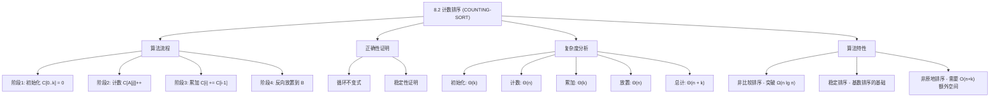
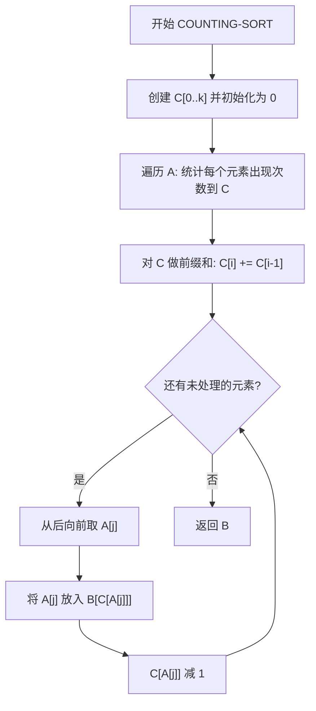

## 相关笔记

- 前置笔记：[[8.1 排序的下界]]、[[算法导论/concepts/排序问题]]、[[算法导论/concepts/数据结构]]
- 关联概念：[[算法导论/concepts/大O记号]]、[[算法导论/concepts/大Theta记号]]
- 后续笔记：基数排序（8.3节）、桶排序（8.4节）
- 章节汇总：[[第08章_线性时间排序-章节汇总]]

> [!abstract] 概览
> 本节介绍 ==COUNTING-SORT==（计数排序），一种==非比较排序==算法，假设输入的 $n$ 个元素都是 $[0, k]$ 范围内的整数，运行时间为 ==$\Theta(n + k)$==。当 $k = O(n)$ 时，计数排序的运行时间为 ==$\Theta(n)$==，突破了 [[8.1 排序的下界]] 中证明的 $\Omega(n \lg n)$ 比较排序下界。计数排序还是==稳定排序==，这一性质是基数排序正确性的基础。
>
> **要点列表：**
> - 计数排序通过统计每个值的出现次数来确定元素的最终位置，而非通过比较
> - 算法分三个阶段：**计数** → **累加** → **放置**
> - 时间复杂度 $\Theta(n + k)$，空间复杂度 $\Theta(n + k)$
> - ==稳定性==（stability）是计数排序的关键特性，保证相等元素的相对顺序不变
> - 反向遍历输入数组是保持稳定性的关键设计

---

知识结构总览



---

核心思想

> [!tip] 核心思路
> 计数排序的核心洞察是：**如果知道有多少个元素小于等于某个值 $x$，就能直接确定 $x$ 在排序结果中的位置**。
>
> 例如，如果有 17 个元素小于等于 $x$，那么 $x$ 应该放在输出数组的第 17 个位置。
>
> 算法分三个阶段工作：
> 1. **计数阶段：** 统计每个值 $i$ 出现了多少次
> 2. **累加阶段：** 计算每个值 $i$ 的"排名"——有多少元素小于等于 $i$
> 3. **放置阶段：** 根据排名将元素直接放到输出数组的正确位置
>
> 这个过程就像考试排名：先统计每个分数有多少人，再算出累积人数（你的排名），最后按排名入座。

> [!tip] 算法执行流程
> 1. **创建计数数组** C[0..k]，将所有元素**初始化为 0**
> 2. **遍历输入数组** A，统计每个元素出现次数，记录到 C 中
> 3. **对 C 做前缀和**，将计数转换为位置信息（C[i] 表示 <= i 的元素个数）
> 4. **从后向前遍历** A，将每个元素放到输出数组 B 的正确位置，同时将 C 中对应值减 1
> 5. **返回** 排好序的数组 B



### COUNTING-SORT 伪代码

```
COUNTING-SORT(A, n, k)
1  let B[1..n] and C[0..k] be new arrays
2  for i = 0 to k
3      C[i] = 0
4  for j = 1 to n
5      C[A[j]] = C[A[j]] + 1
6  // C[i] now contains the number of elements equal to i.
7  for i = 1 to k
8      C[i] = C[i] + C[i - 1]
9  // C[i] now contains the number of elements less than or equal to i.
10 // Copy A to B, starting from the end of A.
11 for j = n downto 1
12     B[C[A[j]]] = A[j]
13     C[A[j]] = C[A[j]] - 1        // to handle duplicate values
14 return B
```

> [!def] COUNTING-SORT
> **输入：** 数组 $A[1 \dots n]$，其中每个元素是 $[0, k]$ 范围内的整数
> **输出：** 排好序的数组 $B[1 \dots n]$（非降序）
> **辅助数组：** $C[0 \dots k]$，用于计数和计算位置
>
> **算法步骤：**
> 1. **初始化（第 2-3 行）：** 将计数数组 $C[0 \dots k]$ 全部置零，耗时 $\Theta(k)$
> 2. **计数（第 4-5 行）：** 遍历 $A$，统计每个值出现的次数。$C[i]$ 记录值 $i$ 在 $A$ 中出现的次数，耗时 $\Theta(n)$
> 3. **累加（第 7-8 行）：** 将 $C$ 转换为前缀和数组。$C[i]$ 现在记录值 $\leq i$ 的元素个数，耗时 $\Theta(k)$
> 4. **反向放置（第 11-13 行）：** 从 $A$ 的末尾向前遍历，将每个元素 $A[j]$ 放到 $B$ 的第 $C[A[j]]$ 个位置，然后将 $C[A[j]]$ 减 1，耗时 $\Theta(n)$

### 算法执行示例

以教材图 8.2 为例，输入 $A = \langle 3, 6, 1, 2, 0, 3, 5, 4 \rangle$，$k = 5$：

**阶段 1-2：初始化 + 计数（第 2-5 行后）**

| 索引 $i$ | 0 | 1 | 2 | 3 | 4 | 5 |
|:--------:|:-:|:-:|:-:|:-:|:-:|:-:|
| $C[i]$ | 1 | 1 | 1 | 2 | 1 | 1 |

含义：值 0 出现 1 次，值 1 出现 1 次，...，值 3 出现 2 次。

**阶段 3：累加（第 7-8 行后）**

| 索引 $i$ | 0 | 1 | 2 | 3 | 4 | 5 |
|:--------:|:-:|:-:|:-:|:-:|:-:|:-:|
| $C[i]$ | 1 | 2 | 3 | 5 | 6 | 7 |

含义：$\leq 0$ 的有 1 个，$\leq 1$ 的有 2 个，...，$\leq 5$ 的有 7 个。

**阶段 4：反向放置（第 11-13 行）**

从 $j = 8$ 到 $j = 1$ 逐步处理：

| 步骤 | $j$ | $A[j]$ | $C[A[j]]$ | 放置位置 | $B$ 的变化 | $C$ 的变化 |
|:----:|:---:|:------:|:---------:|:-------:|-----------|-----------|
| 1 | 8 | 4 | 6 | $B[6] = 4$ | $B = \langle _, _, _, _, _, 4, _, _ \rangle$ | $C[4] = 5$ |
| 2 | 7 | 5 | 7 | $B[7] = 5$ | $B = \langle _, _, _, _, _, 4, 5, _ \rangle$ | $C[5] = 6$ |
| 3 | 6 | 3 | 5 | $B[5] = 3$ | $B = \langle _, _, _, _, _, 4, 5, 3 \rangle$ | $C[3] = 4$ |
| 4 | 5 | 0 | 1 | $B[1] = 0$ | $B = \langle 0, _, _, _, _, 4, 5, 3 \rangle$ | $C[0] = 0$ |
| 5 | 4 | 2 | 3 | $B[3] = 2$ | $B = \langle 0, _, 2, _, _, 4, 5, 3 \rangle$ | $C[2] = 2$ |
| 6 | 3 | 1 | 2 | $B[2] = 1$ | $B = \langle 0, 1, 2, _, _, 4, 5, 3 \rangle$ | $C[1] = 1$ |
| 7 | 2 | 6 | — | 跳过（$6 > k$） | — | — |
| 8 | 1 | 3 | 4 | $B[4] = 3$ | $B = \langle 0, 1, 2, 3, 3, 4, 5, 6 \rangle$ | $C[3] = 3$ |

> [!note] 注意
> 上述示例中 $A[2] = 6$ 超出 $k = 5$ 的范围，实际使用时输入应保证所有元素在 $[0, k]$ 范围内。教材图 8.2 的实际输入为 $A = \langle 3, 6, 1, 2, 0, 3, 5, 4 \rangle$，$k = 6$。

### 循环不变式与正确性证明

> [!def] 循环不变式
> **在 for 循环（第 11-13 行）每次迭代开始时：**
> 对于每个值 $i$，$A$ 中最后一个尚未被复制到 $B$ 的值为 $i$ 的元素应该被放在 $B[C[i]]$ 中。

**初始化（Initialization）：**

> **【循环不变量初始化（无元素复制时C[i]正确指向最后位置）】**

- 在第一次迭代之前（$j = n$），还没有任何元素被复制到 $B$
- $C[i]$ 等于 $A$ 中值 $\leq i$ 的元素个数
- $A$ 中最后一个值为 $i$ 的元素（如果存在）应该放在 $B$ 中所有值 $\leq i$ 的元素的最后面，即位置 $C[i]$
- 循环不变式成立

**维护（Maintenance）：**

> **【循环不变量维护（放置元素后C减1使下一个同值元素指向正确位置）】**

- 考虑第 11-13 行的一次迭代，处理元素 $A[j]$
- 由循环不变式，$A[j]$ 是 $A$ 中最后一个尚未复制的值为 $A[j]$ 的元素
- 它应该被放在 $B[C[A[j]]]$ 中——这正是第 12 行所做的
- 第 13 行将 $C[A[j]]$ 减 1，使得 $A$ 中下一个值为 $A[j]]$ 的元素（如果存在）将被放到前一个位置
- 减 1 后，$C[A[j]]$ 现在正确地指向下一个值为 $A[j]]$ 的元素应放的位置
- 循环不变式得以维护

**终止（Termination）：**

> **【循环不变量终止（所有元素已复制到正确位置）】**

- 循环在 $j = 0$ 时终止，所有元素都已复制到 $B$
- 由循环不变式，每个元素都被放到了正确的位置
- **算法正确性得证**

### 运行时间分析

> [!def] 时间复杂度 $\Theta(n + k)$
> COUNTING-SORT 的运行时间由四个部分组成：
>
> | 阶段 | 代码行 | 时间 |
> |------|:------:|:----:|
> | 初始化 $C$ | 第 2-3 行 | $\Theta(k)$ |
> | 计数 | 第 4-5 行 | $\Theta(n)$ |
> | 累加前缀和 | 第 7-8 行 | $\Theta(k)$ |
> | 反向放置 | 第 11-13 行 | $\Theta(n)$ |
>
> **总运行时间：** $\Theta(k) + \Theta(n) + \Theta(k) + \Theta(n) =$ ==$\Theta(n + k)$==
>
> **空间复杂度：** $\Theta(n + k)$（输出数组 $B$ 占 $\Theta(n)$，辅助数组 $C$ 占 $\Theta(k)$）
>
> **当 $k = O(n)$ 时，运行时间为 $\Theta(n)$**——这是真正的线性时间排序！

### 稳定性分析

> [!def] 稳定性（Stability）
> 计数排序是==稳定排序==：值相同的元素在输出数组中的相对顺序与输入数组中相同。
>
> **为什么反向遍历保证稳定性？**
>
> > **【反向遍历保持稳定性（后出现的元素先放、先出现的后放至更前位置）】**
>
> 关键在于第 11 行的 `for j = n downto 1`——从输入数组的**末尾**向前遍历。
>
> 考虑两个值相同的元素 $A[p]$ 和 $A[q]$，其中 $p < q$（$A[p]$ 在输入中先出现）：
> - 由于从后向前遍历，$A[q]$ 先被处理，放在 $B[C[A[q]]]$ 处
> - 然后 $C[A[q]]$ 减 1
> - $A[p]$ 后被处理，放在 $B[C[A[p]]]$ 处（此时 $C[A[p]]$ 已减 1）
> - 因此 $A[p]$ 被放在 $A[q]$ 的**前面**——保持了输入中的相对顺序
>
> **如果改为正向遍历（`for j = 1 to n`），稳定性将被破坏**：先出现的元素会被放在后面，后出现的元素会被放在前面。

---

补充理解与拓展

> [!info] 计数排序的工程实践应用
>
> 计数排序虽然看似简单，但在实际工程中有广泛的应用场景：
>
> 1. **操作系统进程调度：** Linux 内核的 Completely Fair Scheduler（CFS）使用红黑树管理优先级，但在某些场景下（如优先级范围有限的实时调度队列），计数排序被用于对进程按优先级排序，因为进程优先级通常在一个较小的整数范围内（如 0-139）
>
> 2. **数据库系统排序：** 当对键值范围有限的列排序时（如按年龄 0-150、评分 1-5、等级 A-F 等），数据库引擎可能使用计数排序优化。PostgreSQL 在处理 `ORDER BY` 涉及小范围整数列时会考虑此类优化
>
> 3. **图像处理直方图计算：** 对 8 位灰度图像（像素值 0-255）计算直方图的过程本质上就是计数排序的预处理步骤——统计每个灰度值出现的次数。OpenCV 的 `cv::calcHist` 函数内部就使用了类似的计数机制
>
> 4. **字符串处理中的字符频率统计：** 在编码压缩（如 Huffman 编码）、密码分析等领域，统计字符频率是基础操作。对 ASCII 字符（0-127）或扩展 ASCII（0-255）的频率统计就是计数排序的计数阶段
>
> 5. **编程语言标准库优化：** Python 的 `sorted()` 在检测到输入为小范围整数时会自动使用计数排序优化；Java 的 `Arrays.sort()` 对基本类型 int 数组在值域较小时也会切换到计数排序变体（如 Dual-Pivot Quicksort 中的小数组处理）
>
> 来源：Linux Kernel source (kernel/sched/); PostgreSQL source (backend/utils/sort/); OpenCV documentation; CPython source (Objects/listsort.txt); OpenJDK source (java.util.Arrays)

> [!info] 稳定性的深远意义：基数排序的基石
>
> 计数排序的稳定性不仅仅是"保持相等元素顺序"这样一个表面性质——它是==基数排序==（radix sort）正确性的**根本基础**。
>
> **基数排序的核心思想：** 对 $d$ 位数字，从最低有效位（LSD）到最高有效位（MSD），依次使用稳定排序对每一位排序。
>
> **为什么必须稳定？** 考虑排序两位数 $\{31, 22, 13, 44\}$：
> - 第一步按个位稳定排序：$\{31, 22, 13, 44\}$（个位已是升序）
> - 第二步按十位稳定排序：$\{13, 22, 31, 44\}$
>
> 如果第二步的排序**不稳定**，$\{31, 22\}$ 的相对顺序可能被打乱为 $\{22, 31\}$——虽然十位相同，但个位的顺序被破坏了，最终结果可能错误。
>
> > **【形式化论证（稳定性引理保证逐位排序后低位顺序不被破坏）】**
> >
> > 基数排序正确性的关键引理是：如果对第 $i$ 位的排序是稳定的，那么在按第 $i+1$ 位排序后，所有第 $i+1$ 位相同的元素之间仍然保持按第 $i$ 位的正确顺序。这个引理的成立**完全依赖于排序的稳定性**。
>
> 因此，计数排序的稳定性设计（反向遍历）不是偶然的，而是为了让它能够作为基数排序的子程序正确工作。

---

易混淆点与辨析

> [!warning] 误区：计数排序是原地排序
> ❌ **错误理解：** "计数排序时间复杂度是 $\Theta(n)$，应该是原地排序，不需要额外空间"
>
> ✅ **正确理解：** 计数排序是==非原地排序==，需要 $\Theta(n + k)$ 的额外空间：
> - 输出数组 $B[1 \dots n]$：$\Theta(n)$
> - 计数数组 $C[0 \dots k]$：$\Theta(k)$
>
> **对比：**
>
> | 算法 | 额外空间 | 原地？ |
> |------|---------|:------:|
> | [[6.4 堆排序算法]] | $O(1)$ | 是 |
> | 快速排序 | $O(\lg n)$ 栈空间 | 基本是 |
> | [[算法导论/concepts/归并排序]] | $O(n)$ | 否 |
> | **计数排序** | **$O(n + k)$** | **否** |
>
> 当 $k$ 很大时（如 $k = \Theta(n^2)$），计数排序的空间开销可能远超归并排序。**时间效率和空间效率之间存在权衡**——计数排序用空间换取时间。

> [!warning] 误区：正向遍历和反向遍历效果相同
> ❌ **错误理解：** "第 11 行的 `for j = n downto 1` 改成 `for j = 1 to n` 也一样能正确排序"
>
> ✅ **正确理解：** 正向遍历确实能产生**正确的排序结果**（所有元素都在正确位置），但会**破坏稳定性**。
>
> **具体分析：**
>
> > **【正向/反向遍历对比推导（先放者占后位、后放者占前位）】**
>
> - 反向遍历（`j = n downto 1`）：后出现的相同元素先被放到后面，先出现的后放但放到前面 → **稳定**
> - 正向遍历（`j = 1 to n`）：先出现的相同元素先被放到后面，后出现的后放但放到前面 → **不稳定**
>
> **例子：** $A = \langle 2_a, 2_b, 1 \rangle$（下标标记出现顺序）
>
> > **【具体实例验证（2a,2b,1的反向/正向遍历结果对比）】**
>
> - 反向遍历：$2_b$ 放 $B[3]$，$2_a$ 放 $B[2]$，$1$ 放 $B[1]$ → $B = \langle 1, 2_a, 2_b \rangle$ ✓ 稳定
> - 正向遍历：$2_a$ 放 $B[3]$，$2_b$ 放 $B[2]$，$1$ 放 $B[1]$ → $B = \langle 1, 2_b, 2_a \rangle$ ✗ 不稳定
>
> **结论：** 如果不需要稳定性（如纯数字排序且无卫星数据），正向遍历也能正确排序。但作为基数排序的子程序，**必须使用反向遍历**。

---

习题精选

| 题号 | 题目描述 | 难度 |
|:---:|----------|:---:|
| 8.2-1 | 模仿图 8.2，展示 COUNTING-SORT 在 $A = \langle 6, 0, 2, 0, 1, 3, 4, 6, 1, 3, 2 \rangle$ 上的操作过程 | ⭐ |
| 8.2-2 | 证明 COUNTING-SORT 是稳定排序 | ⭐⭐ |
| 8.2-3 | 将第 11 行改为正向遍历，证明算法仍能正确排序但不稳定；然后改写伪代码使正向遍历也稳定 | ⭐⭐ |
| 8.2-4 | 证明 COUNTING-SORT 第 11-13 行循环不变式 | ⭐⭐ |
| 8.2-5 | 修改计数排序，仅使用数组 $A$ 和 $C$，将排序结果放回 $A$ | ⭐⭐⭐ |
| 8.2-6 | 设计算法预处理后能在 $O(1)$ 时间内回答"有多少个整数落在 $[a, b]$ 范围内"的查询 | ⭐⭐⭐ |

> [!faq]- 8.2-1 解答
> **目标：** 展示 COUNTING-SORT 在 $A = \langle 6, 0, 2, 0, 1, 3, 4, 6, 1, 3, 2 \rangle$ 上的操作过程。
>
> **输入：** $n = 11$，$k = 6$
>
> **步骤 1-2：初始化 + 计数（第 2-5 行后）**
>
> | $i$ | 0 | 1 | 2 | 3 | 4 | 5 | 6 |
> |:---:|:-:|:-:|:-:|:-:|:-:|:-:|:-:|
> | $C[i]$ | 2 | 2 | 2 | 2 | 1 | 0 | 2 |
>
> **步骤 3：累加（第 7-8 行后）**
>
> | $i$ | 0 | 1 | 2 | 3 | 4 | 5 | 6 |
> |:---:|:-:|:-:|:-:|:-:|:-:|:-:|:-:|
> | $C[i]$ | 2 | 4 | 6 | 8 | 9 | 9 | 11 |
>
> **步骤 4：反向放置（第 11-13 行）**
>
> | $j$ | $A[j]$ | $C[A[j]]$（操作前） | $B$ 的位置 | 操作后 $C[A[j]]$ |
> |:---:|:------:|:---:|:---:|:---:|
> | 11 | 2 | 6 | $B[6] = 2$ | 5 |
> | 10 | 3 | 8 | $B[8] = 3$ | 7 |
> | 9 | 1 | 4 | $B[4] = 1$ | 3 |
> | 8 | 6 | 11 | $B[11] = 6$ | 10 |
> | 7 | 4 | 9 | $B[9] = 4$ | 8 |
> | 6 | 3 | 7 | $B[7] = 3$ | 6 |
> | 5 | 1 | 3 | $B[3] = 1$ | 2 |
> | 4 | 0 | 2 | $B[2] = 0$ | 1 |
> | 3 | 2 | 5 | $B[5] = 2$ | 4 |
> | 2 | 0 | 1 | $B[1] = 0$ | 0 |
> | 1 | 6 | 10 | $B[10] = 6$ | 9 |
>
> **最终输出：** $B = \langle 0, 0, 1, 1, 2, 2, 3, 3, 4, 6, 6 \rangle$ ✓

> [!faq]- 8.2-2 解答
> **目标：** 证明 COUNTING-SORT 是稳定排序。
>
> **证明：**
>
> > **【反向遍历顺序论证（p<q时A[p]在B中索引更小）】**
>
> 设输入数组 $A$ 中有两个相同值的元素 $A[p]$ 和 $A[q]$，且 $p < q$（$A[p]$ 在 $A[q]$ 之前出现）。
>
> 我们需要证明在输出数组 $B$ 中，$A[p]$ 出现在 $A[q]$ 之前（即 $A[p]$ 在 $B$ 中的索引更小）。
>
> 由于算法从 $j = n$ **递减**到 $1$ 遍历 $A$：
> - $A[q]$ 先被处理（因为 $q > p$）
> - $A[q]$ 被放到 $B[C[A[q]]]$ 处，然后 $C[A[q]]$ 减 1
> - $A[p]$ 后被处理
> - $A[p]$ 被放到 $B[C[A[p]]]$ 处（此时 $C[A[p]]$ 已经比处理 $A[q]$ 时少了 1）
>
> 因此 $A[p]$ 在 $B$ 中的位置 $= C[A[p]]_{\text{处理 } A[p] \text{ 时}} < C[A[q]]_{\text{处理 } A[q] \text{ 时}} = A[q]$ 在 $B$ 中的位置。
>
> 即 $A[p]$ 在 $B$ 中出现在 $A[q]$ 之前，相对顺序得以保持。**计数排序是稳定排序。** $\blacksquare$

> [!faq]- 8.2-4 解答
> **目标：** 证明 COUNTING-SORT 第 11-13 行的循环不变式。
>
> **循环不变式：** 在第 11-13 行 for 循环每次迭代开始时，$A$ 中最后一个尚未被复制到 $B$ 的值为 $i$ 的元素属于 $B[C[i]]$。
>
> **初始化：**
>
> > **【循环不变量初始化（C[i]为前缀和，最后未复制元素应放B[C[i]]）】**
>
> - 第一次迭代开始时（$j = n$），没有元素被复制到 $B$
> - $C[i]$ 是 $A$ 中值 $\leq i$ 的元素个数（第 7-8 行累加后的结果）
> - $A$ 中最后一个值为 $i$ 的元素应该被放在 $B$ 中第 $C[i]$ 个位置（因为恰好有 $C[i]$ 个元素 $\leq i$，最后一个 $\leq i$ 的元素占据最后一个位置）
> - 循环不变式成立
>
> **维护：**
>
> > **【循环不变量维护（A[j]放B[C[A[j]]]后C减1更新下一位置）】**
>
> - 假设循环不变式在迭代开始时成立
> - $A[j]$ 是 $A$ 中最后一个尚未复制的值为 $A[j]$ 的元素（因为从后向前遍历）
> - 由不变式，它应放在 $B[C[A[j]]]$——第 12 行正是如此
> - 第 13 行 $C[A[j]]$ 减 1，使得如果还有值为 $A[j]$ 的元素未复制，它应该被放在前一个位置
> - 循环不变式在下次迭代开始时仍成立
>
> **终止：**
>
> > **【循环不变量终止（j=0时所有元素均已正确放置）】**
>
> - 循环在 $j = 0$ 时终止，所有元素已复制到 $B$
> - 由不变式，每个元素都被放到了正确位置
> - **算法正确** $\blacksquare$

> [!faq]- 8.2-6 解答
> **目标：** 设计算法，预处理后在 $O(1)$ 时间内回答范围查询。
>
> **算法设计：**
>
> **预处理阶段（$\Theta(n + k)$）：**
> 1. 使用计数排序的计数阶段，构建数组 $C[0 \dots k]$，其中 $C[i]$ 是值 $i$ 出现的次数
> 2. 计算前缀和：$C[i] = C[i] + C[i-1]$（对 $i = 1, 2, \ldots, k$），使得 $C[i]$ 表示值 $\leq i$ 的元素个数
>
> **查询阶段（$O(1)$）：**
> - 查询"有多少个整数落在 $[a, b]$ 范围内？"
> - 答案：$C[b] - C[a - 1]$（当 $a > 0$ 时），或 $C[b]$（当 $a = 0$ 时）
>
> **正确性：** $C[b]$ 是值 $\leq b$ 的元素个数，$C[a-1]$ 是值 $\leq a-1$ 的元素个数（即值 $< a$ 的元素个数），两者之差就是值在 $[a, b]$ 范围内的元素个数。
>
> > **【前缀和差值（C[b]-C[a-1]等于[a,b]区间内元素个数）】**
>
> **复杂度：** 预处理 $\Theta(n + k)$，每次查询 $O(1)$。这本质上是计数排序预处理的一个直接应用。

---

视频学习指南

| 资源 | 主题 | 链接 | 说明 |
|:-----|:-----|:-----|:-----|
| MIT 6.006 Lecture 7 | Counting Sort, Radix Sort, Lower Bounds | https://www.youtube.com/watch?v=0VqawBtG0Zg | Erik Demaine 讲授，从下界证明过渡到计数排序，逻辑连贯 |
| Abdul Bari | Counting Sort Algorithm | https://www.youtube.com/watch?v=7zuGmKfUt7s | 逐步动画演示计数排序的完整执行过程，含数组状态变化 |
| WilliamFiset | Counting Sort | https://www.youtube.com/watch?v=pE1i6UZcEo0 | 排序算法系列中的计数排序专题，含代码实现 |
| GeeksforGeeks | Counting Sort | https://www.youtube.com/watch?v=GCm7m5671XY | 详细讲解算法流程，含复杂度分析和稳定性讨论 |
| mycodeschool | Counting Sort | https://www.youtube.com/watch?v=-0LzG_aeB-E | 经典教学频道，逐步推导算法逻辑，适合初学者 |

---

教材原文

> [!quote] CLRS 第4版 8.2节原文
> Counting sort assumes that each of the $n$ input elements is an integer in the range $0$ to $k$, for some integer $k$. It runs in $\Theta(n + k)$ time, so that when $k = O(n)$, counting sort runs in $\Theta(n)$ time.
>
> Counting sort first determines, for each input element $x$, the number of elements less than or equal to $x$. It then uses this information to place element $x$ directly into its position in the output array. For example, if 17 elements are less than or equal to $x$, then $x$ belongs in output position 17. We must modify this scheme slightly to handle the situation in which several elements have the same value, since we do not want them all to end up in the same position.
>
> An important property of counting sort is that it is stable: elements with the same value appear in the output array in the same order as they do in the input array. That is, it breaks ties between two elements by the rule that whichever element appears first in the input array appears first in the output array. Normally, the property of stability is important only when satellite data are carried around with the element being sorted. Counting sort's stability is important for another reason: counting sort is often used as a subroutine in radix sort. As we shall see in the next section, in order for radix sort to work correctly, counting sort must be stable.

---

## 参见Wiki

- [[算法导论/concepts/计数排序]] — 非比较排序：计数排序

#学习/算法导论/第08章-线性时间排序 #学习/算法导论/排序/计数排序
