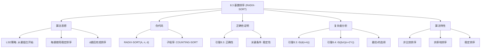
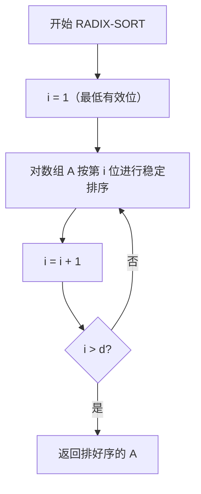

## 相关笔记

- 前置笔记：[[8.2 计数排序]]
- 关联概念：[[算法导论/concepts/排序问题]]、[[算法导论/concepts/插入排序]]、[[算法导论/concepts/归并排序]]
- 章节汇总：[[第08章_线性时间排序-章节汇总]]

> [!abstract] 概览
> 本节介绍 ==基数排序（Radix Sort）== 算法，它是一种==非比较排序==算法，通过对==关键字的每一位==分别进行==稳定排序==来实现整体排序。基数排序的核心策略是==LSD（Least Significant Digit）==——从最低有效位开始，逐位向最高有效位进行排序。经过 $d$ 趟稳定排序后，所有元素即按完整关键字排好序。
>
> **要点列表：**
> - 基数排序使用==稳定排序==（通常为[[8.2 计数排序|计数排序]]）作为子程序，对关键字的每一位分别排序
> - 对 $n$ 个 $d$ 位数，若每位有 $k$ 个可能值，运行时间为 ==$\Theta(d(n+k))$==
> - 对 $n$ 个 $b$ 位二进制数，选择合适的基数 $r$，运行时间为 ==$\Theta\!\left(\dfrac{b}{r}(n + 2^r)\right)$==
> - 当 $b = O(\lg n)$ 时，基数排序可在 ==$\Theta(n)$== 时间内完成排序
> - 基数排序是现存最古老的仍在使用的排序算法，历史可追溯至1890年

---

知识结构总览



---

核心思想

> [!tip] 核心思路
> 基数排序的基本策略是：将每个关键字拆分为若干"位"（digit），然后从==最低有效位（LSD）==开始，对每一位分别进行一次==稳定排序==。经过 $d$ 趟排序后，所有元素即按完整关键字排好序。
>
> **为什么从最低位开始？** 如果从最高位开始（MSD策略），需要对每个桶递归排序，产生大量中间堆，管理复杂。而从最低位开始，每趟排序后只需将所有桶按顺序拼接，无需递归，实现简洁。
>
> **为什么必须稳定？** 稳定性保证：当某一位的值相同时，之前已排好的低位顺序不会被破坏。这是基数排序正确性的基石。

### 直观理解：扑克牌排序

想象你要将一副扑克牌按"花色+点数"排序。基数排序的做法是：
1. 先按==点数==（低位）进行一次稳定排序
2. 再按==花色==（高位）进行一次稳定排序

因为第二次排序是稳定的，所以相同花色的牌中，点数小的仍然在前面——最终结果正确。

> [!tip] 算法执行流程
> 1. 从**最低有效位**（第1位）开始，到最高有效位（第d位）
> 2. 对当前位使用**稳定排序**（如计数排序）对整个数组排序
> 3. **重复 d 轮**，每轮处理一位，最终得到完全排好序的数组



### RADIX-SORT 伪代码

```
RADIX-SORT(A, n, d)
1  for i = 1 to d
2      use a stable sort to sort array A[1..n] on digit i
```

> [!def] RADIX-SORT
> **输入：** 数组 $A[1 \dots n]$，其中每个元素是 $d$ 位数，第1位是最低位，第 $d$ 位是最高位
> **输出：** 将 $A$ 排序为非降序序列
>
> **算法步骤：**
> 1. 从 $i = 1$（最低位）到 $i = d$（最高位），依次对数组 $A$ 按第 $i$ 位进行稳定排序
> 2. 通常使用 [[8.2 计数排序|COUNTING-SORT]] 作为稳定排序子程序
>
> **优化提示：** 如果使用 COUNTING-SORT 作为稳定排序子程序，可以预先分配输出数组，在 RADIX-SORT 的 for 循环中交替使用输入数组和输出数组，减少数据复制开销。

### 操作示例

以7个3位数为例，展示基数排序的执行过程（CLRS图8.3）：

| 趟数 | 排序依据 | 结果 |
|:---:|:---:|:-----|
| 初始 | — | 329, 457, 657, 839, 436, 720, 355 |
| 第1趟 | 个位 | 720, 355, 436, 457, 657, 329, 839 |
| 第2趟 | 十位 | 720, 329, 436, 839, 355, 457, 657 |
| 第3趟 | 百位 | 329, 355, 436, 457, 657, 720, 839 |

**逐位分析：**
- **第1趟（个位）：** 按个位数字 0,5,6,7,7,9,9 排序后得到 720,355,436,457,657,329,839
- **第2趟（十位）：** 在第1趟结果基础上，按十位数字 2,2,3,3,5,5,5 排序。注意 329 和 720 的十位都是2，但 720 排在前面——因为第1趟中 720 排在 329 前面，且第2趟排序是稳定的
- **第3趟（百位）：** 按百位数字 3,3,4,4,6,7,8 排序，得到最终有序结果

---

正确性证明

### 引理 8.3

> [!def] 引理 8.3（基数排序的正确性与时间复杂度）
> 给定 $n$ 个 $d$ 位数，其中每个位可以取 $k$ 个可能的值，如果基数排序使用的稳定排序耗时 $\Theta(n+k)$，则 RADIX-SORT 能在 $\Theta(d(n+k))$ 时间内正确排序这些数。

**证明（正确性——基于归纳法）：**

> **【数学归纳法（基础步i=1+归纳步第i位排序后1到i位有序）】**

对正在被排序的位数 $i$（从1到 $d$）进行归纳。

- **归纳基础（$i = 1$）：** 第1趟按最低位排序后，元素按最低位有序。这是平凡的——一趟稳定排序后自然按该位有序。
- **归纳假设：** 假设第 $i-1$ 趟排序后，元素已按第 $1$ 到第 $i-1$ 位有序（即低位已经排好）。
- **归纳步骤：** 第 $i$ 趟按第 $i$ 位进行稳定排序。需要证明排序后元素按第 $1$ 到第 $i$ 位有序。
  > **【分情况讨论（a_i<b_i/a_i>b_i/a_i=b_i三种情况）】**
  - 考虑任意两个元素 $a$ 和 $b$，它们在第 $1$ 到第 $i$ 位上的值分别为 $(a_1, \dots, a_i)$ 和 $(b_1, \dots, b_i)$。
  - **情况一：** $a_i < b_i$。第 $i$ 趟排序后 $a$ 排在 $b$ 前面。正确。
  - **情况二：** $a_i > b_i$。第 $i$ 趟排序后 $b$ 排在 $a$ 前面。正确。
  - **情况三：** $a_i = b_i$。由于排序是==稳定的==，$a$ 和 $b$ 的相对顺序与第 $i$ 趟排序前相同。由归纳假设，在第 $i$ 趟排序前它们已按第 $1$ 到 $i-1$ 位有序，因此排序后仍保持此顺序。正确。
- **结论：** 由数学归纳法，$d$ 趟排序后元素按全部 $d$ 位有序。$\blacksquare$

> [!warning] 稳定性的关键作用
> 上述证明的**情况三**是关键——当第 $i$ 位的值相同时，必须保持之前已排好的低位顺序不变。这就是为什么基数排序的中间排序**必须是稳定**的。如果使用不稳定的排序（如快速排序），低位排序的结果会被高位排序破坏，最终结果不正确。

**证明（时间复杂度）：**

> **【趟数乘以每趟时间（d趟Theta(n+k)得Theta(d(n+k))）】**

每趟稳定排序耗时 $\Theta(n+k)$（使用计数排序时），共 $d$ 趟，因此总时间为：

$$T(n) = d \cdot \Theta(n+k) = \Theta(d(n+k)) \quad \blacksquare$$

---

复杂度深入分析

### 引理 8.4

> [!def] 引理 8.4（基数排序的位数分解）
> 给定 $n$ 个 $b$ 位二进制数和任意正整数 $r \leq b$，如果基数排序使用的稳定排序对范围 $0$ 到 $k$ 的输入耗时 $\Theta(n+k)$，则 RADIX-SORT 能在 $\Theta\!\left(\dfrac{b}{r}(n + 2^r)\right)$ 时间内正确排序这些数。

**证明：**

> **【位数分解（b位键值视为d=ceil(b/r)个r位数字）】**

将每个 $b$ 位的键值视为 $d = \lceil b/r \rceil$ 个"数字"，每个数字是 $r$ 位的整数，取值范围为 $0$ 到 $2^r - 1$。因此可以使用计数排序，其中 $k = 2^r - 1$。

例如，一个32位整数可以视为4个8位数字：$b = 32, r = 8, k = 2^8 - 1 = 255, d = 32/8 = 4$。

每趟计数排序耗时 $\Theta(n + k) = \Theta(n + 2^r)$，共 $d = \lceil b/r \rceil$ 趟，因此总运行时间为：

> **【总时间计算（ceil(b/r)趟Theta(n+2^r)得Theta((b/r)(n+2^r))）】**

$$T(n) = \lceil b/r \rceil \cdot \Theta(n + 2^r) = \Theta\!\left(\frac{b}{r}(n + 2^r)\right) \quad \blacksquare$$

### 最优基数 $r$ 的选择

给定 $n$ 和 $b$，如何选择 $r \leq b$ 使 $\dfrac{b}{r}(n + 2^r)$ 最小？

**情况一：$b < \lfloor \lg n \rfloor$**

> **【2^r < n时n+2^r=Theta(n)选r=b得线性时间】**

此时 $r \leq b$ 意味着 $2^r \leq 2^b < n$，因此 $n + 2^r = \Theta(n)$。选择 $r = b$，运行时间为：

$$T(n) = \frac{b}{b}(n + 2^b) = \Theta(n)$$

这是渐近最优的。

**情况二：$b \geq \lfloor \lg n \rfloor$**

> **【选r=floor(lg n)使2^r=Theta(n)得最优时间Theta(bn/lg n)】**

选择 $r = \lfloor \lg n \rfloor$，运行时间为：

$$T(n) = \Theta\!\left(\frac{b}{\lg n}(n + n)\right) = \Theta\!\left(\frac{bn}{\lg n}\right)$$

这是最优选择，原因如下：
> **【最优性论证（r增大/减小两种方向均导致时间增大）】**
- 当 $r$ 增大超过 $\lfloor \lg n \rfloor$ 时，$2^r$ 项增长快于分母中的 $r$，运行时间变为 $\Omega(bn/\lg n)$
- 当 $r$ 减小低于 $\lfloor \lg n \rfloor$ 时，$b/r$ 增大而 $n + 2^r$ 仍为 $\Theta(n)$，运行时间也增大

### 基数排序 vs 比较排序

> [!note] 渐近优势 vs 实际表现
> 当 $b = O(\lg n)$（实践中常见）且 $r \approx \lg n$ 时，基数排序的运行时间为 $\Theta(n)$，看起来优于快速排序的期望 $\Theta(n \lg n)$。但需要注意：
> - **常数因子：** 基数排序的每趟可能比快速排序的一次比较-交换操作耗时更长
> - **缓存性能：** 快速排序通常比基数排序更有效地利用硬件缓存
> - **空间开销：** 使用计数排序的基数排序不是原地排序，需要额外 $O(n+k)$ 空间
> - **输入特性：** 当 $b$ 很大时（如64位浮点数），基数排序的优势减弱

---

补充理解与拓展

> [!info] 基数排序的历史——从人口普查到IBM
>
> 基数排序是==现存最古老的仍在使用的排序算法==，其历史甚至早于电子计算机的发明。
>
> **关键历史事件：**
> - **1880年美国人口普查**耗时近8年完成数据处理，由于人口增长迅速，1890年的普查面临无法在宪法规定的10年内完成的危机
> - **1890年**，Herman Hollerith发明了使用基数排序原理的==机电制表机==（tabulating machine），用于处理美国人口普查数据
> - Hollerith的机器在==打孔卡片==的特定列上检测孔位，将卡片分入12个箱子——这正是基数排序的物理实现
> - 使用Hollerith机器后，1890年人口普查仅耗时==2年==就完成了数据处理，相比1880年缩短了6年
> - Hollerith的公司 ==Tabulating Machine Company== 后来经过多次合并，最终成为 ==IBM==（International Business Machines）
>
> 基数排序在计算机博物馆中仍能看到其原始形态——卡片排序机（card sorter），它能在80列的打孔卡上按指定列进行机械分拣。

> [!info] 基数排序的现代变体与工程应用
>
> 基数排序在当代计算机科学中仍有广泛的应用和活跃的研究：
>
> **现代变体：**
> 1. **MSD（Most Significant Digit）基数排序：** 从最高位开始，递归处理每个桶。适合不等长字符串排序，但需要更多额外空间
> 2. **LSD（Least Significant Digit）基数排序：** 从最低位开始，CLRS采用的版本。实现简洁，不需要递归，但要求所有关键字等长
> 3. **American Flag Sort：** McIlroy & Bostic (1993) 提出，结合MSD基数排序和原地分区技术，用于==字符串排序==，减少了额外空间需求
> 4. **GPU并行基数排序：** NVIDIA Thrust库中的 `radix_sort` 是GPU上==最快的排序算法之一==，利用GPU的大规模并行性同时处理多个键值位
>
> **数据库系统中的应用：**
> - PostgreSQL 和 MySQL 在处理 `ORDER BY` 查询时，对==整数类型且值域有限==的情况会使用基数排序优化
> - 数据库中的排序操作通常涉及大量数据，基数排序的线性时间特性在此场景下优势明显
>
> **参考文献：** McIlroy, P. M. & Bostic, K. (1993). "Engineering radix sort." *Computing Systems*, 6(1), 5-27.

---

易混淆点与辨析

> [!warning] 误区：基数排序从最高位开始排序
> ❌ **错误理解：** "基数排序应该先按最高位排序，就像我们比较数字时先看最高位一样"
>
> ✅ **正确理解：** CLRS采用的是==LSD（最低有效位优先）==策略，从最低位开始排序。虽然直觉上从最高位开始更自然（MSD策略），但MSD需要递归处理每个桶，产生大量中间堆，管理复杂。LSD策略只需 $d$ 趟线性扫描，无需递归，实现更简洁。
>
> **MSD vs LSD 对比：**
> | 维度 | MSD | LSD |
> |:-----|:----|:----|
> | 排序方向 | 最高位 → 最低位 | 最低位 → 最高位 |
> | 是否需要递归 | 是，每个桶递归排序 | 否，$d$ 趟线性扫描 |
> | 空间开销 | 较大（递归栈+桶存储） | 较小（仅需两个数组交替） |
> | 适用场景 | 不等长字符串排序 | 等长关键字排序 |
> | CLRS采用 | 否 | **是** |

> [!warning] 误区：基数排序的中间排序不需要稳定
> ❌ **错误理解：** "只要每趟排序正确，最终结果就正确，稳定性无所谓"
>
> ✅ **正确理解：** ==稳定性是基数排序正确性的必要条件==。如果中间排序不稳定，当某一位的值相同时，之前已排好的低位顺序会被打乱，导致最终结果错误。
>
> **反例：** 对两位数 $\{31, 22, 13\}$ 排序
> - 第1趟（个位）稳定排序：$\{31, 22, 13\} \to \{31, 22, 13\}$（个位1,2,3已有序）
> - 第2趟（十位）**不稳定**排序：$\{31, 22, 13\} \to \{13, 22, 31\}$ 或 $\{13, 31, 22\}$（结果不确定！）
> - 第2趟（十位）**稳定**排序：$\{31, 22, 13\} \to \{13, 22, 31\}$（结果唯一且正确）
>
> 在不稳定排序中，十位同为2的22和31的相对顺序可能被打乱，而稳定排序保证了22始终在31前面（因为第1趟中22在31前面）。

---

习题精选

| 题号 | 题目描述 | 难度 |
|:---:|----------|:---:|
| 8.3-1 | 模仿图8.3，展示 RADIX-SORT 对英文单词列表的排序过程 | ⭐ |
| 8.3-2 | 插入排序、归并排序、堆排序、快速排序中哪些是稳定排序？如何使任何比较排序稳定？ | ⭐⭐ |
| 8.3-3 | 用归纳法证明基数排序的正确性，指出证明中哪里需要稳定性假设 | ⭐⭐ |
| 8.3-4 | 若 COUNTING-SORT 作为稳定子程序被调用 $d$ 次，共产生 $2d$ 遍数据扫描，如何减少到 $d+1$ 遍？ | ⭐⭐⭐ |
| 8.3-5 | 展示如何在 $O(n)$ 时间内对范围 $0$ 到 $n^3 - 1$ 的 $n$ 个整数排序 | ⭐⭐ |
| 8.3-6 | MSD基数排序在最坏情况下需要多少趟排序？需要跟踪多少堆卡片？ | ⭐⭐⭐ |

> [!faq]- 8.3-3 解答
> **目标：** 用归纳法证明基数排序的正确性。
>
> **证明：**
>
> > **【数学归纳法（P(i):第i趟后按1到i位有序）】**
>
> 对正在被排序的位数 $i$（$1 \leq i \leq d$）进行归纳。
>
> **归纳假设 $P(i)$：** 第 $i$ 趟排序后，数组 $A$ 中的元素已按第 $1$ 位到第 $i$ 位有序。
>
> **基础（$i = 1$）：** 第1趟按第1位（最低位）进行稳定排序。排序后元素显然按第1位有序。$P(1)$ 成立。
>
> > **【基础步验证（一趟稳定排序后按该位有序是平凡的）】**
>
> **归纳步骤：** 假设 $P(i-1)$ 成立，即第 $i-1$ 趟后元素已按第 $1$ 到 $i-1$ 位有序。证明 $P(i)$ 成立。
>
> > **【分情况讨论（第i位小于/大于/等于三种情况+稳定性关键作用）】**
>
> 第 $i$ 趟按第 $i$ 位进行稳定排序。考虑任意两个元素 $a$ 和 $b$：
> - 若 $a$ 的第 $i$ 位 $< b$ 的第 $i$ 位：排序后 $a$ 在 $b$ 前面。按第 $1$ 到 $i$ 位，$a < b$。正确。
> - 若 $a$ 的第 $i$ 位 $> b$ 的第 $i$ 位：排序后 $b$ 在 $a$ 前面。正确。
> - 若 $a$ 的第 $i$ 位 $= b$ 的第 $i$ 位：**由于排序是稳定的**，$a$ 和 $b$ 的相对顺序不变。由 $P(i-1)$，它们已按第 $1$ 到 $i-1$ 位有序，因此按第 $1$ 到 $i$ 位也有序。正确。
>
> 因此 $P(i)$ 成立。由数学归纳法，$P(d)$ 成立，即 $d$ 趟排序后元素按全部 $d$ 位有序。
>
> **稳定性假设的位置：** 证明中"情况三"（第 $i$ 位相等时）**必须依赖稳定性**来保持低位已排好的顺序。如果排序不稳定，$a$ 和 $b$ 的相对顺序可能被打乱，$P(i)$ 不成立。

> [!faq]- 8.3-4 解答
> **目标：** 将 $2d$ 遍数据扫描减少到 $d+1$ 遍。
>
> **分析：** 每次 COUNTING-SORT 调用包含两遍扫描：
> 1. 第一遍（第4-5行）：遍历输入数组，统计每个数字出现的频率
> 2. 第二遍（第11-13行）：遍历输入数组，将元素放入输出数组的正确位置
>
> $d$ 次 COUNTING-SORT 共 $2d$ 遍。
>
> **优化方法：** 修改 COUNTING-SORT，使其接受一个预先分配的输出数组指针。在 RADIX-SORT 中预先分配两个数组，在 $d$ 次迭代中交替使用它们作为输入和输出：
>
> ```
> RADIX-SORT-OPTIMIZED(A, n, d)
> 1  allocate array B[1..n]
> 2  for i = 1 to d
> 3      if i is odd
> 4          COUNTING-SORT-INTO(A, B, n, digit i)
> 5      else
> 6          COUNTING-SORT-INTO(B, A, n, digit i)
> 7  if d is even, copy A to B and return B
> 8  else return A
> ```
>
> 这样每次 COUNTING-SORT-INTO 只需一遍扫描（从输入数组读取并写入输出数组），因为频率统计可以在写入的同时完成（或利用上一趟的统计信息）。
>
> 总遍数：$d$ 次排序各1遍 + 1次初始遍历（或最终复制）= $d + 1$ 遍。

> [!faq]- 8.3-5 解答
> **目标：** 在 $O(n)$ 时间内对范围 $0$ 到 $n^3 - 1$ 的 $n$ 个整数排序。
>
> **解法：** 使用基数排序。
>
> > **【基数分解（n^3范围整数视为3位基数为n的数字）】**
>
> 将每个整数视为一个"3位数"，每位是基数为 $n$ 的数字。即每个数 $x \in [0, n^3 - 1]$ 可以唯一表示为：
>
> $$x = a_2 \cdot n^2 + a_1 \cdot n + a_0$$
>
> 其中 $0 \leq a_0, a_1, a_2 < n$。
>
> - 位数 $d = 3$
> - 每位的取值范围 $k = n$
> - 使用计数排序作为稳定子程序，每趟耗时 $\Theta(n + n) = \Theta(n)$
> - 总时间：$\Theta(3 \cdot (n + n)) = \Theta(n)$
>
> > **【推广（范围0到n^c-1的n个整数可在Theta(cn)=O(n)内排序）】**
>
> **推广：** 对范围 $0$ 到 $n^c - 1$ 的 $n$ 个整数，可以类似地在 $\Theta(cn) = O(n)$ 时间内排序（当 $c$ 为常数时）。

---

视频学习指南

| 资源 | 主题 | 链接 | 说明 |
|:-----|:-----|:-----|:-----|
| MIT 6.006 Lecture 5 | Sorting II: Heapsort, Radix Sort | https://www.youtube.com/watch?v=nu4gDuFabIM | MIT公开课，含基数排序完整讲解 |
| Abdul Bari | Radix Sort Algorithm | https://www.youtube.com/watch?v=XiuSWmz7VRo | 逐步动画演示LSD基数排序过程 |
| HackerRank | Radix Sort | https://www.youtube.com/watch?v=Il45xNUHG1k | 实际代码实现演示 |
| WilliamFiset | Radix Sort | https://www.youtube.com/watch?v=XeG1-6R_ZI0 | 排序算法系列中的基数排序专题 |
| GeeksforGeeks | Radix Sort | https://www.youtube.com/watch?v=8mBsrR1q0no | 含复杂度分析和代码实现 |

---

教材原文

> [!quote] CLRS 第4版 8.3节原文
> Radix sort solves the problem of card sorting—counterintuitively—by sorting on the least significant digit first. The algorithm then combines the cards into a single deck, with the cards in the 0 bin preceding the cards in the 1 bin preceding the cards in the 2 bin, and so on. Then it sorts the entire deck again on the second-least significant digit and recombines the deck in a like manner. The process continues until the cards have been sorted on all $d$ digits. Remarkably, at that point the cards are fully sorted on the $d$-digit number.
>
> In order for radix sort to work correctly, the digit sorts must be stable. The sort performed by a card sorter is stable, but the operator must be careful not to change the order of the cards as they come out of a bin, even though all the cards in a bin have the same digit in the chosen column.

---

## 参见Wiki

- [[算法导论/concepts/基数排序]] — 非比较排序：基数排序

#学习/算法导论/第08章-线性时间排序 #学习/算法导论/线性时间排序/基数排序
