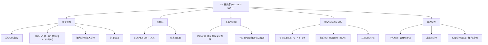
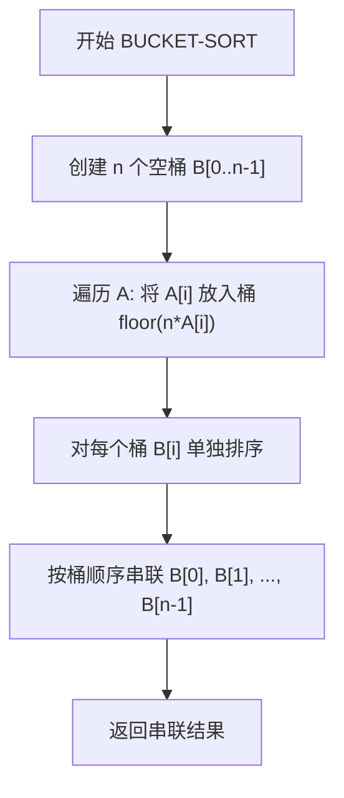

## 相关笔记

- 前置笔记：[[8.2 计数排序]]、[[8.3 基数排序]]
- 关联概念：[[算法导论/concepts/随机化算法]]、[[5.2 指示器随机变量]]、[[算法导论/concepts/插入排序]]
- 章节汇总：[[第08章_线性时间排序-章节汇总]]

> [!abstract] 概览
> 本节介绍 ==桶排序（Bucket Sort）== 算法，它假设输入服从==均匀分布==，在==平均情况==下运行时间为 $O(n)$。桶排序的核心思想是将区间 $[0, 1)$ 划分为 $n$ 个等大的子区间（桶），将 $n$ 个输入元素分散到各桶中，然后对每个桶内的元素单独排序，最后按桶的顺序拼接所有桶即为排序结果。
>
> **要点列表：**
> - 桶排序假设输入在 $[0, 1)$ 上服从==均匀分布==，期望运行时间为 ==$O(n)$==
> - 桶排序使用==插入排序==对每个桶内元素排序，因为桶内元素期望数量很少（常数级）
> - 最坏情况下（所有元素落入同一个桶），运行时间退化为 ==$\Theta(n^2)$==
> - 桶排序是==非比较排序==，突破了比较排序 $\Omega(n \lg n)$ 的下界
> - 桶排序的"分桶+桶内排序"模式是==外部排序==的基础思想

---

知识结构总览



---

核心思想

> [!tip] 核心思路
> 桶排序利用了输入数据的==概率分布==信息。当输入均匀分布在 $[0, 1)$ 上时，将区间分为 $n$ 个等大的桶后，每个桶期望只包含==常数个==元素。对每个小桶使用插入排序（对小输入效率高），总期望时间为 $O(n)$。
>
> **生活类比：** 想象你要将1000个身高在150cm到200cm之间的学生按身高排序。你可以准备10个"桶"（150-155, 155-160, ..., 195-200），将每个学生放入对应身高的桶中。由于身高均匀分布，每个桶大约有100人。对每个桶内排序后按桶的顺序排列即可。这就是桶排序的思想——先粗分再细排。

> [!tip] 算法执行流程
> 1. **创建 n 个空桶** B[0..n-1]
> 2. **遍历输入数组** A，将每个元素 A[i] 放入桶 floor(n * A[i])
> 3. **对每个桶单独排序**（使用插入排序）
> 4. **按桶顺序串联**所有桶中的元素，返回拼接结果



### BUCKET-SORT 伪代码

```
BUCKET-SORT(A, n)
1  let B[0..n-1] be a new array
2  for i = 0 to n - 1
3      make B[i] an empty list
4  for i = 1 to n
5      insert A[i] into list B[⌊n · A[i]⌋]
6  for i = 0 to n - 1
7      sort list B[i] with insertion sort
8  concatenate the lists B[0], B[1], …, B[n-1] together in order
9  return the concatenated lists
```

> [!def] BUCKET-SORT
> **输入：** 数组 $A[1 \dots n]$，其中 $0 \leq A[i] < 1$
> **输出：** 将 $A$ 排序为非降序序列
>
> **算法步骤：**
> 1. **初始化桶：** 创建 $n$ 个空链表 $B[0], B[1], \dots, B[n-1]$
> 2. **分散元素：** 将每个元素 $A[i]$ 插入到桶 $B[\lfloor n \cdot A[i] \rfloor]$ 中
>    - 桶 $B[i]$ 负责区间 $[i/n, (i+1)/n)$ 内的元素
> 3. **桶内排序：** 对每个桶内的链表使用插入排序
> 4. **拼接输出：** 按 $B[0], B[1], \dots, B[n-1]$ 的顺序拼接所有链表

### 操作示例

以 $n = 10$ 为例，输入数组 $A = \langle 0.79, 0.13, 0.16, 0.64, 0.39, 0.20, 0.89, 0.53, 0.71, 0.42 \rangle$：

| 桶编号 | 区间 | 包含的元素 | 排序后 |
|:---:|:---:|:-----|:-----|
| $B[0]$ | $[0.0, 0.1)$ | （空） | （空） |
| $B[1]$ | $[0.1, 0.2)$ | 0.13, 0.16 | 0.13, 0.16 |
| $B[2]$ | $[0.2, 0.3)$ | 0.20 | 0.20 |
| $B[3]$ | $[0.3, 0.4)$ | 0.39 | 0.39 |
| $B[4]$ | $[0.4, 0.5)$ | 0.42 | 0.42 |
| $B[5]$ | $[0.5, 0.6)$ | 0.53 | 0.53 |
| $B[6]$ | $[0.6, 0.7)$ | 0.64 | 0.64 |
| $B[7]$ | $[0.7, 0.8)$ | 0.79, 0.71 | 0.71, 0.79 |
| $B[8]$ | $[0.8, 0.9)$ | 0.89 | 0.89 |
| $B[9]$ | $[0.9, 1.0)$ | （空） | （空） |

**最终输出：** $\langle 0.13, 0.16, 0.20, 0.39, 0.42, 0.53, 0.64, 0.71, 0.79, 0.89 \rangle$

---

正确性证明

> [!def] 桶排序的正确性
> **证明：** 考虑任意两个元素 $A[i]$ 和 $A[j]$，不失一般性设 $A[i] \leq A[j]$。
>
> > **【分情况讨论（同桶插入排序+不同桶桶序保证）】**
>
> 由于 $\lfloor n \cdot A[i] \rfloor \leq \lfloor n \cdot A[j] \rfloor$，有两种情况：
>
> **情况一：** $A[i]$ 和 $A[j]$ 进入==同一个桶==。此时第6-7行的插入排序将它们排为正确顺序。
>
> **情况二：** $A[i]$ 和 $A[j]$ 进入==不同的桶==。由于 $\lfloor n \cdot A[i] \rfloor < \lfloor n \cdot A[j] \rfloor$，$A[i]$ 所在桶的编号小于 $A[j]$ 所在桶的编号。第8行按桶编号递增顺序拼接，因此 $A[i]$ 排在 $A[j]$ 前面。
>
> **两种情况下排序结果均正确，因此桶排序是正确的。** $\blacksquare$

---

期望运行时间分析

### 运行时间表达式

除第7行外，所有代码在最坏情况下耗时 $O(n)$：
- 第1-3行初始化 $n$ 个空链表：$O(n)$
- 第4-5行将 $n$ 个元素插入链表：$O(n)$
- 第8行拼接链表：$O(n)$

第7行对 $n$ 个桶分别调用插入排序。设 $n_i$ 为桶 $B[i]$ 中的元素个数，插入排序在最坏情况下耗时 $O(n_i^2)$。因此桶排序的总运行时间为：

> **【运行时间分解（Theta(n)+sum O(n_i^2)分离线性与二次项）】**

$$T(n) = \Theta(n) + \sum_{i=0}^{n-1} O(n_i^2) \tag{8.1}$$

### 引理 8.1

> [!def] 引理 8.1（桶大小的二阶矩）
> 若输入数组 $A$ 的 $n$ 个元素独立均匀分布在 $[0, 1)$ 上，则对 $i = 0, 1, \dots, n-1$，有
> $$\mathbb{E}[n_i^2] = 2 - \frac{1}{n}$$

**证明：**

> **【二项分布建模（n_i服从B(n,1/n)用方差-二阶矩公式求E[n_i^2]）】**

将 $n_i$ 视为 $n$ 次==伯努利试验==中的成功次数：
- 每个元素 $A[j]$ 独立地以概率 $p = 1/n$ 落入桶 $B[i]$（因为桶 $B[i]$ 的区间长度为 $1/n$）
- 成功概率 $p = 1/n$，失败概率 $q = 1 - 1/n$

因此 $n_i$ 服从参数为 $(n, 1/n)$ 的==二项分布==。由二项分布的性质：

$$\mathbb{E}[n_i] = np = n \cdot \frac{1}{n} = 1$$

$$\text{Var}[n_i] = npq = n \cdot \frac{1}{n} \cdot \left(1 - \frac{1}{n}\right) = 1 - \frac{1}{n}$$

利用方差与二阶矩的关系 $\mathbb{E}[X^2] = \text{Var}[X] + (\mathbb{E}[X])^2$：

> **【方差-二阶矩公式（E[X^2]=Var[X]+(E[X])^2代入得2-1/n）】**

$$\mathbb{E}[n_i^2] = \text{Var}[n_i] + (\mathbb{E}[n_i])^2 = \left(1 - \frac{1}{n}\right) + 1^2 = 2 - \frac{1}{n} \quad \blacksquare$$

> [!note] 为什么每个桶的期望大小是1？
> 直观理解：$n$ 个元素均匀分布在 $n$ 个桶中，每个桶的期望元素数自然是 $n \times (1/n) = 1$。这就是为什么每个桶内只有常数个元素，插入排序在桶内运行得很快。

### 推论 8.2

> [!def] 推论 8.2（桶排序的期望运行时间）
> 若输入数组 $A$ 的 $n$ 个元素独立均匀分布在 $[0, 1)$ 上，则桶排序的期望运行时间为 $O(n)$。

**证明：**

> **【期望线性性（E[T(n)]=Theta(n)+sum E[O(n_i^2)]=Theta(n)+n*O(1)=O(n)）】**

对式(8.1)两边取期望，利用==期望的线性性==（见附录C.24）：

$$\mathbb{E}[T(n)] = \Theta(n) + \sum_{i=0}^{n-1} \mathbb{E}[O(n_i^2)] = \Theta(n) + \sum_{i=0}^{n-1} O(\mathbb{E}[n_i^2])$$

由引理8.1，$\mathbb{E}[n_i^2] = 2 - 1/n = O(1)$（常数），因此：

$$\mathbb{E}[T(n)] = \Theta(n) + n \cdot O(1) = \Theta(n) + O(n) = O(n) \quad \blacksquare$$

### 更一般的条件

> [!note] 超越均匀分布
> 即使输入不服从均匀分布，桶排序仍可能在线性时间内运行。关键条件是：
>
> $$\sum_{i=0}^{n-1} n_i^2 = O(n)$$
>
> 即桶大小的平方和为线性。这意味着只要元素"足够均匀地分散"在各桶中，桶排序就能保持线性时间。均匀分布只是满足此条件的一个充分条件。

---

补充理解与拓展

> [!info] 桶排序的实际应用场景
>
> 桶排序的"分桶+桶内排序"思想在计算机科学的多个领域有广泛应用：
>
> **1. 浮点数排序**
> 当输入均匀分布在 $[0, 1)$ 区间时，桶排序期望 $O(n)$。对于一般区间 $[a, b)$ 上的均匀分布，可以通过线性变换 $A'[i] = (A[i] - a)/(b - a)$ 将其映射到 $[0, 1)$，再应用桶排序。
>
> **2. 均匀哈希**
> 桶排序的思想与==哈希表==的设计密切相关。哈希表将键通过哈希函数映射到不同的桶（槽位），理想情况下每个桶只有常数个元素。桶排序本质上就是一种"排序用哈希"——先用哈希函数分桶，再桶内排序。
>
> **3. 外部排序**
> 桶排序的"分桶+桶内排序"模式是==外部排序==的基础思想。当数据量超过内存容量时，外部排序将数据分成多个适合内存大小的"桶"（run），分别排序后写回磁盘，再通过多路归并合并。经典的==多路归并外部排序==就是这一思想的直接应用。
>
> **4. 计算几何中的空间分区**
> 在计算几何中，桶排序用于==空间分区==数据结构（如均匀网格）。将二维空间划分为网格单元，每个单元就是一个"桶"，用于加速最近邻搜索、碰撞检测等操作。

> [!info] 线性时间排序算法的选择：计数排序 vs 基数排序 vs 桶排序
>
> 第8章介绍了三种线性时间排序算法，它们各有适用场景：
>
> | 算法 | 适用条件 | 时间复杂度 | 空间 | 稳定性 |
> |:-----|:---------|:----------|:-----|:------:|
> | [[8.2 计数排序\|计数排序]] | 键值范围 $k = O(n)$ 的整数 | $\Theta(n + k)$ | $O(n + k)$ | 稳定 |
> | [[8.3 基数排序\|基数排序]] | 键值可以很大但位数 $d$ 有限 | $\Theta(d(n + k))$ | $O(n + k)$ | 稳定 |
> | 桶排序 | 输入均匀分布在已知区间 | 期望 $O(n)$，最坏 $\Theta(n^2)$ | $O(n)$ | 取决于桶内排序 |
>
> **选择指南：**
> - **键值是小范围整数** → 计数排序（最简单直接）
> - **键值是大整数但位数有限** → 基数排序（如32位整数用4趟8位计数排序）
> - **键值是浮点数且均匀分布** → 桶排序（期望线性时间）
> - **不确定输入分布** → 使用比较排序（如快速排序、归并排序）作为安全选择
>
> **工程实践：** Java 的 `Arrays.sort(double[])` 对小数组使用双轴快速排序（Dual-Pivot Quicksort），但在某些特殊情况下可能利用桶排序思想进行优化。大多数标准库的通用排序函数优先选择比较排序，因为它们不依赖输入分布假设。

---

易混淆点与辨析

> [!warning] 误区：桶排序的最坏情况也是 $O(n)$
> ❌ **错误理解：** "桶排序是线性时间排序算法，所以最坏情况也是 $O(n)$"
>
> ✅ **正确理解：** 桶排序的 ==$O(n)$ 是期望运行时间==，依赖于均匀分布假设。在最坏情况下——例如所有 $n$ 个元素都落入同一个桶——桶排序退化为对该桶内 $n$ 个元素的插入排序，运行时间为 $\Theta(n^2)$。
>
> **最坏情况示例：** 输入 $A = \langle 0.01, 0.02, 0.03, \dots, 0.99 \rangle$（$n$ 个元素全部在 $[0, 1)$ 中均匀分布，但假设极端情况全部落在 $B[0]$ 中），则桶 $B[0]$ 包含全部 $n$ 个元素，插入排序耗时 $\Theta(n^2)$。
>
> **改进方法：** 将第7行的插入排序替换为 $O(n_i \lg n_i)$ 的排序算法（如归并排序），可将最坏情况改善为 $O(n \lg n)$，同时保持期望 $O(n)$。

> [!warning] 误区：桶排序只能处理 $[0, 1)$ 区间的输入
> ❌ **错误理解：** "桶排序要求输入必须在 $[0, 1)$ 之间，否则无法使用"
>
> ✅ **正确理解：** CLRS 的伪代码假设输入在 $[0, 1)$，但这只是为了简化表述。对于任意已知区间 $[a, b)$ 上的均匀分布输入，可以通过==线性变换==将其映射到 $[0, 1)$：
>
> $$A'[i] = \frac{A[i] - a}{b - a}$$
>
> 然后对 $A'$ 执行桶排序，最后将结果映射回原始值。对于整数输入，也可以直接修改桶的划分方式：
>
> ```
> 桶 B[i] 负责区间 [a + i*(b-a)/n, a + (i+1)*(b-a)/n)
> ```
>
> 桶排序的关键假设不是"输入在 $[0, 1)$"，而是"输入在已知区间上均匀分布"。

---

习题精选

| 题号 | 题目描述 | 难度 |
|:---:|----------|:---:|
| 8.4-1 | 模仿图8.4，展示 BUCKET-SORT 在数组 $A = \langle .79, .13, .16, .64, .39, .20, .89, .53, .71, .42 \rangle$ 上的操作过程 | ⭐ |
| 8.4-2 | 解释为什么桶排序的最坏运行时间为 $\Theta(n^2)$。如何修改算法使最坏情况为 $O(n \lg n)$？ | ⭐⭐ |
| 8.4-3 | 设 $X$ 为公平硬币两次抛掷中正面朝上的次数，求 $\mathbb{E}[X^2]$ 和 $(\mathbb{E}[X])^2$ | ⭐ |
| 8.4-4 | 修改桶排序使其在 $O(n)$ 期望时间内排序特殊构造的数组 | ⭐⭐⭐ |
| 8.4-5 | 设计 $\Theta(n)$ 平均时间算法，按到原点的距离排序均匀分布在单位圆盘上的 $n$ 个点 | ⭐⭐⭐ |
| 8.4-6 | 给定可计算连续分布函数 $P$，设计线性平均时间排序算法 | ⭐⭐⭐ |

> [!faq]- 8.4-2 解答
> **目标：** 分析最坏情况并给出改进方案。
>
> **最坏情况分析：**
>
> 考虑所有 $n$ 个元素都落入同一个桶 $B[j]$ 的情况。此时 $n_j = n$，其余桶为空。
>
> 由式(8.1)：
> $$T(n) = \Theta(n) + O(n_j^2) = \Theta(n) + O(n^2) = \Theta(n^2)$$
>
> **改进方案：**
>
> 将第7行的插入排序替换为==归并排序==（或任何 $O(n_i \lg n_i)$ 的排序算法）：
>
> ```
> 7'     sort list B[i] with merge sort
> ```
>
> 改进后的运行时间：
> $$T'(n) = \Theta(n) + \sum_{i=0}^{n-1} O(n_i \lg n_i)$$
>
> 在最坏情况下（所有元素在一个桶中）：
> $$T'(n) = \Theta(n) + O(n \lg n) = O(n \lg n)$$
>
> 在平均情况下（均匀分布，$\mathbb{E}[n_i] = 1$）：
> $$\mathbb{E}[T'(n)] = \Theta(n) + \sum_{i=0}^{n-1} O(\mathbb{E}[n_i \lg n_i])$$
>
> 由于 $\mathbb{E}[n_i] = 1$ 且 $n_i \lg n_i$ 在 $n_i = 1$ 时为0，期望运行时间仍为 $O(n)$。
>
> **权衡：** 插入排序对小输入（常数个元素）有更小的常数因子，因此在均匀分布下更快。归并排序保证了最坏情况 $O(n \lg n)$，但常数因子更大。

> [!faq]- 8.4-3 解答
> **目标：** 计算 $\mathbb{E}[X^2]$ 和 $(\mathbb{E}[X])^2$。
>
> 设 $X$ 为公平硬币两次抛掷中正面朝上的次数。$X$ 的取值为 $\{0, 1, 2\}$：
> - $P(X = 0) = 1/4$（两次都是反面）
> - $P(X = 1) = 2/4 = 1/2$（一次正面一次反面）
> - $P(X = 2) = 1/4$（两次都是正面）
>
> **计算 $\mathbb{E}[X]$：**
> $$\mathbb{E}[X] = 0 \cdot \frac{1}{4} + 1 \cdot \frac{1}{2} + 2 \cdot \frac{1}{4} = 0 + \frac{1}{2} + \frac{1}{2} = 1$$
>
> **计算 $(\mathbb{E}[X])^2$：**
> $$(\mathbb{E}[X])^2 = 1^2 = 1$$
>
> **计算 $\mathbb{E}[X^2]$：**
> $$\mathbb{E}[X^2] = 0^2 \cdot \frac{1}{4} + 1^2 \cdot \frac{1}{2} + 2^2 \cdot \frac{1}{4} = 0 + \frac{1}{2} + 1 = \frac{3}{2}$$
>
> **验证方差公式：** $\text{Var}[X] = \mathbb{E}[X^2] - (\mathbb{E}[X])^2 = \frac{3}{2} - 1 = \frac{1}{2}$
>
> 这与二项分布 $B(2, 1/2)$ 的方差 $npq = 2 \cdot \frac{1}{2} \cdot \frac{1}{2} = \frac{1}{2}$ 一致。

> [!faq]- 8.4-5 解答
> **目标：** 设计 $\Theta(n)$ 平均时间算法，按到原点的距离排序均匀分布在单位圆盘上的 $n$ 个点。
>
> **分析：**
>
> 点 $p_i = (x_i, y_i)$ 到原点的距离为 $r_i = \sqrt{x_i^2 + y_i^2}$，其中 $0 \leq r_i \leq 1$。
>
> 关键问题：$r_i$ 在 $[0, 1]$ 上**不服从均匀分布**。由于面积与半径的平方成正比，$r_i$ 的概率密度函数为 $f(r) = 2r$（$0 \leq r \leq 1$）。
>
> **设计桶排序：**
>
> 由于 $r_i$ 的分布不均匀，不能使用等大的桶。需要设计桶的大小使得每个桶的期望点数相同。
>
> 设桶 $B[i]$ 的区间为 $[r_i, r_{i+1})$，要求每个桶覆盖相同的面积（即相同的概率）：
>
> $$\pi r_{i+1}^2 - \pi r_i^2 = \frac{\pi}{n}$$
>
> 即 $r_i = \sqrt{i/n}$。
>
> **算法：**
> ```
> BUCKET-SORT-DISK(points, n)
> 1  for each point p_i = (x_i, y_i)
> 2      r_i = sqrt(x_i^2 + y_i^2)
> 3      bucket_index = floor(n * r_i^2)  // 注意: 用 r_i^2 而非 r_i
> 4      insert p_i into B[bucket_index]
> 5  for i = 0 to n-1
> 6      sort B[i] by distance (insertion sort)
> 7  concatenate B[0], B[1], ..., B[n-1]
> ```
>
> **正确性：** 由于 $r_i^2$ 在 $[0, 1)$ 上均匀分布（因为面积均匀），使用 $r_i^2$ 作为桶排序的键值即可直接应用标准桶排序。
>
> **期望运行时间：** 与标准桶排序相同，为 $\Theta(n)$。

---

视频学习指南

| 资源 | 主题 | 链接 | 说明 |
|:-----|:-----|:-----|:-----|
| MIT 6.006 Lecture 5 | Bucket Sort | https://www.youtube.com/watch?v=VuXbEb5m41E | MIT公开课，含桶排序完整讲解与复杂度分析 |
| Abdul Bari | Bucket Sort Algorithm | https://www.youtube.com/watch?v=GEqMqj2Bqwg | 逐步动画演示桶排序的分桶与拼接过程 |
| HackerRank | Bucket Sort | https://www.youtube.com/watch?v=J9ikDQm6T_c | 实际代码实现演示 |
| WilliamFiset | Bucket Sort | https://www.youtube.com/watch?v=gePn2SVLgGY | 排序算法系列中的桶排序专题 |
| GeeksforGeeks | Bucket Sort | https://www.youtube.com/watch?v=kgGVUoM3MUE | 含复杂度分析和代码实现 |

---

教材原文

> [!quote] CLRS 第4版 8.4节原文
> Bucket sort assumes that the input is drawn from a uniform distribution and has an average-case running time of $O(n)$. Like counting sort, bucket sort is fast because it assumes something about the input. Whereas counting sort assumes that the input consists of integers in a small range, bucket sort assumes that the input is generated by a random process that distributes elements uniformly and independently over the interval $[0, 1)$.
>
> Bucket sort divides the interval $[0, 1)$ into $n$ equal-sized subintervals, or buckets, and then distributes the $n$ input numbers into the buckets. Since the inputs are uniformly and independently distributed over $[0, 1)$, we do not expect many numbers to fall into each bucket. To produce the output, we simply sort the numbers in each bucket and then go through the buckets in order, listing the elements in each.

---

## 参见Wiki

- [[算法导论/concepts/桶排序]] — 非比较排序：桶排序

#学习/算法导论/第08章-线性时间排序 #学习/算法导论/线性时间排序/桶排序
