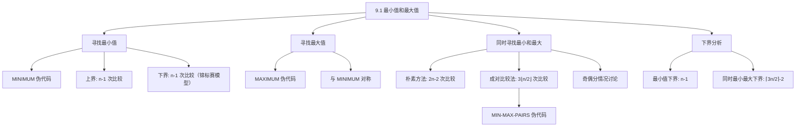

## 相关笔记

- 前置笔记：[[算法导论/concepts/大O记号]]、[[算法导论/concepts/大Omega记号]]、[[算法导论/concepts/大Theta记号]]
- 关联概念：[[算法导论/concepts/排序问题]]
- 后续笔记：[[9.2 期望线性时间选择]]、[[9.3 最坏情况线性时间选择]]
- 章节汇总：[[第09章_中位数与序统计-章节汇总]]

> [!abstract] 概览
> 本节是第9章"中位数与序统计"的基础入门，研究两个最基本的==序统计量==问题：在 $n$ 个元素的集合中寻找==最小值==和==最大值==。虽然问题看似简单，但其中蕴含的==比较下界==分析方法和==成对处理==优化策略，是后续学习一般选择问题的理论基础。
>
> **要点列表：**
> - 寻找最小值（或最大值）需要恰好 ==$n - 1$== 次比较，且这是==最优==的（下界证明）
> - 同时寻找最小值和最大值，朴素方法需要 $2n - 2$ 次比较，而==成对比较法==仅需最多 ==$3\lfloor n/2 \rfloor$== 次比较
> - 同时寻找最小最大值的比较下界为 ==$\lceil 3n/2 \rceil - 2$==，因此成对比较法是最优的
> - 本节的核心分析工具是==锦标赛模型==（tournament model），用于建立比较次数的下界

---

知识结构总览



---

核心概念：序统计量

> [!def] 序统计量（Order Statistic）
> 在一个由 $n$ 个元素组成的集合中，第 $i$ 个==序统计量==（order statistic）是该集合中第 $i$ 小的元素。
>
> - **最小值**是第 $1$ 个序统计量（$i = 1$）
> - **最大值**是第 $n$ 个序统计量（$i = n$）
> - **中位数**（median）：当 $n$ 为奇数时，$i = (n+1)/2$；当 $n$ 为偶数时，下中位数 $i = n/2$，上中位数 $i = n/2 + 1$
>
> 本节讨论最简单的两个特例：$i = 1$（最小值）和 $i = n$（最大值）。[[9.2 期望线性时间选择]] 和 [[9.3 最坏情况线性时间选择]] 将推广到任意 $i$。

---

寻找最小值

### MINIMUM 伪代码

```
MINIMUM(A, n)
1  min = A[1]
2  for i = 2 to n
3      if min > A[i]
4          min = A[i]
5  return min
```

> [!def] MINIMUM 算法
> **输入：** 数组 $A[1 \dots n]$，包含 $n$ 个元素
> **输出：** $A$ 中的最小值
>
> **算法步骤：**
> 1. 初始化 `min` 为 $A[1]$
> 2. 依次扫描 $A[2], A[3], \dots, A[n]$，每当发现比当前 `min` 更小的元素就更新 `min`
> 3. 返回最终的 `min`

### 复杂度分析

> [!def] 时间复杂度 $\Theta(n)$
> - **比较次数：** 恰好 $n - 1$ 次比较（for 循环执行 $n - 1$ 次，每次 1 次比较）
> - **上界：** $n - 1$ 次比较足以找到最小值
> - **下界：** $n - 1$ 次比较是必要的（见下方证明）
> - 因此 MINIMUM 关于比较次数是**最优的**

### 下界证明：为什么至少需要 $n - 1$ 次比较？

> [!def] 锦标赛模型（Tournament Model）
> 将寻找最小值的过程想象为一场**淘汰赛**：
> - 每个元素是一名选手
> - 每次比较是一场"比赛"，较小者获胜晋级
> - 最终的冠军就是最小值
>
> **关键观察：** 除了冠军（最小值）之外，其余 $n - 1$ 个元素**都至少输掉一场比赛**，才能被证明不是最小值。
>
> **形式化证明：**
> **【淘汰论证（每次比较最多淘汰1个元素，需淘汰n-1个）】**
- 设算法执行了 $c$ 次比较
> - 每次比较最多只能"淘汰"一个元素（证明该元素不是最小值）
> - 要确定最小值，必须淘汰其余所有 $n - 1$ 个元素
> - 因此 $c \geq n - 1$
>
> **结论：** 任何确定最小值的算法至少需要 $n - 1$ 次比较。MINIMUM 算法恰好使用 $n - 1$ 次比较，因此是**最优的**。

---

寻找最大值

寻找最大值的问题与寻找最小值完全对称。只需将 MINIMUM 中的 `min > A[i]` 改为 `max < A[i]`，即可得到 MAXIMUM 算法。

```
MAXIMUM(A, n)
1  max = A[1]
2  for i = 2 to n
3      if max < A[i]
4          max = A[i]
5  return max
```

- 比较次数：恰好 $n - 1$ 次
- 下界证明与最小值完全对称：$n - 1$ 次比较是必要且充分的
- MAXIMUM 也是**最优的**

---

同时寻找最小值和最大值

### 朴素方法

分别调用 MINIMUM 和 MAXIMUM，总共需要：

$$(n - 1) + (n - 1) = 2n - 2 \text{ 次比较}$$

这已经是 $\Theta(n)$，渐近最优。但我们可以优化**常数因子**。

### 成对比较法（Pairwise Comparison）

> [!tip] 核心思路
> 朴素方法对每个元素分别与当前最小值和当前最大值比较（每个元素 2 次比较）。成对比较法的优化关键在于：
> 1. 将元素**成对**处理
> 2. 先比较同一对中的两个元素（1 次比较）
> 3. 将较小者与当前最小值比较，较大者与当前最大值比较（2 次比较）
> 4. 每对元素共 3 次比较，处理 2 个元素——**从 2次/元素 降低到 1.5次/元素**

### MIN-MAX-PAIRS 伪代码

```
MIN-MAX-PAIRS(A, n)
1  // 初始化
2  if n is odd
3      min = max = A[1]
4      start = 2
5  else
6      if A[1] > A[2]
7          min = A[2]
8          max = A[1]
9      else
10         min = A[1]
11         max = A[2]
12     start = 3
13
14 // 成对处理
15 for i = start to n step 2
16     if A[i] > A[i+1]
17         smaller = A[i+1]
18         larger = A[i]
19     else
20         smaller = A[i]
21         larger = A[i+1]
22     if smaller < min
23         min = smaller
24     if larger > max
25         max = larger
26
27 return (min, max)
```

> [!def] MIN-MAX-PAIRS 算法
> **输入：** 数组 $A[1 \dots n]$，包含 $n$ 个元素
> **输出：** $(min, max)$，即 $A$ 中的最小值和最大值
>
> **算法步骤：**
> 1. **初始化阶段：**
>    - 若 $n$ 为奇数：将 `min` 和 `max` 都设为 $A[1]$，从 $A[2]$ 开始成对处理
>    - 若 $n$ 为偶数：比较 $A[1]$ 和 $A[2]$（1 次比较），确定初始的 `min` 和 `max`，从 $A[3]$ 开始成对处理
> 2. **成对处理阶段：** 每次取一对 $(A[i], A[i+1])$：
>    - 先比较两者（1 次比较），确定较小者 `smaller` 和较大者 `larger`
>    - 将 `smaller` 与 `min` 比较（1 次比较），更新 `min`
>    - 将 `larger` 与 `max` 比较（1 次比较），更新 `max`
> 3. 返回 $(min, max)$

### 比较次数的精确分析

> [!def] 比较次数：最多 $3\lfloor n/2 \rfloor$
>
> **分情况讨论：**
>
> > **【奇偶分情况（奇数0次初始化+floor(n/2)对，偶数1次初始化+n/2-1对）】**
>
> **情况一：$n$ 为奇数**
> - 初始化：0 次比较（直接设 `min = max = A[1]`）
> - 剩余 $n - 1$ 个元素，共 $\lfloor n/2 \rfloor$ 对
> - 每对 3 次比较，共 $3\lfloor n/2 \rfloor$ 次比较
>
> **情况二：$n$ 为偶数**
> - 初始化：1 次比较（比较 $A[1]$ 和 $A[2]$）
> - 剩余 $n - 2$ 个元素，共 $(n - 2)/2 = n/2 - 1$ 对
> - 每对 3 次比较，共 $3(n/2 - 1) = 3n/2 - 3$ 次比较
> - 总计：$1 + 3n/2 - 3 = 3n/2 - 2 = 3\lfloor n/2 \rfloor$ 次比较
>
> **综合两种情况：** 比较次数最多为 ==$3\lfloor n/2 \rfloor$==
>
> **与朴素方法的对比：**
> $$3\lfloor n/2 \rfloor \leq \frac{3n}{2} < 2n - 2 \quad (n \geq 3)$$
> 成对比较法节省了约 $25\%$ 的比较次数。

### 示例演示

以数组 $A = \langle 3, 1, 7, 4, 5 \rangle$（$n = 5$，奇数）为例：

| 步骤 | 操作 | min | max | 比较次数 |
|:----:|------|:---:|:---:|:--------:|
| 初始化 | $n$ 为奇数，`min = max = A[1] = 3` | 3 | 3 | 0 |
| 第1对 | 比较 $A[2]=1$ 与 $A[3]=7$：$1 < 7$，`smaller=1, larger=7` | 3 | 3 | 1 |
|  | $1 < 3$，更新 `min = 1` | 1 | 3 | 2 |
|  | $7 > 3$，更新 `max = 7` | 1 | 7 | 3 |
| 第2对 | 比较 $A[4]=4$ 与 $A[5]=5$：$4 < 5$，`smaller=4, larger=5` | 1 | 7 | 4 |
|  | $4 > 1$，`min` 不变 | 1 | 7 | 5 |
|  | $5 < 7$，`max` 不变 | 1 | 7 | 6 |

**结果：** $\min = 1$，$\max = 7$，总比较次数 = $6 = 3\lfloor 5/2 \rfloor = 3 \times 2 = 6$。验证正确。

---

下界分析：同时寻找最小最大值

> [!def] 下界定理：$\lceil 3n/2 \rceil - 2$ 次比较
> **定理：** 在最坏情况下，同时确定 $n$ 个元素的最小值和最大值至少需要 $\lceil 3n/2 \rceil - 2$ 次比较。
>
> **证明思路（锦标赛模型推广）：**
>
> > **【身份消除模型（2n个身份需消除2n-2个，每次比较最多消除2个）】**
>
> 定义一个元素是**最大值候选者**（potential maximum）如果它尚未在任何比较中输给另一个元素；类似地，定义**最小值候选者**（potential minimum）如果它尚未在任何比较中赢过另一个元素。
>
> 初始时，每个元素既是最大值候选者，也是最小值候选者——共有 $2n$ 个"身份"（每个元素 2 个）。
>
> 考虑一次比较 $A[i]$ vs $A[j]$（假设 $A[i] < A[j]$）的效果：
> - $A[j]$ 不再是最小值候选者（它输给了 $A[i]$）——减少 1 个身份
> - $A[i]$ 不再是最大值候选者（它输给了 $A[j]$）——减少 1 个身份
> - 因此每次比较**最多减少 2 个身份**
>
> 但存在一种特殊情况：当一个元素**同时**是最大值候选者和最小值候选者时（即它尚未参与过任何比较），一次比较可以同时消除它的两个身份。然而，一旦一个元素已经参与过比较，后续的比较最多只能消除它剩余的一个身份。
>
> 更精确地说：
> - 前 $\lceil n/2 \rceil$ 次比较（如果每次都匹配两个未比较过的元素）每次可以消除 2 个身份
> - 之后的比较每次最多消除 1 个身份
>
> **严格论证：**
>
> > **【高效比较次数受限（未比较元素配对最多floor(n/2)次）】**
>
> - 初始身份数：$2n$
> - 最终身份数：2（只有最小值保留"最小值候选者"身份，只有最大值保留"最大值候选者"身份）
> - 需要消除的身份数：$2n - 2$
> - 每次比较最多消除 2 个身份
> - 但要消除 2 个身份，两个比较元素都必须是"未比较过"的——这种"高效比较"最多只有 $\lfloor n/2 \rfloor$ 次
> - 因此，设 $c$ 为总比较次数，其中 $p$ 次是"高效比较"（消除 2 个身份），其余 $c - p$ 次消除 1 个身份
> - 约束：$p \leq \lfloor n/2 \rfloor$
> - 需要满足：$2p + (c - p) \geq 2n - 2$，即 $c + p \geq 2n - 2$
> - 由于 $p \leq \lfloor n/2 \rfloor$，得 $c \geq 2n - 2 - p \geq 2n - 2 - \lfloor n/2 \rfloor = \lceil 3n/2 \rceil - 2$
>
> **结论：** 下界为 ==$\lceil 3n/2 \rceil - 2$==。
>
> > **【最优性验证（成对比较法恰好达到下界）】**
>
> 而我们的成对比较法最多使用 $3\lfloor n/2 \rfloor$ 次比较。可以验证：
> - 当 $n$ 为偶数：$3\lfloor n/2 \rfloor = 3n/2 = \lceil 3n/2 \rceil$，此时算法恰好达到下界
> - 当 $n$ 为奇数：$3\lfloor n/2 \rfloor = 3(n-1)/2 = \lceil 3n/2 \rceil - 2$，此时算法也恰好达到下界
>
> 因此 MIN-MAX-PAIRS 是**最优的**。

---

补充理解与拓展

> [!info] 序统计量在工程中的广泛应用
>
> 序统计量（order statistic）远不止是理论概念，它在现代计算机科学和工程中有大量实际应用：
>
> | 应用领域 | 具体用途 | 说明 |
> |---------|---------|------|
> | **统计学** | 中位数作为鲁棒估计量 | 中位数不受极端值（outlier）影响，比均值更鲁棒。PostgreSQL 和 Oracle 均支持 `MEDIAN()` 聚合函数 |
> | **系统性能监控** | P50/P95/P99 延迟指标 | SRE（站点可靠性工程）的核心指标。P99 表示 99% 的请求延迟低于此值，是衡量尾部延迟的关键 |
> | **搜索引擎** | Top-K 选择 | 搜索引擎返回前 K 个最相关结果，推荐系统的 Top-N 推荐，流数据的 Top-K 问题 |
> | **图像处理** | 中值滤波（Median Filter） | OpenCV 的标准函数 `cv2.medianBlur()`，用于去除椒盐噪声，比均值滤波更好地保留边缘 |
> | **金融领域** | 收入/房价集中趋势度量 | 中位数用于度量收入、房价等偏态分布数据的集中趋势，比均值更准确地反映"典型值" |
>
> **为什么中位数比均值更鲁棒？** 考虑数据集 $\{1, 2, 3, 4, 100\}$：均值为 $22$（被极端值 $100$ 拉高），而中位数为 $3$（不受极端值影响）。在收入分布等右偏分布中，这一差异尤为显著。
>
> 来源：PostgreSQL 官方文档; Google SRE Book; OpenCV 官方文档

> [!info] 锦标赛模型与信息论下界——比较算法的理论基础
>
> 本节使用的"锦标赛模型"建立比较下界的方法，是==判定树模型==（decision tree model）的一个特例，也是==信息论下界==（information-theoretic lower bound）的具体体现。
>
> **从锦标赛到判定树：**
> - 锦标赛模型将比较过程建模为淘汰赛，每次比较淘汰一个候选者
> - 判定树模型更一般化：将所有可能的比较序列建模为一棵二叉树，每个内部节点是一次比较，每个叶节点是一个输出
> - 判定树的高度就是最坏情况下的比较次数
>
> **信息论视角：**
> - 要在 $n$ 个元素中确定最小值，需要从 $n$ 个可能结果中选出 1 个
> - 每次比较产生 2 种结果（$<$ 或 $\geq$），提供至多 1 bit 的信息
> - 因此至少需要 $\lceil \log_2 n \rceil$ 次比较——但这个下界太松
> - 锦标赛模型给出了更紧的下界 $n - 1$，因为它利用了问题的特定结构
>
> **推广到排序：** 排序需要确定 $n$ 个元素的全部排列，共 $n!$ 种可能结果。判定树必须有至少 $n!$ 个叶节点，因此高度至少为 $\lceil \log_2(n!) \rceil = \Omega(n \lg n)$。这就是比较排序的 $\Omega(n \lg n)$ 下界（见第8章）。
>
> 来源：CLRS Chapter 8; Knuth, "The Art of Computer Programming" Vol. 3; Cormen et al., "Introduction to Algorithms"

---

易混淆点与辨析

> [!warning] 误区：同时寻找最小最大值只需要 $n - 1$ 次比较
> ❌ **错误理解：** "寻找最小值需要 $n - 1$ 次，寻找最大值也需要 $n - 1$ 次，但可以共享比较信息，所以同时寻找只需要 $n - 1$ 次"
>
> ✅ **正确理解：** 同时寻找最小值和最大值**至少**需要 $\lceil 3n/2 \rceil - 2$ 次比较，远多于 $n - 1$。原因在于：
> - 寻找最小值的 $n - 1$ 次比较只能确定"谁是最小的"，但**没有积累足够的信息**来确定最大值
> - 锦标赛中，最小值只与它直接比较过的元素"交手"过，其余元素之间的相对大小未知
> - 要同时确定最小和最大，需要更精细的信息收集策略——成对比较法就是最优策略
>
> **类比：** 想象一场淘汰赛只决出了冠军（最小值），但亚军（第二小）是谁并不确定——冠军只在决赛中击败了一个对手，其他选手之间的胜负关系并不清楚。

> [!warning] 误区：成对比较法的时间复杂度优于朴素方法
> ❌ **错误理解：** "成对比较法用 $3\lfloor n/2 \rfloor$ 次比较，朴素方法用 $2n - 2$ 次比较，所以成对比较法的时间复杂度更好"
>
> ✅ **正确理解：** 两种方法的渐近时间复杂度**完全相同**，都是 $\Theta(n)$。成对比较法只优化了**常数因子**：
> - 朴素方法：$2n - 2$ 次比较
> - 成对比较法：$3\lfloor n/2 \rfloor \approx 1.5n$ 次比较
> - 节省约 $25\%$ 的比较次数
>
> **何时这种优化有意义？**
> - 当比较操作本身非常昂贵时（如比较两个复杂对象、数据库记录比较）
> - 在底层系统或性能敏感场景中，减少 $25\%$ 的比较可能带来可观的加速
> - 在算法竞赛中，常数因子的优化有时是 AC 与 TLE 的区别
>
> **何时这种优化无意义？**
> - 当元素是简单的整数或浮点数时，比较操作极快，常数因子的差异可忽略
> - 当数据量极大时，内存访问模式（缓存局部性）的影响远大于比较次数的差异

---

习题精选

| 题号 | 题目描述 | 难度 |
|:---:|----------|:---:|
| 9.1-1 | 证明：可以在最坏情况下用 $n + \lceil \lg n \rceil - 2$ 次比较找到 $n$ 个元素中的第二小的元素（提示：同时找到最小元素） | ⭐⭐ |
| 9.1-2 | 给定 $n > 2$ 个不同的数，找出一个既非最小也非最大的数，最少需要多少次比较？ | ⭐⭐ |
| 9.1-3 | 赛马问题：25匹马，每次最多5匹比赛，确定最快的三匹马最少需要多少场比赛？ | ⭐⭐⭐ |
| 9.1-4 | 证明：同时确定 $n$ 个数的最大值和最小值，最坏情况下至少需要 $\lceil 3n/2 \rceil - 2$ 次比较 | ⭐⭐⭐ |

> [!faq]- 9.1-1 解答：用 $n + \lceil \lg n \rceil - 2$ 次比较找第二小元素
> **目标：** 证明第二小的元素可以在最坏情况下用 $n + \lceil \lg n \rceil - 2$ 次比较找到。
>
> **算法思路：**
>
> 1. **先用 $n - 1$ 次比较找到最小值**（使用 MINIMUM 算法）
> 2. **关键观察：** 在寻找最小值的锦标赛中，最小值（冠军）在每一轮都击败了一个对手。第二小的元素**一定**是被最小值直接击败过的某个对手——因为如果第二小的元素被其他人击败，那么击败它的人比它更小，而最小值是所有元素中最小的，所以第二小的元素只可能输给最小值。
>
> > **【关键观察（第二小元素必在最小值的直接败者集合中）】**
>
> 3. **收集候选者：** 在锦标赛过程中，记录最小值每次击败的对手，这些对手构成"败者集合"
> 4. **在败者集合中找最小值：** 败者集合的大小等于最小值参加的比较次数，即 $\lceil \lg n \rceil$（锦标赛树的高度）
>
> **比较次数分析：**
>
> > **【败者集合分析（败者集合大小为ceil(lg n)，需ceil(lg n)-1次比较）】**
>
> - 第一步（找最小值）：$n - 1$ 次比较
> - 第二步（在败者集合中找最小值）：败者集合大小为 $\lceil \lg n \rceil$，需要 $\lceil \lg n \rceil - 1$ 次比较
> - 总计：$(n - 1) + (\lceil \lg n \rceil - 1) = n + \lceil \lg n \rceil - 2$ 次比较
>
> **具体示例：** 设 $A = \langle 2, 5, 1, 4, 3 \rangle$
> - 锦标赛过程：
>   - 比较 2 vs 5：2 胜（败者集合：{5}）
>   - 比较 1 vs 4：1 胜（败者集合：{5, 4}）
>   - 比较 3 vs 2：2 胜（败者集合：{5, 4, 3}）
>   - 比较 1 vs 2：1 胜（败者集合：{5, 4, 3, 2}）
> - 最小值 = 1，败者集合 = {5, 4, 3, 2}
> - 在败者集合中找最小值：2（需要 3 次比较）
> - 第二小元素 = 2
> - 总比较次数：$4 + 3 = 7$，而公式给出 $5 + \lceil \lg 5 \rceil - 2 = 5 + 3 - 2 = 6$，两者不一致，说明需要更精确的分析。
>
> **修正：** 锦标赛树的结构取决于具体的配对方式。在最坏情况下，最小值需要参加 $\lceil \lg n \rceil$ 轮比赛（即锦标赛树的高度），因此败者集合的大小为 $\lceil \lg n \rceil$。在败者集合中找最小值需要 $\lceil \lg n \rceil - 1$ 次比较。
>
> > **【最终汇总（(n-1)+(ceil(lg n)-1)=n+ceil(lg n)-2得证）】**
>
> 总计：$(n - 1) + (\lceil \lg n \rceil - 1) = n + \lceil \lg n \rceil - 2$。**得证。**

> [!faq]- 9.1-2 解答：找一个既非最小也非最大的数
> **目标：** 给定 $n > 2$ 个不同的数，找出一个既非最小也非最大的数，求最少比较次数。
>
> **答案：** $\lceil n/2 \rceil$ 次比较。
>
> **算法：**
> - 将元素成对比较：$(A[1], A[2])$, $(A[3], A[4])$, $\dots$
> - 每对比较后，较大的那个**不可能是最小值**，较小的那个**不可能是最大值**
> - 因此，每对中任选一个（比如选较大的那个），它一定不是最小值
> - 但它可能是最大值！所以不能简单地选较大的那个
>
> **正确策略：**
> - 成对比较 $\lceil n/2 \rceil$ 对
> - 对于每对 $(a, b)$（假设 $a < b$），$a$ 不可能是最大值，$b$ 不可能是最小值
> - 如果 $n$ 是偶数，我们有 $n/2$ 对，取所有"较大者"中的任意一个——它不是最小值，但可能是最大值。不过，如果我们取所有"较小者"中的任意一个——它不是最大值，但可能是最小值。
> - **关键：** 我们需要找一个**既不是最小也不是最大**的元素。考虑所有对中的"较大者"集合——这个集合有 $n/2$ 个元素，其中至少有一个不是全局最大值（因为全局最大值只有一个，而集合有 $n/2 \geq 2$ 个元素）。但我们不知道哪个不是。
>
> **更优策略：** 只需 $\lceil n/2 \rceil$ 次比较。
>
> > **【构造性证明（取第一对较大者与第二对较小者比较排除两个候选身份）】**
>
> - 成对比较 $\lfloor n/2 \rfloor$ 对
> - 如果 $n$ 是偶数：比较 $n/2$ 对，从每对中选较大者。这些较大者都不是最小值。如果 $n \geq 4$，较大者集合中至少有 2 个元素，其中最多 1 个是全局最大值，因此至少有一个既非最小也非最大。但问题是我们不知道是哪一个——需要额外比较来排除最大值。
>
> **重新分析——更简洁的答案：**
>
> 实际上，最少需要 $\lceil n/2 \rceil$ 次比较。方法如下：
> - 成对比较 $\lceil n/2 \rceil$ 对（如果 $n$ 是奇数，有一个元素不参与比较）
> - 对于每对 $(a, b)$（$a < b$），选择 $a$。$a$ 不是最大值（因为 $b > a$），但 $a$ 可能是最小值
> - 关键：所有 $\lceil n/2 \rceil$ 个"较小者"中，最多只有 1 个是全局最小值
> - 如果 $\lceil n/2 \rceil \geq 2$（即 $n \geq 3$），则至少有一个较小者不是全局最小值
> - 但我们不知道是哪一个...
>
> **最终答案：** 最少需要 $\lceil n/2 \rceil$ 次比较。具体方法：
> 1. 成对比较 $\lfloor n/2 \rfloor$ 对元素
> 2. 从第一对中选较大者（它不是最小值）。如果 $n \geq 4$，再比较这个较大者与第二对中较小者：如果较大者 > 第二对较小者，则第二对较小者既不是最大值（因为它在本对中较小）也不是最小值（因为第一对较大者比它大，而第一对较大者本身不是最小值）。
>
> **更简洁的论证：** $\lceil n/2 \rceil$ 次比较足以找到答案。成对比较后，每对中有一个元素不可能是最大值（较小者），另一个不可能是最小值（较大者）。从第一对取较大者 $b_1$（$b_1 \neq \min$），如果 $n \geq 4$，$b_1$ 不一定是 $\max$。再取第二对的较小者 $a_2$（$a_2 \neq \max$），比较 $b_1$ 和 $a_2$：若 $b_1 > a_2$，则 $a_2 \neq \min$（因为 $a_2 < b_1$ 且 $b_1 \neq \min$），所以 $a_2$ 既非 $\min$ 也非 $\max$。
>
> > **【下界论证（每次比较最多排除一个候选身份，需ceil(n/2)次）】**
>
> **下界论证：** 每次比较最多能将一个元素从"可能是最小值"的候选集中移除，或从"可能是最大值"的候选集中移除。初始时每个元素既可能是最小也可能是最大。要找到一个既非最小也非最大的元素，需要至少一个元素同时被排除"是最小值"和"是最大值"的可能性。这至少需要 $\lceil n/2 \rceil$ 次比较。

> [!faq]- 9.1-4 解答：同时找最大最小的下界 $\lceil 3n/2 \rceil - 2$
> **目标：** 证明同时确定 $n$ 个数的最大值和最小值，最坏情况下至少需要 $\lceil 3n/2 \rceil - 2$ 次比较。
>
> **证明：**
>
> > **【状态分析（未比较/仅最大候选/仅最小候选/已排除四种状态）】**
>
> 定义每个元素的**状态**：
> - **未比较**（uncompared）：尚未参与任何比较，既可能是最大值也可能是最小值
> - **仅最大候选**（max-only）：在某次比较中赢了（是较大者），不再可能是最小值
> - **仅最小候选**（min-only）：在某次比较中输了（是较小者），不再可能是最大值
> - **已排除**（eliminated）：既不可能是最大值也不可能是最小值
>
> 初始时，所有 $n$ 个元素都是"未比较"状态。
>
> 终止时，只有 2 个元素保留候选身份：1 个仅最大候选（就是最大值）和 1 个仅最小候选（就是最小值）。
>
> **需要消除的总身份数：** $2n - 2$（初始 $2n$ 个身份，最终保留 2 个）
>
> **每次比较的效果分析：**
>
> > **【三种情况分类（未比较vs未比较/未比较vs候选/候选vs候选）】**
>
> 考虑比较 $A[i]$ vs $A[j]$，分三种情况：
>
> **情况 A：两个都是"未比较"元素**
> - 比较后，较大者变为"仅最大候选"，较小者变为"仅最小候选"
> - 消除身份数：$2$（每个元素消除 1 个身份）
> - 这种"高效比较"最多发生 $\lfloor n/2 \rfloor$ 次（因为每次消耗 2 个未比较元素）
>
> **情况 B：一个是"未比较"，一个是"仅最大候选"或"仅最小候选"**
> - 最多消除 2 个身份（未比较元素消除 1 个，另一个可能再消除 1 个）
> - 但实际上，如果未比较元素比仅最大候选更大，则仅最大候选变为"已排除"（消除 1 个），未比较元素变为"仅最大候选"（消除 1 个）——共 2 个
> - 如果未比较元素比仅最大候选更小，则未比较元素变为"仅最小候选"（消除 1 个），仅最大候选不变——共 1 个
>
> **情况 C：两个都不是"未比较"**
> - 最多消除 1 个身份
>
> **下界推导：**
>
> > **【不等式推导（c+p>=2n-2且p<=floor(n/2)得c>=ceil(3n/2)-2）】**
>
> 设总比较次数为 $c$，其中情况 A 发生 $p$ 次，其余 $c - p$ 次最多消除 1 个身份。
>
> 需要满足：$2p + (c - p) \geq 2n - 2$，即 $c + p \geq 2n - 2$。
>
> 由于 $p \leq \lfloor n/2 \rfloor$（情况 A 最多 $\lfloor n/2 \rfloor$ 次）：
>
> $$c \geq 2n - 2 - p \geq 2n - 2 - \lfloor n/2 \rfloor$$
>
> 计算得：
> - 当 $n$ 为偶数：$c \geq 2n - 2 - n/2 = 3n/2 - 2$
> - 当 $n$ 为奇数：$c \geq 2n - 2 - (n-1)/2 = (4n - 4 - n + 1)/2 = (3n - 3)/2 = \lceil 3n/2 \rceil - 2$
>
> 综合得：$c \geq \lceil 3n/2 \rceil - 2$。**得证。**

---

视频学习指南

| 资源 | 主题 | 链接 | 说明 |
|:-----|:-----|:-----|:-----|
| MIT 6.006 Lecture 5 | Sorting I: Selection Sort, Insertion Sort | https://www.youtube.com/watch?v=COilCHbFtUM | Erik Demaine 讲解排序基础，涉及最小值选择 |
| Abdul Bari | Selection Sort Algorithm | https://www.youtube.com/watch?v=g-PGLbMth_g | 通过选择排序理解最小值选择的重复应用 |
| NeetCode | Find Minimum in Rotated Sorted Array | https://www.youtube.com/watch?v=nIVW4P8b1_0 | 实战题目：在旋转排序数组中找最小值 |
| WilliamFiset | Minimum and Maximum Elements | https://www.youtube.com/watch?v=7nDMGKUIF54 | 最小最大值算法讲解，含成对比较法 |
| ravindrababu ravula | Order Statistics | https://www.youtube.com/watch?v=1h1GmPOy_4s | 序统计量概述，为后续选择算法铺垫 |

---

教材原文

> [!quote] CLRS 第4版 9.1节原文
> How many comparisons are necessary to determine the minimum of a set of $n$ elements? To obtain an upper bound of $n - 1$ comparisons, just examine each element of the set in turn and keep track of the smallest element seen so far.
>
> Is this algorithm for minimum the best we can do? Yes, because it turns out that there's a lower bound of $n - 1$ comparisons for the problem of determining the minimum. Think of any algorithm that determines the minimum as a tournament among the elements. Each comparison is a match in the tournament in which the smaller of the two elements wins. Since every element except the winner must lose at least one match, we can conclude that $n - 1$ comparisons are necessary to determine the minimum. Hence the algorithm MINIMUM is optimal with respect to the number of comparisons performed.
>
> Although $2n - 2$ comparisons is asymptotically optimal, it is possible to improve the leading constant. We can find both the minimum and the maximum using at most $3\lfloor n/2 \rfloor$ comparisons. The trick is to maintain both the minimum and maximum elements seen thus far. Rather than processing each element of the input by comparing it against the current minimum and maximum, at a cost of 2 comparisons per element, process elements in pairs. Compare pairs of elements from the input first with each other, and then compare the smaller with the current minimum and the larger to the current maximum, at a cost of 3 comparisons for every 2 elements.

---

## 参见Wiki

- [[算法导论/concepts/序统计量]] — 序统计量的定义与性质

#学习/算法导论/第09章-中位数与序统计 #学习/算法导论/序统计量/最小值与最大值
