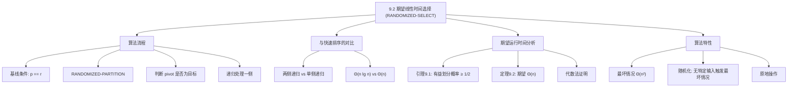
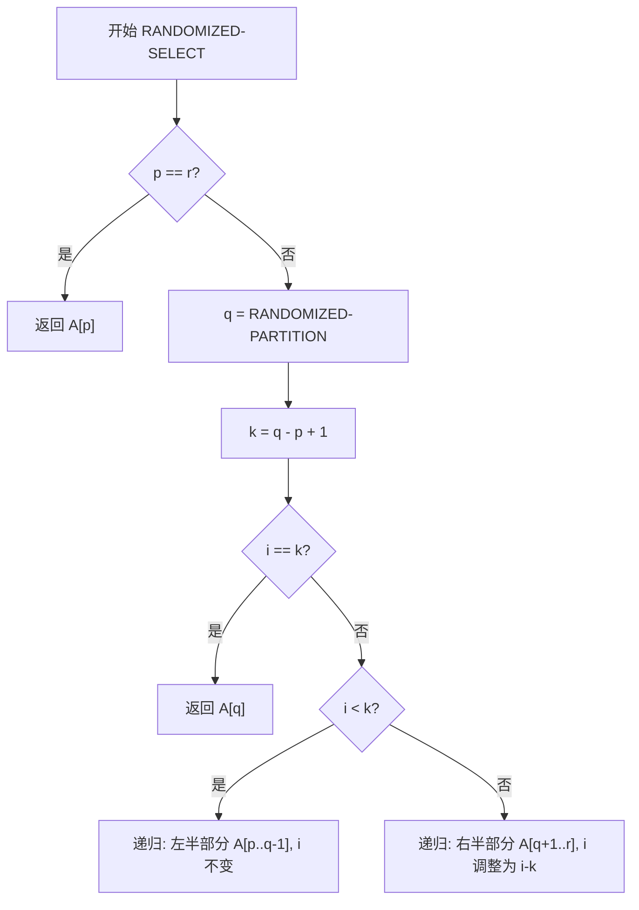

## 相关笔记

- 前置笔记：[[7.1 快速排序的描述]]（PARTITION）、[[5.2 指示器随机变量]]、[[算法导论/concepts/随机化算法]]
- 关联概念：[[算法导论/concepts/分治法]]、[[算法导论/concepts/递归关系式]]
- 后续笔记：[[9.3 最坏情况线性时间选择]]
- 章节汇总：[[第09章_中位数与序统计-章节汇总]]

> [!abstract] 概览
> 本节介绍 ==RANDOMIZED-SELECT== 算法（也称 ==Quickselect==），它是基于==快速排序==思想的选择算法。与快速排序递归处理分区两侧不同，RANDOMIZED-SELECT 每次只递归处理==一侧==，因此期望运行时间为 ==$\Theta(n)$==，而非快速排序的 $\Theta(n \lg n)$。该算法由 ==Hoare== 于1961年与快速排序同时发明。
>
> **要点列表：**
> - RANDOMIZED-SELECT 的期望运行时间为 ==$\Theta(n)$==，最坏情况为 $\Theta(n^2)$
> - 算法核心：利用 [[7.1 快速排序的描述]] 的 RANDOMIZED-PARTITION 划分数组，然后只递归处理包含目标元素的一侧
> - 期望线性时间的证明依赖于==指示器随机变量==和"有益划分"（helpful partitioning）的概念
> - 与排序后取第 $i$ 小元素相比（$O(n \lg n)$），Quickselect 在只需要单个序统计量时更高效

---

知识结构总览



---

核心思想

> [!tip] 核心思路
> RANDOMIZED-SELECT 的关键洞察在于：**选择问题只需要找到一个元素，不需要对两侧都排序**。快速排序每次划分后递归处理两侧，产生 $\Theta(n \lg n)$ 的期望时间；而选择算法每次只需递归处理**一侧**，期望递归深度为常数级，因此总期望时间为 $\Theta(n)$。
>
> 直觉类比：假设你要在一本1000页的字典中找第500个词。快速排序相当于把字典完全整理好（两侧都排），而选择算法相当于每次翻到随机一页，判断目标在左半部分还是右半部分，然后只翻那一半——平均只需翻几次就能找到。

> [!tip] 算法执行流程
> 1. **基线检查**：若 p == r，子数组只有一个元素，直接返回 A[p]
> 2. **随机划分**：调用 RANDOMIZED-PARTITION，随机选择主元 q 并划分数组
> 3. **计算排名**：k = q - p + 1，确定主元在当前子数组中的排名
> 4. **判断目标位置**：若 i == k，主元恰好是目标，返回 A[q]
> 5. **递归查找**：若 i < k 则在**左半部分**递归查找；若 i > k 则在**右半部分**递归查找（i 调整为 i - k）



### RANDOMIZED-SELECT 伪代码

```
RANDOMIZED-SELECT(A, p, r, i)
1  if p == r
2      return A[p]                      // 基线条件：只有一个元素
3  q = RANDOMIZED-PARTITION(A, p, r)   // 随机选择枢轴并划分
4  k = q - p + 1                       // 枢轴是第 k 小元素
5  if i == k
6      return A[q]                     // 枢轴恰好是目标
7  elseif i < k
8      return RANDOMIZED-SELECT(A, p, q - 1, i)       // 目标在左侧
9  else return RANDOMIZED-SELECT(A, q + 1, r, i - k)  // 目标在右侧
```

> [!def] RANDOMIZED-SELECT
> **输入：** 数组 $A[p \dots r]$（$n = r - p + 1$ 个元素），整数 $i$（$1 \leq i \leq n$）
> **输出：** $A[p \dots r]$ 中第 $i$ 小的元素
>
> **算法步骤：**
> 1. **基线条件：** 若 $p = r$，子数组只有一个元素，直接返回 $A[p]$
> 2. **划分：** 调用 `RANDOMIZED-PARTITION(A, p, r)`，随机选择枢轴并将数组划分为 $A[p \dots q-1]$ 和 $A[q+1 \dots r]$，使得 $A[p \dots q-1] \leq A[q] \leq A[q+1 \dots r]$
> 3. **判断：** 计算 $k = q - p + 1$（枢轴在当前子数组中的排名）
>    - 若 $i = k$：枢轴就是第 $i$ 小元素，返回 $A[q]$
>    - 若 $i < k$：目标在左侧子数组，递归搜索 $A[p \dots q-1]$ 中的第 $i$ 小
>    - 若 $i > k$：目标在右侧子数组，递归搜索 $A[q+1 \dots r]$ 中的第 $(i-k)$ 小

### 逐行执行逻辑详解

**第1-2行（基线条件）：**
- 当 $p = r$ 时，子数组 $A[p \dots r]$ 只包含一个元素
- 此时 $r - p + 1 = 1$，所以 $i$ 必须等于 $1$
- 直接返回 $A[p]$ 即可

**第3行（随机划分）：**
- 调用 `RANDOMIZED-PARTITION`（见 [[7.1 快速排序的描述]] 第7.3节）
- 该过程随机选择一个元素作为枢轴，将数组划分为两部分
- 返回值 $q$ 是枢轴的最终位置
- 划分后：$A[p \dots q-1] \leq A[q] \leq A[q+1 \dots r]$

**第4行（计算排名）：**
- $k = q - p + 1$ 表示枢轴 $A[q]$ 在子数组 $A[p \dots r]$ 中是第 $k$ 小的元素
- 因为 $A[p \dots q]$ 共有 $q - p + 1$ 个元素，且都 $\leq A[q]$

**第5-6行（命中检查）：**
- 若 $i = k$，说明我们要找的第 $i$ 小元素恰好就是枢轴
- 直接返回 $A[q]$

**第7-8行（左侧递归）：**
- 若 $i < k$，第 $i$ 小元素在 $A[p \dots q-1]$ 中
- 递归调用 `RANDOMIZED-SELECT(A, p, q-1, i)`
- 注意：$i$ 不变，因为我们在更小的子数组中仍然找第 $i$ 小

**第9行（右侧递归）：**
- 若 $i > k$，第 $i$ 小元素在 $A[q+1 \dots r]$ 中
- 递归调用 `RANDOMIZED-SELECT(A, q+1, r, i-k)$
- 关键：$i$ 变为 $i - k$，因为左侧有 $k$ 个比目标更小的元素已被"跳过"

### 与快速排序的对比

> [!def] RANDOMIZED-SELECT vs RANDOMIZED-QUICKSORT
>
> | 比较维度 | RANDOMIZED-SELECT | RANDOMIZED-QUICKSORT |
> |---------|-------------------|----------------------|
> | 递归策略 | 只递归处理**一侧** | 递归处理**两侧** |
> | 期望时间 | $\Theta(n)$ | $\Theta(n \lg n)$ |
> | 最坏时间 | $\Theta(n^2)$ | $\Theta(n^2)$ |
> | 输出 | 第 $i$ 小元素 | 完整排序数组 |
> | 划分过程 | 相同（RANDOMIZED-PARTITION） | 相同（RANDOMIZED-PARTITION） |
>
> **为什么只递归一侧就能从 $\Theta(n \lg n)$ 降到 $\Theta(n)$？**
>
> 快速排序的递归树深度为 $O(\lg n)$，每层总工作量为 $O(n)$，因此总时间为 $O(n \lg n)$。而 RANDOMIZED-SELECT 的递归树是一条**单链**（每次只走一侧），虽然链的期望长度不是 $O(\lg n)$，但由于每次划分后子问题期望缩小一个常数比例，总工作量形成一个**几何递减序列**，其和为 $O(n)$。

---

期望运行时间分析

### 直觉理解

> [!tip] 直觉
> 假设每次随机选择的枢轴都落在排序后数组的"中间一半"（第二和第三四分位数之间）。那么每次划分后，至少有 $1/4$ 的元素被排除在后续递归之外，最多只有 $3/4$ 的元素仍在考虑中。此时递归关系为 $T(n) = T(3n/4) + \Theta(n)$，由主定理情况3可得 $T(n) = \Theta(n)$。
>
> 实际上，枢轴不一定每次都落在中间一半。但由于枢轴是随机选择的，落在中间一半的概率约为 $1/2$。因此期望约每两次划分就能获得一次"有益划分"，期望运行时间仍为 $\Theta(n)$。

### 有益划分（Helpful Partitioning）

> [!def] 有益划分
> 定义第 $j$ 次划分后仍在考虑中的元素集合为 $A(j)$，其中 $A(0)$ 为全部元素。若一次划分满足
>
> $$|A(j)| \leq \frac{3}{4} |A(j-1)|$$
>
> 则称该划分为**有益划分**（helpful partitioning）。

### 引理 9.1：有益划分的概率

> [!def] 引理 9.1（Lemma 9.1）
> 一次划分是有益划分的概率**至少为 $1/2$**。

**证明：**

> **【充分性（中间一半 $\Rightarrow$ 有益划分）】** 枢轴落入中间一半时，至少 $\lceil n/4 \rceil$ 个元素被排除

定义 $n$ 元素子数组的"中间一半"（middle half）为：去掉最小的 $\lceil n/4 \rceil - 1$ 个元素和最大的 $\lceil n/4 \rceil - 1$ 个元素后剩余的元素集合。

**第一步：证明枢轴落入中间一半 ⇒ 有益划分。**

无论枢轴落在哪个位置，划分后要么所有大于枢轴的元素、要么所有小于枢轴的元素（连同枢轴本身）将不再被考虑。若枢轴落入中间一半，则至少有 $\lceil n/4 \rceil - 1$ 个小于枢轴的元素或 $\lceil n/4 \rceil - 1$ 个大于枢轴的元素，加上枢轴本身，至少有 $\lceil n/4 \rceil$ 个元素不再被考虑。

因此剩余元素至多为：
$$n - \lceil n/4 \rceil = \lfloor 3n/4 \rfloor \leq \frac{3n}{4}$$

所以划分是有益的。

> **【必要性（概率下界 $\ge 1/2$）】** 计算枢轴不在中间一半的概率上界

**第二步：证明枢轴落入中间一半的概率至少为 $1/2$。**

枢轴**不**落入中间一半的概率为：
$$\Pr[\text{不在中间一半}] = \frac{2(\lceil n/4 \rceil - 1)}{n} \leq \frac{2(n/4)}{n} = \frac{1}{2}$$

因此：
$$\Pr[\text{有益划分}] \geq \Pr[\text{枢轴在中间一半}] = 1 - \Pr[\text{不在中间一半}] \geq \frac{1}{2} \quad \blacksquare$$

### 定理 9.2：期望运行时间 $\Theta(n)$

> [!def] 定理 9.2（Theorem 9.2）
> RANDOMIZED-SELECT 在 $n$ 个不同元素的输入数组上的**期望运行时间**为 $\Theta(n)$。

**证明：**

> **【代分组（按有益划分分代）】** 将划分序列按有益划分分组，每代集合大小至多乘以 $3/4$

将所有划分按"有益划分"分组为**代**（generation）。设 $h_0, h_1, h_2, \ldots, h_m$ 为有益划分的索引序列，其中 $h_0 = 0$（将初始状态视为一次"虚拟"有益划分）。

定义第 $k$ 代的元素集合大小为 $n_k = |A(h_k)|$，其中 $n_0 = |A(0)|$ 为原始问题规模。由于每次有益划分后集合大小至多为原来的 $3/4$：

$$n_k \leq \left(\frac{3}{4}\right)^k n_0, \quad k = 0, 1, 2, \ldots, m$$

经过 $\lceil \log_{4/3} n \rceil$ 次有益划分后，只剩下一个元素。

> **【几何分布（期望代内划分次数 $\le 2$）】** 有益划分概率 $\ge 1/2$，期望等待次数 $\le 2$

定义随机变量 $X_k = h_{k+1} - h_k$，即第 $k$ 代中的划分次数。由引理 9.1，每次划分是有益划分的概率至少为 $1/2$，因此 $X_k$ 服从几何分布（或被其控制），期望值：

$$E[X_k] \leq 2, \quad k = 0, 1, 2, \ldots, m-1$$

**比较次数上界：** 第 $j$ 次划分将枢轴与 $|A(j-1)| - 1$ 个其他元素比较，因此比较次数少于 $|A(j-1)|$。第 $k$ 代中的集合大小至多为 $(3/4)^k n_0$，该代有 $X_k$ 次划分，因此第 $k$ 代的总比较次数少于 $X_k \cdot (3/4)^k n_0$。

> **【期望线性性质 + 无穷等比级数】** 利用 $E[\sum X_k \cdot (3/4)^k] = \sum E[X_k] \cdot (3/4)^k$ 求和

总比较次数期望值：

$$E\left[\sum_{k=0}^{m-1} X_k \cdot \left(\frac{3}{4}\right)^k n_0\right] = n_0 \sum_{k=0}^{m-1} \left(\frac{3}{4}\right)^k \cdot E[X_k] \leq 2n_0 \sum_{k=0}^{\infty} \left(\frac{3}{4}\right)^k = 2n_0 \cdot \frac{1}{1 - 3/4} = 8n_0$$

因此期望比较次数为 $O(n)$。又因为第一次 RANDOMIZED-PARTITION 就需要检查所有 $n$ 个元素，下界为 $\Omega(n)$。

**结论：** RANDOMIZED-SELECT 的期望运行时间为 $\Theta(n)$。$\blacksquare$

### 最坏情况分析

> [!def] 最坏情况 $\Theta(n^2)$
> RANDOMIZED-SELECT 的最坏情况发生在每次划分都极不走运——枢轴总是当前子数组的最大或最小元素。此时每次递归只排除一个元素（枢轴本身），递归关系为：
>
> $$T(n) = T(n-1) + \Theta(n)$$
>
> 解为 $T(n) = \Theta(n^2)$。
>
> **但注意：** 由于算法是**随机化**的，没有特定输入会始终触发最坏情况行为。对任何固定输入，期望运行时间都是 $\Theta(n)$。

---

补充理解与拓展

> [!info] Quickselect 的工程应用与历史
>
> Quickselect（RANDOMIZED-SELECT）由 **Tony Hoare** 于1961年在其经典论文 *"Quicksort"*（Computer Journal, Vol. 5, pp. 10-16）中与快速排序同时提出，也称为 **"Hoare's selection algorithm"**。该算法是选择问题在实际工程中最广泛使用的解决方案。
>
> **主要工程应用：**
>
> | 应用场景 | 实现方式 | 说明 |
> |---------|---------|------|
> | C++ STL | `std::nth_element` | 标准库直接提供，通常基于 Introselect（Quickselect + BFPRT 的混合策略） |
> | Python | `statistics.median` | 对小数组使用排序，对大数组可能使用 Quickselect 变体 |
> | 数据库引擎 | MEDIAN 聚合函数 | PostgreSQL、MySQL 等使用 Quickselect 或其变体计算中位数 |
> | 流处理 | 近似中位数算法 | Greenwald-Khanna (2001) 提出的单遍近似中位数算法，适用于无法存储全部数据的数据流场景 |
>
> **Quickselect vs 排序后取第 $i$ 个：**
> - 排序需要 $O(n \lg n)$，Quickselect 期望 $O(n)$
> - 当只需要**一个**序统计量时，Quickselect 更高效
> - 当需要**多个**序统计量或完整排序时，直接排序更合适
>
> 来源：Hoare, C.A.R., "Quicksort", Computer Journal, 1962; Musser, D.R., "Introspective Sorting and Selection Algorithms", Software: Practice and Experience, 1997; Greenwald & Khanna, "Space-efficient online computation of quantile summaries", SIGMOD 2001

> [!info] 指示器随机变量技术——期望分析的核心工具
>
> 定理 9.2 的证明使用了与 [[5.2 指示器随机变量]] 和 [[7.1 快速排序的描述]] 第7.4节相同的分析技术——**指示器随机变量**（indicator random variable）。该技术是分析随机化算法期望运行时间的核心工具。
>
> **技术要点：**
> 1. 将随机事件映射为指示器随机变量 $I_j \in \{0, 1\}$
> 2. 利用期望的线性性质：$E\left[\sum I_j\right] = \sum E[I_j]$
> 3. 每个指示器的期望等于对应事件发生的概率：$E[I_j] = \Pr[\text{事件 } j]$
>
> **在 RANDOMIZED-SELECT 分析中的具体应用：**
> - 定义 $X_k$ 为第 $k$ 代中的划分次数（几何分布随机变量）
> - 利用 $E[X_k] \leq 2$（因为有益划分概率 $\geq 1/2$）
> - 将总比较次数表示为 $\sum X_k \cdot (3/4)^k n_0$，利用期望线性性求和
>
> 这一技术也广泛应用于：
> - 快速排序期望比较次数分析（第7.4节）
> - 散列表期望查找时间分析（第11章）
> - 跳表期望搜索时间分析
>
> 来源：Cormen et al., *Introduction to Algorithms*, 4th ed., Section 5.2; Motwani & Raghavan, *Randomized Algorithms*, Cambridge University Press, 1995

---

易混淆点与辨析

> [!warning] 误区：RANDOMIZED-SELECT 的最坏情况 $\Theta(n^2)$ 意味着它不可靠
> ❌ **错误理解：** "RANDOMIZED-SELECT 最坏情况是 $\Theta(n^2)$，和直接排序差不多，还不如排序后取第 $i$ 个"
>
> ✅ **正确理解：** RANDOMIZED-SELECT 是**随机化算法**，最坏情况 $\Theta(n^2)$ 只在极端不走运时发生，概率极低。对**任何固定输入**，期望运行时间都是 $\Theta(n)$。不存在特定输入能始终触发最坏情况。
>
> **对比：** 非随机化的选择算法（如每次选第一个元素作枢轴）确实存在特定输入（如已排序数组）会始终触发最坏情况。随机化的优势在于**将最坏情况从"输入依赖"变为"概率事件"**。
>
> 如果需要**确定性**的最坏情况 $\Theta(n)$ 保证，应使用 [[9.3 最坏情况线性时间选择]] 中的 SELECT 算法。

> [!warning] 误区：RANDOMIZED-SELECT 递归调用可能传入空数组
> ❌ **错误理解：** "当 $i < k$ 时递归调用 `RANDOMIZED-SELECT(A, p, q-1, i)`，如果 $q = p$ 则传入空数组，会出错"
>
> ✅ **正确理解：** RANDOMIZED-SELECT **永远不会**对空数组进行递归调用。
>
> **证明：** 若 $q = p$，则 $k = q - p + 1 = 1$。此时第5行检查 $i == k$ 即 $i == 1$，直接返回 $A[q]$，不会进入第7-9行的递归分支。类似地，若 $q = r$，则 $k = r - p + 1 = n$，此时 $i \leq n = k$，不会进入 $i > k$ 的分支。因此递归调用的子数组始终至少包含一个元素。

---

习题精选

| 题号 | 题目描述 | 难度 |
|:---:|----------|:---:|
| 9.2-1 | 证明 RANDOMIZED-SELECT 永远不会对空数组进行递归调用 | ⭐ |
| 9.2-2 | 写出 RANDOMIZED-SELECT 的迭代版本 | ⭐⭐ |
| 9.2-3 | 描述一个使 RANDOMIZED-SELECT 在数组 $A = \langle 2, 3, 0, 5, 7, 9, 1, 8, 6, 4 \rangle$ 上产生最坏情况性能的划分序列 | ⭐⭐ |
| 9.2-4 | 论证 RANDOMIZED-SELECT 的期望运行时间不依赖于输入数组中元素的排列顺序 | ⭐⭐⭐ |

> [!faq]- 9.2-1 解答
> **目标：** 证明 RANDOMIZED-SELECT 永远不会对空数组进行递归调用。
>
> **证明：**
>
> > **【情况分析（两个递归调用点）】** 分别验证第8行和第9行递归调用不会传入空数组
>
> RANDOMIZED-SELECT 有两个递归调用点：
> - 第8行：`RANDOMIZED-SELECT(A, p, q-1, i)`（当 $i < k$ 时）
> - 第9行：`RANDOMIZED-SELECT(A, q+1, r, i-k)`（当 $i > k$ 时）
>
> **情况一：第8行的递归调用。** 此时 $i < k = q - p + 1$，即 $i \leq q - p$。由于 $i \geq 1$，有 $q - p \geq 1$，即 $q \geq p + 1$。因此子数组 $A[p \dots q-1]$ 至少包含 $q - p \geq 1$ 个元素，不会为空。
>
> **情况二：第9行的递归调用。** 此时 $i > k = q - p + 1$，即 $i \geq q - p + 2$。由于 $i \leq r - p + 1$，有 $r - p + 1 \geq q - p + 2$，即 $r \geq q + 1$。因此子数组 $A[q+1 \dots r]$ 至少包含 $r - q \geq 1$ 个元素，不会为空。
>
> **结论：** RANDOMIZED-SELECT 永远不会对空数组进行递归调用。$\blacksquare$

> [!faq]- 9.2-3 解答
> **目标：** 描述使 RANDOMIZED-SELECT 产生最坏情况 $\Theta(n^2)$ 的划分序列。
>
> **分析：** 最坏情况发生在每次划分都只排除一个元素（枢轴本身）。假设我们要找最小元素（$i = 1$）。
>
> 对数组 $A = \langle 2, 3, 0, 5, 7, 9, 1, 8, 6, 4 \rangle$，最坏情况划分序列为：
>
> 1. **第一次划分：** 枢轴选为 $9$（最大元素），划分后 $A[p \dots q-1] = \langle 2, 3, 0, 5, 7, 1, 8, 6, 4 \rangle$，$k = 10$。$i = 1 < 10$，递归左侧。
> 2. **第二次划分：** 枢轴选为 $8$（左侧子数组最大元素），划分后排除 $8$，递归剩余 8 个元素。
> 3. **第三次划分：** 枢轴选为 $7$，递归剩余 7 个元素。
> 4. **第四次划分：** 枢轴选为 $6$，递归剩余 6 个元素。
> 5. **第五次划分：** 枢轴选为 $5$，递归剩余 5 个元素。
> 6. **第六次划分：** 枢轴选为 $4$，递归剩余 4 个元素。
> 7. **第七次划分：** 枢轴选为 $3$，递归剩余 3 个元素。
> 8. **第八次划分：** 枢轴选为 $2$，递归剩余 2 个元素。
> 9. **第九次划分：** 枢轴选为 $1$，递归剩余 1 个元素。
> 10. 返回 $0$（最小元素）。
>
> 每次只排除一个元素，总比较次数为 $9 + 8 + 7 + \cdots + 1 = 45 = \Theta(n^2)$。
>
> **注意：** 由于 RANDOMIZED-PARTITION 是随机选择枢轴的，这种最坏情况序列发生的概率极低（$(1/n) \cdot (1/(n-1)) \cdots (1/1) = 1/n!$），实际中几乎不会遇到。

> [!faq]- 9.2-4 解答
> **目标：** 证明 RANDOMIZED-SELECT 的期望运行时间不依赖于输入数组中元素的排列顺序。
>
> **证明（对输入长度 $n$ 进行数学归纳）：**
>
> > **【归纳法（基础步 $n=1$ + 归纳步）】** 对输入长度 $n$ 归纳，证明期望时间与排列无关
>
> **基础情况（$n = 1$）：** 当 $p = r$ 时，算法直接返回 $A[p]$，运行时间为 $\Theta(1)$，与元素值无关。
>
> **归纳假设：** 对所有长度小于 $n$ 的子数组，RANDOMIZED-SELECT 的期望运行时间相同，不依赖于元素的排列顺序。
>
> > **【均匀随机选择（排列无关性）】** 枢轴均匀随机选取，期望时间对所有排列相同
>
> **归纳步骤：** 考虑长度为 $n$ 的子数组 $A[p \dots r]$。
>
> RANDOMIZED-PARTITION 首先从 $A[p \dots r]$ 中**均匀随机**选择一个元素作为枢轴。无论输入数组如何排列，每个位置上的元素被选为枢轴的概率都是 $1/n$。
>
> 设 $T_\pi(n)$ 为输入排列为 $\pi$ 时的期望运行时间。则：
>
> $$T_\pi(n) = \frac{1}{n} \sum_{j=0}^{n-1} \left( \Theta(n) + T_{\pi_j}^{(L)}(\max(j, 0)) + T_{\pi_j}^{(R)}(\max(n-1-j, 0)) \right)$$
>
> 其中 $\pi_j$ 表示枢轴为第 $j$ 小元素时的排列，$T^{(L)}$ 和 $T^{(R)}$ 分别是左右子问题的运行时间。
>
> 由归纳假设，$T_{\pi_j}^{(L)}$ 和 $T_{\pi_j}^{(R)}$ 不依赖于具体排列。因此 $T_\pi(n)$ 对所有排列 $\pi$ 都相同。$\blacksquare$

---

视频学习指南

| 资源 | 主题 | 链接 | 说明 |
|:-----|:-----|:-----|:-----|
| MIT 6.006 Lecture 6 | Selection Sort, Quickselect | https://www.youtube.com/watch?v=8BiVbP15G1o | MIT 公开课，讲解 Quickselect 的核心思想与期望分析 |
| Abdul Bari | Quick Select Algorithm | https://www.youtube.com/watch?v=FN4wGLBiAOQ | 逐步动画演示 Quickselect 的执行过程，适合初学者 |
| NeetCode | Quick Select | https://www.youtube.com/watch?v=XEmy13g1Qxc | LeetCode 实战视角，含代码实现 |
| WilliamFiset | Quickselect | https://www.youtube.com/watch?v=u9N_aPCQDE4 | 算法系列教程，含复杂度分析 |
| CS Dojo | Quickselect in Python | https://www.youtube.com/watch?v=A3Z8Lz8mxgo | Python 实现，适合编程练习 |

---

教材原文

> [!quote] CLRS 第4版 9.2节原文
> The general selection problem—finding the $i$th order statistic for any value of $i$—appears more difficult than the simple problem of finding a minimum. Yet, surprisingly, the asymptotic running time for both problems is the same: $\Theta(n)$. This section presents a divide-and-conquer algorithm for the selection problem. The algorithm RANDOMIZED-SELECT is modeled after the quicksort algorithm of Chapter 7. Like quicksort it partitions the input array recursively. But unlike quicksort, which recursively processes both sides of the partition, RANDOMIZED-SELECT works on only one side of the partition. This difference shows up in the analysis: whereas quicksort has an expected running time of $\Theta(n \lg n)$, the expected running time of RANDOMIZED-SELECT is $\Theta(n)$, assuming that the elements are distinct.

---

## 参见Wiki

- [[算法导论/concepts/Quickselect]] — 期望线性时间选择算法

#学习/算法导论/第09章-中位数与序统计 #学习/算法导论/选择算法/随机化选择
