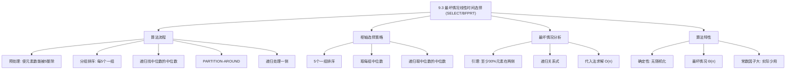
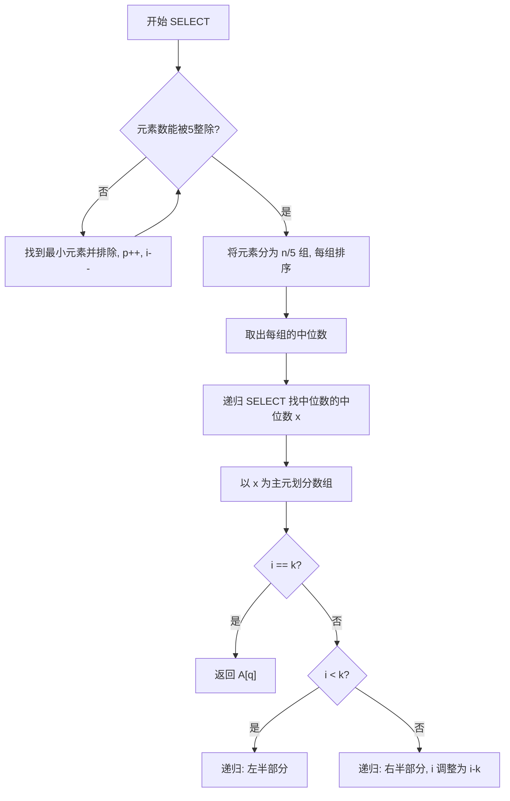

## 相关笔记

- 前置笔记：[[9.2 期望线性时间选择]]、[[7.1 快速排序的描述]]（PARTITION）、[[算法导论/concepts/分治法]]
- 关联概念：[[算法导论/concepts/递归关系式]]、[[算法导论/concepts/随机化算法]]
- 章节汇总：[[第09章_中位数与序统计-章节汇总]]

> [!abstract] 概览
> 本节介绍 ==SELECT== 算法（也称 ==BFPRT== 算法），它能在==最坏情况==下以 ==$\Theta(n)$== 时间找到第 $i$ 小元素。与 [[9.2 期望线性时间选择]] 的 RANDOMIZED-SELECT 不同，SELECT 通过**确定性**地选择一个"好"的枢轴（==中位数的中位数==）来保证每次划分都能有效缩小问题规模。该算法由 ==Blum、Floyd、Pratt、Rivest、Tarjan== 五位计算机科学家于1973年提出。
>
> **要点列表：**
> - SELECT 的最坏情况运行时间为 ==$\Theta(n)$==，是确定性的（非随机化）
> - 核心技巧：将数组分为 $\lceil n/5 \rceil$ 组，每组5个元素，取每组中位数，再取这些中位数的中位数作为枢轴
> - 关键保证：枢轴两侧各有**至少 30%** 的元素，确保递归子问题规模至多为 $7n/10$
> - 递归关系式 $T(n) \leq T(\lceil n/5 \rceil) + T(7n/10 + 6) + O(n)$，解为 $T(n) = O(n)$
> - 实际中因常数因子大而较少直接使用，但理论价值极高

---

知识结构总览



---

核心思想

> [!tip] 核心思路
> RANDOMIZED-SELECT 的最坏情况 $\Theta(n^2)$ 源于枢轴选择可能极差。SELECT 的解决思路是：**用递归的方式找到一个确定性"好"的枢轴**。具体策略是将数组分成每组5个元素，取每组中位数，再递归地取这些中位数的中位数。这个"中位数的中位数"保证了至少有30%的元素在枢轴的每一侧，从而确保最坏情况下递归子问题的规模至多为 $7n/10$。
>
> 直觉类比：假设你要在1000人中找到第500名（中位数）。你先让每5人一组排好队，取每组的第3名（中位数），得到200个"小组代表"。再从这200个代表中找到第100名（代表的中位数）。这个代表的中位数虽然不一定是1000人的真正中位数，但你能**保证**至少有300人比它小、至少有300人比它大——无论原始数据如何分布。

> [!tip] 算法执行流程
> 1. **预处理**：通过 while 循环使元素数能被 5 整除（最多排除 4 个最小元素）
> 2. **分组排序**：将 n 个元素划分为 n/5 组，每组 5 个，对每组排序
> 3. **取中位数**：取出每组的中位数
> 4. **递归选主元**：递归调用 SELECT 找出中位数的中位数 x
> 5. **划分**：以 x 为主元调用 PARTITION-AROUND 划分数组
> 6. **递归查找**：根据 k 与主元位置的关系，在左半或右半部分递归查找



### SELECT 完整伪代码

```
SELECT(A, p, r, i)
 1  while (r - p + 1) mod 5 ≠ 0
 2      for j = p + 1 to r              // 将最小元素放到 A[p]
 3          if A[p] > A[j]
 4              exchange A[p] with A[j]
 5      if i == 1                        // 如果要找最小值
 6          return A[p]
 7      p = p + 1                        // 排除最小值
 8      i = i - 1
 9  g = (r - p + 1) / 5                  // 5元素组的组数
10  for j = p to p + g - 1               // 对每组排序
11      sort ⟨A[j], A[j+g], A[j+2g], A[j+3g], A[j+4g]⟩ in place
12  // 所有组的中位数现在位于 A[p+2g : p+3g-1]
13  // 递归地找中位数的中位数作为枢轴
14  x = SELECT(A, p + 2g, p + 3g - 1, ⌈g/2⌉)
15  q = PARTITION-AROUND(A, p, r, x)     // 围绕枢轴划分
16  // 以下与 RANDOMIZED-SELECT 的第3-9行相同
17  k = q - p + 1
18  if i == k
19      return A[q]                      // 枢轴就是目标
20  elseif i < k
21      return SELECT(A, p, q - 1, i)    // 目标在左侧
22  else return SELECT(A, q + 1, r, i - k)  // 目标在右侧
```

> [!def] SELECT
> **输入：** 数组 $A[p \dots r]$（$n = r - p + 1$ 个元素），整数 $i$（$1 \leq i \leq n$）
> **输出：** $A[p \dots r]$ 中第 $i$ 小的元素
>
> **算法步骤：**
> 1. **预处理（第1-8行）：** 通过 while 循环使元素数能被5整除（最多执行4次），每次将最小元素放到 $A[p]$ 并排除
> 2. **分组排序（第9-11行）：** 将元素分为 $g = (r-p+1)/5$ 组，每组5个元素，用插入排序将每组排好序
> 3. **选择枢轴（第14行）：** 递归调用 SELECT 找到 $g$ 个组中位数的中位数 $x$
> 4. **划分（第15行）：** 调用 PARTITION-AROUND 围绕 $x$ 划分数组
> 5. **递归搜索（第17-22行）：** 与 RANDOMIZED-SELECT 相同，判断枢轴是否为目标，否则递归处理一侧

### 逐行执行逻辑详解

**第1-8行（预处理——使元素数能被5整除）：**

while 循环检查 $(r - p + 1) \bmod 5 \neq 0$，即当前子数组的元素数不能被5整除。每次迭代：
- 第2-4行：遍历 $A[p+1 \dots r]$，将最小元素交换到 $A[p]$
- 第5-6行：如果 $i = 1$（要找最小值），直接返回 $A[p]$
- 第7-8行：否则排除最小值，$p$ 加1，$i$ 减1

该循环最多执行4次（因为任何数模5的余数在0-4之间），因此是 $O(1)$ 次迭代。

**第9-11行（分组排序）：**

- 第9行：计算组数 $g = (r - p + 1) / 5$（此时元素数已能被5整除）
- 第10-11行：对每组排序。第 $j$ 组的5个元素为 $A[j], A[j+g], A[j+2g], A[j+3g], A[j+4g]$
- 排序后每组满足：$A[j] \leq A[j+g] \leq A[j+2g] \leq A[j+3g] \leq A[j+4g]$
- 每组用插入排序，耗时 $\Theta(1)$（因为只有5个元素），共 $g$ 组，总时间 $\Theta(g) = \Theta(n)$

**第14行（递归选择枢轴）：**

- 每组的中位数是 $A[j + 2g]$（5个元素中的第3个）
- 所有组的中位数位于 $A[p + 2g \dots p + 3g - 1]$
- 递归调用 `SELECT(A, p + 2g, p + 3g - 1, ⌈g/2⌉)` 找到这些中位数的中位数 $x$
- 这就是著名的**"中位数的中位数"**（median of medians）

**第15行（围绕枢轴划分）：**

- `PARTITION-AROUND(A, p, r, x)` 类似 [[7.1 快速排序的描述]] 的 PARTITION，但以指定元素 $x$ 为枢轴
- 返回枢轴的最终位置 $q$，使得 $A[p \dots q] \leq x \leq A[q \dots r]$

**第17-22行（递归搜索）：**

与 [[9.2 期望线性时间选择]] 的 RANDOMIZED-SELECT 完全相同：
- 计算 $k = q - p + 1$（枢轴排名）
- 若 $i = k$：返回枢轴
- 若 $i < k$：递归左侧
- 若 $i > k$：递归右侧（注意 $i$ 变为 $i - k$）

### PARTITION-AROUND 说明

> [!def] PARTITION-AROUND
> `PARTITION-AROUND(A, p, r, x)` 是 PARTITION 的变体，以**指定元素** $x$ 为枢轴进行划分（而非默认使用 $A[r]$）。
>
> **实现方式：** 先找到 $x$ 在 $A[p \dots r]$ 中的位置，将其与 $A[r]$ 交换，然后执行标准的 PARTITION 过程。
>
> **返回值：** 枢轴 $x$ 的最终位置 $q$，使得 $A[p \dots q-1] \leq A[q] = x \leq A[q+1 \dots r]$。
>
> **时间复杂度：** $\Theta(n)$，与 PARTITION 相同。

---

最坏情况运行时间分析

### 枢轴质量保证——至少30%元素在两侧

> [!def] 引理（枢轴两侧的元素数量）
> 设 SELECT 选择枢轴 $x$ 为中位数的中位数，$g$ 为5元素组的组数。则：
> - 至少有 $3\lceil g/2 \rceil \geq 3g/2$ 个元素 $\geq x$（黄色区域）
> - 至少有 $3(\lfloor g/2 \rfloor + 1) \geq 3g/2$ 个元素 $\leq x$（蓝色区域）
>
> 因此，划分后**每一侧**的子数组至多包含 $7g/2 \leq 7n/10$ 个元素。

**证明：**

> **【分组计数（$\geq x$ 的元素）】** 至少 $\lfloor g/2 \rfloor + 1$ 组的中位数 $\geq x$，每组贡献 $\geq 3$ 个元素

考虑图9.3所示的元素关系。有 $g$ 组，每组5个元素已排好序。

**黄色区域（$\geq x$ 的元素）：**
- $x$ 是 $g$ 个组中位数的中位数，因此至少有 $\lfloor g/2 \rfloor + 1$ 个组的中位数 $\geq x$
- 对于每个中位数 $\geq x$ 的组，该组中至少有3个元素 $\geq$ 其中位数（中位数本身及其上方两个元素）
- 因此至少有 $3(\lfloor g/2 \rfloor + 1) \geq 3g/2$ 个元素 $\geq x$

> **【分组计数（$\leq x$ 的元素）】** 对称地，至少 $3\lceil g/2 \rceil \geq 3g/2$ 个元素 $\leq x$

**蓝色区域（$\leq x$ 的元素）：**
- 至少有 $\lceil g/2 \rceil$ 个组的中位数 $\leq x$
- 对于每个中位数 $\leq x$ 的组，该组中至少有3个元素 $\leq$ 其中位数（中位数本身及其下方两个元素）
- 因此至少有 $3\lceil g/2 \rceil \geq 3g/2$ 个元素 $\leq x$

> **【两侧子问题规模上界（$7n/10$）】** 排除保证元素后，每侧至多 $7g/2 \leq 7n/10$ 个元素

**两侧子问题规模上界：**
- 总元素数为 $5g$
- 低侧（$\leq x$）排除黄色区域的元素，至多有 $5g - 3g/2 = 7g/2 \leq 7n/10$ 个元素
- 高侧（$\geq x$）排除蓝色区域的元素，同样至多有 $7n/10$ 个元素 $\blacksquare$

### 递归关系式的建立

> [!def] 递归关系式
> 定义 $T(n)$ 为 SELECT 在至多 $n$ 个元素的输入上的最坏情况运行时间。$T(n)$ 单调不减。
>
> **非递归部分：**
> - while 循环（第1-8行）：$O(1)$ 次迭代，每次 $\Theta(n)$，共 $O(n)$
> - 分组排序（第10-11行）：$g$ 组，每组 $\Theta(1)$，共 $\Theta(n)$
> - PARTITION-AROUND（第15行）：$\Theta(n)$
> - 其他簿记操作：$\Theta(1)$
> - **合计：** $\Theta(n)$
>
> **递归部分：**
> - 找枢轴（第14行）：$T(g) \leq T(n/5)$（因为 $g \leq n/5$ 且 $T$ 单调不减）
> - 递归搜索（第21或22行）：至多 $T(7n/10)$（由上面的引理）
>
> **完整递归关系式：**
>
> $$T(n) \leq T(\lceil n/5 \rceil) + T(7n/10 + 6) + O(n)$$

### 代入法求解 $T(n) = O(n)$

> [!def] 定理 9.3（Theorem 9.3）
> SELECT 在 $n$ 个元素输入上的运行时间为 $\Theta(n)$。

**证明：**

> **【代入法（猜测 $T(n) \leq cn$）】** 假设线性上界，代入递归关系式验证

用**代入法**（substitution method）证明 $T(n) \leq cn$，其中 $c$ 是足够大的正常数。

**归纳假设：** 对所有 $m < n$，有 $T(m) \leq cm$。

> **【归纳步骤（代入递归式）】** 将 $T(m) \leq cm$ 代入 $T(n/5) + T(7n/10) + O(n)$

**归纳步骤：** 假设 $n \geq 5$，将归纳假设代入递归关系式：

$$T(n) \leq T(\lceil n/5 \rceil) + T(7n/10 + 6) + O(n)$$
$$\leq c \cdot \lceil n/5 \rceil + c \cdot (7n/10 + 6) + O(n)$$
$$\leq c \cdot \frac{n}{5} + c \cdot \frac{7n}{10} + 6c + O(n)$$
$$= \frac{2cn}{10} + \frac{7cn}{10} + 6c + O(n)$$
$$= \frac{9cn}{10} + 6c + O(n)$$
$$= cn - \frac{cn}{10} + 6c + O(n)$$

> **【选取常数 $c$（$9/10 < 1$ 保证收敛）】** $cn/10$ 的"余量"吸收低阶项

要使 $T(n) \leq cn$，需要：

$$-\frac{cn}{10} + 6c + O(n) \leq 0$$
$$\frac{cn}{10} \geq 6c + O(n)$$

当 $c$ 足够大，使得 $c/10$ 主导 $O(n)$ 中的常数时，该不等式成立。

**基础情况：** 选择 $c$ 足够大，使得对所有 $n \leq 4$（即 $n < 5$，SELECT 内部递归的基础情况），$T(n) \leq cn$ 成立。

**下界：** 第11行的分组排序本身就需要 $\Theta(n)$ 时间，因此 $T(n) = \Omega(n)$。

**结论：** $T(n) = \Theta(n)$。$\blacksquare$

### 为什么选择5作为组的大小？

> [!tip] 组大小选择的分析
> 选择组大小为5是算法设计中的一个精妙平衡：
>
> | 组大小 $k$ | 排序每组耗时 | 递归找中位数耗时 | 每侧保证的元素比例 | 递归关系 |
> |:---:|:---:|:---:|:---:|:---:|
> | 3 | $O(1)$ | $T(n/3)$ | $\geq 2n/6 = n/3$ | $T(n) \leq T(n/3) + T(2n/3) + O(n)$ → $\Theta(n \lg n)$ ❌ |
> | 5 | $O(1)$ | $T(n/5)$ | $\geq 3n/10$ | $T(n) \leq T(n/5) + T(7n/10) + O(n)$ → $\Theta(n)$ ✅ |
> | 7 | $O(1)$ | $T(n/7)$ | $\geq 4n/14 = 2n/7$ | $T(n) \leq T(n/7) + T(5n/7) + O(n)$ → $\Theta(n)$ ✅ |
>
> **关键观察：** 组大小为3时，$1/3 + 2/3 = 1$，不满足主定理情况3的条件（需要严格小于1），因此无法保证线性时间。组大小为5时，$1/5 + 7/10 = 9/10 < 1$，可以保证线性时间。
>
> 组大小为5是满足线性时间保证的**最小**奇数，这使得排序每组的开销最小化（偶数组的中位数定义不够直接）。

---

补充理解与拓展

> [!info] BFPRT 算法的历史与五位图灵奖级别的作者
>
> SELECT 算法由五位计算机科学家于1973年在论文 *"Time Bounds for Selection"*（Journal of Computer and System Sciences, Vol. 7, pp. 448-461）中提出，因此得名 **BFPRT**（取五位作者姓氏首字母）：
>
> | 作者 | 主要贡献 | 后续荣誉 |
> |:-----|:---------|:---------|
> | **Manuel Blum** | 计算复杂性理论先驱 | 图灵奖（1995年） |
> | **Robert Floyd** | Floyd-Warshall 算法、堆排序分析 | 图灵奖（1978年） |
> | **Vaughan Pratt** | Pratt 素性测试、Knuth-Morris-Pratt 算法 | — |
> | **Ronald Rivest** | RSA 加密算法、CLRS 合著者 | 图灵奖（2002年） |
> | **Robert Tarjan** | Tarjan SCC 算法、LCA、Splay Tree | 图灵奖（1986年） |
>
> 一篇论文中有三位图灵奖得主，这在计算机科学史上极为罕见。BFPRT 的理论意义在于：它**证明了选择问题可以在最坏情况下线性时间内解决**，这一结果与排序问题的 $\Omega(n \lg n)$ 下界形成鲜明对比，说明选择问题本质上比排序问题"更容易"。
>
> 来源：Blum, Floyd, Pratt, Rivest, Tarjan, "Time Bounds for Selection", JCSS, 1973

> [!info] Introselect——工程实践中的最优策略
>
> 虽然 BFPRT 保证了最坏情况 $\Theta(n)$，但其常数因子约为 Quickselect 的 **5-10倍**，在实际工程中很少直接使用。**Introselect**（Musser, 1997）巧妙地结合了两者的优势：
>
> **Introselect 策略：**
> 1. 先使用 Quickselect（[[9.2 期望线性时间选择]]），期望运行快
> 2. 监控递归深度；如果深度超过阈值（如 $c \cdot \lg n$），说明可能遇到最坏情况
> 3. 切换到 BFPRT 的枢轴选择策略，保证最坏情况线性时间
>
> **实际应用：**
> - C++ STL 的 `std::nth_element` 通常使用 Introselect 而非纯 Quickselect
> - 许多标准库实现中，Introselect 的性能接近 Quickselect，同时具有 BFPRT 的最坏情况保证
> - 这种"先用快速方法，遇到退化时切换到安全方法"的思想也体现在 **Introsort**（快速排序 + 堆排序的混合）中
>
> **性能对比（典型场景）：**
>
> | 算法 | 期望时间 | 最坏时间 | 常数因子 |
> |:-----|:---------|:---------|:---------|
> | Quickselect | $O(n)$ | $O(n^2)$ | 小（约1x） |
> | BFPRT | $O(n)$ | $O(n)$ | 大（约5-10x） |
> | Introselect | $O(n)$ | $O(n)$ | 小（约1-2x） |
>
> 来源：Musser, D.R., "Introspective Sorting and Selection Algorithms", Software: Practice and Experience, Vol. 27(8), 1997

---

易混淆点与辨析

> [!warning] 误区：SELECT 比 RANDOMIZED-SELECT 总是更好
> ❌ **错误理解：** "SELECT 的最坏情况是 $\Theta(n)$，RANDOMIZED-SELECT 的最坏情况是 $\Theta(n^2)$，所以 SELECT 总是更好的选择"
>
> ✅ **正确理解：** SELECT 的**最坏情况**确实优于 RANDOMIZED-SELECT，但 SELECT 的**常数因子**远大于 RANDOMIZED-SELECT（约5-10倍）。在绝大多数实际场景中，RANDOMIZED-SELECT（或 Introselect）的**期望性能**远优于 SELECT。
>
> **选择建议：**
> - **一般情况：** 使用 RANDOMIZED-SELECT 或 Introselect（如 `std::nth_element`）
> - **需要确定性保证：** 使用 SELECT（如实时系统中有严格延迟上界要求）
> - **理论分析：** SELECT 的价值在于证明选择问题可以在最坏情况线性时间内解决
>
> 这类似于快速排序 vs 堆排序的关系：快速排序期望更快，但堆排序有更好的最坏情况保证。

> [!warning] 误区：中位数的中位数就是全局中位数
> ❌ **错误理解：** "中位数的中位数（median of medians）就是数组的中位数，所以 SELECT 总是能一步到位"
>
> ✅ **正确理解：** 中位数的中位数**不一定是**全局中位数。它只是一个**保证质量**的枢轴——我们只能保证至少有30%的元素在它每一侧，而非精确的50%。
>
> **具体例子：** 考虑数组 $\langle 1, 2, 3, 4, 5, 6, 7, 8, 9, 10, 11, 12, 13, 14, 15 \rangle$（已排序）。
> - 分为3组：$\{1,2,3,4,5\}, \{6,7,8,9,10\}, \{11,12,13,14,15\}$
> - 组中位数：$3, 8, 13$
> - 中位数的中位数：$8$
> - 全局中位数也是 $8$（巧合）
>
> 但对于数组 $\langle 1, 1, 1, 1, 1, 1, 1, 1, 1, 1, 1, 1, 1, 1, 100 \rangle$：
> - 分为3组：$\{1,1,1,1,1\}, \{1,1,1,1,1\}, \{1,1,1,1,100\}$
> - 组中位数：$1, 1, 1$
> - 中位数的中位数：$1$
> - 全局中位数也是 $1$（仍然是巧合，但枢轴质量差——几乎所有元素都 $\geq$ 枢轴）
>
> 关键在于：虽然中位数的中位数不精确，但**30%的保证足以推导出线性时间**。

---

习题精选

| 题号 | 题目描述 | 难度 |
|:---:|----------|:---:|
| 9.3-1 | 证明 SELECT 在组大小为7时仍为线性时间 | ⭐⭐ |
| 9.3-2 | 用基础情况替代预处理，分析修改后的递归关系式 | ⭐⭐ |
| 9.3-3 | 使用 SELECT 作为子程序使快速排序最坏情况 $O(n \lg n)$ | ⭐⭐⭐ |
| 9.3-5 | 证明5元素集合的中位数可用6次比较找到 | ⭐⭐ |
| 9.3-7 | 油管道问题：线性时间确定最优管道位置 | ⭐⭐⭐ |

> [!faq]- 9.3-1 解答
> **目标：** 证明 SELECT 在组大小为7时仍在线性时间内工作。
>
> **分析：**
>
> 将元素分为 $\lceil n/7 \rceil$ 组，每组7个元素，取每组中位数，再递归取中位数的中位数。
>
> **枢轴质量分析：**
> - $x$ 是 $\lceil n/7 \rceil$ 个组中位数的中位数
> - 至少有 $\lfloor \lceil n/7 \rceil / 2 \rfloor + 1$ 个组的中位数 $\geq x$
> - 每个这样的组中至少有4个元素 $\geq$ 其中位数（中位数本身及其上方3个元素）
> - 因此至少有 $4(\lfloor \lceil n/7 \rceil / 2 \rfloor + 1) \geq 2\lceil n/7 \rceil$ 个元素 $\geq x$
>
> **递归关系式：**
> - 找枢轴：$T(\lceil n/7 \rceil)$
> - 递归搜索：至多 $T(n - 2\lceil n/7 \rceil) \leq T(5n/7)$
> - 非递归工作：$\Theta(n)$（每组7个元素排序仍为 $\Theta(1)$）
>
> $$T(n) \leq T(\lceil n/7 \rceil) + T(5n/7) + O(n)$$
>
> **代入法验证：** 假设 $T(n) \leq cn$：
>
> $$T(n) \leq c \cdot \frac{n}{7} + c \cdot \frac{5n}{7} + O(n) = \frac{6cn}{7} + O(n) = cn - \frac{cn}{7} + O(n)$$
>
> 当 $c$ 足够大时，$cn/7$ 主导 $O(n)$ 中的常数，因此 $T(n) \leq cn$。
>
> **结论：** 组大小为7时，SELECT 仍为 $\Theta(n)$。$\blacksquare$

> [!faq]- 9.3-3 解答
> **目标：** 使用 SELECT 作为子程序使快速排序最坏情况 $O(n \lg n)$。
>
> **算法（SELECT-QUICKSORT）：**
>
> 修改快速排序的划分步骤：不再随机选择枢轴，而是调用 SELECT 找到中位数作为枢轴。
>
> ```
> SELECT-QUICKSORT(A, p, r)
> 1  if p < r
> 2      // 使用 SELECT 找到中位数作为枢轴
> 3      median = SELECT(A, p, r, ⌊(r - p + 1) / 2⌋ + 1)
> 4      q = PARTITION-AROUND(A, p, r, median)
> 5      SELECT-QUICKSORT(A, p, q - 1)
> 6      SELECT-QUICKSORT(A, q + 1, r)
> ```
>
> **复杂度分析：**
>
> 每次划分保证枢轴为中位数，两侧子数组大小至多为 $\lceil n/2 \rceil$。递归关系式为：
>
> $$T(n) = 2T(n/2) + T(n) + O(n)$$
>
> 这里需要注意：SELECT 本身需要 $\Theta(n)$ 时间，PARTITION 也需要 $\Theta(n)$ 时间。
>
> 正确的递归关系式为：
>
> $$T(n) = 2T(n/2) + O(n) + \Theta(n) = 2T(n/2) + O(n)$$
>
> 由主定理情况2，$T(n) = O(n \lg n)$。
>
> **更精确的分析：** SELECT 调用的时间为 $\Theta(n)$，PARTITION 为 $\Theta(n)$，因此非递归部分为 $O(n)$。两侧递归各处理至多 $n/2$ 个元素。由主定理，$T(n) = O(n \lg n)$。
>
> **结论：** 使用 SELECT 选择中位数作为枢轴，快速排序的最坏情况运行时间为 $O(n \lg n)$。但注意，常数因子会很大（因为 SELECT 的常数因子大），实际中通常使用 Introselect 或随机化快速排序。$\blacksquare$

> [!faq]- 9.3-5 解答
> **目标：** 证明5元素集合的中位数可用6次比较找到。
>
> **算法：**
>
> 设5个元素为 $a, b, c, d, e$。
>
> **第一步（3次比较）：** 将5个元素组织为"锦标赛"形式。
> - 比较 $a$ vs $b$，设较小者为 $a$，较大者为 $b$
> - 比较 $c$ vs $d$，设较小者为 $c$，较大者为 $d$
> - 比较 $a$ vs $c$，设较小者为 $a$（全局最小候选），较大者为 $c$
>
> 此时已知：$a \leq b$，$c \leq d$，$a \leq c$。因此 $a$ 是全局最小值，$b$ 和 $d$ 分别是各自对中的较大者。
>
> **第二步（1次比较）：** 比较 $b$ vs $d$，设较小者为 $b$，较大者为 $d$。
>
> 此时已知：$a \leq c \leq d$，$a \leq b \leq d$。$d$ 是全局最大值或次大值。
>
> **第三步（1次比较）：** 比较 $c$ vs $b$。
>
> - 若 $c \leq b$：排序为 $a \leq c \leq b \leq d$，$e$ 待插入。还需1次比较确定 $e$ 的位置，但我们需要的是中位数。
> - 若 $b \leq c$：排序为 $a \leq b \leq c \leq d$，$e$ 待插入。
>
> **第四步（1次比较）：** 比较 $e$ 与当前第3个元素（$b$ 或 $c$），确定中位数。
>
> **总计：6次比较。** $\blacksquare$

---

视频学习指南

| 资源 | 主题 | 链接 | 说明 |
|:-----|:-----|:-----|:-----|
| MIT 6.006 Lecture 6 | Order Statistics, Median | https://www.youtube.com/watch?v=8BiVbP15G1o | MIT 公开课，讲解中位数的中位数思想 |
| Abdul Bari | Selection Sort, Quickselect | https://www.youtube.com/watch?v=FN4wGLBiAOQ | 含 BFPRT 算法的基本思路 |
| HackerRank | Median of Medians | https://www.youtube.com/watch?v=YU1HfMTEtGA | 逐步演示中位数的中位数选择过程 |
| WilliamFiset | Median of Medians | https://www.youtube.com/watch?v=YU1HfMTEtGA | 算法系列教程，含复杂度分析 |
| Tim Roughgarden | Algorithms Illuminated | https://www.youtube.com/watch?v=0vqGm_yMpdA | Stanford 教授，深入浅出讲解选择问题 |

---

教材原文

> [!quote] CLRS 第4版 9.3节原文
> We'll now examine a remarkable and theoretically interesting selection algorithm whose running time is $\Theta(n)$ in the worst case. Although the RANDOMIZED-SELECT algorithm from Section 9.2 achieves linear expected time, we saw that its running time in the worst case was quadratic. The selection algorithm presented in this section achieves linear time in the worst case, but it is not nearly as practical as RANDOMIZED-SELECT. It is mostly of theoretical interest.
>
> Like the expected linear-time RANDOMIZED-SELECT, the worst-case linear-time algorithm SELECT finds the desired element by recursively partitioning the input array. Unlike RANDOMIZED-SELECT, however, SELECT guarantees a good split by choosing a provably good pivot when partitioning the array. The cleverness in the algorithm is that it finds the pivot recursively. Thus, there are two invocations of SELECT: one to find a good pivot, and a second to recursively find the desired order statistic.

---

## 参见Wiki

- [[算法导论/concepts/BFPRT算法]] — 最坏情况线性时间选择算法

#学习/算法导论/第09章-中位数与序统计 #学习/算法导论/选择算法/最坏情况线性时间选择
