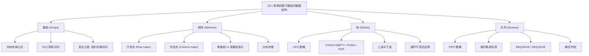

## 相关笔记

- 前置笔记：[[算法导论/concepts/数据结构]]、[[算法导论/concepts/RAM模型]]
- 关联概念：[[6.1 堆]]、[[6.5 优先队列]]
- 后续笔记：[[10.2 链表]]、[[10.3 有根树的表示]]
- 章节汇总：[[第10章_基本数据结构-章节汇总]]

> [!abstract] 概览
> 本节介绍四种最基本的基于数组的数据结构：==数组==、==矩阵==、==栈==和==队列==。数组是所有数据结构的基石，提供了 $O(1)$ 的随机访问能力；矩阵是数组的二维推广，有行优先和列优先两种存储方式；栈实现了==后进先出（LIFO）==策略；队列实现了==先进先出（FIFO）==策略。这四种结构是后续复杂数据结构（链表、树、图）的基础。
>
> **要点列表：**
> - 数组在==RAM模型==下支持 $O(1)$ 随机访问，关键公式为 $\text{addr}(A[i]) = a + b(i - s)$
> - 矩阵的行优先索引公式为 $n(i-1)+j$（1-origin），列优先为 $i + m(j-1)$
> - 栈的 PUSH/POP 操作均为 $O(1)$，通过 `S.top` 属性追踪栈顶
> - 队列使用==循环数组==实现 ENQUEUE/DEQUEUE，均为 $O(1)$，通过 `Q.head` 和 `Q.tail` 追踪队首队尾

---

## 知识结构总览



---

数组（Arrays）

### 2.1 内存布局与寻址公式

> [!def] 数组的内存布局
> 数组在内存中存储为一段==连续的字节序列==。设：
> - 数组起始地址为 $a$
> - 每个元素占 $b$ 个字节
> - 第一个元素的索引为 $s$（如 1-origin 索引中 $s = 1$，0-origin 索引中 $s = 0$）
>
> 则第 $i$ 个元素占用的字节范围为：
> $$\text{addr}(A[i]) = a + b(i - s) \quad \text{到} \quad a + b(i - s + 1) - 1$$

**简化公式：**

| 索引起始 | 第 $i$ 个元素的起始地址 | 占用字节范围 |
|:--------:|:----------------------:|:-----------:|
| $s = 1$（1-origin） | $a + b(i-1)$ | $a + b(i-1)$ 到 $a + bi - 1$ |
| $s = 0$（0-origin） | $a + bi$ | $a + bi$ 到 $a + b(i+1) - 1$ |

> [!def] $O(1)$ 随机访问的严格论证
> 在 [[算法导论/concepts/RAM模型|RAM模型]] 中，计算机可以在相同时间内访问所有内存位置。因此：
> - 计算地址 $a + b(i-s)$ 只需要一次乘法和一次加法——$O(1)$ 时间
> - 根据计算出的地址访问内存——$O(1)$ 时间
> - **总计：** 访问任意数组元素的时间为 $O(1)$，与索引 $i$ 无关

### 2.2 变长元素的处理

当数组元素大小不一时（例如存储不同大小的对象），上述公式无法直接应用（因为 $b$ 不是常数）。解决方案：

- 数组中实际存储的是==指向对象的指针==
- 指针的大小通常是固定的（如64位系统中为8字节），因此 $b$ 仍为常数
- 访问流程：先通过公式计算指针地址 → 读取指针 → 通过指针访问实际对象

---

矩阵（Matrices）

### 3.1 行优先与列优先存储

> [!def] 矩阵的存储方式
> 一个 $m \times n$ 矩阵（$m$ 行 $n$ 列）可以用一维数组存储，两种主要方式：
>
> **行优先（Row-major order）：** 逐行存储，先存完第1行，再存第2行，依此类推
>
> **列优先（Column-major order）：** 逐列存储，先存完第1列，再存第2列，依此类推

**示例矩阵：**
$$M = \begin{pmatrix} 1 & 2 & 3 \\ 4 & 5 & 6 \end{pmatrix} \quad (2 \times 3 \text{ 矩阵})$$

- 行优先存储顺序：$\langle 1, 2, 3, 4, 5, 6 \rangle$
- 列优先存储顺序：$\langle 1, 4, 2, 5, 3, 6 \rangle$

### 3.2 索引映射公式

> [!def] 单数组索引公式
> 设矩阵 $M$ 为 $m \times n$，所有索引从 $s$ 开始。$M[i, j]$ 在单数组中的索引为：
>
> | 存储方式 | 索引起始 $s$ | 单数组索引 |
> |:-------:|:----------:|:---------:|
> | 行优先 | $s = 1$ | $n(i-1) + j$ |
> | 行优先 | $s = 0$ | $ni + j$ |
> | 列优先 | $s = 1$ | $i + m(j-1)$ |
> | 列优先 | $s = 0$ | $i + mj$ |

**公式推导（行优先，$s = 1$）：**
- 元素 $M[i,j]$ 位于第 $i$ 行第 $j$ 列
- 在它之前有 $i - 1$ 个完整的行，每行有 $n$ 个元素，共 $(i-1) \cdot n$ 个元素
- 在当前行中，$M[i,j]$ 前面有 $j - 1$ 个元素
- 因此单数组索引为：$(i-1) \cdot n + (j - 1) + 1 = n(i-1) + j$

**验证：** 对于示例矩阵，$M[2,1]$ 在行优先下的索引为 $3(2-1) + 1 = 4$，对应值 $4$。在列优先下的索引为 $2 + 2(1-1) = 2$，对应值 $4$。两者一致。

### 3.3 多数组表示与分块存储

**多数组表示：**
- 行优先多数组：创建 $m$ 个长度为 $n$ 的数组（每行一个），外加一个长度为 $m$ 的指针数组指向各行
- 列优先多数组：创建 $n$ 个长度为 $m$ 的数组（每列一个），外加一个长度为 $n$ 的指针数组指向各列
- 优势：支持"不规则数组"（ragged arrays），即各行/列长度可以不同

**分块存储（Block representation）：**
- 将矩阵划分为若干子块，每个子块连续存储
- 例如 $4 \times 4$ 矩阵划分为 $2 \times 2$ 块，存储顺序为 $\langle 1,2,5,6, 3,4,7,8, 9,10,13,14, 11,12,15,16 \rangle$
- 分块存储在缓存性能上优于纯行优先或纯列优先，因为子块内的元素在内存中连续，能更好地利用空间局部性

> [!def] 复杂度分析
> - 单数组表示中访问 $M[i,j]$：$O(1)$（一次乘法、一次加法、一次内存访问）
> - 多数组表示中访问 $M[i,j]$：$O(1)$（两次间接寻址：先访问行指针数组，再访问行数组中的元素）
> - 单数组表示在现代机器上通常更高效（更好的缓存局部性，连续内存）

---

栈（Stacks）

### 4.1 核心概念

> [!def] 栈（Stack）
> 栈是一种==动态集合==，其删除操作（DELETE）总是移除==最近插入==的元素。栈实现了==后进先出（LIFO, Last-In-First-Out）==策略。
>
> - **INSERT** 操作称为 ==PUSH==（压栈）
> - **DELETE** 操作称为 ==POP==（弹栈），不带元素参数
> - 栈的名称来源于自助餐厅中弹簧加载的盘子栈：只有最顶部的盘子可以被取走

### 4.2 数组实现

栈使用数组 $S[1 \dots n]$ 实现，具有两个属性：
- `S.top`：索引最近插入的元素（栈顶）
- `S.size`：数组的大小 $n$

栈中的有效元素为 $S[1 \dots S.top]$，其中 $S[1]$ 是栈底，$S[S.top]$ 是栈顶。当 $S.top = 0$ 时栈为空。

### 4.3 伪代码

```
STACK-EMPTY(S)
1  if S.top == 0
2      return TRUE
3  else return FALSE
```

```
PUSH(S, x)
1  if S.top == S.size
2      error "overflow"
3  else S.top = S.top + 1
4       S[S.top] = x
```

```
POP(S)
1  if STACK-EMPTY(S)
2      error "underflow"
3  else S.top = S.top - 1
4       return S[S.top + 1]
```

### 4.4 正确性证明

> [!def] 循环不变式
> **对于 PUSH 操作（第3-4行）：**
>
> 在第3行执行之前（即检查未溢出之后），不变式为：
> - $S[1 \dots S.top]$ 包含栈中所有元素，且 $S[S.top]$ 是最近插入的元素
> - 元素的插入顺序与 $S[1], S[2], \dots, S[S.top]$ 的顺序一致

**初始化（Initialization）：**
> **【循环不变量初始化（S.top=0时栈为空，不变式平凡成立）】**
- 栈初始时 $S.top = 0$，栈为空，不变式平凡成立（空范围内没有元素违反性质）

**维护（Maintenance）：**

> **【循环不变量维护（S.top加1后存入x，x成为新栈顶）】**

- PUSH 操作第3行将 $S.top$ 加1，第4行将 $x$ 存入 $S[S.top]$
- 执行后，$S[1 \dots S.top]$ 包含原来的所有元素加上新元素 $x$，且 $x$ 位于栈顶 $S[S.top]$
- 不变式保持成立

**终止（Termination）：**
- PUSH 操作正常终止后，$x$ 已成功插入栈顶
- 栈中元素 $S[1 \dots S.top]$ 满足 LIFO 性质

> [!def] 循环不变式
> **对于 POP 操作（第3-4行）：**
>
> 在第3行执行之前（即检查未下溢之后），不变式为：
> - $S[1 \dots S.top]$ 包含栈中所有元素，$S[S.top]$ 是栈顶元素

**维护（Maintenance）：**

> **【循环不变量维护（S.top减1后返回原栈顶，剩余元素满足不变式）】**

- POP 操作第3行将 $S.top$ 减1
- 第4行返回 $S[S.top + 1]$（即原来的栈顶元素）
- 执行后，原来的栈顶元素被移除，$S[1 \dots S.top]$ 是剩余的栈元素
- 不变式保持成立

### 4.5 复杂度分析

> [!def] 时间复杂度 $O(1)$
> | 操作 | 时间复杂度 | 分析 |
> |:----:|:---------:|:----:|
> | STACK-EMPTY | $O(1)$ | 一次比较 |
> | PUSH | $O(1)$ | 一次比较 + 一次自增 + 一次数组写入 |
> | POP | $O(1)$ | 一次函数调用（STACK-EMPTY） + 一次自减 + 一次数组读取 |
>
> 所有栈操作均为==常数时间==，与栈中元素数量无关。

---

队列（Queues）

### 5.1 核心概念

> [!def] 队列（Queue）
> 队列是一种==动态集合==，其删除操作（DELETE）总是移除==集合中存在时间最长==的元素。队列实现了==先进先出（FIFO, First-In-First-Out）==策略。
>
> - **INSERT** 操作称为 ==ENQUEUE==（入队）：在队尾插入
> - **DELETE** 操作称为 ==DEQUEUE==（出队）：从队首移除，不带元素参数
> - 队列类似于排队等候服务的顾客队列

### 5.2 循环数组实现

队列使用数组 $Q[1 \dots n]$ 实现，最多存储 $n - 1$ 个元素，具有三个属性：
- `Q.head`：指向队首元素
- `Q.tail`：指向下一个插入位置
- `Q.size`：数组大小 $n$

> [!tip] 为什么最多存 $n-1$ 个元素？
> 队列需要区分"空"和"满"两种状态：
> - **空队列：** $Q.head = Q.tail$
> - **满队列：** $Q.head = Q.tail + 1$（循环意义下），或 $Q.head = 1$ 且 $Q.tail = Q.size$
>
> 如果允许存储 $n$ 个元素，则 $Q.head = Q.tail$ 既可能表示空也可能表示满，产生歧义。因此牺牲一个存储位置来消除歧义。

**循环（Wrap-around）机制：**
- 位置 $1$ 在循环意义上紧跟在位置 $n$ 之后
- 当 `Q.tail` 超过 `Q.size` 时，回到 $1$
- 当 `Q.head` 超过 `Q.size` 时，回到 $1$

### 5.3 伪代码

```
ENQUEUE(Q, x)
1  Q[Q.tail] = x
2  if Q.tail == Q.size
3      Q.tail = 1
4  else Q.tail = Q.tail + 1
```

```
DEQUEUE(Q)
1  x = Q[Q.head]
2  if Q.head == Q.size
3      Q.head = 1
4  else Q.head = Q.head + 1
5  return x
```

### 5.4 正确性证明

> [!def] 循环不变式
> **对于 ENQUEUE 操作：**
>
> 在操作执行之前：
> - 队列中的元素按入队顺序存储在 $Q[Q.head], Q[Q.head+1], \dots, Q[Q.tail-1]$ 中（循环意义下）
> - $Q[Q.head]$ 是最早入队的元素（队首），$Q[Q.tail-1]$ 是最近入队的元素（队尾）

**初始化（Initialization）：**

> **【循环不变量初始化（head=tail=1时队列为空，不变式成立）】**

- 初始时 $Q.head = Q.tail = 1$，队列为空，$Q[1 \dots 0]$（循环意义下为空范围）不包含任何元素
- 不变式成立

**维护（Maintenance）：**

> **【循环不变量维护（x放入Q[tail]后tail前进一步，x成为新队尾）】**

- ENQUEUE 第1行将 $x$ 放入 $Q[Q.tail]$
- 第2-4行将 $Q.tail$ 前进一步（循环意义下）
- 此时 $x$ 成为新的队尾元素，位于 $Q[Q.tail - 1]$（循环意义下）
- 队列元素范围扩展为 $Q[Q.head], \dots, Q[Q.tail - 1]$，包含原来的所有元素加上 $x$
- 不变式保持成立

**终止（Termination）：**
- ENQUEUE 正常终止后，$x$ 已成功插入队尾
- 队列的 FIFO 性质保持不变

> [!def] 循环不变式
> **对于 DEQUEUE 操作：**
>
> 在操作执行之前：
> - 队列非空，$Q[Q.head]$ 是队首元素（最早入队的元素）
> - 队列元素按入队顺序存储在 $Q[Q.head], \dots, Q[Q.tail-1]$ 中

**维护（Maintenance）：**

> **【循环不变量维护（保存队首后head前进一步，原队首被移除）】**

- DEQUEUE 第1行保存队首元素 $x = Q[Q.head]$
- 第2-4行将 $Q.head$ 前进一步（循环意义下）
- 原来的队首元素被移除，新的队首是下一个最早入队的元素
- 队列元素范围变为 $Q[Q.head], \dots, Q[Q.tail-1]$（新的 $Q.head$）
- 不变式保持成立

### 5.5 复杂度分析

> [!def] 时间复杂度 $O(1)$
> | 操作 | 时间复杂度 | 分析 |
> |:----:|:---------:|:----:|
> | ENQUEUE | $O(1)$ | 一次数组写入 + 一次比较 + 一次自增 |
> | DEQUEUE | $O(1)$ | 一次数组读取 + 一次比较 + 一次自增 + 一次返回 |
>
> 所有队列操作均为==常数时间==，与队列中元素数量无关。

### 5.6 带溢出/下溢检测的完整伪代码

> [!def] ENQUEUE 和 DEQUEUE 的完整版本（习题10.1-5）
> 教材中省略了错误检查，以下是包含完整溢出/下溢检测的版本：

```
ENQUEUE-FULL(Q, x)
1  if Q.head == Q.tail + 1 or (Q.head == 1 and Q.tail == Q.size)
2      error "overflow"
3  Q[Q.tail] = x
4  if Q.tail == Q.size
5      Q.tail = 1
6  else Q.tail = Q.tail + 1
```

```
DEQUEUE-EMPTY(Q)
1  if Q.head == Q.tail
2      error "underflow"
3  x = Q[Q.head]
4  if Q.head == Q.size
5      Q.head = 1
6  else Q.head = Q.head + 1
7  return x
```

---

补充理解与拓展

> [!info] 栈的六大经典应用场景
>
> 栈的 LIFO 特性使其在计算机科学中无处不在：
>
> | # | 应用场景 | 说明 |
> |:-:|---------|:----:|
> | 1 | **函数调用栈（Call Stack）** | 每种编程语言的运行时都使用栈管理函数调用，保存返回地址、局部变量和参数。每次函数调用创建一个==栈帧（Stack Frame）==压入栈中，函数返回时弹出。递归的本质就是利用系统调用栈——递归深度受栈大小限制，过深会导致==栈溢出（Stack Overflow）==。典型栈帧大小：x86-64 架构下每个栈帧通常为 8-32 字节的基础开销加上局部变量空间。 |
> | 2 | **撤销/重做（Undo/Redo）** | 几乎所有文本编辑器（VS Code、Word、Google Docs）和图像编辑器（Photoshop）都使用==双栈==实现 undo/redo：每次操作 push 到 undo 栈，undo 时 pop 并 push 到 redo 栈，新操作时清空 redo 栈。 |
> | 3 | **表达式求值** | 编译器使用栈将中缀表达式转换为后缀表达式（逆波兰表示法），然后求值。==Dijkstra 的 Shunting-yard 算法==是经典方法（Dijkstra, 1961, Mathematisch Centrum report MR 34/61），该算法使用操作符栈和输出队列，按优先级重排表达式。 |
> | 4 | **括号匹配** | 检查表达式中的括号是否匹配是编译器==语法分析==的第一步。遇到左括号 push，遇到右括号 pop 并检查是否匹配——时间复杂度 $O(n)$。 |
> | 5 | **浏览器历史** | 浏览器的前进/后退功能使用两个栈实现：后退栈保存已访问页面，前进栈保存后退过的页面。 |
> | 6 | **深度优先搜索（DFS）** | 图的 DFS 遍历使用栈——递归版本使用调用栈，迭代版本使用显式栈。DFS 的时间复杂度为 $O(V + E)$。 |

> [!info] 队列的六大经典应用场景与工程实践
>
> 队列的 FIFO 特性使其成为任务管理和数据流控制的核心结构：
>
> | # | 应用场景 | 说明 |
> |:-:|---------|:----:|
> | 1 | **广度优先搜索（BFS）** | 图的 BFS 遍历使用队列管理待访问节点，按距离起始节点的层数依次访问。BFS 的时间复杂度为 $O(V + E)$，是求解==无权图最短路径==的标准方法（CLRS 第22章）。 |
> | 2 | **操作系统任务调度** | 操作系统使用队列管理进程/线程调度。Linux 的==完全公平调度器（CFS, Completely Fair Scheduler）==使用按时间排序的红黑树（而非传统队列）来构建任务执行的"时间线"，但早期的 Linux O(1) 调度器使用两个优先级数组（活跃/过期）实现轮转调度。 |
> | 3 | **消息队列（Message Queue）** | 分布式系统中的消息队列（RabbitMQ、Kafka、Amazon SQS）用于服务间异步通信。Kafka 使用分布式追加日志（append-only log）实现消息持久化，单个 Kafka 集群可处理每秒百万级消息。 |
> | 4 | **缓冲区管理** | 打印机缓冲区、键盘缓冲区使用 FIFO 队列。键盘控制器中的典型键盘缓冲区大小为 256 字节，以环形缓冲区（ring buffer）实现。 |
> | 5 | **网络请求处理** | Web 服务器使用队列管理 HTTP 请求。Nginx 使用==事件驱动==模型配合多级缓冲队列处理并发请求，单机可支撑数万并发连接。 |
> | 6 | **流式数据处理** | 生产者-消费者模式使用有界队列（bounded queue）协调数据生产和消费速度差异。Java 的 `ArrayBlockingQueue` 和 Go 的带缓冲 channel 都是典型实现。 |

---

易混淆点与辨析

> [!warning] 误区：栈和队列的删除操作相同
> ❌ **错误理解：** "栈和队列都是线性结构，POP 和 DEQUEUE 都是删除元素，本质一样"
>
> ✅ **正确理解：** POP 和 DEQUEUE 删除的元素**位置完全不同**：
> - **POP** 删除==栈顶==元素（最近插入的），体现 LIFO
> - **DEQUEUE** 删除==队首==元素（最早插入的），体现 FIFO
>
> **类比：** 栈像一叠盘子，只能从最上面取；队列像排队买票，排在最前面的人先被服务。
>
> **代码层面：** POP 操作 `S.top` 指针（减1），DEQUEUE 操作 `Q.head` 指针（加1，循环意义下）。

> [!warning] 误区：队列满的条件是 Q.tail == Q.size
> ❌ **错误理解：** "当 Q.tail 到达数组末尾 Q.size 时，队列就满了"
>
> ✅ **正确理解：** 由于队列使用==循环数组==，`Q.tail` 到达 `Q.size` 后会回到 $1$。队列满的条件是：
> - $Q.head = Q.tail + 1$（一般情况），或
> - $Q.head = 1$ 且 $Q.tail = Q.size$（特殊情况）
>
> **关键区分：**
>
> | 状态 | 条件 | 含义 |
> |:----:|:----:|:----:|
> | 空队列 | $Q.head = Q.tail$ | 没有元素 |
> | 满队列 | $Q.head = Q.tail + 1$（循环） | 已存 $n-1$ 个元素 |
>
> 正是因为空和满需要区分，队列最多只能存储 $n-1$ 个元素（而非 $n$ 个），牺牲一个位置来消除歧义。

---

习题精选

| 题号 | 题目描述 | 难度 |
|:---:|----------|:---:|
| 10.1-1 | 给定 $m \times n$ 矩阵（$m, n$ 为2的幂，0-origin），构造二进制索引表示 | ⭐⭐⭐ |
| 10.1-2 | 模仿图10.2，展示栈操作序列的执行过程 | ⭐ |
| 10.1-3 | 在一个数组中实现两个栈，使两个栈的总元素不超过 $n$ 时不会溢出 | ⭐⭐ |
| 10.1-4 | 模仿图10.3，展示队列操作序列的执行过程 | ⭐ |
| 10.1-5 | 重写 ENQUEUE 和 DEQUEUE 以检测下溢和上溢 | ⭐⭐ |
| 10.1-6 | 实现双端队列（deque）的四端 O(1) 操作 | ⭐⭐ |
| 10.1-7 | 用两个栈实现队列，分析运行时间 | ⭐⭐⭐ |
| 10.1-8 | 用两个队列实现栈，分析运行时间 | ⭐⭐⭐ |

> [!faq]- 10.1-2 解答：栈操作序列演示
> **目标：** 在初始为空的栈 $S[1 \dots 6]$ 上执行操作序列。
>
> **操作序列：** `PUSH(S, 4)`, `PUSH(S, 1)`, `PUSH(S, 3)`, `POP(S)`, `PUSH(S, 8)`, `POP(S)`
>
> | 步骤 | 操作 | S.top | 栈内容 $S[1 \dots S.top]$ | 说明 |
> |:----:|:----:|:-----:|:------------------------:|:----:|
> | 0 | （初始） | 0 | （空） | 栈为空 |
> | 1 | PUSH(S, 4) | 1 | $\langle 4 \rangle$ | 4 入栈 |
> | 2 | PUSH(S, 1) | 2 | $\langle 4, 1 \rangle$ | 1 入栈 |
> | 3 | PUSH(S, 3) | 3 | $\langle 4, 1, 3 \rangle$ | 3 入栈 |
> | 4 | POP(S) → 返回 3 | 2 | $\langle 4, 1 \rangle$ | 3 出栈（最近入栈的元素） |
> | 5 | PUSH(S, 8) | 3 | $\langle 4, 1, 8 \rangle$ | 8 入栈 |
> | 6 | POP(S) → 返回 8 | 2 | $\langle 4, 1 \rangle$ | 8 出栈（最近入栈的元素） |
>
> **最终状态：** 栈中元素为 $\langle 4, 1 \rangle$，$S.top = 2$。

> [!faq]- 10.1-3 解答：一个数组实现两个栈
> **目标：** 在数组 $A[1 \dots n]$ 中实现两个栈，使总元素不超过 $n$ 时不会溢出。
>
> **方案：** 两个栈从数组两端向中间增长。
> - 栈1从左端开始：`top1` 初始为 0，PUSH 时 `top1++`
> - 栈2从右端开始：`top2` 初始为 $n+1$，PUSH 时 `top2--`
> - 溢出条件：`top1 + 1 == top2`（两个栈的顶部相邻）
>
> **伪代码：**
> ```
> STACK1-PUSH(A, top1, top2, x)
> 1  if top1 + 1 == top2
> 2      error "overflow"
> 3  top1 = top1 + 1
> 4  A[top1] = x
>
> STACK2-PUSH(A, top1, top2, x)
> 1  if top1 + 1 == top2
> 2      error "overflow"
> 3  top2 = top2 - 1
> 4  A[top2] = x
> ```
>
> **复杂度：** 所有操作均为 $O(1)$。
>
> **优点：** 只有当两个栈的总元素数达到 $n$ 时才溢出，空间利用率最优。

> [!faq]- 10.1-4 解答：队列操作序列演示
> **目标：** 在初始为空的队列 $Q[1 \dots 6]$ 上执行操作序列。
>
> **操作序列：** `ENQUEUE(Q, 4)`, `ENQUEUE(Q, 1)`, `ENQUEUE(Q, 3)`, `DEQUEUE(Q)`, `ENQUEUE(Q, 8)`, `DEQUEUE(Q)`
>
> | 步骤 | 操作 | Q.head | Q.tail | 队列元素（循环） | 说明 |
> |:----:|:----:|:------:|:------:|:---------------:|:----:|
> | 0 | （初始） | 1 | 1 | （空） | 队列为空 |
> | 1 | ENQUEUE(Q, 4) | 1 | 2 | $Q[1] = 4$ | 4 入队 |
> | 2 | ENQUEUE(Q, 1) | 1 | 3 | $Q[1]=4, Q[2]=1$ | 1 入队 |
> | 3 | ENQUEUE(Q, 3) | 1 | 4 | $Q[1]=4, Q[2]=1, Q[3]=3$ | 3 入队 |
> | 4 | DEQUEUE(Q) → 4 | 2 | 4 | $Q[2]=1, Q[3]=3$ | 4 出队（最早入队的） |
> | 5 | ENQUEUE(Q, 8) | 2 | 5 | $Q[2]=1, Q[3]=3, Q[4]=8$ | 8 入队 |
> | 6 | DEQUEUE(Q) → 1 | 3 | 5 | $Q[3]=3, Q[4]=8$ | 1 出队（最早的） |
>
> **最终状态：** 队列中元素为 $\langle 3, 8 \rangle$，$Q.head = 3$，$Q.tail = 5$。

> [!faq]- 10.1-7 解答：用两个栈实现队列
> **目标：** 用两个栈实现队列的 ENQUEUE 和 DEQUEUE 操作。
>
> **方案：** 使用两个栈 `in-stack` 和 `out-stack`。
> - **ENQUEUE**：直接 push 到 `in-stack`
> - **DEQUEUE**：如果 `out-stack` 非空，直接 pop；如果为空，将 `in-stack` 中所有元素依次 pop 并 push 到 `out-stack`，然后 pop `out-stack`
>
> **伪代码：**
> ```
> ENQUEUE(Q, x)
> 1  PUSH(Q.in, x)
>
> DEQUEUE(Q)
> 1  if STACK-EMPTY(Q.out)
> 2      while not STACK-EMPTY(Q.in)
> 3          PUSH(Q.out, POP(Q.in))
> 4  return POP(Q.out)
> ```
>
> **复杂度分析：**
> - ENQUEUE：$O(1)$（每次只做一次 PUSH）
> - DEQUEUE：==摊还 $O(1)$==——虽然最坏情况下需要将 `in-stack` 中所有元素转移到 `out-stack`（$O(n)$），但每个元素最多被转移一次（从 `in` 到 `out`），因此 $n$ 次 DEQUEUE 的总转移次数不超过 $n$，摊还每次 $O(1)$
>
> **正确性直觉：** `in-stack` 中元素的顺序是入队顺序（栈底是最早的），转移到 `out-stack` 后顺序反转，使得 `out-stack` 的栈顶恰好是最早入队的元素——满足 FIFO。

> [!faq]- 10.1-8 解答：用两个队列实现栈
> **目标：** 用两个队列实现栈的 PUSH 和 POP 操作。
>
> **方案：** 使用两个队列 `Q1` 和 `Q2`，始终保持一个队列为空。
> - **PUSH**：将元素 enqueue 到非空队列
> - **POP**：将非空队列中除最后一个元素外的所有元素依次 dequeue 并 enqueue 到另一个队列，然后 dequeue 最后一个元素并返回
>
> **伪代码：**
> ```
> PUSH(S, x)
> 1  ENQUEUE(S.active, x)
>
> POP(S)
> 1  while size(S.active) > 1
> 2      ENQUEUE(S.backup, DEQUEUE(S.active))
> 3  x = DEQUEUE(S.active)
> 4  swap(S.active, S.backup)
> 5  return x
> ```
>
> **复杂度分析：**
> - PUSH：$O(1)$
> - POP：$O(n)$（每次需要转移 $n-1$ 个元素）
>
> **与习题10.1-7的对比：** 两个栈实现队列的 DEQUEUE 是摊还 $O(1)$，而两个队列实现栈的 POP 是最坏 $O(n)$——这是因为栈的 LIFO 语义用 FIFO 结构模拟的代价更高。

---

视频学习指南

| 资源 | 主题 | 链接 | 说明 |
|:-----|:-----|:-----|:-----|
| MIT 6.006 Lecture 7 | Linear Structures: Stacks and Queues | https://www.youtube.com/watch?v=7FMgfBj0lCI | MIT官方课程，讲解栈和队列的原理与应用 |
| Abdul Bari | Stack Data Structure | https://www.youtube.com/watch?v=F1F2Z3pkGRQ | 逐步动画演示栈的PUSH/POP操作 |
| Abdul Bari | Queue Data Structure | https://www.youtube.com/watch?v=OkKmMw9tPv0 | 逐步动画演示循环队列的ENQUEUE/DEQUEUE |
| mycodeschool | Stack using Arrays | https://www.youtube.com/watch?v=vZEZl5a8Ij0 | C语言实现数组栈，含上溢下溢处理 |
| WilliamFiset | Introduction to Arrays | https://www.youtube.com/watch?v=4djQ85Tl3QI | 数组内存布局与性能分析 |
| GeeksforGeeks | Matrix Representation | https://www.youtube.com/watch?v=BOsCkB4MlGY | 行优先/列优先存储的可视化讲解 |

---

教材原文

> [!quote] CLRS 第4版 10.1节原文
> We assume that, as in most programming languages, an array is stored as a contiguous sequence of bytes in memory. If the first element of an array has index $s$ (for example, in an array with 1-origin indexing, $s = 1$), the array starts at memory address $a$, and each array element occupies $b$ bytes, then the $i$th element occupies bytes $a + b(i - s)$ through $a + b(i - s + 1) - 1$. Since most of the arrays in this book are indexed starting at $1$, and a few starting at $0$, we can simplify these formulas a little. When $s = 1$, the $i$th element occupies bytes $a + b(i - 1)$ through $a + bi - 1$, and when $s = 0$, the $i$th element occupies bytes $a + bi$ through $a + b(i + 1) - 1$. Assuming that the computer can access all memory locations in the same amount of time (as in the RAM model described in Section 2.2), it takes constant time to access any array element, regardless of the index.
>
> Stacks and queues are dynamic sets in which the element removed from the set by the DELETE operation is prespecified. In a stack, the element deleted from the set is the one most recently inserted: the stack implements a last-in, first-out, or LIFO, policy. Similarly, in a queue, the element deleted is always the one that has been in the set for the longest time: the queue implements a first-in, first-out, or FIFO, policy.

---

## 参见Wiki

- [[算法导论/concepts/栈]]
- [[算法导论/concepts/队列]]

#学习/算法导论/第10章-基本数据结构 #学习/算法导论/基本数据结构/数组与线性结构
