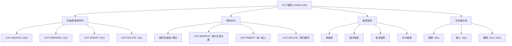

## 相关笔记

- 前置笔记：[[10.1 简单的基于数组的数据结构]]
- 关联概念：[[算法导论/concepts/数据结构]]
- 章节汇总：[[第10章_基本数据结构-章节汇总]]

> [!abstract] 概览
> 本节介绍==链表（linked list）==——一种通过==指针==确定元素线性顺序的数据结构。链表提供了==动态集合==的简单灵活表示，支持搜索、插入和删除等基本操作。本节重点讲解==双链表==的伪代码实现，并讨论==哨兵（sentinel）==优化、==循环链表==、==单链表==以及==XOR链表==等变体。
>
> **要点列表：**
> - 链表中元素的线性顺序由==指针==决定，而非数组下标
> - ==LIST-SEARCH== 在最坏情况下需要 $\Theta(n)$ 时间
> - ==LIST-INSERT== 和 ==LIST-DELETE== 在已知位置操作时只需 $O(1)$ 时间
> - ==哨兵==可以简化边界条件处理，可能减少常数因子，但不改变渐近复杂度
> - 链表有多种变体：单链表/双链表、有序/无序、循环/非循环

---

## 知识结构总览



---

核心概念

### 2.1 链表的定义

> [!def] 链表（Linked List）
> 链表是一种数据结构，其中的对象按==线性顺序==排列。与数组不同，链表中的线性顺序由每个对象中的==指针==决定，而非数组下标。由于链表元素通常包含可搜索的键，链表有时也称为==搜索列表（search lists）==。
>
> 链表为==动态集合==提供了简单、灵活的表示，支持（虽然不一定高效）所有基本的动态集合操作。

### 2.2 双链表的结构

每个双链表 $L$ 的元素是一个对象，包含以下属性：

| 属性 | 说明 |
|:-----|:-----|
| `key` | 元素的键值 |
| `next` | 指向后继元素的指针 |
| `prev` | 指向前驱元素的指针 |

此外，链表对象 $L$ 有一个属性 `L.head` 指向链表的第一个元素。

- 如果 `x.prev = NIL`，则 $x$ 没有前驱，是链表的==头（head）==
- 如果 `x.next = NIL`，则 $x$ 没有后继，是链表的==尾（tail）==
- 如果 `L.head = NIL`，则链表为空

> [!tip] 生活类比
> 想象一排人手拉手站成一列。每个人只知道自己的前一个人和后一个人是谁（这就是 `prev` 和 `next` 指针）。要找到特定的人，你必须从头开始，一个一个地问过去（这就是线性搜索）。而数组就像一排编了号的座位，你可以直接走到第 $k$ 个座位（随机访问 $O(1)$）。

### 2.3 链表的变体

链表可以有多种形式，它们可以自由组合：

| 变体维度 | 选项 | 说明 |
|:---------|:-----|:-----|
| 指针方向 | 单链表 / 双链表 | 单链表只有 `next`，双链表有 `next` 和 `prev` |
| 是否有序 | 有序 / 无序 | 有序链表中键的顺序与线性顺序一致 |
| 是否循环 | 循环 / 非循环 | 循环链表中尾的 `next` 指向头，头的 `prev` 指向尾 |

---

基本操作伪代码与复杂度分析

### 3.1 搜索：LIST-SEARCH

```
LIST-SEARCH(L, k)
1  x = L.head
2  while x ≠ NIL and x.key ≠ k
3      x = x.next
4  return x
```

> [!def] LIST-SEARCH 复杂度分析
> **输入：** 链表 $L$，键值 $k$
> **输出：** 指向第一个键为 $k$ 的元素的指针，若不存在则返回 NIL
>
> **时间复杂度：** $\Theta(n)$（最坏情况）
>
> **分析：** while 循环（第2-3行）在最坏情况下需要遍历整个链表的 $n$ 个元素。每次迭代执行常数次操作（一次指针追踪和一次键比较），因此总时间为 $\Theta(n)$。
>
> **最好情况：** 如果目标元素恰好在链表头部，则只需 $O(1)$ 时间。

**执行过程示例：** 在链表 $\{9, 4, 16, 1\}$ 中搜索键 $16$：

| 步骤 | $x$ | $x \neq \text{NIL}$? | $x.key \neq 16$? | 操作 |
|:----:|:---:|:---:|:---:|:-----|
| 初始化 | head → 9 | 是 | 是 | $x = x.next$ |
| 第1次迭代 | 4 | 是 | 是 | $x = x.next$ |
| 第2次迭代 | 16 | 是 | 否 | 退出循环 |
| 返回 | 16 | — | — | 返回指向键16的指针 |

### 3.2 前插：LIST-PREPEND

```
LIST-PREPEND(L, x)
1  x.next = L.head
2  x.prev = NIL
3  if L.head ≠ NIL
4      L.head.prev = x
5  L.head = x
```

> [!def] LIST-PREPEND 复杂度分析
> **输入：** 链表 $L$，已设置好键值的元素 $x$
> **输出：** 将 $x$ 插入到链表头部
>
> **时间复杂度：** $O(1)$
>
> **分析：** 所有操作都是常数时间的指针赋值。第3-4行的条件判断和可能的赋值也是 $O(1)$。无论链表有多长，前插操作的时间恒定。

**指针变化图示：**

```
插入前:  NIL ← [9] ⇄ [4] ⇄ [16] ⇄ [1] → NIL
                ↑
             L.head

插入 x.key=25 后:
NIL ← [25] ⇄ [9] ⇄ [4] ⇄ [16] ⇄ [1] → NIL
         ↑
      L.head
```

### 3.3 任意位置插入：LIST-INSERT

```
LIST-INSERT(x, y)
1  x.next = y.next
2  x.prev = y
3  if y.next ≠ NIL
4      y.next.prev = x
5  y.next = x
```

> [!def] LIST-INSERT 复杂度分析
> **输入：** 已设置好键值的元素 $x$，链表中已有元素 $y$ 的指针
> **输出：** 将 $x$ 插入到 $y$ 之后
>
> **时间复杂度：** $O(1)$
>
> **注意：** LIST-INSERT 不需要链表对象 $L$ 作为参数，因为它只需要修改 $y$ 及其邻居的指针。

**指针变化图示（在键9后插入键36）：**

```
插入前:  ... ⇄ [9] ⇄ [4] ⇄ ...
                y

插入后:  ... ⇄ [9] ⇄ [36] ⇄ [4] ⇄ ...
                y      x
```

### 3.4 删除：LIST-DELETE

```
LIST-DELETE(L, x)
1  if x.prev ≠ NIL
2      x.prev.next = x.next
3  else L.head = x.next
4  if x.next ≠ NIL
5      x.next.prev = x.prev
```

> [!def] LIST-DELETE 复杂度分析
> **输入：** 链表 $L$，指向待删除元素 $x$ 的指针
> **输出：** 将 $x$ 从链表中移除
>
> **时间复杂度：** $O(1)$（给定指针时）
>
> **分析：** 删除操作本身只需修改邻居的指针，是 $O(1)$ 的。但如果需要先通过键值找到待删除元素（调用 LIST-SEARCH），则总时间为 $\Theta(n)$。
>
> **边界情况处理：**
> - 第1-3行：如果 $x$ 是头节点（`x.prev = NIL`），则更新 `L.head`
> - 第4-5行：如果 $x$ 是尾节点（`x.next = NIL`），则无需更新后继的 `prev`

### 3.5 复杂度总结

| 操作 | 双链表 | 数组 |
|:-----|:------:|:----:|
| 搜索（按值） | $\Theta(n)$ | $\Theta(n)$（无序）/ $O(\lg n)$（有序） |
| 插入（已知位置） | $O(1)$ | $\Theta(n)$ |
| 删除（已知位置） | $O(1)$ | $\Theta(n)$ |
| 按序号访问第 $k$ 个 | $\Theta(k)$ | $O(1)$ |
| 搜索前驱/后继 | $O(1)$（双链表） | $O(1)$ |

---

哨兵优化

### 4.1 哨兵的思想

> [!def] 哨兵（Sentinel）
> ==哨兵==是一个==哑对象（dummy object）==，用于简化代码中的边界条件处理。在链表 $L$ 中，哨兵是一个对象 `L.nil`，它代表 NIL 但具有链表中其他对象的所有属性。所有对 NIL 的引用被替换为对 `L.nil` 的引用。
>
> 引入哨兵后，常规双链表变为==带哨兵的循环双链表==：
> - `L.nil.next` 指向链表头
> - `L.nil.prev` 指向链表尾
> - 头的 `prev` 和尾的 `next` 都指向 `L.nil`
> - 空链表：`L.nil.next = L.nil.prev = L.nil`
> - 不再需要 `L.head` 属性，用 `L.nil.next` 代替

### 4.2 带哨兵的操作伪代码

**简化后的删除操作：**

```
LIST-DELETE'(x)
1  x.prev.next = x.next
2  x.next.prev = x.prev
```

> [!tip] 对比：有无哨兵的删除操作
> - **无哨兵**（LIST-DELETE）：需要4行代码 + 2个条件判断来处理头/尾边界
> - **有哨兵**（LIST-DELETE'）：只需2行代码，无需任何条件判断
>
> 哨兵消除了"节点是否为头/尾"的判断，因为哨兵保证了每个节点都有前驱和后继。

**简化后的插入操作：**

```
LIST-INSERT'(x, y)
1  x.next = y.next
2  x.prev = y
3  y.next.prev = x
4  y.next = x
```

> [!note] LIST-INSERT' 的灵活性
> - 在头部插入：令 $y = \text{L.nil}$，则 $x$ 被插入到 `L.nil.next` 之前，即成为新的头
> - 在尾部插入：令 $y = \text{L.nil.prev}$，则 $x$ 被插入到尾之后
> - 不再需要单独的 LIST-PREPEND 过程

**带哨兵的搜索操作：**

```
LIST-SEARCH'(L, k)
1  L.nil.key = k          // 将键存入哨兵，保证键一定在"链表"中
2  x = L.nil.next         // 从链表头开始
3  while x.key ≠ k
4      x = x.next
5  if x == L.nil          // 在哨兵处找到键
6      return NIL         // 键不在真正的链表中
7  else return x          // 在元素 x 处找到键
```

> [!def] LIST-SEARCH' 的优化原理
> **关键技巧：** 第1行将搜索键 $k$ 存入哨兵的 `key` 属性，保证搜索一定会"找到"键——要么在真正的元素中找到，要么在哨兵中找到。
>
> **优势：** while 循环（第3-4行）每次迭代只需==一次比较==（`x.key ≠ k`），而原始的 LIST-SEARCH 需要==两次比较==（`x ≠ NIL and x.key ≠ k`）。当 $n$ 较大时，省去 $n$ 次 NIL 检查可以带来可观的常数因子改进。
>
> **时间复杂度：** 仍为 $\Theta(n)$（渐近复杂度不变，仅减少常数因子）

### 4.3 哨兵的权衡

> [!warning] 哨兵并非总是值得使用
> 哨兵虽然能简化代码并可能加速搜索，但存在以下代价：
> - **额外内存：** 每个链表都需要一个哨兵对象。当存在大量小链表时，哨兵的内存开销可能很显著
> - **误删风险：** 必须确保不会意外删除哨兵 `L.nil`（除非要删除整个链表）
> - **渐近复杂度不变：** 哨兵不改变任何操作的渐近运行时间
>
> **使用原则：** 仅在哨兵能显著简化代码时使用。CLRS 在本书中也只在代码简化效果明显时才使用哨兵。

---

单链表

### 5.1 单链表的结构

单链表中每个元素只有 `next` 指针，没有 `prev` 指针。

```
单链表:  [9] → [4] → [16] → [1] → NIL
           ↑
        L.head
```

### 5.2 单链表 vs 双链表的操作复杂度

> [!def] 单链表删除的复杂度
> **定理：** 在单链表中，INSERT 可以在 $O(1)$ 时间内完成（在已知位置），但 DELETE 的最坏情况时间为 $\Theta(n)$。
>
> **证明：**
> - **INSERT：** 与双链表类似，在已知位置后插入只需修改 `next` 指针，$O(1)$
> - **DELETE：** 要删除节点 $x$，需要修改 $x$ 的前驱节点的 `next` 指针。但在单链表中，没有 `prev` 指针，必须从头开始遍历找到 $x$ 的前驱，这需要 $\Theta(n)$ 时间
>
> **推论：** 双链表的 `prev` 指针使得删除操作从 $\Theta(n)$ 降为 $O(1)$，这是双链表相对于单链表的核心优势。

---

XOR链表

### 6.1 XOR链表的思想

> [!def] XOR链表（异或链表）
> XOR链表是一种巧妙的双链表实现，使用==单个指针字段== `x.np` 代替两个指针字段 `next` 和 `prev`。定义：
>
> $$x.\text{np} = x.\text{next} \oplus x.\text{prev}$$
>
> 其中 $\oplus$ 表示按位异或（XOR）运算，NIL 用 $0$ 表示。
>
> **核心性质：** XOR运算的可逆性使得我们可以从 `x.np` 和一个邻居的地址恢复另一个邻居的地址：
> - 已知 `x.np` 和 `x.prev`，则 $x.\text{next} = x.\text{np} \oplus x.\text{prev}$
> - 已知 `x.np` 和 `x.next`，则 $x.\text{prev} = x.\text{np} \oplus x.\text{next}$

### 6.2 XOR链表的操作

**搜索操作：**

```
XOR-LIST-SEARCH(L, k)
1  prev = 0                    // NIL = 0
2  x = L.head
3  while x ≠ 0 and x.key ≠ k
4      next = x.np ⊕ prev      // 计算下一个节点
5      prev = x
6      x = next
7  return x
```

**插入操作（在节点 y 后插入 x）：**

```
XOR-LIST-INSERT(x, y)
1  x.np = 0 ⊕ addr(y)         // x.prev = NIL, x.next = y
2  if y ≠ 0
3      y_next = y.np ⊕ addr(y.prev)  // 恢复 y.next
4      x.np = addr(y) ⊕ y_next       // 更新 x.np
5      y.np = y.np ⊕ y_next ⊕ addr(x) // 更新 y.np: 去掉旧next, 加入x
```

**$O(1)$ 反转操作：**

> [!tip] XOR链表的独特优势：$O(1)$ 反转
> XOR链表可以通过==交换头尾指针==在 $O(1)$ 时间内反转整个链表！
>
> 原理：反转链表等价于交换每个节点的 `next` 和 `prev`。由于 $x.\text{np} = x.\text{next} \oplus x.\text{prev}$，而 XOR 满足交换律，所以 $x.\text{np}$ 在反转后**保持不变**。因此只需交换链表的头指针和尾指针即可完成反转。
>
> 这在普通双链表中需要 $\Theta(n)$ 时间（遍历所有节点交换 `next` 和 `prev`）。

### 6.3 XOR链表的优缺点

| 维度 | 优点 | 缺点 |
|:-----|:-----|:-----|
| 空间 | 每个节点只需1个指针，节省50%指针空间 | — |
| 反转 | $O(1)$ 时间反转 | — |
| 调试 | — | 无法从中间节点开始遍历，调试困难 |
| 垃圾回收 | — | 现代垃圾回收器无法正确追踪XOR指针 |
| 实际应用 | 嵌入式系统中偶有使用 | 主流语言/框架几乎不采用 |

---

补充理解与拓展

> [!info] 链表 vs 动态数组——工程实践中的真实选择
>
> | 比较维度 | 动态数组（ArrayList/Vector/list） | 链表（LinkedList） |
> |---------|:---:|:---:|
> | 随机访问 | $O(1)$ | $\Theta(k)$ |
> | 尾部插入/删除 | 均摊 $O(1)$ | $O(1)$（有尾指针） |
> | 头部插入/删除 | $\Theta(n)$ | $O(1)$ |
> | 已知位置插入/删除 | $\Theta(n)$ | $O(1)$ |
> | 缓存命中率 | 高（连续内存） | 低（指针追踪） |
> | 内存开销 | 基准 | 多20-50%（额外指针） |
>
> **为什么现代工程中动态数组几乎总是优于链表？**
> 1. **缓存局部性（Cache Locality）：** 动态数组的元素在内存中连续存储，CPU缓存可以一次加载多个元素（缓存行通常为64字节）。链表的节点分散在堆内存中，每次访问都可能触发==缓存未命中（cache miss）==，导致指针追踪（pointer chasing）性能极差。实测中，遍历链表可能比遍历数组慢5-10倍
> 2. **内存开销：** 双链表每个节点需要额外存储两个指针（各8字节），对于存储小元素（如int）的链表，内存开销可能增加50%以上
> 3. **内存分配开销：** 每次插入新节点都需要动态内存分配（malloc/new），这比数组的连续内存分配慢得多
>
> **链表的优势场景：**
> - 频繁在已知位置插入/删除（$O(1)$ vs 数组 $\Theta(n)$）
> - 不需要随机访问，只需顺序遍历
> - 大小频繁变化且无法预估容量
> - Linux内核大量使用链表（`struct list_head`），但内核开发者也承认缓存性能是问题
> - Java的 `LinkedList` 在实际开发中很少使用，`ArrayList` 是默认选择
>
> 来源：Bjarne Stroustrup "Why you should avoid linked lists"; Linux内核源码 `include/linux/list.h`; Java Collections Framework设计文档

> [!info] XOR链表的实际应用与历史
>
> XOR链表是数据结构中的经典智力题（CLRS习题10.2-6），在实际工程中有着有趣的应用历史：
>
> 1. **嵌入式系统：** 在内存极其有限的嵌入式设备中，XOR链表的50%指针空间节省是有意义的。一些早期的嵌入式操作系统和通信协议实现中使用过XOR链表
> 2. **Linux内核的考虑：** Linux内核的 `list_head` 双向循环链表是内核中最基础的数据结构之一，用于管理进程、文件、设备等。内核开发者曾考虑过XOR优化以减少内存占用，但最终未采用——原因是现代CPU的缓存性能远比节省几个字节重要，且XOR链表使内核的调试和验证变得困难
> 3. **安全视角：** XOR链表在反逆向工程中偶有应用——混淆后的指针使得逆向工程师难以直接理解数据结构
> 4. **编程面试：** XOR链表是技术面试中的经典问题，考察候选人对位运算和指针的深入理解
>
> **现代语言中的可行性：** 大多数高级语言（Java、Python、JavaScript）不允许对指针进行位运算，因此无法直接实现XOR链表。它主要存在于C/C++和底层系统编程中。

---

易混淆点与辨析

> [!warning] 误区：链表的插入和删除总是 $O(1)$
> ❌ **错误理解：** "链表的插入和删除是 $O(1)$ 的，比数组的 $\Theta(n)$ 快得多"
>
> ✅ **正确理解：** 这个说法==只有在已知目标位置指针时==才成立。完整的操作流程需要区分两种情况：
> - **已知位置指针：** 插入 $O(1)$，删除 $O(1)$（双链表）——这是链表真正的优势
> - **按值操作：** 搜索 $\Theta(n)$ + 插入/删除 $O(1)$ = $\Theta(n)$，与数组按值删除的复杂度相同
>
> **对比数组：** 数组按值搜索也是 $\Theta(n)$（无序时），但数组有 $O(1)$ 随机访问的优势。链表的优势仅体现在"频繁在已知位置修改"的场景中。

> [!warning] 误区：哨兵能提高链表操作的渐近复杂度
> ❌ **错误理解：** "使用哨兵后，链表的搜索从 $\Theta(n)$ 降为更低的复杂度"
>
> ✅ **正确理解：** 哨兵==不改变任何操作的渐近运行时间==。LIST-SEARCH 和 LIST-SEARCH' 都是 $\Theta(n)$，LIST-DELETE 和 LIST-DELETE' 都是 $O(1)$。
>
> **哨兵的真正价值：**
> 1. **代码简化：** 消除边界条件的特殊处理（如头节点和尾节点的判断）
> 2. **常数因子优化：** LIST-SEARCH' 中每次循环迭代少一次比较（从2次减为1次），对于大规模数据可带来约2倍加速
> 3. **Bug减少：** 更少的条件分支意味着更少的边界错误
>
> **代价：** 每个链表需要一个哨兵对象的额外内存。当存在大量小链表时（如哈希表的每个桶都是短链表），哨兵的内存开销可能不可忽略。

---

习题精选

| 题号 | 题目描述 | 难度 |
|:---:|----------|:---:|
| 10.2-1 | 解释为什么单链表的INSERT可以在 $O(1)$ 时间内实现，但DELETE的最坏情况时间为 $\Theta(n)$ | ⭐⭐ |
| 10.2-2 | 用单链表实现栈，PUSH和POP应在 $O(1)$ 时间内完成 | ⭐ |
| 10.2-3 | 用单链表实现队列，ENQUEUE和DEQUEUE应在 $O(1)$ 时间内完成 | ⭐⭐ |
| 10.2-4 | 使用合适的链表数据结构，在 $O(1)$ 时间内支持UNION操作 | ⭐⭐ |
| 10.2-5 | 给出一个 $\Theta(n)$ 时间的非递归过程来反转单链表，只使用常数额外空间 | ⭐⭐⭐ |
| 10.2-6 | 使用XOR实现双链表，每个节点只用一个指针字段 | ⭐⭐⭐ |

> [!faq]- 10.2-1 解答：单链表INSERT为 $O(1)$ 而DELETE为 $\Theta(n)$
> **INSERT 分析：**
> 在单链表中，如果已知要在节点 $y$ 之后插入新节点 $x$，只需执行：
> ```
> x.next = y.next
> y.next = x
> ```
> 这两步都是 $O(1)$ 的指针操作。因此 INSERT 在已知位置时为 $O(1)$。
>
> **DELETE 分析：**
> 要删除节点 $x$，需要将 $x$ 的前驱节点的 `next` 指针指向 $x$ 的后继。但在单链表中，没有 `prev` 指针，无法直接访问 $x$ 的前驱。必须从链表头部开始遍历，直到找到 `next` 指向 $x$ 的节点——这需要 $\Theta(n)$ 时间。
>
> **对比双链表：** 双链表中每个节点有 `prev` 指针，可以直接访问前驱，因此 DELETE 为 $O(1)$。

> [!faq]- 10.2-2 解答：用单链表实现栈
> **实现方案：**
> 只需在单链表的==头部==进行 PUSH 和 POP 操作，两者都为 $O(1)$。
>
> ```
> // 栈的结构：只需维护 L.head
> PUSH(L, x)
> 1  x.next = L.head
> 2  L.head = x
>
> POP(L)
> 1  if L.head == NIL
> 2      error "underflow"
> 3  x = L.head
> 4  L.head = x.next
> 5  return x
> ```
>
> **不需要额外属性。** 栈的 LIFO 特性天然匹配链表的头部操作。

> [!faq]- 10.2-3 解答：用单链表实现队列
> **实现方案：**
> 需要在链表的==尾部==入队（ENQUEUE），在==头部==出队（DEQUEUE）。为了使 ENQUEUE 为 $O(1)$，需要额外维护一个 `L.tail` 指针指向链表尾部。
>
> ```
> // 需要添加 L.tail 属性
> ENQUEUE(L, x)
> 1  x.next = NIL
> 2  if L.tail == NIL
> 3      L.head = x
> 4  else L.tail.next = x
> 5  L.tail = x
>
> DEQUEUE(L)
> 1  if L.head == NIL
> 2      error "underflow"
> 3  x = L.head
> 4  L.head = x.next
> 5  if L.head == NIL
> 6      L.tail = NIL
> 7  return x
> ```
>
> **需要添加的属性：** `L.tail`（指向链表尾部的指针）。
> - ENQUEUE：$O(1)$（直接修改 tail.next）
> - DEQUEUE：$O(1)$（直接修改 head）
> - 第5-6行处理队列中最后一个元素被删除的特殊情况

> [!faq]- 10.2-5 解答：$\Theta(n)$ 反转单链表
> **算法思路：** 使用三个指针 `prev`、`curr`、`next`，从左到右依次反转每个节点的指向。
>
> ```
> REVERSE-LIST(L)
> 1  prev = NIL
> 2  curr = L.head
> 3  while curr ≠ NIL
> 4      next = curr.next    // 暂存下一个节点
> 5      curr.next = prev    // 反转当前节点的指向
> 6      prev = curr         // prev 前进
> 7      curr = next         // curr 前进
> 8  L.head = prev           // 更新头指针
> ```
>
> **复杂度分析：**
> - 时间：$\Theta(n)$，遍历链表一次
> - 空间：$O(1)$，只使用了3个额外指针变量
>
> **执行过程示例（链表 1→2→3→NIL）：**
>
> | 步骤 | prev | curr | next | 链表状态 |
> |:----:|:----:|:----:|:----:|:---------|
> | 初始 | NIL | 1 | — | 1→2→3→NIL |
> | 迭代1 | 1 | 2 | 2 | NIL←1 2→3→NIL |
> | 迭代2 | 2 | 3 | 3 | NIL←1←2 3→NIL |
> | 迭代3 | 3 | NIL | — | NIL←1←2←3 |
> | 完成 | — | — | — | 3→2→1→NIL |

> [!faq]- 10.2-6 解答：XOR链表的完整实现
> **数据结构：**
> 每个节点只有一个指针字段 `x.np = addr(x.next) ⊕ addr(x.prev)`，NIL 用 $0$ 表示。
>
> **访问链表头所需信息：** 需要记录 `L.head`（头节点地址）。遍历时需要维护前一个节点的地址。
>
> **SEARCH 操作：**
> ```
> XOR-SEARCH(L, k)
> 1  prev = 0
> 2  x = L.head
> 3  while x ≠ 0 and x.key ≠ k
> 4      next = x.np ⊕ prev
> 5      prev = x
> 6      x = next
> 7  return x
> ```
>
> **INSERT 操作（在 y 后插入 x）：**
> ```
> XOR-INSERT(x, y)
> 1  // 计算 y 的当前 next
> 2  y_next = y.np ⊕ addr(y_prev)  // 需要知道 y.prev
> 3  // 设置 x 的 np
> 4  x.np = addr(y) ⊕ y_next       // x.prev=y, x.next=y_next
> 5  // 更新 y 的 np
> 6  y.np = addr(x) ⊕ (y.np ⊕ y_next)  // 去掉旧next, 加入x
> 7  // 如果 y_next ≠ 0，更新 y_next 的 np
> 8  if y_next ≠ 0
> 9      y_next.np = y_next.np ⊕ addr(y) ⊕ addr(x)
> ```
>
> **$O(1)$ 反转：** 只需交换头指针和尾指针。因为 $x.\text{np} = x.\text{next} \oplus x.\text{prev}$，反转后每个节点的 `next` 和 `prev` 互换，但 XOR 满足交换律，所以 `x.np` 不变。因此只需 `exchange L.head with L.tail`，时间 $O(1)$。

---

视频学习指南

| 资源 | 主题 | 链接 | 说明 |
|:-----|:-----|:-----|:-----|
| MIT 6.006 Lecture 2 | Data Structures and Dynamic Arrays | https://www.youtube.com/watch?v=3hH8kTH3w3s | Erik Demaine 讲解链表与动态数组的对比 |
| Abdul Bari | Linked List Data Structure | https://www.youtube.com/watch?v=NobHlGUjV3g | 逐步动画演示单链表和双链表操作 |
| mycodeschool | Linked List Implementation | https://www.youtube.com/watch?v=OIc0L2Sj4Gk | C语言实现双链表，含搜索/插入/删除 |
| GeeksforGeeks | Doubly Linked List | https://www.youtube.com/watch?v=JdQeNmdaG_8 | 完整的双链表操作教程 |
| WilliamFiset | Introduction to Linked Lists | https://www.youtube.com/watch?v=njTh_OwMljA | 数据结构系列，含链表变体讨论 |

---

教材原文

> [!quote] CLRS 第4版 10.2节原文
> A linked list is a data structure in which the objects are arranged in a linear order. Unlike an array, however, in which the linear order is determined by the array indices, the order in a linked list is determined by a pointer in each object. Since the elements of linked lists often contain keys that can be searched for, linked lists are sometimes called search lists. Linked lists provide a simple, flexible representation for dynamic sets, supporting (though not necessarily efficiently) all the operations listed on page 250.
>
> As shown in Figure 10.4, each element of a doubly linked list $L$ is an object with an attribute key and two pointer attributes: next and prev. The object may also contain other satellite data. Given an element $x$ in the list, $x.\text{next}$ points to its successor in the linked list, and $x.\text{prev}$ points to its predecessor. If $x.\text{prev} = \text{NIL}$, the element $x$ has no predecessor and is therefore the first element, or head, of the list. If $x.\text{next} = \text{NIL}$, the element $x$ has no successor and is therefore the last element, or tail, of the list.

> [!quote] CLRS 第4版 10.2节原文（哨兵）
> A sentinel is a dummy object that allows us to simplify boundary conditions. In a linked list $L$, the sentinel is an object $L.\text{nil}$ that represents NIL but has all the attributes of the other objects in the list. References to NIL are replaced by references to the sentinel $L.\text{nil}$. As shown in Figure 10.5, this change turns a regular doubly linked list into a circular, doubly linked list with a sentinel, in which the sentinel $L.\text{nil}$ lies between the head and tail.
>
> Sentinels often simplify code and, as in searching a linked list, they might speed up code by a small constant factor, but they don't typically improve the asymptotic running time. Use them judiciously. When there are many small lists, the extra storage used by their sentinels can represent significant wasted memory.

---

## 参见Wiki

- [[算法导论/concepts/链表]] — 链表的实现与操作

#学习/算法导论/第10章-基本数据结构 #学习/算法导论/基本数据结构/链表
