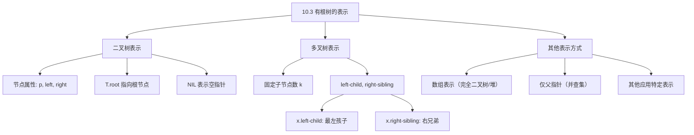

## 相关笔记

- 前置笔记：[[10.2 链表]]
- 关联概念：[[算法导论/concepts/二叉堆]]（二叉堆是二叉树的特例）、[[算法导论/concepts/递归关系式]]
- 章节汇总：[[第10章_基本数据结构-章节汇总]]

> [!abstract] 概览
> 本节介绍如何用==链式数据结构==表示==有根树（rooted trees）==。首先讨论==二叉树==的标准表示方法（每个节点含 `left`、`right`、`parent` 指针），然后介绍==left-child, right-sibling 表示法==，该方法可以将任意多叉树统一转换为二叉树形式，每个节点只需固定数量的指针。
>
> **要点列表：**
> - 二叉树每个节点包含 `p`（父指针）、`left`（左孩子）、`right`（右孩子）三个指针
> - left-child, right-sibling 表示法用==两个指针==表示任意多叉树，空间为 $O(n)$
> - 树的表示方法选择取决于具体应用场景
> - [[算法导论/concepts/二叉堆]] 使用数组表示完全二叉树，是树的另一种重要表示方式

---

## 知识结构总览



---

二叉树的表示

### 2.1 节点结构与属性

> [!def] 二叉树的链式表示
> 二叉树 $T$ 的每个节点是一个对象，包含以下属性：
>
> | 属性 | 说明 |
> |:-----|:-----|
> | `key` | 节点存储的键值 |
> | `p` | 指向父节点的指针 |
> | `left` | 指向左孩子的指针 |
> | `right` | 指向右孩子的指针 |
>
> 此外，树对象 $T$ 有属性 `T.root` 指向根节点。
>
> **约定：**
> - 如果 $x.p = \text{NIL}$，则 $x$ 是==根节点==
> - 如果 $x.\text{left} = \text{NIL}$，则 $x$ 没有左孩子
> - 如果 $x.\text{right} = \text{NIL}$，则 $x$ 没有右孩子
> - 如果 $T.\text{root} = \text{NIL}$，则树为空

### 2.2 二叉树的结构示意

```
        T.root → [15]
                  /    \
              [9]      [20]
             /   \       \
          [22]   [13]    [25]
                 /   \
              [12]   [28]
```

**对应的属性表：**

| 节点 | key | p | left | right |
|:----:|:---:|:---:|:---:|:---:|
| 1 | 17 | 6 | 8 | 9 |
| 2 | 14 | 5 | NIL | NIL |
| 3 | 12 | 9 | NIL | NIL |
| 4 | 20 | 6 | 10 | NIL |
| 5 | 33 | 10 | 2 | NIL |
| 6 | 15 | NIL | 1 | 4 |
| 7 | 28 | 9 | NIL | NIL |
| 8 | 22 | 1 | NIL | NIL |
| 9 | 13 | 1 | 3 | 7 |
| 10 | 25 | 4 | NIL | 5 |

> [!tip] 空间复杂度
> 一棵 $n$ 个节点的二叉树，每个节点有3个指针（`p`、`left`、`right`），共需 $3n$ 个指针空间。由于 $n$ 个节点的树有 $n-1$ 条边，恰好有 $n-1$ 个非NIL指针，其余 $2n+1$ 个指针为NIL（根的 `p` 为NIL，加上 $n$ 个节点各自的 `left` 和 `right` 中为NIL的部分）。

### 2.3 基本操作的复杂度

| 操作 | 时间复杂度 | 说明 |
|:-----|:---------:|:-----|
| 访问根节点 | $O(1)$ | `T.root` |
| 访问父节点 | $O(1)$ | `x.p` |
| 访问左/右孩子 | $O(1)$ | `x.left` / `x.right` |
| 判断是否为叶节点 | $O(1)$ | `x.left == NIL and x.right == NIL` |
| 计算树的高度 | $O(n)$ | 需要遍历所有节点 |
| 遍历所有节点 | $O(n)$ | 前序/中序/后序遍历 |

---

有根树的统一表示：Left-Child, Right-Sibling

### 3.1 问题：如何表示任意多叉树？

> [!def] 多叉树表示的挑战
> 如果每个节点最多有 $k$ 个孩子，可以用 `child1, child2, ..., childk` 表示。但这种方法存在两个问题：
> 1. **子节点数无界时不可行：** 无法预先分配足够的属性
> 2. **空间浪费：** 即使 $k$ 有界，如果大多数节点只有少量孩子，会浪费大量内存
>
> **目标：** 找到一种表示方法，使得：
> - 每个节点使用==固定数量==的指针（不依赖于子节点数）
> - 总空间为 $O(n)$（$n$ 为节点数）
> - 能正确表示任意有根树的结构

### 3.2 Left-Child, Right-Sibling 表示法

> [!def] Left-Child, Right-Sibling 表示法
> 每个节点 $x$ 包含以下属性：
>
> | 属性 | 说明 |
> |:-----|:-----|
> | `key` | 节点的键值 |
> | `p` | 指向父节点的指针 |
> | `x.left-child` | 指向 $x$ 的==最左孩子==的指针 |
> | `x.right-sibling` | 指向 $x$ 的==紧邻右兄弟==的指针 |
>
> **约定：**
> - 如果 $x$ 没有孩子，则 $x.\text{left-child} = \text{NIL}$
> - 如果 $x$ 是其父节点的最右孩子，则 $x.\text{right-sibling} = \text{NIL}$
> - $T.\text{root}$ 指向树的根节点

### 3.3 从多叉树到二叉树的转换

Left-Child, Right-Sibling 表示法的本质是==将任意多叉树转换为二叉树==：

**原始多叉树：**

```
          A
       /  |  \
      B   C   D
     / \       \
    E   F       G
       / \
      H   I
```

**Left-Child, Right-Sibling 表示（二叉树形式）：**

```
          A
        /
       B ——→ C ——→ D
      /           /
     E ——→ F     G
         /
        H ——→ I
```

**转换规则：**
1. 每个节点的第一个孩子变成 `left-child`
2. 同一父节点下的兄弟从左到右通过 `right-sibling` 链接
3. 原始多叉树中节点的父子关系被拆分为两条路径：
   - 父 → 最左孩子（通过 `left-child`）
   - 最左孩子 → 其他兄弟（通过 `right-sibling`）

### 3.4 对应的属性表

以上面的多叉树为例：

| 节点 | key | p | left-child | right-sibling |
|:----:|:---:|:---:|:---:|:---:|
| 1 | A | NIL | B | NIL |
| 2 | B | A | E | C |
| 3 | C | A | NIL | D |
| 4 | D | A | G | NIL |
| 5 | E | B | NIL | F |
| 6 | F | B | H | NIL |
| 7 | G | D | NIL | NIL |
| 8 | H | F | NIL | I |
| 9 | I | F | NIL | NIL |

### 3.5 空间复杂度证明

> [!def] 空间复杂度 $O(n)$
> **定理：** Left-Child, Right-Sibling 表示法对任意 $n$ 节点有根树使用 $O(n)$ 空间。
>
> **证明：**
> - 每个节点有3个指针（`p`、`left-child`、`right-sibling`），共 $3n$ 个指针
> - $n$ 个节点的有根树有 $n-1$ 条边
> - 在 left-child, right-sibling 表示中：
>   - 每个非根节点恰好有一个 `p` 指针指向它（来自其父节点），共 $n-1$ 个非NIL的 `p` 指针
>   - 每个有孩子的节点恰好有一个非NIL的 `left-child` 指针（指向其最左孩子），非NIL的 `left-child` 指针数等于有孩子的节点数
>   - 每个非最右孩子恰好有一个非NIL的 `right-sibling` 指针，非NIL的 `right-sibling` 指针数等于总孩子数减去节点数（因为每个父节点的孩子链中最后一个的 `right-sibling` 为NIL）
> - **【分类计数（三类指针分别统计）】** 总非NIL指针数 = $(n-1) + \text{有孩子的节点数} + (\text{总孩子数} - \text{有孩子的节点数}) = (n-1) + \text{总孩子数}$
> - **【关键简化（有孩子节点数抵消）】** 由于 $n$ 个节点的树有 $n-1$ 条边，总孩子数 = $n-1$
> - **【代入求值】** 总非NIL指针数 = $(n-1) + (n-1) = 2(n-1) = O(n)$
> - 因此总空间为 $O(n)$

### 3.6 操作复杂度分析

| 操作 | 时间复杂度 | 说明 |
|:-----|:---------:|:-----|
| 访问父节点 | $O(1)$ | `x.p` |
| 访问第一个（最左）孩子 | $O(1)$ | `x.left-child` |
| 访问所有孩子 | $O(c)$ | $c$ 为孩子数，沿 `right-sibling` 遍历 |
| 访问右兄弟 | $O(1)$ | `x.right-sibling` |
| 访问左兄弟 | $O(c)$ | 需要从父节点的最左孩子开始遍历 |
| 判断是否为叶节点 | $O(1)$ | `x.left-child == NIL` |
| 计算子节点数 | $O(c)$ | 沿 `right-sibling` 计数 |
| 遍历整棵树 | $O(n)$ | DFS/BFS |

> [!warning] 注意：访问左兄弟的代价
> Left-Child, Right-Sibling 表示法中，`right-sibling` 是单向的（只有向右的指针），因此：
> - 访问==右兄弟==：$O(1)$
> - 访问==左兄弟==：需要从父节点的 `left-child` 开始，沿 `right-sibling` 遍历到当前节点的前一个，时间为 $O(c)$（$c$ 为当前节点的兄弟数）
>
> 如果应用中需要频繁访问左兄弟，可以考虑使用双链表来连接兄弟节点（增加一个 `left-sibling` 指针），但这会增加空间开销。

---

其他树的表示方法

> [!def] 树的多种表示方式
> CLRS 指出，树的表示方式取决于具体应用：
>
> 1. **数组表示（完全二叉树）：** [[算法导论/concepts/二叉堆]] 使用单个数组加上一个记录最后一个节点下标的属性来表示完全二叉树。节点 $i$ 的父节点为 $\lfloor i/2 \rfloor$，左孩子为 $2i$，右孩子为 $2i+1$。空间效率极高，但仅适用于完全二叉树
>
> 2. **仅父指针表示：** 第19章（不相交集合）中的树只需要==父指针==，不需要指向孩子的指针。因为操作只沿从叶到根的方向进行（FIND-SET 和 UNION）
>
> 3. **带父指针的二叉树：** 第12章（二叉搜索树）中的标准表示，每个节点有 `p`、`left`、`right`，支持向上和向下的遍历
>
> 4. **带线程指针的二叉树：** 利用NIL指针存储遍历信息（前驱/后继），可以在不用栈的情况下进行中序遍历（见习题线索化二叉树）
>
> **选择原则：** 哪种表示方式最好，取决于应用的具体需求。没有"万能"的树表示方法。

---

树的遍历

> [!def] 树的遍历方法
> 虽然CLRS第10章未详细讨论遍历，但遍历是树的最基本操作，在第12章（二叉搜索树）中会大量使用：
>
> **二叉树的遍历：**
>
> | 遍历方式 | 访问顺序 | 典型应用 |
> |:---------|:---------|:---------|
> | 前序遍历（pre-order） | 根 → 左子树 → 右子树 | 复制树结构、表达式前缀表示 |
> | 中序遍历（in-order） | 左子树 → 根 → 右子树 | 二叉搜索树的有序输出 |
> | 后序遍历（post-order） | 左子树 → 右子树 → 根 | 计算目录大小、释放树空间 |
> | 层序遍历（level-order） | 按层从上到下、从左到右 | BFS在树上的应用 |
>
> **Left-Child, Right-Sibling 表示的遍历：**
> 遍历一棵用 left-child, right-sibling 表示的树时，需要先访问节点的所有孩子（通过 `left-child` 和 `right-sibling`），再递归处理每个孩子。前序遍历的伪代码如下：

```
PREORDER-TRAVERSE(x)
1  if x ≠ NIL
2      visit(x)                    // 访问当前节点
3      PREORDER-TRAVERSE(x.left-child)  // 遍历第一个孩子
4      PREORDER-TRAVERSE(x.right-sibling) // 遍历其余兄弟
```

> [!def] 遍历的复杂度
> **定理：** 对 $n$ 节点的树进行遍历的时间为 $\Theta(n)$。
>
> **证明：** 每个节点恰好被访问一次（visit 操作执行一次），每次访问执行常数时间的工作。递归调用的总次数等于节点数加上 NIL 检查的次数。因此总时间为 $\Theta(n)$。

---

补充理解与拓展

> [!info] Left-Child, Right-Sibling 表示法的深入分析
>
> **历史与地位：**
> Left-Child, Right-Sibling（LCRS）表示法是CLRS推荐的标准方法，也是大多数算法教材中通用的多叉树表示方式。它最早可追溯到20世纪60年代的树结构研究。
>
> **核心优势：**
> 1. **统一性：** 将所有有根树（包括二叉树、多叉树）统一为二叉树形式。二叉树实际上是多叉树的特例——每个节点最多有2个孩子
> 2. **空间效率：** 每个节点固定3个指针（`p`、`left-child`、`right-sibling`），总空间 $O(n)$，不随分支因子增长
> 3. **实现简洁：** 可以直接复用二叉树的代码框架，降低实现复杂度
>
> **实际应用场景：**
> - **文件系统：** Unix文件系统的目录结构就是一棵多叉树，每个目录可以有任意数量的子目录。LCRS表示可以高效存储这种结构
> - **DOM树：** HTML文档对象模型（DOM）中，每个元素可以有任意数量的子元素
> - **编译器抽象语法树（AST）：** 编译器将源代码解析为AST，其中运算符节点的操作数数量不固定（如函数调用的参数数量可变）
> - **组织架构图：** 公司的组织架构中，每个管理者可以有任意数量的下属
>
> **与现代编程语言的对应：**
> - C/C++：手动管理指针，直接实现LCRS
> - Java：`class TreeNode { TreeNode firstChild; TreeNode nextSibling; }`
> - Python：`class Node: def __init__(self): self.first_child = None; self.next_sibling = None`

> [!info] 树的遍历算法与递归关系
>
> 树的遍历是理解[[算法导论/concepts/递归关系式]]的重要实例。每种遍历方式都自然对应一种递归模式：
>
> **递归与分治的联系：**
> - 树的遍历本质上是==分治策略==的应用：将问题（遍历整棵树）分解为子问题（遍历子树）
> - 遍历的递归关系式为 $T(n) = T(n_1) + T(n_2) + \cdots + T(n_k) + O(1)$，其中 $n_1 + n_2 + \cdots + n_k = n - 1$
> - 由主定理的推广形式，$T(n) = O(n)$
>
> **非递归遍历的实现：**
> - 使用==栈==模拟递归：前序/中序/后序遍历都可以用显式栈实现，空间 $O(h)$（$h$ 为树高）
> - 使用==队列==实现层序遍历：这是BFS在树上的直接应用
> - Morris遍历：利用NIL指针存储遍历信息，实现 $O(1)$ 额外空间的遍历（修改树结构）
>
> **遍历的应用：**
> - 二叉搜索树的中序遍历产生有序序列（第12章核心内容）
> - 后序遍历用于计算表达式树的值
> - 前序遍历用于序列化/反序列化树结构
> - 层序遍历用于求树的最短路径（无权图BFS）

---

易混淆点与辨析

> [!warning] 误区：Left-Child, Right-Sibling 表示的二叉树与原始多叉树"等价"
> ❌ **错误理解：** "LCRS表示就是将多叉树变成二叉树，两者完全一样"
>
> ✅ **正确理解：** LCRS表示是一种==编码方式==，它保留了原始多叉树的所有结构信息，但==二叉树形式下的操作语义不同==：
> - 在LCRS二叉树中，`left` 指针的含义是"第一个孩子"，`right` 指针的含义是"下一个兄弟"
> - 不能直接对LCRS二叉树执行标准二叉搜索树操作（如中序遍历不会产生有序序列）
> - LCRS二叉树的"左子树"是原始节点的子树，"右子树"是原始节点的兄弟链
>
> **记忆方法：** LCRS中，左 = 孩子（向下），右 = 兄弟（向右）。二叉树的中序遍历在LCRS表示下对应的是"先访问子树，再访问兄弟"的特殊顺序，而非按键值排序。

> [!warning] 误区：二叉树的数组表示总是不如链式表示
> ❌ **错误理解：** "链式表示（指针）比数组表示更灵活，应该总是使用链式表示"
>
> ✅ **正确理解：** 表示方式的选择取决于树的==形状==和==操作需求==：
>
> | 比较维度 | 链式表示（指针） | 数组表示 |
> |:---------|:---:|:---:|
> | 适用范围 | 任意形状的树 | 仅完全/近似完全二叉树 |
> | 空间效率 | 每节点3个指针 | 无指针开销 |
> | 父子访问 | $O(1)$ | $O(1)$（通过下标计算） |
> | 缓存友好性 | 差（指针分散） | 好（连续内存） |
> | 动态增删 | 灵活 | 困难（需要移动元素） |
>
> **[[算法导论/concepts/二叉堆]] 使用数组表示的原因：** 堆是==完全二叉树==，数组表示不会浪费空间；且堆操作（PARENT、LEFT、RIGHT）通过下标计算即可完成，无需指针；连续内存布局使缓存命中率更高。
>
> **结论：** 完全二叉树用数组更优，一般二叉树/多叉树用链式表示更灵活。

---

习题精选

| 题号 | 题目描述 | 难度 |
|:---:|----------|:---:|
| 10.3-1 | 根据给定的属性表画出以索引6为根的二叉树 | ⭐ |
| 10.3-2 | 编写 $O(n)$ 时间的递归过程，打印 $n$ 节点二叉树的所有键 | ⭐⭐ |
| 10.3-3 | 编写 $O(n)$ 时间的非递归过程，使用栈作为辅助数据结构打印所有键 | ⭐⭐ |
| 10.3-4 | 编写 $O(n)$ 时间的过程，打印 left-child, right-sibling 表示的任意有根树的所有键 | ⭐⭐ |
| 10.3-5 | 编写 $O(n)$ 时间的非递归过程，只使用常数额外空间打印所有键（不修改树） | ⭐⭐⭐ |
| 10.3-6 | 只用两个指针和一个布尔值实现 left-child, right-sibling 的功能 | ⭐⭐⭐ |

> [!faq]- 10.3-1 解答：根据属性表画二叉树
> **给定属性表：**
>
> | index | key | left | right |
> |:-----:|:---:|:----:|:-----:|
> | 1 | 17 | 8 | 9 |
> | 2 | 14 | NIL | NIL |
> | 3 | 12 | NIL | NIL |
> | 4 | 20 | 10 | NIL |
> | 5 | 33 | 2 | NIL |
> | 6 | 15 | 1 | 4 |
> | 7 | 28 | NIL | NIL |
> | 8 | 22 | NIL | NIL |
> | 9 | 13 | 3 | 7 |
> | 10 | 25 | NIL | 5 |
>
> **以索引6（key=15）为根的二叉树：**
>
> ```
>              [15]
>             /    \
>          [17]    [20]
>         /   \      \
>       [22]  [13]   [25]
>              / \      \
>           [12] [28]   [33]
>                        /
>                      [14]
> ```
>
> **构建过程：**
> 1. 根节点：索引6，key=15，left=1，right=4
> 2. 索引1（key=17）：left=8（key=22），right=9（key=13）
> 3. 索引9（key=13）：left=3（key=12），right=7（key=28）
> 4. 索引4（key=20）：left=10（key=25），right=NIL
> 5. 索引10（key=25）：left=NIL，right=5（key=33）
> 6. 索引5（key=33）：left=2（key=14），right=NIL
> 7. 叶节点：22、12、28、14（left和right均为NIL）

> [!faq]- 10.3-2 解答：递归打印二叉树所有键
> **前序遍历实现：**
>
> ```
> PRINT-TREE-RECURSIVE(x)
> 1  if x ≠ NIL
> 2      print x.key
> 3      PRINT-TREE-RECURSIVE(x.left)
> 4      PRINT-TREE-RECURSIVE(x.right)
> ```
>
> **复杂度分析：**
> - 每个节点恰好被访问一次，每次访问执行 $O(1)$ 工作（打印 + 两次递归调用）
> - 总时间：$T(n) = T(n_L) + T(n_R) + O(1)$，其中 $n_L + n_R = n - 1$
> - 由递归关系式展开：$T(n) = O(n)$
> - 栈空间：$O(h)$，其中 $h$ 为树高（最坏情况 $h = n$，退化为链表）

> [!faq]- 10.3-4 解答：打印 left-child, right-sibling 表示的树
> **算法思路：** 对每个节点，先访问该节点，然后递归遍历其第一个孩子，再递归遍历其右兄弟。
>
> ```
> PRINT-LCRS-TREE(x)
> 1  if x ≠ NIL
> 2      print x.key
> 3      PRINT-LCRS-TREE(x.left-child)    // 遍历子树
> 4      PRINT-LCRS-TREE(x.right-sibling)  // 遍历兄弟
> ```
>
> **复杂度分析：**
> - 每个节点恰好被访问一次（通过 `left-child` 或 `right-sibling` 到达）
> - 每次访问执行 $O(1)$ 工作
> - 总时间：$O(n)$
>
> **注意：** 这个遍历顺序对应于原始多叉树的==前序遍历==——先访问父节点，再访问所有子树。如果要实现其他遍历顺序，需要调整 visit 的位置。

> [!faq]- 10.3-5 解答：$O(1)$ 额外空间的非递归遍历
> **算法思路：** 使用 Morris 遍历的变体，利用 NIL 指针存储回溯信息。
>
> 对于二叉树，Morris 中序遍历的基本思想是：
> 1. 当当前节点有左子树时，找到左子树的最右节点（中序前驱）
> 2. 如果最右节点的 `right` 为 NIL，将其指向当前节点（建立回溯指针），然后进入左子树
> 3. 如果最右节点的 `right` 已经指向当前节点（说明左子树已遍历完毕），断开该指针，访问当前节点，进入右子树
> 4. 如果当前节点没有左子树，直接访问当前节点，进入右子树
>
> ```
> MORRIS-INORDER(x)
> 1  while x ≠ NIL
> 2      if x.left == NIL
> 3          print x.key
> 4          x = x.right
> 5      else
> 6          // 找到 x 在左子树中的中序前驱
> 7          pred = x.left
> 8          while pred.right ≠ NIL and pred.right ≠ x
> 9              pred = pred.right
> 10         if pred.right == NIL
> 11             pred.right = x     // 建立临时回溯指针
> 12             x = x.left
> 13         else
> 14             pred.right = NIL   // 恢复树结构
> 15             print x.key
> 16             x = x.right
> ```
>
> **复杂度分析：**
> - 时间：$O(n)$。虽然内层 while 循环（第8-9行）看起来可能很耗时，但每条边最多被遍历两次（一次建立临时指针，一次断开），总边数为 $n-1$，因此总时间为 $O(n)$
> - 空间：$O(1)$，只使用了常数个额外变量（`x`、`pred`）
> - 不修改树：遍历结束后，所有临时指针都被断开，树恢复原始结构

> [!faq]- 10.3-6 解答：两个指针 + 一个布尔值的树表示
> **算法思路：** 将 `parent` 指针替换为布尔值 `is-left-child`，表示当前节点是其父节点的左孩子还是右孩子（或最左孩子还是右兄弟）。
>
> **具体方案：**
> 每个节点 $x$ 包含：
> - `x.left-child`：指向最左孩子
> - `x.right-sibling`：指向右兄弟
> - `x.is-left-child`：布尔值，表示 $x$ 是其父节点的左孩子（true）还是右兄弟链的一部分（false）
>
> **访问父节点：**
> 从 $x$ 出发向上查找父节点需要 $O(c)$ 时间（$c$ 为 $x$ 的兄弟数）：
> 1. 如果 `x.is-left-child == true`，则 $x$ 是某个节点的 `left-child`。需要从根开始搜索，找到 `left-child` 指向 $x$ 的节点
> 2. 如果 `x.is-left-child == false`，则 $x$ 是某个节点的 `right-sibling`。需要找到 `right-sibling` 指向 $x$ 的节点
>
> **更高效的方案：** 实际上，可以从 $x$ 沿 `right-sibling` 向左遍历到兄弟链的头部（`is-left-child == true` 的节点），然后该节点的父节点就是我们要找的父节点。但需要一种方式从兄弟链头部找到父节点——这又需要遍历。
>
> **结论：** 这种方案用 $O(c)$ 时间访问父节点（$c$ 为兄弟数），用 $O(c)$ 时间访问所有孩子（与原始方案相同），但每个节点节省了一个指针的空间（从3个指针减为2个指针+1个布尔值）。

---

视频学习指南

| 资源 | 主题 | 链接 | 说明 |
|:-----|:-----|:-----|:-----|
| MIT 6.006 Lecture 6 | Binary Trees, Part 1 | https://www.youtube.com/watch?v=6s3T08KlJlY | Erik Demaine 讲解二叉树的基本概念与表示 |
| Abdul Bari | Tree Data Structure | https://www.youtube.com/watch?v=ZQXkLGFmGBw | 树的基本术语、二叉树和多叉树表示 |
| mycodeschool | Binary Tree Traversal | https://www.youtube.com/watch?v=1bmBwV3aSFs | 前序、中序、后序遍历的递归与非递归实现 |
| WilliamFiset | Tree Algorithms | https://www.youtube.com/watch?v=PHd3cCdS2Qk | 树算法系列，含多种树的表示方式讨论 |
| GeeksforGeeks | Tree Traversals | https://www.youtube.com/watch?v=1bmBwV3aSFs | 详细的遍历算法讲解与代码实现 |

---

教材原文

> [!quote] CLRS 第4版 10.3节原文
> Linked lists work well for representing linear relationships, but not all relationships are linear. In this section, we look specifically at the problem of representing rooted trees by linked data structures. We first look at binary trees, and then we present a method for rooted trees in which nodes can have an arbitrary number of children.
>
> We represent each node of a tree by an object. As with linked lists, we assume that each node contains a key attribute. The remaining attributes of interest are pointers to other nodes, and they vary according to the type of tree.

> [!quote] CLRS 第4版 10.3节原文（Left-Child, Right-Sibling）
> Fortunately, there is a clever scheme to represent trees with arbitrary numbers of children. It has the advantage of using only $O(n)$ space for any $n$-node rooted tree. The left-child, right-sibling representation appears in Figure 10.7. As before, each node contains a parent pointer $p$, and $T.\text{root}$ points to the root of tree $T$. Instead of having a pointer to each of its children, however, each node $x$ has only two pointers:
> 1. $x.\text{left-child}$ points to the leftmost child of node $x$, and
> 2. $x.\text{right-sibling}$ points to the sibling of $x$ immediately to its right.
>
> If node $x$ has no children, then $x.\text{left-child} = \text{NIL}$, and if node $x$ is the rightmost child of its parent, then $x.\text{right-sibling} = \text{NIL}$.

> [!quote] CLRS 第4版 10.3节原文（其他表示方式）
> We sometimes represent rooted trees in other ways. In Chapter 6, for example, we represented a heap, which is based on a complete binary tree, by a single array along with an attribute giving the index of the last node in the heap. The trees that appear in Chapter 19 are traversed only toward the root, and so only the parent pointers are present: there are no pointers to children. Many other schemes are possible. Which scheme is best depends on the application.

---

## 参见Wiki

- [[算法导论/concepts/有根树]] — 有根树的表示方法

#学习/算法导论/第10章-基本数据结构 #学习/算法导论/基本数据结构/有根树
