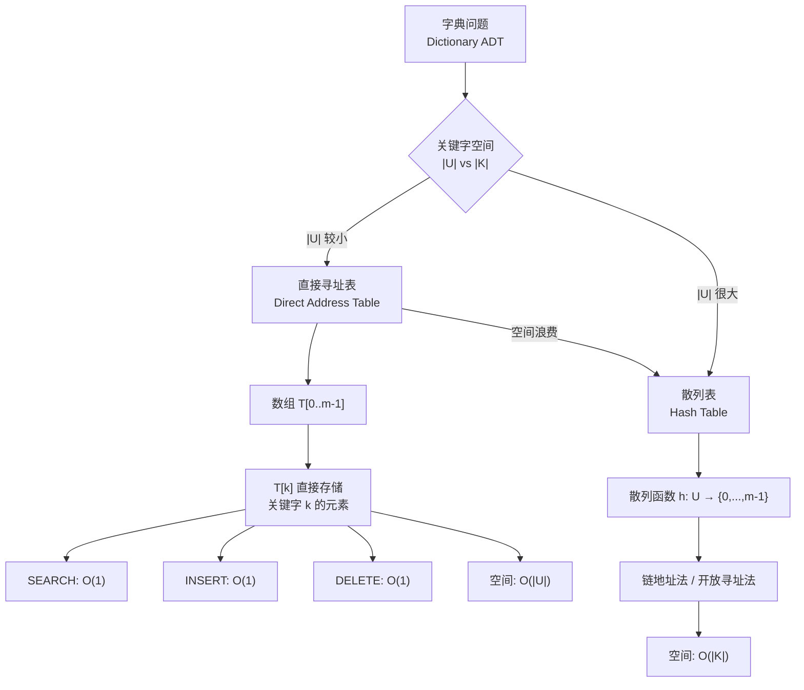

## 相关笔记

- [[11.2 散列表]]
- [[第10章_基本数据结构-章节汇总]]
- [[10.2 链表]]
- [[第11章_散列表-章节汇总]]

---

> [!abstract] 概览
>
> 直接寻址（Direct Addressing）是一种最简单的字典实现方式：用数组 `T[0..m-1]` 的每个位置直接对应全域 $U$ 中的一个关键字，通过关键字本身作为数组下标来访问元素。
>
> - **全域 $U$**：所有可能关键字的集合，大小为 $|U|$
> - **实际关键字集合 $K$**：当前存储在表中的关键字集合，$K \subseteq U$
> - ==搜索、插入、删除==三个字典操作均在 $O(1)$ 时间内完成
> - 核心局限：当 $|U|$ 远大于 $|K|$ 时，空间浪费严重
> - 直接寻址是理解散列表的思想起点——[[11.2 散列表]]正是为了克服这一局限而提出的

---

## 知识结构图



---

## 核心思想

> [!tip] 核心思路
>
> 直接寻址的精髓在于：**用空间换时间**。如果全域 $U$ 中的每个关键字都能唯一对应数组的一个下标，那么所有字典操作就退化为简单的数组下标访问，时间复杂度为 $O(1)$。
>
> 这是一种"暴力但有效"的策略——前提是全域 $U$ 足够小，使得数组大小可以接受。

> [!def] 数据结构与伪代码
>
> **数据结构**：数组 `T[0..m-1]`，其中 $m = |U|$。每个位置 `T[k]` 要么存储一个关键字为 $k$ 的元素，要么为 `NIL`（表示该关键字不存在）。
>
> **搜索**：
> ```
> DIRECT-ADDRESS-SEARCH(T, k)
>     return T[k]
> ```
>
> **插入**：
> ```
> DIRECT-ADDRESS-INSERT(T, x)
>     T[x.key] = x
> ```
>
> **删除**：
> ```
> DIRECT-ADDRESS-DELETE(T, x)
>     T[x.key] = NIL
> ```

> [!def] 循环不变式与正确性证明
>
> 虽然直接寻址的操作极为简单，但我们仍可以形式化地证明其正确性。以 `DIRECT-ADDRESS-INSERT` 为例：
>
> **循环不变式**（此处为单步操作，我们用"操作后不变式"来表述）：
>
> **不变式**：在 `DIRECT-ADDRESS-INSERT(T, x)` 执行完毕后，数组 $T$ 满足以下性质——对于所有 $k \in U$，若 $k = x.\text{key}$，则 $T[k]$ 存储元素 $x$；否则 $T[k]$ 的内容与执行前相同。

> **【直接寻址插入不变式（单步操作后性质保持）】**
>
> **初始化**：操作执行前，数组 $T$ 处于某个合法状态（可能为空或已包含若干元素）。此时不变式自然成立，因为尚未发生任何修改。

> **【不变式维护（仅修改目标下标位置）】**
>
> **维护**：`T[x.key] = x` 这一步仅修改了下标为 $x.\text{key}$ 的位置，将其值设为 $x$。对于 $k = x.\text{key}$，$T[k] = x$ 成立；对于所有 $k \neq x.\text{key}$，$T[k]$ 未被修改，保持原值。因此不变式在操作后仍然成立。

> **【不变式终止（插入正确性得证）】**
>
> **终止**：操作终止时，不变式成立，说明插入操作正确地将元素 $x$ 放置在了对应关键字的位置，且未影响其他位置的数据。因此 `DIRECT-ADDRESS-INSERT` 是正确的。
>
> 类似地，`DIRECT-ADDRESS-SEARCH(T, k)` 返回 $T[k]$，若关键字 $k$ 存在则返回对应元素，否则返回 `NIL`，正确性直接由不变式保证。`DIRECT-ADDRESS-DELETE(T, x)` 将 $T[x.\text{key}]$ 置为 `NIL`，同样可通过类似的三步证明。

---

## 补充理解

> [!info] 直接寻址表的应用场景
>
> 尽管直接寻址在通用场景中因空间浪费而受限，但在以下特定领域仍有重要应用：
>
> 1. **编译器符号表的早期实现**：在编译器发展的早期阶段，当标识符（变量名、函数名等）的取值范围较小时，直接使用符号名的编码值作为数组下标来查找符号表条目，是最直观的方案。现代编译器已转向散列表实现。
>
> 2. **硬件路由表与 TCAM**：在网络路由器中，TCAM（Ternary Content-Addressable Memory）是一种硬件级别的"直接寻址"变体，它可以在 $O(1)$ 时间内完成最长前缀匹配。TCAM 的每个条目对应一个地址前缀，硬件并行比较所有条目，本质上是用巨大的硬件并行度换取查找速度。
>
> 3. **位图索引（Bitmap Index）**：数据库系统中的位图索引是直接寻址思想的一种精巧应用。对于某个低基数字段（如性别、地区），位图索引为每个可能值维护一个位向量，其中第 $i$ 位表示第 $i$ 条记录是否具有该值。这种结构支持快速的位运算查询，是直接寻址"用下标直接定位"思想在数据库领域的延伸。

> [!info] 从直接寻址到散列的思想演进
>
> 散列（Hashing）的诞生正是为了解决直接寻址的空间浪费问题。这一思想演进有着清晰的历史脉络：
>
> - **1953年**，IBM 的 Hans Peter Luhn 在一份内部备忘录中首次提出了"bucket method"（桶方法），其核心思想是：通过某种数学运算将关键字转换为存储地址，而非直接使用关键字本身作为地址。这标志着散列思想的诞生[^1]。
> - **同期**，Gene Amdahl 独立发明了开放寻址（open addressing）的思想，即当目标槽位已被占用时，按照某种规则探测下一个可用槽位。
> - **1956年**，Arnold Dumey 在 *Computers and Automation* 杂志上首次公开发表了散列方法。
> - **1957年**，W. Wesley Peterson 系统性地研究了线性探测（linear probing）策略。
>
> Knuth 在 *TAOCP Vol. 3* 中对这段历史有详细记载[^2]。从直接寻址到散列的演进，本质上是从"用关键字本身做下标"到"用关键字的变换函数做下标"的认知飞跃，这一飞跃使得字典操作在 $|U|$ 极大时仍然保持高效。
>
> [^1]: Knuth, D.E. *The Art of Computer Programming, Vol. 3: Sorting and Searching*, Section 6.4.
> [^2]: 参见 liams.website/articles/a-history-of-hash-functions/ 对散列函数历史的详细梳理。

---

## 易混淆点

> [!warning] 直接寻址 vs. 散列：关键字与下标的关系
>
> | 方面 | ❌ 错误理解 | ✅ 正确理解 |
> |------|------------|------------|
> | 直接寻址 | "直接寻址也是一种散列，只是散列函数是恒等函数" | 直接寻址中关键字 $k$ **就是**数组下标，不需要任何变换函数。散列中关键字需要通过散列函数 $h(k)$ 计算下标，两者是不同的技术 |
> | 空间需求 | "直接寻址和散列的空间复杂度差不多" | 直接寻址需要 $O(|U|)$ 空间（与全域大小成正比），散列只需要 $O(|K|)$ 空间（与实际元素数成正比），当 $|U| \gg |K|$ 时差距巨大 |

> [!warning] 直接寻址表中的删除操作
>
> | 方面 | ❌ 错误理解 | ✅ 正确理解 |
> |------|------------|------------|
> | 删除实现 | "删除时只需将位置置空即可，不需要考虑其他问题" | 在直接寻址表中，由于每个关键字最多对应一个元素（无冲突），`T[x.key] = NIL` 确实足够。但在散列表中，删除操作需要更谨慎的处理（如开放寻址中的"墓碑"标记），不能简单置空 |
> | NIL 的含义 | "T[k] = NIL 表示 k 不在全域 U 中" | `NIL` 表示关键字 $k$ 当前不在实际关键字集合 $K$ 中，但 $k$ 仍然是全域 $U$ 中的合法关键字，未来可以插入 |

---

## 习题精选

| 题号 | 题目描述 | 难度 | 涉及知识点 |
|------|---------|------|-----------|
| 11.1-1 | 假设直接寻址表 $T[0..m-1]$ 中存储了 $n$ 个元素，设计一个在 $O(n)$ 时间内找出表中最大元素的过程 | ★☆☆ | 遍历 + 最大值 |
| 11.1-2 | 说明如何用位向量（bit vector）来实现直接寻址表，使得每个槽位仅用 1 位存储 | ★★☆ | 位向量压缩 |
| 11.1-3 | 修改直接寻址表以允许重复关键字 | ★★☆ | 链表扩展 |
| 11.1-4 | 设计一个方案，在 $O(1)$ 初始化时间和 $O(1)$ 每次操作时间的前提下，支持对巨大直接寻址表的操作 | ★★★ | 惰性初始化 |

> [!faq]- 11.1-1 求最大元素
>
> **题目**：假设直接寻址表 $T[0..m-1]$ 中存储了 $n$ 个元素，设计一个在 $O(n)$ 时间内找出表中最大元素的过程。
>
> **解答**：
>
> 由于 $n$ 个元素分散在大小为 $m$ 的数组中，我们不能只遍历 $n$ 个元素（因为我们不知道它们在哪），需要遍历整个数组。
>
> ```
> DIRECT-ADDRESS-MAX(T)
>     max = NIL
>     for i = 0 to m - 1
>         if T[i] ≠ NIL
>             if max = NIL or T[i].key > max.key
>                 max = T[i]
>     return max
> ```
>
> **时间复杂度**：遍历 $m$ 个位置，每个位置 $O(1)$，总计 $O(m)$。
>
> **注意**：题目要求 $O(n)$ 时间，但朴素方法需要 $O(m)$。若 $m$ 远大于 $n$，则需要额外维护一个辅助结构（如链表或栈）来记录所有非空位置，才能达到 $O(n)$。仅使用直接寻址表本身，最坏情况下需要 $O(m)$。

> [!faq]- 11.1-2 位向量实现
>
> **题目**：说明如何用位向量来实现直接寻址表，使得每个槽位仅用 1 位存储。
>
> **解答**：
>
> 当我们只需要判断某个关键字是否存在（而不需要存储卫星数据）时，可以用一个长度为 $m$ 的位向量 $B[0..m-1]$ 来代替直接寻址表：
>
> - $B[k] = 1$ 表示关键字 $k$ 存在
> - $B[k] = 0$ 表示关键字 $k$ 不存在
>
> 操作修改为：
> - **搜索**：`return B[k]`（返回 0 或 1）
> - **插入**：`B[k] = 1`
> - **删除**：`B[k] = 0`
>
> 空间从 $O(m \cdot w)$（$w$ 为每个元素的字长）压缩到 $O(m)$ 位，即 $O(m/ \text{word\_size})$ 个机器字。例如，若 $m = 10^6$，每个元素占 8 字节，则直接寻址表需要约 8MB，而位向量仅需约 125KB。

> [!faq]- 11.1-3 允许重复关键字
>
> **题目**：说明如何修改直接寻址表以允许重复关键字。
>
> **解答**：
>
> 当多个元素可能具有相同关键字时，每个槽位 $T[k]$ 不能只存储单个元素，而应存储一个**链表**，链表中包含所有关键字为 $k$ 的元素。
>
> 修改后的操作：
> - **搜索**：`LIST-SEARCH(T[k], k)` 返回关键字为 $k$ 的元素链表
> - **插入**：`LIST-PREPEND(T[k], x)` 将元素 $x$ 插入 $T[x.\text{key}]$ 对应的链表头部
> - **删除**：`LIST-DELETE(T[x.key], x)` 从对应链表中删除元素 $x$
>
> 这里自然地引入了 [[10.2 链表]] 作为每个槽位的底层存储结构。这一思想与 [[11.2 散列表]] 中的链地址法（chaining）如出一辙。

> [!faq]- 11.1-4 巨大数组的 O(1) 初始化
>
> **题目**：设计一个方案，使得一个巨大的直接寻址表 $T[0..m-1]$ 可以在 $O(1)$ 时间内"初始化"，并且后续的搜索、插入、删除操作仍在 $O(1)$ 时间内完成。
>
> **解答**：
>
> 核心思想是**惰性初始化**（lazy initialization），不实际初始化整个数组，而是用额外的辅助结构来追踪哪些位置已被修改。
>
> **数据结构**：
> - 数组 $T[0..m-1]$（未初始化，值不确定）
> - 栈 $S$（或数组），记录已被修改过的下标
> - 数组 $\text{initialized}[0..m-1]$（位向量），标记哪些位置已被初始化
>
> **初始化**：将栈 $S$ 清空，将 $\text{initialized}$ 数组全部置 0。但如果 $\text{initialized}$ 也很大，可以用另一个技巧：
>
> **改进方案**（Gonnet & Munro 方法）：
> - 维护一个整数变量 $\text{top} = 0$ 和一个数组 $\text{spy}[0..m-1]$
> - 数组 $T[0..m-1]$ 不做任何初始化
>
> **搜索 `DIRECT-ADDRESS-SEARCH(T, k)`**：
> ```
> if k ≤ top and spy[k] = k and T[k] ≠ NIL
>     return T[k]
> else
>     return NIL
> ```
>
> **插入 `DIRECT-ADDRESS-INSERT(T, x)`**：
> ```
> if x.key > top
>     top = x.key
> spy[x.key] = x.key
> T[x.key] = x
> ```
>
> **删除 `DIRECT-ADDRESS-DELETE(T, x)`**：
> ```
> T[x.key] = NIL
> ```
>
> 关键洞察：通过 `spy` 数组和 `top` 变量，我们可以在 $O(1)$ 时间内判断某个位置是否被"初始化"过，而不需要实际遍历整个数组。总初始化时间仅为 $O(1)$（设置 `top = 0`），每次操作时间也为 $O(1)$。

---

## 视频指南

| # | 资源名称 | 链接 | 说明 |
|---|---------|------|------|
| 1 | MIT 6.006 Introduction to Algorithms - Hashing | https://www.youtube.com/watch?v=0yT1aMk0SCg | Erik Demaine 教授讲解散列表基础，包含直接寻址的引入动机 |
| 2 | Abhishek Shenoy - Hash Tables | https://www.youtube.com/watch?v=mp3sSbTnMqA | 从直接寻址到散列的过渡讲解 |
| 3 | Reducible - Hash Tables and Hash Functions | https://www.youtube.com/watch?v=2Ti5yvumFTU | 动画演示散列函数的工作原理 |
| 4 | 算法导论中国大学MOOC（北大） | https://www.icourse163.org/course/PKU-1002525004 | 中文学术课程，覆盖散列表章节 |
| 5 | WilliamFiset - Hash Tables | https://www.youtube.com/watch?v=shs0KM3wKvg | 编程视角的散列表实现讲解 |

---

## 教材原文

> [!quote] 算法导论（第4版）11.1节
>
> "直接寻址是一种适用于字典问题的简单技术。我们用一个数组 $T[0..m-1]$（称为**直接寻址表**）来表示一个动态集合，其中每个位置对应全域 $U$ 中的一个关键字。"
>
> "要执行字典操作，只需直接操作数组 $T$ 中的元素：SEARCH 返回 $T[k]$，INSERT 将 $T[x.\text{key}]$ 设为 $x$，DELETE 将 $T[x.\text{key}]$ 设为 NIL。"
>
> "直接寻址的缺点是明显的：如果全域 $U$ 很大，那么存储大小为 $|U|$ 的数组 $T$ 可能是不切实际的，甚至是不可能的。此外，如果实际存储的关键字集合 $K$ 比 $U$ 小得多，那么分配给 $T$ 的大部分空间都将被浪费。"

---

## 参见Wiki

- **章节汇总**：[[第11章_散列表-章节汇总]]
- **前后节**：[[10.2 链表]] | [[第11章_散列表/11.2 散列表]]
- **相关概念**：[[字典（Dictionary）]], [[动态集合]], [[位向量]]

#学习/算法导论/第11章-散列表
#学习/算法导论/第11章-散列表/11.1-直接寻址表
