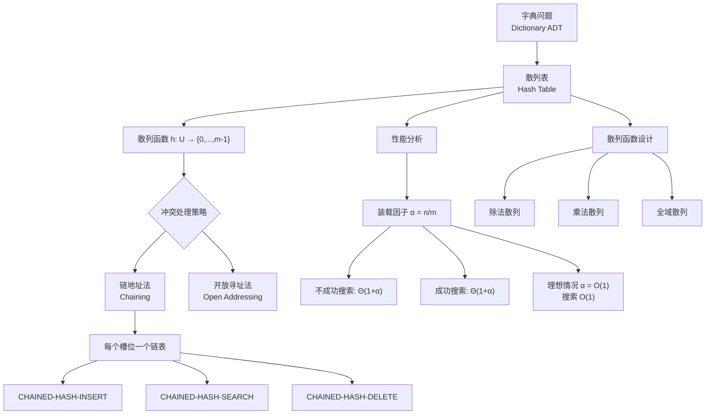

## 相关笔记

- [[11.1 直接寻址表]]
- [[第10章_基本数据结构-章节汇总]]
- [[10.2 链表]]
- [[第11章_散列表-章节汇总]]

---

> [!abstract] 概览
>
> 散列表（Hash Table）是==字典问题==的最实用解决方案，通过散列函数 $h: U \to \{0, 1, \ldots, m-1\}$ 将全域 $U$ 中的关键字映射到大小为 $m$ 的数组下标，其中 $m \ll |U|$。
>
> - **散列函数** $h(k)$：将关键字 $k$ 映射到槽位（slot），是散列表的核心组件
> - **冲突（collision）**：两个不同关键字 $k_1 \neq k_2$ 映射到同一槽位 $h(k_1) = h(k_2)$
> - ==链地址法（chaining）==：每个槽位维护一个链表，存储所有映射到该槽位的元素
> - **装载因子** $\alpha = n/m$：元素数与槽位数之比，是衡量散列表性能的关键指标
> - 不成功搜索期望时间 $\Theta(1 + \alpha)$，成功搜索期望时间 $\Theta(1 + \alpha)$
> - 散列表是对 [[11.1 直接寻址表]] 的根本性改进：空间从 $O(|U|)$ 降为 $O(n)$

---

## 知识结构图



---

## 核心思想

> [!tip] 核心思路
>
> 散列表的核心洞察是：**我们不需要为全域 $U$ 中的每个关键字都分配存储空间，只需要为实际存储的 $n$ 个元素分配 $m$ 个槽位**（$m$ 与 $n$ 同数量级），然后通过散列函数将关键字"压缩"到这 $m$ 个槽位中。
>
> 这就像一家酒店有 $m$ 间客房，但可能接待来自全域 $U$（全世界所有人）的客人。我们不需要为全世界每个人都预留一间房，只需要一个"分配规则"（散列函数）来决定每位入住客人住哪间房。当两位客人被分配到同一间房时，就产生了==冲突==，需要额外的策略来解决。

> [!def] 散列函数与冲突
>
> **散列函数**（hash function）$h: U \to \{0, 1, \ldots, m-1\}$ 将全域 $U$ 中的关键字映射到散列表的 $m$ 个槽位之一。
>
> **冲突**（collision）：对于两个不同的关键字 $k_1 \neq k_2$，如果 $h(k_1) = h(k_2)$，则称这两个关键字在槽位 $h(k_1)$ 上发生了冲突。
>
> **独立均匀散列**（independent uniform hashing）：一个理想化的理论假设——每个关键字被等概率地散列到 $m$ 个槽位中的任何一个，且不同关键字的散列值相互独立。这是一个**不可能完全实现**的理想假设（因为散列函数是确定性的），但为性能分析提供了理论基准。

> [!def] 链地址法与伪代码
>
> **链地址法**（chaining）：散列表 $T[0..m-1]$ 的每个槽位 $T[i]$ 指向一个链表（或更一般地说，一个动态集合），存储所有满足 $h(k) = i$ 的元素。
>
> **插入**：
> ```
> CHAINED-HASH-INSERT(T, x)
>     LIST-PREPEND(T[h(x.key)], x)
> ```
> 将元素 $x$ 插入到槽位 $T[h(x.\text{key})]$ 对应链表的头部，时间 $O(1)$。
>
> **搜索**：
> ```
> CHAINED-HASH-SEARCH(T, k)
>     return LIST-SEARCH(T[h(k)], k)
> ```
> 在槽位 $T[h(k)]$ 对应的链表中搜索关键字 $k$。
>
> **删除**：
> ```
> CHAINED-HASH-DELETE(T, x)
>     LIST-DELETE(T[h(x.key)], x)
> ```
> 从槽位 $T[h(x.\text{key})]$ 对应的链表中删除元素 $x$。若使用[[10.2 链表|双向链表]]，删除时间为 $O(1)$。

> [!def] 性能分析与循环不变式证明
>
> **装载因子**：$\alpha = n/m$，其中 $n$ 为已存储元素数，$m$ 为散列表大小。
>
> **定理 11.1**（不成功搜索的期望时间）：在独立均匀散列假设下，一次不成功搜索的期望时间为 $\Theta(1 + \alpha)$。
>
> **【不成功搜索期望时间（均匀散列下链表期望长度）】**
>
> **证明**：
>
> 在不成功搜索关键字 $k$ 时，我们需要检查槽位 $T[h(k)]$ 对应链表中的所有元素。由于散列函数将 $k$ 映射到 $m$ 个槽位中的任何一个，且每个槽位的链表长度期望为 $\alpha = n/m$，因此期望检查的元素数为 $\alpha$。加上计算 $h(k)$ 的 $O(1)$ 时间，总期望时间为 $O(1 + \alpha)$。
>
> ---
>
> **定理 11.2**（成功搜索的期望时间）：在独立均匀散列假设下，给定散列表中已存储 $n$ 个元素，一次成功搜索的期望时间为 $\Theta(1 + \alpha)$。
>
> **【成功搜索期望时间（指示器随机变量+期望线性性）】**
>
> **证明**（使用指示器随机变量）：
>
> 设散列表中存储的 $n$ 个关键字为 $k_1, k_2, \ldots, k_n$。定义指示器随机变量：
>
> $$X_{ij} = \begin{cases} 1 & \text{若 } h(k_i) = h(k_j) \\ 0 & \text{否则} \end{cases}$$
>
> 其中 $i \neq j$。在独立均匀散列假设下：
>
> $$E[X_{ij}] = \Pr\{h(k_i) = h(k_j)\} = \frac{1}{m}$$
>
> **【定义搜索代价变量】** 当搜索关键字 $k_j$ 时，需要检查的元素数等于与 $k_j$ 映射到同一槽位的元素数（包括 $k_j$ 自身）。设 $Y_j$ 为搜索 $k_j$ 时检查的元素数：
>
> $$Y_j = 1 + \sum_{i=1, i \neq j}^{n} X_{ij}$$
>
> 其中 $1$ 代表 $k_j$ 自身，求和项代表与 $k_j$ 冲突的其他元素。
>
> **【期望的线性性】** 由期望的线性性：
>
> $$E[Y_j] = 1 + \sum_{i=1, i \neq j}^{n} E[X_{ij}] = 1 + \frac{n-1}{m}$$
>
> **【等概率平均】** 假设搜索每个关键字 $k_j$ 的概率相等（均为 $1/n$），成功搜索的期望检查元素数为：
>
> $$E[\text{成功搜索检查数}] = \frac{1}{n}\sum_{j=1}^{n} E[Y_j] = \frac{1}{n}\sum_{j=1}^{n}\left(1 + \frac{n-1}{m}\right) = 1 + \frac{n-1}{m}$$
>
> 当 $n \gg 1$ 时，$1 + \frac{n-1}{m} \approx 1 + \alpha$。加上计算 $h(k)$ 的 $O(1)$ 时间，总期望时间为 $\Theta(1 + \alpha)$。$\blacksquare$"
>
> ---
>
> **【链地址法插入不变式（链表头部插入不破坏已有元素）】**
>
> **循环不变式证明**（以 `CHAINED-HASH-INSERT` 为例）：
>
> **不变式**：在执行完 `CHAINED-HASH-INSERT(T, x)` 后，对于所有关键字 $k \in U$，若 $k = x.\text{key}$，则 $x$ 出现在链表 $T[h(k)]$ 中；否则，链表 $T[h(k)]$ 的内容与执行前相同。
>
> **初始化**：操作执行前，散列表处于某个合法状态。不变式在操作前成立（因为尚未修改任何内容）。
>
> **维护**：`LIST-PREPEND(T[h(x.key)], x)` 仅在链表 $T[h(x.\text{key})]$ 的头部插入元素 $x$。对于 $k = x.\text{key}$，$x$ 现在出现在 $T[h(k)]$ 中；对于所有 $k \neq x.\text{key}$，$T[h(k)]$ 对应的链表未被修改。因此不变式在操作后仍然成立。
>
> **终止**：操作终止时不变式成立，说明元素 $x$ 被正确地插入到了对应槽位的链表中，且不影响其他槽位的数据。因此 `CHAINED-HASH-INSERT` 是正确的。

---

## 补充理解

> [!info] 散列表的发明历史
>
> 散列表是计算机科学中被独立发明次数最多的数据结构之一，其历史充满了并行发现的精彩故事：
>
> - **1953年**，IBM 的 Hans Peter Luhn 在一份内部备忘录中首次提出了"bucket method"（桶方法），通过数学运算将关键字转换为存储地址[^1]。Luhn 同时也是信息检索领域的先驱，发明了 KWIC 索引和 Luhn 算法（自动文摘）。
> - **1954年**，IBM 的 Gene M. Amdahl、Elaine M. Boehme 和 N. Rochester 在一篇内部报告中独立描述了散列技术，并提出了**开放寻址**（open addressing）的思想——当目标槽位被占用时，按某种规则探测下一个可用槽位。Amdahl 后来成为 IBM System/360 的首席架构师。
> - **1956年**，Arnold I. Dumey 在 *Computers and Automation* 杂志上发表了第一篇关于散列的公开论文 "Computers and Automation"，使散列技术首次进入公众视野。
> - **1957年**，W. Wesley Peterson 在 IBM Journal 上发表了系统性研究，首次分析了线性探测（linear probing）的性能特征，并提出了使用二次探测作为替代方案。
>
> Knuth 在 *TAOCP Vol. 3* 第 6.4 节中对这段历史有权威性的详细记载[^2]。散列的发明史说明了一个深刻的道理：当一个问题足够 fundamental 时，多位天才往往会几乎同时发现解决方案。
>
> [^1]: Knuth, D.E. *The Art of Computer Programming, Vol. 3: Sorting and Searching*, Section 6.4, "History and Bibliography".
> [^2]: 参见 liams.website/articles/a-history-of-hash-functions/ 对散列函数历史的详细梳理，该文引用了大量原始文献。

> [!info] 装载因子的工程实践
>
> 理论分析告诉我们搜索时间为 $\Theta(1 + \alpha)$，但工程实践中如何选择装载因子的阈值？不同语言的标准库给出了不同的答案[^3]：
>
> | 语言/实现 | 默认装载因子阈值 | 冲突处理策略 | 特殊优化 |
> |-----------|-----------------|-------------|---------|
> | **Java `HashMap`** | 0.75 | 链地址法 | 当单个桶中元素 $\geq 8$ 时，链表转为红黑树，将最坏搜索时间从 $O(n)$ 降至 $O(\log n)$ |
> | **C++ `unordered_map`** | 约 1.0（最大装载因子） | 链地址法（通常用链表或分离节点） | 标准仅规定最大装载因子，具体实现由编译器决定 |
> | **Python `dict`** | 约 2/3 ($\approx 0.66$) | 开放寻址 + 伪随机探测 | 使用更紧凑的哈希表布局，内存效率极高 |
> | **Go `map`** | 约 6.5（负载因子 = 平均桶长） | 链地址法 + 溢出桶 | 使用桶+溢出桶的混合结构，每个桶存 8 个键值对 |
>
> **Java 选择 0.75 的原因**：这是一个在时间和空间之间的经典折中。Poisson 分布告诉我们，当 $\alpha = 0.75$ 时，一个桶中恰好有 $k$ 个元素的概率为 $\frac{e^{-0.75} \cdot 0.75^k}{k!}$。此时桶为空的概率约为 $47\%$，有 8 个以上元素的概率极低（约 $0.000006$），因此红黑树转换阈值设为 8 是合理的。
>
> **Python 选择 0.66 的原因**：Python 使用开放寻址，冲突代价更高（需要探测多个槽位），因此需要更低的装载因子来保证性能。同时，Python 的散列表布局经过精心优化，每个条目仅占用 24 字节（Python 3.6+），是内存效率最高的散列表实现之一。
>
> [^3]: 参见 earezki.com/books/java-interview-engineering-first-principles-to-system-design/ch4-s1/ 对各语言散列表实现的详细对比分析。

---

## 易混淆点

> [!warning] 散列函数 vs. 随机函数
>
> | 方面 | ❌ 错误理解 | ✅ 正确理解 |
> |------|------------|------------|
> | 散列函数的性质 | "散列函数是随机的，每次调用可能返回不同结果" | 散列函数是**确定性**的：相同的输入 $k$ 永远产生相同的输出 $h(k)$。"独立均匀散列"是一个**理论假设**，用于简化分析，实际中无法完全实现 |
> | 散列函数的设计 | "好的散列函数就是完全随机的函数" | 好的散列函数应当是**确定性且均匀**的：将关键字尽可能均匀地分布到各槽位。完全随机函数虽然均匀，但不可重现，无法用于查找 |

> [!warning] 装载因子 $\alpha$ 与性能的关系
>
> | 方面 | ❌ 错误理解 | ✅ 正确理解 |
> |------|------------|------------|
> | $\alpha$ 的含义 | "装载因子越大，散列表越快，因为空间利用率高" | $\alpha$ 越大，冲突越多，每个链表越长，搜索越**慢**。搜索时间为 $\Theta(1+\alpha)$，是 $\alpha$ 的**递增**函数 |
> | $\alpha$ 的取值 | "装载因子应该尽量接近 1" | 工程实践中通常保持 $\alpha$ 在 $0.5 \sim 0.75$ 之间。当 $\alpha$ 超过阈值时，需要进行**rehash**（扩容重建），将表大小加倍并重新散列所有元素 |
> | 最坏情况 | "散列表的搜索时间总是 $O(1)$" | $\Theta(1+\alpha)$ 是**期望**时间。最坏情况下（所有元素映射到同一槽位），搜索时间退化为 $O(n)$。选择好的散列函数和合适的 $\alpha$ 可以使最坏情况极不可能发生 |

---

## 习题精选

| 题号 | 题目描述 | 难度 | 涉及知识点 |
|------|---------|------|-----------|
| 11.2-1 | 假设散列表 $T$ 使用链地址法，插入关键字序列 5, 28, 19, 15, 20, 33, 12, 17, 10，散列函数 $h(k) = k \bmod 9$，画出散列表 | ★☆☆ | 链地址法模拟 |
| 11.2-2 | 证明：在链地址法散列表中，不成功搜索的期望时间在独立均匀散列假设下为 $\Theta(1+\alpha)$ | ★★☆ | 期望时间分析 |
| 11.2-3 | 散列函数 $h(k) = \lfloor m(kA \bmod 1)\rfloor$，其中 $A = (\sqrt{5}-1)/2$，说明为什么选择这个 $A$ 值 | ★★★ | 乘法散列 |
| 11.2-4 | 给出一个长度为 $n$ 的关键字序列，使得链地址法散列表（$h(k) = k \bmod m$）的搜索时间为 $\Theta(n)$ | ★★☆ | 最坏情况构造 |
| 11.2-5 | 在链地址法散列表中，证明：将链表改为双向链表后，删除操作的时间仍为 $O(1)$ | ★☆☆ | 链表操作 |
| 11.2-6 | 假设散列表中每个元素被搜索的概率不同，修改成功搜索的期望时间分析 | ★★★ | 加权期望分析 |

> [!faq]- 11.2-1 链地址法散列表模拟
>
> **题目**：假设散列表 $T[0..8]$ 使用链地址法，依次插入关键字序列 5, 28, 19, 15, 20, 33, 12, 17, 10，散列函数 $h(k) = k \bmod 9$。画出最终的散列表。
>
> **解答**：
>
> 逐个计算散列值：
>
> | 关键字 $k$ | $h(k) = k \bmod 9$ |
> |-----------|-------------------|
> | 5 | 5 |
> | 28 | 1 |
> | 19 | 1 |
> | 15 | 6 |
> | 20 | 2 |
> | 33 | 6 |
> | 12 | 3 |
> | 17 | 8 |
> | 10 | 1 |
>
> 最终散列表（每个槽位的链表，从头部到尾部为插入顺序的逆序）：
>
> | 槽位 | 链表 |
> |------|------|
> | 0 | (空) |
> | 1 | 10 → 19 → 28 |
> | 2 | 20 |
> | 3 | 12 |
> | 4 | (空) |
> | 5 | 5 |
> | 6 | 33 → 15 |
> | 7 | (空) |
> | 8 | 17 |
>
> 装载因子 $\alpha = n/m = 9/9 = 1.0$。

> [!faq]- 11.2-2 不成功搜索期望时间证明
>
> **题目**：证明在链地址法散列表中，不成功搜索的期望时间在独立均匀散列假设下为 $\Theta(1+\alpha)$。
>
> **【不成功搜索期望时间形式化推导（等概率映射求和）】**
>
> **解答**：
>
> 在不成功搜索关键字 $k$ 时，我们需要在槽位 $T[h(k)]$ 的链表中搜索。搜索时间等于链表长度加 1（计算 $h(k)$ 的时间）。
>
> 设 $n_j$ 为槽位 $j$ 中链表的长度，则 $\sum_{j=0}^{m-1} n_j = n$。
>
> 在独立均匀散列假设下，关键字 $k$ 等概率地映射到 $m$ 个槽位中的任何一个，因此：
>
> $$E[\text{搜索时间}] = \frac{1}{m}\sum_{j=0}^{m-1}(n_j + 1) = \frac{1}{m}\left(\sum_{j=0}^{m-1}n_j + m\right) = \frac{n}{m} + 1 = \alpha + 1$$
>
> 因此不成功搜索的期望时间为 $\Theta(1 + \alpha)$。$\blacksquare$

> [!faq]- 11.2-4 最坏情况构造
>
> **题目**：给出一个长度为 $n$ 的关键字序列，使得链地址法散列表（$h(k) = k \bmod m$）的搜索时间为 $\Theta(n)$。
>
> **【最坏情况构造（同余关键字全部映射到同一槽位）】**
>
> **解答**：
>
> 选择所有关键字都是 $m$ 的倍数：$k_1 = m, k_2 = 2m, k_3 = 3m, \ldots, k_n = nm$。
>
> 则 $h(k_i) = k_i \bmod m = 0$，所有 $n$ 个关键字都映射到槽位 0。
>
> 搜索任何一个关键字都需要遍历长度为 $n$ 的链表，搜索时间为 $\Theta(n)$。
>
> 这说明选择好的散列函数至关重要。除法散列 $h(k) = k \bmod m$ 在关键字具有某种规律时可能表现很差。例如，如果所有关键字都是 $m$ 的倍数，则所有关键字都冲突。

---

## 视频指南

| # | 资源名称 | 链接 | 说明 |
|---|---------|------|------|
| 1 | MIT 6.006 - Lecture 8: Hashing with Chaining | https://www.youtube.com/watch?v=0yT1aMk0SCg | Erik Demaine 教授讲解链地址法散列表，包含定理证明 |
| 2 | Reducible - Hash Tables and Hash Functions | https://www.youtube.com/watch?v=2Ti5yvumFTU | 动画演示散列函数原理与冲突处理 |
| 3 | Abdul Bari - Hashing in Data Structure | https://www.youtube.com/watch?v=ObtP455T3yo | 通俗易懂的散列表入门讲解 |
| 4 | 算法导论中国大学MOOC（北大） | https://www.icourse163.org/course/PKU-1002525004 | 中文学术课程，覆盖散列表完整章节 |
| 5 | WilliamFiset - Hash Tables | https://www.youtube.com/watch?v=shs0KM3wKvg | 编程视角的散列表实现与性能分析 |
| 6 | Coreyms - Python Hash Tables | https://www.youtube.com/watch?v=jtMwp0FqEcg | Python dict 内部实现原理讲解 |

---

## 教材原文

> [!quote] 算法导论（第4版）11.2节
>
> "散列表（hash table）是字典问题的一种推广解决方案。与直接寻址不同，散列表使用散列函数 $h$ 来计算关键字 $k$ 的槽位。我们不再需要全域 $U$ 中的每个关键字都有一个槽位，而是使用一个大小为 $m$ 的数组，其中 $m$ 通常远小于 $|U|$。"
>
> "两个关键字可能散列到同一个槽位，我们称这种情形为冲突（collision）。"
>
> "链地址法（chaining）是最简单的冲突解决技术。我们令散列表 $T[0..m-1]$ 的每个位置指向一个链表。槽位 $T[j]$ 包含一个链表，存储所有关键字 $k$ 满足 $h(k) = j$ 的元素。"
>
> "在独立均匀散列的假设下，一次不成功搜索的期望时间为 $\Theta(1 + \alpha)$，其中 $\alpha = n/m$ 为装载因子。"

---

## 参见Wiki

- **章节汇总**：[[第11章_散列表-章节汇总]]
- **前后节**：[[第11章_散列表/11.1 直接寻址表]] | [[第11章_散列表/11.3 散列函数]]
- **相关概念**：[[字典（Dictionary）]], [[动态集合]], [[算法导论/concepts/链地址法]], [[算法导论/concepts/开放寻址法]], [[装载因子]], [[冲突]]

#学习/算法导论/第11章-散列表
#学习/算法导论/第11章-散列表/11.2-散列表
