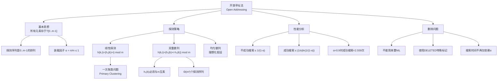

## 相关笔记

- 前置：[[11.3 散列函数]]
- 前置：[[11.1 直接寻址表]]
- 前置：[[11.2 散列表]]
- 后续：[[11.5 实际应用考虑]]
- 关联：[[第10章_基本数据结构-章节汇总]]
- 关联：[[第12章_二叉搜索树-章节汇总]]

---

> [!abstract] 概览
>
> **开放寻址法（Open Addressing）** 是一种将所有元素全部存储在散列表数组 $T[0..m-1]$ 内部的冲突解决策略，不使用任何链表或额外存储结构。每个槽位要么存放一个元素，要么标记为 **NIL**（空）。
>
> 核心要点：
> - 探测序列 $\langle h(k,0), h(k,1), \ldots, h(k,m-1) \rangle$ 必须是 $\langle 0, 1, \ldots, m-1 \rangle$ 的一个**排列**，保证每个槽位恰好被探测一次
> - 装载因子 $\alpha = n/m \leq 1$，当 $\alpha$ 接近 1 时性能急剧下降
> - 三种经典探测策略：**线性探测**、**二次探测**、**双重散列**
> - 删除操作不能简单置 NIL，需要特殊标记 **DELETED** 以避免中断探测链
> - 不成功搜索期望探测次数 $\leq \dfrac{1}{1-\alpha}$，成功搜索期望探测次数 $\leq \dfrac{1}{\alpha}\ln\dfrac{1}{1-\alpha}$

---

## 知识结构图



---

## 核心思想

> [!tip] 核心思路
>
> 开放寻址法的核心思想非常直观：**当发生冲突时，不在原地拉链，而是沿着探测序列"顺藤摸瓜"，找到下一个空槽位放入元素。** 整个散列表就是一个紧凑的数组，没有任何指针跳转。
>
> 类比：想象一个**电影院**，每个座位只能坐一个人。如果你预定的座位被人占了，你就按固定规则（比如每次往后挪一个座位）去找空位坐下。找人的时候也按同样的规则搜索。如果有人中途离开（删除），你不能简单地把座位标记为"没人坐过"，否则按规则找后面的人时会在空位处停下来，误以为人不在。你需要标记为"有人坐过但已离开"。

> [!def] 基本定义
>
> **开放寻址法**：所有元素存储在散列表 $T[0..m-1]$ 中，每个槽位包含一个元素的关键字或特殊值 NIL。对于关键字 $k$，其**探测序列**（probe sequence）为
>
> $$\langle h(k,0),\, h(k,1),\, \ldots,\, h(k,m-1) \rangle$$
>
> 其中每个 $h(k,i) \in \{0, 1, \ldots, m-1\}$，且该序列必须是 $\langle 0, 1, \ldots, m-1 \rangle$ 的一个**排列**（permutation）。
>
> **装载因子**：$\alpha = n/m$，其中 $n$ 为已存储元素数，$m$ 为表大小。由于所有元素都在表内，$\alpha \leq 1$。

### 插入与搜索伪代码

> [!def] HASH-INSERT 与 HASH-SEARCH
>
> **HASH-INSERT$(T, k)$**
>
> ```
> 1  i = 0
> 2  repeat
> 3      q = h(k, i)
> 4      if T[q] == NIL
> 5          T[q] = k
> 6          return q
> 7      else
> 8          i = i + 1
> 9  until i == m
> 10 error "hash table overflow"
> ```
>
> **HASH-SEARCH$(T, k)$**
>
> ```
> 1  i = 0
> 2  repeat
> 3      q = h(k, i)
> 4      if T[q] == k
> 5          return q
> 6      i = i + 1
> 7  until T[q] == NIL or i == m
> 8  return NIL
> ```
>
> **循环不变式**（HASH-INSERT）：在第 3 行每次执行前，槽位 $T[h(k,0)], T[h(k,1)], \ldots, T[h(k,i-1)]$ 中都不包含关键字 $k$。
>
> **初始化**：$i = 0$ 时，尚未检查任何槽位，不变式平凡成立。
>
> **保持**：若 $T[q] \neq k$（$q = h(k,i)$），则 $T[h(k,i)]$ 也不含 $k$，$i$ 递增后不变式继续成立。
>
> **终止**：若找到 $T[q] == \text{NIL}$，将 $k$ 插入 $q$；若 $i == m$，说明已探测所有 $m$ 个槽位均非空，表溢出。

### 独立均匀散列假设

> [!def] 均匀散列（Uniform Hashing）
>
> **均匀散列**是开放寻址法的理想化分析假设：每个关键字 $k$ 的探测序列等概率地为 $\{0, 1, \ldots, m-1\}$ 的 $m!$ 个排列中的任意一个，且各关键字的探测序列相互独立。
>
> 这一假设在实际中难以精确实现，但为性能分析提供了理论基础。**双重散列**是该假设的一个良好近似。

### 双重散列

> [!def] 双重散列（Double Hashing）
>
> **双重散列**是实践中最常用的开放寻址策略，使用两个辅助散列函数：
>
> $$h(k, i) = (h_1(k) + i \cdot h_2(k)) \bmod m$$
>
> 其中 $h_2(k)$ 必须与 $m$ **互素**（即 $\gcd(h_2(k), m) = 1$），以保证探测序列能覆盖所有槽位。
>
> **实践方案**：
> - 当 $m$ 为 2 的幂时：选择 $h_2(k)$ 总产生**奇数**（奇数与 $2^r$ 互素）
> - 当 $m$ 为素数时：$h_2(k) = 1 + (k \bmod m')$，其中 $m' = m - 1$
>
> **示例**：$k = 123456$，$m = 701$（素数），$m' = 700$
> - $h_1(k) = k \bmod 701 = 80$
> - $h_2(k) = 1 + (123456 \bmod 700) = 1 + 256 = 257$
> - 探测序列：$80, (80+257) \bmod 701 = 337, (80+514) \bmod 701 = 594, \ldots$
>
> 双重散列产生 $\Theta(m^2)$ 个不同的探测序列（因为 $h_1(k)$ 有 $m$ 种取值，$h_2(k)$ 至少有 $m-1$ 种取值），远优于线性探测的 $m$ 个序列。

### 线性探测

> [!def] 线性探测（Linear Probing）
>
> **线性探测**是最简单的开放寻址策略：
>
> $$h(k, i) = (h_1(k) + i) \bmod m$$
>
> 等价于双重散列中 $h_2(k) = 1$ 的情况。线性探测只有 $m$ 个不同的探测序列（由 $h_1(k)$ 的初始位置决定），容易产生**一次聚类**（primary clustering）：连续被占用的槽位会越来越长，导致新插入的元素大概率落入聚类中，进一步延长聚类。

### 性能分析

> [!tip] 定理 11.6 — 不成功搜索的期望探测次数
>
> **定理 11.6**：给定装载因子 $\alpha = n/m < 1$，在均匀散列假设下，一次**不成功搜索**的期望探测次数最多为 $1/(1-\alpha)$。
>
> **【不成功搜索期望探测次数（均匀散列下条件概率连乘）】**
>
> **证明**：
>
> 设 $X$ 为一次不成功搜索的探测次数。我们需要证明 $E[X] \leq \dfrac{1}{1-\alpha}$。
>
> **【第一步：定义事件】** 对于 $i = 1, 2, \ldots$，令
>
> $$\mathcal{A}_i = \{\text{第 } i \text{ 次探测的槽位已被占用}\}$$
>
> 则 $X \geq i$ 当且仅当前 $i$ 次探测的槽位都被占用，即 $\mathcal{A}_1 \cap \mathcal{A}_2 \cap \cdots \cap \mathcal{A}_i$ 发生。
>
> **【第二步：计算条件概率】** 在均匀散列假设下，前 $i$ 个探测位置是从 $m$ 个槽位中均匀选取的 $i$ 个不同槽位。表中已有 $n$ 个元素，因此：
>
> $$\Pr\{X \geq 1\} = \frac{n}{m} = \alpha$$
>
> $$\Pr\{X \geq 2 \mid X \geq 1\} = \frac{n-1}{m-1}$$
>
> 一般地：
>
> $$\Pr\{X \geq i\} = \frac{n}{m} \cdot \frac{n-1}{m-1} \cdot \frac{n-2}{m-2} \cdots \frac{n-i+1}{m-i+1}$$
>
> **【关键不等式】** 由于 $\dfrac{n-j}{m-j} \leq \dfrac{n}{m} = \alpha$（对 $j \geq 0$），我们有：
>
> $$\Pr\{X \geq i\} \leq \alpha^{i-1}$$
>
> **【第三步：期望求和】** 利用期望的求和公式。对任意非负整数随机变量 $X$：
>
> $$E[X] = \sum_{i=1}^{\infty} \Pr\{X \geq i\}$$
>
> 因此：
>
> $$E[X] = \sum_{i=1}^{\infty} \Pr\{X \geq i\} \leq \sum_{i=1}^{\infty} \alpha^{i-1} = \sum_{j=0}^{\infty} \alpha^j = \frac{1}{1-\alpha}$$
>
> **【等比级数求和】** 最后一步使用了**等比级数**求和公式，当 $0 \leq \alpha < 1$ 时收敛。$\blacksquare$

> [!tip] 推论 11.7 — 插入的期望探测次数
>
> **推论 11.7**：在均匀散列假设下，向装载因子为 $\alpha$ 的散列表中插入一个元素的期望探测次数最多为 $1/(1-\alpha)$。
>
> **【插入等价于不成功搜索（找到空槽位即插入）】**
>
> **证明**：插入操作等价于一次不成功搜索（找到空槽位），因此期望探测次数相同。$\blacksquare$

> [!tip] 定理 11.8 — 成功搜索的期望探测次数
>
> **定理 11.8**：给定装载因子 $\alpha = n/m < 1$，在均匀散列假设下，一次**成功搜索**的期望探测次数最多为 $\dfrac{1}{\alpha}\ln\dfrac{1}{1-\alpha}$。
>
> **【成功搜索期望探测次数（条件期望+积分近似）】**
>
> **证明**：
>
> 设 $X$ 为一次成功搜索的探测次数。设被搜索的关键字为 $k$，它是第 $(i+1)$ 个插入表中的元素（$i = 0, 1, \ldots, n-1$）。
>
> **【分解为条件期望】** 搜索 $k$ 的探测次数等于插入 $k$ 时的探测次数。当 $k$ 被插入时，表中已有 $i$ 个元素，因此插入 $k$ 的探测次数等价于在一个有 $i$ 个元素的表中进行不成功搜索的探测次数。
>
> 设 $X_i$ 为在含有 $i$ 个元素的表中进行不成功搜索的探测次数。由定理 11.6：
>
> $$E[X_i] \leq \frac{1}{1 - i/m}$$
>
> **【等概率平均】** 假设搜索每个已存元素的概率相等（均为 $1/n$），则成功搜索的期望探测次数为：
>
> $$E[X] = \frac{1}{n} \sum_{i=0}^{n-1} E[X_i] \leq \frac{1}{n} \sum_{i=0}^{n-1} \frac{1}{1 - i/m}$$
>
> **【积分近似求和】** 利用积分近似求和 $\sum_{i=0}^{n-1} \frac{1}{1-i/m}$：
>
> $$\frac{1}{n} \sum_{i=0}^{n-1} \frac{1}{1 - i/m} = \frac{m}{n} \cdot \frac{1}{m} \sum_{i=0}^{n-1} \frac{1}{1 - i/m}$$
>
> 令 $\alpha = n/m$，$x_i = i/m$，$\Delta x = 1/m$，则：
>
> $$\frac{1}{n} \sum_{i=0}^{n-1} \frac{1}{1 - i/m} = \frac{1}{\alpha} \sum_{i=0}^{n-1} \frac{1}{1 - x_i} \cdot \Delta x \approx \frac{1}{\alpha} \int_0^{\alpha} \frac{1}{1-x} dx$$
>
> 计算积分：
>
> $$\frac{1}{\alpha} \int_0^{\alpha} \frac{1}{1-x} dx = \frac{1}{\alpha} [-\ln(1-x)]_0^{\alpha} = \frac{1}{\alpha} (-\ln(1-\alpha)) = \frac{1}{\alpha} \ln \frac{1}{1-\alpha}$$
>
> 因此 $E[X] \leq \frac{1}{\alpha} \ln \frac{1}{1-\alpha}$。$\blacksquare$

> [!info] 不同装载因子下的性能对比
>
> | 装载因子 $\alpha$ | 不成功搜索 $\leq 1/(1-\alpha)$ | 成功搜索 $\leq (1/\alpha)\ln(1/(1-\alpha))$ |
> |:---:|:---:|:---:|
> | 0.50 | 2.000 | 1.387 |
> | 0.75 | 4.000 | 1.872 |
> | 0.90 | 10.000 | 2.559 |
> | 0.95 | 20.000 | 3.153 |
> | 0.99 | 100.000 | 4.652 |
>
> 当 $\alpha > 0.9$ 时，不成功搜索的性能急剧恶化，因此实践中通常保持 $\alpha \leq 0.75$。

---

## 补充理解

> [!info] 补充1：开放寻址法的聚类问题及解决方案
>
> **一次聚类（Primary Clustering）** 是线性探测的核心缺陷。Knuth 在 *The Art of Computer Programming, Vol. 3* [1] 中详细分析了一次聚类的形成机制：当连续的槽位被占用后，新插入的元素有更高概率落入该聚类区域，使得聚类像"雪球"一样越来越大。
>
> **二次聚类（Secondary Clustering）** 是二次探测 $h(k,i) = (h_1(k) + c_1 i + c_2 i^2) \bmod m$ 的问题：散列到同一初始位置的关键字会遵循相同的探测轨迹。
>
> 两种改进方案：
> - **Robin Hood 散列**（Celis, 1986 [2]）：在插入时，如果新元素的探测次数大于当前位置已有元素的探测次数，则"抢走"该位置，将已有元素继续往后探测。这使得所有元素的探测次数方差最小化，最坏情况探测次数从 $O(\log n)$ 降到 $O(\log \log n)$。
> - **布谷鸟散列**（Cuckoo Hashing, Pagh & Rodler, 2001/2004 [3]）：使用两个独立的散列函数 $h_1, h_2$ 和两个散列表（或同一表的两个半区）。每个关键字 $k$ 只能存储在 $T_1[h_1(k)]$ 或 $T_2[h_2(k)]$。插入时若两个位置都已被占用，则"踢出"其中一个已有元素，被踢出的元素再去尝试自己的另一个位置，形成"踢出链"。最坏情况查找时间为 $O(1)$。
>
> **参考文献**：
> 1. Knuth, D.E. *The Art of Computer Programming, Vol. 3: Sorting and Searching*, 2nd ed., Addison-Wesley, 1998.
> 2. Celis, P. "Robin Hood Hashing." *PhD Thesis*, University of Waterloo, 1986.
> 3. Pagh, R. & Rodler, F.F. "Cuckoo Hashing." *Journal of Algorithms*, 51(2): 122-144, 2004.

> [!info] 补充2：开放寻址 vs 链地址法的工程选择
>
> 在实际工程中，选择开放寻址还是链地址法需要综合考虑多个因素 [4]：
>
> | 维度 | 开放寻址 | 链地址法 |
> |:---|:---|:---|
> | 缓存友好性 | **优秀**（连续内存访问） | 较差（指针追踪） |
> | 删除复杂度 | 较高（需DELETED标记或移动） | **简单**（直接释放节点） |
> | 内存开销 | 紧凑（仅数组） | 较高（额外指针/节点） |
> | 适合元素大小 | 小对象 | 大对象 |
> | 装载因子上限 | $\leq 1$（实际 $\leq 0.75$） | $> 1$（可超过1） |
>
> **主流语言的选择**：
> - **Python dict**：开放寻址 + 伪随机探测，装载因子 $2/3 \approx 0.66$
> - **Java HashMap**：链地址法，默认装载因子 0.75，链表长度 $\geq 8$ 转红黑树
> - **Go map**：开放寻址，装载因子约 6.5（Go 的实现中每个桶存 8 个元素）
> - **Rust HashMap**：开放寻址（SwissTable 算法），高缓存效率
>
> **参考文献**：
> 4. Engineering LibreTexts. "Hash Table - Collision Resolution." *eng.libretexts.org*. [在线资源]

---

## 易混淆点

> [!warning] 混淆1：开放寻址中删除操作的处理
>
> **错误理解**：删除元素时直接将槽位置为 NIL，和插入前的空槽位一样。
>
> **正确理解**：不能简单置 NIL。假设元素 $A$ 在位置 5，元素 $B$ 散列到位置 3，通过探测 $3 \to 4 \to 5$ 找到 5 已被占用，最终存放在位置 6。如果删除 $A$ 后将位置 5 置为 NIL，搜索 $B$ 时探测到位置 5 发现 NIL，会错误地认为 $B$ 不存在。
>
> | 操作 | ❌ 错误做法 | ✅ 正确做法 |
> |:---|:---|:---|
> | 删除 $k$ | `T[q] = NIL` | 使用特殊标记 `DELETED`：`T[q] = DELETED` |
> | 搜索 $k$ | 遇到 NIL 停止 | 遇到 NIL 停止，但**跳过** DELETED 继续 |
> | 插入 $k$ | 遇到 NIL 插入 | 遇到 NIL 或 DELETED 均可插入 |
>
> **代价**：使用 DELETED 后，不成功搜索的探测次数不再仅依赖于 $\alpha$，还取决于 DELETED 标记的数量。线性探测可以通过"向后移动"策略避免 DELETED 标记（见 11.5 节）。

> [!warning] 混淆2：线性探测 vs 双重散列的探测序列数量
>
> **错误理解**：线性探测和双重散列都能产生足够多的探测序列，性能差不多。
>
> **正确理解**：两者的探测序列数量差异巨大，直接影响聚类的严重程度。
>
> | 策略 | 探测序列数量 | 聚类问题 |
> |:---|:---|:---|
> | 线性探测 | $m$ 个（仅初始位置不同） | **严重**一次聚类 |
> | 二次探测 | 约 $m/2$ 个 | 二次聚类 |
> | 双重散列 | $\Theta(m^2)$ 个 | 几乎无聚类 |
>
> 线性探测只有 $m$ 个不同的探测序列（因为 $h_2(k) = 1$ 固定，只有 $h_1(k)$ 的 $m$ 种初始位置不同），而双重散列有 $\Theta(m^2)$ 个序列（$h_1(k)$ 和 $h_2(k)$ 的组合），使得不同关键字的探测轨迹高度分散，有效避免聚类。

---

## 习题精选

| 题号 | 题目 | 难度 |
|:---:|:---|:---:|
| 11.4-1 | 线性探测和双重散列的插入演示 | ★★☆ |
| 11.4-2 | 设计 HASH-DELETE 伪代码 | ★★☆ |
| 11.4-3 | 计算特定装载因子下的探测次数 | ★★☆ |
| 11.4-4 | $\alpha = 1$ 时成功搜索与调和数的关系 | ★★★ |
| 11.4-5 | 证明双重散列中 $\gcd(h_2(k), m) = 1$ 的必要性 | ★★★ |
| 11.4-6 | 求成功搜索恰好等于 2 倍不成功搜索的 $\alpha$ 值 | ★★★ |

> [!faq]- 习题 11.4-1：线性探测和双重散列的插入演示
>
> **题目**：考虑散列表 $T[0..12]$（$m = 13$），使用散列函数 $h(k) = k \bmod 13$。依次插入关键字 $\{18, 41, 22, 44, 59, 32, 31, 73\}$，分别用线性探测和双重散列（$h_2(k) = 1 + (k \bmod 11)$）展示插入过程。
>
> **解题思路**：
> 1. 计算每个关键字的 $h_1(k) = k \bmod 13$
> 2. 线性探测：$h(k,i) = (h_1(k) + i) \bmod 13$
> 3. 双重散列：$h(k,i) = (h_1(k) + i \cdot h_2(k)) \bmod 13$
>
> **标准答案**：
>
> 先计算各关键字的散列值：
> | $k$ | 18 | 41 | 22 | 44 | 59 | 32 | 31 | 73 |
> |:---:|:---:|:---:|:---:|:---:|:---:|:---:|:---:|:---:|
> | $h_1(k)$ | 5 | 2 | 9 | 5 | 7 | 6 | 5 | 8 |
> | $h_2(k)$ | 8 | 9 | 1 | 1 | 4 | 10 | 9 | 8 |
>
> **线性探测**：
> - 18 → 位置 5（空）→ $T[5] = 18$
> - 41 → 位置 2（空）→ $T[2] = 41$
> - 22 → 位置 9（空）→ $T[9] = 22$
> - 44 → 位置 5（冲突）→ 6（空）→ $T[6] = 44$
> - 59 → 位置 7（空）→ $T[7] = 59$
> - 32 → 位置 6（冲突）→ 7（冲突）→ 8（空）→ $T[8] = 32$
> - 31 → 位置 5（冲突）→ 6（冲突）→ 7（冲突）→ 8（冲突）→ 9（冲突）→ 10（空）→ $T[10] = 31$
> - 73 → 位置 8（冲突）→ 9（冲突）→ 10（冲突）→ 11（空）→ $T[11] = 73$
>
> **双重散列**：
> - 18 → $h(18,0) = 5$（空）→ $T[5] = 18$
> - 41 → $h(41,0) = 2$（空）→ $T[2] = 41$
> - 22 → $h(22,0) = 9$（空）→ $T[9] = 22$
> - 44 → $h(44,0) = 5$（冲突）→ $h(44,1) = (5+1) \bmod 13 = 6$（空）→ $T[6] = 44$
> - 59 → $h(59,0) = 7$（空）→ $T[7] = 59$
> - 32 → $h(32,0) = 6$（冲突）→ $h(32,1) = (6+10) \bmod 13 = 3$（空）→ $T[3] = 32$
> - 31 → $h(31,0) = 5$（冲突）→ $h(31,1) = (5+9) \bmod 13 = 1$（空）→ $T[1] = 31$
> - 73 → $h(73,0) = 8$（空）→ $T[8] = 73$
>
> 对比可见，双重散列中 31 只探测了 2 次就找到空位，而线性探测中探测了 6 次，体现了双重散列减少聚类的优势。

> [!faq]- 习题 11.4-2：设计 HASH-DELETE 伪代码
>
> **题目**：假设使用特殊标记 DELETED，给出 HASH-DELETE 的伪代码。
>
> **标准答案**：
>
> ```
> HASH-DELETE(T, k):
> 1  i = 0
> 2  repeat
> 3      q = h(k, i)
> 4      if T[q] == k
> 5          T[q] = DELETED
> 6          return q
> 7      i = i + 1
> 8  until T[q] == NIL or i == m
> 9  error "element not found"
> ```
>
> 注意：HASH-SEARCH 也需要相应修改，遇到 DELETED 时不能停止，应继续探测：
>
> ```
> HASH-SEARCH'(T, k):
> 1  i = 0
> 2  repeat
> 3      q = h(k, i)
> 4      if T[q] == k
> 5          return q
> 6      i = i + 1
> 7  until T[q] == NIL or i == m
> 8  return NIL
> ```
>
> 搜索逻辑实际上不需要改变（因为 DELETED $\neq k$），但关键区别在于：搜索不会在 DELETED 处提前终止。HASH-INSERT 需要修改为遇到 DELETED 也可插入。

> [!faq]- 习题 11.4-3：计算特定装载因子下的探测次数
>
> **题目**：分别计算 $\alpha = 3/4$ 和 $\alpha = 7/8$ 时不成功搜索和成功搜索的期望探测次数上限。
>
> **标准答案**：
>
> **$\alpha = 3/4$**：
> - 不成功搜索：$\dfrac{1}{1 - 3/4} = \dfrac{1}{1/4} = 4$ 次
> - 成功搜索：$\dfrac{1}{3/4}\ln\dfrac{1}{1-3/4} = \dfrac{4}{3}\ln 4 = \dfrac{4}{3} \times 1.386 \approx 1.848$ 次
>
> **$\alpha = 7/8$**：
> - 不成功搜索：$\dfrac{1}{1 - 7/8} = \dfrac{1}{1/8} = 8$ 次
> - 成功搜索：$\dfrac{1}{7/8}\ln\dfrac{1}{1-7/8} = \dfrac{8}{7}\ln 8 = \dfrac{8}{7} \times 2.079 \approx 2.377$ 次

> [!faq]- 习题 11.4-4：$\alpha = 1$ 时成功搜索与调和数的关系
>
> **题目**：证明当 $\alpha = 1$（即 $n = m$）时，成功搜索的期望探测次数等于第 $m$ 个调和数 $H_m = \sum_{j=1}^{m} 1/j$。
>
> **【α=1时成功搜索退化为调和数（求和变量替换）】**
>
> **标准答案**：
>
> 当 $n = m$ 时，$\alpha = 1$。回顾定理 11.8 证明中的关键步骤：
>
> $$E[\text{成功搜索}] = \frac{1}{n}\sum_{i=0}^{n-1} \frac{m}{m-i}$$
>
> 令 $j = m - i$，当 $i$ 从 $0$ 到 $n-1 = m-1$ 时，$j$ 从 $m$ 到 $1$：
>
> $$= \frac{1}{m}\sum_{j=1}^{m} \frac{m}{j} = \sum_{j=1}^{m} \frac{1}{j} = H_m$$
>
> 其中 $H_m = \displaystyle\sum_{j=1}^{m} \frac{1}{j}$ 是第 $m$ 个**调和数**（harmonic number）。
>
> 由调和数的渐近性质，$H_m = \ln m + \gamma + O(1/m)$，其中 $\gamma \approx 0.5772$ 是欧拉-马歇罗尼常数。因此当表满时，成功搜索的期望探测次数为 $O(\log m)$。$\blacksquare$

> [!faq]- 习题 11.4-5：证明双重散列中 $\gcd(h_2(k), m) = 1$ 的必要性
>
> **题目**：考虑双重散列 $h(k,i) = (h_1(k) + i \cdot h_2(k)) \bmod m$。证明如果 $\gcd(h_2(k), m) = d > 1$，则探测序列不能覆盖所有 $m$ 个槽位。
>
> **【双重散列gcd=1必要性（模d余数固定导致覆盖不全）】**
>
> **标准答案**：
>
> 设 $\gcd(h_2(k), m) = d > 1$。
>
> 探测序列为：$h(k,i) = (h_1(k) + i \cdot h_2(k)) \bmod m$，$i = 0, 1, 2, \ldots$
>
> 注意到 $h(k,i) \equiv h_1(k) + i \cdot h_2(k) \pmod{m}$。
>
> 由于 $d \mid h_2(k)$ 且 $d \mid m$，对所有 $i$：
>
> $$h(k,i) \equiv h_1(k) + i \cdot h_2(k) \equiv h_1(k) \pmod{d}$$
>
> 即探测序列中的所有值模 $d$ 都等于 $h_1(k) \bmod d$，是一个固定值。
>
> 这意味着探测序列只能到达满足 $q \equiv h_1(k) \pmod{d}$ 的那些槽位。这样的槽位恰好有 $m/d$ 个（因为 $0, 1, \ldots, m-1$ 中模 $d$ 余 $h_1(k) \bmod d$ 的数有 $m/d$ 个）。
>
> 因此探测序列最多覆盖 $m/d < m$ 个槽位，无法覆盖所有 $m$ 个槽位。$\blacksquare$
>
> **推论**：当 $d > 1$ 时，即使表中还有空槽位，也可能找不到它们，导致不必要的"hash table overflow"错误。

> [!faq]- 习题 11.4-6：求成功搜索恰好等于 2 倍不成功搜索的 $\alpha$ 值
>
> **题目**：求满足成功搜索期望探测次数恰好等于 2 倍不成功搜索期望探测次数的装载因子 $\alpha$。
>
> **标准答案**：
>
> 由定理 11.6 和 11.8：
>
> - 不成功搜索：$U(\alpha) = \dfrac{1}{1-\alpha}$
> - 成功搜索：$S(\alpha) = \dfrac{1}{\alpha}\ln\dfrac{1}{1-\alpha}$
>
> 题目要求 $S(\alpha) = 2 \cdot U(\alpha)$，即：
>
> $$\frac{1}{\alpha}\ln\frac{1}{1-\alpha} = \frac{2}{1-\alpha}$$
>
> 令 $x = \alpha$，整理得：
>
> $$(1-x)\ln\frac{1}{1-x} = 2x$$
>
> 即：
>
> $$-(1-x)\ln(1-x) = 2x$$
>
> 令 $f(x) = -(1-x)\ln(1-x) - 2x$，我们需要 $f(x) = 0$ 的解。
>
> 通过数值方法（如牛顿迭代法）求解：
>
> - $f(0.5) = -0.5 \times \ln(0.5) - 1 = 0.5 \times 0.693 - 1 = -0.653 < 0$
> - $f(0.7) = -0.3 \times \ln(0.3) - 1.4 = 0.3 \times 1.204 - 1.4 = -1.039 < 0$
> - $f(0.8) = -0.2 \times \ln(0.2) - 1.6 = 0.2 \times 1.609 - 1.6 = -1.278 < 0$
> - $f(0.9) = -0.1 \times \ln(0.1) - 1.8 = 0.1 \times 2.303 - 1.8 = -1.570 < 0$
>
> 注意到 $f(x)$ 在 $(0, 1)$ 上始终为负，因为 $-(1-x)\ln(1-x)$ 的最大值约为 $1/e \approx 0.368$（在 $x = 1 - 1/e$ 处取得），而 $2x$ 在 $x > 0.184$ 时就超过了这个值。
>
> 因此，在 $(0, 1)$ 范围内，**不存在**满足条件的 $\alpha$ 值。成功搜索的期望探测次数始终小于 2 倍的不成功搜索期望探测次数。

---

## 视频指南

| 序号 | 资源 | 链接 |
|:---:|:---|:---|
| 1 | MIT 6.006: Hashing with Chaining & Open Addressing | https://www.youtube.com/watch?v=0M_kIqhwbFo |
| 2 | Abdul Bari: Hashing - Open Addressing | https://www.youtube.com/watch?v=3mWBMk_Dikg |
| 3 | NeetCode: Hash Tables Explained | https://www.youtube.com/watch?v=shsSkmB2K6o |
| 4 | WilliamFiset: Open Addressing Hash Tables | https://www.youtube.com/watch?v=0XA0pd3zNLc |
| 5 | 王道考研：散列表-开放寻址法 | https://www.bilibili.com/video/BV1b7411N798 |
| 6 | Pagh 教授：Cuckoo Hashing 讲座 | https://www.youtube.com/watch?v=3gK1O7nRJnI |

---

## 教材原文

> [!quote] 算法导论（第4版）11.4节
>
> "In open addressing, all elements are stored in the hash table itself. That is, each table entry contains either an element of the dynamic set or NIL. When searching for an element, we systematically examine table slots until the desired element is found or it is clear that the element is not in the table."
>
> "The algorithm for searching for key $k$ probes the same sequence of slots that the insert algorithm examined when it inserted the element with key $k$. Therefore, if the search reaches a NIL slot, then the key is not in the table, since the key would have been inserted there during the insertion."
>
> "Deletion is more difficult. We cannot simply set the slot to NIL, because that might interfere with subsequent searches. Instead, we mark the slot with a special value DELETED."

---

## 参见Wiki

- [[第11章_散列表/11.3 散列函数]] — 散列函数的设计
- [[第11章_散列表/11.5 实际应用考虑]] — 内存层次结构对散列的影响
- [[第10章_基本数据结构-章节汇总]]
- [[第12章_二叉搜索树-章节汇总]]

#学习/算法导论/第11章-散列表
#学习/算法导论/第11章-散列表/11.4-开放寻址法
