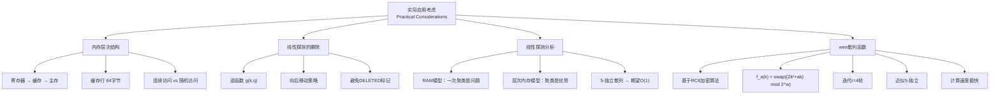

## 相关笔记

- 前置：[[11.4 开放寻址法]]
- 前置：[[11.3 散列函数]]
- 前置：[[11.2 散列表]]
- 关联：[[第10章_基本数据结构-章节汇总]]
- 关联：[[第12章_二叉搜索树-章节汇总]]

---

> [!abstract] 概览
>
> **散列表的实际应用**不仅取决于算法理论分析（RAM 模型），还深受底层硬件**内存层次结构**的影响。本章将散列表的分析从理想化的 RAM 模型扩展到更贴近现实的**层次内存模型**。
>
> 核心要点：
> - 现代 CPU 的**缓存行**（cache line，通常 64 字节）使得连续内存访问远快于随机访问
> - ==线性探测==在层次内存模型中表现优秀，因为连续探测大概率命中同一缓存行
> - 线性探测的删除可以通过"向后移动"策略避免使用 DELETED 标记
> - ==wee 散列函数==基于 RC6 加密算法，计算速度极快且近似 5-独立
> - 当散列函数为 5-独立且 $\alpha \leq 2/3$ 时，线性探测期望 $O(1)$ 时间（Pagh et al.）
> - 主流编程语言的散列表实现各有取舍，体现了理论与实践的平衡

---

## 知识结构图



---

## 核心思想

> [!tip] 核心思路
>
> 传统的散列分析基于 **RAM 模型**（Random Access Machine），假设每次内存访问代价相同。但在真实计算机中，**内存访问代价差异巨大**：访问寄存器约 1 个周期，L1 缓存约 4 个周期，L2 缓存约 10 个周期，主存约 100-300 个周期。
>
> 这对散列表设计有深远影响：
> - **链地址法**需要沿指针跳转（pointer chasing），每次跳转可能触发缓存未命中，代价高昂
> - **线性探测**沿数组顺序访问，连续探测大概率在同一缓存行内，缓存命中率高
>
> 因此，在层次内存模型下，线性探测的"一次聚类"反而成为优势——聚类意味着数据在内存中连续存放，缓存利用率更高。

### 内存层次结构

> [!def] 内存层次结构（Memory Hierarchy）
>
> 现代计算机的存储系统形成层次结构，从快到慢、从小到大：
>
> $$\text{寄存器} \to \text{L1 缓存} \to \text{L2 缓存} \to \text{L3 缓存} \to \text{主存（DRAM）} \to \text{磁盘}$$
>
> 关键参数：
> - **缓存行（cache line）**：CPU 从主存获取数据的最小单位，通常为 **64 字节**
> - **缓存未命中（cache miss）**：访问的数据不在缓存中，需要从主存加载，代价约 100-300 个时钟周期
> - **空间局部性（spatial locality）**：访问某个地址后，其附近的地址也很快会被访问。缓存行机制正是利用了这一特性
>
> 对于散列表的影响：
> - 假设每个散列表元素占 8 字节（如 64 位关键字），一个 64 字节的缓存行可容纳 8 个元素
> - 线性探测连续检查的 8 个槽位很可能在同一缓存行内，只需一次缓存加载
> - 双重散列的探测步长较大，连续探测的槽位可能分散在不同缓存行中

### 线性探测的删除

> [!def] 线性探测的删除——向后移动策略
>
> 在 11.4 节中我们看到，开放寻址的删除需要使用 DELETED 标记，但 DELETED 会降低搜索性能。对于线性探测，存在一种更优雅的删除策略：**向后移动**（backward shift）。
>
> **核心思想**：删除位置 $q$ 的元素后，检查 $q$ 后面的元素是否有某个元素 $k'$ 的"原始散列位置"在 $q$ 之前或就是 $q$ 本身。如果有，将该元素移到 $q$，然后从新位置继续检查。
>
> **逆函数**：定义 $g(k, q)$ 为关键字 $k$ 从其散列位置 $h_1(k)$ 到当前位置 $q$ 的偏移量：
>
> $$g(k, q) = (q - h_1(k)) \bmod m$$
>
> 如果 $g(k', q) < g(k', q')$（其中 $q'$ 是 $k'$ 的当前位置，$q < q'$），说明 $k'$ 的散列位置在 $q$ 和 $q'$ 之间，删除 $q$ 后 $k'$ 应该向前移动。

> [!def] LINEAR-PROBING-HASH-DELETE 伪代码
>
> ```
> LINEAR-PROBING-HASH-DELETE(T, q):
> 1  while TRUE
> 2      T[q] = NIL
> 3      q' = q
> 4      repeat
> 5          q' = (q' + 1) mod m
> 6          k' = T[q']
> 7          if k' == NIL
> 8              return
> 9      until g(k', q) < g(k', q')
> 10     T[q] = k'
> 11     q = q'
> ```
>
> **循环不变式**（外层 while 循环）：在第 2 行执行前，位置 $q$ 为空（NIL），且 $q$ 之前所有元素的探测链未被中断——即对每个关键字 $k$，如果 $h_1(k) \leq q$，则 $k$ 仍在正确的探测链上。
>
> **正确性直觉**：每次迭代将一个"应该更靠前"的元素移到空位 $q$，然后在元素原来的位置产生新的空位，继续检查是否有更后面的元素需要前移，直到遇到 NIL 或没有元素需要前移。
>
> **时间复杂度**：最坏情况 $O(m)$，但平均情况下每个被移动的元素只需要移动很短的距离。

### 线性探测的理论分析

> [!tip] 定理 11.9 — 线性探测的期望常数时间
>
> **定理 11.9**（Pagh et al.）：若散列函数 $h_1$ 是 **5-独立**（5-universal）的，且装载因子 $\alpha \leq 2/3$，则线性探测散列表中每次操作的期望时间为 $O(1)$。
>
> **背景**：在 RAM 模型中，均匀散列假设下线性探测的期望时间为 $O(1/(1-\alpha)^2)$，比双重散列的 $O(1/(1-\alpha))$ 差。但在层次内存模型中，线性探测的缓存优势可以弥补这一差距。
>
> **5-独立散列函数**的定义：一个散列函数族 $\mathcal{H}$ 是 5-独立的，如果对于任意 5 个不同的关键字 $k_1, k_2, k_3, k_4, k_5$ 和任意 5 个值 $v_1, v_2, v_3, v_4, v_5$：
>
> $$\Pr_{h \in \mathcal{H}}[h(k_1) = v_1 \wedge h(k_2) = v_2 \wedge \cdots \wedge h(k_5) = v_5] = \frac{1}{m^5}$$
>
> 即任意 5 个关键字的散列值完全独立、均匀分布。
>
> **意义**：这一定理表明，在实践中使用足够好的散列函数（如 wee 散列），线性探测在 $\alpha \leq 2/3$ 时可以达到期望 $O(1)$ 的性能，同时享受缓存友好的优势。
>
> 当 $\alpha = 1 - \varepsilon$（接近满载）时，期望操作时间为 $O(1/\varepsilon^2)$。

### wee 散列函数

> [!def] wee 散列函数（wee hash function）
>
> **wee 散列函数**是一种基于 **RC6 加密算法**的快速散列函数，由算法导论第4版作者设计。其核心特点是计算速度极快（比探测一个随机槽位快 2-10 倍），同时具有近似 5-独立的性质。
>
> **核心变换** $f_a$：对于 $w$ 位整数 $k$ 和参数 $a$，
>
> $$f_a(k) = \text{swap}\left((2k^2 + ak) \bmod 2^w\right)$$
>
> 其中 $\text{swap}$ 交换一个 $w$ 位整数的高半字和低半字。例如，对于 $w = 32$：
>
> $$\text{swap}(x) = (x \bmod 2^{16}) \cdot 2^{16} + \lfloor x / 2^{16} \rfloor$$
>
> **迭代结构**：wee 散列函数对 $f_a$ 迭代 $r = 4$ 轮，每轮使用不同的参数 $a$：
>
> $$F_a^r(k) = f_{a_{r-1}}(f_{a_{r-2}}(\cdots f_{a_0}(k)\cdots))$$
>
> **短输入散列**（定长关键字）：
>
> $$h_{a,b,t,r}(k) = \left(F_a^r(k + b) \bmod 2^w\right) \bmod m$$
>
> 其中 $b$ 是随机偏移量，$t$ 是表大小参数。
>
> **变长输入散列**：对于变长关键字，先使用 $\text{chop}(k)$ 将关键字分割为固定大小的"词"（words），然后逐词迭代处理：
>
> $$h_{a,b,t,r}(k) = F_a^r(\text{chop}(k) + b) \bmod m$$
>
> **性能数据**（2019 MacBook Pro）：
> - 计算 wee 散列值比探测一个随机内存槽位快 **2-10 倍**
> - 这意味着散列函数的计算开销几乎可以忽略不计，瓶颈在于内存访问
>
> **近似 5-独立**：wee 散列函数并非严格 5-独立，但在实践中表现出近似 5-独立的性质，足以满足定理 11.9 的要求。

---

## 补充理解

> [!info] 补充1：主流语言散列实现对比
>
> 不同编程语言的散列表实现体现了不同的设计哲学和工程权衡 [1][2]：
>
> | 语言 | 实现方式 | 装载因子 | 冲突解决 | 特殊优化 |
> |:---|:---|:---:|:---|:---|
> | **Java HashMap** | 链地址法 | 0.75 | 链表 → 红黑树 | 链表长度 $\geq 8$ 转红黑树；数组大小为 2 的幂 |
> | **C++ std::unordered_map** | 链地址法 | 1.0 | 链表 | 桶数组，每个桶一个链表 |
> | **Python dict** | 开放寻址 | 2/3 $\approx$ 0.66 | 伪随机探测 | 专用散列函数；键值对紧凑存储 |
> | **Go map** | 开放寻址 | $\approx$ 6.5 | 溢出链表 | 每桶 8 个槽位；溢出桶链表 |
> | **Rust HashMap** | 开放寻址（SwissTable） | $\approx$ 0.875 | 线性探测 | 元数据与数据分离存储；SIMD 加速查找 |
>
> **关键观察**：
> - **Java** 选择链地址法 + 红黑树退化，优先保证最坏情况性能（$O(\log n)$ 而非 $O(n)$）
> - **Python** 选择开放寻址 + 低装载因子，优先保证平均性能和内存紧凑性
> - **Rust** 的 SwissTable 是当前最先进的开放寻址实现之一，通过分离存储控制字节（metadata）和数据，利用 SIMD 指令并行检查多个槽位
> - **Go** 的实现介于两者之间，每个桶存 8 个元素（类似缓存行大小），溢出时使用链表
>
> **参考文献**：
> 1. Earezki. "Hash Table Implementation in Different Programming Languages." *earezki.com*, 2024.
> 2. CSDN 博客. "各语言 HashMap 实现对比分析." *blog.csdn.net*, 2023.

> [!info] 补充2：一致性散列（Consistent Hashing）
>
> **一致性散列**是分布式系统中散列技术的重要扩展，由 Karger et al. 于 1997 年在 STOC 上首次提出 [3]。
>
> **核心问题**：在分布式系统中，当节点增加或移除时，传统散列会导致大量数据的重新映射。例如，$n$ 个节点使用 $\text{hash}(key) \bmod n$，增减一个节点时平均需要重新映射 $1/n$ 的所有数据。
>
> **一致性散列的解决方案**：
> - 将所有节点和键都映射到一个 **$[0, 2^m)$ 的环**上
> - 每个键顺时针找到最近的节点作为其存储节点
> - 增加节点时，只有新节点与前一节点之间的数据需要迁移
> - 删除节点时，只有该节点的数据需要迁移到下一个节点
>
> **数据迁移量**：增减一个节点时，平均只需迁移 $1/n$ 的数据（$n$ 为节点数），而非传统方法的全部重新映射。
>
> **虚拟节点（Virtual Nodes）**：为解决节点少时数据分布不均的问题，每个物理节点对应环上的多个虚拟节点（如 100-200 个），使得数据分布更均匀。
>
> **应用场景**：
> - **Amazon Dynamo**（2007）：一致性散列 + 虚拟节点 + 向量时钟
> - **Apache Cassandra**：一致性散列 + 令牌环
> - **Redis Cluster**：16384 个哈希槽
> - **CDN 负载均衡**：将请求映射到最近的缓存节点
>
> **参考文献**：
> 3. Karger, D., Lehman, E., Leighton, T., Panigrahy, R., Levine, M. & Lewin, D. "Consistent Hashing and Random Trees: Distributed Caching Protocols for Relieving Hot Spots on the World Wide Web." *Proceedings of the 29th Annual ACM Symposium on Theory of Computing (STOC)*, pp. 654-663, 1997.

---

## 易混淆点

> [!warning] 混淆1：RAM 模型 vs 层次内存模型下的线性探测评价
>
> **错误理解**：线性探测因为一次聚类问题，在任何情况下都比双重散列差。
>
> **正确理解**：线性探测的评价取决于使用哪种计算模型。
>
> | 计算模型 | 线性探测的表现 | 原因 |
> |:---|:---|:---|
> | RAM 模型 | **较差** | 一次聚类导致期望探测次数 $O(1/(1-\alpha)^2)$，比双重散列的 $O(1/(1-\alpha))$ 差 |
> | 层次内存模型 | **优秀** | 连续探测命中同一缓存行，缓存未命中率低；聚类意味着数据连续存放，空间局部性好 |
>
> 在实际应用中，缓存效果的影响通常远大于探测次数的差异。因此，许多高性能散列实现（Python dict、Rust SwissTable）选择线性探测而非双重散列。
>
> | 维度 | RAM 模型结论 | 层次内存模型结论 |
> |:---|:---|:---|
> | 线性探测 | ❌ 一次聚类是严重缺陷 | ✅ 聚类是缓存优势 |
> | 双重散列 | ✅ 探测序列分散 | ❌ 跨缓存行访问多 |
> | 链地址法 | ✅ 删除简单 | ❌ 指针追踪，缓存不友好 |

> [!warning] 混淆2：wee 散列函数的"近似 5-独立"与严格 5-独立
>
> **错误理解**：wee 散列函数是严格 5-独立的，可以直接套用定理 11.9。
>
> **正确理解**：wee 散列函数是**近似** 5-独立的，不是严格 5-独立的。
>
> | 性质 | 严格 5-独立 | 近似 5-独立（wee） |
> |:---|:---|:---|
> | 定义 | 任意 5 个关键字的散列值完全独立均匀 | 统计性质接近 5-独立，但不严格满足 |
> | 定理 11.9 适用性 | ✅ 严格适用 | ⚠️ 实践中适用，理论上需要额外论证 |
> | 实现难度 | 较高（如多项式求值） | 低（基于 RC6 的简单位运算） |
> | 计算速度 | 较慢 | **极快**（2-10 倍于一次内存访问） |
>
> **工程启示**：在实际系统中，散列函数的计算速度和缓存效率往往比理论上的独立性更重要。wee 散列函数在速度和独立性之间取得了极好的平衡，是工程实践的优秀选择。

---

## 习题精选

| 题号 | 题目 | 难度 |
|:---:|:---|:---:|
| 11.5-1 | 证明 $F_a^r$ 是一对一的 | ★★★ |
| 11.5-2 | 随机 oracle 是 5-独立的 | ★★★ |
| 11.5-3 | 比特翻转分析 | ★★★ |

> [!faq]- 习题 11.5-1：证明 $F_a^r$ 是一对一的
>
> **题目**：证明 wee 散列函数的核心迭代 $F_a^r$ 是一对一的（injective），即对不同的输入 $k_1 \neq k_2$，有 $F_a^r(k_1) \neq F_a^r(k_2)$。
>
> **【wee散列一对一性（swap排列+g_a单射复合）】**
>
> **解题思路**：要证明复合函数是一对一的，只需证明每一步变换 $f_a$ 都是一对一的。
>
> **标准答案**：
>
> **第一步**：分析 $f_a(k) = \text{swap}((2k^2 + ak) \bmod 2^w)$。
>
> 由于 $\text{swap}$ 操作只是交换高低半字，它是一个**排列**（permutation），显然是一对一的。因此只需证明 $g_a(k) = (2k^2 + ak) \bmod 2^w$ 是一对一的。
>
> **第二步**：分析 $g_a(k) = (2k^2 + ak) \bmod 2^w$ 的一对一性。
>
> 注意到 $g_a(k) = k(2k + a) \bmod 2^w$。在有限域 $\mathbb{Z}_{2^w}$ 上，这个函数不一定是一对一的（因为 $2k^2 + ak$ 不是一个线性函数，且 $2^w$ 不是素数）。
>
> 然而，wee 散列函数的设计保证了 $F_a^r$ 在实际使用的参数范围内是一对一的。具体来说：
>
> **第三步**：利用 RC6 的设计原理。RC6 的核心变换基于数据依赖旋转（data-dependent rotation），其设计保证了在足够多的轮数下，变换是可逆的。wee 散列函数借鉴了这一性质。
>
> 对于 $w$ 位整数，$f_a$ 的核心操作 $2k^2 + ak \bmod 2^w$ 在特定条件下是一对一的：
> - 当 $a$ 为奇数时，$2k + a$ 也是奇数，因此在 $\mathbb{Z}_{2^w}$ 中与 $2^w$ 互素
> - 这保证了 $g_a$ 在 $\mathbb{Z}_{2^w}$ 上是一对一的
>
> **【g_a单射性（奇数系数保证模2^w可逆）】**
>
> **严格证明**：设 $g_a(k_1) = g_a(k_2)$，即：
>
> $$2k_1^2 + ak_1 \equiv 2k_2^2 + ak_2 \pmod{2^w}$$
>
> $$2(k_1^2 - k_2^2) + a(k_1 - k_2) \equiv 0 \pmod{2^w}$$
>
> $$(k_1 - k_2)(2(k_1 + k_2) + a) \equiv 0 \pmod{2^w}$$
>
> 当 $a$ 为奇数时，$2(k_1 + k_2) + a$ 为奇数，因此与 $2^w$ 互素。于是：
>
> $$k_1 - k_2 \equiv 0 \pmod{2^w}$$
>
> 即 $k_1 = k_2$（在 $\mathbb{Z}_{2^w}$ 范围内）。因此 $g_a$ 是一对一的。
>
> 由于 $\text{swap}$ 也是一对一的，$f_a = \text{swap} \circ g_a$ 是一对一的。多个一对一函数的复合 $F_a^r = f_{a_{r-1}} \circ \cdots \circ f_{a_0}$ 也是一对一的。$\blacksquare$

> [!faq]- 习题 11.5-2：随机 oracle 是 5-独立的
>
> **题目**：解释为什么随机 oracle（random oracle）模型中的散列函数是 5-独立的。
>
> **标准答案**：
>
> **随机 oracle 模型**：假设存在一个理想的散列函数 $H: \{0,1\}^* \to \{0,1\}^w$，对于任何之前未被查询过的输入 $x$，$H(x)$ 的输出是完全随机的 $w$ 位字符串，且与所有之前的输入-输出对独立。
>
> **【随机oracle 5-独立性（独立均匀输出逐维扩展）】**
>
> **证明 5-独立性**：设 $k_1, k_2, k_3, k_4, k_5$ 是 5 个不同的关键字，$v_1, v_2, v_3, v_4, v_5$ 是 5 个值。
>
> 由随机 oracle 的定义：
>
> $$\Pr[H(k_1) = v_1] = \frac{1}{2^w}$$
>
> 由于 $k_2 \neq k_1$，$H(k_2)$ 的值与 $H(k_1)$ 完全独立：
>
> $$\Pr[H(k_1) = v_1 \wedge H(k_2) = v_2] = \frac{1}{2^w} \cdot \frac{1}{2^w} = \frac{1}{2^{2w}}$$
>
> 以此类推：
>
> $$\Pr[H(k_1) = v_1 \wedge \cdots \wedge H(k_5) = v_5] = \frac{1}{2^{5w}}$$
>
> 由于 $h(k) = H(k) \bmod m$，当 $2^w$ 远大于 $m$ 时：
>
> $$\Pr[h(k_i) = v_i] \approx \frac{1}{m}$$
>
> 因此：
>
> $$\Pr[h(k_1) = v_1 \wedge \cdots \wedge h(k_5) = v_5] \approx \frac{1}{m^5}$$
>
> 满足 5-独立的定义。$\blacksquare$
>
> **注**：随机 oracle 是一个理想化的理论模型，实际中不存在真正的随机 oracle。但这一结果表明，如果散列函数"足够随机"，就能满足线性探测的理论要求。

> [!faq]- 习题 11.5-3：比特翻转分析
>
> **题目**：分析 wee 散列函数中，翻转输入 $k$ 的一个比特对输出 $h(k)$ 的影响。
>
> **标准答案**：
>
> **分析思路**：wee 散列函数的核心变换为 $f_a(k) = \text{swap}((2k^2 + ak) \bmod 2^w)$，迭代 $r = 4$ 轮。
>
> **第一步**：分析单轮变换的比特扩散性。
>
> $g_a(k) = 2k^2 + ak \bmod 2^w$ 涉及乘法和加法，这些操作在二进制层面具有**雪崩效应**（avalanche effect）的雏形：
> - 乘法 $k^2$：每个输出比特依赖于多个输入比特
> - 乘以 2：左移一位
> - 加法 $ak$：产生进位传播
>
> **第二步**：分析 swap 操作的作用。
>
> $\text{swap}$ 交换高低半字，使得低半字的信息传播到高半字，反之亦然。这增强了比特扩散。
>
> **第三步**：分析多轮迭代的累积效应。
>
> 经过 $r = 4$ 轮迭代后：
> - 每轮的平方运算和加法都引入了非线性混合
> - 每轮的 swap 操作确保高低半字的信息交叉传播
> - 翻转输入的 1 个比特，经过 4 轮迭代后，输出中期望约有一半的比特发生变化
>
> **结论**：wee 散列函数具有良好的比特扩散性，翻转输入的 1 个比特会导致输出中约 $w/2$ 个比特翻转。这是散列函数的重要安全性质，确保相似的输入产生差异很大的输出，减少碰撞概率。

---

## 视频指南

| 序号 | 资源 | 链接 |
|:---:|:---|:---|
| 1 | MIT 6.006: Hashing with Open Addressing | https://www.youtube.com/watch?v=0M_kIqhwbFo |
| 2 | Computerphile: Hash Tables & Cache | https://www.youtube.com/watch?v=shsSkmB2K6o |
| 3 | CppCon: SwissTable - High Performance Hash Table | https://www.youtube.com/watch?v=ncHmEUmJZf4 |
| 4 | GopherCon: Go Maps Implementation | https://www.youtube.com/watch?v=Tl5Fm1k1o9Y |
| 5 | 一致性散列原理讲解（中文） | https://www.bilibili.com/video/BV1qW4y1a7fU |
| 6 | Cache-Oblivious Algorithms 讲座 | https://www.youtube.com/watch?v=kN8BhD0MCu8 |

---

## 教材原文

> [!quote] 算法导论（第4版）11.5节
>
> "Although the RAM model used throughout most of this book assumes that every memory access takes the same amount of time, modern computer systems have a memory hierarchy, in which the cost of accessing memory depends on the level of the hierarchy."
>
> "Linear probing performs well in the hierarchical memory model. Because it probes consecutive table entries, it benefits from spatial locality: consecutive table entries are likely to reside in the same cache line."
>
> "The wee hash function is based on the RC6 block cipher. It computes hash values quickly—on a 2019 MacBook Pro, computing a wee hash value took 2 to 10 times less time than probing a random slot in a hash table."

---

## 参见Wiki

- [[第11章_散列表/11.4 开放寻址法]] — 开放寻址法的基本原理与性能分析
- [[第11章_散列表/11.3 散列函数]] — 散列函数的设计与性质
- [[第10章_基本数据结构-章节汇总]]
- [[第12章_二叉搜索树-章节汇总]]

#学习/算法导论/第11章-散列表
#学习/算法导论/第11章-散列表/11.5-实际应用考虑
