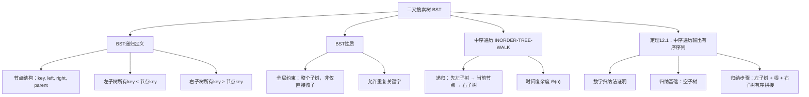

## 相关笔记
- 前置笔记：[[10.4-10.5 二叉树与其他树结构]]
- 关联概念：[[二叉树的基本概念]]、[[排序与顺序统计量]]
- 章节汇总：[[第12章_二叉搜索树-章节汇总]]

> [!abstract] 概览
> 本节介绍**二叉搜索树（Binary Search Tree, BST）**的基本定义与核心性质。BST是一种支持**动态集合**操作的二叉树数据结构，每个节点存储一个关键字，并满足**BST性质**：对于任意节点 $x$，其**左子树**中所有关键字 $\leq x.key$，**右子树**中所有关键字 $\geq x.key$。利用这一性质，可以在 $O(h)$ 时间内完成搜索、最小值、最大值、前驱、后继等操作，其中 $h$ 为树高。本节重点阐述BST的递归定义、==中序遍历==的有序性证明（定理12.1），以及BST与其他数据结构的对比分析。

---

## 知识结构总览



---

## 核心思想

> [!tip] 核心思路
> 二叉搜索树的核心思想是将**二分查找**的思想嵌入到**树形结构**中。在有序数组上做二分查找时，每次比较将搜索空间缩小一半；类似地，在BST中，每次与节点关键字的比较都会将搜索引导到左子树或右子树，从而在 $O(h)$ 时间内定位目标。BST的优势在于它同时支持**高效的搜索**和**动态插入/删除**（后续章节展开），这是静态有序数组无法做到的。**BST性质**是这一切的基石——它保证以==中序遍历==访问树中所有节点时，输出的是一个**非递减序列**。

### BST的递归定义

二叉搜索树是按如下方式组织的二叉树：

- 每个节点是一个对象，包含关键字 `key`、左孩子指针 `left`、右孩子指针 `right`、父节点指针 `parent`
- 若某属性（如左孩子）不存在，则对应属性值为 `NIL`
- 设 $x$ 为树中的一个节点：
  - 若 $y$ 在 $x$ 的**左子树**中，则 $y.key \leq x.key$
  - 若 $y$ 在 $x$ 的**右子树**中，则 $y.key \geq x.key$

> [!def] BST性质（Binary-Search-Tree Property）
> 设 $x$ 为二叉搜索树中的一个节点。如果 $y$ 是 $x$ 左子树中的一个节点，那么 $y.key \leq x.key$。如果 $y$ 是 $x$ 右子树中的一个节点，那么 $y.key \geq x.key$。

**关键强调：** BST性质是一个**全局约束**，它约束的是**整个子树**中的所有节点，而不仅仅是节点的直接孩子。例如，节点 $x$ 的左孩子的右孩子的右孩子……的关键字也必须 $\leq x.key$。

### INORDER-TREE-WALK —— 伪代码

```
INORDER-TREE-WALK(x)
1  if x ≠ NIL
2      INORDER-TREE-WALK(x.left)
3      print x.key
4      INORDER-TREE-WALK(x.right)
```

该过程按照**左子树 → 当前节点 → 右子树**的顺序递归访问每个节点。当 $x = \text{NIL}$ 时递归终止，无需额外处理。

### 定理12.1：中序遍历输出有序序列

> [!def] 定理12.1
> 如果 $x$ 是一棵有 $n$ 个节点的二叉搜索树的根，那么调用 $\text{INORDER-TREE-WALK}(x)$ 将在 $O(n)$ 时间内输出这 $n$ 个关键字的一个**非递减序列**。

> **【BST中序遍历有序性（强归纳法：左子树+根+右子树有序拼接）】**
>
> **证明（数学归纳法）：**
>
> 我们对 $x$ 为根的子树的大小（节点数）进行**强归纳法**。

> [!def] 循环不变式（归纳假设）
> 对任意以 $x$ 为根的子树，$\text{INORDER-TREE-WALK}(x)$ 输出该子树中所有关键字的非递减序列。

**归纳基础：** 当子树为空（$x = \text{NIL}$）时，过程不执行任何操作，空序列显然是非递减的。归纳基础成立。

**归纳步骤：** 假设对大小不超过 $k$ 的任意子树，归纳假设成立。考虑以 $x$ 为根、大小为 $k+1$ 的子树。

1. 由 BST 性质，$x$ 左子树中所有关键字 $\leq x.key$，$x$ 右子树中所有关键字 $\geq x.key$
2. $x$ 的左子树和右子树的大小均不超过 $k$，由归纳假设：
   - $\text{INORDER-TREE-WALK}(x.left)$ 输出左子树所有关键字的非递减序列 $L$
   - $\text{INORDER-TREE-WALK}(x.right)$ 输出右子树所有关键字的非递减序列 $R$
3. 中序遍历的输出为 $L$，然后 $x.key$，然后 $R$
4. 由于 $L$ 中每个元素 $\leq x.key$，$x.key \leq R$ 中每个元素，且 $L$ 和 $R$ 各自非递减，因此拼接后的完整序列也是非递减的

归纳步骤成立。由强归纳法，定理得证。$\blacksquare$

### 时间复杂度分析

> [!def] 时间复杂度
> $\text{INORDER-TREE-WALK}$ 的时间复杂度为 $\Theta(n)$，其中 $n$ 为树中节点数。原因如下：
> - 过程对每个节点恰好访问一次（第2行递归进入、第3行打印、第4行递归进入），每次访问执行 $O(1)$ 操作
> - 因此总时间为 $\Theta(n)$
>
> 注意：该复杂度与树的具体形状无关，无论树是平衡的还是退化为链表，中序遍历都是 $\Theta(n)$。

---

## 补充理解与拓展

> [!info] BST的发明历史与自平衡树的演进
> 二叉搜索树作为一种数据结构的思想可追溯到1950年代，但真正使其成为实用数据结构的是1960年代的自平衡树研究。
>
> **1962年——AVL树：** 苏联数学家 **G. M. Adelson-Velsky** 和 **E. M. Landis** 在 *Doklady Akademii Nauk SSSR* 上发表了论文"An algorithm for the organization of information"（*Dokl. Akad. Nauk SSSR*, 146(2):263–266, 1962），提出了==AVL树==——最早的自平衡二叉搜索树。AVL树通过"平衡因子"（左右子树高度差不超过1）维持平衡，插入和删除后通过最多 $O(\lg n)$ 次旋转恢复平衡，保证所有操作在最坏情况下 $O(\lg n)$。[^1]
>
> **1972年——B树：** **Rudolf Bayer** 在 *Acta Informatica* 上发表了"Symmetric binary B-trees: Data structure and maintenance algorithms"（*Acta Informatica*, 1(4):290–306, 1972），提出了对称二叉B树，后来演变为==红黑树==。[^2]
>
> **1978年——红黑树命名：** **Leonidas J. Guibas** 和 **Robert Sedgewick** 在 *SODA* 上正式引入了"红黑树"这一名称和颜色编码方案，通过5条性质近似平衡BST，插入和删除仅需最多3次旋转。红黑树后来成为Java `TreeMap`、C++ `std::map`、Linux内核`rbtree`等广泛使用的实现基础。
>
> **1993年——左倾红黑树：** **Robert Sedgewick** 提出了左倾红黑树（Left-Leaning Red-Black Tree），简化了实现（仅需2种旋转而非4种），成为算法教学和工程实践中的主流方案。

> [!info] BST vs 散列表 vs 排序数组——工程视角的全面对比
> 三种数据结构各有优劣，选择取决于具体场景：
>
> | 比较维度 | BST（平衡时） | 散列表 | 排序数组 |
> |:---------|:-----------:|:------:|:--------:|
> | 搜索 | $O(\lg n)$ 最坏 | $O(1)$ 平均，$O(n)$ 最坏 | $O(\lg n)$ |
> | 插入 | $O(\lg n)$ | $O(1)$ 平均 | $O(n)$ |
> | 删除 | $O(\lg n)$ | $O(1)$ 平均 | $O(n)$ |
> | 最小/最大值 | $O(\lg n)$ | $O(n)$ 需遍历 | $O(1)$ |
> | 前驱/后继 | $O(\lg n)$ | 不支持 | $O(1)$ |
> | 范围查询 | $O(k + \lg n)$ | 不支持 | $O(k + \lg n)$ |
> | 顺序遍历 | $O(n)$ 中序 | $O(n \log n)$ 需排序 | $O(n)$ |
> | 是否有序 | 天然有序 | 无序 | 天然有序 |
> | 缓存性能 | 差（指针跳跃） | 中等（链地址） | 优（连续内存） |
>
> **工程实践中的选择：**
> - **Java**：`HashMap`（散列）用于无序快速查找，`TreeMap`（红黑树）用于有序操作
> - **C++**：`std::unordered_map`（散列）用于默认场景，`std::map`（红黑树）用于需要有序遍历的场景
> - **数据库**：MySQL InnoDB使用B+树（BST的推广）作为索引，因为磁盘IO的特性使得B+树的宽扇出比平衡BST的高度更重要
> - **语言内置排序**：Python的`dict`使用散列表，而`sortedcontainers`库提供基于BST的有序字典
>
> BST的核心优势在于：**同时支持高效的动态修改和有序性查询**。散列表虽然平均查找更快，但无法支持范围查询和有序遍历；排序数组虽然缓存友好，但动态修改代价高昂。[^3]

[^1]: Adelson-Velsky, G. M., & Landis, E. M. (1962). "An algorithm for the organization of information." *Doklady Akademii Nauk SSSR*, 146(2), 263–266.
[^2]: Bayer, R. (1972). "Symmetric binary B-trees: Data structure and maintenance algorithms." *Acta Informatica*, 1(4), 290–306.
[^3]: Sedgewick, R., & Wayne, K. (2011). *Algorithms*, 4th Edition. Addison-Wesley. Princeton COS 226 Lecture Notes: "3.2 Binary Search Trees" 与 "3.4 Hash Tables".

---

## 易混淆点与辨析

> [!warning] BST性质是全局约束，不是仅对直接孩子的约束
> ❌ 错误理解：BST性质只要求 $x.left.key \leq x.key \leq x.right.key$，即只约束直接孩子。
>
> ✅ 正确理解：BST性质约束的是**整个子树**。例如，$x$ 左子树中**所有**节点（包括左孩子的右孩子、左孩子的左孩子的右孩子等）的关键字都必须 $\leq x.key$。如果只约束直接孩子，那么可能构造出左孩子的右孩子大于 $x.key$ 的"假BST"，此时中序遍历将不再输出有序序列。

> [!warning] 重复关键字的处理策略
> ❌ 错误理解：BST中不允许出现重复的关键字。
>
> ✅ 正确理解：CLRS采用的BST性质定义允许重复关键字（左子树 $\leq$，右子树 $\geq$）。不同实现对此有不同策略：
> - **CLRS策略**：允许重复，左子树 $\leq$ 根 $\leq$ 右子树
> - **严格策略**：不允许重复，左子树 $<$ 根 $<$ 右子树
> - **计数策略**：每个节点增加 `count` 字段记录重复次数
>
> 在实际应用中，需根据具体需求选择策略。本笔记统一采用CLRS的定义。

---

## 习题精选

| 题号 | 题目描述 | 难度 | 考察重点 |
|:----:|:---------|:----:|:---------|
| 12.1-1 | 在图12-1(a)的二叉搜索树中搜索关键字13，列出依次访问的节点序列 | ⭐ | BST搜索路径 |
| 12.1-2 | 假设BST中各关键字互不相同，证明：最小元素没有左孩子，最大元素没有右孩子 | ⭐⭐ | BST性质推导 |
| 12.1-3 | 用归纳法证明：具有 $n$ 个内部节点的二叉搜索树中，外部节点（NIL）的个数为 $n+1$ | ⭐⭐ | 二叉树结构性质 |
| 12.1-4 | 给定关键字序列 {5, 2, 9, 1, 3, 7}，画出依次插入空BST后的结果 | ⭐ | BST插入过程 |
| 12.1-5 | 证明：对BST的根调用INORDER-TREE-WALK，输出序列恰好是所有关键字按非递减序排列 | ⭐⭐ | 定理12.1理解 |

> [!faq]- 12.1-2 解答
> **题目：** 假设二叉搜索树中各关键字互不相同。请证明：最小元素没有左孩子，最大元素没有右孩子。
>
> **解题思路：** 直接利用BST性质，用反证法。
>
> **【BST极值节点子节点缺失（反证法+BST性质）】**
>
> **答案：**
> - 设 $x$ 为BST中的最小元素。假设 $x$ 有左孩子 $y$（$y \neq \text{NIL}$）。由BST性质，$y.key \leq x.key$。由于所有关键字互不相同，$y.key < x.key$，这与 $x$ 是最小元素矛盾。因此 $x$ 没有左孩子。
> - 设 $z$ 为BST中的最大元素。假设 $z$ 有右孩子 $w$（$w \neq \text{NIL}$）。由BST性质，$w.key \geq z.key$。由于所有关键字互不相同，$w.key > z.key$，这与 $z$ 是最大元素矛盾。因此 $z$ 没有右孩子。$\blacksquare$

> [!faq]- 12.1-3 解答
> **题目：** 用归纳法证明：具有 $n$ 个内部节点的二叉搜索树中，外部节点（NIL）的个数为 $n+1$。
>
> **解题思路：** 对内部节点数 $n$ 进行数学归纳。
>
> **【BST外部节点数n+1（归纳法：左右子树外部节点求和）】**
>
> **答案：**
> **归纳基础：** 当 $n = 0$ 时，树为空，只有一个NIL根节点，外部节点数为 $1 = 0 + 1$。成立。
>
> **归纳步骤：** 假设对所有内部节点数 $< n$ 的二叉搜索树命题成立。考虑一棵有 $n$ 个内部节点的BST，根为 $r$。$r$ 的左子树有 $n_L$ 个内部节点，右子树有 $n_R$ 个内部节点，$n_L + n_R = n - 1$。由归纳假设，左子树有 $n_L + 1$ 个外部节点，右子树有 $n_R + 1$ 个外部节点。整棵树的外部节点数为 $(n_L + 1) + (n_R + 1) = n_L + n_R + 2 = (n - 1) + 2 = n + 1$。$\blacksquare$

> [!faq]- 12.1-4 解答
> **题目：** 给定关键字序列 {5, 2, 9, 1, 3, 7}，画出依次插入空BST后的结果。
>
> **解题思路：** 逐个将关键字插入BST，每次从根开始比较，小于等于走左，大于走右。
>
> **答案：** 插入过程如下：
> - 插入5：5为根
> - 插入2：2 < 5，成为5的左孩子
> - 插入9：9 > 5，成为5的右孩子
> - 插入1：1 < 5 → 1 < 2，成为2的左孩子
> - 插入3：3 < 5 → 3 > 2，成为2的右孩子
> - 插入7：7 > 5 → 7 < 9，成为9的左孩子
>
> 最终树结构：
> ```
>         5
>        / \
>       2   9
>      / \ /
>     1  3 7
> ```

---

## 视频学习指南

| 资源 | 主题 | 链接 | 说明 |
|:-----|:-----|:-----|:-----|
| MIT 6.006 Lecture 5 | Binary Search Trees | https://www.youtube.com/watch?v=9Jry5-82IqM | Erik Demaine讲解BST基本操作，含动画演示 |
| MIT 6.006 Lecture 6 | Balanced BSTs (AVL) | https://www.youtube.com/watch?v=FNeL18KsWPc | 从BST过渡到平衡树，理解BST的局限性 |
| Abdul Bari | Binary Search Tree | https://www.youtube.com/watch?v=H5JubkIy_pI | 直观的BST插入和搜索动画，适合入门 |
| Stanford CS106B | BST | https://www.youtube.com/watch?v=CozKR3eF7qY | Stanford课程中的BST讲解，注重编程实现 |
| mycodeschool | BST Introduction | https://www.youtube.com/watch?v=pmTn_0cPbGk | 清晰的BST概念讲解与代码实现 |

---

## 教材原文

> [!quote] CLRS 第4版 12.1节原文
> 二叉搜索树（binary search tree）是按如下方式组织的二叉树：每个节点是一个对象，除了关键字（key）和相关卫星数据外，还包含属性 left、right 和 parent，分别指向该节点的左孩子、右孩子和父节点。如果某个孩子节点或父节点不存在，则相应属性的值为 NIL。根节点是树中唯一父节点属性为 NIL 的节点。
>
> 二叉搜索树中的关键字总是满足**二叉搜索树性质**：设 $x$ 为树中的一个节点。如果 $y$ 是 $x$ 左子树中的一个节点，那么 $y.key \leq x.key$。如果 $y$ 是 $x$ 右子树中的一个节点，那么 $y.key \geq x.key$。
>
> 过程 INORDER-TREE-WALK 按中序遍历整棵子树。如名字所示，该过程输出以 $x$ 为根的子树中所有关键字的非递减序列。

---

## 参见Wiki

**章节导航：**
- [[第12章_二叉搜索树-章节汇总]] | [[第12章_二叉搜索树/12.2 查询二叉搜索树]]

**关联知识：**
- [[二叉树的基本概念]] —— BST的基础数据结构
- [[二分查找]] —— BST搜索思想的数组版本
- [[AVL树]] —— 最早的自平衡BST
- [[排序与顺序统计量]] —— BST支持的操作类别

#学习/算法导论/第12章-二叉搜索树 #学习/算法导论/二叉搜索树/什么是二叉搜索树
