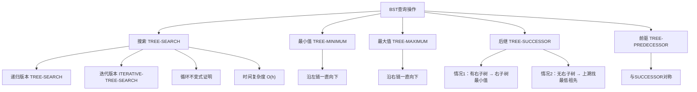

## 相关笔记
- 前置笔记：[[12.1 什么是二叉搜索树]]
- 关联概念：[[二分查找]]、[[排序与顺序统计量]]
- 章节汇总：[[第12章_二叉搜索树-章节汇总]]

> [!abstract] 概览
> 本节介绍在二叉搜索树上执行的基本查询操作，包括**搜索**（TREE-SEARCH / ITERATIVE-TREE-SEARCH）、**最小值**（TREE-MINIMUM）、**最大值**（TREE-MAXIMUM）、**后继**（TREE-SUCCESSOR）和**前驱**（TREE-PREDECESSOR）。所有操作均可在 $O(h)$ 时间内完成，其中 $h$ 为树高。本节重点讲解==迭代式搜索==的循环不变式证明、==TREE-SUCCESSOR== 的两种情况分析（有右子树 vs 无右子树需上溯），以及这些操作在实际系统中的应用场景。

---

## 知识结构总览



---

## 核心思想

> [!tip] 核心思路
> BST查询操作的核心思想是利用**BST性质**在树中导航。搜索操作类似于二分查找：每次与当前节点比较后，决定走向左子树还是右子树。最小值/最大值操作沿左链/右链一直向下走即可。后继/前驱操作稍复杂——需要区分**节点有右子树**和**无右子树**两种情况，后者需要沿父指针**上溯**，找到第一个"拐弯"的祖先。所有操作的时间复杂度均为 $O(h)$，在平衡树中为 $O(\log n)$。

### TREE-SEARCH —— 递归搜索伪代码

```
TREE-SEARCH(x, k)
1  if x == NIL or k == x.key
2      return x
3  if k < x.key
4      return TREE-SEARCH(x.left, k)
5  else return TREE-SEARCH(x.right, k)
```

该过程从根节点开始，递归地在左子树或右子树中搜索关键字 $k$。如果找到匹配的节点则返回该节点，否则返回 NIL。

### ITERATIVE-TREE-SEARCH —— 迭代搜索伪代码

```
ITERATIVE-TREE-SEARCH(x, k)
1  while x ≠ NIL and k ≠ x.key
2      if k < x.key
3          x = x.left
4      else x = x.right
5  return x
```

迭代版本与递归版本功能完全相同，但在大多数计算机上运行更快，且避免了递归调用的栈开销。

### ITERATIVE-TREE-SEARCH 循环不变式与正确性证明

> [!def] 循环不变式
> 在 while 循环（第1-4行）的每次迭代开始时：
> 1. 节点 $x$ 是以**当前搜索起始节点**为根的子树的根
> 2. 如果关键字 $k$ 存在于以当前 $x$ 为根的子树中，那么 $\text{ITERATIVE-TREE-SEARCH}(x, k)$ 最终会返回包含 $k$ 的节点

> **【迭代搜索不变式（BST性质保证搜索方向正确）】**
>
> **初始化：** 在第一次迭代之前，$x$ 是整棵BST的根。如果 $k$ 存在于树中，那么它一定在以 $x$ 为根的子树中。不变式成立。

> **【不变式维护（左走或右走均保持目标在子树中）】**
>
> **维护：** 分两种情况：
> - 若 $k < x.key$：由BST性质，$k$ 如果存在，只可能在 $x$ 的左子树中。第3行将 $x$ 更新为 $x.left$，此时 $x$ 指向的子树仍然包含 $k$（如果 $k$ 存在的话）。不变式保持。
> - 若 $k > x.key$：由BST性质，$k$ 如果存在，只可能在 $x$ 的右子树中。第4行将 $x$ 更新为 $x.right$，同理不变式保持。

> **【不变式终止（NIL或命中均正确）】**
>
> **终止：** while 循环在以下两种条件下终止：
> 1. $x = \text{NIL}$：说明搜索路径已到达叶子节点的空孩子，$k$ 不存在于树中，返回 NIL 是正确的
> 2. $k = x.key$：找到了关键字 $k$，返回 $x$ 是正确的
>
> 两种情况下返回值都正确。$\blacksquare$

### TREE-MINIMUM —— 最小值伪代码

```
TREE-MINIMUM(x)
1  while x.left ≠ NIL
2      x = x.left
3  return x
```

由BST性质，最小关键字一定在从根出发沿左链一直向下的最左节点上。

### TREE-MAXIMUM —— 最大值伪代码

```
TREE-MAXIMUM(x)
1  while x.right ≠ NIL
2      x = x.right
3  return x
```

由BST性质，最大关键字一定在从根出发沿右链一直向下的最右节点上。

### TREE-SUCCESSOR —— 后继伪代码

```
TREE-SUCCESSOR(x)
1  if x.right ≠ NIL
2      return TREE-MINIMUM(x.right)
3  y = x.p
4  while y ≠ NIL and x == y.right
5      x = y
6      y = y.p
7  return y
```

### TREE-SUCCESSOR 正确性论证

> [!def] TREE-SUCCESSOR 正确性
> 设 $x$ 为BST中的一个节点，$x$ 的后继定义为在中序遍历序列中紧排在 $x.key$ 之后的那个节点。TREE-SUCCESSOR 分两种情况：

> **【后继情况1：有右子树时取右子树最小值】**
>
> **情况1：$x$ 有右子树（$x.right \neq \text{NIL}$）**
> 此时 $x$ 的后继是右子树中的最小节点。原因：由中序遍历顺序（左→根→右），遍历完 $x$ 后下一个访问的是 $x$ 右子树中最左边的节点，即 $\text{TREE-MINIMUM}(x.right)$。该节点是右子树中关键字最小的节点，也是整棵树中大于 $x.key$ 的最小节点。

> **【后继情况2：无右子树时上溯找最低左拐祖先】**
>
> **情况2：$x$ 没有右子树（$x.right = \text{NIL}$）**
> 此时需要沿父指针上溯，找到第一个"左拐"的祖先。具体地，设 $y$ 是 $x$ 的最低祖先，且 $x$ 在 $y$ 的**左子树**中（即 $y$ 是第一个满足 $x \neq y.right$ 的祖先）。那么 $y$ 就是 $x$ 的后继。原因：在中序遍历中，$y$ 的左子树（包含 $x$）在 $y$ 之前遍历，而 $y$ 是 $x$ 所在子树的根中第一个大于 $x.key$ 的节点。
>
> 如果不存在这样的祖先（即 $x$ 是整棵树的最大节点），则返回 NIL。

### TREE-PREDECESSOR —— 前驱伪代码

```
TREE-PREDECESSOR(x)
1  if x.left ≠ NIL
2      return TREE-MAXIMUM(x.left)
3  y = x.p
4  while y ≠ NIL and x == y.left
5      x = y
6      y = y.p
7  return y
```

TREE-PREDECESSOR 与 TREE-SUCCESSOR 完全对称：有左子树时取左子树最大值，无左子树时上溯找第一个"右拐"的祖先。

### 时间复杂度分析

> [!def] 时间复杂度
> 所有六个查询操作的时间复杂度均为 $O(h)$，其中 $h$ 为树高：
> - **TREE-SEARCH / ITERATIVE-TREE-SEARCH**：每次迭代下降一层，最多 $h$ 次迭代
> - **TREE-MINIMUM / TREE-MAXIMUM**：沿左链/右链走，最多 $h$ 步
> - **TREE-SUCCESSOR / TREE-PREDECESSOR**：情况1调用 TREE-MINIMUM/MAXIMUM 为 $O(h)$；情况2沿父指针上溯，最多 $h$ 步
>
> 在最坏情况下（树退化为链表），$h = n$，所有操作退化为 $O(n)$。在平衡BST中，$h = O(\log n)$，所有操作为 $O(\log n)$。

---

## 补充理解与拓展

> [!info] 前驱与后继的实际应用场景
> 前驱和后继操作在许多实际系统中有着重要应用：
>
> **数据库B+树范围查询：** B+树是BST的多路推广，是数据库索引的核心数据结构。MySQL InnoDB引擎的索引完全基于B+树构建，默认页大小为16KB。数据库中的范围查询（如 `SELECT * FROM table WHERE key BETWEEN 10 AND 50`）本质上就是：先通过搜索定位到下界节点，然后反复调用SUCCESSOR操作，沿叶子节点的链表依次获取后继直到超过上界。[^1] MySQL还提供了Multi-Range Read（MRR）优化，先扫描索引收集所有匹配的主键，再按主键顺序回表查询，减少随机磁盘IO。
>
> **C++ STL迭代器：** `std::map` 和 `std::set` 的底层实现是红黑树（一种平衡BST）。STL提供的 `lower_bound`、`upper_bound` 操作底层逻辑正是TREE-SUCCESSOR的变体——找到第一个不小于/大于给定键的节点。`iterator++`（递增迭代器）直接调用SUCCESSOR获取中序后继。根据C++标准，`std::map::erase` 仅使被删除元素的迭代器失效，其他迭代器保持有效——这与CLRS第4版TRANSPLANT方法的语义一致。[^2]
>
> **文本编辑器与区间管理：** 文本编辑器中的行号跳转、IDE中的断点管理、日历系统中的事件查询等功能，都可以利用BST的有序性来高效实现前驱/后继查找。

> [!info] BST与快速排序的深刻对应关系
> BST与快速排序之间存在精确的结构对应关系，这一对应关系在CLRS问题12-3中有系统阐述：
>
> - **BST的根节点**对应快速排序中选择的==枢轴元素（pivot）==
> - **BST的左子树**对应快速排序中对**小于枢轴**部分的递归排序
> - **BST的右子树**对应快速排序中对**大于枢轴**部分的递归排序
> - **BST的搜索路径长度**对应快速排序中元素的==比较次数==
>
> 这一对应关系意味着：快速排序在某个输入上的性能，与以该输入顺序插入BST后树的形状直接相关。如果快速排序每次都选到好的枢轴，对应BST就是平衡的；反之BST退化为链表。
>
> **随机BST的期望高度：** Reed（2003）证明了若 $n$ 个不同关键字以随机顺序插入BST，则期望高度为 $E[H_n] = \alpha \ln n - \beta \ln \ln n + O(1)$，其中 $\alpha \approx 4.311$ 是方程 $c \ln 2 = 2e^{(c-1)/c}$ 的较大根。这意味着随机BST的期望高度约为 $4.311 \ln n \approx 1.39 \lg_2 n$，非常接近最优的 $\lg_2 n$。[^3]
>
> **期望总路径长度：** 随机BST的期望总内部路径长度为 $O(n \lg n)$，与快速排序的期望比较次数完全相同。这一结论可以通过指示器随机变量和期望的线性性严格证明。

[^1]: MySQL Reference Manual. "InnoDB Physical Structure" 与 "Multi-Range Read Optimization". https://dev.mysql.com/doc/refman/9.0/en/innodb-physical-structure.html
[^2]: cppreference.com. "std::map::erase." https://en.cppreference.com/w/cpp/container/map/erase
[^3]: Reed, B. (2003). "The height of a random binary search tree." *Journal of the ACM*, 50(3), 306–332.

---

## 易混淆点与辨析

> [!warning] 搜索时等于号的处理方向
> ❌ 错误理解：在 TREE-SEARCH 中，当 $k = x.key$ 时，应该继续向左或向右搜索以找到所有匹配项。
>
> ✅ 正确理解：当 $k = x.key$ 时，第1行条件 $k == x.key$ 成立，直接返回当前节点 $x$。BST的搜索操作返回的是**第一个找到的匹配节点**，而非所有匹配节点。如果需要找到所有等于 $k$ 的节点，需要额外操作（如找到后继续在中序序列中向两侧扩展）。

> [!warning] 上溯找后继时"左拐"的理解
> ❌ 错误理解：TREE-SUCCESSOR 在情况2中，上溯时找的是第一个 $x$ 是 $y$ 左孩子的祖先。
>
> ✅ 正确理解：更精确地说，上溯时找的是**最低的**（即最近的）满足 $x \neq y.right$ 的祖先 $y$，也就是 $x$ 在 $y$ 的**左子树**中的那个祖先。注意 while 循环的条件是 `x == y.right`，即当 $x$ 是 $y$ 的右孩子时继续上溯——这意味着"我们是从右边来的，还没拐弯"。当 $x$ 是 $y$ 的左孩子时（或 $y = \text{NIL}$），循环终止，此时 $y$ 就是后继。
>
> 直觉理解：想象你站在节点 $x$ 上，要找中序遍历中下一个访问的节点。如果没有右子树，你需要"回头"往上走，直到找到一个你从**左侧**上来的祖先——那个祖先就是下一个要访问的节点。

---

## 习题精选

| 题号 | 题目描述 | 难度 | 考察重点 |
|:----:|:---------|:----:|:---------|
| 12.2-1 | 假设关键字互不相同，写出在图12-2(a)的BST中搜索关键字22的路径 | ⭐ | TREE-SEARCH执行过程 |
| 12.2-2 | 写出递归版本的TREE-MINIMUM和TREE-MAXIMUM | ⭐ | 递归与迭代转换 |
| 12.2-3 | 写出过程TREE-PREDECESSOR的伪代码 | ⭐ | 前驱操作的对称性 |
| 12.2-4 | Professor Bunyan认为：先序遍历中节点 $x$ 出现在 $y$ 之前，则 $x$ 是 $y$ 的祖先。这正确吗？ | ⭐⭐ | BST遍历性质 |
| 12.2-5 | 证明：BST中以某个节点 $x$ 为根的子树中所有节点的关键字，恰好介于 $x$ 的前驱和后继的关键字之间 | ⭐⭐⭐ | 前驱后继与BST性质 |
| 12.2-6 | 证明：ITERATIVE-TREE-SEARCH的最坏情况运行时间为 Θ(h) | ⭐⭐ | 时间复杂度分析 |
| 12.2-7 | 证明：一棵有 $n$ 个节点的BST中，SUCCESSOR操作的最坏情况时间为 Θ(n) | ⭐⭐ | 退化树分析 |

> [!faq]- 12.2-2 解答
> **题目：** 写出递归版本的 TREE-MINIMUM 和 TREE-MAXIMUM。
>
> **解题思路：** 将迭代版本的 while 循环转化为递归调用。
>
> **答案：**
> ```
> TREE-MINIMUM-REC(x)
> 1  if x.left == NIL
> 2      return x
> 3  else return TREE-MINIMUM-REC(x.left)
> ```
> ```
> TREE-MAXIMUM-REC(x)
> 1  if x.right == NIL
> 2      return x
> 3  else return TREE-MAXIMUM-REC(x.right)
> ```

> [!faq]- 12.2-4 解答
> **题目：** Professor Bunyan认为：在二叉搜索树的先序遍历中，如果节点 $x$ 出现在节点 $y$ 之前，那么 $x$ 是 $y$ 的祖先。这个论断正确吗？如果正确，请证明；如果不正确，给出反例。
>
> **解题思路：** 先序遍历的顺序是"根→左→右"，祖先一定在后代之前输出。但反过来，之前输出的节点不一定是祖先。
>
> **答案：** 该论断**不正确**。反例：考虑如下BST：
> ```
>       5
>      / \
>     3   7
>    / \
>   2   4
> ```
> 先序遍历输出：5, 3, 2, 4, 7。节点2出现在节点7之前，但2不是7的祖先。先序遍历中，一个节点出现在另一个节点之前，只说明前者要么是后者的祖先，要么在前者所在的子树被先于后者所在的子树访问——但两者可能位于完全不同的分支中。

> [!faq]- 12.2-5 解答
> **题目：** 证明：一棵有 $n$ 个节点的BST中，以某个节点 $x$ 为根的子树中所有节点的关键字，恰好介于 $x$ 的前驱和后继的关键字之间。
>
> **解题思路：** 利用中序遍历的有序性和前驱后继的定义。
>
> **【子树关键字介于前驱后继之间（中序遍历有序性应用）】**
>
> **答案：**
> 设 $s = \text{TREE-SUCCESSOR}(x)$，$p = \text{TREE-PREDECESSOR}(x)$。
>
> **先证子树中所有关键字 $\geq p.key$（若 $p$ 存在）：**
> 由前驱定义，$p$ 是中序遍历中 $x$ 前面的节点，因此 $p.key \leq x.key$。$x$ 的左子树中所有关键字 $\leq x.key$（BST性质），但 $p$ 是中序遍历中 $x$ 之前最后一个节点，因此左子树中所有关键字 $\geq p.key$。$x$ 的右子树中所有关键字 $\geq x.key \geq p.key$。
>
> **再证子树中所有关键字 $\leq s.key$（若 $s$ 存在）：**
> 由后继定义，$s$ 是中序遍历中 $x$ 后面的节点，因此 $x.key \leq s.key$。$x$ 的右子树中所有关键字 $\geq x.key$（BST性质），但 $s$ 是中序遍历中 $x$ 之后第一个节点，因此右子树中所有关键字 $\leq s.key$。$x$ 的左子树中所有关键字 $\leq x.key \leq s.key$。
>
> 综上，以 $x$ 为根的子树中所有关键字满足 $p.key \leq \text{子树关键字} \leq s.key$。$\blacksquare$

> [!faq]- 12.2-7 解答
> **题目：** 证明：一棵有 $n$ 个节点的BST中，SUCCESSOR操作的最坏情况时间为 $\Theta(n)$。
>
> **解题思路：** 构造一棵退化的BST（链表），分析SUCCESSOR在最坏情况下的执行路径。
>
> **【SUCCESSOR最坏情况Θ(n)（退化链表上溯n-1步）】**
>
> **答案：** 考虑一棵退化为链表的BST，所有节点只有右孩子（即关键字按递增顺序插入）。此时树高 $h = n$。
>
> 考虑对**最小节点**（即链表头节点，只有右孩子没有左孩子）调用 TREE-SUCCESSOR：
> - 情况1适用：该节点有右子树，调用 TREE-MINIMUM(右子树)，需要沿左链走到底，但右子树也是链表（没有左孩子），所以只需 $O(1)$。
>
> 更精确地，考虑对**最大节点**的前驱操作，或换一种退化方式：所有节点只有左孩子。对最大节点（最底层）调用 TREE-SUCCESSOR：
> - 情况2适用：没有右子树，需要沿父指针上溯。从最底层上溯到根，需要经过 $n-1$ 个父指针，时间为 $\Theta(n)$。
>
> 因此 SUCCESSOR 的最坏情况时间为 $\Theta(n)$。$\blacksquare$

---

## 视频学习指南

| 资源 | 主题 | 链接 | 说明 |
|:-----|:-----|:-----|:-----|
| MIT 6.006 Lecture 5 | Binary Search Trees | https://www.youtube.com/watch?v=9Jry5-82IqM | Erik Demaine讲解BST搜索、最小最大值操作 |
| Abdul Bari | Binary Search Tree Search | https://www.youtube.com/watch?v=H5JubkIy_pI | 直观的BST搜索动画演示 |
| Abdul Bari | BST Successor Predecessor | https://www.youtube.com/watch?v=5cPbNCrtotg | 专门讲解后继和前驱操作 |
| mycodeschool | BST Search | https://www.youtube.com/watch?v=COZK5HN2gMU | 搜索操作的代码实现与图解 |
| GeeksforGeeks | BST Operations | https://www.youtube.com/watch?v=VCTk53Fk1GQ | 涵盖所有BST查询操作的完整教程 |

---

## 教材原文

> [!quote] CLRS 第4版 12.2节原文
> 我们经常需要在二叉搜索树中查找具有给定关键字的节点。除了搜索操作外，二叉搜索树还支持查询最小值、最大值、前驱和后继等操作。本节将介绍这些操作，并分析它们的运行时间。
>
> 搜索操作从根节点开始，沿着一条简单的路径向下搜索。对于每个节点 $x$，算法将关键字 $k$ 与 $x.key$ 进行比较。如果两个关键字相等，则搜索终止。如果 $k < x.key$，则搜索继续在 $x$ 的左子树中进行；如果 $k > x.key$，则搜索继续在 $x$ 的右子树中进行。
>
> 为了找到以某个节点为根的子树中的最小关键字，只需沿着左孩子指针一直向下走，直到遇到 NIL。类似地，最大关键字可以通过沿着右孩子指针一直向下走来找到。

---

## 参见Wiki

**章节导航：**
- [[第12章_二叉搜索树-章节汇总]] | [[第12章_二叉搜索树/12.1 什么是二叉搜索树]] | [[第12章_二叉搜索树/12.3 插入和删除]]

**关联知识：**
- [[第12章_二叉搜索树/12.1 什么是二叉搜索树]] —— BST定义与性质，查询操作的基础
- [[二分查找]] —— BST搜索的数组版本，思想一致
- [[算法导论/concepts/快速排序]] —— 与BST存在深刻的对应关系
- [[算法导论/concepts/红黑树]] —— 平衡BST，保证 $O(\log n)$ 的查询性能

#学习/算法导论/第12章-二叉搜索树 #学习/算法导论/二叉搜索树/查询二叉搜索树
