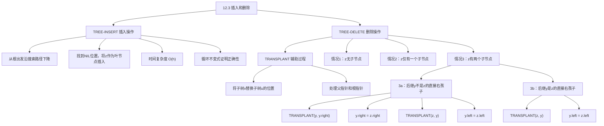
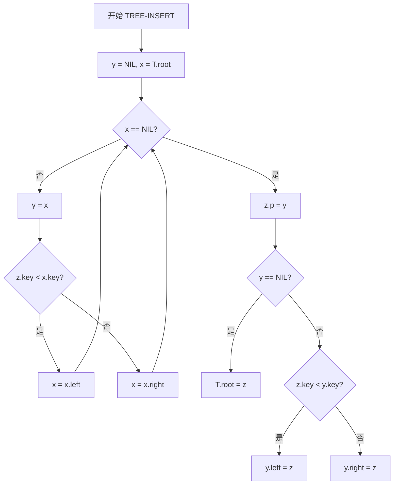
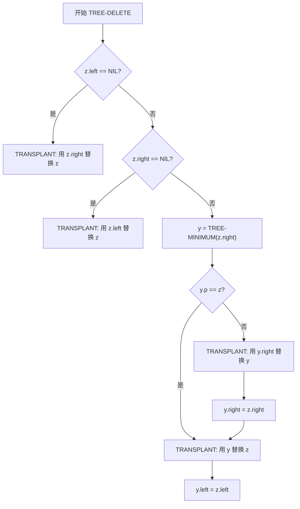

## 相关笔记
- 前置笔记：[[12.1 什么是二叉搜索树]]、[[12.2 查询二叉搜索树]]
- 关联概念：[[二叉搜索树性质]]、[[算法导论/concepts/中序遍历]]、[[TREE-MINIMUM]]、[[TREE-MAXIMUM]]、[[TREE-SUCCESSOR]]
- 章节汇总：[[第12章_二叉搜索树-章节汇总]]

> [!abstract] 概览
> 本节介绍二叉搜索树（BST）的两个核心动态操作——**插入**与**删除**。插入操作通过从根节点出发沿搜索路径找到合适位置，将新节点作为叶节点挂入树中，时间复杂度为 $O(h)$，其中 $h$ 为树高。删除操作较为复杂，需要分三种情况处理：被删节点**无子节点**、**仅有一个子节点**、**有两个子节点**。第三种情况通过找到==后继节点==（或前驱节点）替换被删节点来保持BST性质。本节还引入了一个关键的辅助过程 ==TRANSPLANT==，用于将一棵子树替换为另一棵子树，它是删除操作的核心子程序。

---

## 知识结构总览



---

## 核心思想

> [!tip] 核心思路
> 二叉搜索树的插入和删除是维持动态集合的关键操作。**插入**的核心思想是利用BST的有序性质，从根节点出发，根据key的大小关系逐层向下搜索，直到找到一个空位置（NIL），然后将新节点挂在该位置上。由于新节点总是作为叶节点插入，因此不会破坏已有节点的BST性质。
>
> **删除**的核心思想则更为复杂，因为被删节点可能在树的中间位置，直接移除会留下"空洞"。删除的关键在于引入 ==TRANSPLANT== 子程序——它将一棵子树整体替换为另一棵子树，同时正确维护父指针和根指针。基于TRANSPLANT，删除操作分三种情况处理：无子节点时直接移除，单子节点时用子节点替代，双子节点时用**后继节点**替换被删节点（后继节点是右子树中的最小节点），再删除后继节点的原位置。

> [!tip] 算法执行流程
> 1. **初始化**：y = NIL（跟踪父节点），x = T.root（当前搜索节点）
> 2. **沿树下降**：比较 z.key 与 x.key，小于则走**左子树**，大于等于则走**右子树**，y 始终跟踪 x 的父节点
> 3. **找到空位置**：当 x == NIL 时，y 即为新节点的父节点
> 4. **插入节点**：设置 z.p = y，根据 z.key 与 y.key 的比较，将 z 挂为 y 的**左孩子**或**右孩子**



### TREE-INSERT —— 伪代码

```
TREE-INSERT(T, z)
 1  y = NIL
 2  x = T.root
 3  while x ≠ NIL
 4     y = x
 5     if z.key < x.key
 6        x = x.left
 7     else x = x.right
 8  z.p = y
 9  if y == NIL
10     T.root = z
11     elseif z.key < y.key
12        y.left = z
13     else y.right = z
```

> [!def] TREE-INSERT 定义
> **输入**：一棵二叉搜索树 $T$ 和一个待插入节点 $z$（$z.key$ 已设置，$z.left = z.right = z.p = \text{NIL}$）。
>
> **输出**：将 $z$ 插入到 $T$ 中的适当位置，使得插入后 $T$ 仍然满足BST性质。
>
> **基本思路**：使用指针 $x$ 从根节点出发沿树下降，指针 $y$ 始终跟踪 $x$ 的父节点。当 $x$ 到达 NIL 时，$y$ 就是新节点的父节点，根据key大小将 $z$ 挂为 $y$ 的左孩子或右孩子。

### 循环不变式与正确性证明

> [!def] 循环不变式
> 在 TREE-INSERT 的 while 循环（第3-7行）中，维护以下不变式：
>
> 在每次循环迭代开始时：
> - $y$ 是 $x$ 的父节点（当 $x \neq \text{NIL}$ 时），或者 $y = \text{NIL}$（初始时）
> - 从根节点到 $x$ 的路径上所有节点的key值保持BST性质不变
> - $z$ 尚未被插入树中

**初始化：** 在第一次循环迭代开始之前（第1-2行之后），$y = \text{NIL}$，$x = T.\text{root}$。此时不变式自然成立：$y$ 是 $x$ 的父节点（根节点没有父节点，对应 $y = \text{NIL}$），树本身满足BST性质，$z$ 尚未插入。

> **【插入不变式维护（BST性质保证搜索方向正确）】**
>
> **维护：** 假设在某次循环迭代开始时不变式成立。循环体执行 $y = x$（第4行），然后根据 $z.key$ 与 $x.key$ 的比较结果，将 $x$ 移动到 $x.\text{left}$ 或 $x.\text{right}$（第5-7行）。由于 $T$ 满足BST性质，$x.\text{left}$ 中所有节点的key都小于 $x.key$，$x.\text{right}$ 中所有节点的key都大于等于 $x.key$。因此：
> - 若 $z.key < x.key$，则 $z$ 应该插入到 $x$ 的左子树中，$x = x.\text{left}$ 是正确的搜索方向；
> - 若 $z.key \geq x.key$，则 $z$ 应该插入到 $x$ 的右子树中，$x = x.\text{right}$ 是正确的搜索方向。
> 更新后 $y$ 仍然是 $x$ 的父节点，BST性质未被破坏，$z$ 仍未被插入。不变式得以维护。

> **【插入不变式终止（叶节点挂载保持BST性质）】**
>
> **终止：** 当循环终止时，$x = \text{NIL}$。根据不变式，$y$ 是 $x$（即 NIL）的父节点，也就是新节点 $z$ 应该挂载的位置的父节点。第8-13行根据 $y$ 是否为 NIL（即树是否为空）以及 $z.key$ 与 $y.key$ 的大小关系，将 $z$ 正确地挂为 $y$ 的左孩子或右孩子。插入后，$z$ 作为叶节点，不破坏任何已有节点的BST性质，且 $z$ 自身也满足BST性质（因为它没有子节点）。因此 TREE-INSERT 正确地将 $z$ 插入到BST中。 $\blacksquare$

### TRANSPLANT —— 伪代码

```
TRANSPLANT(T, u, v)
 1  if u.p == NIL
 2     T.root = v
 3  elseif u == u.p.left
 4     u.p.left = v
 5  else u.p.right = v
 6  if v ≠ NIL
 7     v.p = u.p
```

> [!def] TRANSPLANT 定义
> **输入**：二叉搜索树 $T$，节点 $u$（被替换的子树根），节点 $v$（替换子树的根）。
>
> **功能**：用子树 $v$ 的根替换子树 $u$ 的根。具体来说，将 $u$ 的父节点与 $v$ 建立链接，使得 $v$ 成为 $u$ 原来父节点的对应子节点。
>
> **重要说明**：TRANSPLANT **不会**更新 $v$ 的子节点指针，也**不会**处理 $u$ 原来子节点的去向。它仅负责"嫁接"操作——将 $v$ 接到 $u$ 原来所在的位置。因此，调用者需要自行处理 $u$ 原有子树的后续安排。

> [!tip] 算法执行流程
> 1. **判断子节点情况**：检查 z 的左子节点和右子节点是否存在
> 2. **无左子节点**：直接用 z.right 替换 z（TRANSPLANT）
> 3. **无右子节点**：直接用 z.left 替换 z（TRANSPLANT）
> 4. **有两个子节点**：找到后继 y = TREE-MINIMUM(z.right)
> 5. **处理后继位置**：若 y 不是 z 的直接右孩子，先用 y.right 替换 y，再将 z.right 赋给 y
> 6. **替换被删节点**：用 y 替换 z，将 z.left 赋给 y



### TREE-DELETE —— 伪代码

```
TREE-DELETE(T, z)
 1  if z.left == NIL
 2     TRANSPLANT(T, z, z.right)
 3  elseif z.right == NIL
 4     TRANSPLANT(T, z, z.left)
 5  else y = TREE-MINIMUM(z.right)
 6     if y.p ≠ z
 7        TRANSPLANT(T, y, y.right)
 8        y.right = z.right
 9        y.right.p = y
10     TRANSPLANT(T, z, y)
11     y.left = z.left
12     y.left.p = y
```

> [!def] TREE-DELETE 定义
> **输入**：二叉搜索树 $T$ 和待删除节点 $z$。
>
> **输出**：从 $T$ 中删除节点 $z$，并保持BST性质。
>
> **三种情况**：
> - **情况1**（第1-2行）：$z$ 没有左孩子。用 $z$ 的右孩子（可能为 NIL）替换 $z$。这同时覆盖了 $z$ 没有任何子节点的情况（此时 $z.\text{right} = \text{NIL}$，相当于直接移除 $z$）。
> - **情况2**（第3-4行）：$z$ 没有右孩子。用 $z$ 的左孩子替换 $z$。
> - **情况3**（第5-12行）：$z$ 有两个非 NIL 子孩子。找到 $z$ 的后继节点 $y = \text{TREE-MINIMUM}(z.\text{right})$（即 $z$ 右子树中的最小节点），用 $y$ 替换 $z$，再处理 $y$ 原来位置的修复。
>   - **情况3a**（第6-9行）：$y$ 不是 $z$ 的直接右孩子（即 $y.p \neq z$）。需要先将 $y$ 从其原位置移出（用 $y.\text{right}$ 替换 $y$），然后将 $z$ 的右子树赋给 $y$。
>   - **情况3b**（第10-12行，$y.p = z$ 时跳过第6-9行直接执行）：$y$ 是 $z$ 的直接右孩子。直接用 $y$ 替换 $z$，然后将 $z$ 的左子树赋给 $y$。

### TREE-DELETE 正确性说明

> [!def] TREE-DELETE 正确性
> TREE-DELETE 的正确性可以从三种情况分别论证：

> **【删除情况1-2（无子节点或单子节点：子树直接替换保持BST性质）】**
>
> **情况1（$z.\text{left} = \text{NIL}$）**：用 $z.\text{right}$ 替换 $z$。由于 $z$ 没有左子树，$z.\text{right}$ 中所有节点的key都大于等于 $z.key$，而 $z$ 的父节点中，若 $z$ 是左孩子则父节点的key大于 $z.key$，若 $z$ 是右孩子则父节点的key小于等于 $z.key$。用 $z.\text{right}$ 替换 $z$ 后，BST性质在 $z$ 的父节点处仍然成立。
>
> **情况2（$z.\text{right} = \text{NIL}$）**：与情况1对称，用 $z.\text{left}$ 替换 $z$，BST性质同样保持。

> **【删除情况3（双子节点：后继替换+原位置修复）】**
>
> **情况3（$z$ 有两个子节点）**：$y = \text{TREE-MINIMUM}(z.\text{right})$ 是 $z$ 的后继节点。关键性质：
> - $y.key$ 是大于 $z.key$ 的最小key值（后继定义）
> - $y$ 没有左孩子（因为它是右子树中的最小节点）
> - $y.\text{right}$ 中所有节点的key都大于 $y.key$
>
> 用 $y$ 替换 $z$ 后：$y.key$ 大于 $z$ 左子树中所有key（因为 $y.key > z.key$），$y.key$ 小于等于 $z$ 右子树中除 $y$ 以外的所有key（因为 $y$ 是右子树最小值）。因此替换后BST性质在 $y$ 处成立。同时，$y$ 原来位置的修复（情况3a中用 $y.\text{right}$ 替换 $y$）属于情况1，正确性已证。 $\blacksquare$

### 时间复杂度分析

> [!def] 时间复杂度
> - **TREE-INSERT**：while 循环从根节点遍历到叶节点，经过的路径长度最多为树高 $h$，因此时间复杂度为 **$O(h)$**。
> - **TRANSPLANT**：仅包含常数次指针操作，时间复杂度为 **$O(1)$**。
> - **TREE-DELETE**：主要开销在于 TREE-MINIMUM（情况3），其时间复杂度为 $O(h)$；其余操作均为常数时间。因此 TREE-DELETE 的总时间复杂度为 **$O(h)$**。
>
> 在一棵含 $n$ 个节点的二叉搜索树中，$h$ 的范围是 $\Theta(\lg n)$（平衡树）到 $\Theta(n)$（退化为链表）。因此，插入和删除在最坏情况下需要 $O(n)$ 时间。

---

## 补充理解与拓展

> [!info] BST退化与自平衡树的工程选择
> 二叉搜索树的插入和删除操作的时间复杂度均为 $O(h)$，其中 $h$ 为树高。然而，BST的形状高度依赖于插入和删除的顺序。在最坏情况下（例如按升序依次插入），BST会退化为一条链表，此时 $h = n$，所有操作退化为 $O(n)$，与无序链表无异。
>
> 为了保证 $h = O(\lg n)$，研究者提出了多种==自平衡二叉搜索树==：
>
> **AVL树**（Adelson-Velsky & Landis, 1962）：最早的平衡二叉搜索树，通过限制左右子树高度差不超过1来维持平衡。AVL树的查找性能更优（树更矮），但插入和删除时可能需要更多旋转操作。[^1]
>
> **红黑树**（Bayer, 1972；Guibas & Sedgewick, 1978）：通过为节点着色并遵循5条性质来近似平衡。红黑树比AVL树略高（最多2倍），但插入和删除仅需 $O(1)$ 次旋转（最多3次），以变色操作为主，工程实现更高效。[^2]
>
> **AVL vs 红黑树的工程选择：** 2024年的一项对比研究（Stewart, *Software: Practice and Experience*, 2024）通过基准测试发现：AVL树在查找操作上通常比红黑树更快（因为树更矮），但在插入和删除上，红黑树（尤其是bottom-up版本）在随机有序数据上表现更好。Java选择红黑树作为`TreeMap`的实现，C++选择红黑树作为`std::map`的实现，核心原因就是**插入/删除的旋转次数更少**，在频繁修改的场景下整体性能更优。[^3]
>
> **左倾红黑树**（Sedgewick, 1993）：简化了红黑树的实现，仅需2种旋转（左旋和右旋），而非标准红黑树的4种。这一简化使得左倾红黑树成为算法教学（如Princeton COS 226）和许多开源库的首选实现。

> [!info] BST删除的工程实现挑战
> 在实际工程中，BST删除操作面临若干需要注意的问题：
>
> **1. 迭代器失效语义：** 在C++ STL中，`std::map::erase(iterator)` 删除节点后，**仅被删除元素的迭代器失效**，指向其他节点的迭代器仍然有效。这是因为红黑树的删除操作仅修改局部指针（通过TRANSPLANT），不影响树的其他部分。CLRS第4版采用的TRANSPLANT方法恰好满足这一语义要求——实际移除节点 $z$，而非仅复制其关键字。[^4]
>
> **2. 惰性删除（Lazy Deletion）：** 某些场景下，为了避免删除操作的复杂性，可以采用"标记删除"策略——不真正移除节点，而是设置一个删除标记（如`deleted = true`）。查询时跳过已标记的节点。这种策略简化了删除逻辑，但会增加内存开销，且需要定期清理。惰性删除在并发数据结构中尤其常见，因为它避免了修改树结构的同步开销。
>
> **3. 后继 vs 前驱的选择：** 当被删节点有两个子节点时，既可以用后继（右子树最小值）也可以用前驱（左子树最大值）来替换。CLRS选择了后继方案。两种方案在对称性上完全等价，但在某些实现中，选择前驱可能在缓存局部性上更有优势（例如，如果左子树比右子树更常被访问）。在实际的标准库实现中，C++ `std::map` 和 Java `TreeMap` 均采用后继方案。

[^1]: Adelson-Velsky, G. M., & Landis, E. M. (1962). "An algorithm for the organization of information." *Doklady Akademii Nauk SSSR*, 146(2), 263–266.
[^2]: Guibas, L. J., & Sedgewick, R. (1978). "A dichromatic framework for balanced trees." *Proceedings of the 19th Annual Symposium on Foundations of Computer Science (FOCS)*, 8–21.
[^3]: Stewart, J. W. (2024). "Comparative Performance of the AVL Tree and Three Variants of the Red-Black Tree." *Software: Practice and Experience*, 54(7), 1–22. arXiv:2406.05162.
[^4]: cppreference.com. "std::map::erase." https://en.cppreference.com/w/cpp/container/map/erase

---

## 易混淆点与辨析

> [!warning] 删除三种情况的区分
> ❌ **错误理解**：删除有三种情况——无子节点、单子节点、双子节点，它们是完全独立的，需要分别处理。
>
> ✅ **正确理解**：实际上，CLRS的实现将"无子节点"归入"无左孩子"的情况（情况1），因为无子节点时 $z.\text{right} = \text{NIL}$，TRANSPLANT 用 NIL 替换 $z$，效果等同于直接移除。所以代码层面只有**两个分支**加上情况3的**子分支**：
>
> | 代码分支 | 条件 | 实际涵盖的物理情况 |
> |---------|------|-------------------|
> | 第1-2行 | $z.\text{left} = \text{NIL}$ | 无子节点 或 仅有右孩子 |
> | 第3-4行 | $z.\text{right} = \text{NIL}$ | 仅有左孩子 |
> | 第5-12行 | 两个子节点均非NIL | 有两个孩子 |
>
> 注意：情况1和情况2不会同时为真（如果 $z.\text{left} = \text{NIL}$ 且 $z.\text{right} = \text{NIL}$，走情况1即可），所以用 `if-elseif` 结构是正确的。

> [!warning] TRANSPLANT 的语义——链接替换 vs 内容复制
> ❌ **错误理解**：TRANSPLANT 是将节点 $v$ 的内容（key、satellite data）复制到节点 $u$ 中，然后删除 $v$。
>
> ✅ **正确理解**：TRANSPLANT 是**结构性替换**——它修改的是**指针链接**，而非节点内容。具体来说，TRANSPLANT 将 $v$ "嫁接"到 $u$ 原来所在的位置，使得 $v$ 成为 $u$ 原来父节点的子节点。节点 $u$ 和 $v$ 本身的内容不会被修改。
>
> **为什么选择链接替换而非内容复制？**
> - 内容复制需要修改key值，而如果树的外部有指向节点的引用/指针，内容复制会导致这些引用指向错误的数据。
> - 链接替换只修改局部指针，不影响树中其他节点与被操作节点之间的引用关系。
> - 在有卫星数据（satellite data）的节点中，内容复制还需要复制所有卫星数据，开销更大。

> [!warning] 情况3中 y.p ≠ z 的判断
> ❌ **错误理解**：情况3中 $y$ 一定是 $z$ 的右孩子，所以 $y.p = z$ 总是成立，不需要情况3a。
>
> ✅ **正确理解**：$y = \text{TREE-MINIMUM}(z.\text{right})$ 是 $z$ 右子树中的最小节点。如果 $z$ 的右孩子 $z.\text{right}$ 没有左孩子，那么 $y = z.\text{right}$，此时 $y.p = z$（情况3b）。但如果 $z.\text{right}$ 有左子树，$y$ 会沿着左链一直下降到最左下方的节点，此时 $y.p \neq z$（情况3a）。两种子情况的处理方式不同：情况3a需要先将 $y$ 从原位置移出，而情况3b不需要。

---

## 习题精选

| 题号 | 题目描述 | 难度 | 考察重点 |
|------|---------|------|---------|
| 12.3-1 | 给定一棵BST，依次插入key为5、3、7、2、4、6、8的节点，画出结果树 | ⭐ | TREE-INSERT执行过程 |
| 12.3-2 | 给定一棵BST，分别删除叶子节点、仅有一个子节点的节点、有两个子节点的节点，画出每步结果 | ⭐⭐ | TREE-DELETE三种情况 |
| 12.3-3 | 证明：在TREE-DELETE的情况3中，$y$ 的key值等于TREE-SUCCESSOR($z$)的key值 | ⭐⭐ | 后继节点性质 |
| 12.3-4 | 证明：TREE-DELETE运行时间为 $O(h)$ | ⭐⭐ | 时间复杂度分析 |
| 12.3-5 | 假设使用前驱而非后继来替换被删节点，给出修改后的TREE-DELETE伪代码 | ⭐⭐⭐ | 前驱/后驱对称性 |
| 12.3-6 | 当节点 $z$ 有两个子节点时，如果其前驱也在右子树中，说明此时前驱和后继的关系 | ⭐⭐⭐ | BST结构深入理解 |
| 12.3-7 | 证明：在一棵有 $n$ 个节点的BST中，TREE-INSERT和TREE-DELETE的最坏情况运行时间为 $\Theta(n)$ | ⭐⭐ | 退化BST分析 |

> [!faq]- 12.3-1 解答
> 依次插入 key = 5, 3, 7, 2, 4, 6, 8：
> - 插入5：树为空，5成为根节点
> - 插入3：3 < 5，挂在5的左孩子
> - 插入7：7 > 5，挂在5的右孩子
> - 插入2：2 < 5 → 2 < 3，挂在3的左孩子
> - 插入4：4 < 5 → 4 > 3，挂在3的右孩子
> - 插入6：6 > 5 → 6 < 7，挂在7的左孩子
> - 插入8：8 > 5 → 8 > 7，挂在7的右孩子
>
> 最终树结构：
> ```
>         5
>        / \
>       3   7
>      / \ / \
>     2 4 6  8
> ```

> [!faq]- 12.3-2 解答
> 以上题的树为例：
>
> **删除叶子节点（如key=2）**：$z.\text{left} = \text{NIL}$，走情况1，TRANSPLANT($z$, NIL)。节点3的left指针设为NIL。
> ```
>         5
>        / \
>       3   7
>        \ / \
>        4 6  8
> ```
>
> **删除仅有一个子节点的节点（如key=3，此时2已删除，3仅有右孩子4）**：$z.\text{left} = \text{NIL}$，走情况1，TRANSPLANT($z$, $z.\text{right}$)。节点5的left指针指向4，4的父指针指向5。
> ```
>         5
>        / \
>       4   7
>          / \
>         6   8
> ```
>
> **删除有两个子节点的节点（如key=5）**：$y = \text{TREE-MINIMUM}(5.\text{right}) = 6$，$y.p = 7 \neq 5$，走情况3a。先TRANSPLANT(6, 6.right=NIL)，将7的left设为NIL。然后 $y.\text{right} = 5.\text{right} = 7$，$7.p = 6$。再TRANSPLANT(5, 6)，将6设为根节点。最后 $y.\text{left} = 5.\text{left} = 4$，$4.p = 6$。
> ```
>         6
>        / \
>       4   7
>            \
>             8
> ```

> [!faq]- 12.3-3 解答
> **【后继key等于TREE-SUCCESSOR（右子树最小值即为后继）】**
>
> 在情况3中，$y = \text{TREE-MINIMUM}(z.\text{right})$。由TREE-MINIMUM的定义，$y$ 是 $z$ 右子树中key值最小的节点。
>
> 由后继节点的定义（参见[[TREE-SUCCESSOR]]），节点 $z$ 的后继是key值严格大于 $z.key$ 的最小节点。由于 $z$ 有两个子节点，$z$ 的后继一定在其右子树中，且是右子树中的最小节点。
>
> 因此 $y.key = \text{TREE-SUCCESSOR}(z).key$。 $\blacksquare$

> [!faq]- 12.3-4 解答
> **【TREE-DELETE时间O(h)（TREE-MINIMUM主导开销）】**
>
> TREE-DELETE 的每一步时间开销：
> - 第1-4行：常数时间判断 + TRANSPLANT（$O(1)$）= $O(1)$
> - 第5行：TREE-MINIMUM 沿左链下降，最多经过 $h$ 个节点 = $O(h)$
> - 第6-12行：每次调用 TRANSPLANT 为 $O(1)$，指针赋值为 $O(1)$，共 $O(1)$
>
> 因此 TREE-DELETE 的总运行时间由 TREE-MINIMUM 决定，为 $O(h)$。 $\blacksquare$

> [!faq]- 12.3-5 解答
> 使用前驱（左子树最大值）替换被删节点的修改版 TREE-DELETE：
> ```
> TREE-DELETE-PREDECESSOR(T, z)
>  1  if z.left == NIL
>  2     TRANSPLANT(T, z, z.right)
>  3  elseif z.right == NIL
>  4     TRANSPLANT(T, z, z.left)
>  5  else y = TREE-MAXIMUM(z.left)
>  6     if y.p ≠ z
>  7        TRANSPLANT(T, y, y.left)
>  8        y.left = z.left
>  9        y.left.p = y
> 10     TRANSPLANT(T, z, y)
> 11     y.right = z.right
> 12     y.right.p = y
> ```
> 关键变化：第5行改为 `TREE-MAXIMUM(z.left)`，第7行改为 `TRANSPLANT(T, y, y.left)`（前驱没有右孩子），第8-9行处理左子树赋值，第11-12行处理右子树赋值。整体结构与原版对称。

> [!faq]- 12.3-6 解答
> 如果 $z$ 的前驱在 $z$ 的右子树中，这意味着 $z$ 的左子树为空（或不存在），因为前驱通常在左子树中。但如果 $z.\text{left} = \text{NIL}$，那么 $z$ 的前驱就是从根节点到 $z$ 的路径上最后一个key值小于 $z.key$ 的节点。
>
> 当这个前驱恰好在 $z$ 的右子树中时，说明从根到 $z$ 的路径上没有key值小于 $z.key$ 的节点（即 $z$ 是整棵树中key值最小的、拥有右子树的节点），此时前驱和后继的关系是：后继是 $z$ 右子树的最小值，而前驱不存在于右子树之外。
>
> 实际上，如果 $z$ 有两个子节点，前驱一定在左子树中，后继一定在右子树中，二者不可能在同一个子树中。题目描述的情况只在 $z$ 仅有一个子节点（右子树）时才可能发生。

> [!faq]- 12.3-7 解答
> 在一棵有 $n$ 个节点的BST中，树高 $h$ 最大为 $n$（当树退化为一条链时）。此时 TREE-INSERT 的 while 循环需要遍历所有 $n$ 个节点，运行时间为 $\Theta(n)$。TREE-DELETE 中的 TREE-MINIMUM 同样需要遍历 $O(n)$ 个节点，运行时间也为 $\Theta(n)$。
>
> 具体构造退化场景：按升序依次插入 key = 1, 2, 3, ..., $n$，得到一棵所有节点只有右孩子的链。此时 $h = n$，TREE-INSERT 和 TREE-DELETE 的运行时间均为 $\Theta(n)$。 $\blacksquare$

---

## 视频学习指南

| 资源 | 主题 | 链接 | 说明 |
|------|------|------|------|
| MIT 6.006 Lecture 5 | Balanced BSTs, Insert & Delete | https://www.youtube.com/watch?v=Fi5NvCk6aQI | Erik Demaine讲授BST插入删除基础 |
| Abdul Bari | Binary Search Tree Insert & Delete | https://www.youtube.com/watch?v=JnrbL0tvYd0 | 直观动画演示BST插入删除过程 |
| 代码随想录 | 二叉搜索树中的插入操作 | https://programmercarl.com/0070.%E4%BA%8C%E5%85%83%E6%90%9C%E7%B4%A2%E6%A0%91%E7%9A%84%E6%90%9C%E7%B4%A2.html | LeetCode 701题解，含代码实现 |
| 代码随想录 | 二叉搜索树中的删除操作 | https://programmercarl.com/0450.%E5%88%A0%E9%99%A4%E4%BA%8C%E5%85%83%E6%90%9C%E7%B4%A2%E6%A0%91%E4%B8%AD%E7%9A%84%E8%8A%82%E7%82%B9.html | LeetCode 450题解，三种情况详解 |
| Michael Sambol | BST Insert & Delete | https://www.youtube.com/watch?v=wcIRPqTR3Kc | 简洁清晰的伪代码逐步演示 |
| WilliamFiset | BST Delete visualization | https://www.youtube.com/watch?v=Z1pMjUcsR6E | 删除三种情况的动画可视化 |

---

## 教材原文

> [!quote] CLRS 第4版 12.3节原文（中文翻译）
> **插入**
>
> 要将一个新值 $v$ 插入到二叉搜索树 $T$ 中，我们使用过程 TREE-INSERT。该过程接收一个节点 $z$ 作为输入，其中 $z.key = v$，$z.left = \text{NIL}$，$z.right = \text{NIL}$，$z.p = \text{NIL}$。该过程修改 $T$ 和 $z$ 的某些属性，将 $z$ 插入到树中的适当位置。
>
> 如同过程 TREE-SEARCH 和 ITERATIVE-TREE-SEARCH 一样，TREE-INSERT 从树根开始，沿着指针向下遍历，直到 $x$ 变为 NIL。指针 $y$ 跟踪 $x$ 的父节点。TREE-INSERT 维护这样的不变式：在循环的每次迭代开始时，$y$ 是 $x$ 的父节点。初始化时，$y$ 为 NIL。当 $x$ 下降经过树时，$y$ 跟随它。当搜索在 $x = \text{NIL}$ 处终止时，$y$ 包含 $z$ 的父节点，TREE-INSERT 将 $z$ 放置为 $y$ 的适当子节点。
>
> **删除**
>
> 从二叉搜索树 $T$ 中删除节点 $z$ 的过程需要三个参数：$T$、$z$ 以及 $z$ 的父节点。删除过程需要考虑三种情况：
>
> - 如果 $z$ 没有子节点，则简单地将其移除。
> - 如果 $z$ 仅有一个子节点，则用该子节点替换 $z$。
> - 如果 $z$ 有两个子节点，则找到 $z$ 的后继 $y$（它在 $z$ 的右子树中），用 $y$ 替换 $z$，并修复 $y$ 原来位置的子树结构。
>
> 为了实现节点替换，我们使用 TRANSPLANT 过程，它用一棵子树替换另一棵子树：当用子树 $v$ 的根替换子树 $u$ 的根时，TRANSPLANT 将 $u$ 的父节点指向 $v$，并更新 $v$ 的父指针。注意，TRANSPLANT 不会更新 $v$ 的子节点，也不会处理 $u$ 原有子节点的去向——这些工作留给调用者完成。
>
> 在删除有两个子节点的节点时，我们选择用后继节点替换被删节点。后继节点 $y$ 是右子树中的最小值，因此 $y$ 没有左孩子。如果 $y$ 是 $z$ 的直接右孩子，我们只需用 $y$ 替换 $z$，并将 $z$ 的左子树设为 $y$ 的左子树。否则，我们需要先将 $y$ 从其当前位置移出（用 $y$ 的右孩子替换 $y$），然后才能用 $y$ 替换 $z$。

---

## 参见Wiki

**章节导航：**
- [[第12章_二叉搜索树-章节汇总]] | [[第12章_二叉搜索树/12.2 查询二叉搜索树]]

**关联知识：**
- [[二叉搜索树性质]] —— BST的有序性定义，是插入和删除操作正确性的基础
- [[TREE-MINIMUM]] —— 删除情况3中寻找后继节点的子程序
- [[TREE-SUCCESSOR]] —— 后继节点的定义与查找方法
- [[算法导论/concepts/红黑树]] —— 自平衡BST，解决退化问题的经典方案

#学习/算法导论/第12章-二叉搜索树 #学习/算法导论/二叉搜索树/插入和删除
