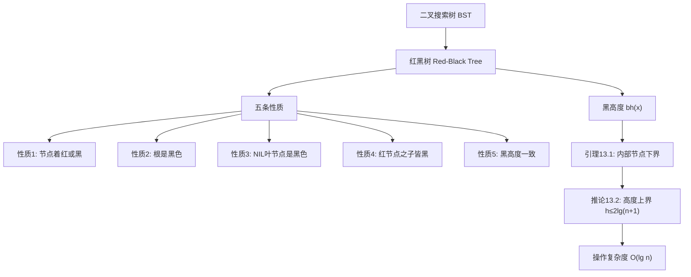

## 相关笔记
- 前置笔记：[[12.1 什么是二叉搜索树]]
- 关联概念：[[12.3 插入和删除]]、[[13.2 旋转]]
- 章节汇总：[[第13章_红黑树-章节汇总]]

> [!abstract] 概览
> 红黑树是一种**自平衡二叉搜索树**，通过为每个节点附加颜色属性（红或黑）并施加五条结构性约束，保证树高始终为 $O(\lg n)$，从而确保查找、插入、删除操作均可在 $O(\lg n)$ 时间内完成。本节介绍红黑树的定义、五条性质、==黑高度==概念，以及通过==引理13.1==和==推论13.2==严格证明红黑树的高度上界。

---

## 知识结构总览

---

## 核心思想

> [!tip] 核心思路
> 红黑树的核心思想是在**二叉搜索树**的基础上，引入"颜色"这一额外元数据，通过==五条局部约束==来控制树的全局平衡性。与AVL树直接限制左右子树高度差不同，红黑树采用更"宽松"的平衡策略：它不要求严格的平衡，而是通过==性质4==（红节点的两个子节点必须为黑色）和==性质5==（所有路径黑高度相同）来间接限制树高不超过 $2\lg(n+1)$。这种"适度平衡"使得插入和删除操作所需的==旋转次数被限制在常数次==，在实际工程中表现优异。

### 红黑树的形式化定义

一棵**红黑树**是一棵满足以下五条性质的二叉搜索树：

1. **性质1**：每个节点要么是**红色**的，要么是**黑色**的。
2. **性质2**：根节点是**黑色**的。
3. **性质3**：每个叶节点（NIL）是**黑色**的。
4. **性质4**：如果一个节点是**红色**的，则它的两个子节点都是**黑色**的。（等价地：不能有两个相邻的红色节点。）
5. **性质5**：对每个节点，从该节点到其后代叶节点的所有简单路径上，均包含**相同数目**的黑色节点。

> [!def] 黑高度（black-height）
> 从节点 $x$（**不包含** $x$ 本身）出发，到达任意一个叶节点（NIL）的路径上的**黑色节点数目**，称为节点 $x$ 的==黑高度==，记作 $\text{bh}(x)$。
>
> 特别地，NIL节点的黑高度为 $\text{bh}(\text{NIL}) = 0$。

### 引理13.1及其证明

> [!def] 引理13.1
> 以节点 $x$ 为根的子树中，内部节点数至少为 $2^{\text{bh}(x)} - 1$。

> **【引理13.1（黑高度归纳：内部节点数≥2^bh(x)-1）】**
>
> **证明：** 对黑高度 $\text{bh}(x)$ 进行数学归纳法。

> [!def] 循环不变式
> **归纳假设：** 对于黑高度为 $k$ 的任意节点 $x$，以其为根的子树至少包含 $2^k - 1$ 个内部节点。
>
> **基础情况（$\text{bh}(x) = 0$）：** 当 $\text{bh}(x) = 0$ 时，节点 $x$ 的两个子节点都是NIL（因为从 $x$ 到叶节点的路径上不再有黑色节点）。此时以 $x$ 为根的子树恰好包含 $1$ 个内部节点（即 $x$ 本身）。而 $2^0 - 1 = 0$，所以 $1 \geq 0$ 成立。$\checkmark$
>
> **归纳步骤：** 假设对于 $\text{bh}(x) = k$，命题成立。考虑 $\text{bh}(x) = k + 1$ 的情况。
>
> **维护：** 节点 $x$ 有两个子节点 $x.\text{left}$ 和 $x.\text{right}$。由于 $x$ 本身是黑色（否则 $\text{bh}(x)$ 不会计入 $x$），其子节点的黑高度为 $\text{bh}(x.\text{left}) \geq k$ 且 $\text{bh}(x.\text{right}) \geq k$（若子节点为红色则黑高度仍为 $k+1$，若为黑色则为 $k$）。由归纳假设，每个子树至少有 $2^k - 1$ 个内部节点。因此以 $x$ 为根的子树的总内部节点数至少为：
>
> $$\underbrace{(2^k - 1)}_{\text{左子树}} + \underbrace{(2^k - 1)}_{\text{右子树}} + \underbrace{1}_{x \text{ 本身}} = 2^{k+1} - 1$$
>
> **终止：** 归纳对所有 $\text{bh}(x) \geq 0$ 成立，引理得证。 $\blacksquare$

### 推论13.2及其证明

> [!def] 推论13.2
> 一棵含有 $n$ 个内部节点的红黑树的高度至多为 $2\lg(n+1)$。

> **【推论13.2（红黑树高度上界h≤2lg(n+1)）】**
>
> **证明：** 设红黑树的根为 $r$，树高为 $h$。

考虑从根 $r$ 到任意叶节点（NIL）的一条最长路径。由于==性质4==（红节点的子节点必须为黑色），该路径上红色节点数最多等于黑色节点数（即红黑交替排列时红色最多）。因此路径上至少有一半的节点是黑色的，即：

$$\text{bh}(r) \geq \frac{h}{2}$$

由==引理13.1==，以 $r$ 为根的整棵树的内部节点数满足：

$$n \geq 2^{\text{bh}(r)} - 1$$

将 $\text{bh}(r) \geq h/2$ 代入：

$$n \geq 2^{h/2} - 1$$
$$n + 1 \geq 2^{h/2}$$
$$\lg(n+1) \geq \frac{h}{2}$$
$$h \leq 2\lg(n+1) \quad \blacksquare$$

### 时间复杂度分析

> [!def] 时间复杂度
> 由==推论13.2==，含 $n$ 个内部节点的红黑树高度 $h \leq 2\lg(n+1) = O(\lg n)$。
>
> 因此，基于红黑树的**查找**、**插入**、**删除**操作的时间复杂度均为 $O(\lg n)$。
>
> 其中，插入和删除操作可能需要通过==旋转==（[[13.2 旋转]]）和==变色==来修复被破坏的红黑性质，但旋转次数被限制在**常数次** $O(1)$，因此总体仍为 $O(\lg n)$。

---

## 补充理解与拓展

> [!info] 红黑树的发明历史
> 红黑树的思想最早源于Rudolf Bayer于1972年提出的"**对称二叉B树**"（Symmetric binary B-trees）[^1]。Bayer注意到B树的平衡性可以通过在二叉树上引入颜色标记来模拟。1978年，Leonidas J. Guibas和Robert Sedgewick在论文"A dichromatic framework for balanced trees"中[^2]正式引入了红/黑着色方案，建立了红黑树的理论框架，并证明了其与2-3-4树的等价性。
>
> 后续发展包括：Arne Andersson于1993年提出的**AA树**（一种简化版红黑树，仅允许右倾红色链接）[^3]，以及Robert Sedgewick于2008年提出的**左倾红黑树**（Left-Leaning Red-Black Tree, LLRB）[^4]，进一步简化了实现。

> [!info] 红黑树与2-3-4树的对应关系
> 红黑树可以看作是**2-3-4树**（一种4阶B树）的二叉树表示。具体对应关系为：
> - **黑色节点**对应2-3-4树中的一个节点；
> - **红色节点**与其黑色父节点一起，对应2-3-4树中的一个更大的节点（3-节点或4-节点）；
> - ==性质4==（红节点的子节点皆黑）保证了2-3-4树中不会出现"5-节点"；
> - ==性质5==（黑高度一致）保证了所有叶节点在同一层，即2-3-4树的所有叶节点深度相同。
>
> 这种对应关系是理解红黑树操作（插入、删除）的直觉基础[^2]。

> [!info] 红黑树 vs AVL树 vs B树
> **AVL树**（Adelson-Velsky and Landis, 1962）要求左右子树高度差不超过1，因此更严格地平衡，树高 $h \leq 1.44\lg(n+2)$，查找效率略优于红黑树。但AVL树在插入和删除时可能需要 $O(\lg n)$ 次旋转，而红黑树仅需 $O(1)$ 次。
>
> **红黑树**的树高 $h \leq 2\lg(n+1)$，虽然比AVL树略高，但插入删除的旋转次数更少，在写密集场景下表现更优。这也是为什么许多标准库（如Java的`TreeMap`、C++的`std::map`、Linux内核）选择红黑树而非AVL树。
>
> Stewart（2024）的基准测试[^5]表明，在实际工作负载中，红黑树的综合性能通常优于AVL树，尤其是在频繁插入删除的场景下。
>
> **B树**及其变体（B+树）更适合磁盘存储场景，因为它们减少了I/O次数。

---

## 易混淆点与辨析

> [!warning] NIL节点是真正的叶子节点，而非"空指针"
> ❌ 错误理解：红黑树中的NIL只是空指针的标记，不算真正的节点。
>
> ✅ 正确理解：在红黑树的形式化定义中，==NIL是真正的叶节点==（哨兵节点），它们是黑色的（性质3），并且参与黑高度的计算。所有内部节点的子节点要么是另一个内部节点，要么是NIL。将NIL视为显式节点是理解性质5的关键。

> [!warning] 黑高度不包含节点本身
> ❌ 错误理解：$\text{bh}(x)$ 是从 $x$ 到叶节点路径上包含 $x$ 在内的黑色节点数。
>
> ✅ 正确理解：$\text{bh}(x)$ **不包含** $x$ 本身。例如，若 $x$ 是一个黑色叶节点（其两个子节点都是NIL），则 $\text{bh}(x) = 0$（因为从 $x$ 到NIL的路径上没有额外的黑色节点）。这一约定使得归纳证明更加简洁。

> [!warning] 性质4不意味着黑节点的子节点必须为红色
> ❌ 错误理解：如果一个节点是黑色的，则它的子节点至少有一个是红色的。
>
> ✅ 正确理解：==性质4==只规定了"红节点的子节点必须为黑色"（单向约束），对黑色节点的子节点颜色**没有任何限制**。黑色节点的子节点可以是两个黑色节点，也可以是一个红一个黑。

> [!warning] 红黑树不要求严格的平衡
> ❌ 错误理解：红黑树是完美平衡的，左右子树高度差不超过1。
>
> ✅ 正确理解：红黑树只保证==高度上界== $h \leq 2\lg(n+1)$，并不要求左右子树高度差有严格限制。最坏情况下，一条路径可能全是黑节点（长度为 $\lg(n+1)$），而另一条路径红黑交替（长度为 $2\lg(n+1)$），两者高度差可达 $\lg(n+1)$。

---

## 习题精选

| 题号 | 题目描述 | 难度 | 涉及知识点 |
|:-----|:---------|:----:|:-----------|
| 13.1-1 | 对给定的红黑树，验证其是否满足全部五条性质 | ★☆☆ | 五条性质的综合应用 |
| 13.1-2 | 计算给定红黑树中各节点的黑高度 | ★☆☆ | 黑高度的定义与计算 |
| 13.1-3 | 分别构造 $n$ 个内部节点的红黑树的最大高度和最小高度 | ★★☆ | 高度上界与下界 |
| 13.1-4 | 证明非空红黑树中至少有一个红色节点 | ★☆☆ | 性质2与性质4的联合推导 |
| 13.1-5 | 求黑高度为 $k$ 的红黑树的最小内部节点数 | ★★☆ | 引理13.1的等号条件 |
| 13.1-6 | 求黑高度为 $k$ 的红黑树的最大高度 | ★★☆ | 性质4与性质5的联合分析 |
| 13.1-7 | 找出一个替代性质5的等价方案 | ★★★ | 红黑树性质的等价表述 |

> [!faq]- 13.1-1 性质验证示例
> 考虑一棵仅含根节点（黑色）和两个NIL子节点的红黑树：
> - 性质1：根为黑色 ✓，NIL为黑色 ✓
> - 性质2：根为黑色 ✓
> - 性质3：NIL为黑色 ✓
> - 性质4：根为黑色，无红色节点，条件空真 ✓
> - 性质5：从根到两个NIL的路径上各有0个黑色节点（不含根），相等 ✓
>
> 所有五条性质均满足。

> [!faq]- 13.1-4 非空红黑树至少有一个红色节点
> **【非空红黑树至少一个红色节点（反证法：全黑则完美平衡）】**
>
> **证明：** 用反证法。假设一棵非空红黑树的所有内部节点都是黑色的。
>
> 设树高为 $h$，则从根到叶节点的最长路径上恰好有 $h$ 个黑色内部节点（因为所有节点都是黑色的）。由性质5，所有从根到叶节点的路径上黑色节点数相同，因此每条路径上都有 $h$ 个黑色节点。
>
> 考虑根节点 $r$。由于 $r$ 是黑色的，$\text{bh}(r) = h - 1$（从 $r$ 到叶节点路径上有 $h-1$ 个黑色节点，不含 $r$ 本身）。
>
> 更直接的论证：如果所有节点都是黑色的，那么从根到任意叶节点的路径上黑色节点数恰好等于路径长度。由性质5，所有根到叶的路径长度必须相同，即树必须是**完美平衡**的。但一棵有 $n$ 个内部节点的完美平衡二叉树只在 $n = 2^k - 1$ 时存在。对于一般的 $n$，这不可能。因此，非空红黑树中至少存在一个红色节点。 $\blacksquare$

> [!faq]- 13.1-5 黑高度为 $k$ 的最小内部节点数
> 当==引理13.1==取等号时，即 $n = 2^{\text{bh}(\text{root})} - 1$，此时树为**完美黑色树**（所有节点都是黑色的完全二叉树）。
>
> 因此，黑高度为 $k$ 的红黑树的最小内部节点数为 $2^k - 1$。
>
> **构造方法：** 一棵高度为 $k$ 的完美二叉树，所有节点着黑色，满足全部五条性质。

> [!faq]- 13.1-6 黑高度为 $k$ 的最大高度
> 由性质4（红节点的子节点必须为黑色），最长路径是红黑交替的路径。设根为黑色（性质2），则最长路径的模式为：黑-红-黑-红-...-黑-NIL。
>
> 路径上黑色节点数为 $k$（因为黑高度为 $k$），红色节点数最多为 $k-1$（不能连续红色），因此最大高度为 $k + (k-1) = 2k - 1$。
>
> **构造方法：** 一条从根到叶的路径上交替着黑色和红色节点，其余子树尽可能"短"（用黑色节点填充以保持黑高度一致）。

---

## 视频学习指南

| 资源 | 讲者/来源 | 时长 | 特点 |
|:-----|:----------|:----:|:-----|
| MIT 6.006 Lecture 10: Red-Black Trees | Erik Demaine | ~75min | 经典课程，从BST到红黑树的动机讲解清晰 |
| 红黑树的插入与删除 | 蔡军（青岛大学） | ~45min | 中文讲解，配合动画演示，适合入门 |
| Red-Black Trees in 4 minutes | Michael Sambol | ~4min | 极简动画，快速建立直觉 |
| Left-Leaning Red-Black Trees | Robert Sedgewick (Princeton) | ~60min | 作者本人讲解LLRB，深入浅出 |
| Red-Black Tree Visualization | University of San Francisco | 交互式 | 在线可视化工具，可逐步操作观察 |
| CLRS Chapter 13 精读 | 算法导论读书会（B站） | ~90min | 中文逐节精读，包含习题讨论 |

---

## 教材原文

> [!quote] CLRS 第4版 13.1节原文
> 一棵**红黑树**是一棵满足下列红黑性质的二叉搜索树：
>
> **性质1：** 每个节点或是红色的，或是黑色的。
>
> **性质2：** 根节点是黑色的。
>
> **性质3：** 每个叶节点（NIL）是黑色的。
>
> **性质4：** 如果一个节点是红色的，则它的两个子节点都是黑色的。
>
> **性质5：** 对每个节点，从该节点到其后代叶节点的所有简单路径上，均包含相同数目的黑色节点。
>
> 为了便于处理红黑树代码中的边界条件，我们使用一个**哨兵**来代表NIL。对于一棵红黑树 $T$，哨兵 $T.\text{nil}$ 是一个与普通节点具有相同属性的对象，它的颜色为黑色，而它的其他属性（$p$、$left$、$right$、$key$）的值可以设为任意值。我们将所有指向NIL的指针替换为指向哨兵 $T.\text{nil}$ 的指针。
>
> 我们将节点 $x$ 的**黑高度**（black-height）记为 $\text{bh}(x)$，它是指从节点 $x$ 出发（但不包含 $x$）到达一个叶节点的任意路径上的黑色节点数。根据性质5，该定义是良定义的。

---

## 参见Wiki

[^1]: Bayer, R. (1972). "Symmetric binary B-Trees: Data structure and maintenance algorithms." *Acta Informatica*, 1(4), 290–306.
[^2]: Guibas, L. J., & Sedgewick, R. (1978). "A dichromatic framework for balanced trees." *Proceedings of the 19th Annual Symposium on Foundations of Computer Science (FOCS)*, 8–21.
[^3]: Andersson, A. (1993). "Balanced search trees made simple." *Proceedings of the 3rd Workshop on Algorithms and Data Structures (WADS)*, LNCS 709, 60–71.
[^4]: Sedgewick, R. (2008). "Left-Leaning Red-Black Trees." *Data Structures Seminar at Dagstuhl*, Feb 2008.
[^5]: Stewart, J. W. (2024). "Comparative Performance of the AVL Tree to Three Variants of the Red-Black Tree." *Software: Practice and Experience*, 54(7), 1–22.
- [[第12章_二叉搜索树/12.1 什么是二叉搜索树]]：红黑树的基础——二叉搜索树
- [[第13章_红黑树/13.2 旋转]]：红黑树插入删除操作中的基本局部操作
- [[第13章_红黑树-章节汇总]]：第13章完整知识体系
- [[AVL树]]：另一种自平衡二叉搜索树，与红黑树对比
- [[2-3-4树]]：红黑树对应的B树形式
- [[算法导论/theorems/红黑树高度定理]]

#学习/算法导论/第13章-红黑树 #学习/算法导论/红黑树/红黑树的性质
