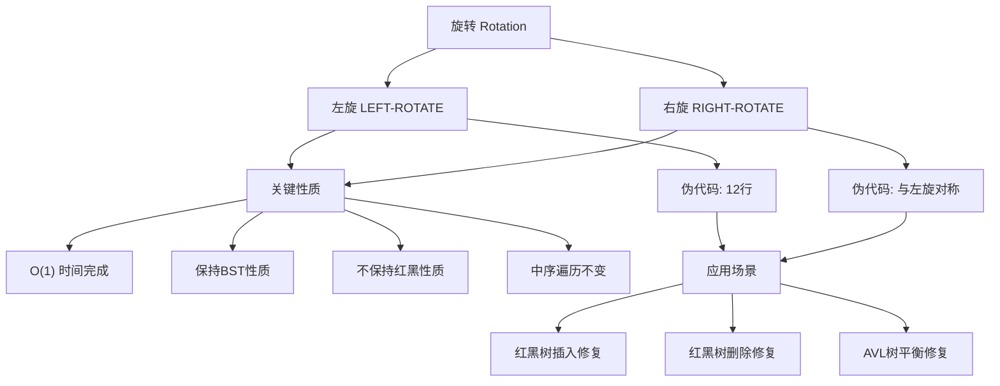

## 相关笔记
- 前置笔记：[[13.1 红黑树的性质]]
- 关联概念：[[12.1 什么是二叉搜索树]]、[[12.3 插入和删除]]
- 章节汇总：[[第13章_红黑树-章节汇总]]

> [!abstract] 概览
> ==旋转==是红黑树（以及AVL树等自平衡二叉搜索树）中的**基本局部操作**，用于在保持==二叉搜索树性质==的前提下改变树的结构。本节介绍==左旋==和==右旋==两种操作的伪代码、执行过程、关键性质（$O(1)$ 时间、保持BST性质、不保持红黑性质），并通过实例和正确性分析帮助读者建立对旋转操作的深刻理解。

---

## 知识结构总览



---

## 核心思想

> [!tip] 核心思路
> 旋转的本质是一种**局部的树结构变换**：将一个节点与其子节点之间的"父子关系"进行交换，同时重新连接相关的子树。左旋将节点的**右孩子**提升为该节点的父节点，右旋则将节点的**左孩子**提升为父节点。旋转的关键约束是必须保持==二叉搜索树性质==——即中序遍历序列不变。旋转操作仅涉及**常数个指针的修改**，因此时间复杂度为 $O(1)$。但旋转**不保证**保持红黑性质，在红黑树的插入和删除操作中，旋转之后通常还需要配合==变色==操作来恢复红黑性质。

### 左旋 —— 伪代码

```
LEFT-ROTATE(T, x)
 1  y = x.right
 2  x.right = y.left
 3  if y.left ≠ T.nil
 4     y.left.p = x
 5  y.p = x.p
 6  if x.p == T.nil
 7     T.root = y
 8  elseif x == x.p.left
 9     x.p.left = y
10  else x.p.right = y
11  y.left = x
12  x.p = y
```

### 右旋 —— 伪代码

```
RIGHT-ROTATE(T, y)
 1  x = y.left
 2  y.left = x.right
 3  if x.right ≠ T.nil
 4     x.right.p = y
 5  x.p = y.p
 6  if y.p == T.nil
 7     T.root = x
 8  elseif y == y.p.right
 9     y.p.right = x
10  else y.p.left = x
11  x.right = y
12  y.p = x
```

> [!def] 旋转的三个阶段
> 以左旋 `LEFT-ROTATE(T, x)` 为例，伪代码可以分为三个阶段：
>
> **阶段一（第1-4行）：子树转移。** 将 $y$ 的左子树 $\beta$ 挂到 $x$ 的右子节点位置。因为 $\beta$ 中所有节点的关键字满足 $x.\text{key} < \text{key}(\beta) < y.\text{key}$，将其作为 $x$ 的右子树不违反BST性质。
>
> **阶段二（第5-10行）：父节点重连。** 将 $y$ 接到 $x$ 原来的父节点位置。这一步需要区分 $x$ 是根节点、左孩子还是右孩子三种情况。
>
> **阶段三（第11-12行）：确立新父子关系。** 将 $x$ 设为 $y$ 的左孩子，完成旋转。

### 左旋执行过程详解

假设对节点 $x$ 执行左旋，旋转前的结构为：

```
        x                y
       / \              / \
      α   y    =>      x   γ
         / \          / \
        β   γ        α   β
```

其中 $\alpha$、$\beta$、$\gamma$ 分别代表子树（可以为NIL）。

**逐行追踪 `LEFT-ROTATE(T, x)` 的执行过程：**

| 行号 | 操作 | 说明 |
|:----:|:-----|:-----|
| 1 | `y = x.right` | 记录 $x$ 的右孩子为 $y$ |
| 2 | `x.right = y.left` | 将 $\beta$（$y$ 的左子树）挂到 $x$ 的右侧 |
| 3-4 | 检查并更新 `y.left.p = x` | 若 $\beta$ 非空，更新其父指针指向 $x$ |
| 5 | `y.p = x.p` | $y$ 继承 $x$ 的父节点 |
| 6-7 | 若 $x$ 是根，则 $y$ 成为新根 | 处理根节点特殊情况 |
| 8-9 | 若 $x$ 是左孩子，则 $y$ 成为新的左孩子 | |
| 10 | 若 $x$ 是右孩子，则 $y$ 成为新的右孩子 | |
| 11 | `y.left = x` | $x$ 成为 $y$ 的左孩子 |
| 12 | `x.p = y` | 更新 $x$ 的父指针指向 $y$ |

### 旋转保持BST性质的证明

> [!def] 旋转保持BST性质
> **定理：** 对二叉搜索树 $T$ 的节点 $x$ 执行 `LEFT-ROTATE(T, x)` 后，$T$ 仍然是一棵二叉搜索树。

> **【旋转保持BST性质（子树重挂不改变中序序列）】**
>
> **证明：**
>
> **【前提条件】** 旋转前，以 $x$ 为根的子树满足BST性质：
> - $\alpha$ 中所有关键字 $< x.\text{key}$
> - $\beta$ 中所有关键字满足 $x.\text{key} < \text{key}(\beta) < y.\text{key}$
> - $\gamma$ 中所有关键字 $> y.\text{key}$
>
> **【验证BST性质不变】** 旋转后，以 $y$ 为根的子树中：
> - $\alpha$ 仍在 $x$ 的左侧，所有关键字 $< x.\text{key} < y.\text{key}$ ✓
> - $\beta$ 移至 $x$ 的右侧，所有关键字满足 $x.\text{key} < \text{key}(\beta) < y.\text{key}$ ✓
> - $\gamma$ 仍在 $y$ 的右侧，所有关键字 $> y.\text{key}$ ✓
>
> 子树之外的部分不受影响。因此旋转后BST性质保持不变。 $\blacksquare$

> [!def] 旋转保持中序遍历
> 旋转前和旋转后的中序遍历序列均为：$\alpha$、$x$、$\beta$、$y$、$\gamma$。因此==旋转操作不改变中序遍历的结果==，这是旋转保持BST性质的等价表述。

### 时间复杂度分析

> [!def] 时间复杂度
> `LEFT-ROTATE` 和 `RIGHT-ROTATE` 均只执行**常数次**指针赋值操作（共12行伪代码，每行都是 $O(1)$ 操作），因此旋转的时间复杂度为 **$O(1)$**。
>
> 旋转不执行任何搜索操作，不递归调用自身，也不改变树中节点的总数。

---

## 补充理解与拓展

> [!info] 旋转与2-3-4树变换的对应关系
> 在红黑树与2-3-4树的对应关系中，旋转操作对应于2-3-4树中节点的"分裂"与"合并"操作[^1]。
>
> 具体而言，当红黑树中一个黑色节点与其红色子节点构成一个"3-节点"时，左旋或右旋可以改变红色子节点的方向，对应于2-3-4树中3-节点内部结构的调整。当需要"分裂"一个4-节点时（在插入操作中），旋转配合变色可以将4-节点分解为两个2-节点并将中间键上移。
>
> 这种对应关系为理解红黑树插入和删除中的修复操作提供了直观的几何解释[^2]。

> [!info] 旋转在AVL树与红黑树中的对比
> **AVL树**使用四种旋转模式：LL（左左）、RR（右右）、LR（左右）、RL（右左）。其中LR和RL是**双旋转**，分别由一次单旋转+一次反方向单旋转组成。AVL树在插入和删除时，旋转次数为 $O(\lg n)$（最坏情况下需要沿路径向上逐层旋转）[^3]。
>
> **红黑树**仅使用两种基本旋转（左旋和右旋），配合==变色==操作来维护平衡。在插入操作中，最多需要**2次**旋转；在删除操作中，最多需要**3次**旋转。旋转次数始终为 $O(1)$，这是红黑树在工程实践中优于AVL树的关键原因之一[^4]。
>
> 旋转本身在两种树中的实现完全相同，区别在于**何时触发旋转**以及**旋转后是否需要额外的变色操作**。

> [!info] 旋转的逆操作
> 左旋和右旋互为逆操作：对节点 $x$ 执行 `LEFT-ROTATE(T, x)` 得到节点 $y$ 后，对 $y$ 执行 `RIGHT-ROTATE(T, y)` 即可恢复原来的树结构。这一性质在红黑树的删除修复过程中经常被利用——先左旋再右旋（或反之）可以实现"回退"效果。

---

## 易混淆点与辨析

> [!warning] 旋转的前提条件
> ❌ 错误理解：可以对任意节点执行任意方向的旋转。
>
> ✅ 正确理解：**左旋要求节点必须有右孩子**（`x.right ≠ T.nil`），否则 `LEFT-ROTATE(T, x)` 无意义。同理，**右旋要求节点必须有左孩子**（`y.left ≠ T.nil`）。如果前提条件不满足，旋转操作无法执行。

> [!warning] 旋转保持BST性质但不保持红黑性质
> ❌ 错误理解：旋转既保持BST性质，也保持红黑性质。
>
> ✅ 正确理解：旋转**只保证**BST性质（中序遍历不变），**不保证**红黑性质。旋转可能破坏==性质2==（根为黑色）、==性质4==（红节点的子节点为黑色）或==性质5==（黑高度一致）。因此，在红黑树的插入和删除操作中，旋转之后通常需要额外的==变色==操作来恢复红黑性质。

> [!warning] 旋转不改变树中节点总数
> ❌ 错误理解：旋转会插入或删除节点。
>
> ✅ 正确理解：旋转是纯粹的**结构重组**操作，不创建新节点，也不删除现有节点。树中的节点集合在旋转前后完全相同，改变的只是节点之间的父子关系。

> [!warning] 左旋和右旋不是对称地作用于同一棵树
> ❌ 错误理解：对同一节点先左旋再左旋，等价于某种双左旋。
>
> ✅ 正确理解：左旋和右旋是**互逆**操作，而非可叠加操作。对节点 $x$ 左旋得到 $y$，再对 $y$ 右旋可恢复原状。但不能对同一节点连续执行两次同方向旋转（第一次旋转后，该节点已不再是旋转操作所要求的位置）。

---

## 习题精选

| 题号 | 题目描述 | 难度 | 涉及知识点 |
|:-----|:---------|:----:|:-----------|
| 13.2-1 | 对给定的红黑树执行旋转操作，画出结果 | ★☆☆ | 左旋/右旋的执行过程 |
| 13.2-2 | 证明旋转保持BST性质 | ★★☆ | BST性质的形式化证明 |
| 13.2-3 | 给定初始树和目标树，找出旋转序列 | ★★★ | 旋转的组合应用 |
| 13.2-4 | 用有向图表示旋转操作 | ★★★ | 旋转的图论视角 |

> [!faq]- 13.2-1 旋转执行示例
> 考虑以下二叉搜索树（仅显示关键字）：
>
> ```
>      10
>     /  \
>    5    15
>   / \   / \
>  3  7 12  18
>       \
>        8
> ```
>
> 对节点5执行 `LEFT-ROTATE(T, 5)`：
>
> **执行过程：**
> 1. `y = 5.right = 7`
> 2. `5.right = 7.left = NIL`（7没有左孩子）
> 3. `y.p = 5.p = 10`，且 `5 == 10.left`，所以 `10.left = 7`
> 4. `7.left = 5`，`5.p = 7`
>
> **结果：**
> ```
>      10
>     /  \
>    7    15
>   / \   / \
>  5   8 12  18
>  /
> 3
> ```
>
> 中序遍历：旋转前 3, 5, 7, 8, 10, 12, 15, 18；旋转后 3, 5, 7, 8, 10, 12, 15, 18。**中序遍历不变** ✓

> [!faq]- 13.2-2 旋转保持BST性质的证明要点
> **【旋转BST性质保持（中序序列不变即等价表述）】**
>
> 证明的核心思路是：旋转只改变了**三个子树**（$\alpha$、$\beta$、$\gamma$）与**两个节点**（$x$、$y$）之间的连接方式，而不改变关键字之间的相对大小关系。
>
> 关键观察：旋转前 $\alpha$、$x$、$\beta$、$y$、$\gamma$ 的关键字满足严格的大小序，旋转后这五个"块"的中序排列不变，只是它们所挂载的父节点发生了变化。具体证明见上文"旋转保持BST性质的证明"部分。

> [!faq]- 13.2-3 旋转序列示例
> **问题：** 能否通过旋转将任意BST转换为任意其他具有相同节点集合的BST？
>
> **答案：** 可以。这是一个经典结论：通过一系列旋转，可以将任意BST转换为具有相同键集合的任意其他BST。这一结论由Sleator、Tarjan和Thurston于1988年证明[^5]，他们还证明了最多需要 $2n - 6$ 次旋转即可完成转换（对于 $n \geq 11$）。
>
> **实际操作策略：** 可以通过旋转将树逐步变为右链（所有节点只有右孩子），然后再从右链旋转为目标树。

---

## 视频学习指南

| 资源 | 讲者/来源 | 时长 | 特点 |
|:-----|:----------|:----:|:-----|
| MIT 6.006 Lecture 10: Red-Black Trees | Erik Demaine | ~75min | 包含旋转的动画演示和正确性讨论 |
| Tree Rotations | Michael Sambol | ~3min | 极简动画，直观展示左旋和右旋的过程 |
| AVL Tree Rotations | RobEdwards (SDSU) | ~15min | 详细讲解四种旋转模式，有助于对比理解 |
| Red-Black Tree Insertion Fixup | Michael Sambol | ~5min | 展示旋转在红黑树插入修复中的实际应用 |
| 红黑树旋转操作详解 | 蔡军（青岛大学） | ~30min | 中文讲解，逐步追踪伪代码执行过程 |
| CS 61B Lecture 24: Balanced Search Trees | Josh Hug (UC Berkeley) | ~50min | 从BST到平衡树的动机，旋转的直觉解释 |

---

## 教材原文

> [!quote] CLRS 第4版 13.2节原文
> 我们在二叉搜索树上的旋转操作中使用了指针和**父指针**。假设旋转的输入是树 $T$ 和树中的一个节点 $x$。图13-2展示了左旋操作 `LEFT-ROTATE(T, x)` 的效果，它假设 $x.\text{right}$ 不是 $T.\text{nil}$。左旋操作使 $x.\text{right}$ 成为 $x$ 的父节点，而 $x$ 变为其左孩子。
>
> `LEFT-ROTATE(T, x)` 通过改变常数个指针来完成。它保持了BST性质，但不一定保持红黑性质。
>
> **引理13.3：** 在二叉搜索树 $T$ 上执行旋转操作需要 $O(1)$ 时间。
>
> **【引理13.3（旋转O(1)时间：常数次指针赋值）】**
>
> **证明：** `LEFT-ROTATE` 和 `RIGHT-ROTATE` 过程的代码只包含常数个指针赋值操作，因此每个过程都在 $O(1)$ 时间内执行完毕。 $\blacksquare$

---

## 参见Wiki

[^1]: Guibas, L. J., & Sedgewick, R. (1978). "A dichromatic framework for balanced trees." *Proceedings of the 19th Annual Symposium on Foundations of Computer Science (FOCS)*, 8–21.
[^2]: Sedgewick, R. (2008). "Left-Leaning Red-Black Trees." *Data Structures Seminar at Dagstuhl*, Feb 2008.
[^3]: Knuth, D. E. (1998). *The Art of Computer Programming, Volume 3: Sorting and Searching*, 2nd Edition. Addison-Wesley. Section 6.2.3.
[^4]: Stewart, J. W. (2024). "Comparative Performance of the AVL Tree to Three Variants of the Red-Black Tree." *Software: Practice and Experience*, 54(7), 1–22.
[^5]: Sleator, D. D., Tarjan, R. E., & Thurston, W. P. (1988). "Rotation distance, triangulations, and hyperbolic geometry." *Journal of the American Mathematical Society*, 1(3), 647–681.
- [[第13章_红黑树/13.1 红黑树的性质]]：旋转操作所维护的红黑树性质
- [[第12章_二叉搜索树/12.1 什么是二叉搜索树]]：旋转保持的BST性质
- [[第12章_二叉搜索树/12.3 插入和删除]]：旋转是BST基本操作的扩展
- [[第13章_红黑树-章节汇总]]：第13章完整知识体系
- [[AVL树]]：同样使用旋转操作的自平衡二叉搜索树

#学习/算法导论/第13章-红黑树 #学习/算法导论/红黑树/旋转
