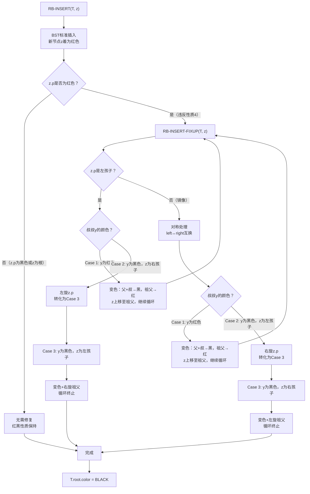
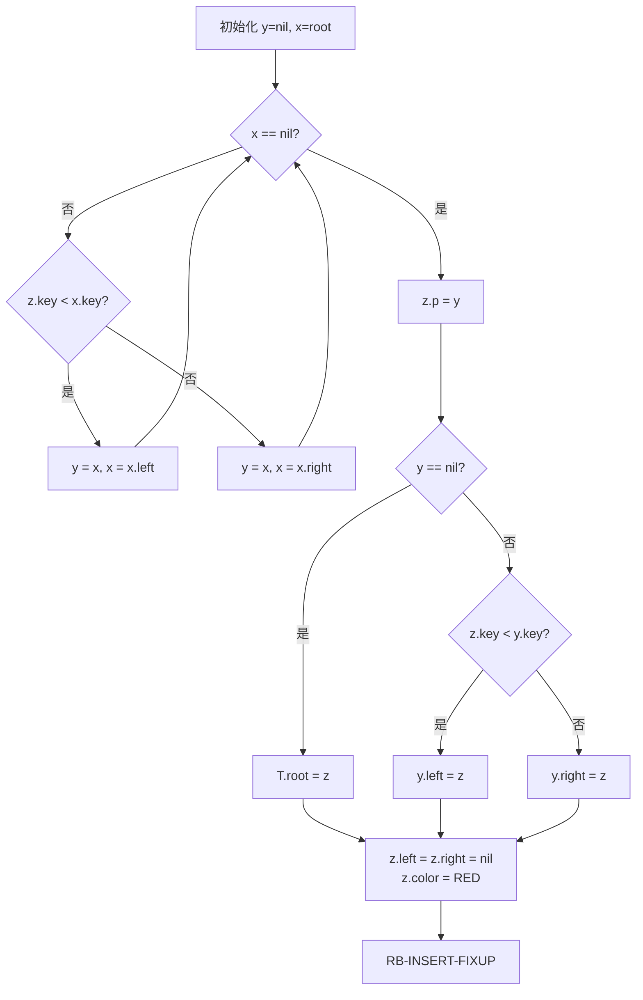
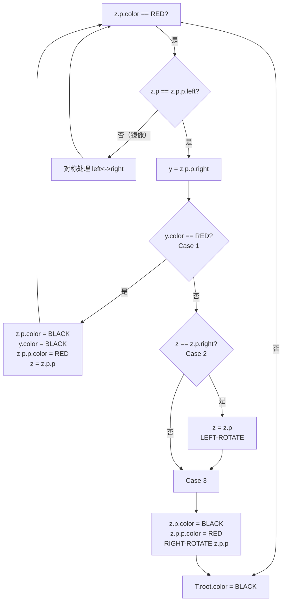

## 相关笔记

> [!abstract] 概览
> 本节介绍如何在红黑树中插入一个新节点。核心策略是**将新节点着为红色**以保持黑高度不变，然后通过 `RB-INSERT-FIXUP` 过程修复可能违反的红黑性质。修复过程涉及**3种情况（及其镜像）**，通过变色与旋转操作恢复红黑性质，总时间复杂度为 $O(\lg n)$，且最多仅需**2次旋转**。
>
> **前置依赖：** [[13.1 红黑树的性质]]、[[13.2 旋转]]
>
> **后续关联：** [[13.4 删除]]

---

## 知识结构总览



---

## 核心思想

> [!tip] 插入的核心策略
> 红黑树插入的基本思路是：先像普通**二叉搜索树**一样找到插入位置，将新节点着为**红色**。着红色的关键好处是**不改变任何路径的黑高度**（性质5自动满足），最多只可能违反**性质2**（根为黑色）和**性质4**（红色节点的两个孩子必须为黑色）。然后通过 `RB-INSERT-FIXUP` 过程，利用**变色**和**旋转**操作恢复所有红黑性质。

### RB-INSERT —— 伪代码

> [!tip] 算法执行流程
> 1. 初始化跟踪指针：y = nil（父节点跟踪），x = root（当前节点）
> 2. **沿树下降查找插入位置**：若 z.key < x.key 则走左子树，否则走右子树，y 始终跟踪 x 的父节点
> 3. 将新节点 **z 挂接到父节点 y** 下（若树空则 z 成为根）
> 4. 设置 z 的左右孩子为 nil，将 **z 着为红色**
> 5. 调用 **RB-INSERT-FIXUP** 修复可能违反的红黑性质



```
RB-INSERT(T, z)
1  y = T.nil
2  x = T.root
3  while x ≠ T.nil
4     y = x
5     if z.key < x.key
6        x = x.left
7     else x = x.right
8  z.p = y
9  if y == T.nil
10    T.root = z
11 elseif z.key < y.key
12    y.left = z
13 else y.right = z
14 z.left = T.nil
15 z.right = T.nil
16 z.color = RED
17 RB-INSERT-FIXUP(T, z)
```

**逐行解读：**

- **第1-7行：** 标准 BST 查找过程。`y` 始终跟踪 `x` 的父节点，最终 `y` 就是新节点 `z` 的父节点。当 `x` 落到 `T.nil` 时，说明找到了插入位置。
- **第8-13行：** 将 `z` 挂接到父节点 `y` 下。如果 `y == T.nil`（树为空），则 `z` 成为根节点。
- **第14-15行：** 将 `z` 的左右孩子设为哨兵 `T.nil`，保证红黑树的叶子节点统一为 `T.nil`。
- **第16行：** **关键步骤**——将 `z` 着为红色。这一步保证了性质5（黑高度不变）不被破坏。
- **第17行：** 调用修复过程，处理可能违反的性质2或性质4。

### RB-INSERT-FIXUP —— 伪代码

> [!tip] 算法执行流程
> 1. **while 循环**：当 z 的父节点为红色时（违反性质4），进入修复
> 2. 判断父节点是祖父的左孩子还是右孩子（以左孩子为例，右孩子为镜像）
> 3. 取叔叔节点 y = z.p.p.right
> 4. **Case 1（叔叔为红色）**：父和叔变黑，祖父变红，z 上移至祖父，继续循环
> 5. **Case 2（叔叔为黑色，z 为右孩子）**：z 上移至父节点，左旋 z，转化为 Case 3
> 6. **Case 3（叔叔为黑色，z 为左孩子）**：父变黑，祖父变红，右旋祖父，循环终止
> 7. 循环结束后，将 **根节点着为黑色**



```
RB-INSERT-FIXUP(T, z)
1  while z.p.color == RED
2     if z.p == z.p.p.left
3        y = z.p.p.right          // y是z的叔叔
4        if y.color == RED        // Case 1
5           z.p.color = BLACK     // (a) 父节点变黑
6           y.color = BLACK       // (b) 叔叔变黑
7           z.p.p.color = RED     // (c) 祖父变红
8           z = z.p.p             // (d) z上移至祖父，继续循环
9        else
10          if z == z.p.right     // Case 2
11             z = z.p            // (a) z上移至父节点
12             LEFT-ROTATE(T, z)  // (b) 左旋
13          // Case 3
14          z.p.color = BLACK     // (a) 父节点变黑
15          z.p.p.color = RED     // (b) 祖父变红
16          RIGHT-ROTATE(T, z.p.p)// (c) 右旋祖父
17    else (same as then clause
          with "right" and "left" exchanged)
18 T.root.color = BLACK
```

**逐行解读：**

- **第1行：** 循环条件——只要 `z` 的父节点是红色，就说明违反了性质4（红色节点的孩子必须为黑色），需要修复。注意：如果 `z.p` 是根节点（黑色），循环自然终止。
- **第2行：** 判断 `z` 的父节点是祖父的左孩子还是右孩子。第3-16行处理父节点为左孩子的情况，第17行的 `else` 处理镜像情况。
- **第3行：** `y` 指向 `z` 的**叔叔节点**（父节点的兄弟）。叔叔的颜色决定了进入哪种情况。
- **第4-8行（Case 1）：** 叔叔 `y` 为红色。通过将父和叔变黑、祖父变红，把红色"上推"两层到祖父。然后将 `z` 指向祖父，继续向上检查。Case 1 可能重复执行。
- **第10-12行（Case 2）：** 叔叔 `y` 为黑色，且 `z` 是右孩子。通过左旋将 `z` 转化为左孩子，为 Case 3 做准备。
- **第14-16行（Case 3）：** 叔叔 `y` 为黑色，且 `z` 是左孩子。将父变黑、祖父变红，然后右旋祖父。此时 `z.p`（原 `z` 的父节点）成为新的子树根（黑色），循环终止。
- **第18行：** 循环结束后，确保根节点为黑色。处理 `z` 原本就是根节点（被 Case 1 推上去）的情况。

### 三种情况详解

> [!def] Case 1：叔叔为红色
> **条件：** `z` 的父节点为红色，叔叔 `y` 也为红色。
>
> **操作：** 将 `z.p` 和 `y` 都着为黑色，将 `z.p.p` 着为红色，然后令 `z = z.p.p`。
>
> **效果：** 红色从 `z` 的层级上推到祖父层级。**黑高度不变**（每条路径上黑节点数不变），但可能在祖父处引入新的违反（如果祖父的父也是红色），因此需要继续循环。
>
> **关键观察：** Case 1 不会改变以 `z.p.p` 为根的子树的黑高度，因此对树的其他部分没有影响。

> [!def] Case 2：叔叔为黑色，z 为右孩子
> **条件：** `z` 的父节点为红色，叔叔 `y` 为黑色，且 `z` 是 `z.p` 的右孩子。
>
> **操作：** 令 `z = z.p`，然后对 `z` 执行 `LEFT-ROTATE(T, z)`。
>
> **效果：** 将 Case 2 转化为 Case 3。旋转后 `z` 变为左孩子，且父子关系不变（仍为红色父子），叔叔仍为黑色。
>
> **关键观察：** Case 2 本身不修复任何违反，它只是一个**转换步骤**，为 Case 3 创造条件。

> [!def] Case 3：叔叔为黑色，z 为左孩子
> **条件：** `z` 的父节点为红色，叔叔 `y` 为黑色，且 `z` 是 `z.p` 的左孩子。
>
> **操作：** 将 `z.p` 着为黑色，将 `z.p.p` 着为红色，然后对 `z.p.p` 执行 `RIGHT-ROTATE(T, z.p.p)`。
>
> **效果：** `z.p`（现为黑色）取代 `z.p.p` 成为新的子树根。旋转后，`z` 的父节点为黑色，**性质4被修复**。同时，黑高度不变（性质5保持），且新子树根为黑色，不会在更高层引入新的违反。**循环终止。**
>
> **关键观察：** Case 3 是真正的**修复步骤**。旋转后 `z.p` 成为黑色根节点，所有路径的黑高度不变，且红色节点的孩子都为黑色。

### 循环不变式

> [!def] RB-INSERT-FIXUP 的循环不变式
> 在 `while` 循环每次迭代开始时：
> 1. **节点 `z` 是红色。**
> 2. 如果 `z.p` 是根节点，则 `z.p` 为黑色（循环不执行）。
> 3. 如果红黑性质被违反，则最多只有**一条**被违反：要么是性质2（根为黑色），要么是性质4（`z` 与 `z.p` 都为红色）。性质1（每个节点非红即黑）、性质3（叶子为黑色）、性质5（黑高度相同）**始终成立**。

> **【插入修复不变式（红色上推不破坏黑高度）】**
>
> **初始化：** 插入后 `z` 为红色，如果 `z.p` 也为红色则违反性质4，否则无违反。性质1、3、5由插入过程保证。

> **【不变式维持（Case 1上推/Case 2转换/Case 3修复终止）】**
>
> **维持：** Case 1 将红色上推，可能引入新的性质4违反但不变其他性质；Case 2 转化为 Case 3 不改变违反状态；Case 3 修复所有违反并终止循环。

> **【不变式终止（z.p为黑色或z为根，性质4恢复）】**
>
> **终止：** 循环终止时 `z.p` 为黑色（或 `z` 为根），性质4不再被违反。第18行确保性质2成立。

### 时间复杂度分析

> [!def] RB-INSERT 的时间复杂度
> - **BST插入部分（第1-16行）：** $O(\lg n)$，沿树下降一层。
> - **修复部分（RB-INSERT-FIXUP）：**
>   - **Case 1** 每次将 `z` 上移2层，最多执行 $O(\lg n)$ 次。
>   - **Case 2 + Case 3** 各执行**最多1次旋转**，且执行后循环终止。
>   - 因此**总旋转次数最多为2次**。
> - **总时间复杂度：** $O(\lg n)$。

---

## 补充理解与拓展

> [!info] 标准库中的红黑树插入实现
> 红黑树插入是工业界应用最广泛的平衡树操作之一：
> - **Linux内核** `lib/rbtree.c`：内核红黑树实现，用于 **CFS调度器**（完全公平调度器管理进程运行队列）、**虚拟内存管理**（管理虚拟内存区域VMA）、**ext3/ext4文件系统**（目录索引）。内核提供了 `rb_insert_color()` 等接口，其修复逻辑与CLRS描述一致。详见 Linux Kernel Documentation "Red-black Trees (rbtree)" [^1]。
> - **Java** `TreeMap.put()`：Java集合框架中 `TreeMap` 和 `TreeSet` 的底层实现就是红黑树。`put()` 方法调用 `fixAfterInsertion()` 进行修复，逻辑与CLRS的三种情况一一对应。
> - **C++** `std::map::insert()`：GCC的 `libstdc++` 中 `stl_tree.h` 实现了红黑树。`_M_insert_()` 执行插入后调用 `_M_rebalance_insert()` 修复，同样采用自底向上的Case 1/2/3策略。

> [!info] 自顶向下插入策略
> CLRS采用的是**自底向上**（bottom-up）策略：先完成插入，再从插入点向上回溯修复。另一种策略是**自顶向下**（top-down）[^2]：在从根向下的搜索过程中，一旦发现当前节点的两个孩子都是红色，就提前执行Case 1的变色操作（将两个孩子变黑、当前节点变红），从而保证在到达插入位置时，父节点一定是黑色的，插入后无需回溯修复。
>
> 自顶向下策略的优势是**只需一次从根到叶子的遍历**，无需回溯，在某些实现中更高效。但其缺点是可能进行**不必要的变色操作**（即使最终不需要修复也提前做了）。Weiss的教材对此有详细讨论。

[^1]: Linux Kernel Documentation, "Red-black Trees (rbtree)", https://www.kernel.org/doc/html/latest/core-api/rbtree.html
[^2]: Weiss, M. A. (2013). *Data Structures and Algorithm Analysis in C++*, 4th Ed. Pearson, Ch 4.5.

---

## 易混淆点与辨析

> [!warning] 为什么新节点要着红色而不是黑色？
> **错误理解：** 着红色和着黑色都可以，只是约定不同。
>
> **正确理解：** 着红色是**精心设计的策略**。如果将新节点着为黑色，则该节点所在路径的黑高度增加了1，违反了性质5（所有路径黑高度相同），需要调整**所有经过该节点的路径**，修复代价可能很大。而着红色**不改变任何路径的黑高度**（性质5自动满足），最多只违反性质2或性质4，修复范围局部且可控。这正是红黑树插入高效的根本原因。

> [!warning] Case 2 是"修复"还是"转换"？
> **错误理解：** Case 2 和 Case 3 都是修复步骤，各自独立地修复红黑性质。
>
> **正确理解：** Case 2 **本身不修复任何违反**，它仅仅是一个**转换步骤**（transformation），将"z为右孩子"的形态旋转为"z为左孩子"的形态，从而为 Case 3 创造执行条件。真正的修复只发生在 Case 3。因此 Case 2 和 Case 3 总是**成对出现**（Case 2 -> Case 3），这也是为什么插入修复最多只需要2次旋转（Case 2一次左旋 + Case 3一次右旋）。

---

## 习题精选

| 题号 | 题目摘要 | 难度 | 核心考点 |
|:---:|---------|:---:|---------|
| 13.3-1 | 在图13-4中依次插入41、38、31、12、19、8，画出结果树 | ★★ | 插入过程+修复模拟 |
| 13.3-2 | 证明RB-INSERT-FIXUP中Case 1执行后，z.p.p仍为红色时循环继续 | ★★ | 循环不变式+Case 1分析 |
| 13.3-3 | 证明RB-INSERT-FIXUP的while循环最多执行O(lg n)次 | ★★★ | Case 1上移分析 |
| 13.3-4 | 证明RB-INSERT-FIXUP终止时红黑性质全部满足 | ★★★ | 循环不变式终止条件 |
| 13.3-5 | 给出RB-INSERT-FIXUP的递归版本 | ★★★ | 迭代转递归 |
| 13.3-6 | 证明插入后最多只需2次旋转 | ★★★ | Case 2+3分析 |
| 13.3-7 | 若将新节点着为黑色，说明修复可能需要Ω(lg n)次旋转 | ★★★★ | 着色策略对比 |

> [!faq]- 13.3-1 思路提示
> 按顺序插入每个节点，每次插入后执行 RB-INSERT-FIXUP。关键步骤：
> 1. 插入41：空树，41成为根（黑色），无需修复。
> 2. 插入38：38为41的左孩子（红色），父为黑色，无需修复。
> 3. 插入31：31为38的左孩子（红色），父38为红色 → **触发修复**。叔叔为空（黑色），z为左孩子 → Case 3：38变黑，41变红，右旋41。结果：38为根（黑色），左孩子31（红色），右孩子41（红色）。
> 4. 继续依次插入12、19、8，每步都需检查是否触发修复。
>
> **完整答案：** 建议在纸上逐步绘制，或使用红黑树可视化工具（如 https://www.cs.usfca.edu/~galles/visualization/RedBlack.html ）验证。

> [!faq]- 13.3-7 思路提示
> 如果新节点着为黑色，则插入路径上所有节点的黑高度增加了1，而其他路径不变。要恢复性质5，需要将"多余的黑色"向上传播，类似删除修复的过程。考虑一棵有 $n$ 个节点的红黑树，在最坏情况下可能需要 $\Omega(\lg n)$ 次旋转才能将多余的黑色传播到根并消除。
>
> **关键论证：** 着黑色时违反的是性质5（全局性质），修复需要逐层调整黑高度；着红色时违反的最多是性质4（局部性质），修复只需局部调整。这解释了为什么着红色是更优策略。

---

## 视频学习指南

| 资源 | 讲者/来源 | 时长 | 覆盖内容 | 推荐度 |
|------|----------|:---:|---------|:---:|
| MIT 6.006 Lecture 10 | Erik Demaine | ~80min | 红黑树插入、旋转、修复三种情况 | ★★★★★ |
| CLRS 红黑树插入可视化 | USFCA | 交互式 | 动态演示插入+修复过程 | ★★★★☆ |
| Abdul Bari 红黑树插入 | YouTube | ~20min | 直观的Case 1/2/3动画讲解 | ★★★★☆ |
| 算法导论第13章精读 | 国内MOOC | ~45min | 中文讲解，含习题分析 | ★★★☆☆ |

---

## 教材原文

> [!quote] 教材原文（中文翻译）
> "为了在一棵有 $n$ 个节点的红黑树中插入一个节点，我们可以使用稍加修改的 TREE-INSERT 过程，将新节点作为叶子插入树中，然后将其着为红色。为了保证红黑性质能够保持，我们调用一个辅助过程 RB-INSERT-FIXUP 来对节点重新着色并执行旋转。"
>
> "调用 RB-INSERT-FIXUP 的原因是：将节点 z 着为红色后，可能违反的性质只有性质2（根节点是黑色的）和性质4（如果一个节点是红色的，则它的两个子节点都是黑色的）。性质2只有当 z 是根节点时才可能被违反，而性质4只有当 z 的父节点也是红色时才可能被违反。"
>
> "RB-INSERT-FIXUP 过程通过 while 循环来恢复性质4。在每次迭代中，z 的父节点都是红色的。循环不变式要求：在循环的每次迭代开始时，节点 z 是红色的。"

---

## 参见Wiki

- [[第13章_红黑树/13.1 红黑树的性质]]：红黑树五条性质的详细定义
- [[第13章_红黑树/13.2 旋转]]：LEFT-ROTATE 和 RIGHT-ROTATE 的实现与分析
- [[第13章_红黑树/13.4 删除]]：红黑树删除操作及其修复过程

#学习/算法导论/第13章-红黑树 #学习/算法导论/红黑树/插入
