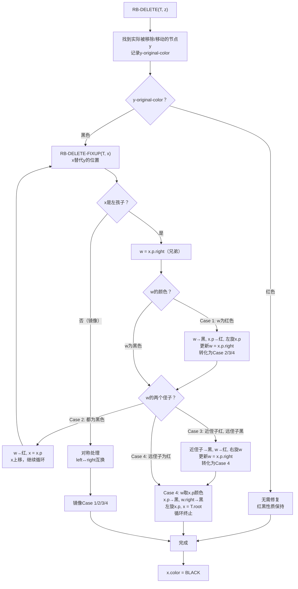
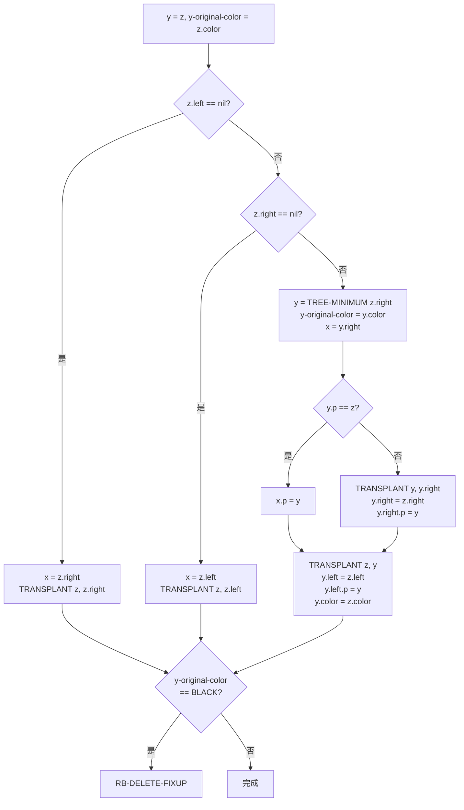
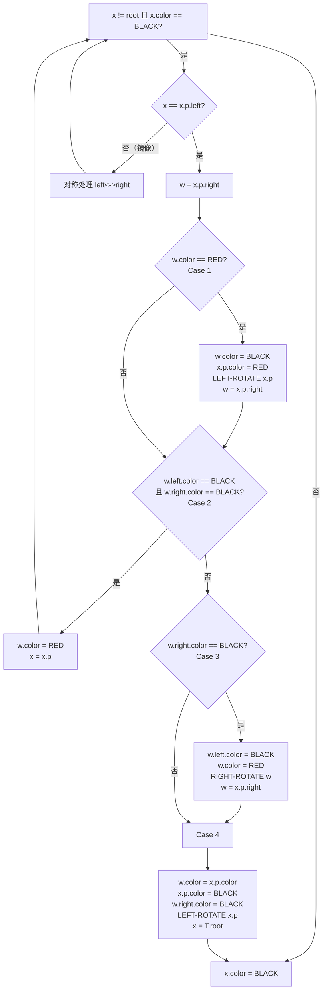

## 相关笔记

> [!abstract] 概览
> 本节介绍如何从红黑树中删除一个节点，这是红黑树中**最复杂的操作**。核心难点在于：当被移除或被移动的节点 `y` 为**黑色**时，会导致某些路径上的黑色节点数减少，违反红黑性质5。算法引入**"额外黑色"（extra black）**概念，将问题节点 `x` 视为带有"双重黑色"，然后通过 `RB-DELETE-FIXUP` 的**4种情况（及其镜像）**，利用变色与旋转将额外黑色逐步上移，直到遇到红色节点（吸收）或根节点（丢弃），恢复所有红黑性质。总时间复杂度为 $O(\lg n)$，最多仅需**3次旋转**。
>
> **前置依赖：** [[13.1 红黑树的性质]]、[[13.2 旋转]]、[[13.3 插入]]
>
> **后续关联：** 第14章 数据结构的扩张

---

## 知识结构总览



---

## 核心思想

> [!tip] 删除的核心策略
> 红黑树删除分为三个阶段：**（1）找到实际被移除的节点**——如果 `z` 有两个非叶子孩子，则用后继 `y` 替换 `z`（`y` 最多只有一个非叶子孩子）；**（2）用 `y` 的唯一孩子 `x` 替换 `y`**，并记录 `y` 的原始颜色；**（3）如果 `y` 为黑色**，则将 `x` 视为带有**"额外黑色"**，调用 `RB-DELETE-FIXUP` 修复。修复的核心思想是将额外黑色沿树**向上传播**，直到遇到红色节点（可以吸收额外黑色）或根节点（可以丢弃额外黑色）。

### RB-TRANSPLANT —— 伪代码

```
RB-TRANSPLANT(T, u, v)
1  if u.p == T.nil
2     T.root = v
3  elseif u == u.p.left
4     u.p.left = v
5  else u.p.right = v
6  v.p = u.p
```

**逐行解读：**

- **第1-5行：** 与第12章的 `TRANSPLANT` 逻辑完全一致，用子树 `v` 替换子树 `u` 在其父节点中的位置。
- **第6行：** 设置 `v` 的父指针指向 `u` 的父节点。**关键区别：** 即使 `v` 是哨兵 `T.nil`，也要设置 `T.nil.p`。这在删除操作中至关重要——当 `y` 的孩子 `x` 为 `T.nil` 时，后续修复需要通过 `x.p` 找到 `x` 的兄弟节点。

### RB-DELETE —— 伪代码

> [!tip] 算法执行流程
> 1. 初始化 y = z，记录 **y 的原始颜色**
> 2. **若 z 的左孩子为 nil**：x = z.right，用 z.right 替换 z
> 3. **若 z 的右孩子为 nil**：x = z.left，用 z.left 替换 z
> 4. **若 z 有两个非叶子孩子**：y = TREE-MINIMUM(z.right)，记录 y 的原始颜色，x = y.right
> 5. 若 y 不是 z 的直接右孩子：先将 y 从原位置移出，再将 z 的右子树接到 y
> 6. 用 y 替换 z，将 z 的左子树接到 y，y 着为 z 的颜色
> 7. **若 y-original-color 为黑色**：调用 **RB-DELETE-FIXUP** 修复



```
RB-DELETE(T, z)
1  y = z
2  y-original-color = y.color
3  if z.left == T.nil
4     x = z.right
5     RB-TRANSPLANT(T, z, z.right)
6  elseif z.right == T.nil
7     x = z.left
8     RB-TRANSPLANT(T, z, z.left)
9  else y = TREE-MINIMUM(z.right)
10    y-original-color = y.color
11    x = y.right
12    if y.p == z
13       x.p = y            // 当x为T.nil时需要设置
14    else
15       RB-TRANSPLANT(T, y, y.right)
16       y.right = z.right
17       y.right.p = y
18    RB-TRANSPLANT(T, z, y)
19    y.left = z.left
20    y.left.p = y
21    y.color = z.color
22 if y-original-color == BLACK
23    RB-DELETE-FIXUP(T, x)
```

**逐行解读：**

- **第1-2行：** 初始化 `y` 为要删除的节点 `z`，记录其原始颜色。`y` 是**实际被移出树的节点**（或实际移动位置的节点）。
- **第3-8行：** 如果 `z` 最多有一个非叶子孩子，则直接用该孩子替换 `z`。`y = z`，`x` 是替代 `z` 的节点（可能为 `T.nil`）。
- **第9-11行：** 如果 `z` 有两个非叶子孩子，则找到 `z` 的**后继** `y = TREE-MINIMUM(z.right)`。`y` 一定没有左孩子（因为是最小值），所以 `x = y.right`（可能为 `T.nil`）。
- **第12-13行：** 如果 `y` 的父节点恰好是 `z`（即 `y` 是 `z` 的直接右孩子），则只需设置 `x.p = y`。这一步在 `x` 为 `T.nil` 时尤其重要——确保 `T.nil.p` 指向正确的位置。
- **第14-17行：** 如果 `y` 不是 `z` 的直接右孩子，则先将 `y` 从其原位置移出（用 `y.right` 替换 `y`），然后将 `z` 的右子树接到 `y` 上。
- **第18-21行：** 用 `y` 替换 `z`，将 `z` 的左子树接到 `y` 上，并将 `y` 着为 `z` 的颜色。**注意：** `y` 移动到了 `z` 的位置，但保持了 `z` 的颜色，所以以 `y` 为根的子树的黑高度不变。
- **第22-23行：** 如果 `y` 的原始颜色是黑色，则移除（或移动）`y` 导致某条路径上少了一个黑色节点，需要调用修复过程。`x` 是替代 `y` 的节点，也是修复的起点。

### RB-DELETE-FIXUP —— 伪代码

> [!tip] 算法执行流程
> 1. **while 循环**：当 x 不是根且 x 为黑色时（x 带有额外黑色），进入修复
> 2. 判断 x 是父节点的左孩子还是右孩子（以左孩子为例，右孩子为镜像）
> 3. 取兄弟节点 w = x.p.right
> 4. **Case 1（w 为红色）**：w 变黑，父变红，左旋父，更新 w，转化为 Case 2/3/4
> 5. **Case 2（w 为黑色，两个侄子都为黑色）**：w 变红，x 上移至父节点，继续循环
> 6. **Case 3（w 为黑色，近侄子红，远侄子黑）**：近侄子变黑，w 变红，右旋 w，更新 w，转化为 Case 4
> 7. **Case 4（w 为黑色，远侄子红）**：w 取父颜色，父变黑，远侄子变黑，左旋父，x = 根，循环终止
> 8. 循环结束后，将 **x 着为黑色**



```
RB-DELETE-FIXUP(T, x)
1  while x ≠ T.root and x.color == BLACK
2     if x == x.p.left
3        w = x.p.right           // w是x的兄弟
4        if w.color == RED       // Case 1
5           w.color = BLACK      // (a) 兄弟变黑
6           x.p.color = RED      // (b) 父节点变红
7           LEFT-ROTATE(T, x.p)  // (c) 左旋父节点
8           w = x.p.right        // (d) 更新兄弟
9        if w.left.color == BLACK and w.right.color == BLACK  // Case 2
10          w.color = RED        // (a) 兄弟变红
11          x = x.p              // (b) x上移至父节点
12       else
13          if w.right.color == BLACK  // Case 3
14             w.left.color = BLACK    // (a) 近侄子变黑
15             w.color = RED           // (b) 兄弟变红
16             RIGHT-ROTATE(T, w)      // (c) 右旋兄弟
17             w = x.p.right           // (d) 更新兄弟
18          // Case 4
19          w.color = x.p.color       // (a) 兄弟取父节点颜色
20          x.p.color = BLACK         // (b) 父节点变黑
21          w.right.color = BLACK     // (c) 远侄子变黑
22          LEFT-ROTATE(T, x.p)       // (d) 左旋父节点
23          x = T.root                // (e) 终止循环
24    else (same as then clause
          with "right" and "left" exchanged)
25 x.color = BLACK
```

**逐行解读：**

- **第1行：** 循环条件——`x` 不是根节点且 `x` 为黑色。如果 `x` 为红色，第25行直接将其着为黑色，吸收额外黑色，修复完成。如果 `x` 是根节点，额外黑色直接丢弃。
- **第2行：** 判断 `x` 是父节点的左孩子还是右孩子。第3-23行处理左孩子情况，第24行处理镜像。
- **第3行：** `w` 指向 `x` 的**兄弟节点**（`x.p` 的另一个孩子）。兄弟的颜色和其孩子的颜色决定了进入哪种情况。
- **第4-8行（Case 1）：** 兄弟 `w` 为红色。将 `w` 变黑、`x.p` 变红，左旋 `x.p`，然后更新 `w`。**Case 1 本身不修复违反**，而是将红色兄弟转化为黑色兄弟（新 `w` 为原来的 `w.left`），从而转化为 Case 2/3/4。
- **第9-11行（Case 2）：** 兄弟 `w` 为黑色，且 `w` 的两个孩子都为黑色。将 `w` 变红，然后将 `x` 上移至 `x.p`。**效果：** `x` 和 `w` 各"失去"一个黑色，但 `x.p` 所在路径的黑色数不变（因为 `w` 也少了一个），而其他路径通过 `w` 的黑色减少得到补偿。额外黑色现在在 `x.p` 上。
- **第13-17行（Case 3）：** 兄弟 `w` 为黑色，`w` 的近侄子（`w.left`）为红色，远侄子（`w.right`）为黑色。将近侄子变黑、`w` 变红，右旋 `w`，更新 `w`。**Case 3 本身不修复违反**，而是将远侄子变为红色，转化为 Case 4。
- **第19-23行（Case 4）：** 兄弟 `w` 为黑色，远侄子（`w.right`）为红色。`w` 取 `x.p` 的颜色，`x.p` 变黑，远侄子变黑，左旋 `x.p`，令 `x = T.root` 终止循环。**效果：** 左旋后，原来通过 `x.p` 的路径上少了一个黑色（`x.p` 变黑补偿），原来通过 `w` 的路径上黑色数不变（`w` 取了 `x.p` 的颜色，远侄子变黑补偿旋转带来的变化）。额外黑色被完全消除。
- **第25行：** 如果循环因为 `x` 为红色而终止（或 `x` 到达根节点），将 `x` 着为黑色。如果是红色，则吸收额外黑色（红+额外黑=黑）；如果是根节点，则丢弃额外黑色（根可以"承受"多一个黑色）。

### "额外黑色"概念详解

> [!def] 额外黑色（Extra Black）
> 当黑色节点 `y` 被移除（或移动）时，`y` 所在路径上的黑色节点数减少了1。为了在修复过程中保持性质5（所有路径黑高度相同），我们将 `y` 的替代节点 `x` 视为带有**"额外黑色"**。
>
> **直观理解：** 想象 `x` 身上叠加了两个黑色——一个是 `x` 自身的颜色（可能为红或黑），另一个是从 `y` 传递下来的"额外黑色"。因此 `x` 的"有效颜色"可能是：
> - **"红+黑"（red-black）：** 如果 `x` 本身为红色，则红+额外黑 = 黑色。直接将 `x` 着为黑色即可修复（第25行）。
> - **"黑+黑"（double black）：** 如果 `x` 本身为黑色，则黑+额外黑 = 双重黑色。需要通过 Case 1-4 将额外黑色向上传播。
>
> **传播终止条件：**
> 1. `x` 到达红色节点 → 将红色变为黑色，吸收额外黑色。
> 2. `x` 到达根节点 → 根节点可以承受额外黑色（直接丢弃），因为根到所有叶子的路径都经过根，额外黑色对每条路径的影响相同。
>
> **类比：** 想象额外黑色是一个"债务"。删除黑色节点就像产生了一笔黑色债务，需要逐层向上"偿还"。如果遇到红色节点（"有钱"），可以直接还清；如果到达根（"银行"），债务自动消除。

### 四种情况详解

> [!def] Case 1：兄弟 w 为红色
> **条件：** `x` 的兄弟 `w` 为红色（此时 `x.p` 一定为黑色，`w` 的两个孩子一定为黑色）。
>
> **操作：** `w` 变黑，`x.p` 变红，`LEFT-ROTATE(T, x.p)`，更新 `w = x.p.right`。
>
> **效果：** 旋转后 `x` 的新兄弟（原 `w` 的左孩子）为黑色，且 `x.p` 变为红色。**Case 1 不改变任何路径的黑高度**，但将情况转化为 Case 2/3/4（因为新兄弟为黑色）。
>
> **关键观察：** Case 1 是**转换步骤**，类似于插入修复中的 Case 2。它为后续的 Case 2/3/4 创造前提条件（兄弟为黑色）。

> [!def] Case 2：兄弟 w 为黑色，两个侄子都为黑色
> **条件：** `w` 为黑色，`w.left` 和 `w.right` 都为黑色。
>
> **操作：** `w` 变红，`x = x.p`。
>
> **效果：** `x` 和 `w` 各失去一个黑色，但 `x.p` 的黑高度不变（因为 `x` 和 `w` 对称地各减一）。额外黑色从 `x` 传递到 `x.p`。如果 `x.p` 原为红色，循环终止（`x.p` 吸收额外黑色）；如果 `x.p` 原为黑色，继续循环。
>
> **关键观察：** Case 2 是**传播步骤**，将额外黑色上移一层。

> [!def] Case 3：兄弟 w 为黑色，近侄子为红色，远侄子为黑色
> **条件：** `w` 为黑色，`w.left`（近侄子）为红色，`w.right`（远侄子）为黑色。
>
> **操作：** `w.left` 变黑，`w` 变红，`RIGHT-ROTATE(T, w)`，更新 `w = x.p.right`。
>
> **效果：** 旋转后新的 `w`（原 `w.left`）为黑色，且新的 `w.right`（原 `w`）为红色。**转化为 Case 4**。
>
> **关键观察：** Case 3 是**转换步骤**，将远侄子变为红色，为 Case 4 创造条件。

> [!def] Case 4：兄弟 w 为黑色，远侄子为红色
> **条件：** `w` 为黑色，`w.right`（远侄子）为红色。
>
> **操作：** `w` 取 `x.p` 的颜色，`x.p` 变黑，`w.right` 变黑，`LEFT-ROTATE(T, x.p)`，`x = T.root`。
>
> **效果：** 左旋后，`x` 所在路径增加一个黑色（`x.p` 变黑），`w` 所在路径的黑色数不变（`w` 取了 `x.p` 的颜色，`w.right` 变黑补偿旋转）。**额外黑色被完全消除，循环终止。**
>
> **关键观察：** Case 4 是**真正的修复步骤**。通过一次旋转和变色，将额外黑色"转移"到 `x.p` 上（通过将 `x.p` 变黑实现），同时保持所有路径的黑高度一致。

### 循环不变式

> [!def] RB-DELETE-FIXUP 的循环不变式
> 在 `while` 循环每次迭代开始时：
> 1. **节点 `x` 指向一个带有"额外黑色"的节点。**
> 2. 从 `x` 出发（不经过 `x`）到其子树中任何叶子节点的路径上，**黑高度不变**（与删除前相同）。
> 3. 从 `x.p` 出发经过 `x` 到叶子节点的路径上的黑高度，比从 `x.p` 出发**不经过 `x`** 到叶子节点的路径上的黑高度**少1**（即额外黑色补偿了这1的差距）。
> 4. 性质1（每个节点非红即黑）、性质3（叶子为黑色）**始终成立**。

> **【删除修复不变式（额外黑色逐层上移保持黑高度关系）】**
>
> **初始化：** `x` 替代了被删除的黑色节点 `y`，`x` 带有额外黑色。经过 `x` 的路径少了一个黑色，不经过 `x` 的路径不变。

> **【不变式维持（Case 1转换/Case 2上推/Case 3转换/Case 4消除）】**
>
> **维持：** Case 1 转化为 Case 2/3/4，不改变黑高度关系；Case 2 将额外黑色上移，维持不变式（差距1上移到 `x.p`）；Case 3 转化为 Case 4，不改变黑高度关系；Case 4 消除差距，终止循环。

> **【不变式终止（x为红则吸收额外黑色，x为根则丢弃）】**
>
> **终止：** 如果 `x` 为红色，第25行将其着为黑色，吸收额外黑色，所有路径黑高度一致；如果 `x` 为根，额外黑色被丢弃，根到所有叶子的路径都经过根，效果一致。

### 时间复杂度分析

> [!def] RB-DELETE 的时间复杂度
> - **查找后继+替换部分（第1-21行）：** $O(\lg n)$，`TREE-MINIMUM` 最多下降 $O(\lg n)$ 层。
> - **修复部分（RB-DELETE-FIXUP）：**
>   - **Case 1** 最多执行1次（执行后转化为 Case 2/3/4，不会再次出现 Case 1）。
>   - **Case 2** 每次将 `x` 上移1层，最多执行 $O(\lg n)$ 次。
>   - **Case 3** 最多执行1次（执行后转化为 Case 4）。
>   - **Case 4** 最多执行1次（执行后循环终止）。
>   - **总旋转次数：** Case 1 一次 + Case 3 一次 + Case 4 一次 = **最多3次旋转**。
> - **总时间复杂度：** $O(\lg n)$。

---

## 补充理解与拓展

> [!info] CLRS第4版删除算法的改进
> 第3版和第4版在红黑树删除的实现上有重要区别：
>
> - **第3版方法（"复制key值"）：** 当 `z` 有两个非叶子孩子时，找到后继 `y`，将 `y.key` 复制到 `z` 中，然后删除 `y`。这种方法简单，但存在**外部指针失效问题**——如果有外部引用指向节点 `z`，复制key值后 `z` 的地址不变但内容变了，外部引用不会感知到变化。
>
> - **第4版方法（"实际替换节点"）：** 使用 `RB-TRANSPLANT` **实际将节点 `y` 从树中移出并放到 `z` 的位置**，而不是复制key值。`y` 物理上移动到了 `z` 的位置，保持了 `z` 的颜色。这种方法解决了外部指针失效问题，因为 `z` 的地址确实被 `y` 替代了。[^1]
>
> 这一改进体现了算法设计中对**工程实践**的考量，是第4版的重要更新之一。

> [!info] 红黑树删除的工程实践与调试
> 红黑树删除是平衡树操作中**调试难度最大**的操作之一：
>
> - **Linux内核** `rb_erase()`：内核红黑树的删除实现，用于 CFS 调度器中进程退出时从运行队列移除、虚拟内存区域释放等场景。内核开发者经常使用 `CONFIG_RBTREE_TEST` 选项进行红黑树正确性测试。
>
> - **状态空间巨大：** 删除修复有4种情况（+4种镜像），且每种情况的发生取决于兄弟、侄子等多层节点的颜色组合。手动验证所有情况组合非常困难。
>
> - **可视化调试工具：** 实践中常借助可视化工具验证删除操作的正确性，如 USFCA 的红黑树可视化（https://www.cs.usfca.edu/~galles/visualization/RedBlack.html）和 Linux 内核的 `rbtree` 测试模块。[^2]
>
> - **常见Bug模式：** 忘记处理 `T.nil.p` 的设置（第13行）、Case 1 后忘记更新 `w`（第8行）、镜像情况中 left/right 互换不完整等。

[^1]: Cormen, T. H., Leiserson, C. E., Rivest, R. L., & Stein, C. (2022). *Introduction to Algorithms*, 4th Ed. MIT Press, Ch 13.
[^2]: Corbet, J., Rubini, A., & Kroah-Hartman, G. (2005). *Linux Device Drivers*, 3rd Ed. O'Reilly.

---

## 易混淆点与辨析

> [!warning] "额外黑色"是节点的一个实际属性吗？
> **错误理解：** "额外黑色"是节点的一个新字段，类似于 color 属性，存储在节点中。
>
> **正确理解：** "额外黑色"**不是节点的实际属性**，它只是一个**概念工具**（conceptual tool），用于在分析和推理删除修复过程时追踪"黑色债务"的位置。在实际代码中，并不存在 "double black" 或 "extra black" 这样的颜色值。修复过程通过**变色**和**旋转**操作来消除这个"债务"，最终将 `x` 着为黑色（如果 `x` 为红色）或将额外黑色传播到根（丢弃）。整个修复逻辑完全通过标准的颜色赋值（RED/BLACK）和旋转操作实现。

> [!warning] 为什么删除修复最多需要3次旋转，而插入修复最多只需2次？
> **错误理解：** 删除比插入复杂，所以旋转次数更多，这只是直觉上的理解。
>
> **正确理解：** 旋转次数差异的根本原因在于**情况的结构不同**：
> - **插入修复**只有3种情况，其中 Case 2 是转换、Case 3 是修复，且 Case 3 执行后循环立即终止。因此最多 Case 2 一次 + Case 3 一次 = **2次旋转**。
> - **删除修复**有4种情况，其中 Case 1 是转换（1次旋转）、Case 3 是转换（1次旋转）、Case 4 是修复（1次旋转）。而且 Case 1、Case 3、Case 4 在一次完整的修复过程中**可能各执行一次**（Case 1 -> Case 2 -> Case 3 -> Case 4 的路径），因此最多 **1+1+1=3次旋转**。
>
> 更深层的原因是：删除修复需要处理的**状态空间更大**——不仅要考虑兄弟的颜色，还要考虑**两个侄子**的颜色组合（插入修复只需考虑叔叔的颜色），因此需要更多的情况和旋转来覆盖所有可能性。

---

## 习题精选

| 题号 | 题目摘要 | 难度 | 核心考点 |
|:---:|---------|:---:|---------|
| 13.4-1 | 在图13-4的红黑树中依次删除1、11、17、8，画出结果 | ★★ | 删除过程+修复模拟 |
| 13.4-2 | 证明RB-DELETE-FIXUP终止时红黑性质全部满足 | ★★★ | 循环不变式终止条件 |
| 13.4-3 | 证明RB-DELETE-FIXUP的while循环最多执行O(lg n)次 | ★★★ | Case 2上移分析 |
| 13.4-4 | 证明删除后最多只需3次旋转 | ★★★ | Case 1/3/4旋转分析 |
| 13.4-5 | 分析从红黑树中删除红色节点的效果 | ★★ | 红色删除无需修复 |
| 13.4-6 | 给出RB-DELETE-FIXUP的递归版本 | ★★★★ | 迭代转递归 |
| 13.4-7 | 比较第3版和第4版删除算法的区别 | ★★★ | 节点替换 vs key复制 |

> [!faq]- 13.4-1 思路提示
> 按顺序删除每个节点，每次删除后检查 y-original-color：
> 1. **删除1：** 节点1为红色叶子，直接删除，无需修复。
> 2. **删除11：** 节点11为红色，有一个红色孩子14。用14替换11，14保持红色。y-original-color为红色，无需修复。
> 3. **删除17：** 节点17为黑色叶子。删除后 x = T.nil，y-original-color = BLACK，**需要修复**。x 的兄弟为红色 → Case 1 → 转化为 Case 2/3/4。
> 4. **删除8：** 需要找到后继，执行完整的 RB-DELETE 流程。
>
> **完整答案：** 建议在纸上逐步绘制每一步的树状态，特别注意每次修复后节点颜色的变化。使用可视化工具辅助验证。

> [!faq]- 13.4-7 思路提示
> **第3版方法：**
> - 当 `z` 有两个非叶子孩子时，找到后继 `y`，将 `y.key`（以及 `y` 的卫星数据）复制到 `z` 中。
> - 然后删除原来的 `y` 节点（`y` 最多有一个非叶子孩子）。
> - 优点：实现简单，不需要移动节点指针。
> - 缺点：如果有外部引用指向 `z`，复制key后 `z` 的地址不变但内容变了，外部引用指向的仍然是原来的 `z` 节点，但其内容已被覆盖。
>
> **第4版方法：**
> - 使用 `RB-TRANSPLANT` 实际将 `y` 从树中移出，放到 `z` 的位置。
> - `y` 物理上替代了 `z`，保持了 `z` 的颜色。
> - 优点：解决了外部指针失效问题——`y` 确实取代了 `z` 的位置，任何指向 `z` 的引用都能正确感知到变化。
> - 缺点：实现稍复杂，需要更多指针操作。
>
> **核心区别：** 第3版是"逻辑替换"（复制数据），第4版是"物理替换"（移动节点）。

---

## 视频学习指南

| 资源 | 讲者/来源 | 时长 | 覆盖内容 | 推荐度 |
|------|----------|:---:|---------|:---:|
| MIT 6.006 Lecture 10 | Erik Demaine | ~80min | 红黑树删除、额外黑色、四种情况 | ★★★★★ |
| CLRS 红黑树删除可视化 | USFCA | 交互式 | 动态演示删除+修复过程 | ★★★★☆ |
| Abdul Bari 红黑树删除 | YouTube | ~25min | 直观的Case 1/2/3/4动画讲解 | ★★★★☆ |
| 算法导论第13章精读 | 国内MOOC | ~60min | 中文讲解，含额外黑色概念详解 | ★★★☆☆ |

---

## 教材原文

> [!quote] 教材原文（中文翻译）
> "从红黑树中删除一个节点要比插入一个节点复杂得多。与插入操作一样，我们先删除一个节点，然后再修复红黑性质。与插入操作不同的是，删除操作可能需要调用修复过程 Θ(lg n) 次，而不仅仅是常数次。尽管如此，整个删除操作仍然可以在 O(lg n) 时间内完成。"
>
> "RB-DELETE 过程首先确定要实际从树中移除的节点 y。如果 z 的孩子少于两个，则 y 就是 z 本身。如果 z 有两个孩子，则 y 是 z 的后继，且 y 将被移动到 z 的位置。在整个过程中，y 是从树中移除或被移动的节点。"
>
> "当节点 y 被移除或被移动时，y 的原始颜色被保存。如果 y 的颜色是黑色，那么 RB-DELETE-FIXUP 必须被调用来恢复红黑性质，因为移除或移动一个黑色节点可能会违反性质4或性质5，甚至两者同时违反。"
>
> "修复过程的基本思想是：将节点 x 视为带有额外黑色，使得包含 x 的路径上的黑色节点数不变。然后通过一系列的变色和旋转操作，将这个额外黑色沿树向上移动，直到遇到一个红色节点（将其变为黑色来吸收额外黑色）或到达根节点（直接丢弃额外黑色）。"

---

## 参见Wiki

- [[第13章_红黑树/13.1 红黑树的性质]]：红黑树五条性质的详细定义
- [[第13章_红黑树/13.2 旋转]]：LEFT-ROTATE 和 RIGHT-ROTATE 的实现与分析
- [[第13章_红黑树/13.3 插入]]：红黑树插入操作及其修复过程（对比学习）

#学习/算法导论/第13章-红黑树 #学习/算法导论/红黑树/删除
