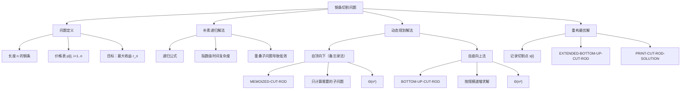
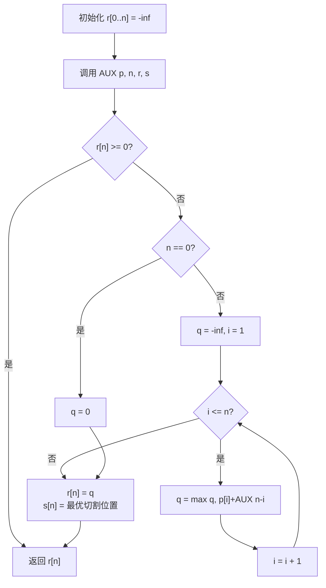
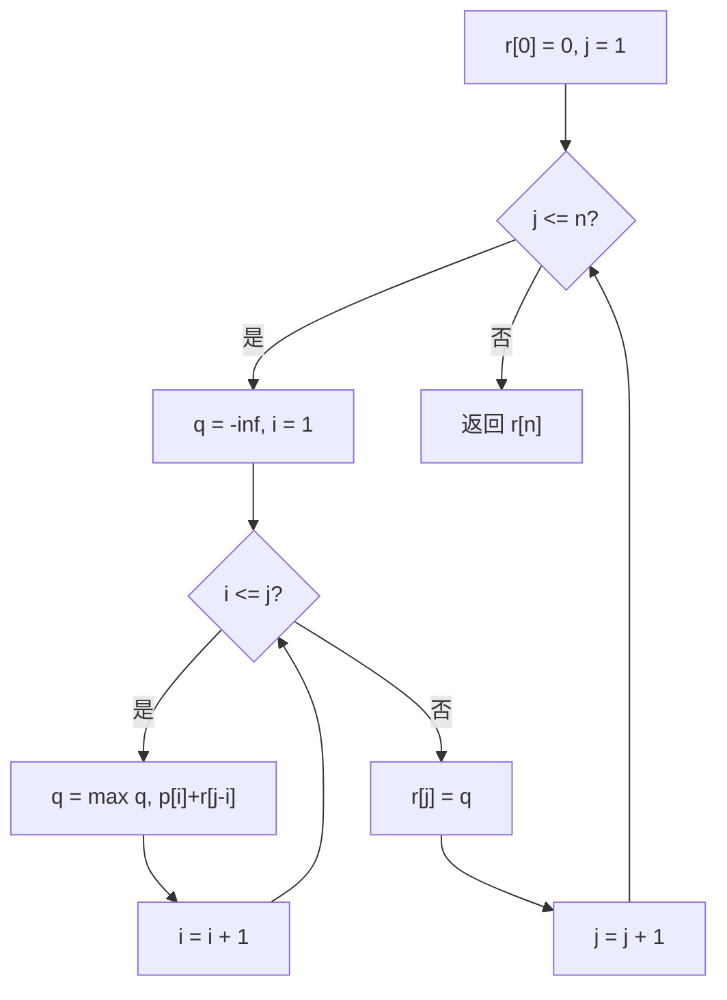
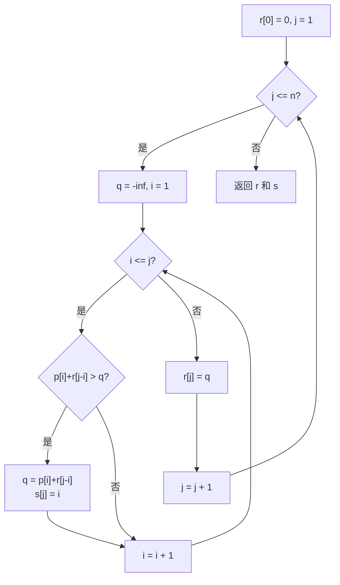

## 相关笔记
- 前置笔记：[[第13章_红黑树-章节汇总]]
- 章节汇总：[[第14章_动态规划-章节汇总]]
- 后续笔记：[[14.2 矩阵链乘法]]

> [!abstract] 概览
> 钢条切割问题是动态规划的经典入门案例。给定一根长度为 $n$ 的钢条和一个价格表 $p[i]$，目标是找到一种切割方案，使得销售收益最大化。本节通过==自顶向下（备忘录法）==和==自底向上==两种方法，展示动态规划的==最优子结构==和==重叠子问题==两大核心性质，并给出 $\Theta(n^2)$ 的时间复杂度分析。
>
> **核心要点：**
> - 最优子结构：最优解包含子问题的最优解
> - 重叠子问题：递归过程中反复求解相同子问题
> - 备忘录法：自顶向下 + 缓存已计算结果
> - 自底向上法：按规模从小到大依次求解
> - 时间复杂度：$\Theta(n^2)$

---

## 知识结构总览



---

## 核心思想

> [!tip] 核心思路
> 钢条切割问题的核心在于识别**最优子结构**性质：长度为 $n$ 的钢条的最优切割方案，必然包含长度为 $n-i$ 的子钢条的最优切割方案。这意味着我们可以将大问题分解为小问题，而小问题的最优解组合起来就是大问题的最优解。同时，由于不同切割方案会反复需要相同长度的子问题解，这就产生了**重叠子问题**。动态规划通过**缓存子问题的解**（备忘录法）或**按规模从小到大依次求解**（自底向上法），将指数级的递归搜索压缩到多项式时间。关键公式为 $r_n = \max_{1 \leq i \leq n}(p_i + r_{n-i})$，其中 $r_0 = 0$ 作为递归基。这一公式告诉我们：对于长度为 $n$ 的钢条，要么不切割直接卖 $p_n$，要么在位置 $i$ 处切一刀，左段卖 $p_i$，右段求最优收益 $r_{n-i}$，遍历所有可能的切割位置取最大值。

### 自顶向下（备忘录法）—— 伪代码

> [!tip] 算法执行流程
> 1. 初始化备忘录数组 r[0..n] 全部为负无穷
> 2. 对每个长度 i 从 1 到 n：调用辅助函数 MEMOIZED-CUT-ROD-AUX
> 3. **辅助函数**：若 r[n] 已计算（>= 0），直接返回
> 4. **基准情形**：n == 0 时返回 0
> 5. **递归情形**：遍历每个切割位置 i 从 1 到 n，计算 max(p[i] + 辅助函数(n-i))
> 6. 将最优收益存入 r[n]，记录最优切割位置 s[n]



```
MEMOIZED-CUT-ROD(p, n)
1  let r[0..n] and s[0..n] be new arrays
2  for i = 0 to n
3     r[i] = -∞
4  return MEMOIZED-CUT-ROD-AUX(p, n, r, s)

MEMOIZED-CUT-ROD-AUX(p, n, r, s)
1  if r[n] ≥ 0
2     return r[n]
3  if n == 0
4     q = 0
5  else q = -∞
6     for i = 1 to n
7        q = max(q, p[i] + MEMOIZED-CUT-ROD-AUX(p, n-i, r, s))
8        s[n] = i  // 记录最优切割长度
9  r[n] = q
10 return q
```

### 自底向上法 —— 伪代码

> [!tip] 算法执行流程
> 1. 初始化 r[0] = 0
> 2. **外层循环**：对每个长度 j 从 1 到 n
> 3. 初始化 q = 负无穷
> 4. **内层循环**：对每个切割位置 i 从 1 到 j
> 5. 计算 q = max(q, p[i] + r[j-i])（左段卖 p[i]，右段最优收益 r[j-i]）
> 6. 将最优收益存入 r[j]
> 7. 返回 r[n]



```
BOTTOM-UP-CUT-ROD(p, n)
1  let r[0..n] be new array
2  r[0] = 0
3  for j = 1 to n
4     q = -∞
5     for i = 1 to j
6        q = max(q, p[i] + r[j-i])
7     r[j] = q
8  return r[j]
```

### 扩展版自底向上（含切割方案重构）—— 伪代码

> [!tip] 算法执行流程
> 1. 初始化 r[0] = 0
> 2. **外层循环**：对每个长度 j 从 1 到 n
> 3. **内层循环**：对每个切割位置 i 从 1 到 j
> 4. 若 p[i] + r[j-i] > q，更新 q 和 **记录最优切割位置 s[j] = i**
> 5. 将最优收益存入 r[j]
> 6. 返回 r 和 s（s 用于后续重构切割方案）



```
EXTENDED-BOTTOM-UP-CUT-ROD(p, n)
1  let r[0..n] and s[0..n] be new arrays
2  r[0] = 0
3  for j = 1 to n
4     q = -∞
5     for i = 1 to j
6        if q < p[i] + r[j-i]
7           q = p[i] + r[j-i]
8           s[j] = i
9     r[j] = q
10 return r and s

PRINT-CUT-ROD-SOLUTION(p, n)
1  (r, s) = EXTENDED-BOTTOM-UP-CUT-ROD(p, n)
2  while n > 0
3     print s[n]
4     n = n - s[n]
```

> [!def] 最优子结构定义
> 一个问题具有**最优子结构**性质，如果该问题的最优解可以由其子问题的最优解高效地构造出来。对于钢条切割问题，设 $r_n$ 为长度 $n$ 的钢条的最大收益，则：
>
> $$r_n = \max_{1 \leq i \leq n}(p_i + r_{n-i})$$
>
> 其中 $r_0 = 0$。该公式表明，长度为 $n$ 的最优方案要么不切割（收益为 $p_n$），要么在某个位置 $i$ 切割后，左段直接出售获得 $p_i$，右段以最优方式切割获得 $r_{n-i}$。

> [!def] 重叠子问题定义
> 当一个递归算法不断调用相同的子问题时，我们称该问题具有**重叠子问题**性质。在钢条切割的朴素递归中，计算 $r_n$ 需要计算 $r_{n-1}, r_{n-2}, \ldots, r_1$，而计算 $r_{n-1}$ 又需要计算 $r_{n-2}, r_{n-3}, \ldots, r_1$，子问题被反复求解，导致时间复杂度呈指数增长。动态规划通过存储已求解的子问题结果来消除这种冗余。

### 循环不变式与正确性证明

> [!def] 循环不变式
> **自底向上法 `BOTTOM-UP-CUT-ROD` 的外层循环不变式：**
>
> 在第 $j$ 次外层循环迭代开始时，$r[i]$ 存储了长度为 $i$（$0 \leq i < j$）的钢条的最大收益。
>
> **【初始化（j=1 时 r[0]=0 已正确设置）】** 当 $j = 1$ 时，$r[0] = 0$ 已被正确设置。对于 $0 \leq i < 1$，即 $i = 0$，$r[0] = 0$ 是长度为 0 的钢条的最大收益（不切割、不售卖），不变式成立。
>
> **【维护（j-i < j 保证 r[j-i] 已正确计算）】** 假设在第 $j$ 次迭代开始时不变式成立，即 $r[0..j-1]$ 都已存储了正确的最大收益。内层循环遍历 $i = 1$ 到 $j$，对每个 $i$ 计算 $p[i] + r[j-i]$。由于 $j-i < j$，$r[j-i]$ 已经是正确的最优收益（由不变式保证）。因此 $q = \max_{1 \leq i \leq j}(p[i] + r[j-i])$ 就是 $r[j]$ 的正确值，赋值后不变式对 $j+1$ 成立。
>
> **【终止（j=n+1 时 r[0..n] 全部正确）】** 当 $j = n+1$ 时循环结束。此时 $r[i]$ 对所有 $0 \leq i \leq n$ 都存储了正确的最大收益，特别地 $r[n]$ 就是所求答案。 $\blacksquare$

### 时间复杂度分析

> [!def] 时间复杂度
> **自底向上法 `BOTTOM-UP-CUT-ROD`：** 外层循环执行 $n$ 次（$j = 1$ 到 $n$），内层循环在第 $j$ 次外层迭代中执行 $j$ 次（$i = 1$ 到 $j$）。总操作次数为 $\sum_{j=1}^{n} j = \frac{n(n+1)}{2} = \Theta(n^2)$。
>
> **自顶向下备忘录法 `MEMOIZED-CUT-ROD`：** 每个子问题 $r[i]$（$i = 0, 1, \ldots, n$）最多被求解一次。求解 $r[i]$ 需要遍历 $i$ 个切割位置，因此求解 $r[i]$ 的时间为 $\Theta(i)$。总时间为 $\sum_{i=0}^{n} \Theta(i) = \Theta(n^2)$。
>
> **朴素递归（无备忘录）：** 递归调用形成一棵二叉树，最坏情况下调用次数为 $2^n$ 级别，时间复杂度为 $\Theta(2^n)$。

---

## 补充理解与拓展

> [!info] 动态规划的发明历史
> **"动态规划"**这一名称由美国数学家 **Richard Bellman** 于 1950 年代提出。Bellman 在其自传 *Eye of the Hurricane* 中回忆了命名的过程：当时他在兰德公司（RAND Corporation）工作，需要为他的多阶段决策过程研究申请经费。当时的美国国防部长 Charles Erwin Wilson 非常厌恶"研究（research）"一词，认为它听起来像是在浪费纳税人的钱。Bellman 需要一个不会引起反感的名称。他选择了"**dynamic**"（动态的），因为"没有人能反对这个词"，而"**programming**"在当时更多指"规划/调度"而非计算机编程[^1]。
>
> Bellman 的核心贡献在于提出了**最优性原理（Principle of Optimality）**：一个最优策略的任何子策略，对于其子问题的初始状态和终止状态而言，也必须是最优的。这正是钢条切割问题中"最优子结构"的理论基础。
>
> [^1]: Bellman, R. E. (1984). *Eye of the Hurricane: An Autobiography*. World Scientific, pp. 159-164.

> [!info] 备忘录法 vs 自底向上法的工程选择
> 两种方法在渐近时间复杂度上相同（均为 $\Theta(n^2)$），但在实际工程中有不同的权衡：
>
> **备忘录法的优势：** 只计算实际需要的子问题。如果某些子问题不会被用到，备忘录法可以跳过它们。代码结构更接近问题的自然递归定义，可读性更好。
>
> **自底向上法的优势：** 没有递归调用的栈开销，在实际运行中常数因子更小。可以更方便地利用数组的局部性（cache友好），因为访问模式是顺序的。不需要处理递归深度限制的问题。
>
> 在实际工程中，**自底向上法通常是首选**，除非问题规模非常大且只有少量子问题会被实际访问。例如，在竞争编程中，自底向上法几乎总是更快；而在某些交互式场景或子问题空间稀疏的情况下，备忘录法更为合适。

---

## 易混淆点与辨析

> [!warning] "动态规划"中的"programming"不是计算机编程
> ❌ 错误理解：动态规划是一种编程技术，"programming"指的是写代码。
> ✅ 正确理解：在 Bellman 时代，"programming"指的是"规划"或"调度"（源自 mathematical programming，即数学规划/最优化）。动态规划是一种**最优化方法**，其名称与计算机编程无关。

> [!warning] 贪心法 vs 动态规划
> ❌ 错误理解：钢条切割问题可以用贪心法解决——每次选择单位长度价格最高的切割方案即可。
> ✅ 正确理解：贪心法**不能**保证钢条切割问题的最优解。考虑价格表 $p = [1, 5, 8, 9, 10, 17, 17, 20, 24, 30]$（对应长度 1-10），长度为 4 时，贪心法会选择切割为 4 段长度 1（收益 4）或 2 段长度 2（收益 10），但最优解是不切割直接卖长度 4（收益 9）或切割为 2+2（收益 10）。对于长度 10，贪心法可能无法找到最优的切割方案（如 10=2+2+6，收益 22）。贪心法要求**贪心选择性质**，而钢条切割问题不满足这一性质。

> [!warning] 备忘录法不是分治法
> ❌ 错误理解：备忘录法只是分治法的一种优化，本质上还是分治。
> ✅ 正确理解：分治法要求子问题**相互独立**（不重叠），而动态规划专门处理**子问题重叠**的情况。备忘录法通过缓存消除重叠子问题的冗余计算，这使得它在本质上属于动态规划方法，而非分治法。两者的关键区别在于子问题是否重叠。

---

## 习题精选

| 题号 | 题目描述 | 难度 |
|:---:|:---|:---:|
| 14.1-1 | 对价格表 $p = [1, 5, 8, 9, 10, 17, 17, 20, 24, 30]$，求长度 $n=7$ 的最优收益和切割方案 | ⭐ |
| 14.1-2 | 修改 `BOTTOM-UP-CUT-ROD`，使其不仅返回最大收益，还返回切割方案 | ⭐⭐ |
| 14.1-3 | 证明：对任意价格表，存在一个最优切割方案，不切割长度为 $n$ 的钢条，而是将长度 $n$ 的钢条分成两部分 | ⭐⭐ |
| 14.1-4 | 给定一个长度为 $n$ 的钢条，允许对每段切割收取固定费用 $c$，修改算法以考虑此费用 | ⭐⭐ |
| 14.1-5 | 给定钢条长度 $n$ 和价格表 $p$，以及每段钢条的成本 $c$（每段成本相同），求最大利润 | ⭐⭐ |
| 14.1-6 | 给定钢条长度 $n$ 和价格表 $p$，限制最多切割 $k$ 次，求最大收益 | ⭐⭐⭐ |
| 14.1-7 | 给定钢条长度 $n$ 和价格表 $p$，要求每段长度必须是给定集合 $S$ 中的元素，求最大收益 | ⭐⭐⭐ |

> [!faq]- 14.1-1 解答
> 对于价格表 $p = [1, 5, 8, 9, 10, 17, 17, 20, 24, 30]$，长度 $n = 7$：
>
> 使用自底向上法计算：
> - $r[0] = 0$
> - $r[1] = \max(p[1]+r[0]) = 1$
> - $r[2] = \max(p[1]+r[1], p[2]+r[0]) = \max(2, 5) = 5$
> - $r[3] = \max(p[1]+r[2], p[2]+r[1], p[3]+r[0]) = \max(6, 6, 8) = 8$
> - $r[4] = \max(1+8, 5+5, 8+2, 9+0) = \max(9, 10, 10, 9) = 10$
> - $r[5] = \max(1+10, 5+8, 8+5, 9+2, 10+0) = \max(11, 13, 13, 11, 10) = 13$
> - $r[6] = \max(1+13, 5+10, 8+8, 9+5, 10+2, 17+0) = \max(14, 15, 16, 14, 12, 17) = 17$
> - $r[7]$ 的计算：对 $i = 1$ 到 $7$：
>   - $i=1$: $p[1]+r[6] = 1+17 = 18$
>   - $i=2$: $p[2]+r[5] = 5+13 = 18$
>   - $i=3$: $p[3]+r[4] = 8+10 = 18$
>   - $i=4$: $p[4]+r[3] = 9+8 = 17$
>   - $i=5$: $p[5]+r[2] = 10+5 = 15$
>   - $i=6$: $p[6]+r[1] = 17+1 = 18$
>   - $i=7$: $p[7]+r[0] = 17+0 = 17$
>
> **最优收益为 18**，有多种最优切割方案：$7 = 1+6$、$7 = 2+5$、$7 = 3+4$、$7 = 6+1$。

> [!faq]- 14.1-4 解答
> 设每次切割收取固定费用 $c$。修改递归公式为：
>
> $$r_n = \max(p_n,\ \max_{1 \leq i \leq n-1}(p_i + r_{n-i} - c))$$
>
> 注意：不切割时不需要支付费用，所以 $p_n$ 不减 $c$；切割时需要支付一次切割费用 $c$。修改自底向上法：
>
> ```
> BOTTOM-UP-CUT-ROD-WITH-COST(p, n, c)
> 1  let r[0..n] be new array
> 2  r[0] = 0
> 3  for j = 1 to n
> 4     q = p[j]  // 不切割的收益
> 5     for i = 1 to j - 1
> 6        q = max(q, p[i] + r[j-i] - c)
> 7     r[j] = q
> 8  return r[j]
> ```
>
> 时间复杂度仍为 $\Theta(n^2)$。

---

## 视频学习指南

| 资源名称 | 讲者/来源 | 时长 | 链接 | 特点 |
|:---|:---|:---:|:---|:---|
| MIT 6.006 Lecture 11: Dynamic Programming | Erik Demaine | ~75min | [YouTube](https://www.youtube.com/watch?v=OQ5jsbhAv_M) | MIT经典课程，从钢条切割引入DP |
| CLRS 动态规划系列 - 钢条切割 | abdul bari | ~18min | [YouTube](https://www.youtube.com/watch?v=EL3jwJwDfp8) | 直观的表格填充过程演示 |
| 算法导论精讲 - 动态规划 | 王晓东 | ~40min | B站 | 中文讲解，配合教材推导 |
| Dynamic Programming I | CS Dojo | ~25min | [YouTube](https://www.youtube.com/watch?v=vYquumk0nDw) | 从零开始讲解DP思想 |
| 国防科大算法课 - 动态规划 | 国防科技大学 | ~50min | B站 | 中文，包含大量例题 |

---

## 教材原文

> [!quote] CLRS 第4版 14.1节原文
> 钢条切割问题。Serling公司购买长钢条，将其切割为短钢条出售。切割工序本身没有成本。公司管理层希望知道最佳的切割方案。假定我们知道对于 $i = 1, 2, \ldots, n$ 的一段长度为 $i$ 英寸的钢条的价格为 $p_i$。长度为 $n$ 英寸的钢条的价格 $p_n$ 如表14-1所示。
>
> 考虑长度为 $n$ 英寸的钢条，我们可以使用一种**组合优化**方法来找到最佳切割方案。对于 $i = 1, 2, \ldots, n$，设 $r_i$ 为长度为 $i$ 的钢条的最大收益。对于最优切割方案，我们可以将其分解为：要么不切割直接出售（收益为 $p_n$），要么在某处切割后分别对两段求最优收益。因此，最优收益满足递归关系：
>
> $$r_n = \max_{1 \leq i \leq n}(p_i + r_{n-i})$$
>
> 其中 $r_0 = 0$。这种递归关系展示了该问题的**最优子结构**性质。
>
> 如果直接使用递归求解，由于子问题重叠，算法效率极低。动态规划通过两种方法来高效求解：**自顶向下带备忘录**的方法和**自底向上**的方法。两种方法的时间复杂度均为 $\Theta(n^2)$。

---

## 参见Wiki

- [[动态规划的基本概念]]
- [[算法导论/concepts/最优子结构]]
- [[算法导论/concepts/重叠子问题]]
- [[备忘录法]]
- [[自底向上法]]
- [[第14章_动态规划/14.2 矩阵链乘法]]

#学习/算法导论/第14章-动态规划 #学习/算法导论/动态规划/钢条切割
