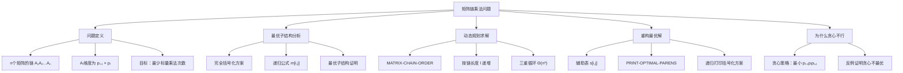
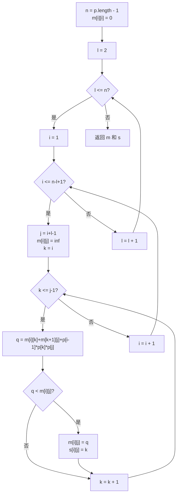

## 相关笔记
- 前置笔记：[[14.1 钢条切割]]、[[第04章_分治策略/第04章_分治策略-章节汇总]]
- 章节汇总：[[第14章_动态规划-章节汇总]]
- 后续笔记：[[14.3 动态规划设计要素]]

> [!abstract] 概览
> 矩阵链乘法问题是动态规划的经典应用之一。给定 $n$ 个矩阵的链 $\langle A_1, A_2, \ldots, A_n \rangle$，其中矩阵 $A_i$ 的维度为 $p_{i-1} \times p_i$，目标是找到一种==完全括号化==方案，使得计算矩阵链乘积所需的==标量乘法次数最少==。本节展示如何利用动态规划的==最优子结构==性质，通过==自底向上==的方法求解，时间复杂度为 $\Theta(n^3)$。
>
> **核心要点：**
> - 矩阵乘法的结合性：不同的括号化方案导致不同的计算代价
> - 最优子结构：最优括号化方案的子链也是最优括号化的
> - 按链长度递增的求解顺序
> - 时间复杂度 $\Theta(n^3)$，空间复杂度 $\Theta(n^2)$
> - 通过辅助表 $s$ 重构最优括号化方案

---

## 知识结构总览



---

## 核心思想

> [!tip] 核心思路
> 矩阵链乘法的核心在于利用**矩阵乘法的结合律**——不同的括号化方案不会改变最终结果，但会显著影响计算代价。两个矩阵 $A$（$p \times q$）和 $B$（$q \times r$）相乘需要 $pqr$ 次标量乘法。对于 $n$ 个矩阵的链，我们需要找到一种括号化方式，使得总标量乘法次数最少。关键洞察是**最优子结构**：如果最优方案在 $A_k$ 和 $A_{k+1}$ 之间分割，那么左子链 $A_i \cdots A_k$ 和右子链 $A_{k+1} \cdots A_j$ 的括号化也必须是最优的。基于此，我们定义 $m[i,j]$ 为计算 $A_i \cdots A_j$ 的最少标量乘法次数，按链长度从小到大依次填充表格，最终得到 $m[1,n]$ 即为全局最优解。

### MATRIX-CHAIN-ORDER —— 伪代码

> [!tip] 算法执行流程
> 1. 初始化对角线 m[i][i] = 0（单个矩阵无需乘法）
> 2. **外层循环**：对链长度 l 从 2 到 n
> 3. **中层循环**：对起始位置 i 从 1 到 n-l+1，计算终止位置 j = i+l-1
> 4. 初始化 m[i][j] = 无穷大
> 5. **内层循环**：对每个分割点 k 从 i 到 j-1
> 6. 计算总代价 q = m[i][k] + m[k+1][j] + p[i-1] * p[k] * p[j]
> 7. 若 q < m[i][j]，更新 m[i][j] = q，记录最优分割点 s[i][j] = k
> 8. 返回 m 和 s



```
MATRIX-CHAIN-ORDER(p)
1  n = p.length - 1
2  let m[1..n+1, 1..n+1] and s[1..n, 1..n] be new tables
3  for i = 1 to n + 1
4     m[i, i] = 0
5  for l = 2 to n              // l is the chain length
6     for i = 1 to n - l + 1
7        j = i + l - 1
8        m[i, j] = ∞
9        for k = i to j - 1
10          q = m[i, k] + m[k + 1, j] + p[i-1] * p[k] * p[j]
11          if q < m[i, j]
12             m[i, j] = q
13             s[i, j] = k
14 return m and s
```

### PRINT-OPTIMAL-PARENS —— 伪代码

```
PRINT-OPTIMAL-PARENS(s, i, j)
1  if i == j
2     print "A" + i
3  else print "("
4     PRINT-OPTIMAL-PARENS(s, i, s[i, j])
5     PRINT-OPTIMAL-PARENS(s, s[i, j] + 1, j)
6     print ")"
```

> [!def] 最优子结构定义
> 对于矩阵链乘法问题，设 $A_i A_{i+1} \cdots A_j$ 的最优括号化方案在 $A_k$ 和 $A_{k+1}$ 之间进行最后一次乘法（即 $(A_i \cdots A_k)(A_{k+1} \cdots A_j)$），则：
>
> 1. 子链 $A_i \cdots A_k$ 的括号化方案必须是最优的（否则可以替换为更优方案，使总代价更小，矛盾）
> 2. 子链 $A_{k+1} \cdots A_j$ 的括号化方案也必须是最优的（同理）
>
> 由此得到递归公式：
>
> $$m[i,j] = \begin{cases} 0 & \text{若 } i = j \\ \displaystyle\min_{i \leq k < j}\{m[i,k] + m[k+1,j] + p_{i-1} \cdot p_k \cdot p_j\} & \text{若 } i < j \end{cases}$$
>
> 其中 $p_{i-1} \cdot p_k \cdot p_j$ 是将左子链结果（$p_{i-1} \times p_k$ 矩阵）与右子链结果（$p_k \times p_j$ 矩阵）相乘所需的标量乘法次数。

> [!def] 完全括号化定义
> 矩阵乘积的**完全括号化**是将矩阵乘积明确地表示为二元运算的完全加括号形式。例如，对于四个矩阵的乘积 $A_1 A_2 A_3 A_4$，完全括号化方案有五种：
> - $(A_1(A_2(A_3 A_4)))$
> - $(A_1((A_2 A_3)A_4))$
> - $((A_1 A_2)(A_3 A_4))$
> - $((A_1(A_2 A_3))A_4)$
> - $(((A_1 A_2)A_3)A_4)$
>
> $n$ 个矩阵的完全括号化方案数为第 $(n-1)$ 个**Catalan数**：$C_{n-1} = \frac{1}{n}\binom{2n-2}{n-1}$，呈指数增长。

### 循环不变式与正确性证明

> [!def] 循环不变式
> **`MATRIX-CHAIN-ORDER` 的外层循环（链长度 $l$）不变式：**
>
> 在第 $l$ 次外层循环迭代开始时，对于所有链长度 $l' < l$ 的子链 $A_i \cdots A_j$（即 $j - i + 1 = l'$），$m[i,j]$ 已存储了计算该子链乘积所需的最少标量乘法次数，$s[i,j]$ 已存储了最优分割点。
>
> **【初始化（l=2 时所有 m[i,i]=0 已正确）】** 当 $l = 2$ 时，初始化阶段已对所有 $i = 1$ 到 $n$ 设置 $m[i,i] = 0$（链长度为 1 的子链不需要乘法）。对于 $l' = 1 < 2$，所有 $m[i,i]$ 都已正确设置。不变式成立。
>
> **【维护（左右子链长度均 < l，由不变式保证已计算）】** 假设在第 $l$ 次迭代开始时不变式成立。内层循环遍历所有链长度为 $l$ 的子链 $A_i \cdots A_j$（其中 $j = i + l - 1$）。对于每个分割点 $k$（$i \leq k < j$），左子链 $A_i \cdots A_k$ 的长度为 $k - i + 1 < l$，右子链 $A_{k+1} \cdots A_j$ 的长度为 $j - k < l$。由不变式，$m[i,k]$ 和 $m[k+1,j]$ 都已正确计算。因此 $q = m[i,k] + m[k+1,j] + p_{i-1} \cdot p_k \cdot p_j$ 正确表示了在 $k$ 处分割的总代价。遍历所有 $k$ 取最小值，得到 $m[i,j]$ 的正确值。不变式对 $l+1$ 成立。
>
> **【终止（l=n+1 时 m[1,n] 即为全局最优解）】** 当 $l = n + 1$ 时循环结束。此时对于所有链长度 $l' \leq n$ 的子链，$m[i,j]$ 都已正确计算。特别地，$m[1,n]$ 就是计算整个矩阵链 $A_1 A_2 \cdots A_n$ 所需的最少标量乘法次数。 $\blacksquare$

### 时间复杂度分析

> [!def] 时间复杂度
> **`MATRIX-CHAIN-ORDER` 的时间复杂度：** 算法包含三重嵌套循环：
> - 外层循环：$l$ 从 2 到 $n$，共 $n - 1$ 次
> - 中层循环：对于每个 $l$，$i$ 从 1 到 $n - l + 1$，共 $n - l + 1$ 次
> - 内层循环：对于每个 $(i, j)$ 对，$k$ 从 $i$ 到 $j - 1$，共 $j - i = l - 1$ 次
>
> 总操作次数为：
>
> $$\sum_{l=2}^{n} \sum_{i=1}^{n-l+1} (l - 1) = \sum_{l=2}^{n} (n - l + 1)(l - 1)$$
>
> 令 $l' = l - 1$，则：
>
> $$\sum_{l'=1}^{n-1} (n - l') \cdot l' = \sum_{l'=1}^{n-1} (nl' - l'^2) = n \cdot \frac{(n-1)n}{2} - \frac{(n-1)n(2n-1)}{6} = \Theta(n^3)$$
>
> **空间复杂度：** 表 $m$ 的大小为 $(n+1) \times (n+1)$，表 $s$ 的大小为 $n \times n$，总空间为 $\Theta(n^2)$。

---

## 补充理解与拓展

> [!info] 矩阵链乘法的实际应用
> 矩阵链乘法的优化思想在多个实际领域有重要应用：
>
> **1. 科学计算与数值库优化：** 在 NumPy、MATLAB 等数值计算库中，矩阵乘法是最核心的操作。当用户编写形如 `A @ B @ C @ D` 的链式矩阵乘法时，库需要自动决定最优的乘法顺序。NumPy 从 1.20 版本开始引入了 `numpy.matmul` 的自动优化，内部使用了类似矩阵链乘法的动态规划策略来选择最优计算顺序[^1]。
>
> **2. 数据库查询优化：** 在关系数据库中，多表连接（JOIN）的执行顺序选择本质上就是矩阵链乘法的变体。每个连接操作的代价取决于参与表的行数和列数，数据库查询优化器需要找到代价最小的连接顺序。System R 优化器（IBM，1979年）最早将动态规划应用于查询优化[^2]。
>
> **3. 密码学中的大数模乘：** 在 RSA 等公钥密码系统中，大数模幂运算 $g^e \bmod n$ 可以分解为一系列模乘运算。选择不同的中间结果缓存策略可以显著减少模乘次数，这与矩阵链乘法的优化思想一脉相承。
>
> [^1]: Harris, C. R., et al. (2020). "Array programming with NumPy." *Nature*, 585, 357-362.
> [^2]: Selinger, P. G., et al. (1979). "Access path selection in a relational database management system." *Proceedings of the 1979 ACM SIGMOD*, 23-34.

> [!info] 贪心法为什么不能得到最优解
> 一个自然的贪心策略是：每次选择使得 $p_{i-1} \cdot p_i \cdot p_{i+1}$ 最小的位置进行分割（即选择代价最小的相邻矩阵对先乘）。然而，这种贪心策略**不能保证全局最优**。
>
> **反例：** 考虑矩阵链的维度序列 $p = \langle 30, 35, 15, 5, 10, 20, 25 \rangle$（6个矩阵）。
>
> - 贪心策略首先检查相邻对的代价：$30 \times 35 \times 15 = 15750$，$35 \times 15 \times 5 = 2625$，$15 \times 5 \times 10 = 750$，$5 \times 10 \times 20 = 1000$，$10 \times 20 \times 25 = 5000$。贪心选择代价最小的 $A_3 A_4$（$15 \times 5 \times 10 = 750$）先乘。
>
> - 但动态规划的最优解给出的总代价为 15125，而贪心策略的总代价可能更大。这个例子说明贪心在局部最优选择上可能偏离全局最优路径。
>
> 贪心法失败的根本原因是：**局部最优的分割点不一定是全局最优的分割点**。贪心法只考虑了当前一步的代价，而忽略了该选择对后续计算的影响。动态规划通过穷举所有分割点并选择全局最优，保证了解的最优性。

---

## 易混淆点与辨析

> [!warning] 矩阵乘法满足结合律不意味着计算代价相同
> ❌ 错误理解：因为矩阵乘法满足结合律，所以 $(AB)C = A(BC)$，括号化方案不影响计算结果，也不影响计算代价。
> ✅ 正确理解：矩阵乘法确实满足结合律，最终结果相同。但**不同的括号化方案会导致不同的标量乘法次数**，差异可以是数量级的。例如，$A$（$10 \times 100$）、$B$（$100 \times 5$）、$C$（$5 \times 50$），$(AB)C$ 需要 $10 \times 100 \times 5 + 10 \times 5 \times 50 = 7500$ 次乘法，而 $A(BC)$ 需要 $100 \times 5 \times 50 + 10 \times 100 \times 50 = 75000$ 次乘法，相差 10 倍。

> [!warning] $m[i,j]$ 的含义
> ❌ 错误理解：$m[i,j]$ 是矩阵 $A_i$ 到 $A_j$ 的乘积结果。
> ✅ 正确理解：$m[i,j]$ 是计算矩阵链 $A_i A_{i+1} \cdots A_j$ 所需的**最少标量乘法次数**，是一个**标量数值**，而非矩阵。$s[i,j]$ 才记录了最优分割点 $k$。

> [!warning] 为什么按链长度递增而非按矩阵编号递增
> ❌ 错误理解：自底向上法应该按 $i$ 从 1 到 $n$ 依次计算。
> ✅ 正确理解：计算 $m[i,j]$ 需要已知所有更短子链的 $m$ 值。因此必须按**链长度 $l = j - i + 1$** 从小到大计算，确保在计算链长度为 $l$ 的子问题时，所有链长度小于 $l$ 的子问题已经被求解。这是动态规划中"依赖顺序"的体现。

> [!warning] $p$ 数组的长度与矩阵个数的关系
> ❌ 错误理解：$n$ 个矩阵需要 $n$ 个维度值，所以 $p$ 的长度为 $n$。
> ✅ 正确理解：$n$ 个矩阵 $A_1, A_2, \ldots, A_n$ 中，$A_i$ 的维度为 $p_{i-1} \times p_i$。相邻矩阵共享一个维度（$A_i$ 的列数等于 $A_{i+1}$ 的行数），所以 $p$ 的长度为 $n + 1$。例如，3 个矩阵需要 4 个维度值：$p = \langle p_0, p_1, p_2, p_3 \rangle$。

---

## 习题精选

| 题号 | 题目描述 | 难度 |
|:---:|:---|:---:|
| 14.2-1 | 对矩阵链维度 $p = \langle 5, 10, 3, 12, 5, 50, 6 \rangle$，求最优括号化方案和最少乘法次数 | ⭐ |
| 14.2-2 | 给出 `MATRIX-CHAIN-ORDER` 的递归（备忘录）版本 | ⭐⭐ |
| 14.2-3 | 证明：矩阵链乘法的括号化方案数为 Catalan 数 $C_{n-1}$ | ⭐⭐ |
| 14.2-4 | 证明：在 `MATRIX-CHAIN-ORDER` 中，如果 $s[i,j] = k$，则 $k$ 满足 $p_{k-1}p_kp_{k+1} \leq p_{i-1}p_ip_{i+1}$ 的条件不一定成立 | ⭐⭐ |
| 14.2-5 | 给定一个下三角矩阵（只存储下三角元素），修改 `MATRIX-CHAIN-ORDER` 使其只使用 $O(n^2)$ 空间 | ⭐⭐⭐ |
| 14.2-6 | 证明：如果 $p$ 是单调递增的，则最优括号化方案为从左到右依次相乘 | ⭐⭐ |
| 14.2-7 | 给定 $n$ 个矩阵的链和最大允许的乘法次数 $M$，判断是否存在括号化方案使乘法次数不超过 $M$ | ⭐⭐⭐ |
| 14.2-8 | 将矩阵链乘法推广到张量链收缩问题 | ⭐⭐⭐ |

> [!faq]- 14.2-1 解答
> 对 $p = \langle 5, 10, 3, 12, 5, 50, 6 \rangle$，共 6 个矩阵 $A_1(5 \times 10), A_2(10 \times 3), A_3(3 \times 12), A_4(12 \times 5), A_5(5 \times 50), A_6(50 \times 6)$。
>
> 使用 `MATRIX-CHAIN-ORDER` 填表：
>
> **链长度 $l = 2$：**
> - $m[1,2] = p_0 p_1 p_2 = 5 \times 10 \times 3 = 150$，$s[1,2] = 1$
> - $m[2,3] = p_1 p_2 p_3 = 10 \times 3 \times 12 = 360$，$s[2,3] = 2$
> - $m[3,4] = p_2 p_3 p_4 = 3 \times 12 \times 5 = 180$，$s[3,4] = 3$
> - $m[4,5] = p_3 p_4 p_5 = 12 \times 5 \times 50 = 3000$，$s[4,5] = 4$
> - $m[5,6] = p_4 p_5 p_6 = 5 \times 50 \times 6 = 1500$，$s[5,6] = 5$
>
> **链长度 $l = 3$：**
> - $m[1,3]$: $k=1$: $150 + 5 \times 3 \times 12 = 150+180=330$; $k=2$: $360 + 5 \times 10 \times 12 = 360+600=960$. $m[1,3]=330$, $s[1,3]=1$
> - $m[2,4]$: $k=2$: $360+10 \times 12 \times 5=360+600=960$; $k=3$: $180+10 \times 3 \times 5=180+150=330$. $m[2,4]=330$, $s[2,4]=3$
> - $m[3,5]$: $k=3$: $180+3 \times 5 \times 50=180+750=930$; $k=4$: $3000+3 \times 12 \times 50=3000+1800=4800$. $m[3,5]=930$, $s[3,5]=3$
> - $m[4,6]$: $k=4$: $3000+12 \times 50 \times 6=3000+3600=6600$; $k=5$: $1500+12 \times 5 \times 6=1500+360=1860$. $m[4,6]=1860$, $s[4,6]=5$
>
> **链长度 $l = 4$：**
> - $m[1,4]$: $k=1$: $330+5 \times 3 \times 5=330+75=405$; $k=2$: $330+5 \times 10 \times 5=330+250=580$; $k=3$: $180+5 \times 12 \times 5=180+300=480$. $m[1,4]=405$, $s[1,4]=1$
> - $m[2,5]$: $k=2$: $930+10 \times 3 \times 50=930+1500=2430$; $k=3$: $330+10 \times 12 \times 50=330+6000=6330$; $k=4$: $3000+10 \times 5 \times 50=3000+2500=5500$. $m[2,5]=2430$, $s[2,5]=2$
> - $m[3,6]$: $k=3$: $1860+3 \times 5 \times 6=1860+90=1950$; $k=4$: $930+3 \times 12 \times 6=930+216=1146$; $k=5$: $1500+3 \times 50 \times 6=1500+900=2400$. $m[3,6]=1146$, $s[3,6]=4$
>
> **链长度 $l = 5$：**
> - $m[1,5]$: $k=1$: $405+5 \times 5 \times 50=405+1250=1655$; $k=2$: $2430+5 \times 3 \times 50=2430+750=3180$; $k=3$: $930+5 \times 12 \times 50=930+3000=3930$; $k=4$: $3000+5 \times 5 \times 50=3000+1250=4250$. $m[1,5]=1655$, $s[1,5]=1$
> - $m[2,6]$: $k=2$: $1146+10 \times 3 \times 6=1146+180=1326$; $k=3$: $330+10 \times 12 \times 6=330+720=1050$; $k=4$: $1860+10 \times 5 \times 6=1860+300=2160$; $k=5$: $1500+10 \times 50 \times 6=1500+3000=4500$. $m[2,6]=1050$, $s[2,6]=3$
>
> **链长度 $l = 6$：**
> - $m[1,6]$: $k=1$: $1655+5 \times 5 \times 6=1655+150=1805$; $k=2$: $1050+5 \times 3 \times 6=1050+90=1140$; $k=3$: $1146+5 \times 12 \times 6=1146+360=1506$; $k=4$: $1860+5 \times 5 \times 6=1860+150=2010$; $k=5$: $1500+5 \times 50 \times 6=1500+1500=3000$. $m[1,6]=1140$, $s[1,6]=2$
>
> **最优括号化方案：** $m[1,6] = 1140$，$s[1,6] = 2$。
>
> 使用 `PRINT-OPTIMAL-PARENS` 递归：
> - $s[1,6]=2$：分为 $(A_1 A_2)(A_3 A_4 A_5 A_6)$
> - $s[3,6]=4$：分为 $A_1 A_2 ((A_3 A_4)(A_5 A_6))$
> - $s[3,4]=3$：$A_1 A_2 (((A_3)(A_4))(A_5 A_6))$
> - $s[5,6]=5$：$A_1 A_2 (((A_3)(A_4))((A_5)(A_6)))$
>
> **最优方案：** $((A_1 A_2)((A_3 A_4)(A_5 A_6)))$，最少乘法次数为 **1140**。

> [!faq]- 14.2-3 解答
> 设 $n$ 个矩阵的完全括号化方案数为 $f(n)$。对于 $n \geq 2$，最后一次乘法将链分为左子链 $A_1 \cdots A_k$（$k$ 个矩阵）和右子链 $A_{k+1} \cdots A_n$（$n-k$ 个矩阵），其中 $1 \leq k \leq n-1$。因此：
>
> $$f(n) = \sum_{k=1}^{n-1} f(k) \cdot f(n-k), \quad f(1) = 1$$
>
> 这正是 **Catalan 数**的递归定义。其闭式解为：
>
> $$f(n) = C_{n-1} = \frac{1}{n}\binom{2n-2}{n-1}$$
>
> 例如：$f(1)=1$，$f(2)=1$，$f(3)=2$，$f(4)=5$，$f(5)=14$。Catalan 数的增长速度约为 $\Omega(4^n / n^{3/2})$，呈指数级增长，因此暴力枚举所有方案是不可行的。

---

## 视频学习指南

| 资源名称 | 讲者/来源 | 时长 | 链接 | 特点 |
|:---|:---|:---:|:---|:---|
| MIT 6.006 Lecture 12: DP II | Erik Demaine | ~80min | [YouTube](https://www.youtube.com/watch?v=ENyox7kNKeY) | MIT经典课程，矩阵链乘法详细讲解 |
| Matrix Chain Multiplication | Tushar Roy | ~20min | [YouTube](https://www.youtube.com/watch?v=prx1psByp7U) | 表格填充过程动画演示 |
| 算法导论14.2 矩阵链乘法 | 王晓东 | ~45min | B站 | 中文讲解，含详细推导 |
| Dynamic Programming - Matrix Chain Multiplication | Abdul Bari | ~15min | [YouTube](https://www.youtube.com/watch?v=vg8Jeh2j3Zk) | 简洁直观，适合快速理解 |
| 动态规划专题 - 矩阵链乘法 | 董晓算法 | ~30min | B站 | 中文，含代码实现和图解 |

---

## 教材原文

> [!quote] CLRS 第4版 14.2节原文
> 矩阵链乘法问题。给定 $n$ 个矩阵的链 $\langle A_1, A_2, \ldots, A_n \rangle$，其中矩阵 $A_i$ 的维度为 $p_{i-1} \times p_i$（$1 \leq i \leq n$），求完全括号化方案 $A_1 A_2 \cdots A_n$，使得计算乘积所需的标量乘法次数最少。
>
> 因为矩阵乘法满足结合律，所以任何括号化方案都会产生相同的结果。然而，不同的括号化方案可能具有不同的代价。例如，考虑三个矩阵的乘积 $A_1 A_2 A_3$，其中 $A_1$ 为 $10 \times 100$ 矩阵，$A_2$ 为 $100 \times 5$ 矩阵，$A_3$ 为 $5 \times 50$ 矩阵。如果按 $(A_1 A_2)A_3$ 计算，计算 $A_1 A_2$ 需要 $10 \times 100 \times 5 = 5000$ 次乘法，再乘 $A_3$ 需要 $10 \times 5 \times 50 = 2500$ 次乘法，总计 7500 次。如果按 $A_1(A_2 A_3)$ 计算，计算 $A_2 A_3$ 需要 $100 \times 5 \times 50 = 25000$ 次乘法，再乘 $A_1$ 需要 $10 \times 100 \times 50 = 50000$ 次乘法，总计 75000 次。因此，$(A_1 A_2)A_3$ 比 $A_1(A_2 A_3)$ 快 10 倍。
>
> 我们将计算 $A_i A_{i+1} \cdots A_j$ 所需的最少乘法次数记为 $m[i,j]$。如果 $i = j$，则链只包含一个矩阵，不需要任何乘法，所以 $m[i,i] = 0$。如果 $i < j$，则利用最优子结构性质，我们可以将链在 $A_k$ 和 $A_{k+1}$ 之间分割（$i \leq k < j$），得到递归公式：
>
> $$m[i,j] = \min_{i \leq k < j}\{m[i,k] + m[k+1,j] + p_{i-1} \cdot p_k \cdot p_j\}$$
>
> 其中 $p_{i-1} \cdot p_k \cdot p_j$ 是将两个子链的结果矩阵相乘所需的标量乘法次数。

---

## 参见Wiki

- [[动态规划的基本概念]]
- [[算法导论/concepts/最优子结构]]
- [[算法导论/concepts/重叠子问题]]
- [[Catalan数]]
- [[矩阵乘法的计算复杂度]]
- [[第14章_动态规划/14.1 钢条切割]]
- [[第14章_动态规划/14.3 动态规划设计要素]]
- [[第4章_分治策略-章节汇总]]

#学习/算法导论/第14章-动态规划 #学习/算法导论/动态规划/矩阵链乘法
