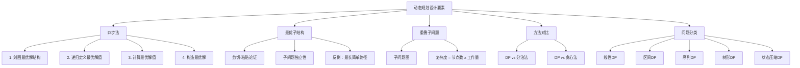

## 相关笔记
- 前置笔记：[[14.1 钢条切割]]、[[14.2 矩阵链乘法]]
- 关联概念：[[14.4 最长公共子序列]]、[[14.5 最优二叉搜索树]]
- 章节汇总：[[第14章_动态规划-章节汇总]]

> [!abstract] 概览
> 本节从已学的两个动态规划实例中提炼出==动态规划方法的设计要素==，系统总结开发动态规划算法的==四步法==，并深入分析动态规划所依赖的两个关键性质：==最优子结构==和==重叠子问题==。同时将动态规划与==分治法==、==贪心法==进行系统对比，并介绍DP问题的分类体系。

---

## 知识结构总览



---

## 核心思想

> [!tip] 核心思路
> 动态规划算法的开发可以系统化为**四个步骤**：首先刻画最优解的结构特征（验证**最优子结构**），然后递归地定义最优解的值（写出**递归方程**），接着计算最优解的值（通常采用**自底向上**的表格法），最后利用计算出的信息构造一个最优解。前两步是"想清楚"（依赖对问题的深入分析），后两步是"算出来"（机械化的程序实现）。动态规划适用的两个关键性质是**最优子结构**（问题的最优解包含子问题的最优解）和**重叠子问题**（递归过程中反复求解相同的子问题）。

### DP四步法 —— 伪代码

动态规划的四步法并非一个具体的算法，而是一个**方法论框架**。以下用伪代码形式展示其逻辑流程：

```
DP-DESIGN(problem):
    Step 1: 分析问题的最优解是否由子问题的最优解组合而成
            验证最优子结构性质（剪切-粘贴论证）
    Step 2: 基于最优子结构，写出最优解值的递归表达式
            定义子问题空间和递归方程
    Step 3: 确定子问题的计算顺序（通常自底向上）
            用表格法或备忘录法计算最优解值
    Step 4: 在计算过程中记录决策信息
            回溯构造具体的最优解
```

这四个步骤在前面的实例中已经反复体现：
- 在[[14.1 钢条切割]]中：步骤1分析最优切割方案包含子段的最优切割；步骤2写出 $r_n = \max_{1 \leq i \leq n}(p_i + r_{n-i})$；步骤3用自底向上填表；步骤4通过记录切割方案回溯。
- 在[[14.2 矩阵链乘法]]中：步骤1分析最优括号化方案包含子链的最优括号化；步骤2写出 $m[i,j] = \min_{i \leq k < j}\{m[i,k] + m[k+1,j] + p_{i-1}p_kp_j\}$；步骤3按链长递增填表；步骤4通过 $s[i,j]$ 表回溯。

### 最优子结构

**最优子结构（Optimal Substructure）**是指：问题的最优解包含其子问题的最优解。用数学语言表述，如果问题的最优解可以分解为若干子问题的解，而这些子问题的解本身也是最优的，则称该问题具有最优子结构。这是动态规划适用的**第一个必要条件**。

在已学的实例中，最优子结构呈现出两种典型模式：

**模式一：问题被划分为"一个"子问题 + "剩余"部分。** 以[[14.1 钢条切割]]为例：将长度为 $n$ 的钢条在位置 $i$ 处切割后，得到"长度为 $i$ 的第一段"和"长度为 $n-i$ 的剩余段"。最优解只需考虑剩余段的子问题：$r_n = \max_{1 \leq i \leq n}\{p_i + r_{n-i}\}$。这里只有一个子问题 $r_{n-i}$，因为第一段不再切割。

**模式二：问题被划分为"两个"独立的子问题。** 以[[14.2 矩阵链乘法]]为例：在位置 $k$ 处将矩阵链分为左右两段，两段各自独立地最优括号化：$m[i,j] = \min_{i \leq k < j}\{m[i,k] + m[k+1,j] + p_{i-1}p_kp_j\}$。这里有两个子问题 $m[i,k]$ 和 $m[k+1,j]$，它们之间是独立的。

验证最优子结构通常使用**剪切-粘贴（cut-and-paste）**论证法：假设问题的一个最优解 $S$ 在分解后，某个子问题的解 $S'$ 不是该子问题的最优解，则存在该子问题的另一个解 $S''$ 比 $S'$ 更优。用 $S''$ 替换 $S$ 中的 $S'$ 得到新解 $S^*$，由于 $S''$ 比 $S'$ 更优且子问题之间独立，$S^*$ 将比 $S$ 更优，这与 $S$ 是最优解矛盾。因此子问题的解必须是最优的。

> [!def] 最优子结构定义
> 如果问题的一个最优解包含了其子问题的最优解，则称该问题具有**最优子结构**。验证方法为**剪切-粘贴论证**：假设子问题的解不是最优的，用更优的子问题解替换后得到比原最优解更好的解，产生矛盾。关键前提是**子问题之间的独立性**——替换一个子问题的解不会影响其他子问题。

最优子结构要求子问题之间是**独立的**。**反面例子——最长简单路径问题**：在有向无环图中，求两个顶点之间的最长简单路径（不重复经过顶点）。假设从 $u$ 到 $v$ 的最长简单路径经过顶点 $w$，即 $u \leadsto w \leadsto v$。子问题1为 $u$ 到 $w$ 的最长简单路径，子问题2为 $w$ 到 $v$ 的最长简单路径。但这两个子问题**不独立**：子问题1和子问题2的路径不能共享顶点（因为总路径必须是简单路径），所以一个子问题的解会约束另一个子问题的可行解空间。因此，最长简单路径问题不能用动态规划求解（它实际上是NP难的）。

### 重叠子问题

**重叠子问题（Overlapping Subproblems）**是指：递归算法在求解过程中会**反复求解相同的子问题**，而非每次遇到的都是全新的、不同的子问题。这是动态规划适用的**第二个必要条件**。

**子问题图（Subproblem Graph）**是一个有向无环图（DAG），用于精确描述子问题之间的依赖关系：**节点**对应每个子问题，**有向边**表示依赖关系（如果求解子问题 $a$ 需要先求解子问题 $b$，则有边 $b \to a$）。子问题图的大小直接决定了动态规划算法的时间复杂度：**时间复杂度 = 节点数 x 每个节点的工作量**。

例如：
- [[14.1 钢条切割]]的子问题图有 $n+1$ 个节点，每个节点的工作量为 $O(n)$，总时间 $O(n^2)$。
- [[14.2 矩阵链乘法]]的子问题图有 $\binom{n}{2} + n = \Theta(n^2)$ 个节点，每个节点的工作量为 $O(n)$，总时间 $O(n^3)$。

> [!def] 重叠子问题定义
> 当一个递归算法不断对相同的子问题进行递归调用时，称该问题具有**重叠子问题**性质。与之相对，**分治法**处理的子问题互不重叠（如归并排序）。动态规划通过**表格法**或**备忘录法**确保每个子问题只求解一次，从而将指数级递归优化为多项式时间。

### DP与分治法、贪心法的对比

**DP vs 分治法**：核心区别在于子问题是否重叠。分治法将问题分解为**互不重叠**的子问题（如归并排序的左右两半完全独立），每个子问题只解一次。动态规划处理的子问题**相互重叠**，需要通过表格或备忘录避免重复计算。

**DP vs 贪心法**：核心区别在于是否考虑所有选择。动态规划在每一步**考虑所有可能的选择**，依赖子问题的解做出决策，保证全局最优。贪心法在每一步做**局部最优**选择，不回头，不依赖子问题的解。贪心法可以视为动态规划的一种"退化"特例：当问题同时具有贪心选择性质和最优子结构时，贪心法能以更低的代价得到最优解，但贪心选择性质比最优子结构更强、更少见。

### DP问题分类

根据状态定义方式的不同，动态规划问题可以分为以下几类：

| 类别 | 特征 | 典型问题 |
|------|------|----------|
| **线性DP** | 状态沿线性序列展开 | [[14.1 钢条切割]]、最长递增子序列 |
| **区间DP** | 状态定义为区间 $[i,j]$ | [[14.2 矩阵链乘法]]、[[14.5 最优二叉搜索树]]、石子合并 |
| **序列DP** | 状态涉及两个序列的匹配 | [[14.4 最长公共子序列]]、编辑距离 |
| **树形DP** | 状态定义在树的节点/子树上 | 独立集问题、树的最小顶点覆盖 |
| **状态压缩DP** | 用位掩码表示集合状态 | 旅行商问题（TSP）、棋盘覆盖 |

### 循环不变式与正确性证明

> [!def] 循环不变式
> 对于自底向上填表的动态规划算法，其正确性可以通过以下循环不变式证明：
>
> **【初始化（边界条件直接对应递归基）】** 在填写表格之前，所有边界条件（基准情形）已被正确设置。例如在[[14.1 钢条切割]]中 $r[0] = 0$，在[[14.2 矩阵链乘法]]中所有 $m[i,i] = 0$。这些基准情形直接对应递归定义的初始条件，因此是正确的。
>
> **【维护（按拓扑序填表保证依赖已计算）】** 每次填写表格中的一个新条目时，该条目所依赖的所有子问题条目都已经被正确计算。这是因为我们按照子问题的拓扑序（通常是按规模从小到大）填写表格。根据递归方程，利用已正确计算的子问题值来计算当前条目，结果也是正确的。
>
> **【终止（所有条目正确，含原始问题）】** 当算法结束时，表格中所有条目都已被正确计算，包括对应原始问题的条目。因此算法返回的值就是最优解的值。 $\blacksquare$

### 时间复杂度分析

> [!def] 时间复杂度
> 动态规划算法的时间复杂度由**子问题图**决定：**总时间 = 子问题数量 x 每个子问题的计算时间**。子问题数量取决于状态空间的维度和规模，每个子问题的计算时间取决于递归方程中需要枚举的选择数量。例如：
> - [[14.1 钢条切割]]：$\Theta(n)$ 个子问题，每个 $O(n)$ 时间 $\Rightarrow$ $\Theta(n^2)$
> - [[14.2 矩阵链乘法]]：$\Theta(n^2)$ 个子问题，每个 $O(n)$ 时间 $\Rightarrow$ $\Theta(n^3)$
> - [[14.4 最长公共子序列]]：$\Theta(mn)$ 个子问题，每个 $\Theta(1)$ 时间 $\Rightarrow$ $\Theta(mn)$
> - [[14.5 最优二叉搜索树]]：$\Theta(n^2)$ 个子问题，每个 $O(n)$ 时间 $\Rightarrow$ $\Theta(n^3)$

---

## 补充理解与拓展

> [!info] DP方法论的学术溯源
> 动态规划由 Richard Bellman 于 1950 年代提出。Bellman 在其 1957 年的著作中首次系统阐述了最优性原理（Principle of Optimality），即我们所说的最优子结构性质。这一原理是整个动态规划理论的基石。Bellman 选择"动态"一词是为了描述多阶段决策过程的时变特性，而"规划"在当时是优化问题的通用术语。[^1]

> [!info] DP的局限性
> 动态规划并非万能。当问题不满足最优子结构（如最长简单路径问题，子问题之间存在约束，剪切-粘贴论证不成立）或不满足重叠子问题（每个子问题只出现一次，DP退化为普通递归）时，动态规划不适用。此外，**状态空间爆炸**也是实际挑战：当问题维度较高时，状态数量可能呈指数级增长（如多维背包问题），此时需要结合状态压缩、近似算法等其他优化技术。[^2]

---

## 易混淆点与辨析

> [!warning] 最优子结构 vs 贪心选择性质
> ❌ 错误理解：最优子结构和贪心选择性质是同一个概念，有最优子结构就能用贪心法。
> ✅ 正确理解：**最优子结构**是动态规划和贪心法共同的前提条件，但它只说明"最优解包含子问题的最优解"。**贪心选择性质**是一个更强的条件，它要求"通过做局部最优选择就能得到全局最优解"。贪心选择性质蕴含最优子结构，但最优子结构不蕴含贪心选择性质。例如，[[14.2 矩阵链乘法]]具有最优子结构但不具有贪心选择性质，因此不能用贪心法求解。

> [!warning] 重叠子问题 vs 子问题独立性
> ❌ 错误理解：重叠子问题和子问题独立性是矛盾的——子问题重叠了就不独立了。
> ✅ 正确理解：这两个性质描述的是**不同维度**的事情。**重叠子问题**指的是同一个子问题会被不同的递归分支**多次调用**（关注的是"调用频率"）。**子问题独立性**指的是在最优解中，一个子问题的解**不约束**另一个子问题的可行解空间（关注的是"解空间是否相互干扰"）。两者可以同时成立：[[14.2 矩阵链乘法]]中，$m[1,3]$ 和 $m[2,4]$ 都需要 $m[2,3]$ 的值（重叠），但在最优解中，$m[1,2]$ 和 $m[3,4]$ 的解互不影响（独立）。

---

## 习题精选

| 题号 | 题目描述 | 难度 | 考察重点 |
|:----:|:---------|:----:|:---------|
| 14.3-1 | 对最长简单路径问题，说明为什么最优子结构性质不成立 | ★★☆ | 最优子结构的理解 |
| 14.3-2 | 求解矩阵链乘法问题的一个递归解 | ★★☆ | 递归方程的建立 |
| 14.3-3 | 考虑一个修改后的钢条切割问题 | ★★☆ | 最优子结构的变体 |
| 14.3-4 | 给定一个教室安排问题，设计动态规划算法 | ★★★ | DP四步法的应用 |
| 14.3-5 | 给定一个投资组合问题，设计动态规划算法 | ★★★ | DP四步法的应用 |

> [!faq]- 14.3-1 解答
> **题目：** 对图中的最长简单路径问题，说明为什么最优子结构性质不成立。
>
> **解题思路：** 构造一个反例，展示最优解的子路径不是最优的，或者展示子问题之间存在依赖关系。
>
> **答案：** 考虑一个有向无环图，其中从 $u$ 到 $v$ 的最长简单路径经过 $w$，即 $u \leadsto w \leadsto v$。子问题1为 $u$ 到 $w$ 的最长简单路径，子问题2为 $w$ 到 $v$ 的最长简单路径。但这两个子问题**不独立**：因为总路径必须是简单路径（不重复经过顶点），子问题1中经过的顶点不能出现在子问题2中。因此，即使我们知道了子问题1和子问题2各自的最长简单路径，也不能简单地将它们拼接起来得到 $u$ 到 $v$ 的最长简单路径。剪切-粘贴论证在此失效，因为替换一个子路径可能引入与另一个子路径重复的顶点。所以最长简单路径问题不具有最优子结构。

> [!faq]- 14.3-2 解答
> **题目：** 利用 14.2 节中矩阵链乘法的递归公式，写出计算 $m[1,4]$ 的递归过程。
>
> **解题思路：** 按照递归公式 $m[i,j] = \min_{i \leq k < j}\{m[i,k] + m[k+1,j] + p_{i-1}p_kp_j\}$，从 $m[1,4]$ 开始展开。
>
> **答案：** $m[1,4] = \min\{m[1,1]+m[2,4]+p_0p_1p_4,\ m[1,2]+m[3,4]+p_0p_2p_4,\ m[1,3]+m[4,4]+p_0p_3p_4\}$。其中 $m[1,1]=m[2,2]=m[3,3]=m[4,4]=0$（基准情形），$m[2,4]$、$m[1,2]$、$m[3,4]$、$m[1,3]$ 需要进一步递归展开。展开后对每个分支计算具体值，取最小值即可。这个过程展示了递归算法会产生大量重复计算——例如 $m[2,3]$ 会在展开 $m[2,4]$ 和 $m[1,3]$ 时各被计算一次——这正是重叠子问题的体现。

---

## 视频学习指南

| 资源 | 主题 | 链接 | 说明 |
|:-----|:-----|:-----|:-----|
| MIT 6.006 Lecture 11 | DP I: Fibonacci, Shortest Paths | https://www.youtube.com/watch?v=OQ5jsbhAv_M | MIT经典DP入门，从斐波那契引出重叠子问题 |
| MIT 6.006 Lecture 12 | DP II: Text Justification, Blackjack | https://www.youtube.com/watch?v=ENyox7kNKeY | DP设计思路的更多实例 |
| Abdul Bari | Dynamic Programming | https://www.youtube.com/watch?v=vYquumk0nDw | 直观讲解DP核心思想，适合入门 |
| Tushar Roy | Dynamic Programming | https://www.youtube.com/watch?v=dVwDQvMGUHs | 系统讲解DP分类和解题模板 |
| 董晓算法 | 动态规划精讲 | https://www.bilibili.com/video/BV1xb411e7xx | 中文DP系统教程，配合大量例题 |

---

## 教材原文

> [!quote] CLRS 第4版 14.3节原文
> 当我们设计一个动态规划算法时，我们遵循四个步骤的序列。前两个步骤构成了动态规划方法的核心。
>
> 1. 刻画一个最优解的结构特征。如果问题的最优解包含其子问题的最优解，则称该问题具有最优子结构性质。利用最优子结构性质，可以构造出最优解的递归方程。
>
> 2. 递归地定义最优解的值。基于步骤1中得到的最优子结构，写出最优解值的递归表达式。
>
> 3. 计算最优解的值，通常采用自底向上的方法。将子问题的解填入表格中，确保每个子问题只求解一次。
>
> 4. 利用计算出的信息构造一个最优解。在步骤3中记录决策信息，以便在最后构造出具体的最优解。
>
> 适用于动态规划方法的问题具有两个关键性质：最优子结构性质和重叠子问题性质。
>
> 在动态规划中，我们在每一步做出选择，但这个选择通常依赖于子问题的解。因此，我们先求解子问题。在贪心算法中，我们做出当前看来最好的选择，然后求解剩余的子问题。贪心法做出的选择可能依赖于到目前为止所做的选择，但不依赖于任何未来的选择或子问题的解。

---

## 参见Wiki

**章节导航：**
- [[第14章_动态规划-章节汇总]] | [[第14章_动态规划/14.1 钢条切割]] | [[第14章_动态规划/14.2 矩阵链乘法]] | [[第14章_动态规划/14.4 最长公共子序列]] | [[第14章_动态规划/14.5 最优二叉搜索树]]

**关联知识：**
- [[第14章_动态规划/14.1 钢条切割]] —— DP四步法的第一个完整实例
- [[第14章_动态规划/14.2 矩阵链乘法]] —— DP四步法的第二个完整实例，区间DP的典型代表
- [[第14章_动态规划/14.4 最长公共子序列]] —— 序列DP的典型代表
- [[第14章_动态规划/14.5 最优二叉搜索树]] —— 区间DP的另一个典型代表

[^1]: Bellman, R. (1957). *Dynamic Programming*. Princeton University Press. Bellman 在本书中首次系统阐述了动态规划的理论框架，提出了最优性原理（Principle of Optimality），奠定了动态规划作为独立算法范式的理论基础。
[^2]: Horowitz, E., Sahni, S., & Rajasekaran, S. (1998). *Computer Algorithms/C++*. W. H. Freeman. Chapter 5 对动态规划的适用性条件进行了系统的形式化讨论，包括最优子结构的判定方法和子问题空间的分析技术。

#学习/算法导论/第14章-动态规划 #学习/算法导论/动态规划/动态规划设计要素
