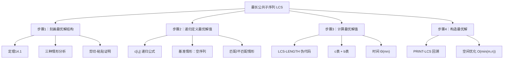
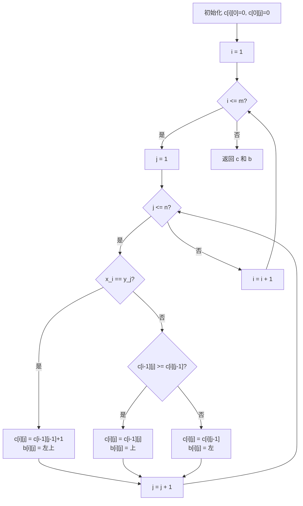

## 相关笔记
- 前置笔记：[[14.1 钢条切割]]、[[14.2 矩阵链乘法]]、[[14.3 动态规划设计要素]]
- 关联概念：[[14.5 最优二叉搜索树]]
- 章节汇总：[[第14章_动态规划-章节汇总]]

> [!abstract] 概览
> 本节研究==最长公共子序列（Longest Common Subsequence, LCS）==问题。给定两个序列，求它们的最长公共子序列。这是一个经典的==序列DP==问题，广泛应用于文本比较、生物信息学（DNA/蛋白质序列比对）等领域。我们将按照[[14.3 动态规划设计要素]]中的==四步法==，完整分析LCS问题的==最优子结构==、==递归公式==、==LCS-LENGTH==伪代码、==PRINT-LCS==回溯算法，以及==空间优化==技术。

---

## 知识结构总览



---

## 核心思想

> [!tip] 核心思路
> LCS问题的核心思路是**末尾匹配策略**：比较两个序列的最后一个元素。如果相同，它一定属于某个LCS，去掉它后问题缩小为两个更短前缀的LCS问题。如果不同，则LCS一定不包含其中至少一个末尾元素，可以安全地去掉一个末尾元素继续分析。这三种情形穷尽了所有可能，构成递归的基础。通过自底向上填写二维表格 $c[i,j]$，可以在 $\Theta(mn)$ 时间内计算出LCS长度，再通过回溯 $b$ 表在 $O(m+n)$ 时间内构造出具体的LCS。

### 子序列的定义

给定序列 $X = \langle x_1, x_2, \ldots, x_m \rangle$，序列 $Z = \langle z_1, z_2, \ldots, z_k \rangle$ 是 $X$ 的**子序列（subsequence）**，当且仅当存在一个严格递增的下标序列 $\langle i_1, i_2, \ldots, i_k \rangle$（其中 $1 \leq i_1 < i_2 < \cdots < i_k \leq m$），使得对所有的 $j = 1, 2, \ldots, k$，有 $z_j = x_{i_j}$。

**子序列不要求元素在原序列中连续**，只要求保持相对顺序。例如，对于序列 $\langle A, B, C, B, D \rangle$，$\langle A, C, D \rangle$ 是子序列但不是子串，$\langle B, C, B \rangle$ 既是子序列也是子串。

给定两个序列 $X$ 和 $Y$，序列 $Z$ 是 $X$ 和 $Y$ 的**公共子序列**，当且仅当 $Z$ 既是 $X$ 的子序列，又是 $Y$ 的子序列。**最长公共子序列（LCS）**问题就是求 $X$ 和 $Y$ 的所有公共子序列中长度最长的那些。注意：LCS可能不唯一。

### 定理14.1 —— LCS的最优子结构

设 $X = \langle x_1, x_2, \ldots, x_m \rangle$ 和 $Y = \langle y_1, y_2, \ldots, y_n \rangle$ 为两个序列，$Z = \langle z_1, z_2, \ldots, z_k \rangle$ 为 $X$ 和 $Y$ 的任意LCS，则：

1. **若 $x_m = y_n$**，则 $z_k = x_m = y_n$，且 $Z_{k-1} = \langle z_1, \ldots, z_{k-1} \rangle$ 是 $X_{m-1}$ 和 $Y_{n-1}$ 的LCS。
2. **若 $x_m \neq y_n$ 且 $z_k \neq x_m$**，则 $Z$ 是 $X_{m-1}$ 和 $Y$ 的LCS。
3. **若 $x_m \neq y_n$ 且 $z_k \neq y_n$**，则 $Z$ 是 $X$ 和 $Y_{n-1}$ 的LCS。

其中 $X_{i}$ 表示 $X$ 的前缀 $\langle x_1, \ldots, x_i \rangle$，$Y_{j}$ 表示 $Y$ 的前缀 $\langle y_1, \ldots, y_j \rangle$。

**证明：**

**情形1：$x_m = y_n$。** **【反证 z_k != x_m 会导致更长公共子序列】** 首先证明 $z_k = x_m = y_n$。假设 $z_k \neq x_m$，则可以在 $Z$ 末尾追加 $x_m$ 得到 $Z' = \langle z_1, \ldots, z_k, x_m \rangle$。由于 $x_m = y_n$，$Z'$ 仍然是 $X$ 和 $Y$ 的公共子序列，且长度为 $k+1 > k$，这与 $Z$ 是LCS矛盾。因此 $z_k = x_m = y_n$。

**【剪切-粘贴法证明 Z_{k-1} 是 X_{m-1} 和 Y_{n-1} 的LCS】** 接下来证明 $Z_{k-1}$ 是 $X_{m-1}$ 和 $Y_{n-1}$ 的LCS。$Z_{k-1}$ 显然是 $X_{m-1}$ 和 $Y_{n-1}$ 的公共子序列（因为 $z_1, \ldots, z_{k-1}$ 出现在 $x_1, \ldots, x_{m-1}$ 和 $y_1, \ldots, y_{n-1}$ 中）。用剪切-粘贴法：若 $Z_{k-1}$ 不是 $X_{m-1}$ 和 $Y_{n-1}$ 的LCS，则存在更长的公共子序列 $W$，将 $x_m$ 追加到 $W$ 末尾得到 $W'$，$W'$ 将是 $X$ 和 $Y$ 的比 $Z$ 更长的公共子序列，矛盾。

**情形2：$x_m \neq y_n$ 且 $z_k \neq x_m$。** **【Z 完全由 X_{m-1} 的元素组成】** $Z$ 是 $X$ 和 $Y$ 的公共子序列且 $z_k \neq x_m$，因此 $Z$ 完全由 $X_{m-1}$ 中的元素组成，$Z$ 是 $X_{m-1}$ 和 $Y$ 的公共子序列。用剪切-粘贴法：若 $Z$ 不是 $X_{m-1}$ 和 $Y$ 的LCS，则存在更长的公共子序列 $W$，$W$ 也是 $X$ 和 $Y$ 的公共子序列（因为 $X_{m-1} \subseteq X$），且比 $Z$ 更长，矛盾。

**情形3：$x_m \neq y_n$ 且 $z_k \neq y_n$。** 与情形2对称，$Z$ 是 $X$ 和 $Y_{n-1}$ 的LCS。证毕。 $\blacksquare$

> [!def] LCS最优子结构定理
> **定理14.1**刻画了LCS问题的最优子结构：LCS的最后一个字符要么是两个序列的公共末尾字符（情形1），要么不包含某个序列的末尾字符（情形2或3）。这三种情形穷尽了所有可能，且每种情形都将原问题归约为一个更小的子问题。这保证了可以通过递归（或自底向上填表）高效求解。

### 递归公式 c[i,j]

定义 $c[i,j]$ 为序列 $X_i$ 和 $Y_j$ 的LCS的长度。根据定理14.1，可以递归地定义 $c[i,j]$：

$$c[i,j] = \begin{cases} 0 & \text{若 } i = 0 \text{ 或 } j = 0 \\ c[i-1,j-1] + 1 & \text{若 } i,j > 0 \text{ 且 } x_i = y_j \\ \max(c[i-1,j],\ c[i,j-1]) & \text{若 } i,j > 0 \text{ 且 } x_i \neq y_j \end{cases}$$

**三种情况的含义**：
- **基准情形**：空序列与任何序列的LCS长度为0。
- **匹配情形**：末尾元素相同，LCS长度等于去掉末尾后的LCS长度加1。
- **不匹配情形**：末尾元素不同，LCS长度等于"去掉 $X$ 末尾"和"去掉 $Y$ 末尾"两种情况中的较大者。

### LCS-LENGTH —— 伪代码

以下伪代码采用自底向上的表格法计算 $c$ 表，同时维护 $b$ 表记录决策方向以便后续构造最优解。

> [!tip] 算法执行流程
> 1. 初始化边界：c[i][0] = 0（对所有 i），c[0][j] = 0（对所有 j）
> 2. **外层循环**：对 i 从 1 到 m
> 3. **内层循环**：对 j 从 1 到 n
> 4. **若 x_i == y_j**：c[i][j] = c[i-1][j-1] + 1，b[i][j] 记录"左上"（匹配）
> 5. **若 x_i != y_j 且 c[i-1][j] >= c[i][j-1]**：c[i][j] = c[i-1][j]，b[i][j] 记录"上"（跳过 x_i）
> 6. **否则**：c[i][j] = c[i][j-1]，b[i][j] 记录"左"（跳过 y_j）
> 7. 返回 c 和 b



```
LCS-LENGTH(X, Y, m, n):
1  let b[1..m, 1..n] and c[0..m, 0..n] be new tables
2  for i = 1 to m
3      c[i, 0] = 0
4  for j = 0 to n
5      c[0, j] = 0
6  for i = 1 to m
7      for j = 1 to n
8          if x_i == y_j
9              c[i, j] = c[i-1, j-1] + 1
10             b[i, j] = "↖"
11         elseif c[i-1, j] >= c[i, j-1]
12             c[i, j] = c[i-1, j]
13             b[i, j] = "↑"
14         else
15             c[i, j] = c[i, j-1]
16             b[i, j] = "←"
17 return c and b
```

**逐行解释**：

- **第1行**：创建两个 $(m+1) \times (n+1)$ 的表格。$c$ 表存储LCS长度，$b$ 表存储决策方向。
- **第2-5行**：初始化边界条件。空序列与任何序列的LCS长度为0。
- **第6-16行**：双重循环，按行优先顺序（即 $i$ 从1到 $m$，$j$ 从1到 $n$）填写表格。对于每个位置 $(i,j)$：
  - 若 $x_i = y_j$（第8-10行）：$c[i,j]$ 取左上角值加1，$b[i,j]$ 记录"↖"（表示匹配）。
  - 若 $x_i \neq y_j$ 且上方值不小于左方值（第11-13行）：$c[i,j]$ 取上方值，$b[i,j]$ 记录"↑"（表示跳过 $x_i$）。
  - 否则（第14-16行）：$c[i,j]$ 取左方值，$b[i,j]$ 记录"←"（表示跳过 $y_j$）。
- **第17行**：返回两个表格。

填表顺序的正确性保证：$c[i,j]$ 只依赖于 $c[i-1,j-1]$（左上）、$c[i-1,j]$（正上）、$c[i,j-1]$（正左），这三个位置在行优先遍历中都已经被计算过。这正是子问题图的拓扑序。

### PRINT-LCS —— 伪代码

利用 $b$ 表，从 $b[m,n]$ 开始回溯，构造出具体的LCS。

```
PRINT-LCS(b, X, i, j):
1  if i == 0 or j == 0
2      return
3  if b[i, j] == "↖"
4      PRINT-LCS(b, X, i-1, j-1)
5      print x_i
6  elseif b[i, j] == "↑"
7      PRINT-LCS(b, X, i-1, j)
8  else
9      PRINT-LCS(b, X, i, j-1)
```

**逐行解释**：

- **第1-2行**：基准情形——到达边界时返回。
- **第3-5行**：若 $b[i,j] = $ "↖"，表示 $x_i$ 和 $y_j$ 匹配，递归处理左上角后输出 $x_i$。
- **第6-7行**：若 $b[i,j] = $ "↑"，表示 $x_i$ 不属于LCS，向上移动。
- **第8-9行**：若 $b[i,j] = $ "←"，表示 $y_j$ 不属于LCS，向左移动。

**先递归后输出**保证了输出顺序与原序列中元素的出现顺序一致。递归先到达LCS的第一个元素位置，然后逐个输出，因此输出序列就是正确的LCS。

**回溯示例**：设 $X = \langle A, B, C, B, D, A, B \rangle$（$m=7$），$Y = \langle B, D, C, A, B, A \rangle$（$n=6$）。从 $b[7,6]$ 开始回溯：

$b[7,6] = $ "↖" $\to$ $b[6,5] = $ "↑" $\to$ $b[5,5] = $ "↖" $\to$ $b[4,4] = $ "↑" $\to$ $b[3,3] = $ "↖" $\to$ $b[2,2] = $ "↑" $\to$ $b[1,1] = $ "↑" $\to$ $b[0,1]$（基准情形）

输出：$x_1 = A,\ x_3 = C,\ x_5 = D,\ x_7 = B$，即LCS为 $\langle B, D, A, B \rangle$。（由于第11行使用 $\geq$ 而非 $>$，当 $c[i-1,j] = c[i,j-1]$ 时优先选择"↑"，因此回溯得到的是 $\langle B, D, A, B \rangle$ 而非 $\langle B, C, B, A \rangle$。）

### 循环不变式与正确性证明

> [!def] 循环不变式
> 对于LCS-LENGTH算法的外层循环（第6行），考虑循环不变式：**在第 $i$ 次迭代开始时，$c[0..i-1, 0..n]$ 中的所有条目已被正确计算为对应子问题的LCS长度。**
>
> **【初始化（c[0, 0..n] 和 c[1..m, 0] 均为0，对应空序列）】** 在第一次迭代（$i=1$）开始前，第2-5行已将 $c[0, 0..n]$ 和 $c[1..m, 0]$ 初始化为0，这些对应空序列的LCS长度，是正确的。$c[0..0, 0..n]$ 即 $c[0, 0..n]$ 已被正确计算。
>
> **【维护（c[i,j] 依赖的三个值均已正确计算）】** 假设在第 $i$ 次迭代开始时，$c[0..i-1, 0..n]$ 已正确。内层循环（第7行）对每个 $j = 1, \ldots, n$ 计算 $c[i,j]$。$c[i,j]$ 依赖于 $c[i-1,j-1]$、$c[i-1,j]$、$c[i,j-1]$，这三个值在此时都已被正确计算（$c[i-1,*]$ 由归纳假设，$c[i,j-1]$ 由内层循环的前一次迭代）。因此 $c[i,j]$ 被正确计算。
>
> **【终止（c[m,n] 即为原问题的LCS长度）】** 当 $i = m+1$ 时循环结束，$c[0..m, 0..n]$ 中所有条目均已正确计算，包括 $c[m,n]$（原问题的LCS长度）。 $\blacksquare$

### 时间复杂度分析

> [!def] 时间复杂度
> **LCS-LENGTH**：双重循环执行 $m \times n$ 次迭代，每次迭代 $\Theta(1)$ 时间，总计 $\Theta(mn)$。空间方面，$c$ 表和 $b$ 表各需要 $\Theta(mn)$ 空间，总计 $\Theta(mn)$。
>
> **PRINT-LCS**：每次递归调用将 $i$ 或 $j$ 至少减少1，递归深度最多为 $m+n$，每次调用 $\Theta(1)$ 工作，总时间 $O(m+n)$。
>
> **空间优化**：如果只需要计算LCS的长度而不需要构造具体的LCS，可以将空间优化到 $O(\min(m,n))$。因为 $c[i,j]$ 只依赖于第 $i-1$ 行和第 $i$ 行当前已计算的值，只需保存两行即可。进一步地，可以只用一行并从右向左填写。

---

## 补充理解与拓展

> [!info] LCS在生物信息学中的应用
> LCS在生物信息学中有着极其重要的应用。DNA序列由四种碱基（A、T、C、G）组成，蛋白质序列由20种氨基酸组成。比较两个生物序列的相似性是理解物种进化关系、基因功能预测的基础任务。Needleman-Wunsch算法（1970）是LCS的加权推广：它为匹配、不匹配、空位（gap）分别赋予不同的得分，通过动态规划找到得分最高的全局对齐方案。LCS可以视为Needleman-Wunsch算法的特例（匹配得分=1，不匹配得分=0，空位罚分=0）。[^1]

> [!info] LCS与编辑距离的关系
> **编辑距离（Edit Distance）**，又称Levenshtein距离，衡量将一个字符串转换为另一个字符串所需的最少编辑操作次数（插入、删除、替换，每个操作代价为1）。编辑距离是LCS的自然推广：LCS只允许"匹配"和"跳过"（相当于免费删除），编辑距离还允许"替换"操作且有代价。两者之间的关系为：$\text{edit\_distance}(X, Y) = m + n - 2 \cdot \text{LCS\_length}(X, Y)$（当只允许插入和删除、不允许替换时）。[^2]

---

## 易混淆点与辨析

> [!warning] 子序列 vs 子串
> ❌ 错误理解：子序列和子串是同一个概念，只是叫法不同。
> ✅ 正确理解：**子序列（subsequence）**不要求元素在原序列中连续，只要求保持相对顺序。**子串（substring）**要求元素在原序列中**连续**。子串一定是子序列，但子序列不一定是子串。例如，对于序列 $\langle A, B, C, B, D \rangle$，$\langle A, C, D \rangle$ 是子序列但不是子串，$\langle B, C, B \rangle$ 既是子序列也是子串。LCS问题处理的是子序列，不是子串。

> [!warning] LCS vs 最长公共子串
> ❌ 错误理解：最长公共子序列和最长公共子串是同一个问题。
> ✅ 正确理解：这是两个**不同的**问题。**最长公共子序列（LCS）**允许不连续匹配，时间复杂度 $\Theta(mn)$。**最长公共子串（Longest Common Substring）**要求连续匹配，也可以用动态规划求解（递归公式不同：当 $x_i = y_j$ 时 $c[i,j] = c[i-1,j-1] + 1$，否则 $c[i,j] = 0$），时间复杂度同样为 $\Theta(mn)$，但也可以用后缀数组在 $O(m+n)$ 时间内求解。两者的递归公式和语义完全不同。

---

## 习题精选

| 题号 | 题目描述 | 难度 | 考察重点 |
|:----:|:---------|:----:|:---------|
| 14.4-1 | 对给定序列求LCS长度 | ★☆☆ | LCS-LENGTH的执行过程 |
| 14.4-2 | 给出LCS-LENGTH的递归（备忘录）版本 | ★★☆ | 自顶向下 vs 自底向上 |
| 14.4-3 | 设计一个只使用表 $c$ 而不使用表 $b$ 的LCS打印方法 | ★★☆ | 空间优化与回溯 |
| 14.4-4 | 说明如何只使用 $2 \times \min(m,n)$ 的空间计算LCS长度 | ★★☆ | 空间优化 |
| 14.4-5 | 给出一个运行时间为 $O(mn)$ 的LCS算法，但使用 $O(\min(m,n))$ 空间 | ★★★ | 空间优化 |
| 14.4-6 | 说明如何在一个 $O(n)$ 时间内找出LCS | ★★★ | 特殊情况下的优化 |

> [!faq]- 14.4-1 解答
> **题目：** 对 $X = \langle 1, 0, 0, 1, 0, 1, 0, 1 \rangle$ 和 $Y = \langle 0, 1, 0, 1, 1, 0, 1, 1, 0 \rangle$，求LCS长度。
>
> **解题思路：** 执行LCS-LENGTH算法，填写 $c$ 表。
>
> **答案：** LCS长度为 $6$。一个LCS为 $\langle 1, 0, 0, 1, 0, 1 \rangle$。

> [!faq]- 14.4-2 解答
> **题目：** 给出LCS-LENGTH的递归（备忘录）版本。
>
> **解题思路：** 将自底向上的表格法改为自顶向下的带备忘录递归。
>
> **答案：**
> ```
> MEMOIZED-LCS-LENGTH(X, Y, i, j):
> 1  if c[i, j] 已经计算过
> 2      return c[i, j]
> 3  if i == 0 or j == 0
> 4      return 0
> 5  if x_i == y_j
> 6      c[i, j] = MEMOIZED-LCS-LENGTH(X, Y, i-1, j-1) + 1
> 7  else
> 8      c[i, j] = max(MEMOIZED-LCS-LENGTH(X, Y, i-1, j),
> 9                    MEMOIZED-LCS-LENGTH(X, Y, i, j-1))
> 10 return c[i, j]
> ```
> 调用 `MEMOIZED-LCS-LENGTH(X, Y, m, n)` 即可得到LCS长度。备忘录版本的时间复杂度仍为 $\Theta(mn)$（每个子问题只计算一次），但可能比自底向上版本更高效（不计算不需要的子问题）。

> [!faq]- 14.4-3 解答
> **题目：** 设计一个只使用表 $c$ 而不使用表 $b$ 的LCS打印方法。
>
> **解题思路：** 在回溯时，不查 $b$ 表，而是直接比较 $c[i-1,j-1]$、$c[i-1,j]$、$c[i,j-1]$ 的值来判断决策方向。
>
> **答案：**
> ```
> PRINT-LCS-FROM-C(c, X, Y, i, j):
> 1  if i == 0 or j == 0
> 2      return
> 3  if x_i == y_j
> 4      PRINT-LCS-FROM-C(c, X, Y, i-1, j-1)
> 5      print x_i
> 6  elseif c[i-1, j] >= c[i, j-1]
> 7      PRINT-LCS-FROM-C(c, X, Y, i-1, j)
> 8  else
> 9      PRINT-LCS-FROM-C(c, X, Y, i, j-1)
> ```
> 关键在于第3行直接比较 $x_i$ 和 $y_j$（判断是否匹配），第6行比较 $c[i-1,j]$ 和 $c[i,j-1]$（判断决策方向），完全不需要 $b$ 表。这节省了 $\Theta(mn)$ 的空间。

---

## 视频学习指南

| 资源 | 主题 | 链接 | 说明 |
|:-----|:-----|:-----|:-----|
| MIT 6.006 Lecture 12 | DP II: Text Justification, Blackjack | https://www.youtube.com/watch?v=ENyox7kNKeY | MIT经典DP课程，包含序列DP思路 |
| Abdul Bari | Longest Common Subsequence | https://www.youtube.com/watch?v=HrybPYpOvz0 | 直观讲解LCS填表过程，适合入门 |
| Tushar Roy | LCS DP | https://www.youtube.com/watch?v=NnD96abizww | 完整LCS算法推导与代码实现 |
| Back To Back SWE | Longest Common Subsequence | https://www.youtube.com/watch?v=sSno9rVWGHY | 清晰的LCS算法讲解与复杂度分析 |
| 董晓算法 | 最长公共子序列 | https://www.bilibili.com/video/BV1xb411e7xx | 中文LCS讲解，配合动画演示 |

---

## 教材原文

> [!quote] CLRS 第4版 14.4节原文
> 在最长公共子序列问题中，给定两个序列 $X = \langle x_1, x_2, \ldots, x_m \rangle$ 和 $Y = \langle y_1, y_2, \ldots, y_n \rangle$，希望找出 $X$ 和 $Y$ 的一个最长公共子序列。
>
> 序列 $Z = \langle z_1, z_2, \ldots, z_k \rangle$ 是 $X$ 的子序列，如果存在 $X$ 下标的严格递增序列 $\langle i_1, i_2, \ldots, i_k \rangle$，使得对所有 $j = 1, 2, \ldots, k$，有 $z_j = x_{i_j}$。序列 $Z$ 是 $X$ 和 $Y$ 的公共子序列，如果 $Z$ 同时是 $X$ 和 $Y$ 的子序列。
>
> 最长公共子序列问题可以按照动态规划的四步法来求解。步骤1刻画最优解的结构特征：如果 $x_m = y_n$，则 $z_k = x_m = y_n$，且 $Z_{k-1}$ 是 $X_{m-1}$ 和 $Y_{n-1}$ 的LCS。如果 $x_m \neq y_n$，则 $Z$ 是 $X_{m-1}$ 和 $Y$ 的LCS，或者是 $X$ 和 $Y_{n-1}$ 的LCS。
>
> 步骤2递归定义最优解的值：$c[i,j]$ 表示 $X_i$ 和 $Y_j$ 的LCS长度。步骤3采用自底向上的方法计算 $c$ 表。步骤4利用 $b$ 表回溯构造LCS。

---

## 参见Wiki

**章节导航：**
- [[第14章_动态规划-章节汇总]] | [[第14章_动态规划/14.1 钢条切割]] | [[第14章_动态规划/14.2 矩阵链乘法]] | [[第14章_动态规划/14.3 动态规划设计要素]] | [[第14章_动态规划/14.5 最优二叉搜索树]]

**关联知识：**
- [[第14章_动态规划/14.3 动态规划设计要素]] —— DP四步法的方法论框架
- [[第14章_动态规划/14.2 矩阵链乘法]] —— 另一个区间DP的典型代表，与LCS形成对比
- [[第14章_动态规划/14.5 最优二叉搜索树]] —— 区间DP的另一个代表

[^1]: Needleman, S. B., & Wunsch, C. D. (1970). "A general method applicable to the search for similarities in the amino acid sequence of two proteins." *Journal of Molecular Biology*, 48(3), 443-453. 本文提出了Needleman-Wunsch算法，是生物序列比对的奠基性工作。该算法本质上是LCS的加权推广，通过为匹配、不匹配和空位赋予不同得分，实现了更灵活的序列相似性度量。
[^2]: Levenshtein, V. I. (1966). "Binary codes capable of correcting deletions, insertions, and reversals." *Soviet Physics Doklady*, 10(8), 707-710. Levenshtein 在本文中提出了编辑距离的概念，最初用于编码理论中的纠错码设计。后来这一概念被广泛应用于自然语言处理、拼写检查、DNA序列分析等领域。

#学习/算法导论/第14章-动态规划 #学习/算法导论/动态规划/最长公共子序列
