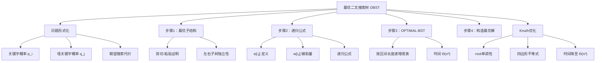
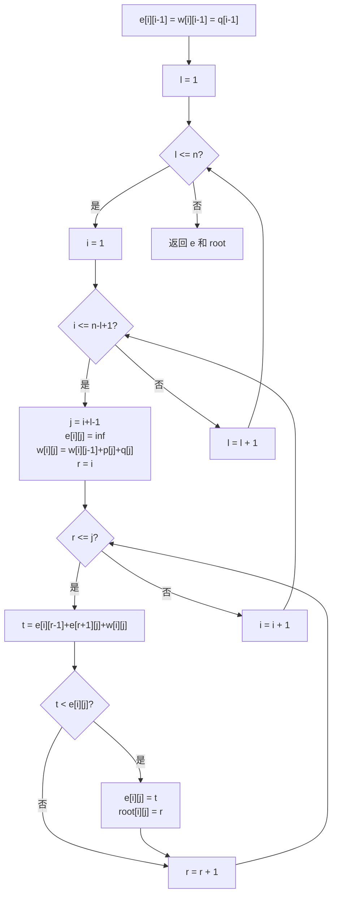
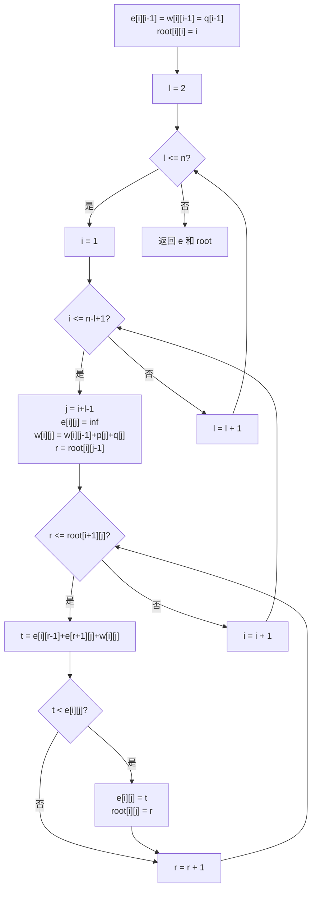

## 相关笔记
- 前置笔记：[[14.1 钢条切割]]、[[14.2 矩阵链乘法]]、[[14.3 动态规划设计要素]]、[[14.4 最长公共子序列]]
- 关联概念：[[14.2 矩阵链乘法]]
- 章节汇总：[[第14章_动态规划-章节汇总]]

> [!abstract] 概览
> 本节研究==最优二叉搜索树（Optimal Binary Search Tree, Optimal BST）==问题。给定一组已排序的关键字及其搜索概率，构造一棵使==期望搜索代价==最小的二叉搜索树。这是一个经典的==区间DP==问题，与[[14.2 矩阵链乘法]]类似，状态定义为连续区间 $[i,j]$，但递归公式的推导涉及==概率加权==的深度计算。本节将完整展示最优子结构证明、==OPTIMAL-BST==伪代码、$\Theta(n^3)$ 复杂度分析，以及==Knuth优化==将复杂度降至 $\Theta(n^2)$ 的技术。

---

## 知识结构总览



---

## 核心思想

> [!tip] 核心思路
> 最优BST问题的核心思路是**枚举根节点**：对于包含关键字 $k_i, \ldots, k_j$ 的子树，尝试每个关键字 $k_r$（$i \leq r \leq j$）作为根，然后递归地构造左右子树的最优BST。关键洞察是**深度增加效应**：当以 $k_r$ 为根时，左右子树中所有节点的深度都增加了1，因此左右子树的期望代价各增加其概率之和。利用辅助量 $w(i,j)$（概率之和），可以将递归公式简化为 $e[i,j] = \min_{i \leq r \leq j}\{e[i,r-1] + e[r+1,j] + w(i,j)\}$。按区间长度递增填表，时间复杂度 $\Theta(n^3)$。

### 问题形式化

给定 $n$ 个**不同的**关键字，按升序排列：$k_1 < k_2 < \cdots < k_n$。每个关键字 $k_i$ 被搜索到的概率为 $p_i$（$1 \leq i \leq n$）。

此外，还有 $n+1$ 个**哑关键字（dummy keys）** $d_0, d_1, \ldots, d_n$，其中 $d_0$ 表示小于 $k_1$ 的搜索，$d_i$ 表示介于 $k_i$ 和 $k_{i+1}$ 之间的搜索（$1 \leq i \leq n-1$），$d_n$ 表示大于 $k_n$ 的搜索。每个哑关键字 $d_j$ 被搜索到的概率为 $q_j$（$0 \leq j \leq n$）。

**概率约束**：$\sum_{i=1}^{n} p_i + \sum_{j=0}^{n} q_j = 1$

**哑关键字代表搜索失败的情况**。在实际应用中，并非所有搜索都能在BST中找到对应的关键字。哑关键字 $d_j$ 对应BST中的"空子树"位置，搜索到达 $d_j$ 意味着搜索失败。将失败搜索也纳入期望代价的计算，使模型更加完整和实用。

在BST中搜索一个关键字的代价等于**访问的节点数**（即从根到该节点路径上的节点数，也就是该节点的深度加1）。一棵BST的**期望搜索代价**为：

$$E[\text{搜索代价}] = \sum_{i=1}^{n} p_i \cdot (\text{depth}(k_i) + 1) + \sum_{j=0}^{n} q_j \cdot (\text{depth}(d_j) + 1)$$

**目标**：构造一棵包含 $k_1, \ldots, k_n$ 的BST，使上述期望搜索代价最小。

### 最优子结构证明

最优BST具有以下最优子结构性质：如果一棵最优BST $T$ 以关键字 $k_r$ 为根（$i \leq r \leq j$），则：
- $k_r$ 的**左子树** $T_L$ 是包含关键字 $k_i, k_{i+1}, \ldots, k_{r-1}$ 和哑关键字 $d_{i-1}, d_i, \ldots, d_{r-1}$ 的一棵最优BST。
- $k_r$ 的**右子树** $T_R$ 是包含关键字 $k_{r+1}, k_{r+2}, \ldots, k_j$ 和哑关键字 $d_r, d_{r+1}, \ldots, d_j$ 的一棵最优BST。

**证明（剪切-粘贴法）：** **【假设左子树 T_L 不最优，则存在更优的 T_L'】** 假设 $T$ 是包含关键字 $k_i, \ldots, k_j$ 的最优BST，以 $k_r$ 为根。假设 $T$ 的左子树 $T_L$ 不是包含 $k_i, \ldots, k_{r-1}$ 的最优BST，则存在另一棵BST $T_L'$ 包含 $k_i, \ldots, k_{r-1}$，其期望搜索代价更低。

**【替换 T_L 为 T_L' 得到更优树 T'，与 T 最优矛盾】** 将 $T$ 中的 $T_L$ 替换为 $T_L'$，得到新树 $T'$。由于左子树和右子树的搜索是独立的（搜索左子树不会涉及右子树的节点，反之亦然），$T'$ 的期望搜索代价将严格低于 $T$，这与 $T$ 是最优BST矛盾。因此，$T_L$ 必须是最优的。同理，$T_R$ 也必须是最优的。 $\blacksquare$

> [!def] 最优子结构定理
> 最优BST的最优子结构：最优BST的左右子树本身也是对应关键字范围的最优BST。**BST的左右子树是独立的**——搜索左子树中的关键字时，路径只经过根节点和左子树中的节点，不会涉及右子树。因此替换左子树不会影响右子树的搜索代价。这一独立性是剪切-粘贴论证成立的基础。

### 递归公式 e[i,j]

定义 $e[i,j]$ 为包含关键字 $k_i, k_{i+1}, \ldots, k_j$ 的最优BST的期望搜索代价。

**边界情形**：当 $j = i - 1$ 时，子树为空（只包含哑关键字 $d_{i-1}$），此时 $e[i, i-1] = q_{i-1}$。

**辅助量 $w(i,j)$**：定义为包含关键字 $k_i, \ldots, k_j$ 的子树中所有搜索概率之和：

$$w(i,j) = \sum_{l=i}^{j} p_l + \sum_{l=i-1}^{j} q_l$$

$w(i,j)$ 可以递推计算：$w(i,j) = w(i, j-1) + p_j + q_j$。

**递归公式**：

$$e[i,j] = \begin{cases} q_{i-1} & \text{若 } j = i - 1 \\ \displaystyle\min_{i \leq r \leq j}\{e[i, r-1] + e[r+1, j] + w(i, j)\} & \text{若 } i \leq j \end{cases}$$

**公式解读**：

- **基准情形**（$j = i-1$）：空子树，只有哑关键字 $d_{i-1}$，代价为 $q_{i-1}$。
- **递归情形**（$i \leq j$）：尝试每个关键字 $k_r$（$i \leq r \leq j$）作为根：
  - $e[i, r-1]$：左子树的最优期望代价。
  - $e[r+1, j]$：右子树的最优期望代价。
  - $w(i, j)$：由于以 $k_r$ 为根后，左右子树中所有节点的深度都增加了1。

**为什么加 $w(i,j)$ 而不是 $p_r$？** 当以 $k_r$ 为根时，左子树 $T_L$ 和右子树 $T_R$ 中所有节点的深度都增加了1（相对于它们在各自子树中的深度）。因此，左子树的期望代价从 $e[i,r-1]$ 变为 $e[i,r-1] + w(i,r-1)$，右子树的期望代价从 $e[r+1,j]$ 变为 $e[r+1,j] + w(r+1,j)$。加上根节点自身的代价 $p_r$，总代价为：

$$e[i,r-1] + w(i,r-1) + e[r+1,j] + w(r+1,j) + p_r = e[i,r-1] + e[r+1,j] + w(i,j)$$

最后一步利用了 $w(i,r-1) + w(r+1,j) + p_r = w(i,j)$。

### OPTIMAL-BST —— 伪代码

以下伪代码采用自底向上的表格法，按子树大小（即区间长度）递增的顺序计算。

> [!tip] 算法执行流程
> 1. 初始化边界：e[i][i-1] = w[i][i-1] = q[i-1]（空子树只有哑关键字）
> 2. **外层循环**：对子树长度 l 从 1 到 n
> 3. **中层循环**：对起始位置 i 从 1 到 n-l+1，计算终止位置 j = i+l-1
> 4. 初始化 e[i][j] = 无穷大，计算 w[i][j] = w[i][j-1] + p[j] + q[j]
> 5. **内层循环**：对每个根 r 从 i 到 j
> 6. 计算代价 t = e[i][r-1] + e[r+1][j] + w[i][j]
> 7. 若 t < e[i][j]，更新 e[i][j] = t，记录最优根 root[i][j] = r
> 8. 返回 e 和 root



```
OPTIMAL-BST(p, q, n):
1  let e[1..n+1, 0..n], w[1..n+1, 0..n], root[1..n, 1..n] be new tables
2  for i = 1 to n + 1
3      e[i, i-1] = q_{i-1}
4      w[i, i-1] = q_{i-1}
5  for l = 1 to n
6      for i = 1 to n - l + 1
7          j = i + l - 1
8          e[i, j] = ∞
9          w[i, j] = w[i, j-1] + p_j + q_j
10         for r = i to j
11             t = e[i, r-1] + e[r+1, j] + w[i, j]
12             if t < e[i, j]
13                 e[i, j] = t
14                 root[i, j] = r
15 return e and root
```

**逐行解释**：

- **第1行**：创建三个表格。$e$ 表存储期望搜索代价，$w$ 表存储概率之和，$root$ 表存储最优根。
- **第2-4行**：初始化边界条件。$e[i, i-1] = w[i, i-1] = q_{i-1}$，对应空子树。
- **第5行**：外层循环按子树大小 $l$（区间长度）从1到 $n$ 递增。这保证了计算 $e[i,j]$ 时，所有更小的子问题 $e[i,r-1]$ 和 $e[r+1,j]$ 已经被计算完毕。
- **第6-7行**：内层循环枚举区间的起点 $i$，计算终点 $j = i + l - 1$。
- **第8行**：将 $e[i,j]$ 初始化为无穷大。
- **第9行**：利用递推公式计算 $w[i,j] = w[i,j-1] + p_j + q_j$。
- **第10-14行**：枚举根 $r$ 从 $i$ 到 $j$，计算以 $k_r$ 为根时的期望代价 $t$，取最小值并记录最优根。
- **第15行**：返回 $e$ 表和 $root$ 表。

**按区间长度递增填表**是区间DP的标准策略。计算 $e[i,j]$（区间长度为 $l$）时，需要 $e[i,r-1]$ 和 $e[r+1,j]$（区间长度都小于 $l$），它们在之前的迭代中已经被计算完毕。这与[[14.2 矩阵链乘法]]中按链长递增填表的策略完全一致。

### CONSTRUCT-OPTIMAL-BST —— 伪代码

利用 $root$ 表可以递归地构造最优BST。从 $root[1, n]$ 开始，递归构造左右子树。

```
CONSTRUCT-OPTIMAL-BST(root, i, j, last_direction, last):
1  if i > j
2      print "d"_{j} " is " last_direction " child of " "k"_{last}
3      return
4  r = root[i, j]
5  if last_direction == "none"
6      print "k"_{r} " is the root"
7  else
8      print "k"_{r} " is " last_direction " child of " "k"_{last}
9  CONSTRUCT-OPTIMAL-BST(root, i, r-1, "left", r)
10 CONSTRUCT-OPTIMAL-BST(root, r+1, j, "right", r)
```

**逐行解释**：

- **第1-3行**：基准情形——当 $i > j$ 时，子树为空，输出哑关键字 $d_j$。
- **第4行**：查询 $root[i,j]$ 获取当前区间的最优根 $r$。
- **第5-8行**：根据是否为根节点，输出相应的父子关系。
- **第9-10行**：递归构造左子树和右子树。

$root[i,j]$ 告诉我们区间 $[i,j]$ 的最优根是谁。知道根之后，左子树对应 $root[i, r-1]$，右子树对应 $root[r+1, j]$，递归处理即可。这与[[14.2 矩阵链乘法]]中利用 $s$ 表回溯最优括号化方案的思路完全一致。

### 循环不变式与正确性证明

> [!def] 循环不变式
> 对于OPTIMAL-BST算法的外层循环（第5行），考虑循环不变式：**在第 $l$ 次迭代开始时，所有区间长度小于 $l$ 的 $e[i,j]$ 和 $root[i,j]$ 已被正确计算。**
>
> **【初始化（l=1 时所有 e[i,i-1]=q_{i-1} 正确对应空子树）】** 在第一次迭代（$l=1$）开始前，第2-4行已将所有 $e[i,i-1] = q_{i-1}$ 正确初始化（对应空子树）。区间长度为0的所有子问题已正确计算。
>
> **【维护（e[i,r-1] 和 e[r+1,j] 的区间长度均 < l）】** 假设在第 $l$ 次迭代开始时，所有区间长度小于 $l$ 的子问题已正确。内层循环（第6行）对每个区间 $[i,j]$（长度为 $l$）计算 $e[i,j]$。$e[i,j]$ 依赖于 $e[i,r-1]$ 和 $e[r+1,j]$，这两个子问题的区间长度都严格小于 $l$，由归纳假设已被正确计算。因此 $e[i,j]$ 被正确计算为所有候选根中的最小值。
>
> **【终止（l=n+1 时 e[1,n] 即为原问题最优期望搜索代价）】** 当 $l = n+1$ 时循环结束，所有 $e[i,j]$（$1 \leq i \leq j \leq n$）均已正确计算，包括 $e[1,n]$（原问题的最优期望搜索代价）。 $\blacksquare$

### 时间复杂度分析

> [!def] 时间复杂度
> **OPTIMAL-BST**：
> - 外层循环 $l$ 执行 $n$ 次。
> - 中层循环 $i$ 平均执行 $n/2$ 次。
> - 内层循环 $r$ 平均执行 $n/2$ 次。
> - 总计 $\Theta(n^3)$。
>
> **空间复杂度**：三个表格各 $\Theta(n^2)$，总计 $\Theta(n^2)$。
>
> **Knuth优化后**：利用最优根的单调性，将内层循环的搜索范围从 $[i, j]$ 缩小到 $[root[i, j-1],\ root[i+1, j]]$，时间复杂度降至 $\Theta(n^2)$。

### Knuth优化

Knuth 于 1971 年证明了一个重要的单调性结论：

$$root[i, j-1] \leq root[i, j] \leq root[i+1, j]$$

这意味着，当区间 $[i,j]$ 的右端点 $j$ 增大时，最优根 $root[i,j]$ 不会向左移动；当左端点 $i$ 增大时，最优根不会向右移动。

利用这一单调性，可以将内层循环（枚举根 $r$）的搜索范围从 $[i, j]$ 缩小到 $[root[i, j-1],\ root[i+1, j]]$。这一优化将时间复杂度从 $\Theta(n^3)$ 降至 $\Theta(n^2)$。

**优化后的伪代码**：

> [!tip] 算法执行流程
> 1. 初始化边界：e[i][i-1] = w[i][i-1] = q[i-1]，root[i][i] = i
> 2. **外层循环**：对子树长度 l 从 2 到 n
> 3. **中层循环**：对起始位置 i 从 1 到 n-l+1，计算终止位置 j = i+l-1
> 4. 初始化 e[i][j] = 无穷大，计算 w[i][j] = w[i][j-1] + p[j] + q[j]
> 5. **内层循环（Knuth优化）**：根 r 的搜索范围缩小为 root[i][j-1] 到 root[i+1][j]
> 6. 计算代价 t = e[i][r-1] + e[r+1][j] + w[i][j]
> 7. 若 t < e[i][j]，更新 e[i][j] = t，记录 root[i][j] = r
> 8. 返回 e 和 root



```
KNUTH-OPTIMAL-BST(p, q, n):
1  let e[1..n+1, 0..n], w[1..n+1, 0..n], root[1..n, 1..n] be new tables
2  for i = 1 to n + 1
3      e[i, i-1] = q_{i-1}
4      w[i, i-1] = q_{i-1}
5  for i = 1 to n
6      root[i, i] = i
7  for l = 2 to n
8      for i = 1 to n - l + 1
9          j = i + l - 1
10         e[i, j] = ∞
11         w[i, j] = w[i, j-1] + p_j + q_j
12         for r = root[i, j-1] to root[i+1, j]
13             t = e[i, r-1] + e[r+1, j] + w[i, j]
14             if t < e[i, j]
15                 e[i, j] = t
16                 root[i, j] = r
17 return e and root
```

**Knuth优化的适用条件**：需要代价函数满足**四边形不等式（Quadrangle Inequality）**和**单调性条件**。最优BST问题满足这些条件，因此可以应用Knuth优化。并非所有区间DP问题都能应用此优化，需要具体分析。

---

## 补充理解与拓展

> [!info] Knuth优化的学术溯源
> Knuth 于 1971 年在 *Acta Informatica* 上发表了最优BST的 $O(n^2)$ 算法。通过证明 $root[i,j-1] \leq root[i,j] \leq root[i+1,j]$ 的单调性，将朴素 $O(n^3)$ 算法优化为 $O(n^2)$。这一优化技术后来被称为"Knuth优化"，被广泛应用于满足四边形不等式的区间DP问题。[^1]

> [!info] 四边形不等式的一般理论
> Yao 于 1980 年在 STOC 上将Knuth优化推广为更一般的"四边形不等式优化"框架。Yao 给出了判断区间DP问题是否满足决策单调性的充分条件：如果代价函数 $w$ 满足四边形不等式 $w(a,c) + w(b,d) \leq w(a,d) + w(b,c)$（其中 $a \leq b \leq c \leq d$）和单调性 $w(b,c) \leq w(a,d)$（其中 $a \leq b \leq c \leq d$），则最优决策点满足单调性。[^2]

---

## 易混淆点与辨析

> [!warning] 最优BST vs 红黑树
> ❌ 错误理解：最优BST和红黑树都是"最优的"二叉搜索树，它们解决同一个问题。
> ✅ 正确理解：它们解决的是**完全不同的优化目标**。**最优BST**最小化的是**期望**搜索代价（假设已知每个关键字的搜索频率），是一种**离线**算法（需要预先知道所有频率才能构造）。**红黑树**保证的是**最坏**搜索代价为 $O(\lg n)$，是一种**在线**数据结构（支持动态插入和删除）。最优BST可能的最坏搜索代价为 $\Theta(n)$（退化为链），但它对已知频率分布的搜索场景是最优的。在实际应用中，如果搜索频率已知且不变化，最优BST更优；如果需要动态更新或需要最坏情况保证，红黑树更合适。

> [!warning] 最优BST vs AVL树
> ❌ 错误理解：最优BST比AVL树更好，因为它是"最优的"。
> ✅ 正确理解：两者的设计目标不同。**最优BST**优化的是**期望搜索代价**（基于已知的搜索概率分布），但不保证最坏情况。**AVL树**通过严格的平衡条件保证**最坏**搜索代价为 $O(\lg n)$，但不考虑搜索频率。AVL树支持高效的动态插入和删除（$O(\lg n)$ 摊还），而最优BST的构造需要 $O(n^2)$ 或 $O(n^3)$ 时间且不支持高效更新。如果搜索频率分布高度不均匀（如某些关键字被频繁搜索），最优BST可能显著优于AVL树。

---

## 习题精选

| 题号 | 题目描述 | 难度 | 考察重点 |
|:----:|:---------|:----:|:---------|
| 14.5-1 | 对给定的关键字和概率，构造最优BST | ★★☆ | OPTIMAL-BST的执行过程 |
| 14.5-2 | 给定一棵BST的关键字和深度，计算其期望搜索代价 | ★☆☆ | 期望搜索代价的计算 |
| 14.5-3 | 如果所有 $p_i = 0$，最优BST的形状是什么 | ★★☆ | 概率为零时的退化情况 |
| 14.5-4 | 证明 Knuth 优化中的单调性不等式 | ★★★ | Knuth优化的理论基础 |

> [!faq]- 14.5-1 解答
> **题目：** 对关键字 $k_1 < k_2 < k_3 < k_4 < k_5$，概率分别为 $p_1 = 0.15, p_2 = 0.10, p_3 = 0.05, p_4 = 0.10, p_5 = 0.20$，哑关键字概率 $q_0 = 0.05, q_1 = 0.10, q_2 = 0.05, q_3 = 0.05, q_4 = 0.05, q_5 = 0.10$，构造最优BST。
>
> **解题思路：** 执行OPTIMAL-BST算法，按区间长度递增填写 $e$ 表和 $root$ 表。
>
> **答案：** 最优期望搜索代价为 $e[1,5] = 2.75$。最优BST以 $k_2$ 为根，左子树以 $k_1$ 为根，右子树以 $k_5$ 为根（$k_5$ 的左子树以 $k_4$ 为根，$k_4$ 的左子树以 $k_3$ 为根）。具体树结构如下：
> ```
>         k₂
>        /  \
>       k₁   k₅
>            /
>           k₄
>          /
>         k₃
> ```

> [!faq]- 14.5-2 解答
> **题目：** 给定一棵BST的关键字 $k_1, k_2, \ldots, k_5$ 和它们的深度分别为 1, 0, 2, 3, 3，以及所有 $q_j = 0$，计算期望搜索代价。
>
> **解题思路：** 利用期望搜索代价公式 $E = \sum_{i=1}^{n} p_i \cdot (\text{depth}(k_i) + 1)$。
>
> **答案：** $E = p_1 \cdot 2 + p_2 \cdot 1 + p_3 \cdot 3 + p_4 \cdot 4 + p_5 \cdot 4$。代入具体概率值即可得到期望搜索代价。注意深度为0的节点是根节点，其搜索代价为1（只需比较一次）。

> [!faq]- 14.5-4 解答
> **题目：** 证明对于最优BST问题，$root[i, j-1] \leq root[i, j] \leq root[i+1, j]$。
>
> **解题思路：** 利用反证法和四边形不等式。假设 $root[i, j] < root[i, j-1]$，构造矛盾。
>
> **答案：** 设 $r_1 = root[i, j-1]$，$r_2 = root[i, j]$，假设 $r_2 < r_1$。考虑以 $r_1$ 为根的区间 $[i, j]$ 的BST，其代价为 $e[i, r_1-1] + e[r_1+1, j] + w(i,j)$。由于 $r_1$ 是 $[i, j-1]$ 的最优根，$r_1$ 在 $[i, j-1]$ 中是最优的。利用四边形不等式可以证明，将根从 $r_2$ 移到 $r_1$ 不会增加代价，这与 $r_2$ 是 $[i, j]$ 的最优根矛盾。类似地可以证明 $root[i, j] \leq root[i+1, j]$。

---

## 视频学习指南

| 资源 | 主题 | 链接 | 说明 |
|:-----|:-----|:-----|:-----|
| MIT 6.006 Lecture 12 | DP II: Text Justification, Blackjack | https://www.youtube.com/watch?v=ENyox7kNKeY | MIT经典DP课程 |
| Abdul Bari | Optimal Binary Search Tree | https://www.youtube.com/watch?v=h9nTzOY2RwA | 直观讲解最优BST的构造过程 |
| Tushar Roy | Optimal BST DP | https://www.youtube.com/watch?v=Ag2j6FOhS1E | 完整最优BST算法推导与代码实现 |
| Back To Back SWE | Optimal Binary Search Tree | https://www.youtube.com/watch?v=MAF1dpy5b8c | 清晰的最优BST算法讲解 |
| 董晓算法 | 最优二叉搜索树 | https://www.bilibili.com/video/BV1xb411e7xx | 中文最优BST讲解，配合动画演示 |

---

## 教材原文

> [!quote] CLRS 第4版 14.5节原文
> 假设我们正在设计一个将文本从英语翻译成法语的程序。对于文本中每个英语单词的出现，我们需要查找其法语等价词。我们可以用二叉搜索树来执行这些查找。
>
> 我们希望构造一棵使期望搜索代价最小的二叉搜索树。给定 $n$ 个不同的关键字 $k_1, k_2, \ldots, k_n$（已排序），每个关键字 $k_i$ 被搜索到的概率为 $p_i$。此外，搜索可能不成功，即搜索的关键字不在树中。我们用 $n+1$ 个哑关键字 $d_0, d_1, \ldots, d_n$ 来表示搜索失败的情况，每个哑关键字 $d_j$ 被搜索到的概率为 $q_j$。
>
> 一棵包含关键字 $k_i, \ldots, k_j$ 的二叉搜索树的期望搜索代价为 $E = \sum_{l=i}^{j} p_l \cdot (\text{depth}(k_l) + 1) + \sum_{l=i-1}^{j} q_l \cdot (\text{depth}(d_l) + 1)$。
>
> 最优BST问题具有最优子结构性质。如果最优BST $T$ 以 $k_r$ 为根，则其左右子树分别是对应关键字范围的最优BST。递归公式为 $e[i,j] = \min_{i \leq r \leq j}\{e[i, r-1] + e[r+1, j] + w(i, j)\}$，其中 $w(i,j)$ 是所有相关概率之和。算法按区间长度递增填表，时间复杂度为 $\Theta(n^3)$。

---

## 参见Wiki

**章节导航：**
- [[第14章_动态规划-章节汇总]] | [[第14章_动态规划/14.1 钢条切割]] | [[第14章_动态规划/14.2 矩阵链乘法]] | [[第14章_动态规划/14.3 动态规划设计要素]] | [[第14章_动态规划/14.4 最长公共子序列]]

**关联知识：**
- [[第14章_动态规划/14.2 矩阵链乘法]] —— 另一个区间DP的典型代表，填表策略与最优BST一致
- [[第14章_动态规划/14.3 动态规划设计要素]] —— DP四步法的方法论框架，剪切-粘贴论证
- [[第14章_动态规划/14.4 最长公共子序列]] —— 序列DP的典型代表，与最优BST形成对比

[^1]: Knuth, D. E. (1971). "Optimum binary search trees." *Acta Informatica*, 1(1), 14-25. Knuth 在本文中首次给出了最优BST的 $O(n^2)$ 算法，通过证明 $root[i,j-1] \leq root[i,j] \leq root[i+1,j]$ 的单调性，将朴素 $O(n^3)$ 算法优化为 $O(n^2)$。这一优化技术后来被称为"Knuth优化"，被广泛应用于满足四边形不等式的区间DP问题。
[^2]: Yao, F. F. (1980). "Efficient dynamic programming using quadrangle inequalities." *Proceedings of the 12th Annual ACM Symposium on Theory of Computing (STOC)*, 429-435. Yao 在本文中将Knuth优化推广为更一般的"四边形不等式优化"框架，给出了判断区间DP问题是否满足决策单调性的充分条件，为Knuth优化的广泛应用奠定了理论基础。

#学习/算法导论/第14章-动态规划 #学习/算法导论/动态规划/最优二叉搜索树
