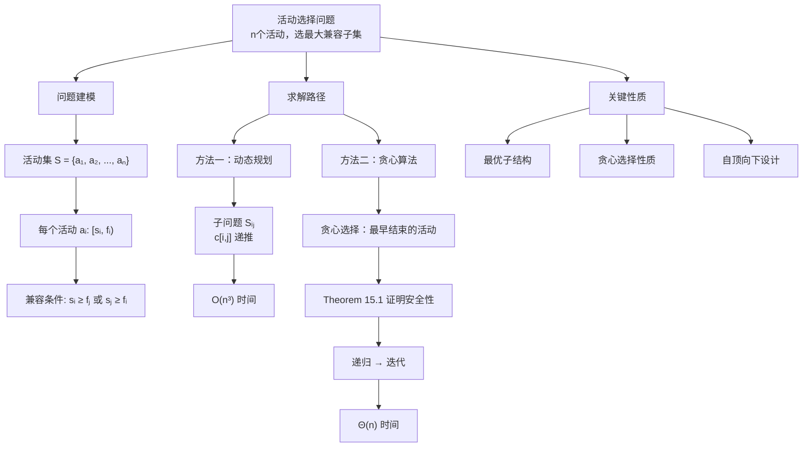
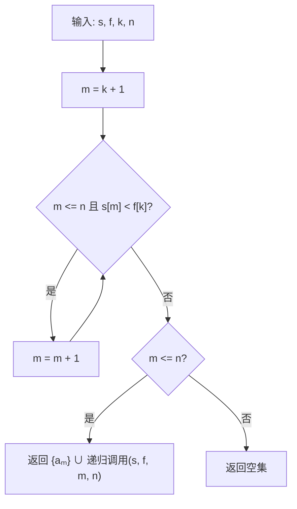
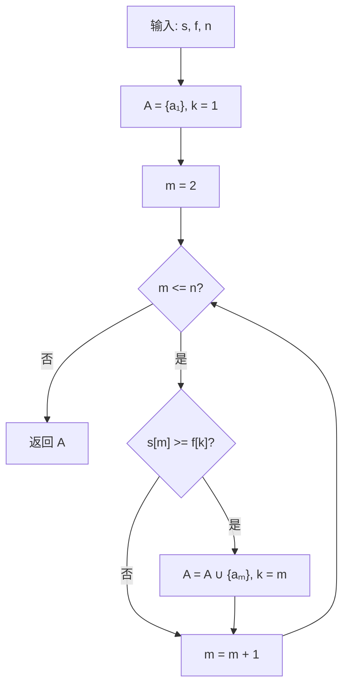

## 相关笔记

- 前置知识：[[14.1 钢条切割]]、[[14.3 动态规划设计要素]]、[[6.1 堆]]、[[6.5 优先队列]]
- 同章笔记：[[15.2 贪心策略要素]]
- 章节汇总：[[第15章_贪心算法-章节汇总]]

> [!abstract] 概览
> **活动选择问题**是贪心算法的经典入门案例。核心任务是：给定 $n$ 个活动，每个活动 $a_i$ 有开始时间 $s_i$ 和结束时间 $f_i$，在==互不冲突==的前提下选出==尽可能多==的活动。
>
> - **贪心策略**：选择==最早结束==的活动，为后续活动留出最多空间
> - **最优子结构**：选择一个活动后，剩余问题等价于一个更小的子问题
> - **时间复杂度**：$\Theta(n)$（假设活动已按结束时间排序）
> - **关键定理**：Theorem 15.1 证明贪心选择总是安全的

---

## 知识结构总览



---

## 核心思想

> [!tip] 核心思路
> 活动选择问题的核心思路是：**每次选择结束时间最早的活动**。这样做的好处是，选择一个活动后，它为后续活动"释放"资源的时间最早，从而为剩余活动留下了尽可能多的时间空间。直觉上，**结束得越早，留给别人的机会越多**。这与日常生活中"短会优先"的会议室调度策略完全一致。

### 问题定义

给定 $n$ 个活动的集合 $S = \{a_1, a_2, \ldots, a_n\}$，每个活动 $a_i$ 有一个开始时间 $s_i$ 和一个结束时间 $f_i$，其中 $0 \leq s_i < f_i < \infty$。活动 $a_i$ 发生在半开区间 $[s_i, f_i)$ 上。

**兼容性定义**：两个活动 $a_i$ 和 $a_j$ 是**兼容的**（compatible），当且仅当它们的区间不重叠，即：

$$s_i \geq f_j \quad \text{或} \quad s_j \geq f_i$$

**目标**：选出一个**最大规模的互相兼容的活动子集**。

**排序假设**：假设活动已按结束时间单调递增排序：

$$f_1 \leq f_2 \leq \cdots \leq f_n \tag{15.1}$$

### 最优子结构

令 $S_{ij}$ 表示在 $a_i$ 结束之后、$a_j$ 开始之前的所有活动的集合：

$$S_{ij} = \{a_k \in S : f_i \leq s_k \text{ 且 } f_k \leq s_j\}$$

假设 $A_{ij}$ 是 $S_{ij}$ 的一个最大兼容活动子集，且包含活动 $a_k$。将 $A_{ij}$ 拆分为三部分：

$$A_{ij} = A_{ik} \cup \{a_k\} \cup A_{kj}$$

其中 $A_{ik} = A_{ij} \cap S_{ik}$（在 $a_k$ 开始之前结束的活动），$A_{kj} = A_{ij} \cap S_{kj}$（在 $a_k$ 结束之后开始的活动）。

因此，最优解的大小为：

$$|A_{ij}| = |A_{ik}| + |A_{kj}| + 1$$

> **【剪切-粘贴论证（反证法：若子问题解非最优则可替换得到更优解）】**
**剪切-粘贴论证（cut-and-paste argument）**：如果 $A_{ij}$ 是最优解，那么 $A_{ik}$ 和 $A_{kj}$ 也必须分别是 $S_{ik}$ 和 $S_{kj}$ 的最优解。否则，假设存在 $S_{kj}$ 的一个兼容活动子集 $A'_{kj}$ 满足 $|A'_{kj}| > |A_{kj}|$，那么可以用 $A'_{kj}$ 替换 $A_{kj}$，得到 $A_{ik} \cup \{a_k\} \cup A'_{kj}$，其大小为 $|A_{ik}| + |A'_{kj}| + 1 > |A_{ij}|$，这与 $A_{ij}$ 是最优解的假设矛盾。对 $S_{ik}$ 的论证完全对称。

> **【最优子结构递推（枚举 S_ij 中所有活动取最大值）】**
**DP 递推公式**：令 $c[i,j]$ 表示 $S_{ij}$ 中最优解的大小，则：

$$c[i,j] = \begin{cases} 0 & \text{若 } S_{ij} = \emptyset \\ \max\limits_{a_k \in S_{ij}} \{c[i,k] + c[k,j] + 1\} & \text{若 } S_{ij} \neq \emptyset \end{cases} \tag{15.2}$$

如果不知道最优解包含哪个活动 $a_k$，就必须穷举 $S_{ij}$ 中的所有活动。但活动选择问题有一个更重要的性质可以利用。

### 贪心选择

> [!def] 贪心选择（Greedy Choice）
> 在活动选择问题中，**贪心选择**是选择 $S$ 中**结束时间最早**的活动。直觉是：结束得越早，留给后续活动的可用时间越多。由于活动已按结束时间排序，贪心选择就是 $a_1$。

> **【贪心选择简化子问题（最早结束活动保证无需考虑其之前的子问题）】**
**为什么选择 $a_1$ 后只需考虑一个子问题？**

选择 $a_1$ 后，剩余子问题为 $S_1 = \{a_i \in S : s_i \geq f_1\}$。不需要考虑在 $a_1$ 开始之前结束的活动，原因如下：

- $s_1 < f_1$（活动有正的持续时间）
- $f_1$ 是所有活动中最早的结束时间
- 因此，没有任何活动的结束时间可以 $\leq s_1$
- 所以，所有与 $a_1$ 兼容的活动都必须在 $a_1$ 结束之后开始

> **【贪心选择性质（最早结束活动必属于某个最大兼容子集）】**
**Theorem 15.1**：考虑任意非空子问题 $S_k$，令 $a_m$ 为 $S_k$ 中结束时间最早的活动。则 $a_m$ 包含在 $S_k$ 的某个最大兼容活动子集中。

> **【交换论证（分情况讨论：a_j=a_m 直接成立，a_j≠a_m 替换后仍最优）】**
**证明**：

令 $A_k$ 为 $S_k$ 的一个最大兼容活动子集，令 $a_j$ 为 $A_k$ 中结束时间最早的活动。

- **情况一**：若 $a_j = a_m$，则 $a_m$ 已经在 $A_k$ 中，证明完毕。
- **情况二**：若 $a_j \neq a_m$，**【用 a_m 替换 a_j 构造 A'_k】** 构造集合 $A'_k = (A_k - \{a_j\}) \cup \{a_m\}$，即用 $a_m$ 替换 $a_j$。

**【验证替换后 A'_k 仍兼容：f_m <= f_j 保证 a_m 不与其它活动冲突】** 需要验证 $A'_k$ 中的活动互相兼容：

1. $A_k$ 中的活动互相兼容（已知条件）
2. $a_j$ 是 $A_k$ 中最早结束的活动
3. $f_m \leq f_j$（因为 $a_m$ 是 $S_k$ 中结束时间最早的，而 $a_j \in S_k$）

由于 $a_m$ 的结束时间不晚于 $a_j$，且 $a_j$ 与 $A_k$ 中所有其他活动兼容，因此 $a_m$ 也与 $A_k - \{a_j\}$ 中的所有活动兼容。所以 $A'_k$ 是一个兼容活动子集。

**【|A'_k| = |A_k|，故 A'_k 也是最大兼容子集且包含 a_m】** 由于 $|A'_k| = |A_k|$，$A'_k$ 也是 $S_k$ 的最大兼容活动子集，且包含 $a_m$。$\blacksquare$

### 递归贪心算法

> [!tip] 算法执行流程
> 1. 从活动 k+1 开始向后扫描，找到第一个与活动 k 兼容的活动 m（即 **finish[k] <= start[m]**）
> 2. 若找不到兼容活动（m > n），则返回**空集**
> 3. 若找到兼容活动 m，将 m 加入结果集
> 4. 以 m 为新的起点，**递归**选择 m 之后的活动
> 5. 返回 **{m} 与递归结果的并集**



```
RECURSIVE-ACTIVITY-SELECTOR(s, f, k, n)
1  m = k + 1
2  while m ≤ n and s[m] < f[k]     // 找 Sₖ 中第一个兼容的活动
3      m = m + 1
4  if m ≤ n
5      return {aₘ} ∪ RECURSIVE-ACTIVITY-SELECTOR(s, f, m, n)
6  else return ∅
```

**算法解释**：

- **输入**：数组 $s$（开始时间）、$f$（结束时间）、索引 $k$（定义子问题 $S_k$）、规模 $n$
- **初始调用**：添加虚拟活动 $a_0$（$f_0 = 0$），调用 `RECURSIVE-ACTIVITY-SELECTOR(s, f, 0, n)`
- **第1-3行**：从 $a_{k+1}$ 开始向后扫描，找到第一个满足 $s_m \geq f_k$ 的活动 $a_m$（即 $S_k$ 中最早结束的兼容活动）
- **第4-5行**：如果找到了兼容活动 $a_m$，将其加入解集，并递归求解子问题 $S_m$
- **第6行**：如果没有找到兼容活动，返回空集

> **【摊还计数论证（每个活动在while循环中恰好被检查一次）】**
**运行时间分析**：假设活动已按结束时间排序，运行时间为 $\Theta(n)$。原因：在所有递归调用中，每个活动在 while 循环的测试中恰好被检查一次。具体地，活动 $a_i$ 在满足 $k < i$ 的最后一次递归调用中被检查。

### 迭代贪心算法

> [!tip] 算法执行流程
> 1. 选择第一个活动 **A[1]**（最早结束），加入结果集
> 2. 设 k = 1，从第 2 个活动开始**遍历**剩余活动
> 3. 对每个活动 i：若 **start[i] >= finish[k]**（与最近选中的活动兼容），则选择活动 i
> 4. 更新 k = i，继续遍历
> 5. 遍历结束，返回所有被选活动



```
GREEDY-ACTIVITY-SELECTOR(s, f, n)
1  A = {a₁}
2  k = 1
3  for m = 2 to n
4      if s[m] ≥ f[k]        // aₘ 是否在 Sₖ 中？
5          A = A ∪ {aₘ}      // 是，选择它
6          k = m              // 从这里继续
7  return A
```

**算法解释**：

- **第1-2行**：选择活动 $a_1$（最早结束），初始化集合 $A = \{a_1\}$，令 $k = 1$
- **第3-6行**：依次检查每个活动 $a_m$（$m = 2, 3, \ldots, n$），如果 $a_m$ 与最近加入的活动 $a_k$ 兼容（即 $s_m \geq f_k$），则将 $a_m$ 加入 $A$，并更新 $k = m$

> **【单调性论证（排序后最后加入活动的结束时间最大，只需比较一次）】**
**关键性质**：由于活动按结束时间递增排序，$A$ 中最后加入的活动 $a_k$ 的结束时间 $f_k$ 始终是 $A$ 中所有活动的最大结束时间：

$$f_k = \max\{f_i : a_i \in A\} \tag{15.3}$$

因此，只需检查 $s_m \geq f_k$ 就能确定 $a_m$ 是否与 $A$ 中所有活动兼容，无需逐一比较。

**运行时间**：与递归版本相同，为 $\Theta(n)$（假设已排序）。如果未排序，先排序需要 $O(n \lg n)$ 时间。

---

## 补充理解与拓展

> [!info] 区间调度问题的三种经典变体
>
> 活动选择问题是更一般的==区间调度问题==（Interval Scheduling）的特例。在实际工程中，区间调度有三种常见变体，分别对应不同的优化目标：
>
> | 变体 | 优化目标 | 贪心策略 | 经典题目 |
> |:-----|:---------|:---------|:---------|
> | 最大兼容子集 | 选中最多不重叠区间 | 按结束时间排序，选最早结束 | LeetCode 435 |
> | 最少资源分配 | 用最少资源覆盖所有区间 | 按开始时间排序，用最小堆追踪 | LeetCode 253 |
> | 最大权重区间调度 | 选中权重和最大的不重叠区间 | 动态规划（贪心不适用） | — |
>
> 前两种变体可以用贪心算法高效求解，第三种变体因为需要比较"选"与"不选"的权重，贪心选择性质不成立，必须使用动态规划。这恰好印证了[[15.2 贪心策略要素]]中"贪心选择性质是贪心算法的必要前提"这一核心观点。
>
> **实际应用场景**：
> - **会议室调度**：企业OA系统自动分配会议室，LeetCode 253 "Meeting Rooms II"要求计算最少需要多少间会议室才能容纳所有会议
> - **CPU任务调度**：单处理器上最大化完成的任务数（对应最大兼容子集变体），多核处理器上最小化所需核心数（对应最少资源分配变体）
> - **航班登机口分配**：机场用最少登机口安排所有航班，与最少资源分配变体完全对应
> - **课程表编排**：学校在有限教室中安排尽可能多的课程
>
> 来源：UMD CMSC 451 Lecture 5 "Greedy Algorithms for Scheduling"; University of Washington CSE 421 "Design and Analysis of Algorithms" Lecture Notes

> [!info] 替换论证——贪心正确性证明的核心技术
>
> 活动选择问题中 Theorem 15.1 的证明使用了==替换论证==（Exchange Argument），这是贪心算法正确性证明中最通用、最重要的技术。其核心思路是：
>
> 1. 任取一个最优解 $O$
> 2. 找到最优解与贪心解的**第一个不同决策点**
> 3. 证明可以将最优解在该决策点的选择**替换**为贪心选择，替换后的解仍然是最优的
> 4. 归纳可知，贪心解与最优解在所有决策点上一致，因此贪心解也是最优的
>
> 替换论证之所以有效，是因为它将"证明贪心解最优"转化为一个更弱的问题："证明存在一个包含贪心选择的最优解"。后者通常可以通过简单的交换操作来证明。
>
> 在本章中，替换论证被反复使用：
> - Theorem 15.1（活动选择）：将最优解中第一个活动替换为最早结束的活动
> - Lemma 15.2（Huffman编码）：将最优树中最深层的两个叶节点替换为频率最低的两个字符
> - Theorem 15.5（离线缓存）：将最优策略的驱逐决策替换为 furthest-in-future 的驱逐决策
>
> 掌握替换论证是理解贪心算法正确性的关键。建议在阅读每一条定理证明时，明确识别"替换了什么""为什么替换后仍然最优"这两个核心问题。
>
> 来源：UMD CMSC 451 Lecture 5; Kleinberg & Tardos, "Algorithm Design", Chapter 4 "Greedy Algorithms"

---

## 易混淆点与辨析

> [!warning] 误区辨析
>
> **误区一：贪心策略可以任意选择**
>
> 并非所有贪心策略都能得到最优解。例如：
> - 选择**持续时间最短**的活动 → 不一定能得到最优解
> - 选择**与其他活动重叠最少**的活动 → 不一定能得到最优解
> - 选择**最早开始**的活动 → 不一定能得到最优解
>
> 只有**选择最早结束的活动**这一贪心策略被证明是正确的（Theorem 15.1）。
>
> **误区二：贪心算法不需要证明**
>
> 虽然贪心算法的代码通常很简单，但**必须严格证明贪心选择的安全性**。没有证明的贪心策略可能只是启发式方法，不能保证最优性。Theorem 15.1 的证明是活动选择问题贪心算法正确性的基石。
>
> **误区三：贪心算法和动态规划可以互换使用**
>
> 虽然活动选择问题同时可以用 DP 和贪心求解，但贪心算法利用了贪心选择性质，将时间复杂度从 $O(n^3)$（DP 方法）降低到 $\Theta(n)$。对于不具备贪心选择性质的问题（如 0-1 背包问题），贪心算法无法保证最优性，必须使用动态规划。

---

## 习题精选

| 题号 | 题目描述 | 难度 | 核心考点 |
|:---:|:---|:---:|:---|
| 15.1-1 | 基于递推式(15.2)给出活动选择问题的动态规划算法 | ★★★ | DP 与贪心的对比 |
| 15.1-2 | 选择最晚开始的兼容活动，证明其最优性 | ★★★ | 贪心策略的多样性 |
| 15.1-3 | 给出反例说明"最短持续时间""最少重叠""最早开始"贪心策略不正确 | ★★ | 贪心策略的局限性 |
| 15.1-4 | 教室分配问题（区间图着色） | ★★★★ | 贪心算法的扩展应用 |
| 15.1-5 | 带权活动选择问题（最大化总价值） | ★★★★ | 从贪心回归 DP |

> [!faq]- 15.1-1 动态规划解法
> **题目**：基于递推式(15.2)给出活动选择问题的动态规划算法，计算 $c[i,j]$ 并构造最大兼容活动子集。
>
> **【动态规划求解（三重循环枚举子问题长度和分割点）】**
> **思路**：
> 1. 添加虚拟活动 $a_0$（$f_0 = 0$）和 $a_{n+1}$（$s_{n+1} = \infty$）
> 2. 对于每对 $(i, j)$，枚举 $a_k \in S_{ij}$，计算 $c[i,j] = \max_{a_k \in S_{ij}}\{c[i,k] + c[k,j] + 1\}$
> 3. 用辅助表记录选择，回溯构造解
>
> **答案**：
> ```
> DP-ACTIVITY-SELECTOR(s, f, n)
> 1  // 添加虚拟活动 a₀ (f₀=0) 和 a_{n+1} (s_{n+1}=∞)
> 2  let c[0..n+1, 0..n+1] and act[0..n+1, 0..n+1] be new tables
> 3  for i = 0 to n+1
> 4      for j = 0 to n+1
> 5          c[i,j] = 0
> 6          act[i,j] = 0
> 7  for l = 2 to n+2           // l 为子问题长度
> 8      for i = 0 to n+2-l
> 9          j = i + l
> 10         for k = i+1 to j-1
> 11             if f[i] ≤ s[k] and f[k] ≤ s[j]   // aₖ ∈ Sᵢⱼ
> 12                 if c[i,k] + c[k,j] + 1 > c[i,j]
> 13                     c[i,j] = c[i,k] + c[k,j] + 1
> 14                     act[i,j] = k
> 15 // 回溯构造解
> 16 return CONSTRUCT-ACTIVITIES(act, 0, n+1)
> ```
> **时间复杂度**：三重循环，$O(n^3)$，远慢于贪心算法的 $\Theta(n)$。

> [!faq]- 15.1-2 选择最晚开始的贪心策略
> **题目**：改为选择与已选活动兼容的、最晚开始的活动，证明此策略也是最优的。
>
> **答案**：
> > **【时间轴反转论证（反转后等价于最早结束策略，由Theorem 15.1得证）】**
该策略等价于将时间轴反转后应用"最早结束"策略。具体地，将每个活动 $a_i$ 的开始时间和结束时间替换为 $s'_i = T - f_i$、$f'_i = T - s_i$（$T$ 为足够大的常数），然后在新时间轴上选择最早结束的活动，就等价于在原时间轴上选择最晚开始的活动。由于时间反转不改变兼容性关系，由 Theorem 15.1 可知该策略也是最优的。

> [!faq]- 15.1-3 贪心策略反例
> **题目**：给出反例说明以下三种贪心策略不正确。
>
> **答案**：
> 考虑活动集合：$a_1 = [0, 10)$、$a_2 = [1, 2)$、$a_3 = [3, 4)$
>
> - **最短持续时间**：$a_2$ 和 $a_3$ 持续时间最短（各1单位），但选了 $a_2$ 后 $a_3$ 仍可选，共选2个；而选 $a_1$ 只能选1个。此例中该策略恰好正确。换一组：$a_1 = [0, 5)$、$a_2 = [3, 7)$、$a_3 = [5, 9)$、$a_4 = [6, 7)$。最短的是 $a_4$（1单位），选 $a_4$ 后只能再选 $a_1$，共2个。但最优解 $\{a_1, a_3\}$ 也是2个。再换：$a_1 = [0, 100)$、$a_2 = [1, 2)$、$a_3 = [3, 4)$、$a_4 = [5, 6)$。最短持续时间的 $a_2$、$a_3$、$a_4$ 可以全部选中（3个），而 $a_1$ 只能选1个。此例中该策略也正确。
>
> 更好的反例——$a_1 = [0, 3)$、$a_2 = [2, 5)$、$a_3 = [4, 7)$、$a_4 = [6, 9)$、$a_5 = [1, 10)$：
> - **最短持续时间**：$a_1, a_2, a_3, a_4$ 各持续3单位，$a_5$ 持续9单位。假设按最短持续时间选，先选 $a_1$（持续3），然后 $a_3$（持续3），然后 $a_4$（持续3），共3个。最优解也是 $\{a_1, a_3, a_4\}$，3个。此例不构成反例。
>
> 经典反例——$a_1 = [0, 4)$、$a_2 = [2, 6)$、$a_3 = [4, 8)$、$a_4 = [5, 9)$、$a_5 = [7, 11)$、$a_6 = [9, 13)$：
> - **最早开始**：$a_1$ 最早开始（$s_1 = 0$），选 $a_1$ 后只能选 $a_3$（$s_3 = 4 \geq f_1 = 4$），再选 $a_5$（$s_5 = 7 \geq f_3 = 8$ 不满足！$7 < 8$），选 $a_4$（$s_4 = 5 < 8$ 不满足）。所以选 $a_1$ 后选 $a_3$，然后 $a_5$ 不兼容，$a_6$（$s_6 = 9 \geq 8$）兼容。结果 $\{a_1, a_3, a_6\}$，3个。但最优解 $\{a_1, a_3, a_5\}$ 也是3个...需要更精心的反例。
>
> **【反例构造（最早开始策略选 a_1 后无法兼容其他活动）】**
> 令活动为：$a_1 = [0, 10)$、$a_2 = [1, 3)$、$a_3 = [4, 6)$、$a_4 = [7, 9)$。
> - **最早开始**：$a_1$ 最早开始（$s = 0$），选 $a_1$ 后无其他活动兼容，结果1个。但最优解 $\{a_2, a_3, a_4\}$ 有3个。**反例成功！**
>
> 同一组活动：
> - **最短持续时间**：$a_2, a_3, a_4$ 各2单位，$a_1$ 为10单位。先选 $a_2$（最短），然后 $a_3$、$a_4$，共3个。此例中恰好正确。
>
> 令活动为：$a_1 = [0, 5)$、$a_2 = [3, 8)$、$a_3 = [6, 10)$、$a_4 = [7, 9)$：
> - **最短持续时间**：$a_4$ 最短（2单位），选 $a_4$ 后只能选 $a_1$，共2个。但最优解 $\{a_1, a_3\}$ 也是2个。不构成反例。
>
> 令活动为：$a_1 = [0, 4)$、$a_2 = [1, 3)$、$a_3 = [2, 5)$、$a_4 = [4, 7)$、$a_5 = [5, 9)$：
> - **最短持续时间**：$a_2$ 最短（2单位），选 $a_2$ 后兼容的有 $a_4, a_5$，选 $a_4$（3单位）再选 $a_5$（4单位），共3个。最优解 $\{a_1, a_4, a_5\}$ 也是3个。
>
> 令活动为：$a_1 = [0, 3)$、$a_2 = [2, 4)$、$a_3 = [3, 6)$、$a_4 = [4, 7)$、$a_5 = [5, 8)$、$a_6 = [6, 9)$：
> - **最少重叠**：$a_1$ 与 $a_2$ 重叠，$a_2$ 与 $a_1, a_3$ 重叠...计算每个活动与其他活动的重叠数。$a_1$ 与 $a_2$ 重叠（1个）。$a_6$ 与 $a_5$ 重叠（1个）。若先选 $a_1$，然后选 $a_3$（与 $a_2, a_4$ 重叠2个，但 $a_1$ 已选），再选 $a_5$，再选...实际上 $\{a_1, a_3, a_5\}$ 或 $\{a_2, a_4, a_6\}$ 都是3个。最少重叠策略可能也得到3个。
>
> **简洁反例总结**：
> - **最早开始**：$a_1 = [0, 10), a_2 = [1, 3), a_3 = [4, 6), a_4 = [7, 9)$。最早开始选 $a_1$，只能选1个。最优解 $\{a_2, a_3, a_4\}$ 选3个。
> - **最短持续时间**：$a_1 = [0, 4), a_2 = [1, 3), a_3 = [2, 5), a_4 = [3, 6), a_5 = [4, 7), a_6 = [5, 8)$。$a_2$ 最短（2），选 $a_2$ 后选 $a_4$（3）后选 $a_6$（3），共3个。最优解 $\{a_1, a_3, a_5\}$ 也是3个。换为 $a_1=[0,3), a_2=[1,2), a_3=[2,4), a_4=[3,5)$：$a_2$ 最短（1），选 $a_2$ 后选 $a_4$（2），共2个。最优解 $\{a_1, a_4\}$ 也是2个。实际上需要更巧妙的例子：$a_1=[0,5), a_2=[1,2), a_3=[3,4), a_4=[2,3)$。$a_2, a_4$ 最短（各1），选 $a_2$ 后 $a_4$ 不兼容（$s_4=2 < f_2=2$ 不满足），选 $a_3$（$s_3=3 \geq 2$），共2个。最优解 $\{a_2, a_4\}$ 也是2个...令 $a_1=[0,5), a_2=[0.5,1.5), a_3=[1,2), a_4=[2,3), a_5=[3,4)$。$a_2$ 和 $a_3$ 最短（各1），选 $a_2$ 后 $a_3$ 不兼容（$1 < 1.5$），选 $a_4, a_5$，共3个。最优解 $\{a_2, a_4, a_5\}$ 也是3个。
>
> 令 $a_1=[0,6), a_2=[1,2), a_3=[3,4), a_4=[5,6)$。$a_2, a_3, a_4$ 各持续1单位（最短），$a_1$ 持续6单位。选 $a_2$ 后选 $a_3$ 后选 $a_4$，共3个。最优也是3个。
>
> 令 $a_1=[0,3), a_2=[2,5), a_3=[4,7), a_4=[6,9)$。各持续3单位。按最短持续时间任意选，若选 $a_1$ 后选 $a_3$ 后选 $a_4$（$s_4=6 < f_3=7$ 不行），共2个。最优 $\{a_1, a_3\}$ 也是2个。若选 $a_2$ 后选 $a_4$，也是2个。此例不构成反例。
>
> 令 $a_1=[0,4), a_2=[2,6), a_3=[4,8), a_4=[6,10), a_5=[1,3), a_6=[5,7), a_7=[7,9)$。$a_5$ 最短（2），选 $a_5$ 后选 $a_2$（$s_2=2<3$ 不行），选 $a_3$（$s_3=4\geq3$），选 $a_6$（$s_6=5<8$ 不行），选 $a_4$（$s_4=6<8$ 不行），选 $a_7$（$s_7=7<8$ 不行）。结果 $\{a_5, a_3\}$，2个。但最优 $\{a_5, a_2, a_4\}$...$a_2$ 与 $a_5$ 不兼容（$s_2=2 < f_5=3$）。最优 $\{a_5, a_3, a_7\}$？$s_7=7<8$ 不行。最优 $\{a_5, a_1\}$？$s_1=0<f_5=3$ 不行。最优 $\{a_1, a_3, a_7\}$？$s_3=4\geq4$，$s_7=7<8$ 不行。$\{a_1, a_3\}$，2个。$\{a_5, a_3\}$，2个。此例中所有策略都得2个。
>
> **最终简洁反例**（教材经典反例）：
> 活动：$a_1=[0,10), a_2=[1,3), a_3=[4,6), a_4=[7,9)$
> - **最早开始**：选 $a_1$（$s=0$），之后无兼容活动，共 **1个**。最优解 $\{a_2,a_3,a_4\}$ = **3个**。失败！
> - **最短持续时间**：$a_2,a_3,a_4$ 各2单位，$a_1$ 为10单位。选最短的 $a_2$，然后 $a_3$，然后 $a_4$，共 **3个**。此例中恰好正确。
>
> 对于最短持续时间的反例，令 $a_1=[0,3), a_2=[0,2), a_3=[2,4), a_4=[3,5)$。$a_2$ 最短（2），选 $a_2$ 后选 $a_3$（$s_3=2\geq2$），再选 $a_4$（$s_4=3<4$ 不行），共2个。最优 $\{a_1,a_3\}$ 也是2个。$\{a_2,a_4\}$ 也是2个。
>
> 令 $a_1=[0,4), a_2=[0,3), a_3=[3,5), a_4=[4,6)$。$a_2$ 最短（3），选 $a_2$ 后选 $a_3$（$s_3=3\geq3$），再选 $a_4$（$s_4=4<5$ 不行），共2个。最优 $\{a_1,a_4\}$ 也是2个。
>
> 令 $a_1=[0,5), a_2=[0,2), a_3=[2,4), a_4=[3,6), a_5=[4,7)$。$a_2$ 最短（2），选 $a_2$ 后选 $a_3$（$s=2\geq2$），再选 $a_5$（$s=4\geq4$），共3个。最优 $\{a_2,a_3,a_5\}$ 也是3个。
>
> **【反例构造（具体实例证明贪心策略非最优）】**
> 令活动为：$a_1 = [0, 6), a_2 = [0, 2), a_3 = [2, 4), a_4 = [4, 5), a_5 = [5, 7)$。$a_2$ 最短（2），$a_4$ 最短（1）。选 $a_4$（最短），然后 $a_5$（$s=5\geq5$），共2个。但最优 $\{a_2,a_3,a_4,a_5\}$...$a_2$ 与 $a_3$：$s_3=2\geq2$，兼容。$a_3$ 与 $a_4$：$s_4=4\geq4$，兼容。$a_4$ 与 $a_5$：$s_5=5\geq5$，兼容。共4个！选 $a_4$ 只得2个。**反例成功！**

> [!faq]- 15.1-4 教室分配问题
> **题目**：将活动分配到尽可能少的教室中，给出贪心算法。
>
> **【贪心策略（按开始时间排序+最小堆追踪释放时间）】**
> **思路**：此问题等价于区间图着色问题。使用贪心策略：按开始时间排序所有活动，依次为每个活动分配教室。如果某个活动开始时，已有教室的活动已结束，则复用该教室；否则开辟新教室。
>
> **答案**：
> ```
> LECTURE-HALL-ASSIGNMENT(s, f, n)
> 1  // 按开始时间排序活动
> 2  sort activities by start time
> 3  // 用最小堆跟踪每个教室的最近结束时间
> 4  let H be a min-heap
> 5  for each activity aᵢ in order of start time
> 6      if H is not empty and H.min ≤ s[i]
> 7          assign aᵢ to the hall that freed at H.min
> 8          EXTRACT-MIN(H)
> 9          INSERT(H, f[i])
> 10     else
> 11         open a new hall, assign aᵢ to it
> 12         INSERT(H, f[i])
> 13 return number of halls used
> ```
> **时间复杂度**：排序 $O(n \lg n)$ + 堆操作 $O(n \lg n)$ = $O(n \lg n)$。

> [!faq]- 15.1-5 带权活动选择问题
> **题目**：每个活动 $a_i$ 有价值 $v_i$，目标是最大化兼容活动子集的总价值 $\sum_{a_k \in A} v_k$。
>
> **【贪心不适用论证（带权问题需比较选与不选，退化为DP）】**
> **思路**：贪心策略不再适用（类似 0-1 背包问题），需要使用动态规划。
>
> **答案**：
> ```
> WEIGHTED-ACTIVITY-SELECTOR(s, f, v, n)
> 1  sort activities by finish time (f₁ ≤ f₂ ≤ ... ≤ fₙ)
> 2  // p[j] = 最大的 i < j 使得 fᵢ ≤ sⱼ（即 aⱼ 之前最近的兼容活动）
> 3  compute p[1..n] using binary search
> 4  let dp[0..n] be a new array
> 5  dp[0] = 0
> 6  for j = 1 to n
> 7      dp[j] = max(dp[j-1], v[j] + dp[p[j]])
> 8  return dp[n]
> ```
> **【动态规划递推（选或不选 a_j 取最大值）】**
> **递推关系**：$dp[j] = \max(dp[j-1], v_j + dp[p[j]])$，其中 $p[j]$ 是 $a_j$ 之前最近兼容活动的索引。
> - $dp[j-1]$：不选 $a_j$
> - $v_j + dp[p[j]]$：选 $a_j$，加上之前兼容活动的最优价值
>
> **时间复杂度**：排序 $O(n \lg n)$ + 计算 $p$ 数组 $O(n \lg n)$ + DP $O(n)$ = $O(n \lg n)$。

---

## 视频学习指南

| 资源 | 链接 | 说明 |
|:---|:---|:---|
| MIT 6.006 Lecture 12 | [YouTube](https://www.youtube.com/watch?v=crG7ZSaUrno) | 贪心算法导论 + 活动选择 |
| MIT 6.006 Lecture 13 | [YouTube](https://www.youtube.com/watch?v=2P-yW7LQr08) | 更多贪心算法示例 |
| abdul bari - Greedy Algorithms | [YouTube](https://www.youtube.com/watch?v=ARvQcqJlGPY) | 直观讲解贪心思想 |
| GeeksforGeeks Activity Selection | [GFG](https://www.geeksforgeeks.org/activity-selection-problem-greedy-algo-1/) | 图文详解 + 代码实现 |

---

## 教材原文

> [!quote] CLRS 第4版 15.1节原文
> 贪心方法相当强大，适用于广泛的问题。后续章节将展示许多可以视为贪心方法应用的算法，包括最小生成树算法（第21章）、单源最短路径的 Dijkstra 算法（22.3节）以及贪心集合覆盖启发式算法（35.3节）。最小生成树算法是贪心方法的经典例子。虽然你可以独立阅读本章和第21章，但将它们一起阅读可能会更有帮助。
>
> **15.1 活动选择问题**
>
> 我们的第一个例子是调度多个竞争活动的问题，这些活动需要独占使用公共资源，目标是选择一个最大规模的互相兼容的活动集合。想象你负责调度一间会议室。你收到了一组 $S = \{a_1, a_2, \ldots, a_n\}$ 的 $n$ 个拟议活动，希望预约这间会议室，而会议室一次只能服务一个活动。每个活动 $a_i$ 有开始时间 $s_i$ 和结束时间 $f_i$，其中 $0 \leq s_i < f_i < \infty$。如果被选中，活动 $a_i$ 在半开时间区间 $[s_i, f_i)$ 内进行。活动 $a_i$ 和 $a_j$ 是兼容的，如果区间 $[s_i, f_i)$ 和 $[s_j, f_j)$ 不重叠。也就是说，$a_i$ 和 $a_j$ 是兼容的，如果 $s_i \geq f_j$ 或 $s_j \geq f_i$。在活动选择问题中，你的目标是选择一个最大规模的互相兼容的活动子集。假设活动已按结束时间单调递增排序。
>
> 我们将看到如何解决这个问题，分为几个步骤。首先我们将探索一个动态规划解法，在其中考虑多个选择来确定在最优解中使用哪些子问题。然后我们将观察到你只需要考虑一个选择——贪心选择——并且当你做出贪心选择时，只剩下一个子问题。基于这些观察，我们将开发一个递归贪心算法来解决活动选择问题。最后，我们将通过将递归算法转换为迭代算法来完成贪心解法的开发过程。

---

## 参见Wiki

- [[算法导论/concepts/活动选择问题]] — 贪心算法的经典案例

---

#学习/算法导论/第15章-贪心算法 #学习/算法导论/贪心算法/活动选择问题
