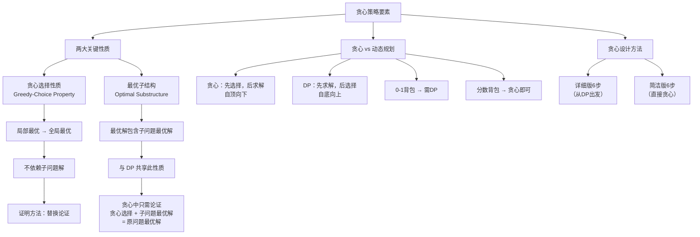

## 相关笔记

- 前置知识：[[14.1 钢条切割]]、[[14.3 动态规划设计要素]]、[[6.1 堆]]、[[6.5 优先队列]]
- 同章笔记：[[15.1 活动选择问题]]
- 章节汇总：[[第15章_贪心算法-章节汇总]]

> [!abstract] 概览
> 本节系统总结贪心算法的==设计方法论==，提炼出两个关键性质：==贪心选择性质==（greedy-choice property）和==最优子结构==（optimal substructure）。通过 **0-1 背包问题 vs 分数背包问题**的对比，揭示贪心与动态规划的==本质区别==。
>
> - **贪心选择性质**：局部最优选择能导致全局最优解
> - **最优子结构**：最优解包含子问题的最优解（与 DP 共享）
> - **核心区别**：贪心==先选择后求解==（自顶向下），DP==先求解后选择==（自底向上）
> - **设计方法**：两种 6 步流程（详细版 vs 简洁版）

---

## 知识结构总览



---

## 核心思想

> [!tip] 核心思路
> 贪心算法通过一系列**局部最优选择**来构造全局最优解。判断一个问题能否用贪心算法求解，关键在于验证两个性质：**贪心选择性质**（能否安全地做出局部最优选择）和**最优子结构**（做出选择后的子问题是否保持最优性）。贪心算法与动态规划共享最优子结构，但本质区别在于**求解顺序**：贪心先做选择再解子问题（自顶向下），动态规划先解子问题再做选择（自底向上）。

### 贪心算法定义

> [!def] 贪心算法（Greedy Algorithm）
> 贪心算法通过做出一系列选择来获得问题的最优解。在每个决策点，算法做出在当前看来最好的选择。这种启发式策略并不总是产生最优解，但在某些问题（如[[15.1 活动选择问题]]）中确实如此。

### 贪心选择性质（Greedy-Choice Property）

**定义**：可以通过做出**局部最优（贪心）选择**来组装全局最优解。换言之，在考虑做哪个选择时，只需做出在当前问题中看起来最好的选择，**无需考虑子问题的解**。

**贪心与 DP 的关键区别**：

在动态规划中，每步也做选择，但选择通常**依赖于子问题的解**。因此，DP 通常以**自底向上**的方式求解，从小子问题推进到大子问题。

在贪心算法中，做出在当前看来最好的选择，然后求解**剩下的子问题**。贪心选择可能依赖于之前的选择，但**不能依赖于未来的选择或子问题的解**。因此，贪心算法在求解任何子问题之前就做出第一个选择，通常以**自顶向下**的方式推进。

> **【替换论证（修改最优解将贪心选择替换进去，证明存在包含贪心选择的最优解）】**
**证明贪心选择性质的一般方法**：

通常，如 Theorem 15.1 中的证明方式，考察某个子问题的全局最优解，然后说明如何修改该解，将贪心选择替换为其他选择，从而得到一个类似的但更小的子问题。这种"替换论证"（exchange argument）是证明贪心选择安全性的标准技术。

**贪心选择的效率优势**：

通常，做出贪心选择比考虑更广泛的选择集更高效。例如，在活动选择问题中，假设活动已按结束时间排序，每个活动只需被检查一次。通过预处理输入或使用适当的数据结构（通常是[[6.5 优先队列]]），可以快速做出贪心选择，从而得到高效算法。

### 最优子结构（Optimal Substructure）

正如在第14章中看到的，如果一个问题的最优解包含了子问题的最优解，则该问题具有最优子结构。这个性质是评估动态规划是否适用的关键要素，对贪心算法也同样至关重要。

回顾 15.1 节的例子：如果 $S_{ij}$ 的最优解包含活动 $a_k$，则它也必须包含 $S_{ik}$ 和 $S_{kj}$ 的最优解。给定这个最优子结构，如果我们知道用哪个活动作为 $a_k$，就可以通过选择 $a_k$ 加上 $S_{ik}$ 和 $S_{kj}$ 的最优解中的所有活动来构造 $S_{ij}$ 的最优解。

**贪心算法中对最优子结构的使用方式**：

> **【归纳法（贪心选择+子问题最优解=原问题最优解）】**
在贪心算法中，对最优子结构的使用通常更直接。由于可以假设已经通过贪心选择到达了子问题，只需论证：**子问题的最优解，结合已做出的贪心选择，能产生原问题的最优解**。这个方案隐式地使用了对子问题的归纳法来证明每一步都做出贪心选择能产生最优解。

### 贪心 vs 动态规划：0-1 背包 vs 分数背包

**0-1 背包问题**：一个小偷抢劫商店，想带走背包能容纳的最多价值的物品。背包最多能装 $W$ 磅。商店有 $n$ 件物品，第 $i$ 件物品价值 $v_i$ 美元、重量 $w_i$ 磅。小偷必须对每件物品做出二元选择：**要么全拿，要么不拿**（不能拿部分）。

**分数背包问题**：设置相同，但小偷可以拿物品的**分数**，不必做出二元（0-1）选择。可以把 0-1 背包中的物品想象成金锭，分数背包中的物品想象成金粉。

**数值实例**：

| 物品 | 重量 $w_i$（磅） | 价值 $v_i$（美元） | 单位价值 $v_i/w_i$（美元/磅） |
|:---:|:---:|:---:|:---:|
| 1 | 10 | 60 | 6 |
| 2 | 20 | 100 | 5 |
| 3 | 30 | 120 | 4 |

背包容量：$W = 50$ 磅。

> **【反例论证（按单位价值贪心选物品1+2得160美元，最优为物品2+3得220美元）】**
**0-1 背包的贪心策略失败**：

贪心策略按单位价值排序，先选物品1（单位价值6美元/磅最高）。

- 选物品1（10磅，60美元），剩余容量40磅
- 再选物品2（20磅，100美元），剩余容量20磅
- 再选物品3（30磅 > 20磅，放不下）
- 总价值：$60 + 100 = 160$ 美元

但最优解是选物品2和物品3：
- 选物品2（20磅，100美元）+ 物品3（30磅，120美元）= 50磅
- 总价值：$100 + 120 = 220$ 美元

贪心解（160美元）远低于最优解（220美元）。**失败原因**：选择物品1后，背包有20磅的空闲空间无法利用，降低了装载的有效单位价值。

> **【贪心成功论证（可取分数恰好装满背包，无空间浪费）】**
**分数背包的贪心策略成功**：

贪心策略同样按单位价值排序：
- 先拿物品1的全部（10磅，60美元），剩余容量40磅
- 再拿物品2的全部（20磅，100美元），剩余容量20磅
- 再拿物品3的 $20/30 = 2/3$（20磅，$120 \times 2/3 = 80$ 美元）
- 总价值：$60 + 100 + 80 = 240$ 美元

由于可以取分数，贪心策略能将背包恰好装满，得到最优解。

> **【贪心选择性质不成立论证（0-1背包需比较选与不选的子问题解）】**
**为什么贪心对 0-1 背包失败？**

在 0-1 背包中，当考虑是否将某物品放入背包时，必须**比较包含该物品的子问题解与排除该物品的子问题解**，然后才能做出选择。这种问题表述产生了许多重叠子问题——这是动态规划的标志。因此，0-1 背包问题需要动态规划来求解。

### 贪心算法设计方法

**方法一：详细版 6 步（从 DP 出发，如 15.1 节所用）**

1. 确定问题的最优子结构
2. 开发递归解法（对于活动选择问题，我们建立了递推式(15.2)，但绕过了仅基于该递推式开发递归算法）
3. 证明如果做出贪心选择，则只剩下一个子问题
4. 证明做出贪心选择总是安全的（步骤3和4可以互换顺序）
5. 开发实现贪心策略的递归算法
6. 将递归算法转换为迭代算法

**方法二：简洁版 6 步（直接贪心设计，后续章节使用）**

1. 将优化问题表述为：做出一个选择后，只剩下一个子问题需要求解
2. 证明原问题总是存在一个做出贪心选择的最优解，因此贪心选择总是安全的
3. 通过证明以下事实来展示最优子结构：做出贪心选择后，剩下的是一个子问题，且将该子问题的最优解与已做出的贪心选择组合，能得到原问题的最优解

**两种方法的关系**：

详细版方法更侧重于展示贪心算法的动态规划根基。例如，活动选择问题的第一版子问题定义为 $S_{ij}$（两个下标都变化），然后发现如果总是做出贪心选择，可以将子问题限制为 $S_k$ 的形式。简洁版方法则直接从贪心角度出发设计子问题。然而，**每个贪心算法的背后，几乎总是存在一个更繁琐的动态规划解法**。

---

## 补充理解与拓展

> [!info] 贪心算法与拟阵理论——贪心最优性的数学基础
>
> 一个自然的问题是：**什么样的优化问题可以用贪心算法求得最优解？** 这个问题有一个精确的数学回答：==拟阵==（Matroid）。
>
> **拟阵**是由 Whitney（1935）和 Edmonds（1971）等人发展起来的组合结构。形式化地说，拟阵 $M = (S, I)$ 由有限集合 $S$ 和 $S$ 的子集族 $I$（称为独立集族）组成，满足：
> 1. **遗传性**：若 $A \in I$ 且 $B \subseteq A$，则 $B \in I$
> 2. **交换性**：若 $A, B \in I$ 且 $|A| > |B|$，则存在 $a \in A \setminus B$ 使得 $B \cup \{a\} \in I$
>
> **Rado-Edmonds 定理**：对于任何拟阵 $M = (S, I)$ 和任何权重函数 $w : S \to \mathbb{R}$，按权重从大到小贪心地选择元素，总能得到==最大权独立集==。反之，如果一个组合优化问题上的贪心算法对所有权重函数都能得到最优解，则该问题的独立集族构成一个拟阵。
>
> 这意味着拟阵精确刻画了"贪心算法总能成功"的问题类。经典例子：
> - **最小生成树**：图的森林构成一个拟阵（图拟阵），Kruskal 算法正是贪心算法在图拟阵上的应用（第21章 最小生成树）
> - **活动选择问题**：虽然不直接是拟阵问题，但其贪心选择性质可以用类似的交换论证证明
>
> 值得注意的是，0-1 背包问题的独立集族**不构成拟阵**，因此贪心算法不能保证最优——这与教材中的分析完全一致。
>
> 来源：Edmonds, J. (1971). "Matroids and the Greedy Algorithm", Mathematical Programming; Oxley, J. (2007). "What is a Matroid?", Notices of the AMS; 南京大学 Advanced Algorithms (2025) 课程讲义

> [!info] 贪心 vs 动态规划——决策流程图
>
> 在实际面对一个优化问题时，如何判断应该用贪心还是动态规划？以下决策流程提供了一个系统化的判断方法：
>
> **第一步：检查最优子结构**
> - 问题能否分解为子问题？子问题的最优解能否组合为原问题的最优解？
> - 如果**否** → 贪心和DP都不适用，考虑其他方法（如分治、网络流等）
> - 如果**是** → 进入第二步
>
> **第二步：检查贪心选择性质**
> - 是否存在一个局部最优选择，使得做出该选择后只需解决一个子问题？
> - 尝试构造反例：找到一个贪心选择导致非最优解的实例
> - 如果**反例存在** → 贪心不适用，使用动态规划
> - 如果**无法找到反例** → 尝试证明贪心选择性质（通常用替换论证）
>
> **第三步：检查重叠子问题**
> - 如果使用DP，子问题之间是否有重叠？（同一子问题被多次求解）
> - 如果**有重叠** → DP + 备忘录/自底向上表格，效率显著优于朴素递归
> - 如果**无重叠** → DP退化为分治，但仍能保证最优性
>
> | 判断维度 | 贪心算法 | 动态规划 |
> |:---------|:---------|:---------|
> | 前提条件 | 贪心选择性质 + 最优子结构 | 最优子结构（+ 重叠子问题） |
> | 求解方向 | 先选择，后求解（自顶向下） | 先求解，后选择（自底向上） |
> | 选择数量 | 每步只考虑一个选择 | 考虑所有可能的选择 |
> | 时间复杂度 | 通常 $O(n \log n)$ | 通常 $O(n^2)$ 或更高 |
> | 适用范围 | 较窄（需要贪心选择性质） | 较广（只需最优子结构） |
> | 典型代表 | 活动选择、Huffman、MST | LCS、矩阵链乘法、0-1背包 |
>
> 来源：GeeksforGeeks "Greedy approach vs Dynamic programming"; LeetCopilot "Greedy vs Dynamic Programming: When to Use Each"; Kleinberg & Tardos, "Algorithm Design", Chapter 4

---

## 易混淆点与辨析

> [!warning] 误区辨析
>
> **误区一：贪心选择性质和最优子结构是同一个东西**
>
> 不是。它们是两个独立的性质：
> - **贪心选择性质**：保证可以在**不考虑子问题解**的情况下做出正确的选择
> - **最优子结构**：保证做出选择后，子问题的最优解能组合成原问题的最优解
>
> 0-1 背包问题有最优子结构但没有贪心选择性质，因此贪心算法不适用。分数背包问题同时具有两个性质，因此贪心算法适用。
>
> **误区二：贪心算法总是比动态规划快**
>
> 虽然贪心算法通常更高效（如活动选择中 $\Theta(n)$ vs $O(n^3)$），但这不是绝对的。贪心算法的效率取决于贪心选择能否高效实现。如果每次贪心选择需要大量计算，贪心算法可能并不比 DP 快。此外，贪心算法只适用于具有贪心选择性质的问题，适用范围比 DP 窄。
>
> **误区三：自顶向下 vs 自底向上是贪心和 DP 的唯一区别**
>
> 虽然求解方向是重要区别，但更本质的区别在于**是否需要考察多个选择**。DP 需要比较所有可能选择的结果（如 0-1 背包中"选"vs"不选"），而贪心只考虑一个选择（如活动选择中"选最早结束的"）。这个区别决定了贪心算法能否保证最优性。
>
> **误区四：贪心算法不需要最优子结构**
>
> 错误。最优子结构是贪心算法和动态规划的**共同前提**。贪心算法做出选择后，需要保证剩余子问题的最优解与已做出的选择组合后能得到原问题的最优解。如果没有最优子结构，即使做出了看似合理的贪心选择，也无法保证最终结果的最优性。

---

## 习题精选

| 题号 | 题目描述 | 难度 | 核心考点 |
|:---:|:---|:---:|:---|
| 15.2-1 | 证明分数背包问题具有贪心选择性质 | ★★★ | 贪心选择性质证明 |
| 15.2-2 | 给出 0-1 背包问题的 $O(nW)$ 动态规划解法 | ★★★ | DP 求解 0-1 背包 |
| 15.2-3 | 按重量递增与按价值递减顺序一致时的 0-1 背包 | ★★★★ | 特殊条件下的贪心 |
| 15.2-4 | Gekko 教授滑冰穿越北达科他州的加水站问题 | ★★★ | 贪心策略设计与证明 |
| 15.2-5 | 用最少的单位长度闭区间覆盖实轴上的点集 | ★★★ | 区间覆盖贪心 |
| 15.2-6 | $O(n)$ 时间求解分数背包问题 | ★★★★ | 线性时间选择算法 |
| 15.2-7 | 重排两个集合最大化 $\sum a_i \cdot b_i$ | ★★★ | 贪心排序策略 |

> [!faq]- 15.2-1 证明分数背包问题具有贪心选择性质
> **题目**：证明分数背包问题具有贪心选择性质。
>
> **【交换论证（分情况：最优解已含物品i则直接成立，否则用i替换j价值不降）】**
> **证明**：
>
> 设物品已按单位价值 $v_i/w_i$ 递减排序。令贪心选择为选取单位价值最高的物品 $i$（取尽可能多的量）。
>
> 令 $O$ 为一个最优解。分两种情况：
>
> **【情况一：最优解已包含物品 i，贪心选择直接成立】** $O$ 中包含了物品 $i$ 的全部或部分。则贪心选择已经在最优解中，无需修改。
>
> **【情况二：用物品 i 替换 O 中的物品 j，v_i/w_i >= v_j/w_j 保证不降】** $O$ 中不包含物品 $i$ 的任何部分。由于 $O$ 是一个可行解且背包未满（否则贪心选择也无意义），$O$ 中必然包含某个物品 $j$（$j \neq i$）的至少一部分。由于物品按单位价值递减排序，$v_i/w_i \geq v_j/w_j$。
>
> 从 $O$ 中取出重量为 $\delta$ 的物品 $j$（$\delta$ 为贪心解中物品 $i$ 的取用量），替换为重量为 $\delta$ 的物品 $i$。由于 $v_i/w_i \geq v_j/w_j$，替换后的总价值不降：
>
> $$\delta \cdot \frac{v_i}{w_i} \geq \delta \cdot \frac{v_j}{w_j}$$
>
> **【替换后解仍最优且包含贪心选择】** 因此，替换后的解仍然是最优解，且包含了贪心选择。$\blacksquare$

> [!faq]- 15.2-2 0-1 背包的 DP 解法
> **题目**：给出 0-1 背包问题的 $O(nW)$ 时间动态规划解法。
>
> **答案**：
> ```
> 0-1-KNAPSACK(v, w, n, W)
> 1  let dp[0..n, 0..W] be a new table
> 2  for i = 0 to n
> 3      dp[i, 0] = 0
> 4  for w = 0 to W
> 5      dp[0, w] = 0
> 6  for i = 1 to n
> 7      for w = 1 to W
> 8          if w[i] > w
> 9              dp[i, w] = dp[i-1, w]
> 10         else
> 11             dp[i, w] = max(dp[i-1, w], v[i] + dp[i-1, w-w[i]])
> 12 return dp[n, W]
> ```
> **【动态规划递推（选或不选物品i取最大值）】**
> **递推关系**：$dp[i, w] = \max(dp[i-1, w], v_i + dp[i-1, w - w_i])$（当 $w_i \leq w$ 时）
> **时间复杂度**：$O(nW)$，空间可优化至 $O(W)$。

> [!faq]- 15.2-3 特殊 0-1 背包
> **题目**：若物品按重量递增排序与按价值递减排序的顺序相同，给出高效算法。
>
> **答案**：
> 当 $w_1 \leq w_2 \leq \cdots \leq w_n$ 且 $v_1 \geq v_2 \geq \cdots \geq v_n$ 时，贪心策略（按单位价值排序，即按此顺序选取）是正确的。
>
> > **【交换论证（w_i≤w_j 且 v_i≥v_j，用 i 替换 j 不超重且不降价值）】**
**直觉**：重量更轻的物品价值更高，因此优先选轻且贵的物品总是最优的。具体地，如果最优解不包含物品 $i$ 但包含某个 $j > i$，可以用物品 $i$ 替换物品 $j$：由于 $w_i \leq w_j$（不会超重）且 $v_i \geq v_j$（价值不降），替换后的解仍然可行且不劣。
>
> **算法**：直接按顺序选取，直到背包装满。
> ```
> SPECIAL-KNAPSACK(v, w, n, W)
> 1  A = ∅
> 2  remaining = W
> 3  for i = 1 to n
> 4      if w[i] ≤ remaining
> 5          A = A ∪ {i}
> 6          remaining = remaining - w[i]
> 7      else break
> 8  return A
> ```
> **时间复杂度**：$O(n)$（假设已排序）。

> [!faq]- 15.2-4 加水站问题
> **题目**：Gekko 教授携带2升水，滑行 $m$ 英里后耗尽。沿途有多个加水站，目标是最小化停靠次数。
>
> **答案**：
> **贪心策略**：每到加水站时，如果当前水量不足以到达下一个加水站，就在当前站加水（即尽可能晚地加水）。
>
> 等价地，从起点出发，尽可能滑到最远的加水站再加水：
> ```
> WATER-STOPS(stations, m)
> 1  stops = ∅
> 2  current_water = m    // 满水可滑 m 英里
> 3  last_stop = 0        // 上次加水的位置
> 4  for each station sᵢ in order
> 5      if sᵢ - last_stop > m
> 6          return "impossible"  // 无法到达
> 7      if sᵢ - last_stop == current_water
> 8          stops = stops ∪ {sᵢ}
> 9          last_stop = sᵢ
> 10         current_water = m
> 11 return stops
> ```
> 更准确的策略：从起点出发，滑到最远处必须加水的站（即当前水量刚好用完的位置）。
>
> **【替换论证（尽可能晚加水等价于最远可达，替换后可行且不增停靠次数）】**
> **正确性证明**：使用替换论证。令贪心解在位置 $g$ 加水，最优解在位置 $o$ 加水（$o \leq g$）。由于贪心策略尽可能晚地加水，$g$ 是能到达的最远位置。用 $g$ 替换 $o$ 后，从 $g$ 出发能到达的距离不比从 $o$ 出发更近（因为 $g \geq o$），因此替换后的解仍然可行且停靠次数不增。
>
> **时间复杂度**：$O(n)$，$n$ 为加水站数量。

> [!faq]- 15.2-5 单位区间覆盖
> **题目**：给定实轴上的点集 $\{x_1, x_2, \ldots, x_n\}$，用最少的单位长度闭区间覆盖所有点。
>
> **答案**：
> **贪心策略**：将点排序后，每次选择一个区间覆盖尽可能多的未覆盖点。具体地，从最左边的未覆盖点 $x_i$ 开始，放置区间 $[x_i, x_i + 1]$，覆盖所有落在该区间内的点，然后对下一个未覆盖点重复。
> ```
> MIN-UNIT-INTERVALS(x, n)
> 1  sort x[1..n] in increasing order
> 2  intervals = ∅
> 3  i = 1
> 4  while i ≤ n
> 5      left = x[i]
> 6      intervals = intervals ∪ {[left, left + 1]}
> 7      while i ≤ n and x[i] ≤ left + 1
> 8          i = i + 1
> 9  return intervals
> ```
> **【贪心正确性（区间左端必须覆盖最左未覆盖点，向右延伸覆盖最多点）】**
> **正确性**：每个区间必须覆盖其最左边的未覆盖点（否则该点不被覆盖），而将区间左端放在该点上能使区间向右延伸到最远处，覆盖最多的点。
>
> **时间复杂度**：排序 $O(n \lg n)$ + 扫描 $O(n)$ = $O(n \lg n)$。

> [!faq]- 15.2-6 $O(n)$ 时间分数背包
> **题目**：在 $O(n)$ 时间内求解分数背包问题。
>
> **答案**：
> **【快速选择算法（O(n)找中位数划分，只递归处理包含分割点的一侧）】**
> 使用**快速选择算法**（SELECT，见第9章）在 $O(n)$ 时间内找到单位价值的中位数，将物品分为高价值和低价值两组，然后只递归处理包含分割点的那一组。
>
> ```
> FRACTIONAL-KNAPSACK-FAST(v, w, n, W)
> 1  // 使用 SELECT 找到单位价值的中位数，线性时间划分
> 2  // 类似于快速选择的思想
> 3  return LINEAR-FRACTIONAL-KNAPSACK(v, w, n, W)
> ```
>
> 核心思路：利用线性时间选择算法（期望 $O(n)$ 或最坏 $O(n)$ 使用 Median-of-Medians），避免完整的 $O(n \lg n)$ 排序。具体实现类似于快速选择，每次划分后只递归处理包含"分割点"（即背包刚好装满的位置）的那一侧。

> [!faq]- 15.2-7 最大化 $\sum a_i \cdot b_i$
> **题目**：给定两个正整数集合 $A$ 和 $B$，各含 $n$ 个元素。可以自由重排每个集合。重排后获得收益 $\sum_{i=1}^{n} a_i \cdot b_i$。给出最大化收益的算法。
>
> **答案**：
> **贪心策略**：将 $A$ 按递增排序，$B$ 也按递增排序，然后逐项相乘求和。
>
> **【反证法+交换论证（存在逆序对则交换后更优，矛盾）】**
> **正确性证明**（反证法/交换论证）：
>
> **【假设最优排列中存在逆序对 a_i < a_j 但 b_i > b_j】** 假设最优排列中存在相邻两项 $a_i < a_j$ 但 $b_i > b_j$（即两个序列的对应关系不是同序的）。考虑交换 $b_i$ 和 $b_j$：
>
> 交换前贡献：$a_i b_i + a_j b_j$
>
> 交换后贡献：$a_i b_j + a_j b_i$
>
> **【计算差值：(a_j - a_i)(b_i - b_j) > 0，交换后更优】** 差值：$(a_i b_j + a_j b_i) - (a_i b_i + a_j b_j) = a_i(b_j - b_i) + a_j(b_i - b_j) = (a_j - a_i)(b_i - b_j)$
>
> 由于 $a_j > a_i$ 且 $b_i > b_j$，差值 $> 0$，即交换后收益更大。这与最优性矛盾。
>
> **【结论：最优排列中 A 和 B 必须同序】** 因此，最优排列中 $A$ 和 $B$ 必须同序（同时递增或同时递减）。
>
> **时间复杂度**：排序 $O(n \lg n)$，求和 $O(n)$。排序是瓶颈。

---

## 视频学习指南

| 资源 | 链接 | 说明 |
|:---|:---|:---|
| MIT 6.006 Lecture 12 | [YouTube](https://www.youtube.com/watch?v=crG7ZSaUrno) | 贪心算法导论 + 设计方法 |
| Abdul Bari - Greedy Algorithms | [YouTube](https://www.youtube.com/watch?v=ARvQcqJlGPY) | 贪心思想直观讲解 |
| Tushar Roy - Knapsack | [YouTube](https://www.youtube.com/watch?v=8LusJS5-AGo) | 0-1 背包 vs 分数背包详解 |
| GeeksforGeeks Greedy Tutorials | [GFG](https://www.geeksforgeeks.org/greedy-algorithms/) | 贪心算法全面教程 |

---

## 教材原文

> [!quote] CLRS 第4版 15.2节原文
> 贪心算法通过做出一系列选择来获得问题的最优解。在每个决策点，算法做出在当前看来最好的选择。这种启发式策略并不总是产生最优解，但在活动选择问题中，有时确实如此。本节讨论贪心方法的一般性质。
>
> 我们在 15.1 节中开发贪心算法的过程比通常的情况稍微复杂一些。它包括以下步骤：
> 1. 确定问题的最优子结构。
> 2. 开发递归解法。
> 3. 证明如果做出贪心选择，则只剩下一个子问题。
> 4. 证明做出贪心选择总是安全的。（步骤3和4可以互换顺序。）
> 5. 开发实现贪心策略的递归算法。
> 6. 将递归算法转换为迭代算法。
>
> 这些步骤非常详细地展示了贪心算法的动态规划根基。另一种方法是以贪心选择为出发点来构造最优子结构，使得选择后只剩下一个子问题需要求解。更一般地，可以按照以下步骤序列设计贪心算法：
> 1. 将优化问题表述为：做出一个选择后，只剩下一个子问题需要求解。
> 2. 证明原问题总是存在一个做出贪心选择的最优解，因此贪心选择总是安全的。
> 3. 通过证明以下事实来展示最优子结构：做出贪心选择后，剩下的是一个子问题，且将该子问题的最优解与已做出的贪心选择组合，能得到原问题的最优解。
>
> 如何判断贪心算法能否解决某个特定的优化问题？没有万能的方法，但贪心选择性质和最优子结构是两个关键要素。如果你能证明问题具有这些性质，那么你就朝着为它开发贪心算法迈出了重要的一步。
>
> **贪心选择性质**：第一个关键要素是贪心选择性质：你可以通过做出局部最优（贪心）选择来组装全局最优解。换言之，在考虑做哪个选择时，你做出在当前问题中看起来最好的选择，而不考虑子问题的结果。
>
> **最优子结构**：正如我们在第14章中看到的，如果一个问题的最优解包含了子问题的最优解，则该问题具有最优子结构。这个性质是评估动态规划是否适用的关键要素，对贪心算法也同样至关重要。
>
> **贪心与动态规划**：由于贪心和动态规划策略都利用最优子结构，你可能会在贪心解法足够时生成动态规划解法，或者反过来，你可能会错误地认为贪心解法有效而实际上需要动态规划解法。为了说明两种技术之间的细微差别，让我们研究一个经典优化问题的两个变体。

---

## 参见Wiki

- [[算法导论/concepts/贪心选择性质]] — 贪心算法的核心性质

---

#学习/算法导论/第15章-贪心算法 #学习/算法导论/贪心算法/贪心策略要素
