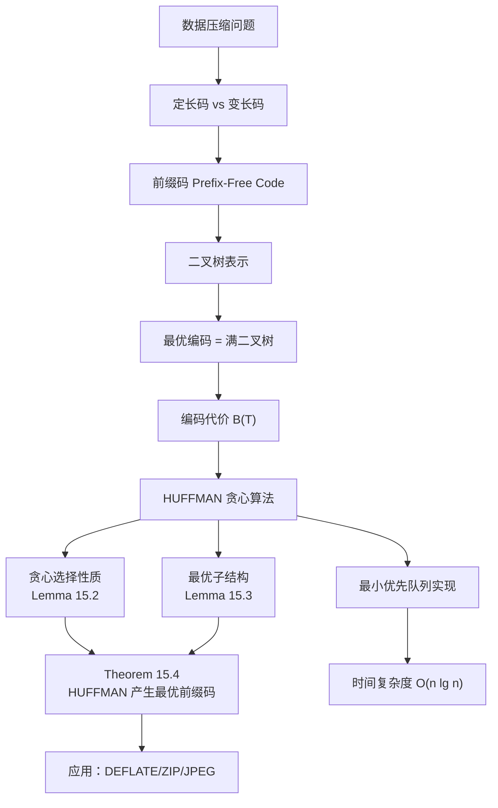
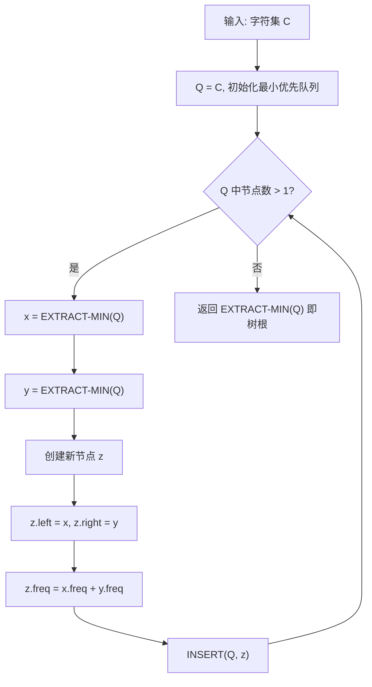

## 相关笔记

- 前置知识：[[6.1 堆]]、[[6.5 优先队列]]、[[14.1 钢条切割]]、[[14.3 动态规划设计要素]]
- 同章笔记：[[15.1 活动选择问题]]、[[15.2 贪心策略要素]]、[[15.4 离线缓存]]
- 章节汇总：[[第15章_贪心算法-章节汇总]]

> [!abstract] 概览
> 本节研究**哈夫曼编码**（Huffman Codes），一种利用贪心策略构造**最优前缀码**的算法，广泛用于数据压缩。
>
> - ==前缀码（prefix-free code）==：没有任何码字是另一个码字的前缀，保证解码无歧义
> - ==满二叉树（full binary tree）==：最优前缀码对应的编码树一定是满二叉树
> - ==编码代价 $B(T)$==：$B(T) = \sum_{c \in C} c.\text{freq} \times d_T(c)$，即所有字符的频率乘以码字长度之和
> - ==贪心选择==：每次合并频率最低的两个字符/子树
> - ==时间复杂度==：$O(n \lg n)$（基于[[6.5 优先队列|最小优先队列]]实现）
> - 压缩效果：典型节省 20%~90% 的存储空间

---

## 知识结构总览



---

## 核心思想

> [!tip] 核心思路
> 哈夫曼编码的核心思想是：**给高频字符分配短码字，给低频字符分配长码字**，从而最小化编码文件的总位数。算法采用**自底向上**的贪心策略：每次从候选集中选出**频率最低的两个对象**，将它们合并为一棵子树（新节点的频率为两者之和），然后放回候选集。经过 $n-1$ 次合并后，得到一棵完整的编码树，即为最优前缀码。

### 编码问题背景

考虑一个包含 100,000 个字符的文件，其中仅有 6 个不同字符 $a, b, c, d, e, f$，频率如下：

| 字符 | 频率（千次） |
|:----:|:----:|
| $a$ | 45 |
| $b$ | 13 |
| $c$ | 12 |
| $d$ | 16 |
| $e$ | 9 |
| $f$ | 5 |

**定长码方案**：6 个字符需要 $\lceil \lg 6 \rceil = 3$ 位，编码整个文件需要 $100{,}000 \times 3 = 300{,}000$ 位。

**变长码方案**（如 $a=0, b=101, c=100, d=111, e=1101, f=1100$）：

$$B(T) = (45 \times 1 + 13 \times 3 + 12 \times 3 + 16 \times 3 + 9 \times 4 + 5 \times 4) \times 1000 = 224{,}000 \text{ 位}$$

节省约 25%，且这是该文件的最优字符编码。

### 前缀码与二叉树表示

> [!def] 前缀码（Prefix-Free Code）
> 如果一个编码方案中，**没有任何码字是另一个码字的前缀**，则称该编码为前缀码。前缀码保证了解码的**无歧义性**：只需从左到右扫描比特串，即可唯一确定每个码字的边界。

前缀码可以用**二叉树**方便地表示：
- 树的每个**叶节点**对应一个字符
- 从根到叶节点的路径上，左分支标记 0，右分支标记 1
- 路径上的标记序列即为该字符的**码字**

> [!def] 满二叉树（Full Binary Tree）
> 一棵二叉树中，如果**每个非叶节点都恰好有两个子节点**，则称其为满二叉树。最优前缀码一定对应一棵满二叉树。如果编码树不是满二叉树，说明存在某些码字前缀未被使用，可以进一步优化。

对于字符集 $C$（所有字符频率为正），最优前缀码的编码树恰好有 $|C|$ 个叶节点和 $|C| - 1$ 个内部节点。

### 编码代价

> [!def] 编码代价 $B(T)$
> 给定对应前缀码的二叉树 $T$，对于字符集 $C$ 中的每个字符 $c$，设 $c.\text{freq}$ 为其在文件中的频率，$d_T(c)$ 为 $c$ 在树中的深度（即码字长度），则编码代价定义为：
> $$B(T) = \sum_{c \in C} c.\text{freq} \times d_T(c)$$
> $B(T)$ 表示用该编码方案对整个文件进行编码所需的**总位数**。

### HUFFMAN 算法伪代码

> [!tip] 算法执行流程
> 1. 为每个字符创建叶节点，放入**最小优先队列** Q
> 2. 当 Q 中节点数 > 1 时循环执行：
>    - 从 Q 中取出**频率最低**的两个节点 x 和 y
>    - 创建新内部节点 z，**z.left = x, z.right = y**
>    - **z.freq = x.freq + y.freq**
>    - 将 z 放入 Q
> 3. 循环结束，Q 中只剩一个节点，即为**编码树的根**
> 4. 返回根节点



```
HUFFMAN(C)
1  n = |C|
2  Q = C                          // 用字符集 C 初始化最小优先队列
3  for i = 1 to n - 1
4     allocate a new node z
5     x = EXTRACT-MIN(Q)          // 取出频率最低的节点
6     y = EXTRACT-MIN(Q)          // 取出频率次低的节点
7     z.left = x
8     z.right = y
9     z.freq = x.freq + y.freq    // 新节点频率为子节点频率之和
10    INSERT(Q, z)
11 return EXTRACT-MIN(Q)          // 队列中剩余的唯一节点即为树根
```

**算法执行过程**（以 6 字符为例）：

1. 初始队列：$\{f:5, e:9, c:12, b:13, d:16, a:45\}$
2. 合并 $f$ 和 $e$，得到 $z_1:14$，队列变为 $\{c:12, b:13, z_1:14, d:16, a:45\}$
3. 合并 $c$ 和 $b$，得到 $z_2:25$，队列变为 $\{z_1:14, d:16, z_2:25, a:45\}$
4. 合并 $z_1$ 和 $d$，得到 $z_3:30$，队列变为 $\{z_2:25, z_3:30, a:45\}$
5. 合并 $z_2$ 和 $z_3$，得到 $z_4:55$，队列变为 $\{a:45, z_4:55\}$
6. 合并 $a$ 和 $z_4$，得到根节点 $z_5:100$

> **【堆操作分析（n-1次循环，每次2次EXTRACT-MIN+1次INSERT，共O(n lg n)）】**
**时间复杂度分析**：
- 使用[[6.1 堆|二叉最小堆]]实现优先队列
- `BUILD-MIN-HEAP` 初始化：$O(n)$
- 循环执行 $n-1$ 次，每次 2 次 `EXTRACT-MIN` 和 1 次 `INSERT`，每次堆操作 $O(\lg n)$
- 总时间：$O(n \lg n)$

### 正确性证明

#### Lemma 15.2（贪心选择性质）

> [!def] Lemma 15.2（最优前缀码具有贪心选择性质）
> 设字符集 $C$ 中每个字符 $c \in C$ 的频率为 $c.\text{freq}$，$x$ 和 $y$ 是 $C$ 中频率最低的两个字符。则存在一棵最优前缀码的编码树，使得 $x$ 和 $y$ 是**最大深度处的兄弟叶节点**（即它们的码字等长且仅在最后一位不同）。

> **【交换论证（逐步交换叶节点将 x,y 移至最大深度，每步代价不增）】**
**证明**（交换论证法）：

证明思路：取一棵任意最优前缀码的编码树 $T$，通过交换叶节点将其改造为另一棵最优编码树 $T''$，使得 $x$ 和 $y$ 成为最大深度处的兄弟叶节点。

**步骤 1**：**【选取最大深度兄弟叶节点 a, b，建立频率不等式】** 设 $a$ 和 $b$ 是 $T$ 中最大深度处的任意两个兄弟叶节点。不妨设 $a.\text{freq} \leq b.\text{freq}$ 且 $x.\text{freq} \leq y.\text{freq}$。由于 $x$ 和 $y$ 是频率最低的两个叶节点，而 $a$ 和 $b$ 是任意两个叶节点，因此：

$$x.\text{freq} \leq a.\text{freq}, \quad y.\text{freq} \leq b.\text{freq}$$

**步骤 2**：**【平凡情况：所有频率相等时引理直接成立】** 若 $x.\text{freq} = b.\text{freq}$，则 $a.\text{freq} = b.\text{freq} = x.\text{freq} = y.\text{freq}$（因为 $x.\text{freq} \leq a.\text{freq} \leq b.\text{freq} = x.\text{freq}$，所以 $a.\text{freq} = b.\text{freq} = x.\text{freq}$；又因为 $y.\text{freq} \leq b.\text{freq} = x.\text{freq}$ 且 $x.\text{freq} \leq y.\text{freq}$，所以 $y.\text{freq} = x.\text{freq}$）。此时引理平凡成立。因此假设 $x.\text{freq} \neq b.\text{freq}$，从而 $x \neq b$。

**步骤 3**：**【交换叶节点 a 和 x，代价差 (a.freq - x.freq)(d_T(a) - d_T(x)) >= 0】** 在树 $T$ 中交换叶节点 $a$ 和 $x$ 的位置，得到树 $T'$。由代价公式（15.4），$T$ 和 $T'$ 的代价之差为：

$$B(T') - B(T) = (a.\text{freq} - x.\text{freq})(d_T(a) - d_T(x))$$

由于 $a.\text{freq} - x.\text{freq} \geq 0$（$x$ 是频率最低的叶节点）且 $d_T(a) - d_T(x) \geq 0$（$a$ 是最大深度的叶节点），因此 $B(T') - B(T) \geq 0$，即交换不增加代价。

**步骤 4**：**【再交换叶节点 b 和 y，同理 B(T'') - B(T') >= 0】** 在树 $T'$ 中交换叶节点 $b$ 和 $y$ 的位置，得到树 $T''$。同理可证 $B(T'') - B(T') \geq 0$。

**步骤 5**：**【综合得 B(T'') = B(T)，T'' 最优且 x, y 为最大深度兄弟】** 综合得 $B(T'') \leq B(T') \leq B(T)$。由于 $T$ 是最优的，$B(T) \leq B(T'')$，因此 $B(T'') = B(T)$。$T''$ 是一棵最优树，且 $x$ 和 $y$ 是最大深度处的兄弟叶节点。$\blacksquare$

#### Lemma 15.3（最优子结构）

> [!def] Lemma 15.3（最优前缀码具有最优子结构性质）
> 设字符集 $C$ 中每个字符 $c \in C$ 的频率为 $c.\text{freq}$，$x$ 和 $y$ 是 $C$ 中频率最低的两个字符。令 $C' = (C - \{x, y\}) \cup \{z\}$，其中 $z.\text{freq} = x.\text{freq} + y.\text{freq}$，其余字符频率不变。设 $T'$ 是字符集 $C'$ 的任意最优前缀码编码树，则将 $T'$ 中 $z$ 的叶节点替换为以 $x$ 和 $y$ 为子节点的内部节点后得到的树 $T$，是字符集 $C$ 的最优前缀码编码树。

> **【反证法（若 T 不最优则构造 T''' 使 B(T''')<B(T')，矛盾）】**
**证明**（反证法）：

**步骤 1**：**【建立 B(T) 与 B(T') 的关系：B(T) = B(T') + x.freq + y.freq】** 建立 $B(T)$ 与 $B(T')$ 之间的关系。

对于 $C - \{x, y\}$ 中的每个字符 $c$，有 $d_T(c) = d_{T'}(c)$，因此 $c.\text{freq} \cdot d_T(c) = c.\text{freq} \cdot d_{T'}(c)$。

对于 $x$ 和 $y$，由于 $d_T(x) = d_T(y) = d_{T'}(z) + 1$：

$$x.\text{freq} \cdot d_T(x) + y.\text{freq} \cdot d_T(y) = (x.\text{freq} + y.\text{freq})(d_{T'}(z) + 1) = z.\text{freq} \cdot d_{T'}(z) + x.\text{freq} + y.\text{freq}$$

因此：

$$B(T) = B(T') + x.\text{freq} + y.\text{freq}$$

等价地：

$$B(T') = B(T) - x.\text{freq} - y.\text{freq}$$

**步骤 2**：**【反证：若 T 不最优，则存在 T'' 更优，构造 T''' 得出矛盾】** 反证。假设 $T$ 不是 $C$ 的最优前缀码编码树，则存在最优树 $T''$ 使得 $B(T'') < B(T)$。

由 Lemma 15.2，不妨设 $T''$ 中 $x$ 和 $y$ 是兄弟叶节点。将 $T''$ 中 $x$ 和 $y$ 的公共父节点替换为叶节点 $z$（频率为 $z.\text{freq} = x.\text{freq} + y.\text{freq}$），得到树 $T'''$。

**【利用步骤1的关系：B(T''') < B(T')，与 T' 最优矛盾】** 由步骤 1 的关系：

$$B(T''') = B(T'') - x.\text{freq} - y.\text{freq} < B(T) - x.\text{freq} - y.\text{freq} = B(T')$$

这与 $T'$ 是 $C'$ 的最优前缀码编码树的假设矛盾。因此 $T$ 必为 $C$ 的最优前缀码编码树。$\blacksquare$

#### Theorem 15.4

> [!def] Theorem 15.4
> 过程 HUFFMAN 产生一棵最优前缀码编码树。

> **【数学归纳法（Lemma 15.2+Lemma 15.3 直接推出 HUFFMAN 最优）】**
**证明**：由 Lemma 15.2（贪心选择性质）和 Lemma 15.3（最优子结构性质）直接得出。数学归纳法：每次合并频率最低的两个字符后，子问题 $C'$ 的最优解可扩展为原问题 $C$ 的最优解。$\blacksquare$

---

## 补充理解与拓展

> [!info] Huffman 编码的历史——一个MIT博士生的课程作业
>
> Huffman 编码由 **David A. Huffman** 于 **1952 年**在其 MIT 博士论文中提出。这段历史颇具传奇色彩：当时 Huffman 选修了 Robert Fano 的信息论课程，期末要求学生要么参加考试，要么提交一篇学期论文。Huffman 选择写论文，在苦思冥想数月后终于找到了这个最优编码算法，超越了当时已知的 Shannon-Fano 编码——而 Shannon-Fano 编码的提出者正是课程教师 Fano 和信息论创始人 Shannon。
>
> Huffman 的原始论文发表于 *Proceedings of the IRE*：
> - Huffman, D. A. (1952). "A Method for the Construction of Minimum-Redundancy Codes", *Proceedings of the IRE*, 40(9), pp. 1098-1101
>
> 这篇论文被认为是计算机科学史上最具影响力的论文之一，因为它解决了一个当时"无法证明哪个已有编码是最有效的"的开放问题。

> [!info] Shannon-Fano 编码 vs Huffman 编码——自顶向下 vs 自底向上
>
> | 比较维度 | Shannon-Fano 编码 (1949) | Huffman 编码 (1952) |
> |:---------|:------------------------|:-------------------|
> | 构建方向 | 自顶向下（递归分割） | 自底向上（递归合并） |
> | 分割/合并策略 | 将字符集按频率分为大致相等的两部分 | 合并频率最低的两个字符/子树 |
> | 最优性 | **不总能产生最优前缀码** | **保证产生最优前缀码** |
> | 编码效率 | 通常接近最优，但存在反例 | 严格最优 |
>
> Shannon-Fano 编码的核心缺陷在于：自顶向下的分割策略可能在某一步做出"错误"的分割（虽然频率大致相等，但不一定最优），而后续步骤无法纠正这个错误。Huffman 编码的自底向上策略则天然避免了这一问题——每次合并都是局部最优的，且贪心选择性质保证了全局最优性。
>
> 来源：Shannon, C. E. (1948). "A Mathematical Theory of Communication", *Bell System Technical Journal*; Sayood, K. "Introduction to Data Compression", Chapter 3

> [!info] Huffman 编码的现代应用
>
> Huffman 编码是现代数据压缩的基础组件，广泛应用于：
>
> 1. **DEFLATE 算法**（ZIP、gzip、PNG）：由 Philip Katz 于 1993 年定义为 PKZIP 的一部分，后成为 RFC 1951 标准。DEFLATE 结合了 LZ77 算法（滑动窗口字典编码）和 Huffman 编码，先通过 LZ77 消除重复字符串，再用 Huffman 编码压缩剩余数据。几乎所有现代压缩工具（7-Zip、WinRAR、gzip）和图片格式（PNG）都使用 DEFLATE
> 2. **JPEG 图像压缩**：对 DCT 变换后的量化系数进行熵编码时，使用 Huffman 编码或算术编码。JPEG 标准允许编码器在两者之间选择，Huffman 编码因为实现简单而被广泛采用
> 3. **MP3 音频压缩**：对 MDCT 变换后的量化频谱数据进行熵编码时使用 Huffman 编码，是 MP3 有损压缩流程的最后一步
> 4. **HTTP/2 HPACK 头部压缩**：使用静态 Huffman 表对 HTTP 头部字段进行压缩
>
> **现代改进**：Moffat 和 Turpin 的研究（见 *Managing Gigabytes* 一书）表明，当字符集很大时（如 $n > 10^6$），传统的 Huffman 编码在编码树表示上的开销不可忽视。他们提出了"canonical Huffman codes"等技术，将编码树的存储从 $O(n \lg n)$ 位优化到接近信息论下界。
>
> 来源：RFC 1951 "DEFLATE Compressed Data Format Specification"; Moffat, A. & Turpin, A. (2002). "Huffman Coding", *ACM Computing Surveys*; Sayood, K. "Introduction to Data Compression"

---

## 易混淆点与辨析

> [!warning] 误区辨析
>
> **误区 1：哈夫曼编码树是二叉搜索树**
>
> ❌ 错误。哈夫曼编码树**不是**二叉搜索树。叶节点不需要按排序顺序出现，内部节点也不存储字符键值。它只是一棵用于表示前缀码的普通二叉树。
>
> **误区 2：交换左右子节点会改变编码代价**
>
> ❌ 错误。交换任意节点的左右子节点只会改变码字的具体分配（比如 0 和 1 互换），但**不改变编码代价** $B(T)$，因为每个字符的码字长度不变。
>
> **误区 3：最优前缀码的编码树一定唯一**
>
> ❌ 错误。最优前缀码的编码树**不一定唯一**。当多个字符频率相同时，不同的合并顺序可能产生不同的最优树，但它们的代价 $B(T)$ 相同。
>
> **误区 4：Huffman 编码总能压缩数据**
>
> ❌ 错误。当所有字符频率几乎相等时（如最大频率不超过最小频率的两倍），Huffman 编码的效率不会优于定长码（见习题 15.3-7）。更一般地，没有任何无损压缩方案能保证对所有输入文件都产生更短的输出（见习题 15.3-8）。

---

## 习题精选

| 题号 | 题目描述 | 难度 |
|:----:|:---------|:----:|
| 15.3-1 | 解释为什么在 Lemma 15.2 的证明中，若 $x.\text{freq} = b.\text{freq}$，则必有 $a.\text{freq} = b.\text{freq} = x.\text{freq} = y.\text{freq}$ | ⭐ |
| 15.3-2 | 证明非满二叉树不能对应最优前缀码 | ⭐⭐ |
| 15.3-3 | 求前 8 个 Fibonacci 数作为频率时的最优 Huffman 码 | ⭐⭐ |
| 15.3-4 | 证明满二叉树的总代价等于所有内部节点的子节点频率之和 | ⭐⭐ |
| 15.3-5 | 证明任何最优前缀码可用 $2n-1 + n\lceil \lg n \rceil$ 位表示 | ⭐⭐⭐ |
| 15.3-6 | 将 Huffman 算法推广到三进制码字并证明最优性 | ⭐⭐⭐ |
| 15.3-7 | 证明频率均匀时 Huffman 编码不优于 8 位定长码 | ⭐⭐ |
| 15.3-8 | 证明没有无损压缩方案能保证对每个输入都产生更短输出 | ⭐⭐⭐ |

> [!faq]- 15.3-1 解答
> 在 Lemma 15.2 的证明中，已知 $x.\text{freq} \leq a.\text{freq} \leq b.\text{freq}$（因为 $a$ 和 $b$ 是兄弟叶节点且 $a.\text{freq} \leq b.\text{freq}$，而 $x.\text{freq}$ 是最低频率）。
>
> 若 $x.\text{freq} = b.\text{freq}$，则：
> - 由 $x.\text{freq} \leq a.\text{freq} \leq b.\text{freq} = x.\text{freq}$，得 $a.\text{freq} = x.\text{freq} = b.\text{freq}$
> - 由 $x.\text{freq} \leq y.\text{freq} \leq b.\text{freq} = x.\text{freq}$（$y$ 是频率第二低的字符），得 $y.\text{freq} = x.\text{freq}$
>
> 因此 $a.\text{freq} = b.\text{freq} = x.\text{freq} = y.\text{freq}$。

> [!faq]- 15.3-2 解答
> **【反证法（非满二叉树可删除单子节点降低代价，与最优矛盾）】**
> 反证法。假设存在一棵非满二叉树 $T$ 对应最优前缀码。由于 $T$ 不是满二叉树，存在某个内部节点 $v$ 只有一个子节点 $u$。
>
> 可以将 $v$ 删除，让 $u$ 直接取代 $v$ 的位置。这样 $u$ 的深度减少 1，$u$ 的子树中所有叶节点的深度也减少 1。由于所有字符频率为正，编码代价 $B(T)$ 严格减小，与 $T$ 是最优的矛盾。
>
> 因此，最优前缀码的编码树一定是满二叉树。

> [!faq]- 15.3-3 解答
> 频率为前 8 个 Fibonacci 数：$a:1, b:1, c:2, d:3, e:5, f:8, g:13, h:21$。
>
> Huffman 算法合并过程：
> 1. 合并 $a(1)$ 和 $b(1)$ → $z_1(2)$
> 2. 合并 $z_1(2)$ 和 $c(2)$ → $z_2(4)$
> 3. 合并 $z_2(4)$ 和 $d(3)$ → $z_3(7)$
> 4. 合并 $z_3(7)$ 和 $e(5)$ → $z_4(12)$
> 5. 合并 $z_4(12)$ 和 $f(8)$ → $z_5(20)$
> 6. 合并 $z_5(20)$ 和 $g(13)$ → $z_6(33)$
> 7. 合并 $z_6(33)$ 和 $h(21)$ → 根(54)
>
> 注意到每次合并时，新创建的节点频率恰好等于下一个待合并的 Fibonacci 频率。这意味着编码树退化为一条**链**（每个内部节点只有一个叶节点子节点和一个内部节点子节点），码字长度从 1 位到 7 位不等。
>
> **推广**：当频率为前 $n$ 个 Fibonacci 数时，Huffman 树退化为一条链，码字长度为 $1, 2, \ldots, n-1$ 位。这是最"不平衡"的 Huffman 树之一。

> [!faq]- 15.3-4 解答
> **【计数论证（每个叶节点频率被其深度个祖先各计算一次）】**
> 对满二叉树 $T$ 中的每个内部节点 $v$，设其左子树和右子树中所有叶节点的频率之和分别为 $f_L(v)$ 和 $f_R(v)$。则 $v$ 对总代价的贡献为 $f_L(v) + f_R(v)$。
>
> 另一方面，$v$ 的子树中每个叶节点 $c$ 的深度比 $c$ 在 $v$ 的子节点中的深度大 1。因此，$v$ 的子树中所有叶节点的频率之和恰好等于 $v$ 对 $B(T)$ 的贡献。
>
> 对所有内部节点求和，每个叶节点 $c$ 的频率 $c.\text{freq}$ 被计算了恰好 $d_T(c)$ 次（每经过一个祖先就计算一次），因此：
> $$\sum_{v \text{ 是内部节点}} (f_L(v) + f_R(v)) = \sum_{c \in C} c.\text{freq} \cdot d_T(c) = B(T)$$

> [!faq]- 15.3-7 解答
> **【频率均匀性论证（f_max<2f_min 限制码字长度差不超过1，接近定长码）】**
> 设最大频率为 $f_{\max}$，最小频率为 $f_{\min}$，已知 $f_{\max} < 2f_{\min}$。
>
> 在 Huffman 树中，任何两个兄弟叶节点的频率之和不超过 $f_{\max} + f_{\max} < 2f_{\max}$。同时，任何非叶节点的频率至少为 $2f_{\min}$。
>
> 由于 $f_{\max} < 2f_{\min}$，所有叶节点的频率在 $[f_{\min}, 2f_{\min})$ 范围内。这意味着在 Huffman 树中，叶节点的最大深度与最小深度之差不超过 1（否则，一个深层叶节点的频率将远小于一个浅层叶节点的频率，与频率均匀矛盾）。
>
> 因此，所有码字长度为 $\lfloor \lg n \rfloor$ 或 $\lceil \lg n \rceil$ 位。对于 256 个字符，$\lceil \lg 256 \rceil = 8$，码字长度为 7 或 8 位。但 7 位码字只能用于少数最高频字符，平均码字长度非常接近 8 位，Huffman 编码的效率不会优于 8 位定长码。

> [!faq]- 15.3-8 解答
> **【鸽巢原理（2^n个输入映射到2^n-1个更短输出，必冲突）】**
> 设原始文件长度为 $n$ 位。有 $2^n$ 个可能的 $n$ 位文件。
>
> 如果压缩方案保证每个输出文件都比输入短，则输出文件最多 $n-1$ 位。长度不超过 $n-1$ 位的文件总数为：
> $$1 + 2 + 4 + \cdots + 2^{n-1} = 2^n - 1$$
>
> 由鸽巢原理，$2^n$ 个输入文件映射到 $2^n - 1$ 个可能的输出文件，至少有两个不同的输入文件映射到同一个输出文件，这违反了无损（可逆）压缩的要求。

---

## 视频学习指南

| 资源 | 链接 | 说明 |
|:-----|:-----|:-----|
| MIT 6.006 Lecture 23 | https://www.youtube.com/watch?v=JsTptu56GM8 | Erik Demaine 讲解 Huffman 编码 |
| Abdul Bari Huffman Coding | https://www.youtube.com/watch?v=co4_ahEDCho | 直观的逐步演示 |
| 算法导论原书配套 | CLRS 4th Edition Chapter 15.3 | 教材原文 |

---

## 教材原文

> [!quote] CLRS 第4版 15.3节原文（中文翻译）
> 哈夫曼编码能很好地压缩数据：节省 20% 到 90% 是典型的结果。一般来说，变长编码可以比定长编码获得显著的压缩效果，其中最著名的变长编码之一就是哈夫曼编码。
>
> 哈夫曼的贪心算法利用了字符频率表来构建一棵最优前缀码的方式，称为==哈夫曼树==或==哈夫曼编码树==。该算法自底向上构建这棵树，从一个包含 $|C|$ 棵叶节点的森林开始，最终合并为一棵树。该算法使用一个==最小优先队列== $Q$，以频率为关键字来识别两个频率最低的对象。
>
> 对于 $n$ 个字符的字母表，HUFFMAN 的运行时间为 $O(n \lg n)$。如果使用 van Emde Boas 树（第18章）来实现最小优先队列，则运行时间可以降至 $O(n \lg \lg n)$。

---

## 参见Wiki

- [[算法导论/concepts/哈夫曼编码]] — 最优前缀码的贪心构造
- [[算法导论/concepts/前缀码]] — 前缀码的定义与性质
- [[算法导论/theorems/Huffman最优前缀码定理]]

-------

#学习/算法导论/第15章-贪心算法 #学习/算法导论/贪心算法/哈夫曼编码
