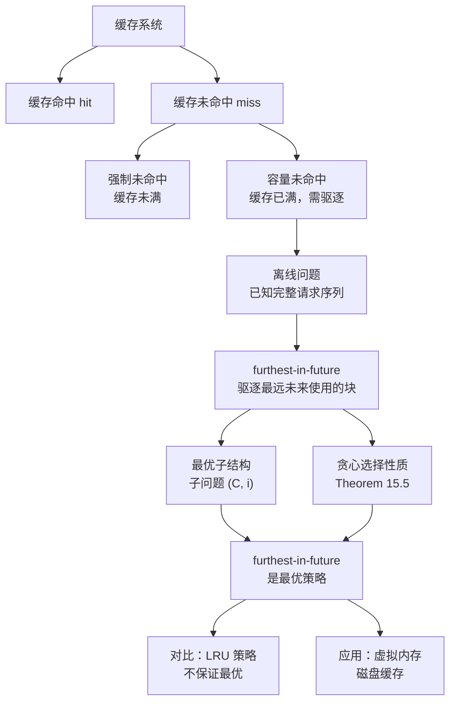
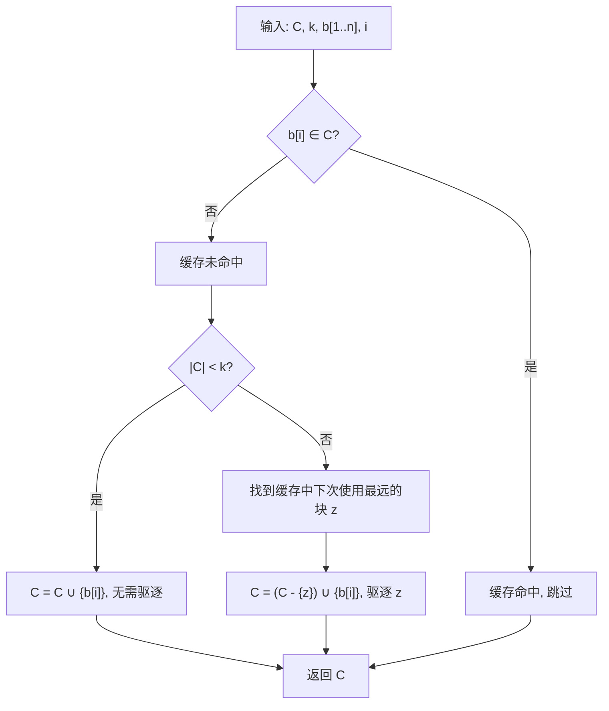

## 相关笔记

- 前置知识：[[15.1 活动选择问题]]、[[15.2 贪心策略要素]]、[[14.3 动态规划设计要素]]
- 同章笔记：[[15.1 活动选择问题]]、[[15.2 贪心策略要素]]、[[15.3 哈夫曼编码]]
- 章节汇总：[[第15章_贪心算法-章节汇总]]

> [!abstract] 概览
> 本节研究**离线缓存问题**（Offline Caching），在已知完整请求序列的前提下，利用贪心策略最小化缓存未命中次数。
>
> - ==缓存命中（cache hit）==：请求的块已在缓存中，无需额外操作
> - ==缓存未命中（cache miss）==：请求的块不在缓存中，需要将其调入缓存
> - ==强制未命中（compulsory miss）==：缓存未满时的未命中，不可避免
> - ==furthest-in-future 策略==：驱逐下次使用最远的块，贪心选择性质保证其最优性
> - ==最优子结构==：子问题 $(C, i)$ 的最优解包含子问题 $(C', i+1)$ 的最优解
> - ==Theorem 15.5==：furthest-in-future 策略产生最小缓存未命中次数

---

## 知识结构总览



---

## 核心思想

> [!tip] 核心思路
> 离线缓存问题的核心是：在已知完整请求序列 $b_1, b_2, \ldots, b_n$ 和缓存容量 $k$ 的前提下，决定每次缓存未命中时驱逐哪个块，以**最小化缓存未命中总次数**。最优策略是 **furthest-in-future**（最远未来使用）：当缓存已满且发生未命中时，驱逐缓存中**下次使用最远的块**。直觉上，如果一个块在很远的将来才会被用到，不如把它腾出来给当前需要的块。

### 缓存系统模型

计算机系统通过**缓存**（cache）——一种小而快的存储器——来加速数据访问。缓存将数据组织为**缓存块**（cache block），通常为 32、64 或 128 字节。在虚拟内存系统中，主存也可以视为磁盘数据的缓存，此时块称为**页**（page），典型大小为 4096 字节。

程序执行时产生一系列内存请求，依次访问块 $b_1, b_2, \ldots, b_n$。缓存最多容纳 $k$ 个块，初始为空。每次请求时，可能出现三种情况：

1. **缓存命中（cache hit）**：$b_i$ 已在缓存中，缓存不变
2. **缓存未命中（cache miss）**：$b_i$ 不在缓存中
   - 若缓存未满（$|C| < k$）：直接将 $b_i$ 放入缓存（**强制未命中**，compulsory miss）
   - 若缓存已满（$|C| = k$）：必须先驱逐一个块，再将 $b_i$ 放入缓存

**目标**：最小化整个请求序列中的缓存未命中次数。

**示例**：缓存容量 $k=3$，请求序列为 $s, q, s, q, q, s, p, p, r, s, s, q, p, r, q$（共 4 个不同块 $p, q, r, s$）。

### 离线问题与 furthest-in-future 策略

通常缓存是一个**在线问题**（online problem）：计算机在做出驱逐决策时不知道未来的请求。本节考虑**离线版本**（offline version）：已知完整的请求序列和缓存容量。

> [!def] furthest-in-future 策略
> 当缓存已满且发生未命中时，选择驱逐缓存中**下次访问在请求序列中最远的块**。如果某个块在将来不再被访问，则优先驱逐该块。

**直觉**：如果某个块在很远的将来才会被用到（或永远不再被用到），不如现在把它腾出来，因为短期内不会需要它。

### 最优子结构

> [!def] 子问题定义
> 定义子问题 $(C, i)$：在处理请求 $b_i, b_{i+1}, \ldots, b_n$ 时，缓存配置为 $C$（$C$ 是块的子集，$|C| \leq k$）。子问题 $(C, i)$ 的解是从 $b_i$ 到 $b_n$ 的驱逐决策序列，最优解使缓存未命中次数最少。

设 $S$ 是子问题 $(C, i)$ 的最优解，$C'$ 是处理 $b_i$ 后的缓存配置，$S'$ 是 $S$ 对子问题 $(C', i+1)$ 的子解。则 $S'$ 也是子问题 $(C', i+1)$ 的最优解。

> **【反证法（若子问题解非最优则组合后得到更优解，矛盾）】**
**证明**：反证法。若 $S'$ 不是 $(C', i+1)$ 的最优解，则存在另一个解 $S''$ 使得未命中次数更少。将 $S''$ 与 $S$ 在 $b_i$ 处的决策组合，得到一个比 $S$ 未命中次数更少的解，与 $S$ 是最优解矛盾。

### 递推公式

设 $R_{C,i}$ 为处理请求 $b_i$ 后缓存配置 $C$ 可能转变为的所有配置集合：

- 若 $b_i \in C$（命中）：$R_{C,i} = \{C\}$
- 若 $b_i \notin C$ 且 $|C| < k$（未满未命中）：$R_{C,i} = \{C \cup \{b_i\}\}$
- 若 $b_i \notin C$ 且 $|C| = k$（满未命中）：$R_{C,i} = \{(C - \{x\}) \cup \{b_i\} : x \in C\}$

> **【递推公式（命中时代价不变，未命中时取所有可能配置的最小值加1）】**
设 $\text{miss}(C, i)$ 为子问题 $(C, i)$ 的最小缓存未命中次数，递推公式为：

$$\text{miss}(C, i) = \begin{cases} \text{miss}(C, i+1) & \text{若 } b_i \in C \text{（命中）} \\ 1 + \min_{C' \in R_{C,i}} \text{miss}(C', i+1) & \text{若 } b_i \notin C \text{（未命中）} \end{cases}$$

### furthest-in-future 算法伪代码

> [!tip] 算法执行流程
> 1. 对请求序列中的每个请求 **b[i]** 依次处理
> 2. 若 b[i] **已在缓存中**（命中），跳过
> 3. 若缓存**未满**（|C| < k），直接将 b[i] 放入缓存
> 4. 若缓存**已满**（|C| = k）：
>    - 找出缓存中**下次使用最远的块** z（或不再使用的块）
>    - **驱逐** z，将 b[i] 放入缓存
> 5. 返回更新后的缓存 C



```
FURTHEST-IN-FUTURE(C, k, b[1..n], i)
1  if b[i] ∈ C
2     print "cache hit"
3  else
4     print "cache miss"
5     if |C| < k
6        C = C ∪ {b[i]}          // 缓存未满，直接放入
7        print "evicted: none"
8     else
9        // 在缓存中找到下次使用最远的块 z
10       z = block in C whose next access is furthest in the future
11       C = (C - {z}) ∪ {b[i]}  // 驱逐 z，放入 b[i]
12       print "evicted: z"
13 return C
```

### 正确性证明

#### Theorem 15.5（贪心选择性质）

> [!def] Theorem 15.5（最优离线缓存具有贪心选择性质）
> 考虑子问题 $(C, i)$，其中缓存 $C$ 已满（$|C| = k$），且发生缓存未命中。当请求块 $b_i$ 时，设 $z = b_m$ 是缓存 $C$ 中下次访问最远的块（若某块不再被访问，则视为在 $b_{n+1}$ 处被访问）。则在子问题 $(C, i)$ 的某个最优解中，驱逐块 $z$。

> **【归纳构造法（构造 S' 驱逐 z 而非 x，证明四个性质保证 S' 等价最优）】**
**证明**（归纳构造法）：

设 $S$ 是子问题 $(C, i)$ 的一个最优解。

**情况 1**：$S$ 在请求 $b_i$ 时驱逐 $z$。则定理已成立。

**情况 2**：**【S 驱逐 x 而非 z，需构造等价最优解 S'】** $S$ 在请求 $b_i$ 时驱逐某个其他块 $x$（$x \neq z$）。我们需要构造另一个最优解 $S'$，它在请求 $b_i$ 时驱逐 $z$ 而非 $x$，且未命中次数不超过 $S$。

**【定义缓存配置 C_{S,j} 和 C_{S',j}，证明四个性质】** 记 $C_{S,j}$ 为解 $S$ 在请求 $b_j$ 之前的缓存配置，$C_{S',j}$ 为解 $S'$ 在请求 $b_j$ 之前的缓存配置。我们证明 $S'$ 满足以下四个性质：

**性质 1**：对于 $j = i+1, \ldots, m$，令 $D_j = C_{S,j} \cap C_{S',j}$。则 $|D_j| \geq k-1$，即两个缓存配置最多相差一个块。若相差，则 $C_{S,j} = D_j \cup \{z\}$，$C_{S',j} = D_j \cup \{y\}$（$y \neq z$）。

**性质 2**：对于请求 $b_i, \ldots, b_{m-1}$，若 $S$ 命中则 $S'$ 也命中。

**性质 3**：对于所有 $j > m$，$C_{S,j} = C_{S',j}$（两个解完全一致）。

**性质 4**：在请求 $b_i, \ldots, b_m$ 上，$S'$ 的未命中次数不超过 $S$。

**性质 1 的归纳证明**：

> **【数学归纳法（基础步：j=i+1 时两个缓存仅差一个块）】**
- **基础**（$j = i+1$）：$C_{S,i} = C_{S',i}$（初始缓存相同）。$S$ 驱逐 $x$，$S'$ 驱逐 $z$。因此 $C_{S,i+1} = D_{i+1} \cup \{z\}$，$C_{S',i+1} = D_{i+1} \cup \{x\}$，$x \neq z$。性质 1 成立。

- **归纳步骤**（$i+1 \leq j \leq m-1$）：**【关键：b_j != z，因为 z=b_m 是下次访问最远的】** 归纳假设性质 1 在请求 $b_j$ 时成立。由于 $z = b_m$ 是 $C_{S,i}$ 中下次访问最远的块，$b_j \neq z$。分情况讨论：

  - **情况 A**：$C_{S,j} = C_{S',j}$（$|D_j| = k$）。$S'$ 做与 $S$ 相同的决策，$C_{S,j+1} = C_{S',j+1}$。

  - **情况 B**：$|D_j| = k-1$ 且 $b_j \in D_j$。两个缓存都包含 $b_j$，都是命中，缓存不变。

  - **情况 C**：$|D_j| = k-1$ 且 $b_j \notin D_j$。由于 $C_{S,j} = D_j \cup \{z\}$ 且 $b_j \neq z$，$S$ 未命中。
    - **C.1**：$S$ 驱逐 $z$。$C_{S,j+1} = D_j \cup \{b_j\}$。
      - 若 $b_j = y$：$S'$ 命中，$C_{S',j+1} = C_{S',j} = D_j \cup \{b_j\}$。$C_{S,j+1} = C_{S',j+1}$。
      - 若 $b_j \neq y$：$S'$ 未命中，驱逐 $y$，$C_{S',j+1} = D_j \cup \{b_j\}$。$C_{S,j+1} = C_{S',j+1}$。
    - **C.2**：$S$ 驱逐某个 $w \in D_j$。$C_{S,j+1} = (D_j - \{w\}) \cup \{b_j, z\}$。
      - 若 $b_j = y$：$S'$ 命中，$C_{S',j+1} = D_j \cup \{b_j\}$。$w \in C_{S',j+1}$ 但 $w \notin C_{S,j+1}$，所以 $D_{j+1} = (D_j - \{w\}) \cup \{b_j\}$，$C_{S,j+1} = D_{j+1} \cup \{z\}$，$C_{S',j+1} = D_{j+1} \cup \{w\}$。性质 1 成立（$w$ 取代了 $y$ 的角色）。
      - 若 $b_j \neq y$：$S'$ 未命中，驱逐 $w$，$C_{S',j+1} = (D_j - \{w\}) \cup \{b_j, y\}$。$D_{j+1} = (D_j - \{w\}) \cup \{b_j\}$，$C_{S,j+1} = D_{j+1} \cup \{z\}$，$C_{S',j+1} = D_{j+1} \cup \{y\}$。性质 1 成立。

**性质 2**：在上述讨论中，$S$ 仅在情况 A 和 B 中命中，而 $S'$ 在这些情况中当且仅当 $S$ 命中时也命中。

> **【缓存配置收敛论证（b_m 处 S' 驱逐 y 放入 z 后与 S 一致）】**
**性质 3**：若 $C_{S,m} = C_{S',m}$，则 $S'$ 在 $b_m$ 处做与 $S$ 相同的决策，$C_{S,m+1} = C_{S',m+1}$。若 $C_{S,m} \neq C_{S',m}$，由性质 1，$C_{S,m} = D_m \cup \{z\}$，$C_{S',m} = D_m \cup \{y\}$。$S$ 命中（因为 $z = b_m \in C_{S,m}$），$C_{S,m+1} = C_{S,m}$。$S'$ 未命中，驱逐 $y$ 放入 $z$，$C_{S',m+1} = D_m \cup \{z\} = C_{S,m+1}$。无论哪种情况，从 $b_{m+1}$ 开始 $S'$ 与 $S$ 完全一致。

**性质 4**：**【S 命中时 S' 也命中，只需考虑 b_m 处的差异】** 由性质 2，在 $b_i, \ldots, b_{m-1}$ 上，$S$ 命中时 $S'$ 也命中。只需考虑 $b_m = z$。

- 若 $S$ 在 $b_m$ 处未命中：$S'$ 无论命中与否，未命中次数都不超过 $S$。
- 若 $S$ 在 $b_m$ 处命中而 $S'$ 未命中：**【反证：不存在 S 未命中而 S' 命中的请求】** 我们需要证明在 $b_{i+1}, \ldots, b_{m-1}$ 中存在某个请求，使得 $S$ 未命中而 $S'$ 命中，从而补偿 $b_m$ 处的差异。

  **反证**：假设不存在这样的请求。一旦 $C_{S,j} = C_{S',j}$（$j > i$），此后两者保持一致。由于 $b_m \in C_{S,m}$ 但 $b_m \notin C_{S',m}$（否则 $S'$ 也命中），$C_{S,m} \neq C_{S',m}$。因此 $S$ 在 $b_i, \ldots, b_{m-1}$ 中从未驱逐 $z$（否则两者会变得相同）。

  在每次请求中，$C_{S,j} = D_j \cup \{z\}$，$C_{S',j} = D_j \cup \{y\}$（$y \neq z$），$S$ 驱逐某个 $w \in D_j$。由于没有 $S$ 未命中而 $S'$ 命中的情况，$b_j = y$ 的情况从未发生。因此 $C_{S',j+1} = D_{j+1} \cup \{y\}$，差异不变。

  **【导出矛盾：x 在 b_{i+1}..b_{m-1} 中被请求，S' 命中而 S 未命中】** 回到 $b_i$ 处理后：$C_{S',i+1} = D_{i+1} \cup \{x\}$。由于此后差异不变，$C_{S',j} = D_j \cup \{x\}$（$j = i+1, \ldots, m$）。由定义，$z = b_m$ 在 $x$ 之后被请求，因此 $b_{i+1}, \ldots, b_{m-1}$ 中至少有一个是 $x$。但 $x \in C_{S',j}$ 而 $x \notin C_{S,j}$（$x$ 被 $S$ 驱逐了），所以至少有一个请求 $S'$ 命中而 $S$ 未命中，矛盾。

因此 $S'$ 的未命中次数不超过 $S$。由于 $S$ 是最优的，$S'$ 也是最优的。$\blacksquare$

---

## 补充理解与拓展

> [!info] Belady 最优置换算法的历史与影响
>
> Furthest-in-future 策略由 **László A. Belády** 于 **1966 年** 在 IBM 研究中心提出，因此也称为 **Belady's Algorithm** 或 **MIN 算法**。Belády 的原始论文是虚拟内存管理理论的奠基性工作：
>
> - Belady, L. A. (1966). "A Study of Replacement Algorithms for Virtual Storage Computers", *IBM Systems Journal*, 5(2), pp. 78-101
>
> Belády 证明了在已知完整请求序列的离线设定下，furthest-in-future 策略产生最少的缓存未命中次数。这一结果的意义不仅在于算法本身，更在于它为在线缓存算法提供了一个==理论最优基准==（optimal baseline）——所有实际可用的在线算法（LRU、LFU、ARC 等）的性能都以此为参照来评估。

> [!info] LRU vs Furthest-in-Future——在线 vs 离线的性能差距
>
> | 比较维度 | LRU（Least Recently Used） | Furthest-in-Future |
> |:---------|:--------------------------|:-------------------|
> | 类型 | 在线策略（无需未来信息） | 离线策略（需要完整请求序列） |
> | 驱逐规则 | 驱逐最近最久未使用的块 | 驱逐下次使用最远的块 |
> | 可实现性 | ✅ 广泛用于实际系统 | ❌ 仅作为理论基准 |
> | 最优性 | ❌ 不保证最优 | ✅ 离线最优 |
> | Belady 异常 | ❌ 不存在 | ❌ 不存在 |
>
> **经典对比示例**：请求序列 $\langle 1, 2, 3, 4, 1, 2, 5, 1, 2, 3, 4, 5 \rangle$，缓存容量 $k = 3$：
> - **Furthest-in-Future**：9 次未命中
> - **LRU**：10 次未命中
> - **FIFO**：9 次未命中（但 FIFO 存在 Belady 异常）
>
> LRU 在循环扫描模式（sequential scanning）下表现尤其差——每次扫描都会驱逐即将需要的块，导致缓存命中率趋近于 0。但 LRU 的优势在于它利用了==时间局部性==（temporal locality），在大多数实际工作负载中表现良好。

> [!info] 竞争分析——在线算法性能的理论框架
>
> 由于在线算法无法预知未来请求，其性能用==竞争比==（competitive ratio）来衡量：算法 $A$ 的竞争比为 $c$，如果对任何请求序列 $\sigma$，都有 $\text{cost}_A(\sigma) \leq c \cdot \text{cost}_{\text{OPT}}(\sigma)$。
>
> 缓存置换算法的竞争比结果（Sleator & Tarjan, 1985）：
> - **确定性在线算法**：最优竞争比为 $k$（$k$ 为缓存容量）。LRU 和 FIFO 的竞争比都是 $k$，且这是紧的
> - **随机化在线算法**：最优竞争比为 $H_k = \sum_{i=1}^{k} 1/i \approx \ln k$（第 $k$ 个调和数）。Marking 算法达到了这个下界
>
> 这意味着即使最优的确定性在线算法，在最坏情况下也可能比离线最优算法多产生 $k$ 倍的未命中。但实际中 LRU 的平均性能通常远好于竞争比所暗示的——竞争比衡量的是最坏情况，而实际工作负载往往具有局部性特征。
>
> Sleator & Tarjan 的这篇论文开创了==竞争分析==（competitive analysis）这一领域，对在线算法的理论研究产生了深远影响：
> - Sleator, D. D. & Tarjan, R. E. (1985). "Amortized Efficiency of List Update and Paging Rules", *Communications of the ACM*, 28(2), pp. 202-208
>
> 后续重要进展包括 Fiat et al. (1991) 证明了随机化缓存算法的紧竞争比为 $H_k$：
> - Fiat, A., Karp, R. M., Luby, M., McGeoch, L. A., Sleator, D. D. & Tarjan, R. E. (1991). "Randomized Competitive Algorithms for the List Update Problem", *Algorithmica*, 6(1), pp. 516-538

> [!info] Belady 异常——增加缓存反而降低性能
>
> 一个违反直觉的现象是：对于某些缓存置换策略（如 FIFO），**增加缓存容量反而可能增加未命中次数**。这被称为 ==Belady 异常==（Belady's Anomaly）。
>
> **FIFO 的 Belady 异常示例**：
> - 请求序列：$\langle 1, 2, 3, 4, 1, 2, 5, 1, 2, 3, 4, 5 \rangle$
> - 缓存容量 $k = 3$：FIFO 产生 9 次未命中
> - 缓存容量 $k = 4$：FIFO 产生 10 次未命中！
>
> 这说明 FIFO 的性能不可预测——更多的资源反而导致更差的结果。Furthest-in-Future 和 LRU **不存在** Belady 异常，这是它们优于 FIFO 的重要理论保证。
>
> 来源：Belady, L. A., Nelson, R. A. & Shedler, G. S. (1969). "An Anomaly in Space-Time Characteristics of Certain Programs Running in Paging Machines", *Communications of the ACM*, 12(6), pp. 349-353

---

## 易混淆点与辨析

> [!warning] 误区辨析
>
> **误区 1：furthest-in-future 可以直接用于实际系统**
>
> ❌ 错误。furthest-in-future 是**离线算法**，需要预先知道完整的请求序列，实际系统无法满足这一条件。它的主要价值是作为**理论最优基准**，用于评估在线策略（如 LRU）的性能。
>
> **误区 2：LRU 策略总是最优的**
>
> ❌ 错误。LRU 在某些请求序列下会产生比 furthest-in-future 更多的未命中。例如循环扫描模式（sequential scanning）中，LRU 会反复驱逐即将需要的块。
>
> **误区 3：缓存容量越大，任何策略的未命中次数都越少**
>
> ❌ 错误。虽然更大的缓存容量通常减少未命中，但对于某些策略（如 FIFO），存在 **Belady 异常**（Belady's Anomaly）：增加缓存容量反而可能增加未命中次数。Furthest-in-future 和 LRU 不存在此异常。
>
> **误区 4：强制未命中可以通过策略优化避免**
>
> ❌ 错误。强制未命中（缓存未满时的未命中）是**不可避免的**，因为缓存初始为空，第一次访问每个块必然未命中。任何策略都无法消除强制未命中。

---

## 习题精选

| 题号 | 题目描述 | 难度 |
|:----:|:---------|:----:|
| 15.4-1 | 编写 furthest-in-future 缓存管理器的伪代码 | ⭐⭐ |
| 15.4-2 | 给出一个 LRU 策略不是最优的请求序列示例 | ⭐ |
| 15.4-3 | 分析 Theorem 15.5 证明中若要求性质 1 的 $y$ 始终为 $x$，证明在哪里失效 | ⭐⭐⭐ |
| 15.4-4 | 证明允许每次请求调入多个块的策略不会优于每次只调入一个块的策略 | ⭐⭐ |

> [!faq]- 15.4-1 解答
> ```
> FURTHEST-IN-FUTURE-MANAGER(C, k, b[1..n])
> 1  for i = 1 to n
> 2     if b[i] ∈ C
> 3        print "hit: b[i]"
> 4     else
> 5        print "miss: b[i]"
> 6        if |C| < k
> 7           C = C ∪ {b[i]}
> 8           print "evicted: none"
> 9        else
> 10          z = argmax_{x ∈ C} next_access(x, i, b)
> 11          // next_access 返回块 x 在位置 i 之后首次出现的索引
> 12          // 若 x 不再出现，返回 ∞
> 13          C = (C - {z}) ∪ {b[i]}
> 14          print "evicted: z"
> 15 return
> ```
>
> 其中 `next_access(x, i, b)` 可以通过预处理建立每个块在请求序列中所有出现位置的索引表，使得每次查询时间为 $O(\lg n)$（使用二分查找），从而整个算法的运行时间为 $O(n \lg n)$。

> [!faq]- 15.4-2 解答
> 请求序列：$\langle 1, 2, 3, 4, 1, 2, 5, 1, 2, 3, 4, 5 \rangle$，缓存容量 $k = 3$。
>
> **LRU 策略**（驱逐最近最少使用的块）：
>
> | 请求 | 缓存状态 | 命中/未命中 | 驱逐 |
> |:----:|:---------|:----------:|:----:|
> | 1 | {1} | miss | - |
> | 2 | {1,2} | miss | - |
> | 3 | {1,2,3} | miss | - |
> | 4 | {2,3,4} | miss | 1 |
> | 1 | {3,4,1} | miss | 2 |
> | 2 | {4,1,2} | miss | 3 |
> | 5 | {1,2,5} | miss | 4 |
> | 1 | {2,5,1} | hit | - |
> | 2 | {5,1,2} | hit | - |
> | 3 | {1,2,3} | miss | 5 |
> | 4 | {2,3,4} | miss | 1 |
> | 5 | {3,4,5} | miss | 2 |
>
> LRU 总未命中：**10 次**
>
> **Furthest-in-Future 策略**：
>
> | 请求 | 缓存状态 | 命中/未命中 | 驱逐 |
> |:----:|:---------|:----------:|:----:|
> | 1 | {1} | miss | - |
> | 2 | {1,2} | miss | - |
> | 3 | {1,2,3} | miss | - |
> | 4 | {4,2,3} | miss | 1（1下次在位置5，2在6，3在10→驱逐1） |
> | 1 | {4,1,3} | miss | 2（2下次在6，3在10，4在11→驱逐2） |
> | 2 | {4,1,2} | miss | 3（1在7，2在8，4在11→驱逐3） |
> | 5 | {5,1,2} | miss | 4（1在7，2在8，4在11→驱逐4） |
> | 1 | {5,1,2} | hit | - |
> | 2 | {5,1,2} | hit | - |
> | 3 | {3,1,2} | miss | 5（1在7已过，2在8已过，5在12→驱逐5） |
> | 4 | {3,4,2} | miss | 1（2在12，3不再用，4不再用→驱逐3或1） |
> | 5 | {3,4,5} | miss | 2 |
>
> Furthest-in-Future 总未命中：**9 次**
>
> LRU（10次）> Furthest-in-Future（9次），LRU 不是最优的。

> [!faq]- 15.4-3 解答
> **【归纳不变量失效分析（强制 y=x 后 w 取代 y 时 |D_{j+1}| 可能小于 k-1）】**
> 在 Theorem 15.5 的证明中，性质 1 要求 $C_{S',j} = D_j \cup \{y\}$，其中 $y$ 可以在归纳过程中**变化**（例如当 $S$ 驱逐 $w \in D_j$ 且 $b_j = y$ 时，$w$ 取代 $y$ 的角色）。
>
> 如果强制要求 $y$ 始终等于 $x$（$S$ 在 $b_i$ 处驱逐的块），则证明在以下情况失效：
>
> 在性质 1 的归纳步骤中，情况 C.2（$S$ 驱逐 $w \in D_j$，$b_j = y$）：
> - 原证明中，$w$ 取代 $y$ 的角色，性质 1 继续成立（$C_{S',j+1} = D_{j+1} \cup \{w\}$）。
> - 若强制 $y = x$，则 $C_{S',j+1} = D_{j+1} \cup \{x\}$ 必须始终成立。但当 $w \neq x$ 时，$w \in C_{S',j+1}$ 但 $w \notin D_{j+1} \cup \{x\}$（因为 $w$ 被驱逐了），导致 $|D_{j+1}|$ 可能小于 $k-1$，性质 1 不再成立。
>
> 简言之，强制 $y = x$ 不允许归纳过程中"转移角色"，当 $S$ 驱逐了 $D_j$ 中的某个块 $w$ 时，无法维持 $|D_j| \geq k-1$ 的不变量。

> [!faq]- 15.4-4 解答
> **【推迟调入论证（额外调入的块可推迟到实际请求时，不增加未命中）】**
> 证明思路：对于任何允许每次请求调入多个块的策略 $\mathcal{A}$，可以构造另一个每次只调入一个块的策略 $\mathcal{A}'$，使得 $\mathcal{A}'$ 的未命中次数不超过 $\mathcal{A}$。
>
> 关键观察：在请求 $b_i$ 时，如果 $b_i$ 不在缓存中，则至少需要一个块被调入（即 $b_i$ 本身）。额外调入的块只有在将来被请求时才有价值。但额外调入一个块意味着缓存中某个现有块被驱逐（如果缓存已满），而这个被驱逐的块在将来可能也需要被调入。
>
> 更形式化地，设 $\mathcal{A}$ 在某次未命中时调入了块集合 $B$（$b_i \in B$，$|B| \geq 1$）。可以修改 $\mathcal{A}$ 为 $\mathcal{A}'$：在请求 $b_i$ 时只调入 $b_i$，推迟其他块的调入直到它们实际被请求时。由于推迟调入不会增加未命中次数（反而可能减少，因为缓存中保留了更多有用的块），$\mathcal{A}'$ 至少和 $\mathcal{A}$ 一样好。

---

## 视频学习指南

| 资源 | 链接 | 说明 |
|:-----|:-----|:-----|
| MIT 6.006 Lecture 13 | https://www.youtube.com/watch?v=3Ux0DzWP4yM | Erik Demaine 讲解缓存算法 |
| Abdul Bari Caching | https://www.youtube.com/watch?v=ZoGjb1d3UeY | Belady 算法与 LRU 对比 |
| 算法导论原书配套 | CLRS 4th Edition Chapter 15.4 | 教材原文 |

---

## 教材原文

> [!quote] CLRS 第4版 15.4节原文（中文翻译）
> 离线缓存问题考虑一个容量为 $k$ 的缓存和一个请求序列 $\sigma = \langle b_1, b_2, \ldots, b_n \rangle$，其中每个 $b_i$ 是一个内存块。初始时缓存为空。当处理请求 $b_i$ 时：
> - 如果 $b_i$ 已在缓存中，则发生==缓存命中==（cache hit），无需额外操作
> - 如果 $b_i$ 不在缓存中，则发生==缓存未命中==（cache miss），必须将 $b_i$ 调入缓存。如果缓存已满，则必须驱逐某个块
>
> 目标是最小化缓存未命中次数。==furthest-in-future 策略==在每次未命中时驱逐缓存中下次使用最远的块（如果某块不再被请求，则驱逐它）。
>
> Theorem 15.5 证明了 furthest-in-future 策略是最优的：对于任何缓存容量 $k$ 和任何请求序列，furthest-in-future 策略产生的未命中次数最少。

---

## 参见Wiki

- [[算法导论/concepts/离线缓存]] — 缓存淘汰的贪心策略
- [[算法导论/concepts/替换论证]] — 证明贪心策略最优性的方法

---

#学习/算法导论/第15章-贪心算法 #学习/算法导论/贪心算法/离线缓存
