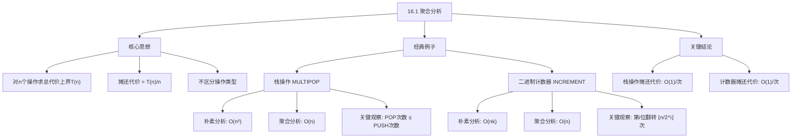

## 相关笔记

> [!abstract] 概览
> **聚合分析**（Aggregate Analysis）是摊还分析三种方法中最简单的一种。其核心思想是：对 $n$ 个操作的序列确定一个**总代价上界** $T(n)$，则每个操作的**摊还代价**为 $T(n)/n$。聚合分析不区分不同操作类型的代价差异，将所有操作视为同一类来计算平均代价。本节通过**栈操作（MULTIPOP）**和**二进制计数器（INCREMENT）**两个经典例子，展示聚合分析如何将朴素分析中的 $O(n^2)$ 或 $O(nk)$ 上界降至 $O(n)$。

---

## 知识结构总览



---

## 核心思想

> [!tip] 核心思路
> 聚合分析的基本策略是：**先求 $n$ 个操作的总代价上界 $T(n)$，再除以 $n$ 得到每个操作的摊还代价**。这种方法的关键在于找到一个紧凑的总代价上界，而不是简单地将每个操作的最坏情况代价相乘。聚合分析**不涉及概率假设**，因此其结论在最坏情况下仍然成立，这与平均情况分析有本质区别。

> [!def] 聚合分析（Aggregate Analysis）
> 设对一个数据结构执行 $n$ 个操作的序列，若能证明这 $n$ 个操作的总代价 $T(n)$ 的上界为 $T(n) = O(f(n))$，则每个操作的**摊还代价**（amortized cost）为 $T(n)/n = O(f(n)/n)$。聚合分析为所有操作分配**相同的**摊还代价，不区分不同类型的操作。

### 栈操作（MULTIPOP）

考虑一个栈 $S$，支持以下操作：

| 操作 | 描述 | 实际代价 |
|------|------|----------|
| `PUSH(S, x)` | 将元素 $x$ 压入栈 $S$ | $O(1)$ |
| `POP(S)` | 弹出栈顶元素 | $O(1)$ |
| `MULTIPOP(S, k)` | 弹出栈顶 $k$ 个元素 | $O(\min(s, k))$ |

其中 $s$ 为执行 MULTIPOP 时栈中的元素个数。

**MULTIPOP 伪代码**：

```
MULTIPOP(S, k)
1  while not STACK-EMPTY(S) and k > 0
2      POP(S)
3      k = k - 1
```

**朴素（最坏情况）分析**：

在一个由 $n$ 个 PUSH、POP 和 MULTIPOP 操作组成的序列中，MULTIPOP 的最坏情况代价为 $O(n)$（当栈中有 $n$ 个元素时执行 MULTIPOP）。因此，$n$ 个操作的总代价上界为 $O(n^2)$。

**聚合分析**：

> **【聚合分析（POP次数不超过PUSH次数，总代价O(n)）】**
关键观察：**一个对象（盘子）不能被弹出，除非它之前被压入**。因此，在 $n$ 个操作的序列中，POP 操作（包括 MULTIPOP 内部的 POP）的总次数不超过 PUSH 操作的总次数，而 PUSH 操作的总次数最多为 $n$。

设 $n$ 个操作中 PUSH 的次数为 $n_p$，POP（含 MULTIPOP 中的）的总次数为 $n_o$，则：

$$n_o \leq n_p \leq n$$

总代价 $T(n) = n_p \cdot O(1) + n_o \cdot O(1) = O(n_p + n_o) = O(n)$

因此，每个操作的**摊还代价**为 $T(n)/n = O(1)$。

### 二进制计数器（INCREMENT）

考虑一个 $k$ 位二进制计数器，用数组 $A[0..k-1]$ 表示，其中 $A[0]$ 是最低位。初始时所有位为 0。

**INCREMENT 伪代码**：

```
INCREMENT(A, k)
1  i = 0
2  while i < k and A[i] == 1
3      A[i] = 0
4      i = i + 1
5  if i < k
6      A[i] = 1
```

INCREMENT 的代价等于**翻转的位数**（即第 2-4 行循环的迭代次数加上可能的第 6 行赋值）。

**朴素分析**：

单次 INCREMENT 的最坏情况代价为 $\Theta(k)$（当所有 $k$ 位都为 1 时，需要翻转全部 $k$ 位）。$n$ 次 INCREMENT 的总代价上界为 $O(nk)$。

**聚合分析**：

> **【聚合分析（第i位翻转⌊n/2^i⌋次，总翻转次数<2n）】**
关键观察：考察第 $i$ 位 $A[i]$ 在 $n$ 次 INCREMENT 中被翻转的次数。

- $A[i]$ 每两次翻转中，一次是从 0 变为 1，一次是从 1 变为 0。
- $A[i]$ 从 0 变为 1 的频率：每经过 $2^i$ 次 INCREMENT 才会翻转一次。
- 因此，$A[i]$ 在 $n$ 次 INCREMENT 中被翻转 $\lfloor n / 2^i \rfloor$ 次。

总翻转次数：

$$\sum_{i=0}^{k-1} \left\lfloor \frac{n}{2^i} \right\rfloor \leq \sum_{i=0}^{k-1} \frac{n}{2^i} = n \sum_{i=0}^{k-1} \frac{1}{2^i} < n \sum_{i=0}^{\infty} \frac{1}{2^i} = 2n$$

因此，$n$ 次 INCREMENT 的总代价 $T(n) < 2n = O(n)$，每个操作的**摊还代价**为 $O(1)$。

> [!def] 摊还代价（Amortized Cost）
> 在聚合分析中，$n$ 个操作序列的总代价为 $T(n)$，则每个操作的**摊还代价**定义为 $\hat{c} = T(n)/n$。摊还代价保证：在最坏情况下，$n$ 个操作中每个操作的平均代价不超过 $\hat{c}$。注意，摊还代价适用于操作的**序列**，而非单个操作。

---

## 补充理解与拓展

> [!info] 摊还分析 vs 平均情况分析
> 摊还分析与平均情况分析有本质区别：
> - **摊还分析不涉及概率假设**。它考察的是对**任意**操作序列（包括最坏情况序列）的总代价上界，然后求平均。因此，摊还分析的结论在最坏情况下仍然成立。
> - **平均情况分析**依赖于对输入分布的概率假设（如所有排列等概率），其结论只在假设的分布下成立，对于特定的最坏输入可能不成立。
>
> 这一区分由 Tarjan (1985) 在其开创性工作中明确阐述。Tarjan 指出："摊还分析提供的是**确定性**的保证，而非概率性的保证。"
>
> **来源**：CLRS Chapter 16; Tarjan, R. E. (1985). "Amortized Computational Complexity." *SIAM Journal on Computing*, 14(2), 306-318.

> [!info] 聚合分析的局限性
> 聚合分析为所有操作分配**相同的**摊还代价，这意味着它无法区分不同操作类型的代价差异。例如，在栈操作中，PUSH 的实际代价为 1，而 MULTIPOP 的实际代价可能远大于 1，但聚合分析将它们的摊还代价都设为 $O(1)$。
>
> 这种"一刀切"的做法在以下场景中不够灵活：
> - 当不同操作类型的代价差异很大时，聚合分析可能无法给出紧凑的上界。
> - 当需要分析操作序列中特定操作的代价时，聚合分析无法提供细粒度的信息。
>
> 正是这些局限性，引出了**记账方法**（16.2节）和**势能方法**（16.3节）的动机。记账方法允许为不同操作分配不同的摊还代价，而势能方法则将"信用"与整个数据结构的状态关联起来，提供了最细粒度的分析能力。
>
> **来源**：Tarjan, R. E. (1985). "Amortized Computational Complexity." *SIAM Journal on Computing*, 14(2), 306-318.

---

## 易混淆点与辨析

> [!warning] 摊还代价 ≠ 单个操作的最坏代价
> 摊还代价是 $n$ 个操作的平均代价上界，**不是**单个操作的最坏代价。例如，单次 MULTIPOP 的最坏代价为 $O(n)$，但其摊还代价仅为 $O(1)$。不能说"每次 MULTIPOP 的代价都是 $O(1)$"，而应该说"$n$ 个操作序列中，每个操作的平均代价为 $O(1)$"。

> [!warning] 摊还分析 ≠ 平均情况分析
> 摊还分析**不涉及概率**，它是对最坏情况操作序列的平均代价进行分析。平均情况分析则依赖于输入的概率分布假设。两者的结论性质完全不同：摊还分析提供确定性保证，平均情况分析提供概率性保证。

> [!warning] 聚合分析的总代价上界必须紧凑
> 聚合分析的有效性依赖于找到一个**紧凑的**总代价上界 $T(n)$。如果简单地用每个操作的最坏代价乘以 $n$（如栈操作得到 $O(n^2)$），虽然正确但毫无意义。聚合分析的价值在于利用操作之间的**相互约束**（如 POP 次数不超过 PUSH 次数）来得到更紧凑的上界。

---

## 习题精选

| 题号 | 题目描述 | 难度 |
|:----:|----------|:----:|
| 16.1-1 | 若增加 MULTIPUSH(S, k) 操作，摊还代价是否仍为 $O(1)$？ | 中 |
| 16.1-2 | 若二进制计数器增加 DECREMENT 操作，用聚合分析证明 $n$ 次操作代价为 $O(nk)$ | 中 |
| 16.1-3 | 第 $i$ 个操作代价为 $i$（若 $i$ 为 2 的幂），否则代价为 1，求总代价 | 中 |

> [!faq]- 16.1-1 解答：MULTIPUSH 操作
> **题目**：考虑在栈操作中增加 `MULTIPUSH(S, k)` 操作，它将 $k$ 个元素依次压入栈中。证明或反驳：$n$ 个操作的摊还代价仍为 $O(1)$。
>
> **解答**：**反驳**。MULTIPUSH(S, k) 的实际代价为 $O(k)$，它可以在一次操作中压入 $O(n)$ 个元素。虽然 POP 总次数仍不超过 PUSH 总次数，但 $n$ 个操作中可能包含一个 MULTIPUSH(S, n) 操作，其代价为 $O(n)$，因此总代价为 $O(n) + O(n) = O(n)$（因为其他操作最多 $n-1$ 个，每个代价 $O(1)$）。实际上，总代价仍为 $O(n)$，摊还代价仍为 $O(1)$。
>
> 进一步分析：MULTIPUSH(S, k) 的代价为 $O(k)$，但它也增加了 $k$ 个元素到栈中。在 $n$ 个操作中，所有 MULTIPUSH 压入的元素总数加上所有 PUSH 压入的元素总数等于所有 POP（含 MULTIPOP 中的）弹出的元素总数。因此，所有压入操作的总代价等于所有弹出操作的总代价（都等于总压入/弹出元素数）。$n$ 个操作的总代价 = 总压入代价 + 总弹出代价 = $O(\text{总元素数})$。但总元素数可能远大于 $n$（一次 MULTIPUSH 就可以压入 $n$ 个元素），所以总代价可能为 $O(n^2)$，摊还代价为 $O(n)$，不再是 $O(1)$。
>
> **【反例构造（交替MULTIPUSH+POP序列总代价O(n^2)，摊还代价O(n)）】**
> **结论**：增加 MULTIPUSH 后，摊还代价**不再**为 $O(1)$。反例：执行一次 MULTIPUSH(S, n)（代价 $O(n)$），然后执行 $n$ 次 POP（代价 $O(n)$），总代价 $O(n)$，但操作数为 $n+1$。更极端的反例：交替执行 MULTIPUSH(S, n) 和 $n$ 次 POP，共 $2n$ 个操作，总代价 $O(n^2)$，摊还代价 $O(n)$。

> [!faq]- 16.1-2 解答：带 DECREMENT 的二进制计数器
> **题目**：若二进制计数器增加 DECREMENT 操作（将计数器减 1），用聚合分析证明 $n$ 次操作的总代价为 $O(nk)$。
>
> **【聚合分析（交替INCREMENT/DECREMENT序列中高位频繁翻转，总代价O(nk)）】**
> **解答**：考虑交替执行 INCREMENT 和 DECREMENT 的序列：INCREMENT, DECREMENT, INCREMENT, DECREMENT, ...。每次 INCREMENT 将最低位从 0 变为 1（代价 1），每次 DECREMENT 将最低位从 1 变为 0（代价 1）。但如果我们从 0 开始，INCREMENT 将其变为 1，DECREMENT 将其变为 0，如此反复。在这种交替序列中，第 $i$ 位 $A[i]$ 的翻转频率不再受 $2^i$ 的限制。
>
> 具体地，考虑序列：INCREMENT, DECREMENT, INCREMENT, DECREMENT, ...（共 $n$ 次操作）。计数器值在 0 和 1 之间交替。每次操作只翻转第 0 位，总代价为 $O(n)$。
>
> 但更复杂的序列可能导致高位频繁翻转。例如：连续 $2^k$ 次 INCREMENT 将计数器从 0 增至 $2^k$，然后连续 $2^k$ 次 DECREMENT 将其减回 0。在这个过程中，第 $i$ 位翻转了 $2 \cdot 2^{k-i}$ 次（INCREMENT 时翻转 $2^{k-i}$ 次，DECREMENT 时翻转 $2^{k-i}$ 次）。总翻转次数为 $\sum_{i=0}^{k-1} 2 \cdot 2^{k-i} = 2^{k+1} - 2 = O(2^k)$。操作次数为 $2 \cdot 2^k = 2^{k+1}$，所以总代价为 $O(nk)$（因为 $k$ 位都可能被翻转）。
>
> 实际上，在 $n$ 次操作中，每次操作最多翻转 $k$ 位，所以总代价上界为 $O(nk)$。这个上界是紧凑的，因为确实存在操作序列使得总代价为 $\Theta(nk)$。

> [!faq]- 16.1-3 解答：幂次操作代价
> **题目**：若第 $i$ 个操作的代价为 $i$（当 $i$ 为 2 的幂时），否则代价为 1。用聚合分析求 $n$ 个操作的总代价。
>
> **【聚合分析（2的幂次操作代价之和为等比级数≤2n，其余操作代价各1）】**
> **解答**：在 $n$ 个操作中，代价为 $i$ 的操作是那些编号 $i = 2^j$ 的操作（$j = 0, 1, 2, \ldots, \lfloor \lg n \rfloor$）。代价为 1 的操作有 $n - \lfloor \lg n \rfloor - 1$ 个。
>
> 总代价：
> $$T(n) = \sum_{\substack{i=1 \\ i=2^j}}^{n} i + \sum_{\substack{i=1 \\ i \neq 2^j}}^{n} 1 = \sum_{j=0}^{\lfloor \lg n \rfloor} 2^j + (n - \lfloor \lg n \rfloor - 1)$$
>
> 其中 $\sum_{j=0}^{\lfloor \lg n \rfloor} 2^j = 2^{\lfloor \lg n \rfloor + 1} - 1 \leq 2n - 1$。
>
> 因此：
> $$T(n) \leq 2n - 1 + n - 0 - 1 = 3n - 2 = O(n)$$
>
> 摊还代价为 $T(n)/n = O(1)$。

---

## 视频学习指南

| 资源 | 讲者/来源 | 内容 | 链接 |
|------|-----------|------|------|
| MIT 6.006 Lecture 13 | Erik Demaine | Amortized Analysis: Aggregate, Accounting, Potential | [YouTube](https://www.youtube.com/watch?v=smF8BhUIiKg) |
| CLRS Study Group | 社区 | Chapter 16 精读与习题讨论 | 待补充 |

---

## 教材原文

> [!quote] 教材原文（中文翻译）
> **16.1 聚合分析**
>
> 在一系列 $n$ 个操作中，最坏情况下代价最高的一种操作可能很昂贵，但聚合分析表明，该操作的高昂代价被其他操作的低廉代价所弥补。具体而言，如果我们能证明 $n$ 个操作的总代价为 $T(n)$，那么无论哪一种操作是最贵的，每个操作的摊还代价都是 $T(n)/n$。
>
> **栈操作**
>
> 在本节的第一个例子中，我们分析对一个栈进行的操作。栈 $S$ 支持以下操作：`PUSH(S, x)` 将元素 $x$ 压入栈 $S$ 中，代价为 $O(1)$；`POP(S)` 弹出 $S$ 的栈顶元素，代价为 $O(1)$。我们还引入一个新的操作 `MULTIPOP(S, k)`，它弹出 $S$ 的栈顶 $k$ 个元素，如果 $S$ 中元素不足 $k$ 个则弹出全部元素。MULTIPOP 的代价为 $O(\min(s, k))$，其中 $s$ 为 MULTIPOP 执行时栈中的元素个数。
>
> 虽然单个 MULTIPOP 操作的代价可能高达 $O(n)$，但一个包含 $n$ 个 PUSH、POP 和 MULTIPOP 操作的序列的总代价为 $O(n)$。原因在于，每个元素最多被弹出一次。由于 $n$ 个操作中最多执行 $n$ 次 PUSH，因此 POP 操作的总次数（包括 MULTIPOP 内部的 POP）最多为 $n$。于是，$n$ 个操作的总代价为 $O(n)$，每个操作的摊还代价为 $O(1)$。
>
> **二进制计数器**
>
> 作为第二个例子，我们分析一个 $k$ 位二进制计数器。我们用一个数组 $A[0..k-1]$ 来表示计数器，其中 $A[0]$ 是最低位。初始时所有位都为 0。INCREMENT 操作将计数器的值加 1。INCREMENT 的代价等于翻转的位数。
>
> 单次 INCREMENT 的最坏情况代价为 $\Theta(k)$，因此 $n$ 次 INCREMENT 的朴素上界为 $O(nk)$。然而，通过聚合分析，我们可以得到更紧凑的上界。第 $i$ 位 $A[i]$ 在 $n$ 次 INCREMENT 中被翻转 $\lfloor n / 2^i \rfloor$ 次。因此，总翻转次数为：
>
> $$\sum_{i=0}^{k-1} \left\lfloor \frac{n}{2^i} \right\rfloor < n \sum_{i=0}^{\infty} \frac{1}{2^i} = 2n$$
>
> 于是，$n$ 次 INCREMENT 的总代价为 $O(n)$，每个操作的摊还代价为 $O(1)$。

---

## 参见Wiki

- [[算法导论/concepts/聚合分析]] — 摊还分析的最直接方法

---
#学习/算法导论/第16章-摊还分析 #学习/算法导论/摊还分析/聚合分析
