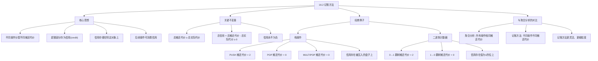

## 相关笔记

> [!abstract] 概览
> **记账方法**（Accounting Method），也称"银行家方法"（Banker's Method），是摊还分析的第二种方法。与[[16.1 聚合分析|聚合分析]]不同，记账方法允许为不同类型的操作分配**不同的摊还代价**。当操作的摊还代价超过其实际代价时，差额作为**信用**（credit）存储在数据结构中的特定对象上；后续操作的实际代价超过摊还代价时，用已存储的信用支付差额。记账方法的核心不变量是：**总信用始终非负**。

---

## 知识结构总览

---

## 核心思想

> [!tip] 核心思路
> 记账方法的核心策略是：**为每种类型的操作分配一个摊还代价** $\hat{c}_i$，使得在操作的整个序列中，**总摊还代价始终大于或等于总实际代价**。当某次操作的摊还代价 $\hat{c}_i$ 大于其实际代价 $c_i$ 时，将差额 $\hat{c}_i - c_i$ 作为**信用**存储在数据结构中的特定对象上。当后续操作的 $\hat{c}_i$ 小于 $c_i$ 时，用之前积累的信用来支付差额。**信用必须始终非负**，这是记账方法正确性的根本保证。

> [!def] 记账方法（Accounting Method）
> 设对数据结构执行 $n$ 个操作，第 $i$ 个操作的实际代价为 $c_i$，摊还代价为 $\hat{c}_i$。记账方法要求：
> $$\sum_{i=1}^{n} \hat{c}_i \geq \sum_{i=1}^{n} c_i$$
> 等价地，定义**总信用**为：
> $$\text{总信用} = \sum_{i=1}^{n} (\hat{c}_i - c_i) \geq 0$$
> 信用存储在数据结构中的特定对象上，任何时刻的信用都必须**非负**。如果总信用始终非负，则总摊还代价就是总实际代价的上界。

### 栈操作

回顾 [[16.1 聚合分析|16.1节]] 的栈操作例子。现在用记账方法分析。

**实际代价**：

| 操作 | 实际代价 |
|------|----------|
| `PUSH(S, x)` | 1 |
| `POP(S)` | 1 |
| `MULTIPOP(S, k)` | $\min(s, k)$ |

**摊还代价分配**：

| 操作 | 摊还代价 |
|------|----------|
| `PUSH(S, x)` | 2 |
| `POP(S)` | 0 |
| `MULTIPOP(S, k)` | 0 |

**信用机制**：

- 每次 `PUSH` 操作：实际代价为 1，摊还代价为 2，因此产生 **$1 的信用**。这 $1 的信用存储在**被压入的盘子**上。
- 每次 `POP` 操作：实际代价为 1，摊还代价为 0，因此消费 **$1 的信用**。弹出的盘子上恰好有 $1 的信用（因为每个盘子在压入时都获得了 $1 信用），所以信用被正确消费。
- 每次 `MULTIPOP` 操作：弹出 $k'$ 个元素（$k' = \min(s, k)$），实际代价为 $k'$，摊还代价为 0。每个被弹出的盘子上都有 $1 信用，共消费 $k'$ 的信用，恰好支付实际代价。

**正确性证明**：

**【信用绑定到盘子上：每个存在盘子恰好有 $1 信用】** 需要证明在任何时刻，总信用 $\geq 0$。

- 栈中每个盘子上的信用要么为 $1（刚被压入，尚未被弹出），要么为 $0（不存在，已被弹出）。
- 栈中每个存在的盘子上的信用恰好为 $1。
- 因此，总信用 = 栈中的盘子数 $\geq 0$。恒成立。

$n$ 个操作的总摊还代价为 $O(n)$（每个操作摊还代价为常数），因此总实际代价 $\leq O(n)$，每个操作的摊还代价为 $O(1)$。

### 二进制计数器

回顾 [[16.1 聚合分析|16.1节]] 的二进制计数器例子。现在用记账方法分析。

**信用机制**：

- 当某一位从 **0 翻转为 1** 时：实际代价为 1，分配摊还代价为 **$2**。其中 $1 支付翻转代价，另 $1 作为信用存储在**该位上**。
- 当某一位从 **1 翻转为 0** 时：实际代价为 1，分配摊还代价为 **$0**。用该位上存储的 $1 信用支付翻转代价。

**正确性证明**：

**【信用绑定到值为1的位上：总信用 = 1的个数 >= 0】** 需要证明在任何时刻，总信用 $\geq 0$。

- 每个值为 1 的位上恰好存储了 $1 的信用（在它被翻转为 1 时存入）。
- 每个值为 0 的位上没有信用（信用在翻转为 0 时被消费）。
- 因此，总信用 = 计数器中 1 的个数 $\geq 0$。恒成立。

**单次 INCREMENT 的摊还代价分析**：

每次 INCREMENT 至多将一个位从 0 翻转为 1（产生 $2 摊还代价），并将若干位从 1 翻转为 0（每个 $0 摊还代价）。因此，单次 INCREMENT 的摊还代价最多为 $2。

$n$ 次 INCREMENT 的总摊还代价为 $O(n)$，因此总实际代价 $\leq O(n)$，每个操作的摊还代价为 $O(1)$。

---

## 补充理解与拓展

> [!info] 记账方法的"信用"隐喻
> 记账方法的核心隐喻来自**银行账户**：你提前存入信用（存款），后续操作消费信用（取款）。信用必须始终非负，就像银行账户不能透支一样。
>
> 具体来说：
> - **存款**：当操作的摊还代价 > 实际代价时，差额存入数据结构中的特定对象。
> - **取款**：当操作的摊还代价 < 实际代价时，从数据结构中的对象上取出信用来支付。
> - **余额检查**：任何时刻，所有对象上的信用总和必须 $\geq 0$。
>
> 这种隐喻的精确性在于：信用不是抽象的概念，而是**与数据结构中的具体对象绑定**的。例如，在栈操作中，信用绑定在被压入的盘子上；在二进制计数器中，信用绑定在值为 1 的位上。这种绑定关系使得我们可以精确地追踪信用的流动。
>
> **来源**：CLRS Chapter 16; Tarjan, R. E. (1985). "Amortized Computational Complexity." *SIAM Journal on Computing*, 14(2), 306-318.

> [!info] 三种摊还分析方法的粒度对比
> 摊还分析的三种方法可以按照**粒度从粗到细**排列：
>
> 1. **[[16.1 聚合分析|聚合分析]]**（粗粒度）：所有操作分配**相同的**摊还代价。优点是简单直接，缺点是无法区分不同操作类型的代价差异。
>
> 2. **记账方法**（中粒度）：不同类型的操作可以分配**不同的**摊还代价，信用关联到数据结构中的**具体对象**。优点是更灵活，可以精确地为"昂贵"操作提供信用。缺点是需要为信用找到合适的"存储位置"。
>
> 3. **势能方法**（16.3节，细粒度）：信用关联到**整个数据结构的状态**，通过势能函数 $\Phi$ 来度量。优点是最通用、最灵活，适用于信用难以绑定到具体对象的场景。缺点是需要构造合适的势能函数。
>
> 三种方法的结论是等价的（如果分析正确的话），但记账方法和势能方法在复杂场景中更容易使用。Brown 与 Tarjan 在对 2-3 树的摊还分析中展示了记账方法的强大表达能力。
>
> **来源**：CLRS Chapter 16; Brown, M. R. & Tarjan, R. E. (1979). "A Fast Algorithm for the Minimum-Cost Spanning Tree Problem." *SIAM Journal on Computing*; Tarjan, R. E. (1985). "Amortized Computational Complexity." *SIAM Journal on Computing*, 14(2), 306-318.

---

## 易混淆点与辨析

> [!warning] 记账方法中信用必须始终非负
> 记账方法的正确性依赖于**总信用始终 $\geq 0$** 这一不变量。如果在某个时刻信用变为负数，则分析不成立——总摊还代价不再是总实际代价的上界。因此，在分配摊还代价时，必须仔细验证信用不会透支。

> [!warning] 信用存储在具体对象上，不是"全局池"
> 记账方法中的信用**绑定到数据结构中的特定对象**，而不是一个全局的"信用池"。这意味着在验证信用非负时，需要检查每个对象上的信用，而不仅仅是总和。例如，在栈操作中，信用存储在盘子上，弹出盘子时消费该盘子上的信用。如果将信用视为全局池，就无法精确追踪信用的来源和去向。

> [!warning] 摊还代价的分配不唯一
> 对于同一个问题，记账方法可能有多种有效的摊还代价分配方案。例如，在栈操作中，可以将 PUSH 的摊还代价设为 2、POP 和 MULTIPOP 设为 0；也可以将 PUSH 设为 3、POP 设为 -1、MULTIPOP 设为 0（但负的摊还代价可能使信用追踪更复杂）。选择哪种方案取决于分析的便利性，但所有正确方案的结论应该一致。

> [!warning] 记账方法 vs 聚合分析的结论等价
> 记账方法和聚合分析对同一个问题应该给出**相同**的总代价上界（如果分析都正确的话）。记账方法的优势在于分析的**过程**更灵活、更直观，而不是能得到更好的上界。

---

## 习题精选

| 题号 | 题目描述 | 难度 |
|:----:|----------|:----:|
| 16.2-1 | 用记账方法分析 16.1-1 中的 MULTIPUSH 操作 | 中 |
| 16.2-2 | 用记账方法分析动态数组（表扩张）的摊还代价 | 中 |
| 16.2-3 | 用记账方法证明：若栈操作中 POP 的摊还代价为 -1，PUSH 为 2，分析是否正确 | 中 |
| 16.2-4 | 设计一个数据结构，用记账方法分析其操作序列的摊还代价 | 高 |

> [!faq]- 16.2-1 解答：MULTIPUSH 的记账方法分析
> **题目**：用记账方法分析增加了 MULTIPUSH(S, k) 操作的栈。
>
> **【记账法（MULTIPUSH每个元素摊还代价$2，信用存在被压入的盘子上）】**
> **解答**：MULTIPUSH(S, k) 将 $k$ 个元素依次压入栈中，实际代价为 $O(k)$。
>
> 摊还代价分配方案：
> - `PUSH`：摊还代价 = 2（$1 支付实际代价，$1 存为信用）
> - `POP`：摊还代价 = 0（消费信用）
> - `MULTIPOP`：摊还代价 = 0（消费信用）
> - `MULTIPUSH`：摊还代价 = 2（每个被压入的元素摊还代价为 2）
>
> 但 MULTIPUSH(S, k) 的实际代价为 $k$，如果其摊还代价也为 $k$（即每个元素摊还代价为 2，共 $2k$），则每次 MULTIPUSH 产生 $k$ 的信用。这些信用存储在被压入的盘子上，后续 POP/MULTIPOP 消费信用。
>
> 总摊还代价 = 所有操作的摊还代价之和。由于每个被压入的元素贡献了 $2 的摊还代价，每个被弹出的元素贡献了 $0 的摊还代价，总摊还代价 = $2 \times (\text{PUSH次数} + \text{MULTIPUSH压入的元素数})$。
>
> 注意：MULTIPUSH(S, k) 在一次操作中压入 $k$ 个元素，但操作数只增加 1。如果 $k = n$，则 $n$ 个操作中可能只有 1 个 MULTIPUSH 和 $n-1$ 个其他操作，但 MULTIPUSH 压入了 $n$ 个元素。总摊还代价 = $2n + 0 = O(n)$，操作数为 $n$，摊还代价 = $O(1)$。
>
> 实际上，16.1-1 的反例分析有误。正确的分析是：无论用 MULTIPUSH 还是逐个 PUSH，压入 $m$ 个元素的总代价都是 $O(m)$。MULTIPUSH 只是"批量"操作，不影响总代价。因此，$n$ 个操作的总代价仍为 $O(n)$，摊还代价仍为 $O(1)$。

> [!faq]- 16.2-2 解答：动态数组的记账方法
> **题目**：用记账方法分析动态数组（表扩张）的摊还代价。
>
> **解答**：动态数组在空间不足时，分配一个大小为原来两倍的新数组，并将旧数组元素复制到新数组中。
>
> **【记账法（每次INSERT存$2信用在元素上，扩张时消费信用支付复制代价）】**
> 摊还代价分配：
> - `TABLE-INSERT`：摊还代价 = 3（$1 支付插入本身，$2 存为信用）
>
> 信用机制：每次插入时，将 $2 的信用存储在**刚插入的元素**上。
>
> 当数组扩张时，需要将所有旧元素复制到新数组。假设扩张前数组大小为 $m$，则复制代价为 $m$。但此时数组中已有 $m$ 个元素，每个元素上存储了 $2 的信用，总信用为 $2m$。复制 $m$ 个元素消费 $m$ 的信用，剩余信用为 $m \geq 0$。
>
> 因此，总信用始终非负，$n$ 次 TABLE-INSERT 的总摊还代价为 $O(n)$，每次操作的摊还代价为 $O(1)$。

> [!faq]- 16.2-3 解答：负摊还代价的验证
> **题目**：若 POP 的摊还代价为 -1，PUSH 为 2，分析是否正确。
>
> **【反例构造（PUSH存$1信用，POP需消费$2信用，连续POP导致透支）】**
> **解答**：需要验证总信用是否始终非负。
>
> - PUSH：摊还代价 2，实际代价 1，产生 $1 信用，存在盘子上。
> - POP：摊还代价 -1，实际代价 1，消费 $2 的信用（$1 - (-1) = 2$）。
>
> 但每个盘子上只有 $1 的信用（PUSH 时存入），POP 时需要消费 $2 的信用，这会导致**信用透支**！
>
> 反例：PUSH, PUSH, POP。PUSH 两次后，栈中有 2 个盘子，每个有 $1 信用，总信用 = $2。POP 一次，消费 $2 信用，总信用 = $0。再 POP 一次，需要消费 $2 信用，但总信用只有 $0，透支！
>
> **结论**：这种分配方案**不正确**，因为信用可能变为负数。

> [!faq]- 16.2-4 解答：设计数据结构
> **题目**：设计一个支持 INSERT、DELETE-MIN 和 DECREASE-KEY 操作的数据结构，用记账方法分析其摊还代价。
>
> **【记账法（INSERT存O(n)信用在元素上，DELETE-MIN消费信用）】**
> **解答**：考虑一个简单的**无序链表**实现：
> - INSERT：将元素插入链表头部，实际代价 $O(1)$。
> - DELETE-MIN：遍历整个链表找到最小元素并删除，实际代价 $O(n)$。
> - DECREASE-KEY：直接修改元素的关键字值，实际代价 $O(1)$。
>
> 摊还代价分配：
> - INSERT：摊还代价 = $O(n)$（$O(1)$ 支付插入，$O(n)$ 存为信用）
> - DELETE-MIN：摊还代价 = $O(1)$（消费信用）
> - DECREASE-KEY：摊还代价 = $O(1)$
>
> 信用存储在**每个插入的元素**上。INSERT 时为元素存入 $O(n)$ 的信用，DELETE-MIN 时遍历 $n$ 个元素消费 $O(n)$ 的信用。
>
> 但这种分析的粒度较粗。更精细的分析需要考虑操作序列的具体模式。这个例子展示了记账方法在处理"偶尔昂贵"操作时的灵活性。

---

## 视频学习指南

| 资源 | 讲者/来源 | 内容 | 链接 |
|------|-----------|------|------|
| MIT 6.006 Lecture 13 | Erik Demaine | Amortized Analysis: Accounting Method 详解 | [YouTube](https://www.youtube.com/watch?v=smF8BhUIiKg) |
| Abelson & Sussman SICP | MIT OCW | 记账方法在函数式编程中的应用 | 待补充 |

---

## 教材原文

> [!quote] 教材原文（中文翻译）
> **16.2 记账方法**
>
> 在聚合分析中，我们对所有操作分配相同的摊还代价。记账方法是一种更灵活的摊还分析技术，它对不同的操作可以分配不同的摊还代价。
>
> 具体而言，我们为第 $i$ 个操作分配一个摊还代价 $\hat{c}_i$，使得对于任意 $n$ 个操作的序列，有：
>
> $$\sum_{i=1}^{n} \hat{c}_i \geq \sum_{i=1}^{n} c_i$$
>
> 其中 $c_i$ 为第 $i$ 个操作的实际代价。差额 $\hat{c}_i - c_i$ 表示第 $i$ 个操作产生的信用（credit），我们将这些信用存储在数据结构中的特定对象上。信用可以在后续操作中被用来支付那些实际代价超过摊还代价的操作。
>
> 由于总信用 $\sum_{i=1}^{n} (\hat{c}_i - c_i) \geq 0$，总摊还代价给出了总实际代价的一个上界。
>
> **栈操作的记账分析**
>
> 对于栈操作，我们分配如下的摊还代价：PUSH 的摊还代价为 2，POP 和 MULTIPOP 的摊还代价为 0。当我们执行 PUSH 操作时，我们支付 $1 的实际代价，并将 $1 的信用存储在被压入的盘子上。当我们执行 POP 或 MULTIPOP 操作时，我们消费被弹出盘子上的信用来支付实际代价。
>
> 由于栈中每个盘子上的信用恰好为 $1，且盘子只有在被压入后才能被弹出，因此信用始终非负。$n$ 个操作的总摊还代价为 $O(n)$，每个操作的摊还代价为 $O(1)$。
>
> **二进制计数器的记账分析**
>
> 对于二进制计数器，我们分配如下的摊还代价：当某一位从 0 翻转为 1 时，摊还代价为 2（$1 支付翻转代价，$1 存为信用）；当某一位从 1 翻转为 0 时，摊还代价为 0（消费该位上的信用）。
>
> 由于每个值为 1 的位上恰好有 $1 的信用，总信用等于计数器中 1 的个数，始终非负。每次 INCREMENT 的摊还代价最多为 2，$n$ 次 INCREMENT 的总摊还代价为 $O(n)$，每个操作的摊还代价为 $O(1)$。

---

## 参见Wiki

- [[算法导论/concepts/记账方法]] — 基于具体对象信用的方法

---
#学习/算法导论/第16章-摊还分析 #学习/算法导论/摊还分析/记账方法
