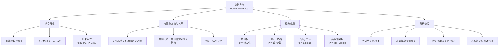

## 相关笔记

- 前置知识：[[16.1 聚合分析]]、[[16.2 记账方法]]、[[10.1 简单的基于数组的数据结构]]
- 同章笔记：[[16.4 动态表]]
- 章节汇总：[[第16章_摊还分析-章节汇总]]

> [!abstract] 概览
> **势能方法**（Potential Method）是摊还分析中==最灵活也最强大==的方法。与[[16.2 记账方法|记账方法]]类似，它为不同操作分配不同的摊还代价，但信用不是关联到具体对象，而是作为整个数据结构的"势能"（potential energy）来维护。
>
> - **核心公式**：$\hat{c}_i = c_i + \Phi(D_i) - \Phi(D_{i-1})$
> - **势能函数要求**：$\Phi(D_0) = 0$ 且 $\Phi(D_i) \geq 0$ 对所有 $i \geq 1$
> - **总摊还代价**：$\sum_{i=1}^{n} \hat{c}_i = \sum_{i=1}^{n} c_i + \Phi(D_n) - \Phi(D_0)$
> - **关键应用**：[[算法导论/concepts/栈]]操作分析、二进制计数器、Splay Tree、Union-Find、斐波那契堆

---

## 知识结构总览

---

## 核心思想

> [!tip] 核心思路
> 势能方法的核心思路是：**将数据结构在不同状态之间转换时"存储"或"释放"的能量，用来平滑各次操作的实际代价差异**。具体地，定义一个势能函数 $\Phi$，将数据结构映射到一个非负实数。当某次操作的**实际代价高于摊还代价**时，势能增加（"存入能量"）；当**实际代价低于摊还代价**时，势能减少（"释放能量"补偿代价）。只要势能始终非负，总摊还代价就是总实际代价的上界。这与物理学中**势能转化为动能**的过程完全类似：下坡时势能减少、速度增加，上坡时势能增加、速度降低，但总能量守恒。

### 势能方法的定义

> [!def] 势能方法（Potential Method）
> 设 $D_0$ 为初始数据结构，$D_i$ 为第 $i$ 次操作后的数据结构。势能函数 $\Phi$ 将每个数据结构状态映射到一个实数，满足：
> - $\Phi(D_0) = 0$
> - $\Phi(D_i) \geq 0$ 对所有 $i \geq 1$
>
> 第 $i$ 次操作的**摊还代价**定义为：
> $$\hat{c}_i = c_i + \Phi(D_i) - \Phi(D_{i-1})$$
>
> 其中 $c_i$ 是第 $i$ 次操作的**实际代价**，$\Phi(D_i) - \Phi(D_{i-1})$ 是势能的**变化量**。

### 总摊还代价的推导

> **【势能差求和（望远镜求和得总摊还代价=总实际代价+Φ(D_n)-Φ(D_0)）】**
对 $n$ 次操作的摊还代价求和：

$$\sum_{i=1}^{n} \hat{c}_i = \sum_{i=1}^{n} \left(c_i + \Phi(D_i) - \Phi(D_{i-1})\right) = \sum_{i=1}^{n} c_i + \Phi(D_n) - \Phi(D_0)$$

由于 $\Phi(D_0) = 0$ 且 $\Phi(D_n) \geq 0$，有：

$$\sum_{i=1}^{n} \hat{c}_i \geq \sum_{i=1}^{n} c_i$$

即**总摊还代价是总实际代价的上界**。这正是我们需要的——用摊还代价来界定最坏情况下的总实际代价。

### 与记账方法的关系

势能方法是记账方法的推广。在记账方法中，信用存储在数据结构的特定对象中；在势能方法中，"信用"以势能的形式存储在整个数据结构中。势能方法更灵活，因为势能函数可以捕获数据结构的全局状态信息，而不需要将信用精确绑定到个别对象。

### 例1：栈操作

考虑一个支持 PUSH、POP 和 MULTIPOP 操作的栈。

**势能函数**：$\Phi(D_i) = $ 栈中元素个数（即栈大小 $s_i$）

**验证约束条件**：
- $\Phi(D_0) = 0$（初始栈为空，元素个数为 0）
- $\Phi(D_i) = s_i \geq 0$（栈中元素个数始终非负）

> **【势能法（Φ=栈大小，PUSH势能增1，摊还代价=2）】**
**PUSH 操作**（实际代价 $c = 1$）：

$$\hat{c} = 1 + (s + 1) - s = 2$$

> **【势能法（Φ=栈大小，POP势能减1，摊还代价=0）】**
**POP 操作**（实际代价 $c = 1$）：

$$\hat{c} = 1 + (s - 1) - s = 0$$

> **【势能法（Φ=栈大小，MULTIPOP弹出k'个势能减k'，摊还代价=0）】**
**MULTIPOP(S, k) 操作**（弹出 $k' = \min(k, s)$ 个元素，实际代价 $c = k'$）：

$$\hat{c} = k' + (s - k') - s = 0$$

**结论**：每次操作的摊还代价为 $O(1)$，因此 $n$ 次操作的总摊还代价为 $O(n)$，与[[16.1 聚合分析|聚合分析]]和[[16.2 记账方法|记账方法]]的结果一致。

### 例2：二进制计数器

考虑一个 $k$ 位二进制计数器，初始值为 0，支持 INCREMENT 操作。

**势能函数**：$\Phi(D_i) = b_i$，其中 $b_i$ 是第 $i$ 次操作后计数器中 1 的个数。

**验证约束条件**：
- $\Phi(D_0) = 0$（初始值 0，没有 1）
- $\Phi(D_i) = b_i \geq 0$（1 的个数始终非负）

> **【势能法（Φ=1的个数，INCREMENT翻转t位时1的个数变化为-t+2，摊还代价=2）】**
**INCREMENT 操作分析**：

设 INCREMENT 翻转了 $t$ 位。在最坏情况下，翻转的 $t$ 位中，有 $t - 1$ 个从 1 变为 0，1 个从 0 变为 1。因此实际代价 $c = t$。

翻转后 1 的个数变化：
$$b_i = b_{i-1} - (t - 1) + 1 = b_{i-1} - t + 2$$

**当 $t \geq 1$ 时**（至少翻转 1 位）：

$$\hat{c} = t + (b_{i-1} - t + 2) - b_{i-1} = 2$$

**当 $t = 0$ 时**（不翻转任何位，即计数器溢出，但教材假设不发生溢出）：

$$\hat{c} = 0 + b_{i-1} - b_{i-1} = 0$$

但实际上 INCREMENT 至少翻转 1 位（最低位），所以 $t \geq 1$ 恒成立，$\hat{c} = 2$。

**结论**：每次 INCREMENT 的摊还代价为 $O(1)$，$n$ 次 INCREMENT 的总摊还代价为 $O(n)$。

---

## 补充理解与拓展

> [!info] 势能方法的物理学类比
>
> 势能方法的核心公式 $\hat{c}_i = c_i + \Phi(D_i) - \Phi(D_{i-1})$ 与物理学中的**动能定理**高度类似。在物理学中，外力做功等于动能的变化量；在势能方法中，实际代价 $c_i$ 加上势能变化量 $\Delta\Phi$ 等于摊还代价 $\hat{c}_i$。
>
> 直观理解：将数据结构想象成一个物理系统。当执行一个"昂贵"的操作（如 MULTIPOP 弹出多个元素）时，系统"释放"之前积累的势能来补偿实际代价，使得摊还代价保持较低；当执行一个"便宜"的操作（如 PUSH）时，系统"存入"一些势能以备将来使用。
>
> 这种类比不仅帮助理解势能方法的工作原理，也解释了为什么势能函数必须满足 $\Phi(D_i) \geq 0$：物理系统中的势能不能为负（否则意味着系统能凭空产生能量），类似地，摊还分析中的势能也不能为负（否则总摊还代价将不再是总实际代价的上界）。
>
> 来源：CLRS Chapter 16; UNM CS 561 Lecture Notes "Amortized Analysis"

> [!info] 势能方法在经典数据结构中的广泛应用
>
> 势能方法是摊还分析中最强大的工具，在许多经典数据结构的复杂度分析中发挥了关键作用：
>
> **Splay Tree（伸展树）**
>
> Sleator 和 Tarjan 于 1985 年提出。势能函数定义为 $\Phi = \sum_{x} \lg(\text{size}(x))$，其中 $\text{size}(x)$ 是以 $x$ 为根的子树中的节点数。利用势能方法可以证明，每次 splay 操作的摊还代价为 $O(\log n)$，从而保证了 m 次 splay 操作的总时间为 $O(m \log n)$。
>
> 来源：Sleator & Tarjan (1985) "Self-Adjusting Binary Search Trees", JACM 32(3), pp. 652-686
>
> **Union-Find（并查集）**
>
> Tarjan 于 1975 年利用势能方法（结合按秩合并和路径压缩）证明了 m 次 Union-Find 操作的摊还总时间为 $O(m \alpha(n))$，其中 $\alpha(n)$ 是反 Ackermann 函数，增长极其缓慢，在实际应用中可以视为常数（$\alpha(n) \leq 4$ 对所有实际可能的 $n$）。
>
> 来源：Tarjan (1975) "Efficiency of a Good But Not Linear Set Union Algorithm", JACM
>
> **斐波那契堆（Fibonacci Heap）**
>
> Fredman 和 Tarjan 于 1987 年提出。势能函数定义为 $\Phi = t(H) + 2m(H)$，其中 $t(H)$ 是堆中树的数量，$m(H)$ 是标记节点的数量。利用势能方法可以证明：INSERT 摊还 $O(1)$，EXTRACT-MIN 摊还 $O(\log n)$，DECREASE-KEY 摊还 $O(1)$。这使得 Dijkstra 算法和 Prim 算法的时间复杂度分别优化到 $O(V \log V + E)$ 和 $O(E + V \log V)$。
>
> 来源：Fredman & Tarjan (1987) "Fibonacci Heaps and Their Uses in Improved Network Optimization Algorithms", JACM

---

## 易混淆点与辨析

> [!warning] 误区辨析
>
> **误区一：势能方法与记账方法完全相同**
>
> 虽然两种方法在许多问题中给出相同的摊还代价，但它们的设计哲学不同。记账方法将"信用"绑定到数据结构的**特定对象**上（如栈中的特定元素），而势能方法将"势能"绑定到**整个数据结构**的全局状态上。势能方法更灵活——有些问题的势能函数无法自然地分解为对各个对象的信用分配。例如，Splay Tree 的势能函数 $\Phi = \sum_x \lg(\text{size}(x))$ 依赖于子树大小，这是一种全局性质，难以用记账方法来处理。
>
> **误区二：势能函数可以任意选择**
>
> 势能函数的设计是势能方法中最具技巧性的部分。一个好的势能函数需要满足两个条件：（1）$\Phi(D_0) = 0$ 且 $\Phi(D_i) \geq 0$；（2）能有效地"平滑"各次操作的代价差异。如果势能函数设计不当，虽然结论仍然正确（总摊还代价仍是上界），但得到的摊还代价可能过于宽松，失去分析的意义。例如，如果对栈操作选择 $\Phi(D_i) = 0$（恒为零势能），则 $\hat{c}_i = c_i$，MULTIPOP 的摊还代价就是其最坏情况实际代价 $O(n)$，无法得到 $O(1)$ 的摊还上界。
>
> **误区三：势能方法只能证明上界**
>
> 势能方法证明的是：总摊还代价 $\geq$ 总实际代价。因此，如果算出每次操作摊还 $O(1)$，则总实际代价 $\leq$ 总摊还代价 $= O(n)$。但势能方法本身**不能**证明下界——它不能告诉你"实际代价至少是多少"。要证明下界，需要使用聚合分析或其他方法。
>
> **误区四：势能函数必须恒为正**
>
> 势能函数的要求是 $\Phi(D_i) \geq 0$（非负），而非严格为正。初始状态 $\Phi(D_0) = 0$ 是允许的，且在实际分析中很常见。关键在于 $\Phi$ 不能取负值，否则总摊还代价可能小于总实际代价，失去上界性质。

---

## 习题精选

| 题号 | 题目描述 | 难度 | 核心考点 |
|:---:|:---|:---:|:---|
| 16.3-1 | 对栈操作使用势能函数 $\Phi(D_i) = 2s_i$（$s_i$ 为栈大小），分析 PUSH、POP、MULTIPOP 的摊还代价 | ★★ | 势能函数的设计与验证 |
| 16.3-2 | 对二进制计数器使用势能函数 $\Phi(D_i) = 2b_i - i$（$b_i$ 为 1 的个数），分析 INCREMENT 的摊还代价 | ★★★ | 非标准势能函数 |
| 16.3-3 | 对栈操作使用势能函数 $\Phi(D_i) = s_i^2$，分析三种操作的摊还代价 | ★★ | 非线性势能函数 |
| 16.3-4 | 对二进制计数器使用势能函数 $\Phi(D_i) = i \cdot b_i$，分析 INCREMENT 的摊还代价 | ★★★★ | 复杂势能函数分析 |
| 16.3-5 | 对一个支持 INSERT、DELETE-MIN 的数据结构设计势能函数并分析 | ★★★ | 势能方法的灵活应用 |
| 16.3-6 | 证明对任意势能函数 $\Phi$，势能方法给出的总摊还代价是总实际代价的上界 | ★★ | 势能方法的正确性 |
| 16.3-7 | 对一个支持 INSERT、DELETE 的动态数组设计势能函数并分析 | ★★★ | 为动态表设计势能函数 |

> [!faq]- 16.3-1 使用势能函数 $\Phi(D_i) = 2s_i$ 分析栈操作
> **题目**：设栈的势能函数为 $\Phi(D_i) = 2s_i$，其中 $s_i$ 是第 $i$ 次操作后栈中的元素个数。分析 PUSH、POP、MULTIPOP 的摊还代价。
>
> **【势能法（Φ=2s_i，PUSH摊还3，POP摊还-1，MULTIPOP摊还-k'，总仍O(n)）】**
> **思路**：验证约束条件后，分别计算每种操作的摊还代价。
>
> **答案**：
>
> **验证约束条件**：
> - $\Phi(D_0) = 2 \times 0 = 0$ ✓
> - $\Phi(D_i) = 2s_i \geq 0$ ✓
>
> **PUSH**（$c = 1$，栈大小从 $s$ 变为 $s + 1$）：
> $$\hat{c} = 1 + 2(s + 1) - 2s = 1 + 2 = 3$$
>
> **POP**（$c = 1$，栈大小从 $s$ 变为 $s - 1$，假设 $s \geq 1$）：
> $$\hat{c} = 1 + 2(s - 1) - 2s = 1 - 2 = -1$$
>
> **MULTIPOP(S, k)**（$c = k'$，$k' = \min(k, s)$，栈大小从 $s$ 变为 $s - k'$）：
> $$\hat{c} = k' + 2(s - k') - 2s = k' - 2k' = -k'$$
>
> **结论**：PUSH 的摊还代价为 3，POP 为 -1，MULTIPOP 为 $-k'$。虽然单个操作的摊还代价可以为负，但总摊还代价仍然是总实际代价的上界。$n$ 次操作的总摊还代价为 $O(n)$（因为每次 PUSH 最多贡献 3，而 POP 和 MULTIPOP 的负贡献不会使总和超过 $3n$）。

> [!faq]- 16.3-2 使用势能函数 $\Phi(D_i) = 2b_i - i$ 分析二进制计数器
> **题目**：设 $k$ 位二进制计数器的势能函数为 $\Phi(D_i) = 2b_i - i$，其中 $b_i$ 是第 $i$ 次 INCREMENT 后计数器中 1 的个数。分析 INCREMENT 的摊还代价。
>
> **【势能函数验证失败（Φ=2b_i-i 可能为负，不满足非负约束）】**
> **思路**：先验证约束条件，然后计算每次 INCREMENT 的摊还代价。
>
> **答案**：
>
> **验证约束条件**：
> - $\Phi(D_0) = 2 \times 0 - 0 = 0$ ✓
> - 需要验证 $\Phi(D_i) = 2b_i - i \geq 0$，即 $b_i \geq i / 2$。
>
> 注意到 $b_i \geq 0$，但 $i$ 可以很大，所以 $2b_i - i$ 可能为负！例如，如果 $i = 10$ 且 $b_i = 0$，则 $\Phi = -10 < 0$。因此，这个势能函数**不满足** $\Phi(D_i) \geq 0$ 的约束条件。
>
> 然而，如果我们放宽约束条件，仍然可以分析摊还代价：
>
> 设 INCREMENT 翻转了 $t$ 位（$t - 1$ 个 1→0，1 个 0→1），则 $b_i = b_{i-1} - (t - 1) + 1 = b_{i-1} - t + 2$。
>
> $$\hat{c} = t + (2(b_{i-1} - t + 2) - i) - (2b_{i-1} - (i - 1)) = t + 2b_{i-1} - 2t + 4 - i - 2b_{i-1} + i - 1 = 3 - t$$
>
> 当 $t = 1$ 时，$\hat{c} = 2$；当 $t = 2$ 时，$\hat{c} = 1$；当 $t \geq 3$ 时，$\hat{c} \leq 0$。
>
> **注意**：由于势能函数不满足非负约束，总摊还代价 $\sum \hat{c}_i$ 不一定是总实际代价的上界。此题说明势能函数的设计必须谨慎，约束条件的验证不可省略。

> [!faq]- 16.3-3 使用势能函数 $\Phi(D_i) = s_i^2$ 分析栈操作
> **【势能法（Φ=s_i^2，PUSH摊还O(s)非O(1)，说明势能函数选择影响分析质量）】**
> **题目**：设栈的势能函数为 $\Phi(D_i) = s_i^2$，分析 PUSH、POP、MULTIPOP 的摊还代价。
>
> **答案**：
>
> **验证约束条件**：
> - $\Phi(D_0) = 0^2 = 0$ ✓
> - $\Phi(D_i) = s_i^2 \geq 0$ ✓
>
> **PUSH**（$c = 1$，栈大小从 $s$ 变为 $s + 1$）：
> $$\hat{c} = 1 + (s + 1)^2 - s^2 = 1 + 2s + 1 = 2s + 2$$
>
> **POP**（$c = 1$，栈大小从 $s$ 变为 $s - 1$，$s \geq 1$）：
> $$\hat{c} = 1 + (s - 1)^2 - s^2 = 1 + s^2 - 2s + 1 - s^2 = 2 - 2s$$
>
> **MULTIPOP(S, k)**（$c = k'$，$k' = \min(k, s)$，栈大小从 $s$ 变为 $s - k'$）：
> $$\hat{c} = k' + (s - k')^2 - s^2 = k' + s^2 - 2sk' + k'^2 - s^2 = k' - 2sk' + k'^2 = k'(k' - 2s + 1)$$
>
> 由于 $k' \leq s$，有 $k' - 2s + 1 \leq 1 - s \leq 0$，所以 $\hat{c} \leq 0$。
>
> **结论**：PUSH 的摊还代价为 $O(s)$，不是 $O(1)$。这个势能函数虽然满足约束条件，但给出的摊还上界过于宽松。这说明势能函数的选择直接影响分析的质量——$\Phi(D_i) = s_i$ 是更好的选择。

---

## 视频学习指南

| 资源 | 链接 | 说明 |
|:---|:---|:---|
| MIT 6.006 Lecture 11 | [YouTube](https://www.youtube.com/watch?v=ZaVM057DuzE) | 摊还分析导论，包含势能方法 |
| CMU 15-451 Lecture 7 | [YouTube](https://www.youtube.com/watch?v=W3jC4A7GzBQ) | 势能方法深入讲解 |
| Abdul Bari - Amortized Analysis | [YouTube](https://www.youtube.com/watch?v=7kL0pGLLqWA) | 直观讲解势能方法 |
| GeeksforGeeks Potential Method | [GFG](https://www.geeksforgeeks.org/potential-method-amortized-analysis/) | 图文详解 + 代码示例 |

---

## 教材原文

> [!quote] CLRS 第4版 16.3节原文
> **16.3 势能方法**
>
> 势能方法与记账方法一样，通过为不同的操作赋予不同的摊还代价来工作。势能方法将信用作为"势能"与整个数据结构关联起来，而不是将信用与数据结构中的个别对象关联起来。
>
> 势能方法的工作原理如下。我们从某个初始数据结构 $D_0$ 开始。对于每个 $i = 1, 2, \ldots, n$，设 $c_i$ 为第 $i$ 个操作的实际代价，$D_i$ 为在 $D_{i-1}$ 上应用第 $i$ 个操作的结果。势能函数 $\Phi$ 将每个数据结构 $D_i$ 映射到一个实数 $\Phi(D_i)$，这就是与该数据结构关联的势能。第 $i$ 个操作的摊还代价 $\hat{c}_i$ 通过势能函数定义为：
>
> $$\hat{c}_i = c_i + \Phi(D_i) - \Phi(D_{i-1})$$
>
> 因此，每个操作的摊还代价等于其实际代价加上该操作引起的势能变化量。
>
> 总摊还代价为：
>
> $$\sum_{i=1}^{n} \hat{c}_i = \sum_{i=1}^{n} (c_i + \Phi(D_i) - \Phi(D_{i-1})) = \sum_{i=1}^{n} c_i + \Phi(D_n) - \Phi(D_0)$$
>
> 如果我们定义一个势能函数 $\Phi$ 使得 $\Phi(D_0) = 0$ 且对所有 $i = 1, 2, \ldots, n$ 都有 $\Phi(D_i) \geq 0$，则总摊还代价就是总实际代价的上界。因为 $\Phi(D_n) \geq 0$，所以 $\sum_{i=1}^{n} \hat{c}_i \geq \sum_{i=1}^{n} c_i$。在实践中，我们并不总是能很容易地算出 $\Phi(D_i)$ 的精确值，但可以证明 $\Phi(D_i) \geq 0$。
>
> 直观地说，如果第 $i$ 个操作的实际代价超过了它的摊还代价，势能就会增加以弥补差额。如果实际代价低于摊还代价，势能就会减少以弥补差额。势能方法之所以有效，是因为势能下降释放的能量支付了实际代价超过摊还代价的部分。
>
> **栈操作**
>
> 如同记账方法的例子，我们用势能方法分析一个栈。我们定义栈 $S$ 在第 $i$ 次操作后的势能为栈中元素的个数：
>
> $$\Phi(D_i) = s_i$$
>
> 其中 $s_i$ 是第 $i$ 次操作后栈中的元素个数。由于栈最初为空，$s_0 = 0$，因此 $\Phi(D_0) = 0$。由于栈中的元素个数永远不会为负，对所有 $i \geq 1$ 都有 $\Phi(D_i) \geq 0$。
>
> PUSH 操作的摊还代价为：
>
> $$\hat{c}_i = c_i + \Phi(D_i) - \Phi(D_{i-1}) = 1 + (s_i + 1) - s_i = 2$$
>
> MULTIPOP 操作弹出 $k' = \min(k, s)$ 个元素，其摊还代价为：
>
> $$\hat{c}_i = c_i + \Phi(D_i) - \Phi(D_{i-1}) = k' + (s_i - k') - s_i = 0$$
>
> 类似地，POP 操作的摊还代价为 0。因此，每个操作的摊还代价为 $O(1)$。
>
> **二进制计数器**
>
> 我们用势能方法分析一个 $k$ 位二进制计数器。我们定义计数器在第 $i$ 次 INCREMENT 操作后的势能为计数器中 1 的个数：
>
> $$\Phi(D_i) = b_i$$
>
> 由于计数器初始为 0，$b_0 = 0$，因此 $\Phi(D_0) = 0$。由于 $b_i \geq 0$，对所有 $i \geq 1$ 都有 $\Phi(D_i) \geq 0$。
>
> 设第 $i$ 次 INCREMENT 操作翻转了 $t_i$ 位。则实际代价 $c_i = t_i$。翻转后 1 的个数为 $b_i = b_{i-1} - (t_i - 1) + 1 = b_{i-1} - t_i + 2$。因此，摊还代价为：
>
> $$\hat{c}_i = c_i + \Phi(D_i) - \Phi(D_{i-1}) = t_i + (b_{i-1} - t_i + 2) - b_{i-1} = 2$$
>
> 每次操作的摊还代价至多为 2，因此 $n$ 次操作的总摊还代价为 $O(n)$。

---

## 参见Wiki

- [[算法导论/concepts/势能方法]] — 最灵活的摊还分析方法

---

#学习/算法导论/第16章-摊还分析 #学习/算法导论/摊还分析/势能方法
