## 相关笔记

- 前置知识：[[16.1 聚合分析]]、[[16.2 记账方法]]、[[16.3 势能方法]]、[[10.1 简单的基于数组的数据结构]]
- 同章笔记：[[16.3 势能方法]]
- 章节汇总：[[第16章_摊还分析-章节汇总]]

> [!abstract] 概览
> **动态表**（Dynamic Table）是一种支持插入和删除操作、能自动调整大小的数组。本节将[[16.3 势能方法|势能方法]]应用于动态表的分析，证明在仅插入场景和插入+删除场景下，每次操作的摊还代价均为 $O(1)$。
>
> - **负载因子**：$\alpha(T) = T.num / T.size$，空表定义为 $\alpha = 1$
> - **表扩张**：当 $\alpha = 1$ 时，分配 2 倍大小的新表
> - **表缩容**：当 $\alpha < 1/4$ 时，分配 1/2 大小的新表
> - **关键设计**：缩容阈值为 $1/4$ 而非 $1/2$，避免"抖动"（thrashing）
> - **核心结论**：TABLE-INSERT 和 TABLE-DELETE 的摊还代价均为 $O(1)$

---

## 知识结构总览

```mermaid
flowchart TD
    A["动态表<br/>Dynamic Table"] --> B["基本概念"]
    B --> B1["T.table: 数组"]
    B --> B2["T.num: 已存储元素数"]
    B --> B3["T.size: 分配的总大小"]
    B --> B4["负载因子 α = T.num / T.size"]

    A --> C["表扩张<br/>Table Expansion"]
    C --> C1["触发条件: α = 1"]
    C --> C2["策略: 分配 2×T.size 的新表"]
    C --> C3["代价: 复制所有元素 O(num)"]

    A --> D["表缩容<br/>Table Contraction"]
    D --> D1["触发条件: α < 1/4"]
    D --> D2["策略: 分配 T.size/2 的新表"]
    D --> D3["代价: 复制所有元素 O(num)"]
    D --> D4["防抖动: 阈值 1/4 而非 1/2"]

    A --> E["摊还分析"]
    E --> E1["仅插入场景<br/>Φ = 2·num - size"]
    E --> E2["插入+删除场景<br/>Φ 分段定义"]
    E --> E3["结论: INSERT/DELETE 均 O(1)"]

    A --> F["工程实现"]
    F --> F1["Python list: factor ≈ 1.125"]
    F --> F2["Java ArrayList: factor = 1.5"]
    F --> F3["C++ vector: factor = 2"]
    F --> F4["Go slice: factor = 2"]
```



---

## 核心思想

> [!tip] 核心思路
> 动态表的核心思路是：**当数组空间不足时自动扩容，当空间利用率过低时自动缩容**，使得用户无需预先知道数据规模。扩容和缩容的代价（复制所有元素）虽然单次为 $O(n)$，但通过合理的扩容/缩容策略和势能分析，可以证明**每次操作的摊还代价为 $O(1)$**。关键设计在于扩容因子和缩容阈值之间的"缓冲区"，它保证了连续的扩容/缩容之间有足够的操作间隔，避免了反复扩容缩容的"抖动"现象。

### 基本概念

> [!def] 动态表（Dynamic Table）
> 动态表是一种支持插入和删除操作、能自动调整大小的数组。它维护以下属性：
> - **T.table**：存储元素的实际数组
> - **T.num**：当前已存储的元素个数
> - **T.size**：当前分配的总槽位数（$T.num \leq T.size$）
>
> **负载因子**定义为 $\alpha(T) = T.num / T.size$。对于空表（$T.num = T.size = 0$），约定 $\alpha = 1$。

### TABLE-INSERT 伪代码

```
TABLE-INSERT(T, x)
1  if T.size == 0
2      allocate T.table with 1 slot
3      T.size = 1
4  if T.num == T.size
5      allocate new-table with 2 * T.size slots
6      insert all items in T.table into new-table
7      free T.table
8      T.table = new-table
9      T.size = 2 * T.size
10 insert x into T.table
11 T.num = T.num + 1
```

**算法解释**：

- **第1-3行**：处理空表的特殊情况，分配一个槽位
- **第4-9行**：如果表已满（$T.num = T.size$，即 $\alpha = 1$），执行==表扩张==：分配一个 2 倍大小的新表，将所有元素复制到新表，释放旧表
- **第10-11行**：将新元素插入表尾，元素计数加 1

### 仅插入的动态表分析

考虑只有 TABLE-INSERT 操作的场景。

**势能函数**：

$$\Phi(T) = 2 \cdot T.num - T.size$$

**验证约束条件**：

- 初始时 $T.num = T.size = 0$，$\Phi = 0 - 0 = 0$ ✓
- 需要验证 $\Phi(T) \geq 0$：
  - 当 $\alpha \leq 1$ 时（即 $T.num \leq T.size$），$\Phi = 2 \cdot T.num - T.size \leq T.size \leq 2 \cdot T.size$，但需要 $\Phi \geq 0$，即 $2 \cdot T.num \geq T.size$，即 $\alpha \geq 1/2$。当 $\alpha < 1/2$ 时，$\Phi < 0$！

> **【势能函数验证（仅插入场景中 α≥1/2 恒成立，故 Φ=2num-size≥0）】**
这里需要更仔细的分析。实际上，在仅插入的场景中，负载因子 $\alpha$ 始终 $\geq 1/2$（除了初始空表）。原因如下：

- 初始时 $\alpha = 1$（约定）
- 每次 INSERT 后，如果没触发扩张，$\alpha$ 增加
- 如果触发扩张，$T.size$ 翻倍，$T.num$ 加 1，新的 $\alpha = (T.num + 1) / (2 \cdot T.size) = (T.size + 1) / (2 \cdot T.size) \approx 1/2$

因此，在仅插入场景中，$\alpha \geq 1/2$ 恒成立，$\Phi = 2 \cdot T.num - T.size \geq 0$ 恒成立。

> **【势能法（普通插入：Φ增2，摊还代价=1+2=3）】**
**情况一：普通插入（不触发扩张，$T.num < T.size$）**

实际代价 $c = 1$（仅插入一个元素）。

$$\hat{c} = 1 + (2 \cdot (T.num + 1) - T.size) - (2 \cdot T.num - T.size) = 1 + 2 = 3$$

> **【势能法（扩张插入：Φ从T.size降至2，势能释放支付复制代价，摊还=3）】**
**情况二：触发扩张的插入（$T.num = T.size$，扩张后 $T.size' = 2 \cdot T.size$）**

实际代价 $c = T.num + 1$（复制 $T.num$ 个旧元素 + 插入 1 个新元素）。

扩张前：$\Phi_{\text{before}} = 2 \cdot T.num - T.size = 2 \cdot T.size - T.size = T.size$

扩张后：$T.num' = T.num + 1$，$T.size' = 2 \cdot T.size$

$\Phi_{\text{after}} = 2 \cdot (T.num + 1) - 2 \cdot T.size = 2 \cdot T.num + 2 - 2 \cdot T.size = 2 \cdot T.size + 2 - 2 \cdot T.size = 2$

$$\hat{c} = (T.num + 1) + 2 - T.size = (T.size + 1) + 2 - T.size = 3$$

**结论**：无论是否触发扩张，TABLE-INSERT 的摊还代价均为 3 = $O(1)$。

### 插入和删除的动态表分析

当动态表同时支持插入和删除时，需要引入==表缩容==机制。

**TABLE-DELETE 伪代码**：

```
TABLE-DELETE(T, x)
1  if T.num == 0
2      error "underflow"
3  x = T.table[T.num]
4  T.num = T.num - 1
5  if T.num < T.size / 4
6      if T.size >= 1
7          allocate new-table with max(T.size / 2, 1) slots
8          insert all items in T.table into new-table
9          free T.table
10         T.table = new-table
11         T.size = max(T.size / 2, 1)
```

**算法解释**：

- **第1-2行**：检查下溢（空表不能删除）
- **第3-4行**：删除最后一个元素（或指定元素），元素计数减 1
- **第5-11行**：如果负载因子低于 $1/4$，执行==表缩容==：分配一个 $T.size / 2$ 大小的新表（最小为 1），复制所有剩余元素

**分段势能函数**：

$$\Phi(T) = \begin{cases} 2 \cdot T.num - T.size & \text{若 } T.num \geq T.size / 2 \\ T.size / 2 - T.num & \text{若 } T.num < T.size / 2 \end{cases}$$

> **【分段势能函数验证（num≥size/2时Φ=2num-size≥0，num<size/2时Φ=size/2-num>0）】**
**验证约束条件**：

- 初始时 $T.num = T.size = 0$，$\Phi = 0$ ✓
- 当 $T.num \geq T.size / 2$ 时：$\Phi = 2 \cdot T.num - T.size \geq 2 \cdot (T.size / 2) - T.size = 0$ ✓
- 当 $T.num < T.size / 2$ 时：$\Phi = T.size / 2 - T.num > T.size / 2 - T.size / 2 = 0$ ✓

**TABLE-INSERT 分析（插入+删除场景）**：

> **【势能法分段分析（INSERT四种情况：α≥1/2不扩张、α≥1/2扩张、α<1/2不扩张、α<1/2跨阈值）】**
分四种情况讨论：

**情况一**：$\alpha \geq 1/2$，不触发扩张（$T.num + 1 \leq T.size$）

$$\hat{c} = 1 + (2(T.num + 1) - T.size) - (2 \cdot T.num - T.size) = 3$$

**情况二**：$\alpha \geq 1/2$，触发扩张（$T.num = T.size$）

扩张前 $\Phi = T.size$，扩张后 $T.num' = T.size + 1$，$T.size' = 2 \cdot T.size$，$\alpha' = (T.size + 1) / (2 \cdot T.size) > 1/2$，所以 $\Phi' = 2(T.size + 1) - 2 \cdot T.size = 2$。

$$\hat{c} = (T.size + 1) + 2 - T.size = 3$$

**情况三**：$\alpha < 1/2$，不触发扩张（$T.num + 1 < T.size / 2$）

$$\hat{c} = 1 + (T.size / 2 - (T.num + 1)) - (T.size / 2 - T.num) = 1 - 1 = 0$$

**情况四**：$\alpha < 1/2$，不触发扩张但 $\alpha' \geq 1/2$（$T.num + 1 = T.size / 2$）

$$\hat{c} = 1 + (2(T.num + 1) - T.size) - (T.size / 2 - T.num) = 1 + (T.size - T.size) - (T.size / 2 - T.num) = 1 + T.num - T.size / 2$$

由于 $T.num = T.size / 2 - 1$，$\hat{c} = 1 + T.size / 2 - 1 - T.size / 2 = 0$。

**TABLE-DELETE 分析**：

> **【势能法分段分析（DELETE四种情况：α≥1/2不缩容、α≥1/2缩容、α<1/2不缩容、α<1/2缩容）】**
分四种情况讨论：

**情况一**：$\alpha \geq 1/2$，不触发缩容（$T.num - 1 \geq T.size / 4$）

$$\hat{c} = 1 + (2(T.num - 1) - T.size) - (2 \cdot T.num - T.size) = 1 - 2 = -1$$

**情况二**：$\alpha \geq 1/2$，触发缩容（$T.num - 1 < T.size / 4$）

缩容前 $\Phi = 2 \cdot T.num - T.size$，缩容后 $T.size' = T.size / 2$，$T.num' = T.num - 1$。

由于 $T.num - 1 < T.size / 4$，有 $T.num' < T.size' / 2$，所以 $\Phi' = T.size' / 2 - T.num' = T.size / 4 - (T.num - 1)$。

$$\hat{c} = (T.num + T.size / 2) + (T.size / 4 - T.num + 1) - (2 \cdot T.num - T.size)$$

化简后 $\hat{c} \leq 2$。

**情况三**：$\alpha < 1/2$，不触发缩容（$T.num - 1 \geq T.size / 4$）

$$\hat{c} = 1 + (T.size / 2 - (T.num - 1)) - (T.size / 2 - T.num) = 1 + 1 = 2$$

**情况四**：$\alpha < 1/2$，触发缩容（$T.num - 1 < T.size / 4$）

缩容前 $\Phi = T.size / 2 - T.num$，缩容后 $T.size' = T.size / 2$，$T.num' = T.num - 1$。

由于 $T.num' < T.size' / 2$，$\Phi' = T.size' / 2 - T.num' = T.size / 4 - T.num + 1$。

$$\hat{c} = (T.num - 1 + T.size / 2) + (T.size / 4 - T.num + 1) - (T.size / 2 - T.num)$$

化简后 $\hat{c} \leq 2$。

**结论**：在所有情况下，TABLE-INSERT 和 TABLE-DELETE 的摊还代价均为 $O(1)$。

### 防抖动设计

> [!def] 抖动（Thrashing）
> 如果扩容因子和缩容因子相同（例如都是 2 倍），在某个负载因子附近反复插入和删除会导致反复扩容和缩容，每次操作都触发 $O(n)$ 的元素复制，使得摊还代价退化为 $O(n)$。

> **【缓冲区论证（扩容阈值1与缩容阈值1/4之间有Ω(n)次操作间隔）】**
CLRS 的解决方案是设置不对称的阈值：
- **扩容**：当 $\alpha = 1$ 时触发（表满时）
- **缩容**：当 $\alpha < 1/4$ 时触发

这保证了在扩容和缩容之间有一个"缓冲区"（$1/4 \leq \alpha \leq 1$），任何连续的扩张/缩容之间至少有 $\Omega(n)$ 次操作。

---

## 补充理解与拓展

> [!info] 动态数组在主流编程语言中的实现对比
>
> 动态数组是现代编程语言中最基础的数据结构之一，几乎所有语言的标准库都提供了实现。不同语言的**增长因子**（growth factor）选择各不相同，反映了在**时间效率**和**内存效率**之间的不同权衡：
>
> | 语言/库 | 增长因子 | 策略说明 |
> |:--------|:--------|:---------|
> | **Python list** | $\approx 1.125$（$9/8$） | 较保守的增长策略，优先节省内存。源码中 `newsize = (newsize >> 3) + (newsize < 9 ? 3 : 6) + newsize` |
> | **Java ArrayList** | $1.5$（$3/2$） | 平衡策略。源码中 `int newCapacity = oldCapacity + (oldCapacity >> 1)` |
> | **C++ std::vector** | $2$ | 与 CLRS 教材一致，时间效率最优但内存浪费较大 |
> | **Go slice** | $2$ | 与 C++ 一致，Go runtime 中 `growslice` 函数实现 |
>
> **增长因子越大**：扩容次数越少，时间效率越高，但内存浪费越大（最坏情况下浪费约 $(factor - 1) / factor$ 的已分配空间）。
>
> **增长因子越小**：内存利用率越高，但扩容次数增加，虽然摊还代价仍为 $O(1)$，但常数因子增大。
>
> Python 选择 1.125 的原因是：Python 的 list 对象本身就有较大的固定开销（对象头、指针数组等），较小的增长因子可以减少内存碎片。此外，Python 的内存分配器对频繁的小幅扩容有较好的优化。
>
> 所有上述实现均保证 append 操作的摊还时间复杂度为 $O(1)$。
>
> 来源：CPython 源码 `Objects/listobject.c`；OpenJDK `ArrayList.java`；C++ 标准规范 ISO/IEC 14882；Go runtime `slice.go`

> [!info] 动态表缩容的"抖动"问题与解决方案
>
> **抖动**（Thrashing）是动态表设计中最容易被忽视的问题。考虑以下场景：
>
> 假设扩容和缩容都使用 2 倍因子，且缩容阈值为 $1/2$。当表的负载因子恰好在 $1/2$ 附近时：
> 1. 插入一个元素，$\alpha$ 从 $1/2$ 变为略大于 $1/2$，不触发扩容
> 2. 删除一个元素，$\alpha$ 从 $1/2$ 变为略小于 $1/2$，触发缩容
> 3. 缩容后 $\alpha$ 变为约 $1$（因为 $T.size$ 减半）
> 4. 再删除一个元素，$\alpha$ 变为约 $1/2$，不触发缩容
> 5. 再删除一个元素，$\alpha$ 变为约 $1/4$，触发缩容
> 6. 缩容后 $\alpha$ 变为约 $1/2$
> 7. 插入一个元素，$\alpha$ 变为略大于 $1/2$，不触发扩容
> 8. 再插入一个元素，$\alpha$ 变为约 $1$，触发扩容
> 9. 扩容后 $\alpha$ 变为约 $1/2$
>
> 这样就在扩容和缩容之间反复振荡，每次都触发 $O(n)$ 的复制操作。
>
> **CLRS 的解决方案**：扩容在 $\alpha = 1$ 时触发，缩容在 $\alpha < 1/4$ 时触发。这保证了：
> - 扩容后 $\alpha = 1/2$，需要至少 $n/4$ 次删除才能触发缩容
> - 缩容后 $\alpha = 1/2$，需要至少 $n/4$ 次插入才能触发扩容
> - 因此，任何连续的扩张/缩容之间至少有 $\Omega(n)$ 次操作
> - 每次扩张/缩容的代价 $O(n)$ 被 $\Omega(n)$ 次操作分摊，摊还代价仍为 $O(1)$
>
> 来源：CLRS Chapter 16; Bilkent University CS473 Lecture Notes "Dynamic Tables"

---

## 易混淆点与辨析

> [!warning] 误区辨析
>
> **误区一：动态表的 append 操作最坏情况为 $O(1)$**
>
> 这是错误的。动态表的 append 操作在最坏情况下为 $O(n)$（当触发扩容时需要复制所有元素）。正确的说法是：append 操作的**摊还**代价为 $O(1)$。摊还分析不改变单次操作的最坏情况复杂度，而是保证**一系列操作的总代价**较低。
>
> **误区二：增长因子越大越好**
>
> 虽然较大的增长因子（如 2）减少了扩容次数，但也导致了更大的内存浪费。在最坏情况下，数组可能有近一半的空间是空闲的。Python 选择 1.125 的增长因子就是为了减少内存浪费。此外，有理论研究表明，增长因子不应超过 2，否则可能导致内存分配失败（因为新分配的内存必须与旧内存同时存在，总需求为 $(1 + 1/factor) \times size$，当 $factor > 2$ 时总需求超过 $1.5 \times size$，可能在内存紧张时失败）。
>
> **误区三：缩容阈值设为 $1/2$ 就足够了**
>
> 如果缩容阈值设为 $1/2$，而扩容阈值为 $1$（满时扩容），则在负载因子 $1/2$ 附近会出现抖动。例如：扩容后 $\alpha = 1/2$，删除一个元素后 $\alpha$ 降到 $1/2$ 以下，触发缩容，缩容后 $\alpha$ 回到 $1$。这种反复扩容缩容的行为使得摊还分析失效。CLRS 将缩容阈值设为 $1/4$ 正是为了避免这个问题。
>
> **误区四：势能方法只能分析仅插入的场景**
>
> 势能方法完全可以分析插入+删除的场景，但需要使用**分段定义**的势能函数。仅插入场景的势能函数 $\Phi = 2 \cdot T.num - T.size$ 在 $\alpha < 1/2$ 时可能为负，因此不适用于有删除的场景。插入+删除场景的分段势能函数通过在 $\alpha < 1/2$ 时切换为 $\Phi = T.size / 2 - T.num$ 来保证非负性。

---

## 习题精选

| 题号 | 题目描述 | 难度 | 核心考点 |
|:---:|:---|:---:|:---|
| 16.4-1 | 假设 TABLE-INSERT 扩容为 3 倍而非 2 倍，用势能方法分析摊还代价 | ★★ | 不同增长因子的影响 |
| 16.4-2 | 证明在仅插入场景中，如果增长因子为 $r > 1$，则 TABLE-INSERT 的摊还代价为 $O(1)$ | ★★★ | 一般化增长因子的分析 |
| 16.4-3 | 假设 TABLE-DELETE 在 $\alpha < 1/2$ 时缩容为 $T.size / 2$，给出一个操作序列使得 n 次操作的总时间为 $\Omega(n^2)$ | ★★★★ | 抖动问题的构造 |
| 16.4-4 | 给出 TABLE-INSERT 和 TABLE-DELETE 的完整伪代码，支持在任意位置插入和删除 | ★★★ | 动态表的完整实现 |
| 16.4-5 | 证明在插入+删除场景中，如果缩容阈值为 $1/2$，则存在操作序列使得 n 次操作的总时间为 $\Omega(n^2)$ | ★★★★ | 抖动的严格证明 |

> [!faq]- 16.4-1 扩容因子为 3 的分析
> **题目**：假设 TABLE-INSERT 在表满时将表大小扩展为原来的 3 倍（而非 2 倍），用势能方法分析摊还代价。
>
> **【势能法（Φ=3num-size，α≥1/3恒成立，普通插入摊还4，扩张插入摊还≤3）】**
> **思路**：设计合适的势能函数，验证约束条件，计算摊还代价。
>
> **答案**：
>
> 势能函数：$\Phi(T) = 3 \cdot T.num - T.size$
>
> **验证约束条件**：
> - $\Phi(D_0) = 0$ ✓
> - 在仅插入场景中，$\alpha \geq 1/3$（扩容后 $\alpha = 1/3$，之后只增不减），所以 $\Phi = 3 \cdot T.num - T.size = T.size(3\alpha - 1) \geq 0$ ✓
>
> **普通插入**（不触发扩张）：
> $$\hat{c} = 1 + (3(T.num + 1) - T.size) - (3 \cdot T.num - T.size) = 1 + 3 = 4$$
>
> **触发扩张的插入**（$T.num = T.size$，扩张后 $T.size' = 3 \cdot T.size$）：
>
> 实际代价 $c = T.num + 1 = T.size + 1$。
>
> $\Phi_{\text{before}} = 3 \cdot T.size - T.size = 2 \cdot T.size$
>
> $\Phi_{\text{after}} = 3(T.size + 1) - 3 \cdot T.size = 3$
>
> $$\hat{c} = (T.size + 1) + 3 - 2 \cdot T.size = 4 - T.size$$
>
> 当 $T.size \geq 1$ 时，$\hat{c} \leq 3$。
>
> **结论**：TABLE-INSERT 的摊还代价至多为 4 = $O(1)$。增长因子为 3 时摊还代价仍然为 $O(1)$，但常数因子与增长因子为 2 时不同。

> [!faq]- 16.4-3 缩容阈值为 1/2 时的抖动构造
> **题目**：假设 TABLE-DELETE 在 $\alpha < 1/2$ 时缩容为 $T.size / 2$。给出一个操作序列使得 $n$ 次操作的总时间为 $\Omega(n^2)$。
>
> **【抖动构造（缩容阈值1/2时交替INSERT/DELETE每2次操作代价O(n)）】**
> **答案**：
>
> 从一个大小为 $n$ 的满表开始（$T.num = T.size = n$，$\alpha = 1$）。
>
> 操作序列：交替执行 INSERT 和 DELETE。
>
> 1. **DELETE**：$T.num = n - 1$，$\alpha = (n-1)/n > 1/2$，不缩容。代价 $O(1)$。
> 2. **INSERT**：$T.num = n$，$\alpha = 1$，触发扩容。$T.size = 2n$，代价 $O(n)$。
> 3. **DELETE**：$T.num = n - 1$，$\alpha = (n-1)/(2n) < 1/2$，触发缩容。$T.size = n$，代价 $O(n)$。
> 4. **INSERT**：$T.num = n$，$\alpha = 1$，触发扩容。$T.size = 2n$，代价 $O(n)$。
> 5. **DELETE**：$T.num = n - 1$，$\alpha < 1/2$，触发缩容。$T.size = n$，代价 $O(n)$。
>
> 从第 2 步开始，每 2 次操作（1 次 INSERT + 1 次 DELETE）的总代价为 $O(n)$。因此，$n$ 次操作的总时间为 $\Omega(n \cdot n) = \Omega(n^2)$，摊还代价为 $\Omega(n)$，不再是 $O(1)$。
>
> 这正是 CLRS 将缩容阈值设为 $1/4$ 而非 $1/2$ 的原因。

> [!faq]- 16.4-5 缩容阈值 1/2 导致 $\Omega(n^2)$ 的严格证明
> **题目**：严格证明在插入+删除场景中，如果缩容阈值为 $1/2$，则存在操作序列使得 $n$ 次操作的总时间为 $\Omega(n^2)$。
>
> **【抖动严格证明（构造INSERT触发扩容后DELETE触发缩容的循环，每周期代价O(m)）】**
> **答案**：
>
> 设初始表大小为 $m$（$m$ 为 2 的幂），$T.num = T.size = m$。
>
> 定义一个"抖动周期"为：DELETE（使 $T.num = m - 1$，$\alpha < 1/2$，触发缩容到 $m/2$，代价 $m/2$）+ INSERT（使 $T.num = m/2$，$\alpha = 1$，触发扩容到 $m$，代价 $m/2$）。
>
> 一个抖动周期包含 2 次操作，总代价为 $m$。
>
> 注意：缩容后 $T.size = m/2$，$T.num = m - 1$，但 $m - 1 > m/2$，所以实际上缩容后 $\alpha = (m-1)/(m/2) \approx 2 > 1$，这不可能！需要重新分析。
>
> 修正：缩容触发条件是 $T.num < T.size / 2$。DELETE 后 $T.num = m - 1$，$T.size = m$，$m - 1 < m/2$？不，$m - 1 \geq m/2$ 对 $m \geq 2$。所以第一次 DELETE 不触发缩容。
>
> 正确的构造：从 $T.num = T.size = m$ 开始。
> 1. DELETE：$T.num = m - 1$，$\alpha = (m-1)/m > 1/2$，不缩容。代价 1。
> 2. DELETE：$T.num = m - 2$，$\alpha = (m-2)/m$。当 $m - 2 < m/2$，即 $m < 4$ 时触发。对 $m \geq 4$，$m - 2 \geq m/2$，不触发。
>
> 需要连续执行 $m/2 + 1$ 次 DELETE 才能使 $T.num < m/2$。这不符合"交替操作"的思路。
>
> 更好的构造：从 $T.num = T.size = m$ 开始，先执行一次 INSERT 触发扩容（$T.size = 2m$），然后交替 DELETE 和 INSERT。
>
> 1. INSERT：$T.num = m + 1$，由于 $T.num = m = T.size$，触发扩容。代价 $m + 1$。
>
> 重新构造：从 $T.num = T.size = m$ 开始。
> 1. INSERT：$T.num = m + 1$，但 $T.num = T.size = m$，所以触发扩容。$T.size = 2m$，代价 $m + 1$。
> 2. DELETE：$T.num = m$，$\alpha = m/(2m) = 1/2$，不缩容（需要 $\alpha < 1/2$）。代价 1。
> 3. DELETE：$T.num = m - 1$，$\alpha = (m-1)/(2m) < 1/2$，触发缩容。$T.size = m$，代价 $m$。
> 4. INSERT：$T.num = m$，$\alpha = m/m = 1$，触发扩容。$T.size = 2m$，代价 $m + 1$。
> 5. DELETE：$T.num = m - 1$，$\alpha < 1/2$，触发缩容。代价 $m$。
>
> 从第 3 步开始，每 2 次操作（DELETE + INSERT）的总代价为 $O(m)$。因此 $n$ 次操作的总时间为 $\Omega(n \cdot m) = \Omega(n^2)$（因为 $m = \Theta(n)$）。

---

## 视频学习指南

| 资源 | 链接 | 说明 |
|:---|:---|:---|
| MIT 6.006 Lecture 11 | [YouTube](https://www.youtube.com/watch?v=ZaVM057DuzE) | 摊还分析导论，包含动态表 |
| Abdul Bari - Amortized Analysis | [YouTube](https://www.youtube.com/watch?v=7kL0pGLLqWA) | 动态数组扩容的直观讲解 |
| Josh Hug - ArrayList | [YouTube](https://www.youtube.com/watch?v=7m48TQsKibc) | Java ArrayList 扩容机制详解 |
| GeeksforGeeks Dynamic Arrays | [GFG](https://www.geeksforgeeks.org/how-do-dynamic-arrays-work/) | 动态数组工作原理图文详解 |

---

## 教材原文

> [!quote] CLRS 第4版 16.4节原文
> **16.4 动态表**
>
> 在某些应用中，我们不知道在给定的表中将存储多少个对象。可能是我们不知道将有多少项最终被存储，或者是我们不知道有多少项将在任何给定的时间被存储。在这种情况下，我们可能使用一种能够根据需要增长和收缩的表。这种表称为动态表。
>
> 我们不详细说明动态表的实现，而是关注表扩张和表收缩的摊还代价。我们假设动态表支持两种操作：
>
> - TABLE-INSERT：将一个元素插入到表中，如果必要则扩张表。
> - TABLE-DELETE：从表中删除一个元素，如果必要则收缩表。
>
> 我们用以下属性来刻画动态表：
> - T.table：指向表的指针
> - T.num：当前存储在表中的元素个数
> - T.size：当前分配给表的存储槽位数
>
> 在某些情况下，表可能包含未使用的槽位。表的负载因子定义为 $\alpha(T) = T.num / T.size$。空表的负载因子定义为 1。当表的负载因子为 1 时，表是满的。
>
> **表扩张**
>
> 当一个元素被插入到一个满表中时，我们必须扩张表。为此，我们分配一个新的表，其槽位数是旧表的两倍，然后将所有元素从旧表复制到新表中，最后释放旧表。表扩张的代价与表的大小成正比。
>
> **表收缩**
>
> 当从一个表中删除一个元素导致表的负载因子变得太小时，我们可能希望收缩表。为此，我们分配一个新的表，其槽位数是旧表的一半，然后将所有元素从旧表复制到新表中，最后释放旧表。为了避免在负载因子接近某个阈值时反复扩张和收缩表（这种现象称为抖动），我们选择在负载因子降到低于 1/4 时才收缩表，而不是在降到低于 1/2 时就收缩。因此，在收缩之前，负载因子至少为 1/4，收缩后负载因子变为 1/2。
>
> 通过使用势能方法，我们可以证明 TABLE-INSERT 和 TABLE-DELETE 的摊还代价都是 $O(1)$。对于仅插入的场景，势能函数为 $\Phi = 2 \cdot T.num - T.size$。对于同时支持插入和删除的场景，势能函数为分段定义的：当 $T.num \geq T.size / 2$ 时 $\Phi = 2 \cdot T.num - T.size$，当 $T.num < T.size / 2$ 时 $\Phi = T.size / 2 - T.num$。

---

## 参见Wiki

- [[算法导论/concepts/动态表]] — 势能方法的典型应用案例

---

#学习/算法导论/第16章-摊还分析 #学习/算法导论/摊还分析/动态表
